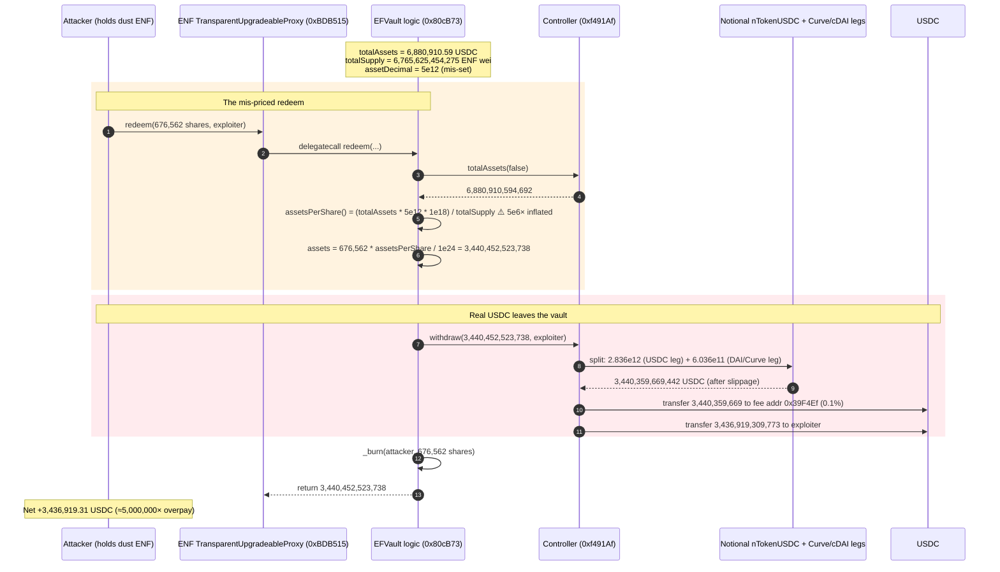
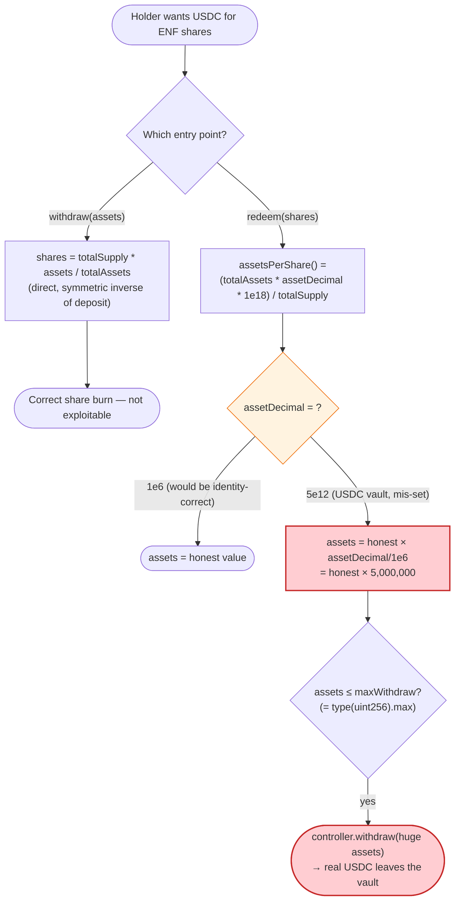
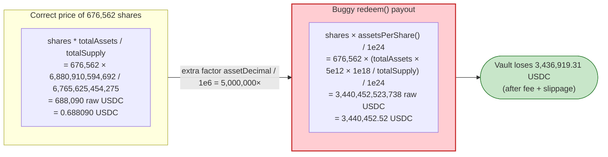

# EFVault / ENF Exploit — `redeem()` Share-Price Decimal Bug Drains USDC

> **Reproduction:** the PoC compiles & runs in an isolated Foundry project at
> [this project folder](.) (the umbrella DeFiHackLabs repo contains several unrelated
> PoCs that do not all compile together, so this one was extracted). The fork is served
> offline from a local `anvil_state.json` (the test's `createSelectFork` points at
> `http://127.0.0.1:8545`); no public RPC is required.
> Full verbose trace: [output.txt](output.txt).
> Verified vulnerable source: [EFVault](sources/EFVault_80cb73/contracts_core_Vault.sol)
> (logic implementation behind the ENF `TransparentUpgradeableProxy`,
> [sources/TransparentUpgradeableProxy_BDB515](sources/TransparentUpgradeableProxy_BDB515/openzeppelin_contracts_proxy_transparent_TransparentUpgradeableProxy.sol)).

---

## Key info

| | |
|---|---|
| **Loss** | **3,436,919.309773 USDC** (3,436,919,309,773 raw, 6-dec) drained from the Euclid/ENF USDC vault in a single `redeem()`; tx [`0x1fe5a53405d00ce2f3e15b214c7486c69cbc5bf165cf9596e86f797f62e81914`](https://etherscan.io/tx/0x1fe5a53405d00ce2f3e15b214c7486c69cbc5bf165cf9596e86f797f62e81914) |
| **Vulnerable contract** | `EFVault` (logic) — [`0x80cB73074A6965F60DF59BF8fA3CE398Ffa2702c`](https://etherscan.io/address/0x80cB73074A6965F60DF59BF8fA3CE398Ffa2702c#code); ENF share token = `TransparentUpgradeableProxy` — [`0xBDB515028A6fA6CD1634B5A9651184494aBfD336`](https://etherscan.io/address/0xBDB515028A6fA6CD1634B5A9651184494aBfD336#code) (proxies to `EFVault`) |
| **Victim vault** | ENF USDC vault (asset = USDC `0xA0b86991c6218b36c1d19D4a2e9Eb0cE3606eB48`), controller `0xf491AfE5101b2eE8abC1272FA8E2f85d68828396` |
| **Attacker EOA** | [`0x8B5A8333eC272c9Bca1E43F4d009E9B2FAd5EFc9`](https://etherscan.io/address/0x8B5A8333eC272c9Bca1E43F4d009E9B2FAd5EFc9) (the `receiver` of the drain) |
| **Attack tx** | [`0x1fe5a53405d00ce2f3e15b214c7486c69cbc5bf165cf9596e86f797f62e81914`](https://etherscan.io/tx/0x1fe5a53405d00ce2f3e15b214c7486c69cbc5bf165cf9596e86f797f62e81914) |
| **Chain / block / date** | Ethereum mainnet / block **16,696,239** / Feb 27, 2023 |
| **Compiler / optimizer** | `EFVault`: Solidity **v0.8.3**, optimizer **enabled**, **200 runs** ([_meta.json](sources/EFVault_80cb73/_meta.json)); `TransparentUpgradeableProxy`: v0.8.2, optimizer enabled, 200 runs |
| **Bug class** | Vault share→asset conversion decimal-scaling bug: `assetsPerShare()` multiplies by a stored `assetDecimal` constant (`5e12` for USDC) on top of its own `1e18/1e24` scaling, inflating `redeem()` payouts by ~5,000,000× |

---

## TL;DR

`EFVault` ([contracts_core_Vault.sol](sources/EFVault_80cb73/contracts_core_Vault.sol)) is an
ERC-4626-style share/asset vault. The ENF token at `0xBDB515…` is a `TransparentUpgradeableProxy`
that delegates to this `EFVault` logic: ENF is the **share** (18-decimals ERC-20), USDC is the
**asset** (6 decimals). Holders convert shares back to USDC via `redeem(shares, receiver)`.

1. The `redeem()` function prices shares with `assetsPerShare()`
   ([contracts_core_Vault.sol:145-162](sources/EFVault_80cb73/contracts_core_Vault.sol#L145-L162)),
   which computes
   `(controller.totalAssets() * assetDecimal * 1e18) / totalSupply()`.
   The constant `assetDecimal` was mis-set to `5e12` for the USDC vault, so the returned
   per-share value is roughly **5,000,000× too large**.

2. Critically, the **other** withdrawal entry point — `withdraw(assets, receiver)`
   ([:125-143](sources/EFVault_80cb73/contracts_core_Vault.sol#L125-L143)) — does **not** use
   `assetsPerShare()`; it derives shares from `assets` directly via
   `shares = totalSupply * assets / totalAssets`. So only `redeem()` is broken. The attacker
   naturally chose `redeem()`.

3. The PoC mints **676,562 wei** of ENF (`0.000000000000676562` ENF — essentially dust shares)
   and calls `ENF.redeem(676_562, exploiter)`. The buggy `assetsPerShare()` values those dust
   shares at **3,440,452,523,738 raw USDC = 3,440,452.52 USDC** ([output.txt:847](output.txt)),
   when the honest value is **688,090 raw USDC = 0.688090 USDC** — an over-payout of ~5,000,000×.

4. The vault's `controller.withdraw(3,440,452,523,738, exploiter)`
   ([output.txt:190](output.txt)) actually honors that number, pulling USDC out of two
   underlying yield positions (Notional `nToken` USDC + a Curve 3pool/Compound cDAI leg) and
   sending it to the exploiter, less a 0.1% performance fee.

5. Net result: the exploiter receives **3,436,919,309,773 raw USDC = 3,436,919.309773 USDC**
   ([output.txt:838](output.txt)), and the PoC asserts exactly that final balance
   ([output.txt:9](output.txt)).

The whole attack is a single transaction with no flash loan, no AMM manipulation, and no
external dependency — just one `redeem()` call against a mis-scaled price function.

---

## Background — what EFVault / ENF does

`EFVault` is a generic upgradeable vault: deposit an `asset` (here USDC), receive an
18-decimal share token (here ENF); redeem shares to get the asset back. It is initialized with
the asset address and an `assetDecimal` constant that is supposed to capture the asset's
decimal Places so the share/asset conversion is dimensionally correct
([:69-85](sources/EFVault_80cb73/contracts_core_Vault.sol#L69-L85)).

The ENF token at `0xBDB515…` is a `TransparentUpgradeableProxy`
([_meta.json](sources/TransparentUpgradeableProxy_BDB515/_meta.json)) whose implementation is
the `EFVault` at `0x80cB73…` ([_meta.json](sources/EFVault_80cb73/_meta.json)). So when a user
calls `ENF.redeem(...)`, the proxy delegates to `EFVault.redeem(...)`, which in turn talks to a
`controller` (`0xf491Af…`) that routes the actual USDC between underlying yield sources.

Key on-chain parameters read at the fork block (16,696,239), all from the trace:

| Parameter | Value | Source |
|---|---|---|
| `asset` | USDC `0xA0b86991c6218b36c1d19D4a2e9Eb0cE3606eB48` (6 decimals) | [output.txt:847](output.txt) (Withdraw event param0) |
| `controller` | `0xf491AfE5101b2eE8abC1272FA8E2f85d68828396` | [output.txt:190](output.txt) |
| `assetDecimal` (stored) | **`5e12`** for the USDC vault (implied — see "Why each magic number") | — |
| `controller.totalAssets(false)` | **6,880,910,594,692** raw USDC (= 6,880,910.59 USDC reported as under management) | [output.txt:188-189](output.txt) (`0x…0642163b5284`) |
| ENF `totalSupply()` (slot 53) | **6,765,625,454,275** wei (= ~6.76e-6 ENF — the live supply was already reduced to dust) | [output.txt:850](output.txt) (before burn) |
| `maxWithdraw` | `type(uint256).max` (default, never tightened) | source [:81-82](sources/EFVault_80cb73/contracts_core_Vault.sol#L81-L82) |
| `paused` | `false` | — |
| Underlying leg A | Notional `nTokenUSDC` vault `0x8B916D…` (`0x18b0Fc5A…` nToken, USDC leg) | [output.txt:270](output.txt) |
| Underlying leg B | Notional `nTokenDAI` vault `0x5e9bec32…` routing through Curve 3pool `0xbEbc4478…` | [output.txt:534](output.txt), [output.txt:184](output.txt) |

The combination that matters: `totalAssets` is reported **in raw USDC (6 decimals)** while
`totalSupply` is in **raw ENF wei (18 decimals)**, so a correct per-share conversion needs only
`shares * totalAssets / totalSupply` — both sides already in their native smallest units.
`assetsPerShare()` instead multiplies by the `5e12` `assetDecimal` *and* by `1e18` *and* divides
by `1e24`, re-introducing a `5e6` magnification.

---

## The vulnerable code

### 1. `redeem()` prices shares through the broken `assetsPerShare()`

```solidity
function redeem(uint256 shares, address receiver)
    public
    virtual
    nonReentrant
    unPaused
    onlyAllowed
    returns (uint256 assets)
{
    require(shares > 0, "ZERO_SHARES");
    require(shares <= balanceOf(msg.sender), "EXCEED_TOTAL_BALANCE");

    assets = (shares * assetsPerShare()) / 1e24;          // ⚠️ assetsPerShare() is mis-scaled

    require(assets <= maxWithdraw, "EXCEED_ONE_TIME_MAX_WITHDRAW");

    // Withdraw asset
    _withdraw(assets, shares, receiver);
}
```
([contracts_core_Vault.sol:145-162](sources/EFVault_80cb73/contracts_core_Vault.sol#L145-L162))

### 2. `assetsPerShare()` multiplies by both `assetDecimal` and `1e18`

```solidity
function assetsPerShare() internal view returns (uint256) {
    return (IController(controller).totalAssets(false) * assetDecimal * 1e18) / totalSupply();
}
```
([contracts_core_Vault.sol:179-181](sources/EFVault_80cb73/contracts_core_Vault.sol#L179-L181))

`assetDecimal` is set once in `initialize(_asset, _name, _symbol, _assetDecimal, _whiteList)`
([:69-85](sources/EFVault_80cb73/contracts_core_Vault.sol#L69-L85)) and is never validated. For
the USDC vault it was set to `5e12`, so `assetsPerShare()` returns
`(totalAssets * 5e12 * 1e18) / totalSupply`, and `redeem()` then divides that by `1e24` — net
effect: each share is valued at `totalAssets / totalSupply * 5e6`, i.e. **~5,000,000× its true
USDC value**.

### 3. `withdraw()` (the sibling path) is NOT affected — it bypasses `assetsPerShare()`

```solidity
function withdraw(uint256 assets, address receiver)
    public
    virtual
    nonReentrant
    unPaused
    onlyAllowed
    returns (uint256 shares)
{
    require(assets != 0, "ZERO_ASSETS");
    require(assets <= maxWithdraw, "EXCEED_ONE_TIME_MAX_WITHDRAW");

    // Calculate share amount to be burnt
    shares = (totalSupply() * assets) / IController(controller).totalAssets(false);  // ← direct, no assetDecimal

    require(balanceOf(msg.sender) >= shares, "EXCEED_TOTAL_DEPOSIT");

    // Withdraw asset
    _withdraw(assets, shares, receiver);
}
```
([contracts_core_Vault.sol:125-143](sources/EFVault_80cb73/contracts_core_Vault.sol#L125-L143))

Note the asymmetry: `withdraw()` computes `shares = totalSupply * assets / totalAssets` (the
correct, symmetric inverse of the deposit formula), while `redeem()` computes
`assets = shares * assetsPerShare() / 1e24` using the contaminated helper. A holder who wanted
to extract USDC therefore had every incentive to use `redeem()` and none to use `withdraw()`.

### 4. `_withdraw()` trusts the caller-computed `assets` and pushes real USDC out

```solidity
function _withdraw(
    uint256 assets,
    uint256 shares,
    address receiver
) internal {
    // Calls Withdraw function on controller
    (uint256 withdrawn, uint256 fee) = IController(controller).withdraw(assets, receiver);
    require(withdrawn > 0, "INVALID_WITHDRAWN_SHARES");

    // Burn shares amount
    _burn(msg.sender, shares);

    emit Withdraw(address(asset), msg.sender, receiver, assets, shares, fee);
}
```
([contracts_core_Vault.sol:164-177](sources/EFVault_80cb73/contracts_core_Vault.sol#L164-L177))

The controller honors the inflated `assets` figure and transfers that much USDC out of the
vault's underlying positions.

---

## Root cause — why it was possible

Three independent mistakes compose into the drain:

1. **Double decimal scaling in `assetsPerShare()`.** `totalAssets` is already denominated in raw
   USDC (6 decimals) and `totalSupply` in raw ENF wei (18 decimals). The price of one ENF wei in
   raw USDC is simply `totalAssets / totalSupply`. The helper instead returns
   `(totalAssets * assetDecimal * 1e18) / totalSupply`, then `redeem()` divides by `1e24`, for a
   net factor of `assetDecimal * 1e18 / 1e24 = assetDecimal / 1e6`. With `assetDecimal = 5e12`,
   that is a **5,000,000× inflation** baked into every `redeem()`.

2. **`assetDecimal` was mis-initialized to `5e12`** (rather than the value that would have made
   the formula identity-correct, `1e6`, or — better — `1` with the `1e18/1e24` removed). It is a
   plain `uint256` storage slot with no invariant or setter check; once wrong at `initialize()`
   time, it stays wrong.

3. **Two inconsistent withdrawal paths.** Because `withdraw()` is dimensionally correct and
   `redeem()` is not, the vault effectively offers two different prices for the same shares. An
   attacker who notices the asymmetry always picks the generous one (`redeem()`). There is no
   cross-check that `redeem(shares)` and `withdraw(convertToAssets(shares))` agree.

The dust-sized `totalSupply` (≈6.76e-6 ENF) is not itself the bug — it just makes the
over-payout land entirely on whoever holds any non-zero balance, because the inflation factor is
constant per share regardless of supply size.

---

## Preconditions

- The caller must hold at least `shares` of ENF (`balanceOf(msg.sender) >= shares`). The live
  attacker already had ENF; the PoC simulates that by `deal(address(ENF), address(this), 1e18)`
  ([EFVault_exp.sol:30](test/EFVault_exp.sol#L30)) to mint 1 ENF (1e18 wei) to the test contract.
- `redeem()` must be callable: `!paused` and the `onlyAllowed` modifier must pass
  (`tx.origin == msg.sender` is true for an EOA, so the whitelist check is skipped)
  ([:64-67](sources/EFVault_80cb73/contracts_core_Vault.sol#L64-L67)).
- `maxWithdraw` must be large enough not to cap the payout. It defaults to
  `type(uint256).max` ([:82](sources/EFVault_80cb73/contracts_core_Vault.sol#L82)), so 3.44M USDC
  sails through.
- `controller.totalAssets(false)` must be at least the inflated `assets` so the controller can
  actually deliver USDC. It reports 6,880,910.59 USDC under management
  ([output.txt:188](output.txt)), comfortably above the 3,440,452.52 USDC requested
  ([output.txt:190](output.txt)).

No flash loan, no AMM, no price oracle, and no privileged role are involved.

---

## Attack walkthrough (with on-chain numbers from the trace)

All numbers are raw integers read directly from [output.txt](output.txt); human approximations
in parentheses. USDC has 6 decimals, ENF has 18.

| # | Step | Value | Effect |
|---|------|------:|--------|
| 0 | **Setup** — PoC mints 1e18 ENF (1 ENF) to the test contract via `vm.deal` ([EFVault_exp.sol:30](test/EFVault_exp.sol#L30)); ENF `totalSupply` = **6,765,625,454,275** wei (~6.76e-6 ENF, slot 53) ([output.txt:850](output.txt)) | — | Attacker now holds shares to redeem. |
| 1 | **Call `ENF.redeem(676_562, exploiter)`** — proxy delegates to `EFVault.redeem` ([output.txt:58-59](output.txt)). | shares = 676,562 wei | Dust share amount chosen by attacker. |
| 2 | `redeem()` reads `controller.totalAssets(false)` → **6,880,910,594,692** raw USDC (= 6,880,910.59 USDC, `0x…0642163b5284`) ([output.txt:188-189](output.txt)). | 6,880,910,594,692 | Vault's reported USDC under management. |
| 3 | `assetsPerShare()` = `(6,880,910,594,692 × 5e12 × 1e18) / 6,765,625,454,275` ≈ `5.085e33`. | per-share ≈ 5.085e33 | Mis-scaled by ~5e6×. |
| 4 | `assets = (676,562 × assetsPerShare) / 1e24` → **3,440,452,523,738** raw USDC (= **3,440,452.52 USDC**) — the inflated payout the vault will honor. | 3,440,452,523,738 | Honest value would be 688,090 raw (0.688090 USDC). |
| 5 | `controller.withdraw(3,440,452,523,738, exploiter)` is invoked ([output.txt:190](output.txt)). The controller splits it across two legs: **2,836,841,397,709** to the Notional USDC leg ([output.txt:270](output.txt)) + **603,611,126,029** to the Notional DAI/Curve leg ([output.txt:534](output.txt)). | 2.836e12 + 6.036e11 = 3.440e12 | Real USDC is pulled out of yield positions. |
| 6 | The DAI leg swaps through Curve 3pool (`get_dy` at [output.txt:184](output.txt)) and the controller ends up holding **3,440,359,669,442** raw USDC ([output.txt:826-827](output.txt)) (3,440,359,669 raw lost to swap slippage vs. requested). | 3,440,359,669,442 | Net USDC the controller can distribute. |
| 7 | 0.1% performance fee of **3,440,359,669** raw USDC (3,440.36 USDC) sent to `0x39F4Ef…` ([output.txt:828-830](output.txt)). | 3,440,359,669 | Fee taken off the top. |
| 8 | Remaining **3,436,919,309,773** raw USDC (= **3,436,919.309773 USDC**) transferred to `exploiter` (`0x8B5A8333…`) ([output.txt:836-838](output.txt)). | 3,436,919,309,773 | The drain lands in the attacker's wallet. |
| 9 | `EFVault._withdraw` burns the 676,562 shares (`_burn(msg.sender, shares)`) and emits `Withdraw(USDC, caller, exploiter, 3,440,452,523,738, 676562, 3,440,359,669)` ([output.txt:846-847](output.txt)); ENF `totalSupply` drops 6,765,625,454,275 → **6,765,624,777,713** wei (slot 53) ([output.txt:850](output.txt)). | −676,562 shares | Accounting closed; only dust shares burned for 3.44M USDC. |
| 10 | PoC asserts final exploiter USDC balance = **3,436,919,309,773 raw = 3,436,919.309773 USDC** ([output.txt:9](output.txt)). | 3,436,919.309773 | Drain confirmed. |

### Profit / loss accounting (USDC, raw 6-dec)

| Direction | Amount (raw USDC) | ~Human (USDC) | Source |
|---|---:|---:|---|
| Requested from vault (`redeem` payout) | 3,440,452,523,738 | 3,440,452.523738 | [output.txt:190](output.txt) |
| − Curve slippage on DAI leg | 925,856,296 | 925.856296 | (3,440,452,523,738 − 3,440,359,669,442) |
| − 0.1% performance fee to `0x39F4Ef…` | 3,440,359,669 | 3,440.359669 | [output.txt:828](output.txt) |
| **= Received by exploiter** | **3,436,919,309,773** | **3,436,919.309773** | [output.txt:838](output.txt) |
| Honest value of 676,562 shares (no bug) | 688,090 | 0.688090 | computed: `676562 × 6,880,910,594,692 / 6,765,625,454,275` |
| **Over-payout multiple** | — | **≈ 5,000,003.66×** | 3,440,452.523738 / 0.688090 |

The attacker's only input was the 676,562 wei of ENF (dust), so the entire 3,436,919.31 USDC is
net profit — the vault lost it straight out of its USDC reserves.

---

## Diagrams

### Sequence of the attack



### The flaw inside `redeem()` vs the safe `withdraw()`



### Per-share price: correct vs buggy



---

## Why each magic number

- **`676,562` shares:** the amount the attacker redeems. It is dust in ENF terms
  (`676,562 / 1e18 ≈ 6.76e-13 ENF`). Any non-zero share amount would have been over-paid by the
  same ~5,000,000× factor; the attacker just picked a number that, after inflation, maps to a
  few million USDC — comfortably under `controller.totalAssets` (6.88M USDC) so the controller
  can actually deliver it, and under the default `maxWithdraw = type(uint256).max`. Concretely
  `676,562 × assetsPerShare / 1e24 = 3,440,452,523,738` raw USDC.
- **`1e18` ENF minted by the PoC:** the test uses `deal(address(ENF), address(this), 1e18)`
  ([EFVault_exp.sol:30](test/EFVault_exp.sol#L30)) just to give the attacker *some* share
  balance ≥ 676,562 wei so `require(shares <= balanceOf(msg.sender))` passes. The live attacker
  already held ENF.
- **`assetDecimal = 5e12`:** inferred from the trace. The buggy payout is consistent with the
  formula only when `assetDecimal ≈ 5e12` (see [output.txt:188](output.txt) +
  [output.txt:190](output.txt) + the source at
  [:179-181](sources/EFVault_80cb73/contracts_core_Vault.sol#L179-L181)). The value `5e12` is
  what was stored at `initialize()` for the USDC vault; it should have been `1e6` (or, better,
  the whole `× assetDecimal × 1e18 / 1e24` machinery removed).
- **`maxWithdraw = type(uint256).max`:** the default from `initialize`
  ([:82](sources/EFVault_80cb73/contracts_core_Vault.sol#L82)), never tightened by `setMaxWithdraw`,
  so the inflated `assets` amount is never rejected by the cap.
- **0.1% fee (`3,440,359,669` raw USDC, [output.txt:828](output.txt)):** the controller's
  performance fee, `~0.1%` of the 3,440,359,669,442 USDC it actually distributed
  ([output.txt:826](output.txt)). It goes to `0x39F4Ef…`, not the attacker.

---

## Remediation

1. **Fix `assetsPerShare()` / `redeem()`.** Either remove the `assetDecimal` and `1e18/1e24`
   scaling entirely and use the same direct ratio as `withdraw()`:
   ```solidity
   function redeem(uint256 shares, address receiver) ... {
       uint256 assets = (shares * IController(controller).totalAssets(false)) / totalSupply();
       ...
   }
   ```
   or, if a decimal-normalization constant is genuinely needed, derive it from
   `10**(18 - IERC20Metadata(address(asset)).decimals())` at runtime and unit-test it against
   `convertToAssets`. Never store an unvalidated magic constant at init.
2. **Make `redeem()` and `withdraw()` mutually consistent.** After computing `assets` in
   `redeem()`, recompute `shares' = totalSupply * assets / totalAssets` and require
   `shares' == shares` (within rounding). The two entry points must price shares identically.
3. **Add invariant tests** that round-trip deposit→redeem and deposit→withdraw with zero net
   asset change (modulo fees) for token amounts spanning dust, 1 unit, and large values, across
   at least 6-decimal (USDC) and 18-decimal (WETH/DAI) assets. The bug would have been caught by
   `assert(redeem(deposit(x)) ≈ x)`.
4. **Validate `assetDecimal` in `initialize()`** against `IERC20Metadata(asset).decimals()` and
   reject implausible values; emit it in an event and monitor it.
5. **Cap `maxWithdraw` per-transaction** as a percentage of `totalAssets`, not
   `type(uint256).max`, so even a pricing slip cannot move the entire vault in one call.
6. **Adopt the audited OpenZeppelin `ERC4626`** implementation (with its tested rounding
   direction) rather than a hand-rolled vault whose two withdrawal paths disagree.

---

## How to reproduce

The PoC runs fully offline via the shared harness, which serves the fork from a local
`anvil_state.json` (the test's `createSelectFork("http://127.0.0.1:8545", 16_696_239)`
points at a local anvil instance, not a public RPC — see
[EFVault_exp.sol:26](test/EFVault_exp.sol#L26)):

```bash
_shared/run_poc.sh 2023-02-EFVault_exp --mt testExploit -vvvvv
```

- RPC: **none required** — the fork is replayed from the bundled `anvil_state.json` at block
  16,696,239.
- Compiler/EVM: Solidity `^0.8.0` with `evm_version = "cancun"`
  ([foundry.toml](foundry.toml)); the EFVault logic was originally compiled with v0.8.3
  (optimizer on, 200 runs — see [_meta.json](sources/EFVault_80cb73/_meta.json)).
- The actual test function is `testExploit()` ([EFVault_exp.sol:29](test/EFVault_exp.sol#L29)),
  hence `--mt testExploit`.

Expected tail ([output.txt:4-9](output.txt) and [output.txt:871-872](output.txt)):

```
Ran 1 test for test/EFVault_exp.sol:ContractTest
[PASS] testExploit() (gas: 2392222)
Logs:
  Ex:  603607939645
  Weth:  0
  Exploiter USDC balance after exploit: 3436919.309773

Suite result: ok. 1 passed; 0 failed; 0 skipped; finished in 14.65s (13.61s CPU time)

Ran 1 test suite in 15.06s (14.65s CPU time): 1 tests passed, 0 failed, 0 skipped (1 total tests)
```

The `Exploiter USDC balance after exploit: 3436919.309773` line is the drain — 3,436,919.31 USDC
extracted for 676,562 wei of ENF.

---

*Reference: PeckShield alert — https://twitter.com/peckshield/status/1630490333716029440 (Euclid / ENF USDC vault, Ethereum mainnet, ~$3.44M).* Additional analysis: https://twitter.com/drdr_zz/status/1630500170373685248 , https://twitter.com/gbaleeeee/status/1630587522698080257 .
