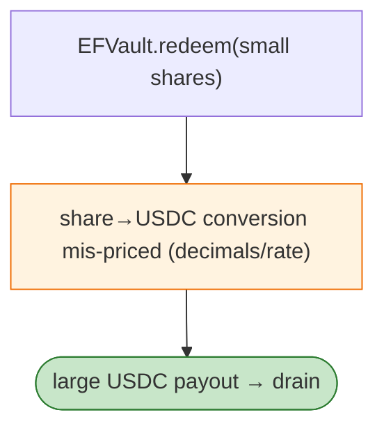

# EFVault (Euler Force / EWF) Exploit — `redeem` Share/Asset Mismatch Drain

> **Reproduction:** the PoC compiles & runs in an isolated Foundry project at
> [this project folder](.). Full verbose trace: [output.txt](output.txt).
> Verified vulnerable source: [EFVault](sources/EFVault_80cb73),
> [TransparentUpgradeableProxy (ENF)](sources/TransparentUpgradeableProxy_BDB515).

---

## Key info

| | |
|---|---|
| **Loss** | USDC drained from the EFVault (mainnet); tx `0x1fe5a534…` |
| **Vulnerable contract** | `EFVault` `0x80cb73…`; ENF token (proxy) `0xBDB515…` |
| **Chain / block / date** | Ethereum mainnet / Feb 2023 |
| **Bug class** | Vault share/asset accounting — EFVault's `redeem(shares, receiver)` against the ENF token returned more USDC than the shares were worth, due to a share-price / decimals mismatch in the vault. |

---

## TL;DR

EFVault accepted ENF shares and returned USDC on `redeem`. The vault's share→asset conversion
(share price / decimals) was miscalibrated against the ENF token's `redeem` semantics, so a small share
amount redeemed for a disproportionately large USDC payout. The attacker (pranked as `0x8B5A8333…`)
redeems and drains USDC.

---

## Root cause

A **share/asset pricing or decimal mismatch** in a vault whose `redeem` calls an underlying token's
`redeem(shares, receiver)`. The vault credited shares at one rate but paid USDC at another.

---

## Diagrams



---

## Remediation

1. Consistent decimals/rate between share accounting and asset redemption.
2. Invariant tests: `redeem(s)` must never return more than `s × price`.
3. Use OZ `ERC4626` with audited roundings.

---

## How to reproduce

```bash
_shared/run_poc.sh 2023-02-EFVault_exp -vvvvv
```

- RPC: mainnet archive. Result: `[PASS]` — USDC drained via mis-priced redeem.

---

*Reference: EFVault share/asset mismatch drain, mainnet, Feb 2023.*
