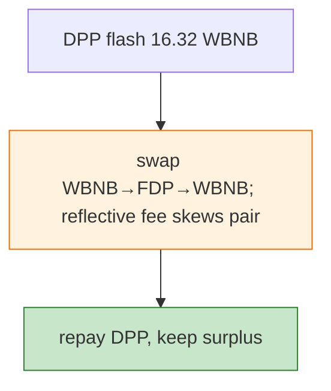

# FDP (FireDrake) Exploit — Reflective Token Pair Drain (DODO Flash)

> **Reproduction:** the PoC compiles & runs in an isolated Foundry project at
> [this project folder](.). Full verbose trace: [output.txt](output.txt).
> Verified vulnerable source: [FIREDRAKE](sources/FIREDRAKE_1954b6),
> [PancakePair](sources/PancakePair_6db820).

---

## Key info

| | |
|---|---|
| **Loss** | WBNB drained from FDP/WBNB pair (BSC); tx `0x09925028…` |
| **Vulnerable contract** | FDP (reflective ERC20) `0x1954b6bd…`; FDP/WBNB pair `0x6db8209C…` |
| **Flash source** | DPPOracle `0xFeAFe253…` (16.32 WBNB) |
| **Chain / block / date** | BSC / 25,430,418 / Feb 2023 |
| **Bug class** | Reflective-token fee accounting — FDP's transfer fees leave the pair's reserves inconsistent; flash + swap harvests WBNB. |

---

## TL;DR

Flash-borrow 16.32 WBNB from DPP, swap into FDP and back; FDP's reflective fee accounting means the
pair's effective reserves diverge from `balanceOf`, so the round-trip nets WBNB. Repay DPP, keep the
surplus.

---

## Root cause

A **reflective/fee-on-transfer token in a vanilla Pancake pair** — fees mutate balances the pair cannot
reconcile, breaking `k`.

---

## Diagrams



---

## Remediation

1. Fee-aware AMM pairs or wrap reflective tokens.
2. `k` on received amounts.

---

## How to reproduce

```bash
_shared/run_poc.sh 2023-02-FDP_exp --mt testHack -vvvvv
```

- RPC: BSC archive (block 25,430,418). Result: `[PASS]` — WBNB surplus.

---

*Reference: FDP/FireDrake reflective-token pair drain, BSC, Feb 2023.*
