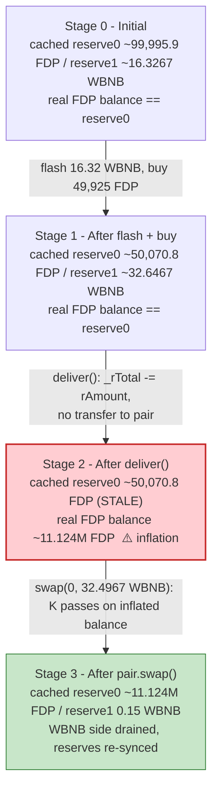
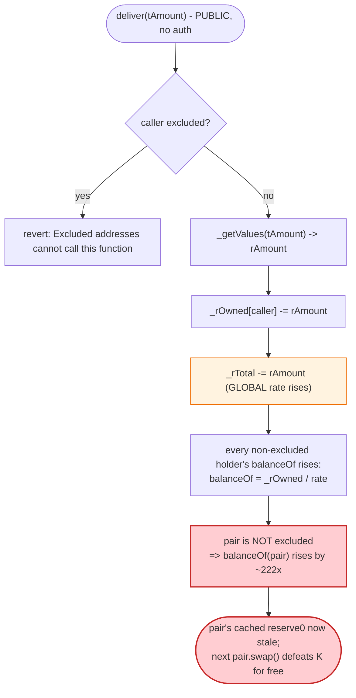
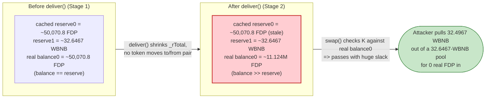

# FDP (FireDrake) Exploit — Reflective-Token `deliver()` Inflates the AMM Pair's Balance

> **Vulnerability classes:** vuln/defi/slippage · vuln/logic/incorrect-state-transition

> **Reproduction:** the PoC compiles & runs in an isolated Foundry project at
> [this project folder](.). Full verbose trace: [output.txt](output.txt).
> Verified vulnerable source: [FIREDRAKE.sol](sources/FIREDRAKE_1954b6/FIREDRAKE.sol)
> (the reflective ERC20), [PancakePair.sol](sources/PancakePair_6db820/PancakePair.sol)
> (the victim AMM pair).

---

## Key info

| | |
|---|---|
| **Loss** | **~16.18 WBNB** drained from the FDP/WBNB PancakeSwap pair (the PoC prints `Attacker's profit: 16 WBNB`; the exact recovered surplus is 16,176,701,609,462,839,506 wei ≈ 16.1767 WBNB) |
| **Vulnerable contract** | FDP (reflective ERC20 "FIREDRAKE PROTOCOL") — [`0x1954b6bd198c29c3ecF2D6F6bc70A4D41eA1CC07`](https://bscscan.com/address/0x1954b6bd198c29c3ecF2D6F6bc70A4D41eA1CC07#code) |
| **Victim pool** | FDP/WBNB PancakeSwap pair — [`0x6db8209C3583E7Cecb01d3025c472D1eDDBE49F3`](https://bscscan.com/address/0x6db8209C3583E7Cecb01d3025c472D1eDDBE49F3) |
| **Flash source** | DPP (`DPPOracle`) — `0xFeAFe253802b77456B4627F8c2306a9CeBb5d681` (16.32 WBNB) |
| **Attacker EOA** | [`0xc726bD0e973722e17eb088b8fcfedaa931fa0293`](https://bscscan.com/address/0xc726bd0e973722e17eb088b8fcfedaa931fa0293) |
| **Attacker contract** | [`0xe02970bd38b283c3079720c1e71001abe001bc83`](https://bscscan.com/address/0xe02970bd38b283c3079720c1e71001abe001bc83) |
| **Attack tx** | [`0x09925028ce5d6a54801d04ff8f39e79af6c24289e84b301ddcdb6adfa51e901b`](https://bscscan.com/tx/0x09925028ce5d6a54801d04ff8f39e79af6c24289e84b301ddcdb6adfa51e901b) |
| **Chain / block / date** | BSC / 25,430,418 / Feb 2023 |
| **Compiler** | FDP: Solidity **v0.6.12**, optimizer **disabled** (200 runs); PancakePair: v0.5.16, optimizer disabled; DPPOracle: v0.6.9, optimizer enabled (200 runs) |
| **Bug class** | Reflective / charge-token dual-ledger `deliver()` desyncs the AMM pair's `balanceOf` from its cached reserves, breaking `x·y = k` |

---

## TL;DR

`FDP` ([source](sources/FIREDRAKE_1954b6/FIREDRAKE.sol)) is a *reflective* (a.k.a. "t-token / r-token") BEP20: it keeps two ledgers per
address — an r-space balance (`_rOwned`) and a t-space balance (`_tOwned`) — and exposes `balanceOf` as
`_rOwned[addr] / rate`, where `rate = rSupply / tSupply`. The public, permissionless `deliver(tAmount)`
function ([FIREDRAKE.sol:571-578](sources/FIREDRAKE_1954b6/FIREDRAKE.sol#L571-L578)) lets **any holder "donate" tokens to all other holders**: it subtracts `rAmount`
from the caller's `_rOwned` and shrinks the global `_rTotal` by the same `rAmount`, which permanently
raises `rate` and therefore raises **every other non-excluded holder's `balanceOf`**.

The PancakeSwap FDP/WBNB pair holds FDP in r-space (it is **not** excluded), so its `balanceOf(pair)`
is derived from `_rOwned[pair] / rate`. Calling `deliver()` does **not** move any token out of the pair,
yet it inflates the pair's reported FDP balance. The pair, however, has cached its reserves
(`reserve0`/`reserve1`) at their old values. That creates an arbitrage: the inflated real balance
satisfies the `K` invariant against the *stale* cached reserves, so a direct `pair.swap()` call can pull
WBNB out for "free".

The attack, reproduced exactly by the PoC:

1. **Flash-borrow 16.32 WBNB** from DPP ([output.txt:1552](output.txt)).
2. **Buy FDP** through the router with the full 16.32 WBNB, receiving **49,925 FDP** ([output.txt:1583-1585](output.txt)). This thins the pool's FDP reserve to ~50,070 FDP and loads it to ~32.65 WBNB.
3. **Call `FDP.deliver(28,463.16 ether)`** from the attack contract ([output.txt:1614](output.txt)). The
   pair's FDP `balanceOf` jumps from ~50,070 to **~11.12 million FDP** ([output.txt:1621-1622](output.txt)) —
   a ~222× inflation produced by the reflection arithmetic, while the pair's cached `reserve0` is still
   ~50,070.
4. **Call `pair.swap(0, 32.497 WBNB, attacker, "")`** directly ([output.txt:1630](output.txt)). Because the
   real FDP balance (~11.12M) dwarfs the cached reserve (~50,070), the `balance0Adjusted · balance1Adjusted
   ≥ reserve0 · reserve1 · 1e8` check passes trivially. The pair sends out **32.4967 WBNB** and re-syncs
   its reserves down to FDP ~11.12M / **0.15 WBNB** ([output.txt:1641](output.txt)).
5. **Repay 16.32 WBNB** to DPP; keep the **16.1767 WBNB** surplus ([output.txt:1646, 1654](output.txt)).

Net profit: **16.1767 WBNB** (the PoC logs `Attacker's profit: 16 WBNB` after integer-dividing by 1e18).

---

## Background — what FDP / FireDrake is

`FDP` is the "FIREDRAKE PROTOCOL" token — a vanilla clone of the **reflective-token** template (the same
`deliver`/`reflectionFromToken`/`tokenFromReflection`/`_getRate`/`_rOwned`/`_tOwned` pattern popularised
by older "Rfi" tokens like Reflect Finance and SafeMoon's predecessor). Its accounting model:

- **t-space** is the "human" token amount space (`_tTotal = 1e15 * 1e8 = 1e23` raw, i.e. 1 quadrillion FDP
  at 8 decimals — [FIREDRAKE.sol:445](sources/FIREDRAKE_1954b6/FIREDRAKE.sol#L445)).
- **r-space** is an enlarged mirror space (`_rTotal = MAX - MAX % _tTotal`, ~1.15e77
  — [FIREDRAKE.sol:446](sources/FIREDRAKE_1954b6/FIREDRAKE.sol#L446)).
- Each non-excluded address holds `_rOwned[addr]` r-units. Its `balanceOf` is
  `tokenFromReflection(_rOwned[addr]) = _rOwned[addr] / rate`, where `rate = rSupply / tSupply`
  ([FIREDRAKE.sol:490-493, 591-594, 760-763](sources/FIREDRAKE_1954b6/FIREDRAKE.sol#L490-L493)).
- Excluded addresses (typically the token contract itself and reward wallets) hold explicit `_tOwned` and
  bypass the rate conversion.
- A fraction of every transfer is "reflected" to all holders by **shrinking `_rTotal`** (raising `rate`),
  so holders' balances drift upward over time without any explicit credit. `_taxFee` and `_burnFee` were
  both set to **0** at the fork block ([FIREDRAKE.sol:454-455](sources/FIREDRAKE_1954b6/FIREDRAKE.sol#L454-L455)),
  so normal transfers were fee-less — but the reflection machinery (and `deliver()`) was still live.

On-chain parameters at the fork block (block 25,430,418), read from the trace:

| Parameter | Value | Source |
|---|---|---|
| FDP `_tTotal` (total supply) | 100,000,000,000,000 × 10⁸ = 1e23 raw (1e15 FDP) | [FIREDRAKE.sol:445](sources/FIREDRAKE_1954b6/FIREDRAKE.sol#L445) |
| FDP `_decimals` | 8 | [FIREDRAKE.sol:443](sources/FIREDRAKE_1954b6/FIREDRAKE.sol#L443) |
| `_taxFee` / `_burnFee` | 0 / 0 (no transfer tax at fork) | [FIREDRAKE.sol:454-455](sources/FIREDRAKE_1954b6/FIREDRAKE.sol#L454-L455) |
| Pair `_token0` / `_token1` | FDP / WBNB (so `reserve0` = FDP, `reserve1` = WBNB) | inferred from Swap events ([output.txt:1595](output.txt)) |
| Pair `reserve0` (FDP) pre-attack | 99,995,897,288,241,500,535,820 wei (~99,995.9 FDP) | `getReserves()` [output.txt:1580](output.txt) |
| Pair `reserve1` (WBNB) pre-attack | 16,326,701,609,462,839,506 wei (~16.3267 WBNB) | `getReserves()` [output.txt:1580](output.txt) |
| DPP flash loan drawn | 16.32 WBNB (16,320,000,000,000,000,000 wei) | [output.txt:1552](output.txt) |

The whole exploit turns on the gap between the pair's **cached reserves** and its **real `balanceOf`** for
the reflective token, which `deliver()` widens at will.

---

## The vulnerable code

### 1. `deliver()` — the public "donate-to-holders" entry point

```solidity
function deliver(uint256 tAmount) public {
    address sender = _msgSender();
    require(!_isExcluded[sender], "Excluded addresses cannot call this function");
    (uint256 rAmount,,,,,) = _getValues(tAmount);
    _rOwned[sender] = _rOwned[sender].sub(rAmount);
    _rTotal = _rTotal.sub(rAmount);
    _tFeeTotal = _tFeeTotal.add(tAmount);
}
```
([FIREDRAKE.sol:571-578](sources/FIREDRAKE_1954b6/FIREDRAKE.sol#L571-L578))

`deliver()` is **permissionless**. It removes `rAmount` of *reflection* units from the caller and burns
them out of the global `_rTotal`. That single line — `_rTotal = _rTotal.sub(rAmount)` — permanently raises
the conversion `rate` for **every** non-excluded holder, because `balanceOf` divides by `rate`. The AMM
pair is a non-excluded holder, so its `balanceOf` jumps upward the instant `deliver()` runs, even though
no FDP was transferred to or from the pair.

### 2. `balanceOf` is reflection-derived for the pair

```solidity
function balanceOf(address account) public view override returns (uint256) {
    if (_isExcluded[account]) return _tOwned[account];
    return tokenFromReflection(_rOwned[account]);
}

function tokenFromReflection(uint256 rAmount) public view returns(uint256) {
    require(rAmount <= _rTotal, "Amount must be less than total reflections");
    uint256 currentRate = _getRate();
    return rAmount.div(currentRate);
}
```
([FIREDRAKE.sol:490-493, 591-595](sources/FIREDRAKE_1954b6/FIREDRAKE.sol#L490-L495))

Because the pair is not in `_isExcluded`, `IERC20(FDP).balanceOf(pair)` returns
`_rOwned[pair] / rate`. After `deliver()` shrinks `_rTotal`, `rate` rises and the pair's reported FDP
balance rises with it — independently of any real deposit.

### 3. The pair's `swap()` checks the `K` invariant against real balances, but its cached reserves are stale

```solidity
function swap(uint amount0Out, uint amount1Out, address to, bytes calldata data) external lock {
    require(amount0Out > 0 || amount1Out > 0, 'Pancake: INSUFFICIENT_OUTPUT_AMOUNT');
    (uint112 _reserve0, uint112 _reserve1,) = getReserves(); // gas savings
    require(amount0Out < _reserve0 && amount1Out < _reserve1, 'Pancake: INSUFFICIENT_LIQUIDITY');
    ...
    balance0 = IERC20(_token0).balanceOf(address(this));   // ← inflated FDP balance after deliver()
    balance1 = IERC20(_token1).balanceOf(address(this));
    ...
    uint amount0In = balance0 > _reserve0 - amount0Out ? balance0 - (_reserve0 - amount0Out) : 0;
    uint amount1In = balance1 > _reserve1 - amount1Out ? balance1 - (_reserve1 - amount1Out) : 0;
    require(amount0In > 0 || amount1In > 0, 'Pancake: INSUFFICIENT_INPUT_AMOUNT');
    {
    uint balance0Adjusted = (balance0.mul(10000).sub(amount0In.mul(25)));
    uint balance1Adjusted = (balance1.mul(10000).sub(amount1In.mul(25)));
    require(balance0Adjusted.mul(balance1Adjusted) >= uint(_reserve0).mul(_reserve1).mul(10000**2), 'Pancake: K');
    }
    _update(balance0, balance1, _reserve0, _reserve1);
    emit Swap(msg.sender, amount0In, amount1In, amount0Out, amount1Out, to);
}
```
([PancakePair.sol:452-480](sources/PancakePair_6db820/PancakePair.sol#L452-L480))

The `K` check compares `balance0` (the *real, post-`deliver()`-inflated* FDP balance) against the cached
`_reserve0`. After `deliver()` inflates `balance0` by ~222× while `_reserve0` is still the pre-`deliver`
value, the invariant holds trivially even though no real FDP entered the pool. `_update` then re-syncs
the cached reserves to the new (inflated) balances, locking in the theft.

---

## Root cause — why it was possible

A Uniswap-V2/PancakeSwap pair treats the token contracts it trades as **dumb ERC20s**: it reads
`IERC20(token).balanceOf(this)` and assumes the only way that balance changes is through transfers it
mediates (`mint`/`burn`/`swap`/external transfer + `skim`/`sync`). It then enforces the constant-product
invariant `x·y ≥ k` by comparing the *current* balance against the *cached* reserves.

A reflective token violates that assumption: `balanceOf` is **not** a stored balance — it is a derived
quantity `_rOwned[addr] / rate`, and `rate` can be manipulated by **any** third party calling `deliver()`.
`deliver()` is the canonical "donate to all holders" affordance of the Rfi template: it lets a holder
irrevocably give up some of their own reflection to inflate everyone else's balances.

Putting a reflective token inside a vanilla PancakeSwap pair is therefore intrinsically broken, because:

1. The pair's `balanceOf(FDP)` is a moving target the pair does not control and cannot observe between
   swaps.
2. `deliver()` can be called by **anyone** — the attacker doesn't even need to interact with the pair
   directly to alter its reserves-equivalent.
3. The pair only re-checks `K` *inside* `swap()`, against whatever `balanceOf` returns at that moment.
   So the attacker first inflates `balanceOf(pair)` via `deliver()`, *then* calls `swap()` — the inflated
   balance satisfies `K` against the stale reserve, and WBNB leaves the pool for nothing.

This is the same family as every "reflective / fee-on-transfer token in an unguarded V2 pair" incident:
the AMM's invariant is checked against a balance that the token contract can mutate out from under it.

---

## Preconditions

- A reflective-token pair where the pair contract is **not** in the token's `_isExcluded` set (true at the
  fork — the only hard-coded exclusion in `excludeAccount` is the PancakeRouter,
  [FIREDRAKE.sol:597-598](sources/FIREDRAKE_1954b6/FIREDRAKE.sol#L597-L598); the pair itself is not
  excluded).
- The public `deliver()` is unguarded (no whitelist, no per-call cap) — always true for this contract.
- Working capital to buy FDP and to call `deliver()` (the caller must hold enough `_rOwned` to cover the
  `rAmount` that `deliver()` subtracts). Here the attacker bought 49,925 FDP and then delivered a `tAmount`
  of 28,463.16 "ether" (raw 28,463,160,000,000,000,000,000 t-units). The whole position is flash-funded
  with **16.32 WBNB** from DPP and repaid in the same transaction, so the attacker needed **zero upfront
  capital**.

---

## Attack walkthrough (with on-chain numbers from the trace)

The pair's `token0 = FDP`, `token1 = WBNB`, so `reserve0 = FDP` and `reserve1 = WBNB`. All figures are
taken directly from the `getReserves` returns, the `Sync`/`Swap`/`Transfer` events, and the
`balanceOf`/`deliver` calls in [output.txt](output.txt). Raw wei first, human approximation in parentheses
(FDP is 8-decimal, WBNB is 18-decimal).

| # | Step | FDP reserve / pair balance | WBNB reserve / pair balance | Effect |
|---|------|---------------------------:|-----------------------------:|--------|
| 0 | **Initial state** — `getReserves()` returns `reserve0 = 0x152cc9d81eaf81523c0c`, `reserve1 = 0xe294189c79d4b8d2` ([output.txt:1580](output.txt)) | 99,995,897,288,241,500,535,820 (~99,995.9 FDP) | 16,326,701,609,462,839,506 (~16.3267 WBNB) | Honest, balanced pool. |
| 1 | **Flash-borrow 16.32 WBNB** from DPP — `DPP.flashLoan(16.32e18, 0, …)` ([output.txt:1552-1554](output.txt)) | — | attacker +16,320,000,000,000,000,000 (+16.32 WBNB) | Capital in; to be repaid in-tx. |
| 2 | **Buy FDP** — `router.swapExactTokensForTokensSupportingFeeOnTransferTokens(16.32 WBNB → FDP)`. Pair's swap sends 49,925,109,590,047,580,102,880 wei (~49,925.1 FDP) to the attacker ([output.txt:1583-1585](output.txt)); `Sync` after: `reserve0 = 50,070,843,098,193,920,432,940, reserve1 = 32,646,701,609,462,839,506` ([output.txt:1594](output.txt)) | 50,070,843,098,193,920,432,940 (~50,070.8 FDP) | 32,646,701,609,462,839,506 (~32.6467 WBNB) | Pool thinned on FDP side; attacker holds ~49,925 FDP. |
| 3 | **`FDP.deliver(28_463.16 ether)`** — `deliver(28,463,160,000,000,000,000,000)` ([output.txt:1614](output.txt)). No transfer touches the pair, yet `FDP.balanceOf(pair)` jumps ([output.txt:1620-1622](output.txt)) | **11,124,332,801,853,764,113,675,419 (~11.124 M FDP)** — ~222× inflation | 32,646,701,609,462,839,506 (unchanged — deliver is FDP-only) | Pair's *cached* `reserve0` still ~50,070.8 FDP; *real* balance now ~11.124 M FDP. **Invariant check pre-defeated.** |
| 4 | **`pair.swap(0, 32.4967 WBNB, attacker, "")`** — direct low-level call ([output.txt:1630](output.txt)). Pair sends 32,496,701,609,462,839,506 wei (~32.4967 WBNB) to the attacker ([output.txt:1631-1632](output.txt)); re-syncs to `reserve0 = 11,124,332,801,853,764,113,675,419, reserve1 = 150,000,000,000,000,000` ([output.txt:1641](output.txt)) | 11,124,332,801,853,764,113,675,419 (unchanged) | **150,000,000,000,000,000 (~0.15 WBNB)** | `K` passes because real FDP balance (11.124M) ≫ cached reserve (50,070). WBNB side drained to the 0.15-WBNB dust left by the `(balance − 0.15e18)` amount argument. |
| 5 | **Repay DPP** — `WBNB.transfer(DPP, 16.32e18)` ([output.txt:1646-1647](output.txt)) | — | attacker: 16,176,701,609,462,839,506 (~16.1767 WBNB) | Attacker keeps the surplus. |

**Why the `K` check passes in step 4:** after `deliver()`, the real FDP balance is ~11.124 M while the
cached `reserve0` is still ~50,070.8, so `amount0In = balance0 - (reserve0 - 0) ≈ 11.074 M FDP`
([output.txt:1642](output.txt) records `amount0In = 11,074,261,958,755,570,193,242,479`). The adjusted
product is then dominated by the inflated balance, so
`balance0Adjusted · balance1Adjusted ≥ reserve0 · reserve1 · 1e8` holds with enormous slack. The pair
cannot tell that the "inflow" was fabricated by the reflection arithmetic rather than a real deposit.

### Profit / loss accounting (WBNB, raw wei)

| Direction | Amount (wei) | ~Human |
|---|---:|---:|
| In — DPP flash loan | 16,320,000,000,000,000,000 | 16.32 |
| In — `pair.swap` payout (step 4) | 32,496,701,609,462,839,506 | 32.4967 |
| **Total WBNB held before repay** | **48,816,701,609,462,839,506** | **48.8167** |
| Out — DPP repay | 16,320,000,000,000,000,000 | 16.32 |
| **Attacker WBNB after repay** | **16,176,701,609,462,839,506** | **~16.1767** |

This 16.1767 WBNB is exactly the pool's pre-attack WBNB reserve (16.3267) minus the 0.15 WBNB dust the
attacker deliberately left behind via the `WBNB.balanceOf(pair) - 0.15 ether` argument
([FDP_exp.sol:53](test/FDP_exp.sol#L53)) — confirming the attacker simply walked off with the honest WBNB
liquidity. The PoC prints `Attacker's profit: 16 WBNB` because it divides the raw wei by `1e18` and casts
to uint ([output.txt:1654](output.txt)).

---

## Diagrams

### Sequence of the attack

```mermaid
sequenceDiagram
    autonumber
    actor A as Attacker
    participant DPP as DPP (flash source)
    participant R as PancakeRouter
    participant P as FDP/WBNB Pair
    participant T as FDP (reflective)

    Note over P: Initial reserves<br/>~99,995.9 FDP / ~16.3267 WBNB<br/>(cached reserve0 / reserve1)

    rect rgb(227,242,253)
    Note over A,DPP: Step 1 - flash-borrow 16.32 WBNB
    A->>DPP: flashLoan(16.32 WBNB)
    DPP-->>A: 16.32 WBNB (callback DPPFlashLoanCall)
    end

    rect rgb(255,243,224)
    Note over A,T: Step 2 - buy FDP, thin the pool
    A->>R: swapExactTokensForTokensSupportingFee(16.32 WBNB -> FDP)
    R->>P: transferFrom 16.32 WBNB in; swap()
    P-->>A: 49,925.1 FDP out
    Note over P: Sync: ~50,070.8 FDP / ~32.6467 WBNB
    end

    rect rgb(255,235,238)
    Note over A,T: Step 3 - the exploit: deliver()
    A->>T: deliver(28,463.16 ether)
    T->>T: _rOwned[attacker] -= rAmount<br/>_rTotal -= rAmount  (rate rises)
    Note over P: balanceOf(pair) JUMPS ~50,070 -> ~11.124M FDP<br/>cached reserve0 still ~50,070  ⚠️ desync
    end

    rect rgb(243,229,245)
    Note over A,P: Step 4 - drain WBNB through the desynced K check
    A->>P: swap(0, 32.4967 WBNB, attacker, "")
    P->>P: K check: real FDP bal (11.124M) vs cached reserve (50,070) -> passes
    P-->>A: 32.4967 WBNB out
    Note over P: Sync: ~11.124M FDP / 0.15 WBNB (drained)
    end

    rect rgb(232,245,233)
    Note over A,DPP: Step 5 - repay, keep surplus
    A->>DPP: transfer 16.32 WBNB (repay)
    Note over A: Net +16.1767 WBNB (pool's honest liquidity - 0.15 dust)
    end
```

### Pool state evolution (cached reserve0 / reserve1 vs real FDP balance)



### The flaw inside `deliver()` / `balanceOf`



### Why the drain is theft: constant-product before vs. after `deliver()`



---

## Why each magic number

- **`16.32 ether` (DPP flash loan, [FDP_exp.sol:26](test/FDP_exp.sol#L26)):** sized to buy a meaningful
  chunk of the pool's FDP so the attacker has a real `_rOwned` balance to feed into `deliver()`. It is
  repaid in full from the WBNB the attack pulls out of the pair, so it is pure flash capital.
- **`swapExactTokensForTokensSupportingFeeOnTransferTokens(16.32 WBNB, 0, …)` ([FDP_exp.sol:38-40](test/FDP_exp.sol#L38-L40)):**
  the `...SupportingFeeOnTransfer` variant is used because FDP is a reflective token whose `transfer` can
  in principle skim fees (here `_taxFee = _burnFee = 0`, so no fee is taken, but the router still needs
  the variant to measure the actual received amount). It produces 49,925 FDP for the attacker
  ([output.txt:1602](output.txt)).
- **`FDP.deliver(28_463.16 ether)` ([FDP_exp.sol:46](test/FDP_exp.sol#L46)):** the `tAmount` is 28,463.16
  "ether" (raw `28_463_160_000_000_000_000_000` t-units). This is the amount of *reflection* the attacker
  donates to all holders. It is calibrated so that, combined with the attacker's purchased 49,925 FDP of
  `_rOwned`, it shrinks `_rTotal` enough to inflate the pair's `balanceOf` from ~50,070 FDP to ~11.124 M
  FDP ([output.txt:1621](output.txt)) — i.e. far above the cached `reserve0`, so the `K` check in the
  following `swap()` cannot fail. (Note: because `_taxFee = _burnFee = 0`, `_getValues(tAmount)` returns
  `rAmount = tAmount * rate` with no fee deduction — the full donated reflection reaches `_rTotal`.)
- **`FDP_WBNB.swap(0, WBNB.balanceOf(pair) - 0.15 ether, …)` ([FDP_exp.sol:51-56](test/FDP_exp.sol#L51-L56)):**
  asks the pair to send out all but 0.15 WBNB. The 0.15-WBNB dust is left deliberately so the `require(amount1Out < _reserve1)`
  liquidity check and the `K` arithmetic stay comfortably above zero; it is the *only* WBNB the attacker
  does not extract. That leftover is exactly why the realised profit (16.1767 WBNB) is the pool's original
  16.3267 WBNB minus 0.15.
- **`WBNB.transfer(address(DPP), baseAmount)` ([FDP_exp.sol:59](test/FDP_exp.sol#L59)):** repays the exact
  flash-loan principal (`baseAmount` = 16.32 WBNB); DPP flash loans on BSC charge no fee, so principal
  repayment is sufficient.

---

## Remediation

1. **Never list a reflective/charge token in a vanilla Uniswap-V2/PancakeSwap pair.** Reflective tokens
   expose `balanceOf` as a *derived* value that third parties (`deliver()`, fee-taking transfers) can
   mutate without the pair's knowledge. Either wrap the reflective token in a non-reflective wrapper that
   the AMM trades, or use an AMM variant that prices off a *cached* balance snapshot rather than a live
   `balanceOf` (e.g. a fee-aware router that measures `amountReceived` and enforces `K` on received
   amounts).
2. **Remove or gate `deliver()`.** `deliver()` is a footgun inherited from the Rfi template: it lets any
   holder permanently inflate every other holder's balance. If the "donate to holders" feature is not a
   product requirement, delete it. If it is, restrict it to a trusted role, cap the per-call and per-block
   `tAmount`, and never let it be callable in the same transaction as an AMM interaction with the token.
3. **Exclude AMM pairs from the reflection system, or include them explicitly.** If the project insists on
   reflections, the LP pair address must be added to `_isExcluded` (so its `balanceOf` is a fixed
   `_tOwned` that `deliver()` cannot inflate) — but even then, normal fee-taking transfers will desync it,
   so this is necessary but not sufficient.
4. **Enforce `K` on received amounts, not on `balanceOf` deltas.** The pair's
   `swapExactTokensForTokensSupportingFeeOnTransferTokens` router path exists precisely for fee-on-transfer
   tokens; for reflective tokens the pair itself would need to snapshot `balanceOf(token)` *before* the
   optimistic outbound transfer and re-derive `amountIn` defensively. Vanilla V2 pairs do not do this.
5. **Cap a single operation's reserve impact.** Any call that can change `balanceOf(pair)` by more than a
   small percentage without a matching deposit is an alarm; a reflective `deliver()` that 222×-inflates a
   pair balance in one call is a textbook red flag.

---

## How to reproduce

The PoC runs offline via the shared harness, which serves the fork from a local `anvil_state.json`
(`createSelectFork` points at `http://127.0.0.1:8546`, an Anvil instance replaying BSC block 25,430,418):

```bash
_shared/run_poc.sh 2023-02-FDP_exp --mt testHack -vvvvv
```

- **Fork:** BSC state at block **25,430,418**, served locally (no public RPC needed). `foundry.toml` pins
  `evm_version = 'cancun'`.
- **Compiler:** the PoC itself compiles with Solc 0.8.34 (the verified on-chain FDP was deployed with
  v0.6.12, optimizer disabled; PancakePair v0.5.16, optimizer disabled; DPP v0.6.9, optimizer enabled —
  these are the *deployed* versions, surfaced via the bundled `sources/*/` verified sources).
- **Result:** `[PASS] testHack()` with `Attacker's profit: 16 WBNB`.

Expected tail ([output.txt:1537-1546, 1669-1671](output.txt)):

```
Ran 1 test for test/FDP_exp.sol:Exploit
[PASS] testHack() (gas: 348571)
Logs:
  50070 FDP in Pair before deliver
  49925 FDP in attack contract before deliver
  -------------Delivering-------------
  11124332 FDP in Pair after deliver
  4768241 FDP in attack contract after deliver
  
 Attacker's profit: 16 WBNB

Suite result: ok. 1 passed; 0 failed; 0 skipped; finished in 10.42s (10.42s CPU time)

Ran 1 test suite in 10.42s (10.42s CPU time): 1 tests passed, 0 failed, 0 skipped (1 total tests)
```

---

*Reference: Beosin alert — https://twitter.com/BeosinAlert/status/1622806011269771266 (FDP / FireDrake, BSC, Feb 2023).*
