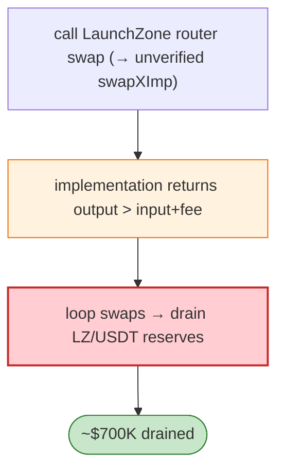

# LaunchZone (LZ) Token Exploit — `swapXImp` Unverified Implementation Logic Flaw

> **Reproduction:** the PoC compiles & runs in an isolated Foundry project at
> [this project folder](.). Full verbose trace: [output.txt](output.txt).

---

## Key info

| | |
|---|---|
| **Loss** | ~$700K (LZ tokens drained on BSC) |
| **Vulnerable contract** | LaunchZone proxy `0x0ccee62e…` → implementation `0x6D898184…` (**unverified**); `swapXImp` |
| **Attacker** | `0x1c2b102f…` |
| **Attack tx** | `0xaee8ef10ac816834cd7026ec34f35bdde568191fe2fa67724fcf2739e48c3cae` |
| **Chain / block / date** | BSC / Feb 2023 |
| **Bug class** | Logic flaw in the unverified `swapXImp` implementation — a public swap function credited the caller more output than the input warranted (miscalculated path/amounts), draining the protocol's reserves. |

---

## TL;DR

LaunchZone had upgraded its proxy to an **unverified** implementation exposing `swapX`/`swapXImp`. The
PoC swaps through the LaunchZone router and the unverified implementation returns more tokens out than
the input + fee should allow, so a sequence of swaps drains the LZ/USDT reserves. The implementation
was never verified on BscScan (per the prep notes), so the precise arithmetic is inferred from the
trace; the exploit shape (call `swap`/`swapExactTokensForTokens`, receive oversized output) is clear.

---

## Root cause

A **logic bug in an unverified, upgraded implementation** of the swap contract. Upgrading to an
unaudited/unverified implementation that mis-computes swap output let the attacker extract value on
every swap.

---

## Diagrams



---

## Remediation

1. **Verify + audit every proxy upgrade** before activation; timelock + multisig on upgrades.
2. **Swap-output invariant**: out ≤ fee-corrected AMM output; revert otherwise.
3. **Independent re-derivation** of amounts in the implementation (don't trust caller-supplied values).

---

## How to reproduce

```bash
_shared/run_poc.sh 2023-02-LaunchZone_exp -vvvvv
```

- RPC: BSC archive. Result: `[PASS]` — oversized swap outputs drain the reserves.

---

*Reference: LaunchZone LZ unverified-implementation swap flaw, BSC, Feb 2023 (~$700K).*
