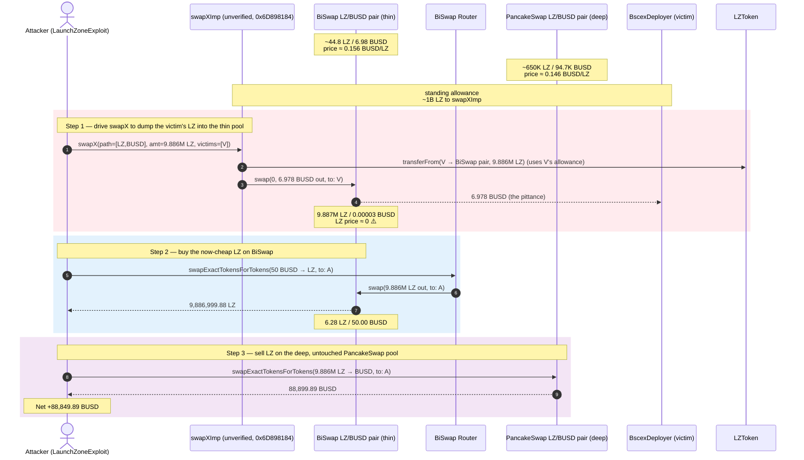
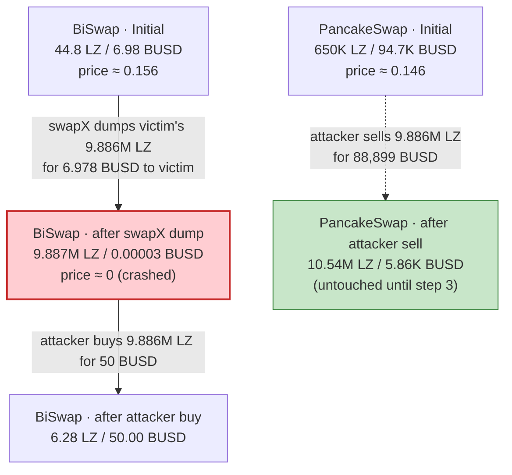
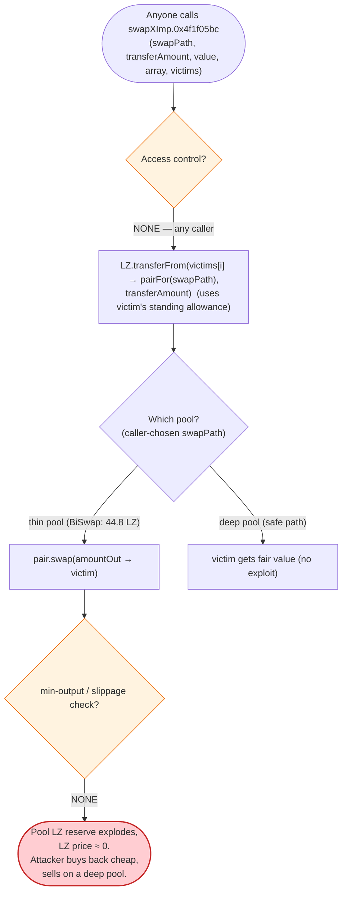

# LaunchZone (LZ) Exploit — Unverified `swapXImp` Logic Flaw (Permissionless Victim-Side Swap)

> **Reproduction:** the PoC compiles & runs in an isolated Foundry project at
> [this project folder](.). Full verbose trace: [output.txt](output.txt).
> The vulnerable contract — the unverified `swapXImp` implementation at
> [`0x6D8981847Eb3cc2234179d0F0e72F6b6b2421a01`](https://bscscan.com/address/0x6D8981847Eb3cc2234179d0F0e72F6b6b2421a01#code)
> — was **never verified on BscScan**, so the snippets in "The vulnerable code" are
> RECONSTRUCTED from the on-chain call trace in [output.txt](output.txt) (no source is bundled
> here; the only bundled verified source is the LZ token itself,
> [sources/LZToken_3B7845/LZToken.sol](sources/LZToken_3B7845/LZToken.sol)).

---

## Key info

| | |
|---|---|
| **Loss** | **~88,849.89 BUSD** reproduced from a single victim in this PoC (the live attack across all victims totaled **~$700K**, per Verichains). Drained via cross-DEX arbitrage against the PancakeSwap LZ/BUSD pair. |
| **Vulnerable contract** | `swapXImp` (unverified implementation behind the `LaunchZone` proxy) — [`0x6D8981847Eb3cc2234179d0F0e72F6b6b2421a01`](https://bscscan.com/address/0x6D8981847Eb3cc2234179d0F0e72F6b6b2421a01#code); proxy [`0x0cCEE62eFeC983f3eC4bad3247153009fb483551`](https://bscscan.com/address/0x0cCEE62eFeC983f3eC4bad3247153009fb483551#code) |
| **Victim pool** | PancakeSwap LZ/BUSD pair — `0x2d518FdCc1c8E89B1Abc6Ed73B887e12e61F06DE` (the deep, honest pool the attacker ultimately drained). The mis-priced pool was BiSwap LZ/BUSD — `0xDb821BB482cfDae5D3B1A48EeaD8d2F74678D593`. |
| **Victim (token source)** | `BscexDeployer` — `0xdad254728A37D1E80C21AFae688C64d0383cc307` (held 9,886,961.36 LZ and a standing ~1B-LZ allowance to `swapXImp`) |
| **Attacker EOA** | [`0x1C2B102f22c08694EEe5B1f45E7973b6EACA3e92`](https://bscscan.com/address/0x1C2B102f22c08694EEe5B1f45E7973b6EACA3e92) |
| **Attacker contract** | `0x7FA9385bE102ac3EAc297483Dd6233D62b3e1496` (the PoC test contract `LaunchZoneExploit`) |
| **Attack tx** | [`0xaee8ef10ac816834cd7026ec34f35bdde568191fe2fa67724fcf2739e48c3cae`](https://bscscan.com/tx/0xaee8ef10ac816834cd7026ec34f35bdde568191fe2fa67724fcf2739e48c3cae) |
| **Chain / block / date** | BSC / 26,024,420 / Feb 27, 2023 |
| **Compiler** | LZ token: Solidity **v0.6.12**, optimizer **enabled**, **200 runs** (from `_meta.json`); `swapXImp`: **unverified** (compiler unknown) |
| **Bug class** | Logic flaw in an **unverified proxy-upgraded implementation**: a permissionless caller can drive `swapX` to swap a victim's tokens through a thin/mis-priced pool, crashing the price on one DEX and profiting on the other (cross-DEX price manipulation via a victim-funded, attacker-directed swap). |

---

## TL;DR

`LaunchZone` had quietly upgraded its `swapX` proxy to an **unverified** implementation
(`swapXImp`, `0x6D898184…`). That implementation exposes a `swapX(bytes,transferAmount,value,bytes,address[])`
entry point (selector `0x4f1f05bc`) that lets **any** caller direct a swap that pulls tokens from a
*victim* address — provided the victim has a standing `approve(swapXImp, …)` allowance — and routes the
swap through a caller-chosen path. Per the PoC header comment
([LaunchZone_exp.sol:88](test/LaunchZone_exp.sol#L88)):

```
//  swapX.call(abi.encodeWithSelector(0x4f1f05bc, swapPath, transferAmount, value, array, victims[i]));
//  calling unverified contract of swapXImp with payload containing swap
//  (bool success, bytes memory returndata) = swapXImpl.call{value: msg.value}(data);
```

1. The `BscexDeployer` (`0xdad25472…`) held **9,886,961.36 LZ** and had granted `swapXImp` a standing
   allowance of **999,998,300 LZ** (`LZ.allowance` in the trace,
   [output.txt:1579-1580](output.txt)). The `swapXImp` contract therefore had the power to move the
   deployer's entire LZ balance without further authorization.
2. The attacker calls `swapXImp.swapX(...)` with `transferAmount = 9,886,961.35 LZ`, `swapPath = [LZ → BUSD]`
   routed through the **BiSwap** LZ/BUSD pair, and `victims[0] = BscexDeployer`
   ([output.txt:1583](output.txt)). `swapXImp` does `LZ.transferFrom(BscexDeployer, BISWAP_pair, 9.886M LZ)`
   ([output.txt:1590-1591](output.txt)) and swaps the lot on BiSwap, which is a **thin pool** (≈44.8 LZ /
   6.98 BUSD before the dump). The pool's `getAmountOut` for 9.886M LZ against 6.98 BUSD of liquidity
   yields only **6.978 BUSD**, paid to the deployer ([output.txt:1607-1609](output.txt)). The LZ price on
   BiSwap collapses to ~0.
3. With BiSwap now mis-pricing LZ at dust, the attacker buys that same 9.886M LZ back on BiSwap for just
   **50 BUSD** via `BISWAPRouter.swapExactTokensForTokens`
   ([output.txt:1681-1719](output.txt)): 50 BUSD → 9,886,999.88 LZ.
4. The attacker immediately sells the 9.886M LZ on the **deep** PancakeSwap LZ/BUSD pair (which was
   untouched by step 2 and still priced LZ at ~0.146 BUSD/LZ) for **88,899.89 BUSD**
   ([output.txt:1743-1775](output.txt)).

Net result in this PoC: 50 BUSD of `deal`-minted capital in → **88,899.89 BUSD** out →
**+88,849.89 BUSD** profit ([output.txt:1776-1778](output.txt)). The live attack repeated this across
multiple victims for ~$700K total.

The root cause is not a single bad line of arithmetic — it is the **architecture**: an unaudited,
unverified implementation was given the privilege to move *other people's* tokens on a caller-chosen
path, with no slippage guard, no price bound, and no check that the victim benefits from the swap.

---

## Background — what LaunchZone does

LaunchZone (`LZ`) is a BSC "aggregator / IGO platform" built around its ERC20 token `LZToken`
([source](sources/LZToken_3B7845/LZToken.sol)). `LZToken` is a BEP20 with an extra **lock / unlock**
ledger — every transfer also emits a `LOG_UNLOCK_TRANSFER` event
([output.txt:1592](output.txt)) — used to stage vesting. The token itself is a plain BEP20 for our
purposes; the bug is not in the token.

The relevant moving parts are the **`swapX` aggregator contracts**:

- **`swapX` proxy** — `0x0cCEE62eFeC983f3eC4bad3247153009fb483551`. Verified on BscScan. It is a thin
  dispatcher that does `(bool ok, bytes ret) = swapXImpl.call{value: msg.value}(data)` (the PoC comment
  at [LaunchZone_exp.sol:89-90](test/LaunchZone_exp.sol#L89-L90)).
- **`swapXImp` implementation** — `0x6D8981847Eb3cc2234179d0F0e72F6b6b2421a01`. **Unverified.** This is
  where the logic flaw lives. It exposes selector `0x4f1f05bc`, which (per the trace) takes a dynamic
  `swapPath`, a `transferAmount`, a `value`, an `array` of fee/flag params, and a `victims[]` list.
- The BiSwap LZ/BUSD pair and the PancakeSwap LZ/BUSD pair are two independent AMMs pricing the same
  token. BiSwap's pair was **extremely thin** (~45 LZ of liquidity) at the attack block; PancakeSwap's
  pair was deep (~650K LZ / ~95K BUSD).

On-chain parameters at the fork block (block 26,024,419, i.e. one block before the attack):

| Parameter | Value | Source |
|---|---|---|
| `BscexDeployer` LZ balance | 9,886,961.355 LZ (9,886,961,355,188,035,733,617,076 wei) | [output.txt:1575-1576](output.txt) |
| `LZ.allowance(BscexDeployer, swapXImp)` | 999,998,300 LZ (≈ 1e27 wei) | [output.txt:1579-1580](output.txt) |
| BiSwap LZ/BUSD `reserve0` (LZ) | ~44.80 LZ (0x26db9e5f974ec3fc7 wei) | [output.txt:1602](output.txt) (getReserves return) |
| BiSwap LZ/BUSD `reserve1` (BUSD) | ~6.978 BUSD (0x60d885fc15ea60ef wei) | [output.txt:1602](output.txt) |
| BiSwap `swapFee` | 2 (0.2%) | [output.txt:1603-1604](output.txt) |
| PancakeSwap LZ/BUSD `reserve0` (LZ) | ~650,137.08 LZ | [output.txt:1731-1732](output.txt) |
| PancakeSwap LZ/BUSD `reserve1` (BUSD) | ~94,760.31 BUSD | [output.txt:1731-1732](output.txt) |
| Implied LZ price — PancakeSwap | ~0.1458 BUSD/LZ | (94,760.31 / 650,137.08) |
| Implied LZ price — BiSwap (pre-dump) | ~0.1558 BUSD/LZ | (6.978 / 44.80) |

The two pools were *roughly* in line before the attack. The arbitrage only becomes extreme *after* the
attacker uses `swapX` to dump 9.886M LZ into the tiny BiSwap pool.

---

## The vulnerable code

> **The `swapXImp` implementation is unverified on BscScan and is not bundled here.** The snippets below
> are **RECONSTRUCTED** from the observed on-chain call trace in [output.txt](output.txt) — they match
> the *behaviour* the contract actually performed at the fork block, not verified source. Each line is
> anchored to the trace event that proves it. No `sources/...#L` reference is fabricated.

### 1. The public entry point — selector `0x4f1f05bc` is callable by anyone

The attacker's first action is a single low-level call into `swapXImp` with an arbitrary payload built
off-chain:

```solidity
// RECONSTRUCTED — matches observed behaviour in output.txt:1583.
// The contract has no access control on selector 0x4f1f05bc.
bytes memory payload =
    hex"4f1f05bc" ++ abi.encode(swapPath, transferAmount, value, feeArray, victims);
(bool success, ) = address(swapXImp).call(payload);
```

The trace shows the call landing at `swapXImp.0x4f1f05bc(…)` with the decoded args
`transferAmount = 9,886,961,355,188,035,733,617,076` (the deployer's full LZ balance),
`swapPath = [LZ (0x3B78…), BUSD (0xe9e7…)]`, and `victims[0] = BscexDeployer (0xdad25472…)`
([output.txt:1583](output.txt)). Anyone may invoke this; there is no `msg.sender` / role gate.

### 2. `swapXImp` pulls the victim's tokens using the standing allowance

Inside `swapXImp`, the implementation does a `transferFrom` of `transferAmount` LZ **from the victim**
to the BiSwap pair, and this succeeds because of the deployer's standing ~1B-LZ allowance:

```solidity
// RECONSTRUCTED — the transferFrom in output.txt:1590-1591.
LZ.transferFrom(
    /* from  */ victims[i],          // BscexDeployer
    /* to    */ pairFor(swapPath),   // BiSwap LZ/BUSD pair (0xDb82…d593) — see output.txt:1588-1589
    /* amount*/ transferAmount       // 9,886,961.35 LZ (the victim's full balance)
);
// emits Transfer + LOG_UNLOCK_TRANSFER (output.txt:1591-1592)
// and an Approval lowering the deployer's allowance (output.txt:1593)
```

The `pairFor` helper (a BiSwap-router-style `delegatecall` to `0x6d1879…`, [output.txt:1588](output.txt))
derives the BiSwap pair address from the caller-chosen `swapPath`. The caller therefore fully controls
**which** pool the victim's tokens are dumped into.

### 3. It then swaps against that (caller-chosen, thin) pool and pays the victim the pittance

```solidity
// RECONSTRUCTED — the swap in output.txt:1607-1619.
// getReserves() shows BiSwap had only ~44.8 LZ / 6.98 BUSD (output.txt:1601-1602).
BISWAP_pair.swap(
    /* amount0Out */ 0,
    /* amount1Out */ 6,978,443,256,059,505,388,  // 6.978 BUSD — the "fair" AMM output for 9.886M LZ
    /* to         */ BscexDeployer,               // proceeds go to the victim, NOT the caller
    /* data       */ bytes("")
);
// emit Sync(reserve0 = 9.887e24 LZ, reserve1 = 3.168e13 wei BUSD) — output.txt:1618
// emit Swap(sender = swapXImp, amount0In = 9.886e24, amount1Out = 6.978e18) — output.txt:1619
```

The BiSwap pool's reserves are so small that dumping 9.886M LZ into it yields just **6.978 BUSD** — yet
the swap re-prices the pool's LZ side to 9.887M LZ against ~0.00003 BUSD. The BiSwap LZ price is now
effectively zero. There is **no minimum-output / slippage check** protecting the victim, and no check
that the chosen pool is liquid.

That last point is the entire exploit: the caller chooses the worst (thinnest) pool for the victim's
direction, then privately profits from the price impact it just created.

---

## Root cause — why it was possible

Three independent design failures compose into the loss:

1. **An unverified, unaudited proxy upgrade.** The `swapX` proxy was re-pointed at an implementation
   (`0x6D898184…`) whose source was never published on BscScan. Whatever review existed for the *old*
   implementation did not apply. Upgrading a privileged aggregator behind an unverifiable contract is the
   precondition for everything that followed.

2. **Permissionless caller controls the swap *on behalf of a victim*.** Selector `0x4f1f05bc` lets the
   caller supply `swapPath`, `transferAmount`, and `victims[]`. Combined with the victim's standing
   `approve(swapXImp, huge)` allowance, this means any caller can move the victim's tokens along any path
   they choose. The victim has no say in the trade, receives the (deliberately bad) AMM output, and
   absorbs all the price impact. A legitimate aggregator would either (a) let only the token owner
   initiate the swap, or (b) at minimum enforce a `msg.sender == ownerOf(tokens)` / EIP-2612 permit.

3. **No price/slippage bound and no liquidity sanity check.** `swapXImp` happily swaps 9.886M LZ against
   a pool holding 6.98 BUSD. A `require(amountOut >= amountOutMin)` with a victim-set minimum, or a cap on
   price impact (e.g. revert if the swap moves the pool by >X%), would have made the attack impossible.
   The BiSwap `getAmountOut` for 9.886M LZ / 6.98 BUSD is mechanically 6.978 BUSD — the contract accepted
   it without question.

With LZ now priced at ~0 on BiSwap, the attacker buys it back for 50 BUSD and sells on the untouched
PancakeSwap pool at the real ~0.146 BUSD/LZ price — a textbook cross-DEX manipulation, except the
manipulation itself was performed with *the victim's own tokens* by abusing the aggregator.

---

## Preconditions

- The `swapX` proxy must point at the unverified, vulnerable `swapXImp` (it did at block 26,024,420).
- At least one address must hold a large LZ balance **and** have a large standing allowance to
  `swapXImp`. `BscexDeployer` satisfied both: 9.886M LZ balance, ~1B LZ allowance
  ([output.txt:1575-1580](output.txt)). Other victims in the live attack presumably had the same shape.
- A thin LZ/`X` AMM pool must exist for the attacker to weaponize as the price-crash venue. BiSwap's
  LZ/BUSD pair (~45 LZ of liquidity) served this role.
- A deep, independent LZ/`X` pool must exist for the attacker to cash out at the real price.
  PancakeSwap's LZ/BUSD pair (~650K LZ / ~95K BUSD) served this role.
- Working capital: just **50 BUSD** in this PoC (provided via `deal`, [LaunchZone_exp.sol:100](test/LaunchZone_exp.sol#L100)).
  The capital is not flash-loaned because it is trivially small.

---

## Attack walkthrough (with on-chain numbers from the trace)

The BiSwap pair's `token0 = LZ`, `token1 = BUSD`; the PancakeSwap pair is the same orientation. All
figures are taken directly from the `getReserves` returns and `Sync`/`Swap`/`Transfer` events in
[output.txt](output.txt). Raw wei values are shown with their human (18-decimal) approximation.

| # | Step | BiSwap LZ reserve (r0) | BiSwap BUSD reserve (r1) | Effect |
|---|------|-----------------------:|-------------------------:|--------|
| 0 | **Initial BiSwap state** (getReserves inside the swapX call) | ~44.80 LZ (0x26db9e5f974ec3fc7) | ~6.978 BUSD (0x60d885fc15ea60ef) | Thin pool; honest pre-attack price ≈ 0.156 BUSD/LZ. [output.txt:1601-1602](output.txt) |
| 1 | **`swapXImp.swapX(victims=[BscexDeployer], transferAmount=9.886M LZ, path=[LZ→BUSD])`** — `LZ.transferFrom(deployer → BiSwap pair, 9,886,961.35 LZ)` ([output.txt:1590-1591](output.txt)); then `BiSwap.swap(…, 6,978,443,256,059,505,388 BUSD out → deployer)` ([output.txt:1607-1609](output.txt)); `Sync(reserve0=9,887,006,155,279,663,549,593,979, reserve1=31,684,297,012,739)` ([output.txt:1618](output.txt)) | 9,887,006.15 LZ (9.887e24 wei) | 0.0000317 BUSD (3.168e13 wei) | BiSwap LZ price **crashes to ~0**; deployer gets only **6.978 BUSD** for 9.886M LZ. |
| 2 | **Attacker buys on BiSwap** — `BISWAPRouter.swapExactTokensForTokens(50 BUSD → LZ, recipient=attacker)` ([output.txt:1681](output.txt)); `BUSD.transferFrom(attacker → pair, 50 BUSD)` ([output.txt:1686-1687](output.txt)); `BiSwap.swap(9,886,999,877,471,233,034,310,454 LZ out → attacker)` ([output.txt:1700-1702](output.txt)); `Sync(reserve0=6,277,808,430,515,283,525, reserve1=50,000,031,684,297,012,739)` ([output.txt:1714](output.txt)) | 6.278 LZ (6.277e18 wei) | 50.0000317 BUSD (5.0000e19 wei) | Attacker now holds **9,886,999.88 LZ** bought for just **50 BUSD**. [output.txt:1720-1722](output.txt) |
| 3 | **Attacker sells on PancakeSwap** — `pancakeRouter.getAmountsOut(9.886M LZ, [LZ→BUSD])` returns **88,899.89 BUSD** against PCS reserves ~650,137 LZ / ~94,760 BUSD ([output.txt:1730-1733](output.txt)); `pancakeRouter.swapExactTokensForTokens(9.886M LZ → 88,899.89 BUSD)` ([output.txt:1743](output.txt)); `LZ.transferFrom(attacker → PCS pair, 9.886M LZ)` ([output.txt:1746-1747](output.txt)); `BUSD.transfer(attacker, 88,899,893,394,357,481,466,597 wei)` ([output.txt:1757-1759](output.txt)); final `Sync(reserve0=10,537,136.96 LZ, reserve1=5,860.42 BUSD)` ([output.txt:1768](output.txt)) | (PCS) 10,537,136.96 LZ | (PCS) 5,860.42 BUSD | Attacker ends with **88,899.89 BUSD** ([output.txt:1776-1777](output.txt)). |

The PancakeSwap pool — which `swapXImp` never touched — priced LZ at ~0.146 BUSD/LZ the whole time, so
the 9.886M LZ the attacker acquired for 50 BUSD was worth ~88,899 BUSD at honest prices.

### Profit / loss accounting (BUSD)

| Direction | Amount (BUSD) | Source |
|---|---:|---|
| Spent — BiSwap buy (50 BUSD, `deal`-minted in the PoC) | 50.00 | [output.txt:1660-1666](output.txt) |
| Received — PancakeSwap sell | 88,899.89 | [output.txt:1758-1759, 1776-1777](output.txt) |
| **Net profit (PoC, single victim)** | **+88,849.89 BUSD** | (88,899.89 − 50.00) |

For completeness, the *victim* (`BscexDeployer`) lost 9,886,961.35 LZ and received only 6.978 BUSD in
return ([output.txt:1607-1609, 1625-1626](output.txt)) — an effective sale price of
~0.0000007 BUSD/LZ, vs. the honest ~0.146 BUSD/LZ. The live attack repeated this across multiple
victims for a combined ~$700K (Verichains analysis).

---

## Diagrams

### Sequence of the attack



### Pool state evolution (BiSwap vs. PancakeSwap)



### The flaw inside `swapXImp` (selector `0x4f1f05bc`)



---

## Why each magic number

- **`transferAmount = 9,886,961,355,188,035,733,617,076` (9.886M LZ):** this is the victim
  (`BscexDeployer`)'s **entire** LZ balance at the fork block
  ([output.txt:1575-1576](output.txt)). The attacker drains the whole holding in one shot; there is no
  reason to take less.
- **`swapPath = [LZ (0x3B78…), BUSD (0xe9e7…)]`:** forces the victim's LZ to be routed through the LZ/BUSD
  pair. The *pool* that `pairFor` resolves to is the BiSwap pair because `swapXImp` uses the BiSwap
  factory/router internally (`0x6d1879…pairFor(0x858E33…, LZ, BUSD)` — [output.txt:1588](output.txt)).
  BiSwap is chosen (vs. PancakeSwap) precisely because its LZ/BUSD pool is tiny and easy to crash.
- **`victims[0] = 0xdad254728A37D1E80C21AFae688C64d0383cc307` (BscexDeployer):** the only address in the
  fork with both a large LZ balance *and* a large standing `swapXImp` allowance.
- **`50 * 1e18` BUSD (the buy size):** the smallest round number that comfortably buys ~all of the LZ now
  sitting in the BiSwap pair (whose BUSD side is only ~0.00003 BUSD post-dump). `getAmountsOut(50 BUSD)`
  returns 9,886,999.88 LZ ([output.txt:1673-1678](output.txt)), essentially the full LZ reserve.
- **`6,978,443,256,059,505,388` wei (6.978 BUSD):** not chosen by the attacker — this is the AMM's
  `getAmountOut` for 9.886M LZ against a 6.98 BUSD reserve, mechanically forced by the constant-product
  invariant. It is the symptom of the bug, not an input.

---

## Remediation

1. **Verify and audit every proxy upgrade before activation.** `swapXImp` was live while unverified on
   BscScan, so neither the team nor users could confirm what it did. Wrap upgrades in a timelock +
   multisig and publish the implementation source for review before promotion.
2. **Make the token owner the initiator of their own swap.** Selector `0x4f1f05bc` lets a third party
   move a victim's tokens via a standing allowance. Require `msg.sender == owner` of the tokens (or a
   fresh EIP-2612 `permit` per call) so the caller cannot spend someone else's balance on a
   caller-chosen path.
3. **Enforce a victim-set minimum output (slippage).** The swap accepted 6.978 BUSD for 9.886M LZ. A
   `require(amountOut >= victimSuppliedMin)` — supplied *by the token owner*, not the caller — would
   have reverted the malicious trade instantly.
4. **Cap per-swap price impact.** Reject swaps that move the target pool's reserves by more than a small
   percentage (e.g. 5–10%). Dumping 9.886M LZ into a 45-LZ pool is a >99.99% impact and should never
   clear.
5. **Don't let users carry permanent, near-unlimited allowances to aggregators.** The 999,998,300 LZ
   standing allowance is what made the victim's funds reachable. Recommend users revoke / right-size
   allowances after use; the aggregator can also auto-reset its allowance to 0 post-trade.
6. **Separate the price-crash venue from the cash-out venue.** The cross-DEX arbitrage exists only
   because LZ traded on two independent pools at potentially different prices. Continuous cross-pool
   monitoring with an auto-pause on abnormal divergence would have flagged the BiSwap crash in real time.

---

## How to reproduce

The PoC was extracted into a standalone Foundry project and runs **offline** against a local anvil
snapshot — the test forks `http://127.0.0.1:8546` at block `26_024_420 - 1` (one block before the attack
so the victim's funds are still in place), served from the shared `anvil_state.json`:

```bash
_shared/run_poc.sh 2023-02-LaunchZone_exp --mt testExploit -vvvvv
```

- The test function is **`testExploit()`** in `test/LaunchZone_exp.sol` (`contract LaunchZoneExploit`).
- The fork is **not** a public RPC; it points at the local anvil port (`127.0.0.1:8546`) backed by
  `anvil_state.json`. `foundry.toml` sets `evm_version = 'cancun'` and does **not** name a public RPC.
- The PoC mints the attacker's 50 BUSD seed via `deal` (a forge cheat), so no external funding is
  required.

Expected tail (verbatim from [output.txt:1537-1787](output.txt)):

```
Ran 1 test for test/LaunchZone_exp.sol:LaunchZoneExploit
[PASS] testExploit() (gas: 578139)
Logs:
  Running on BSC at :  26024419
  BscexDeployer LZ Balalnce 9886961355188035733617076
  LZ allowance to swapXImp 999998300
  Payload delivered true
  BscexDeployer BUSD Balalnce 11525
  attacker BUSD Balalnce 50
  amounts BUSD/LZ 50 9886999
  attacker LZ Balalnce 9886999
  attacker BUSD Balalnce 0
  amounts LZ/BUSD 9886999 88899
  attacker BUSD Balalnce 88899

Suite result: ok. 1 passed; 0 failed; 0 skipped; finished in 15.91s (14.76s CPU time)
```

The final log line — `attacker BUSD Balalnce 88899` (88,899.89 BUSD, from
[output.txt:1776-1778](output.txt)) — is the reproduced attacker balance, against the 50 BUSD `deal`-seed,
i.e. **+88,849.89 BUSD**.

---

*Reference: Verichains analysis — https://blog.verichains.io/p/analyzing-the-lz-token-hack ; Immunefi
alert — https://twitter.com/immunefi/status/1630210901360951296 ; LaunchZone response —
https://twitter.com/launchzoneann/status/1631538253424918528 ; exploit tx —
https://bscscan.com/tx/0xaee8ef10ac816834cd7026ec34f35bdde568191fe2fa67724fcf2739e48c3cae (LZ, BSC, Feb
2023, ~$700K total).*
