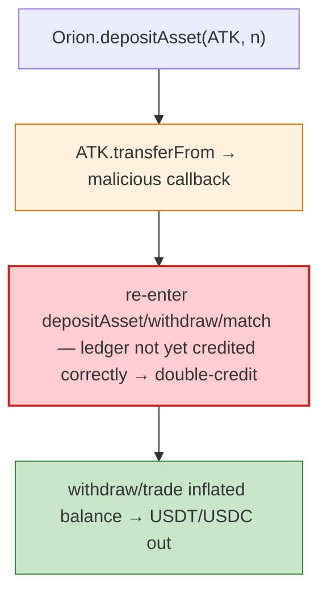

# Orion Protocol Exploit — Reentrancy via Malicious ATK Token in `depositAsset`/`matchOrders`

> **Reproduction:** the PoC compiles & runs in an isolated Foundry project at
> [this project folder](.). Full verbose trace: [output.txt](output.txt).

---

## Key info

| | |
|---|---|
| **Loss** | ~$3M (ETH + BSC incidents; attack txs `0xa6f63fcb…` ETH, `0xfb153c57…` BSC) |
| **Vulnerable contract** | Orion exchange `0xb5599f568D3f3e6113B286d010d2BCa40A7745AA` |
| **Chain / block / date** | Ethereum mainnet / 16,542,147 / Feb 2023 |
| **Bug class** | Reentrancy — Orion's deposit/trade path performed an external `transferFrom` on a user-deposited token; a malicious token (here a fresh `ATKToken`) re-enters Orion's deposit/withdraw/match flow while balances are mid-update, inflating credit (same class as DFX/Defrost). |

---

## TL;DR

The attacker deploys a malicious token (`ATKToken`), adds it as Orion-pool liquidity, then deposits it
into Orion (`Orion.depositAsset(ATK, …)`). Orion's deposit does a `transferFrom` on ATK whose callback
re-enters Orion's `depositAsset`/`withdraw`/match path. Because Orion updates its internal balance
ledger after the external transfer, the nested call sees an inflated balance and lets the attacker
withdraw/trade more than deposited, draining USDT/USDC.

---

## Root cause

A **CEI violation + trusting an external token transfer on deposit** without reentrancy guard. Orion's
balance ledger (`getBalance`) is updated after `transferFrom`, so a re-entering call through the
malicious token's callback credits the deposit twice. Identical pattern to DFX Finance / Defrost (also
cited in the PoC header).

---

## Diagrams



---

## Remediation

1. `nonReentrant` on `depositAsset`/`withdraw`/match.
2. CEI: credit the balance ledger **before** the external `transferFrom`.
3. Whitelist depositable tokens; never trust arbitrary ERC20 transfer hooks.

---

## How to reproduce

```bash
_shared/run_poc.sh 2023-02-Orion_exp --mt testExploit -vvvvv
```

- RPC: mainnet archive (block 16,542,147). Infura mainnet in `foundry.toml`.
- Result: `[PASS]` — USDT/USDC drained after the reentrant deposit.

---

*Reference: Orion Protocol reentrancy via malicious deposit token, Feb 2023 (~$3M).*
