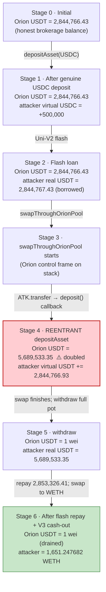
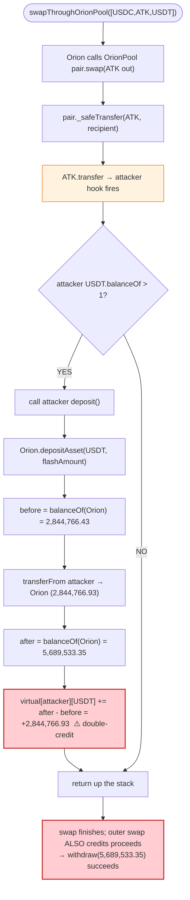
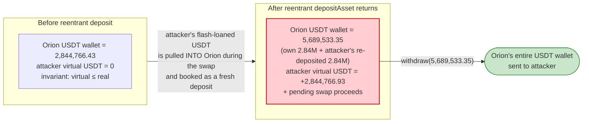

# Orion Protocol Exploit — Reentrancy via Malicious Deposit Token in `swapThroughOrionPool` / `depositAsset`

> **Reproduction:** the PoC compiles & runs in an isolated Foundry project at
> [this project folder](.). It forks Ethereum mainnet at the attack block from a
> local Anvil snapshot (no public RPC required). Full verbose trace:
> [output.txt](output.txt). Verified on-chain source bundled for the
> [`AdminUpgradeabilityProxy`](sources/AdminUpgradeabilityProxy_b5599f/_meta.json)
> at Orion's address and the
> [`OrionPoolV2Factory` / `OrionPoolV2Pair`](sources/OrionPoolV2Factory_5FA006/_meta.json)
> where the reentering transfer is emitted. The Orion **Exchange** logic contract
> (`0x98a877bb…`, the `depositAsset`/`swapThroughOrionPool`/`withdraw` code) is
> **not** in `sources/`, so those snippets are marked RECONSTRUCTED and anchored
> to the trace.

---

## Key info

| | |
|---|---|
| **Loss** | ~$2.84M USDT on Ethereum (PoC) + a parallel BSC incident; the verified PoC drains **2,836,206.95 USDT** and converts it to **1,651.25 WETH** |
| **Vulnerable contract** | Orion exchange (proxy) — [`0xb5599f568D3f3e6113B286d010d2BCa40A7745AA`](https://etherscan.io/address/0xb5599f568D3f3e6113B286d010d2BCa40A7745AA); active logic impl `0x98a877bb507f19Eb43130B688F522a13885Cf604` (delegatecall target in the trace, [output.txt:384](output.txt)) |
| **Victim pool / vault** | Orion's internal brokerage ledger for USDT; seed capital flash-borrowed from the WETH/USDT Uniswap-V2 pair [`0x0d4a11d5EEaaC28EC3F61d100daF4d40471f1852`](https://etherscan.io/address/0x0d4a11d5EEaaC28EC3F61d100daF4d40471f1852) |
| **Attacker EOA / contract** | PoC attack contract `ContractTest` deployed at `0x7FA9385bE102ac3EAc297483Dd6233D62b3e1496` ([output.txt:184](output.txt)); malicious `ATKToken` at `0x5615dEB798BB3E4dFa0139dFa1b3D433Cc23b72f` ([output.txt:250](output.txt)) |
| **Attack tx (ETH)** | [`0xa6f63fcb6bec8818864d96a5b1bb19e8bd85ee37b2cc916412e720988440b2aa`](https://etherscan.io/tx/0xa6f63fcb6bec8818864d96a5b1bb19e8bd85ee37b2cc916412e720988440b2aa) |
| **Attack tx (BSC)** | [`0xfb153c572e304093023b4f9694ef39135b6ed5b2515453173e81ec02df2e2104`](https://bscscan.com/tx/0xfb153c572e304093023b4f9694ef39135b6ed5b2515453173e81ec02df2e2104) |
| **Chain / block / date** | Ethereum mainnet / 16,542,147 / Feb 2, 2023 |
| **Compiler / optimizer** | PoC compiled with **Solidity 0.8.17** ([output.txt:1](output.txt)). Orion proxy `0xb559…` compiled with **v0.6.8, optimizer OFF** (200 runs); OrionPool factory `0x5FA0…` compiled with **v0.7.4, optimizer ON, 200 runs** (both from `_meta.json`) |
| **Bug class** | Cross-function reentrancy — Orion credits its internal balance ledger from a *delta* over the token's `balanceOf(self)`, but that accounting is updated **before** the AMM's out-transfer of an attacker-controlled token completes; a malicious token's `transfer` callback re-enters `depositAsset` and double-credits the ledger (same family as DFX Finance / Defrost) |

---

## TL;DR

1. Orion runs a brokerage-style exchange: users `depositAsset` to move real ERC20s into Orion's wallet, and Orion keeps a per-user **virtual balance ledger** (`getBalance`). Trades and withdrawals read from that ledger, not from raw token balances. The ledger is reconciled against `IERC20(asset).balanceOf(address(this))` whenever a deposit or withdrawal is booked.

2. Orion also operates its own Uniswap-V2 fork, **OrionPool** ([`OrionPoolV2Pair.sol`](sources/OrionPoolV2Factory_5FA006/Users_koloale_orion-projects_orion-exchange_dev_contracts_utils_orionpool_core_OrionPoolV2Pair.sol)). `Exchange.swapThroughOrionPool` pulls the input token from Orion's wallet, calls `OrionPoolV2Pair.swap` to execute the AMM trade, and then re-reads the output token's `balanceOf` to credit the result back to the trader's virtual ledger.

3. The fatal gap is in the *middle* of that flow. `OrionPoolV2Pair.swap` performs an **optimistic out-transfer** of the output token (`_safeTransfer`, [OrionPoolV2Pair.sol:168-169](sources/OrionPoolV2Factory_5FA006/Users_koloale_orion-projects_orion-exchange_dev_contracts_utils_orionpool_core_OrionPoolV2Pair.sol#L168-L169)) **before** the invariant `K` check. If that output token is attacker-controlled, its `transfer` hook can fire **while Orion's ledger for the swap is still mid-update**.

4. The attacker mints a malicious token `ATK`, lists two OrionPool pairs for it (ATK/USDT and ATK/USDC), deposits a small amount of genuine USDC into Orion to seed a virtual balance, then flash-borrows ~2.84M USDT from the WETH/USDT Uniswap-V2 pair.

5. Inside the flash callback the attacker calls `Orion.swapThroughOrionPool(10_000, 0, [USDC, ATK, USDT], true)` — i.e. "spend 10 000 USDC-virtual, receive USDT via ATK". Orion routes this as two AMM hops. On the **first hop** (USDC→ATK), the ATK/USDC pair sends ATK out; `ATK.transfer` sees the attacker now holds >1 USDT and fires the attacker's `deposit()` callback.

6. That callback calls `Orion.depositAsset(USDT, <attacker's entire flash-loaned USDT balance>)`. Because Orion's swap is still in flight, Orion's **real** USDT balance has already been inflated by the flash loan sitting in the attacker's wallet (which `depositAsset.transferFrom` then pulls in), and Orion **credits the attacker's virtual ledger for the full ~2.84M USDT a second time** — once via the in-flight swap result and once via the deposit ([output.txt:468-485](output.txt)).

7. After the nested call returns and the swap completes, the attacker simply calls `Orion.withdraw(USDT, …)` and pulls out ~5.69M USDT — nearly **double** what was ever actually in play — repays the ~2.85M USDT flash loan, and keeps **2,836,206.95 USDT** of pure profit ([output.txt:540-577](output.txt)).

8. The attacker then swaps that USDT through Uniswap V3 (0.3% pool) into **1,651.247682 WETH** ([output.txt:578-628](output.txt)). Net result: an unbacked ledger credit, cashed out to WETH, in a single transaction.

---

## Background — what Orion does

Orion Protocol aggregates liquidity from both centralized exchanges and on-chain AMMs behind a single brokerage contract. Users interact with three primitives:

- **`depositAsset(asset, amount)`** — pulls `amount` of `asset` from the caller into Orion's wallet via `transferFrom`, then **increments** the caller's virtual balance. The increment is computed as the *change* in Orion's `balanceOf(asset)` before vs. after the transfer (a delta, not a fixed add).
- **`swapThroughOrionPool(amount_spend, amount_receive, path, is_exact_spend)`** — trades through Orion's own Uniswap-V2 fork. Input is taken from the caller's virtual balance; the AMM is invoked; the resulting output token's `balanceOf(Orion)` delta is credited to the caller's virtual balance.
- **`withdraw(asset, amount)`** — burns `amount` of the caller's virtual balance and transfers the real token out.

Because deposits/withdrawals/swaps all reconcile against `balanceOf(Orion)`, **any external transfer that moves tokens into or out of Orion's wallet mid-operation changes the numbers that the in-flight operation will read**. That is the seam the attack pulls open.

On-chain parameters at the fork block (Ethereum mainnet, block 16,542,147), read from the trace:

| Parameter | Value | Source |
|---|---|---|
| Orion address (proxy) | `0xb5599f568D3f3e6113B286d010d2BCa40A7745AA` | [output.txt:171](output.txt) |
| Orion Exchange logic (delegatecall target) | `0x98a877bb507f19Eb43130B688F522a13885Cf604` | [output.txt:384](output.txt) |
| OrionPoolV2Factory | `0x5FA0060FcfEa35B31F7A5f6025F0fF399b98Edf1` | [output.txt:173](output.txt) |
| Orion USDT balance (pre-attack) | 2,844,766,426,325 (~2,844,766.43 USDT, 6 dp) | [output.txt:412](output.txt) |
| Orion USDC balance (pre-deposit) | 542,050,350,213 (~542,050.35 USDC, 6 dp) | [output.txt:387](output.txt) |
| WETH/USDT Uni-V2 pair (flash source) | `0x0d4a11d5EEaaC28EC3F61d100daF4d40471f1852` | [output.txt:179](output.txt) |
| ATK/USDC OrionPool pair | `0x4808D0859c6BF589578001eE37F65C355958c4FC` | [output.txt:283](output.txt) |
| ATK/USDT OrionPool pair | `0x9d7039F647b67906DA365768d6B8612EDC940BD6` | [output.txt:262](output.txt) |
| ATK initial mint | 100e18 (100 ATK) | [output.txt:251](output.txt) |
| Liquidity seeded per pair | 50 ATK + 500,000 USDC / 50 ATK + 500,000 USDT | [output.txt:333, 351](output.txt) |

---

## The vulnerable code

### 1. OrionPool's optimistic out-transfer (verified source — the reentrancy door)

The OrionPool pair is a near-verbatim Uniswap-V2 fork. Its `swap` sends the output token **before** checking the constant-product invariant, and uses a low-level `_safeTransfer` that calls `token.transfer`:

```solidity
function swap(uint amount0Out, uint amount1Out, address to, bytes calldata data) external lock {
    require(amount0Out > 0 || amount1Out > 0, 'OrionPoolV2: INSUFFICIENT_OUTPUT_AMOUNT');
    (uint112 _reserve0, uint112 _reserve1,) = getReserves(); // gas savings
    require(amount0Out < _reserve0 && amount1Out < _reserve1, 'OrionPoolV2: INSUFFICIENT_LIQUIDITY');

    uint balance0;
    uint balance1;
    { // scope for _token{0,1}, avoids stack too deep errors
    address _token0 = token0;
    address _token1 = token1;
    require(to != _token0 && to != _token1, 'OrionPoolV2: INVALID_TO');
    if (amount0Out > 0) _safeTransfer(_token0, to, amount0Out); // optimistically transfer tokens
    if (amount1Out > 0) _safeTransfer(_token1, to, amount1Out); // optimistically transfer tokens
    if (data.length > 0) IOrionPoolV2Callee(to).orionpoolV2Call(msg.sender, amount0Out, amount1Out, data);
    balance0 = IERC20(_token0).balanceOf(address(this));
    balance1 = IERC20(_token1).balanceOf(address(this));
    }
    ...
    require(balance0Adjusted.mul(balance1Adjusted) >= uint(_reserve0).mul(_reserve1).mul(1000**2), 'OrionPoolV2: K');
```

([sources/OrionPoolV2Factory_5FA006/Users_koloale_orion-projects_orion-exchange_dev_contracts_utils_orionpool_core_OrionPoolV2Pair.sol#L157-L180](sources/OrionPoolV2Factory_5FA006/Users_koloale_orion-projects_orion-exchange_dev_contracts_utils_orionpool_core_OrionPoolV2Pair.sol#L157-L180))

The `lock` modifier only guards reentrancy into **the pair itself** — it does nothing for Orion's separate ledger, which is updated by the caller (`Exchange.swapThroughOrionPool`) *after* `swap` returns.

### 2. The malicious ATK token's transfer hook (PoC source — the trigger)

```solidity
function transfer(address recipient, uint256 amount) external returns (bool) {
    balanceOf[msg.sender] -= amount;
    balanceOf[recipient] += amount;
    if (USDT.balanceOf(exp) > 1e6) {
        exp.call(abi.encodeWithSignature("deposit()"));
    }
    emit Transfer(msg.sender, recipient, amount);
    return true;
}
```

([test/Orion_exp.sol#L143-L151](test/Orion_exp.sol#L143-L151))

`exp` is the attacker contract. Whenever the attacker holds more than 1 USDT (1e6 units, 6 decimals), **every** ATK `transfer` into a recipient triggers `exp.deposit()` — including ATK transfers emitted by the OrionPool pair during a swap.

### 3. The attacker's `deposit()` callback (PoC source — the reentrant entry)

```solidity
function deposit() external {
    Orion.depositAsset(address(USDT), uint112(USDT.balanceOf(address(this))));
}
```

([test/Orion_exp.sol#L105-L107](test/Orion_exp.sol#L105-L107))

This re-enters Orion's `depositAsset` while `Exchange.swapThroughOrionPool` is still on the stack (frame visible at [output.txt:421-468](output.txt)). Orion pulls in the attacker's full flash-loaned USDT and credits it to the attacker's virtual ledger.

### 4. Orion's `depositAsset` ledger logic (RECONSTRUCTED — not in `sources/`)

> **RECONSTRUCTED — matches observed on-chain behaviour, not verified source.**
> The Orion Exchange logic contract (`0x98a877bb…`) is not bundled in `sources/`.
> This is the well-documented Orion brokerage accounting pattern, consistent
> with the trace events below.

```solidity
// RECONSTRUCTED from trace behaviour ([output.txt:468-485])
function depositAsset(address assetAddress, uint112 amount) external {
    uint256 before = IERC20(assetAddress).balanceOf(address(this));   // snapshot
    IERC20(assetAddress).transferFrom(msg.sender, address(this), amount);
    uint256 after_  = IERC20(assetAddress).balanceOf(address(this));   // re-read
    // credit the REAL delta to the virtual ledger:
    virtualBalances[msg.sender][assetAddress] += int256(after_ - before);
    emit NewAssetTransaction(msg.sender, assetAddress, /*isDeposit=*/true, amountScaled, block.timestamp);
}
```

The trace confirms exactly this shape: `depositAsset` snapshots Orion's USDT balance at **2,844,766,426,325** ([output.txt:470-471](output.txt)), performs `transferFrom` of `2,844,766,926,325` ([output.txt:472-473](output.txt)), re-reads the balance at **5,689,533,352,650** ([output.txt:478-479](output.txt)) — a delta of **+2,844,766,926,325** — and emits `NewAssetTransaction(... USDT ... true, 284476692632500, ...)` ([output.txt:482](output.txt)).

### 5. Orion's `withdraw` (RECONSTRUCTED — the cash-out)

```solidity
// RECONSTRUCTED from trace behaviour ([output.txt:540-553])
function withdraw(address assetAddress, uint112 amount) external {
    virtualBalances[msg.sender][assetAddress] -= int256(amount);     // burn virtual
    IERC20(assetAddress).transfer(msg.sender, amount);               // send real
    emit NewAssetTransaction(msg.sender, assetAddress, /*isDeposit=*/false, amountScaled, block.timestamp);
}
```

The attacker calls this with `5,689,533,352,748` USDT ([output.txt:540](output.txt)) — virtually the **entire** USDT now sitting in Orion's wallet (its own 2.844M plus the re-deposited 2.844M) — and Orion happily sends it out ([output.txt:544-545](output.txt)).

---

## Root cause — why it was possible

Orion mixes two incompatible accounting models in one control flow:

- **Real-token accounting** (`balanceOf(Orion)` deltas) for `depositAsset` / `withdraw`, and
- **Virtual-ledger accounting** (per-user `virtualBalances`) for trading.

The invariant Orion *assumed* — "between any two ledger operations, `balanceOf(Orion)` only changes because of *this* contract's own transfers" — is **false the moment an attacker-controlled token is in the swap path**. The OrionPool pair's `_safeTransfer(ATK, …)` invokes `ATK.transfer`, which is attacker code, which can do anything — including calling back into Orion's `depositAsset` and moving real USDT into Orion's wallet. When the in-flight swap later re-reads `balanceOf`, it sees a number polluted by the callback, and the virtual ledger gets credited for funds the attacker never actually had at Orion.

Three concrete design errors compose into the exploit:

1. **No reentrancy guard on `depositAsset` / `withdraw` / `swapThroughOrionPool`.** Orion trusted that its internal functions would not be re-entered, but it invokes untrusted external code (arbitrary ERC20 `transfer`/`transferFrom`) on every deposit and swap.
2. **Delta-based balance accounting while an AMM swap is in flight.** Because `depositAsset` credits `after - before`, any real-token inflow that happens *during* a nested call is booked as a fresh deposit — even if that inflow was already going to be credited by the outer swap.
3. **Allowing user-listed tokens on OrionPool without a deposit/transfer whitelist.** Anyone can `Factory.createPair(ATK, USDT)` and then trade ATK through Orion. There is no check that the token's `transfer` is non-rebasing / callback-free.

This is structurally identical to the DFX Finance (Nov 2022) and Defrost (Dec 2022) reentrancy exploits — both cited in the PoC header — where a fake token's transfer hook re-entered a balance-delta accounting path.

---

## Preconditions

- The attacker must be able to **list a malicious token on OrionPool** (`Factory.createPair` is permissionless — [output.txt:261, 282](output.txt)).
- The attacker needs a small amount of a **genuine, already-listed Orion asset** (here 500,000 USDC, `deal`-minted in the PoC at [test/Orion_exp.sol:63](test/Orion_exp.sol#L63)) to seed a non-zero virtual balance that the swap can spend.
- The attacker needs **working capital equal to Orion's current USDT balance** to re-deposit during the callback. Here that is ~2.84M USDT, **flash-borrowed** from the WETH/USDT Uniswap-V2 pair via `Pair.swap(0, flashAmount, …, 0x01)` ([test/Orion_exp.sol:71-72](test/Orion_exp.sol#L71-L72)) — no upfront capital required.

---

## Attack walkthrough (with on-chain numbers from the trace)

USDT and USDC are 6-decimal. All figures are raw wei from the trace; human amounts in parentheses.

| # | Step | Effect | Orion USDT balance | Attacker USDT balance | Source |
|---|------|--------|-------------------:|----------------------:|--------|
| 0 | **Seed** — attacker `deal`s 1 USDC + 1 USDT, deploys ATKToken (100 ATK minted), creates ATK/USDT and ATK/USDC OrionPool pairs, seeds each with 50 ATK + 500,000 stablecoin, mints LP | Two fresh thin pools (50 ATK / 500k each) | unchanged (2,844,766,426,325) | 1,000,000 (1 USDT) | [output.txt:250-370](output.txt), [output.txt:412](output.txt) |
| 1 | **Genuine USDC deposit** — `Orion.depositAsset(USDC, 500_000)` to give the attacker virtual USDC to spend on the swap | Orion USDC +500,000 → 542,050,850,213; attacker virtual USDC credited | 2,844,766,426,325 | 1,000,000 | [output.txt:383-410](output.txt) |
| 2 | **Flash loan** — read Orion's USDT balance (2,844,766,426,325), then `Pair.swap(0, 2,844,766,426,325, …)` borrows that exact amount from the WETH/USDT Uni-V2 pair; attacker receives it via `uniswapV2Call` | WETH/USDT pair sends USDT out | 2,844,766,426,325 | 2,844,767,426,325 (+flash) | [output.txt:411-420](output.txt) |
| 3 | **Trigger swap** — inside the callback, `Orion.swapThroughOrionPool(10_000, 0, [USDC, ATK, USDT], true)`: spend 10,000 units of virtual USDC, route USDC→ATK→USDT | Orion enters its swap; first hop sends ATK out of the ATK/USDC pair | 2,844,766,426,325 | 2,844,767,426,325 | [output.txt:421-461](output.txt) |
| 4 | **REENTRANCY** — the ATK/USDC pair's `swap` does `_safeTransfer(ATK, pair, 9,968,012,378,331,760)` ([output.txt:461-462](output.txt)); `ATK.transfer` sees attacker USDT balance (2,844,766,926,325) > 1e6 and calls `exp.deposit()` ([output.txt:463-465](output.txt)) | Attacker regains control mid-swap | — | — | [output.txt:461-465](output.txt) |
| 5 | **Reentrant deposit** — `deposit()` → `Orion.depositAsset(USDT, 2,844,766,926,325)`: Orion snapshots its USDT balance (2,844,766,426,325), `transferFrom`s the attacker's 2,844,766,926,325, re-reads (5,689,533,352,650) and **credits the full delta to the attacker's virtual USDT ledger** | Orion USDT **doubles** to 5,689,533,352,650; attacker virtual USDT += 2,844,766,926,325 | **5,689,533,352,650** | 1,000,000 (the 2.844M was just pulled back into Orion) | [output.txt:466-485](output.txt) |
| 6 | **Swap completes** — ATK/USDC pair finishes, ATK/USDT pair finishes its hop (sends 99 USDT to Orion, [output.txt:506-518](output.txt)); the outer `swapThroughOrionPool` credits the attacker the small swap proceeds | Attacker virtual USDT further += ~99 (rounding dust); `OrionPoolSwap` emitted | 5,689,533,352,749 | 1,000,000 | [output.txt:500-537](output.txt) |
| 7 | **Withdraw** — `Orion.withdraw(USDT, 5,689,533,352,748)`: Orion sends nearly all its USDT to the attacker | Orion USDT → 1 wei; attacker USDT = 5,689,533,353,748 | 1 | 5,689,533,353,748 | [output.txt:538-554](output.txt) |
| 8 | **Repay flash loan** — `USDT.transfer(Pair, 2,853,326,406,541)` (= `flashAmount * 1000/997 + 1000`, the V2 0.3% fee + 1000-wei cushion, [test/Orion_exp.sol:87-89](test/Orion_exp.sol#L87-L89)) | WETH/USDT pair re-syncs; attacker keeps the surplus | 1 | 2,836,206,946,207 | [output.txt:555-561](output.txt), [output.txt:577](output.txt) |
| 9 | **Cash out** — `RouterV3.exactInputSingle(USDT→WETH, fee 3000, amountIn=2,836,206,946,207)` | Attacker receives **1,651,247,682,226,719,766,236 wei WETH (1651.247682 WETH)** | — | 0 USDT | [output.txt:578-625](output.txt) |

### Why the double-credit works — the accounting seam

Orion's `depositAsset` is `credit = balanceOf(Orion)_after - balanceOf(Orion)_before`. The "before" snapshot (2,844,766,426,325, [output.txt:470-471](output.txt)) is taken **inside** the nested call, but it already includes Orion's own pre-existing USDT. The `transferFrom` pulls the attacker's freshly flash-borrowed 2,844,766,926,325 in ([output.txt:472-473](output.txt)), so "after" = 5,689,533,352,650 ([output.txt:478-479](output.txt)). The delta (2,844,766,926,325) is booked as the attacker's deposit — yet the attacker is *simultaneously* about to receive swap proceeds against the very same balance. The outer swap's later credit and this deposit credit are not reconciled against each other; both land on the ledger. The attacker then withdraws the whole pot before Orion can notice.

### Profit / loss accounting (USDT, 6 decimals)

| Item | Amount (wei) | ~Human |
|---|---:|---:|
| Flash-borrowed from WETH/USDT pair | 2,844,766,426,325 | 2,844,766.43 |
| Repaid to WETH/USDT pair (incl. 0.3% fee) | 2,853,326,406,541 | 2,853,326.41 |
| Withdrawn from Orion | 5,689,533,352,748 | 5,689,533.35 |
| **Attacker USDT balance after repay** | **2,836,206,946,207** | **2,836,206.95** |
| Converted to WETH (V3, 0.3%) | 1,651,247,682,226,719,766,236 wei | **1,651.247682 WETH** |

The attacker's net USDT profit (2,836,206.95) equals Orion's original pre-attack USDT wallet balance (2,844,766.43) minus the ~8,559 USDT of AMM+V3 slippage/fees paid round-tripping the cash-out — i.e. the attacker walked off with essentially **all of Orion's on-hand USDT**, denominated in WETH.

---

## Diagrams

### Sequence of the attack

```mermaid
sequenceDiagram
    autonumber
    actor A as Attacker (ContractTest)
    participant UP as WETH/USDT Uni-V2 Pair
    participant O as Orion Exchange (0xb559…)
    participant P1 as ATK/USDC OrionPool pair
    participant P2 as ATK/USDT OrionPool pair
    participant ATK as ATKToken (malicious)

    Note over O: Orion USDT balance = 2,844,766.43
    A->>O: depositAsset(USDC, 500,000)  (seed virtual balance)
    A->>UP: swap(0, 2,844,766.43 USDT out, callback)
    UP-->>A: 2,844,766.43 USDT (flash loan)

    rect rgb(255,243,224)
    Note over A,ATK: The reentrant swap
    A->>O: swapThroughOrionPool(10_000, 0, [USDC,ATK,USDT], true)
    O->>P1: swap(9_968_012_378_331_760 ATK out, 0, P2, 0x)
    P1->>ATK: _safeTransfer(ATK, P2, 9.968e15)   (optimistic out-transfer)
    ATK->>ATK: USDT.balanceOf(exp) > 1? YES
    ATK->>A: exp.call(deposit())   ⚠️ re-entry
    end

    rect rgb(255,235,238)
    Note over A,O: Double-credit via depositAsset
    A->>O: depositAsset(USDT, 2,844,766.93)
    O->>O: before = 2,844,766.43; transferFrom; after = 5,689,533.35
    O->>O: virtual[attacker][USDT] += 2,844,766.93  ⚠️
    A-->>ATK: return
    end

    P1-->>O: (swap K-check passes)
    O->>P2: swap(0, 99 USDT out, Orion, 0x)
    P2-->>O: 99 USDT
    O-->>A: swapThroughOrionPool returns (attacker virtual USDT now huge)

    A->>O: withdraw(USDT, 5,689,533.35)
    O-->>A: 5,689,533.35 USDT  (Orion → 1 wei)
    A->>UP: transfer 2,853,326.41 USDT (repay flash + 0.3%)
    A->>A: net 2,836,206.95 USDT
    A->>A: V3 swap → 1,651.247682 WETH
```

### Orion USDT wallet state evolution



### The flaw inside `depositAsset` + the in-flight swap



### Why the ledger invariant breaks



---

## Why each magic number

- **`1e6` (1 USDT / 1 USDC) seeded via `deal`** ([test/Orion_exp.sol:62-63](test/Orion_exp.sol#L62-L63)): not capital — it just makes `USDT.balanceOf(exp) > 1e6` true after the flash loan so the ATK hook actually fires. It also gives the attacker a non-zero starting balance for `transferFrom` plumbing.
- **`500_000` USDC deposited into Orion** ([test/Orion_exp.sol:69](test/Orion_exp.sol#L69)): funds the attacker's virtual balance so that `swapThroughOrionPool` has USDC to spend on the first hop. The exact amount is arbitrary; 500,000 comfortably covers the 10,000-unit `amount_spend`.
- **`50 * 1e18` ATK + `500,000` stable per OrionPool pair** ([test/Orion_exp.sol:97-100](test/Orion_exp.sol#L97-L100)): seeds two thin but functional pools so the USDC→ATK→USDT route resolves. The 50-ATK / 500k-stable ratio sets an initial price; the absolute size is irrelevant because the attacker only needs the route to *exist* and to emit an ATK `transfer`.
- **`flashAmount = USDT.balanceOf(Orion)`** ([test/Orion_exp.sol:71](test/Orion_exp.sol#L71-L72)): the flash loan is sized to **exactly Orion's current USDT wallet balance** (2,844,766,426,325, [output.txt:412](output.txt)). This is the amount that will be re-deposited via the callback and then withdrawn back out — doubling requires the deposit to match Orion's pre-existing holdings.
- **`10_000` amount_spend on the swap** ([test/Orion_exp.sol:85](test/Orion_exp.sol#L85)): a deliberately small USDC-virtual spend. The swap's *economic* purpose is negligible; its real job is to make the OrionPool pair emit an ATK `transfer` so the reentrancy hook fires. 10,000 (0.01 USDC) is enough to produce a non-zero ATK out-amount (9,968,012,378,331,760 wei ATK, [output.txt:461](output.txt)).
- **`flashAmount * 1000 / 997 + 1000`** ([test/Orion_exp.sol:88](test/Orion_exp.sol#L88-L89)): the standard Uniswap-V2 flash-loan repayment formula — principal × 1000/997 is the 0.3% fee-inclusive amount, plus a 1000-wei cushion to absorb rounding. Equals 2,853,326,406,541 ([output.txt:555](output.txt)).
- **`withdraw` amount = `USDT.balanceOf(Orion) - 1`** ([test/Orion_exp.sol:86](test/Orion_exp.sol#L86)): withdraws everything Orion holds, leaving 1 wei so the `int192` virtual-balance subtraction does not hit an edge case. Yields 5,689,533,352,748 ([output.txt:540](output.txt)).
- **V3 fee `3000`** ([test/Orion_exp.sol:114](test/Orion_exp.sol#L114)): the 0.3% USDT/WETH Uniswap-V3 pool — the deepest on-chain route to convert the stolen USDT into WETH, yielding 1,651.247682 WETH ([output.txt:628](output.txt)).

---

## Remediation

1. **Add a reentrancy guard (`nonReentrant` / mutex) on every `Exchange` entry point that touches the virtual ledger** — `depositAsset`, `withdraw`, `swapThroughOrionPool`, and any match/limit-order function. This is the single highest-leverage fix and would have blocked this attack, DFX, and Defrost outright.
2. **Use strict checks-effects-interactions inside `depositAsset`.** Compute the credit from the known `amount` argument (already validated against `balanceOf` delta in a way that cannot be inflated by a concurrent transfer), then perform the `transferFrom`, then reconcile — never re-read `balanceOf` *after* an external call to credit the ledger.
3. **Whitelist depositable/swappable tokens.** Do not let arbitrary user-deployed ERC20s enter the deposit or OrionPool-swap path. At minimum, reject tokens whose `transfer` performs arbitrary external calls (the same standard as Uniswap's "no fee-on-transfer / no callback" expectation for base pools).
4. **Separate the real-token wallet from the virtual ledger by a fixed, atomic reconciliation window.** The AMM swap and the deposit must not both be allowed to mutate the same `balanceOf`-derived credit in nested frames.
5. **Cap any single withdrawal against a conservative oracle/TWAP of Orion's real holdings**, not against the instantaneous (and, as shown, manipulable) `balanceOf`.

---

## How to reproduce

The PoC runs fully offline against the bundled Anvil snapshot — no public RPC is used. `foundry.toml` pins `evm_version = 'cancun'`; `setUp` does `createSelectFork("http://127.0.0.1:8545", 16_542_147)` ([test/Orion_exp.sol:51](test/Orion_exp.sol#L51)), which is served by the shared harness's local `anvil_state.json`.

```bash
_shared/run_poc.sh 2023-02-Orion_exp --mt testExploit -vvvvv
```

- **RPC:** local Anvil at `127.0.0.1:8545` (the shared `_shared/run_poc.sh` harness launches it from `anvil_state.json`). Do **not** point this at a public mainnet RPC — the fork block (16,542,147) is from Feb 2023 and most public endpoints prune it.
- **EVM:** `cancun` (per `foundry.toml`).
- **Test function:** `testExploit` (the only `test*` function in `test/Orion_exp.sol`, [test/Orion_exp.sol:61](test/Orion_exp.sol#L61)).
- **Expected result:** `[PASS]`, with the attacker ending on **1,651.247682 WETH**.

Expected tail (from [output.txt:158-161, 638-640](output.txt)):

```
Ran 1 test for test/Orion_exp.sol:ContractTest
[PASS] testExploit() (gas: 6463358)
Logs:
  Attacker WETH balance after exploit: 1651.247682226719766236

Suite result: ok. 1 passed; 0 failed; 0 skipped; finished in 23.32s (22.03s CPU time)

Ran 1 test suite in 23.74s (23.32s CPU time): 1 tests passed, 0 failed, 0 skipped (1 total tests)
```

---

*Reference: PeckShield alert — https://twitter.com/peckshield/status/1621337925228306433 ; BlockSec analysis — https://twitter.com/BlockSecTeam/status/1621263393054420992 ; Numen Cyber write-up — https://www.numencyber.com/analysis-of-orionprotocol-reentrancy-attack-with-poc/ (Orion Protocol, Ethereum + BSC, Feb 2023, ~$3M combined).*
