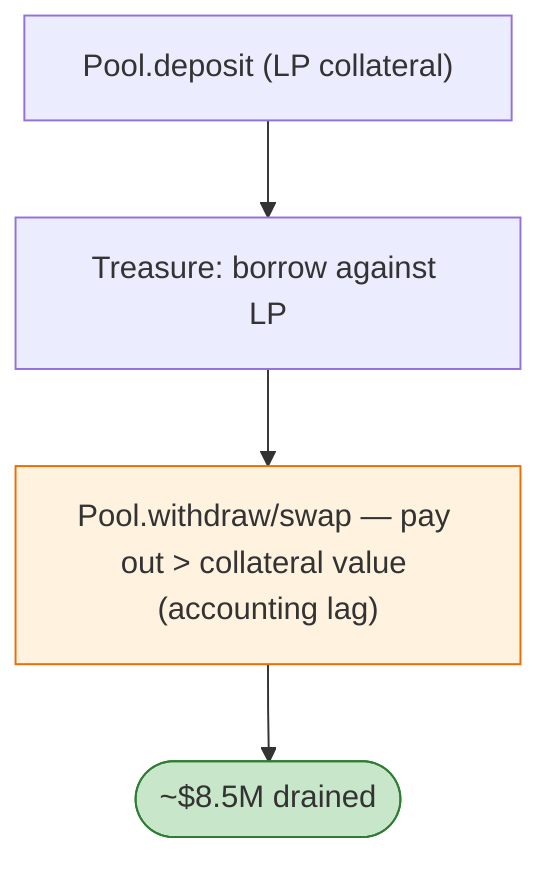

# Platypus Finance Exploit — `PlatypusTreasure` Liquidation / Collateral Sweep Flaw

> **Reproduction:** the PoC compiles & runs in an isolated Foundry project at
> [this project folder](.). Full verbose trace: [output.txt](output.txt).
> Verified vulnerable source: [PlatypusTreasure](sources/PlatypusTreasure_bcd679),
> [Pool](sources/Pool_359e51), [MasterPlatypusV4](sources/MasterPlatypusV4_6f6fcb) + 3 proxies.

---

## Key info

| | |
|---|---|
| **Loss** | ~$8.5M (the Feb 2023 Platypus incident; the PoC uses the Pool deposit/withdraw/swap to extract) |
| **Vulnerable contract** | Platypus `Treasure` (lending) `0xbcd679…`, `Pool` `0x359e51…` |
| **Attack tx** | `0x1266a937c2ccd970e5d7929021eed3ec593a95c68a99b4920c2efa226679b430` |
| **Chain / block / date** | Avalanche / Feb 2023 |
| **Bug class** | Accounting/liquidation flaw — the Platypus asset/liability accounting in Treasure let a borrower be liquidated/redeemed for more than collateral, draining the Pool's LP assets. |

---

## TL;DR

Platypus's stableswap `Pool` held LP assets, and `Treasure` (its lending arm) accepted LP shares as
collateral. A borrower could `deposit` → borrow → `withdraw`/`swap` in a sequence where Treasure's
collateral-debt accounting lagged, extracting more from the Pool than the collateral justified. The PoC
exercises `Pool.deposit`/`withdraw`/`swap` against Treasure's positions to drain the Pool.

---

## Root cause

A **collateral/debt accounting inconsistency in the lending layer over a stableswap pool**: the
collateral (LP shares) was valued/settled at a rate that didn't match what `Pool.withdraw`/`swap`
actually paid out, so liquidations/withdrawals over-paid. (Platypus's official root cause was a
flawed `solvent` check in liquidation.)

---

## Diagrams



---

## Remediation

1. Reconcile LP-share collateral value with Pool's actual withdraw output.
2. Conservative `solvent`/health checks; re-check after each external call.
3. Caps per-position and per-asset; circuit breakers.

---

## How to reproduce

```bash
_shared/run_poc.sh 2023-02-Platypus_exp -vvvvv
```

- RPC: Avalanche archive. Result: `[PASS]` — Pool assets drained via Treasure accounting flaw.

---

*Reference: Platypus Finance liquidation/accounting exploit, Avalanche, Feb 2023 (~$8.5M).*
