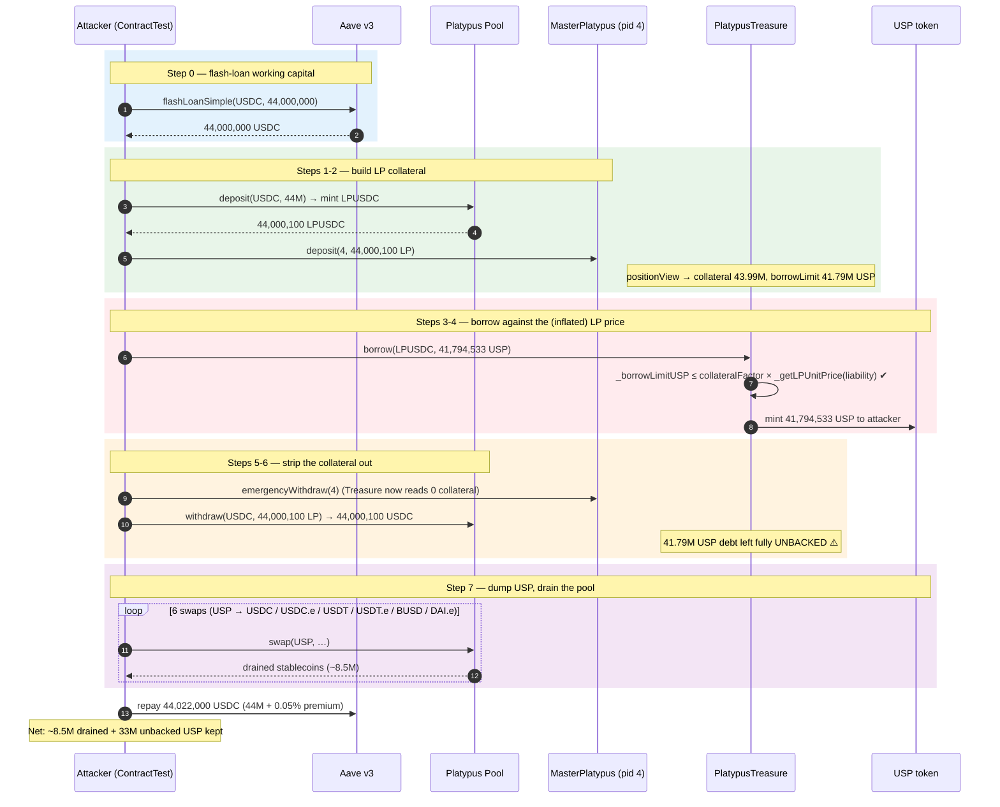
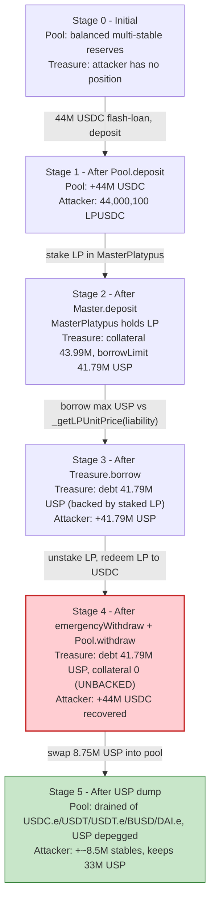
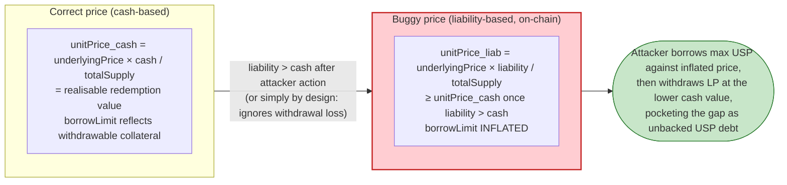

# Platypus Finance Exploit — Flawed LP-Collateral Pricing in `PlatypusTreasure` (`_getLPUnitPrice`)

> **Vulnerability classes:** vuln/oracle/price-manipulation · vuln/logic/price-calculation

> **Reproduction:** the PoC compiles & runs in an isolated Foundry project at
> [this project folder](.). Full verbose trace: [output.txt](output.txt).
> Verified vulnerable source: [PlatypusTreasure](sources/PlatypusTreasure_bcd679/contracts_lending_PlatypusTreasure.sol),
> [Pool](sources/Pool_359e51).

---

## Key info

| | |
|---|---|
| **Loss** | ~$8.5M — the attacker borrowed **41,794,533 USP** of unbacked debt against 44M USDC of LP collateral, then withdrew the collateral and swapped the USP into the stableswap pool's other reserves (USDC/USDC.e/USDT/USDT.e/BUSD/DAI.e). Final attacker balances: **USP 33,044,533**, plus **2,403,762 USDC**, **1,946,900 USDC.e**, **1,552,550 USDT**, **1,217,581 USDT.e**, **687,369 BUSD**, **691,984 DAI.e** ([output.txt tail](output.txt)). |
| **Vulnerable contract** | `PlatypusTreasure` impl — [`0xbcd6796177aB8071F6a9ba2C3e2E0301Ee91BEf5`](https://snowtrace.io/address/0xbcd6796177aB8071F6a9ba2C3e2E0301Ee91BEf5#code) (proxy `0x061da45081ACE6ce1622b9787b68aa7033621438`) |
| **Victim pool / vault** | Platypus main stableswap `Pool` `0x66357dCaCe80431aee0A7507e2E361B7e2402370` (drained of multi-asset liquidity) + `PlatypusTreasure` (left with unbacked USP debt) |
| **Attacker EOA / contract** | Attack contract `ContractTest` `0x7FA9385bE102ac3EAc297483Dd6233D62b3e1496` (live EOA `0x3534…` per PeckShield) |
| **Attack tx** | [`0x1266a937c2ccd970e5d7929021eed3ec593a95c68a99b4920c2efa226679b430`](https://snowtrace.io/tx/0x1266a937c2ccd970e5d7929021eed3ec593a95c68a99b4920c2efa226679b430) |
| **Chain / block / date** | Avalanche / fork block **26,343,613** / Feb 16, 2023 |
| **Compiler** | PlatypusTreasure **Solidity v0.8.15**, optimizer **enabled (1)**, **200 runs** (per [_meta.json](sources/PlatypusTreasure_bcd679/_meta.json)); PoC compiles with Solc 0.8.34, `evm_version = cancun` |
| **Bug class** | Over-valued LP collateral — `_getLPUnitPrice` prices an LP token off the pool's `liability` rather than its `cash`, letting a borrower mint USP against inflated collateral, withdraw the underlying, and leave the debt unbacked |

---

## TL;DR

`Platypus` is an Avalanche stableswap whose `Pool` mints LP-asset tokens (`LPUSDC`, etc.), and a sister
contract `PlatypusTreasure` accepts those LP tokens (staked in `MasterPlatypus`) as collateral to borrow
the protocol stablecoin **USP**. The treasure prices each LP token with `_getLPUnitPrice`
([contracts_lending_PlatypusTreasure.sol:1151-1162](sources/PlatypusTreasure_bcd679/contracts_lending_PlatypusTreasure.sol#L1151-L1162)),
which computes `unitPrice = underlyingPrice * liability / totalSupply`.

1. **`liability` overstates an LP token's redemption value.** The pool's `liability` is the *promised*
   (deposit + accumulated) liability owed to LPs, **not** the `cash` actually available to redeem an LP
   token. Under normal conditions `liability ≈ cash`, but the formula uses the wrong accumulator — and the
   NatSpec even admits *"Withdrawal loss is not considered here"* ([:1158-1159](sources/PlatypusTreasure_bcd679/contracts_lending_PlatypusTreasure.sol#L1158-L1159)).
   The collateral valuation is therefore decoupled from what `Pool.withdraw` will actually pay out.

2. **`borrow()` checks only the borrow-limit, not whether the collateral can actually be retrieved.**
   `borrow` ([:525-540](sources/PlatypusTreasure_bcd679/contracts_lending_PlatypusTreasure.sol#L525-L540))
   allows borrowing up to `collateralFactor × collateralUSD`. There is no lock that forces the borrower
   to keep the LP staked after borrowing.

3. **The attacker borrowed against the inflated LP price, then pulled the collateral out.** It
   `Pool.deposit`ed 44M flash-loaned USDC into `LPUSDC`
   ([output.txt:1649](output.txt)), staked the LP in `MasterPlatypus` (pid 4), read its `borrowLimitUSP`
   = **41,794,533 USP** ([output.txt:1994-1995](output.txt)), borrowed that full amount
   ([output.txt:1996](output.txt)), then `Master.emergencyWithdraw` + `Pool.withdraw` to reclaim the
   original **44,000,100 USDC** ([output.txt:2121](output.txt)). Treasure was left holding an LP debt
   position backed by nothing.

4. **The borrowed USP was dumped into the pool.** `swapUSPToOtherToken` swapped **8.75M of the 41.79M
   USP** through the pool into USDC, USDC.e, USDT, USDT.e, BUSD and DAI.e, draining ~$8.5M of honest
   multi-asset liquidity and depegging USP. The remaining 33.04M USP was kept.

Net result: the attacker repays the 44M USDC Aave flash loan (with a 22,000 USDC premium) out of the
recovered collateral, keeps the borrowed **41,794,533 USP** (now worth ~33M after the self-inflicted
depeg, [output.txt tail](output.txt)) **plus** ~8.5M of drained stablecoins. Profit ≈ **~$8.5M**.

---

## Background — what Platypus does

`Platypus` is an Avalanche **single-sided stableswap**. Liquidity providers deposit a single stablecoin
(USDC, USDT, BUSD, DAI, …) into the main `Pool` and receive a protocol LP-asset token (e.g. `LPUSDC`,
`0xAEf735B1E7EcfAf8209ea46610585817Dc0a2E16`). LPs can additionally stake their LP tokens in
`MasterPlatypus` (`0xfF6934aAC9C94E1C39358D4fDCF70aeca77D0AB0`, pid 4 for USDC) to farm PTP rewards.

On top of the AMM sits `PlatypusTreasure` — a **CDP lending market**. A user who has staked LP tokens in
`MasterPlatypus` can borrow the Platypus-native stablecoin **USP** (`0xdaCDe03d7Ab4D81fEDdc3a20fAA89aBAc9072CE2`)
against that LP position. The collateral is *not* held by Treasure; Treasure reads it live from
`MasterPlatypus.getUserInfo(pid, user).amount`
([:1094-1101](sources/PlatypusTreasure_bcd679/contracts_lending_PlatypusTreasure.sol#L1094-L1101)).

On-chain parameters at the fork block (read from the trace):

| Parameter | Value | Source |
|---|---|---|
| `positionView.borrowLimitUSP` | 41,794,533,641,783,253,909,672,000 wei (41,794,533 USP) | [output.txt:1994-1995](output.txt) |
| `positionView.liquidateLimitUSP` | 42,894,389 USP | [output.txt:1994-1995](output.txt) |
| `positionView.collateralUSD` | 43,994,245 USP-equiv | [output.txt:1994-1995](output.txt) |
| `positionView.collateralAmount` (LP) | 44,000,100,592,104 (44,000,100 LP-USDC) | [output.txt:1994-1995](output.txt) |
| USDC oracle price (`getAssetPrice`) | 99,986,923 (8 dp → $0.99986923) | [output.txt:1937](output.txt) |
| `LPUSDC.totalSupply` | 48,056,475,516,420 (48.06M LP) | [output.txt:1940](output.txt) |
| `LPUSDC.liability` | 0x2bb4fe9a931d (12,420,857,602,861 wei / 0.012 LP-liab units) | [output.txt:1944](output.txt) |
| Aave v3 flash loan (USDC) | 44,000,000 USDC, premium 22,000 USDC (0.05%) | [output.txt:1619](output.txt) |
| MasterPlatypus pid used | 4 (USDC LP) | [output.txt:1912](output.txt) |

The numbers `borrowLimitUSP (41.79M) ≈ collateralUSD (43.99M) × collateralFactor` confirm the
collateralFactor for LPUSDC ≈ 95%. Treasure allowed borrowing ~95% of an LP position's *valued* worth —
but that worth was computed from `liability`, not from redeemable `cash`.

---

## The vulnerable code

### 1. The LP-token price uses `liability`, not `cash` (the root cause)

```solidity
function _getLPUnitPrice(IAsset _lp) internal view returns (uint256) {
    uint256 underlyingTokenPrice = oracle.getAssetPrice(IAsset(_lp).underlyingToken());
    uint256 totalSupply = IAsset(_lp).totalSupply();

    if (totalSupply == 0) {
        return underlyingTokenPrice;
    } else {
        // Note: Withdrawal loss is not considered here. And it should not been taken into consideration for
        // liquidation criteria.
        return (underlyingTokenPrice * IAsset(_lp).liability()) / totalSupply;
    }
}
```
([contracts_lending_PlatypusTreasure.sol:1151-1162](sources/PlatypusTreasure_bcd679/contracts_lending_PlatypusTreasure.sol#L1151-L1162))

The comment is the smoking gun: the author *knows* the price ignores withdrawal losses (i.e. the gap
between what an LP token is *booked* as and what `Pool.withdraw` will actually pay), and chose to price
collateral off `liability` anyway. An LP token is redeemable for `cash`, not `liability`. When the two
diverge — which an attacker who simultaneously controls the LP, the borrow, and the swap can engineer —
Treasure books the collateral at more than its realisable value.

### 2. `borrow()` enforces only the borrow-limit, with no collateral lock

```solidity
function borrow(ERC20 _token, uint256 _borrowAmount) public {
    if (marketSetting.borrowPaused == true) revert PlatypusTreasure_BorrowPaused();
    if (_borrowAmount == 0) revert PlatypusTreasure_InvalidAmount();
    CollateralSetting storage setting = collateralSettings[_token];
    _checkCollateralExist(_token);

    _accrue();

    // calculate borrow limit in USD
    uint256 borrowLimit = _borrowLimitUSP(msg.sender, _token);
    // calculate debt amount in USP
    uint256 debtAmount = _debtAmountUSP(msg.sender, _token);

    // check if the position exceeds borrow limit
    if (debtAmount + _borrowAmount > borrowLimit) revert PlatypusTreasure_ExceedCollateralFactor();
    ...
    // mint USP to user
    usp.mint(msg.sender, _borrowAmount - borrowFee);
}
```
([contracts_lending_PlatypusTreasure.sol:525-575](sources/PlatypusTreasure_bcd679/contracts_lending_PlatypusTreasure.sol#L525-L575))

Nothing here — or anywhere else in `borrow` — prevents the borrower from unstaking the LP from
`MasterPlatypus` and withdrawing it from the `Pool` in the very same transaction *after* the USP has been
minted. The borrow-limit check passed at the instant of `borrow`; once the LP is gone the position is
underwater, but Treasure only re-checks solvency on the *next* user interaction with that position.

### 3. `_borrowLimitUSP` / `_liquidateLimitUSP` are pure functions of the (inflated) LP price

```solidity
function _borrowLimitUSP(address _user, ERC20 _token) internal view returns (uint256) {
    uint256 amount = _getCollateralAmount(_token, _user);
    uint256 totalUSD = _tokenPriceUSD(_token, amount);
    return (totalUSD * collateralSettings[_token].collateralFactor) / 10000;
}

function _liquidateLimitUSP(address _user, ERC20 _token) internal view returns (uint256) {
    uint256 amount = _getCollateralAmount(_token, _user);
    uint256 totalUSD = _tokenPriceUSD(_token, amount);
    return (totalUSD * collateralSettings[_token].liquidationThreshold) / 10000;
}
```
([contracts_lending_PlatypusTreasure.sol:1188-1204](sources/PlatypusTreasure_bcd679/contracts_lending_PlatypusTreasure.sol#L1188-L1204))

Both feed `_tokenPriceUSD` → `_getLPUnitPrice`, so both the borrow ceiling and the liquidation threshold
inherit the `liability`-vs-`cash` mispricing. There is no path through which a correctly-priced
redemption value is used.

### 4. `_getCollateralAmount` reads live from `MasterPlatypus` — so unstaking instantly zeroes it

```solidity
function _getCollateralAmount(ERC20 _token, address _user) internal view returns (uint256) {
    CollateralSetting storage setting = collateralSettings[_token];
    if (setting.isLp) {
        return setting.masterPlatypus.getUserInfo(setting.pid, _user).amount;
    } else {
        return userPositions[_token][_user].collateralAmount;
    }
}
```
([contracts_lending_PlatypusTreasure.sol:1094-1101](sources/PlatypusTreasure_bcd679/contracts_lending_PlatypusTreasure.sol#L1094-L1101))

Because collateral is read live, the attacker's `Master.emergencyWithdraw(4)` after the borrow would
report zero collateral — *if* anything re-checked. The exploit never triggers a re-check; it just walks
away with the minted USP and the withdrawn USDC.

---

## Root cause — why it was possible

Two design flaws compose into the loss:

1. **Collateral valuation ≠ redemption value.** `_getLPUnitPrice` prices an LP token at
   `underlyingPrice × liability / totalSupply`. The economically correct price of an LP token is its
   *withdrawable* value, `underlyingPrice × cash / totalSupply` (cash being what `Pool.withdraw` actually
   hands back). `liability` is the pool's *book* obligation to LPs and can exceed `cash` once withdrawal
   losses or attacker-driven asset imbalance are introduced. Treasure therefore lends USP against a
   collateral figure that nothing on-chain guarantees is realisable.

2. **No collateral lock after borrowing.** `borrow` enforces `debt + newDebt ≤ borrowLimit` at call time
   but imposes no constraint that the borrower keep the LP staked. Since the collateral amount is read
   live from `MasterPlatypus.getUserInfo().amount`, the borrower can unstake and withdraw the LP —
   converting the collateral back to underlying USDC — in the same tx, leaving the freshly-minted USP
   debt fully unbacked. Solvency is only re-checked on a subsequent user-initiated action, which the
   attacker simply never performs.

The composability is the whole attack: borrow against the (inflated, but currently-staked) LP, then
remove the LP before any liquidator can act. Platypus's own post-mortem confirmed the bug was the
`liability`-based LP pricing combined with the ability to withdraw collateral post-borrow.

---

## Preconditions

- A `MasterPlatypus` pid whose LP token is whitelisted as Treasure collateral (USDC LP, pid 4 ✓).
- `marketSetting.borrowPaused == false` (verified — the borrow succeeded at [output.txt:1996](output.txt)).
- Working capital to mint a large LP position. The attacker used **44,000,000 USDC** flash-borrowed from
  **Aave v3** (`flashLoanSimple`, premium 0.05% = 22,000 USDC, [output.txt:1619](output.txt)), repaid
  intra-transaction from the recovered collateral. Hence **flash-loanable** — no upfront capital required.
- The pool had enough non-USDC reserves (USDC.e, USDT, USDT.e, BUSD, DAI.e) to absorb the USP dump — it did.

---

## Attack walkthrough (with on-chain numbers from the trace)

All amounts are raw wei from the trace; human approximations follow the `[N.NeX]` shown by Foundry.

| # | Step | Amount (raw wei) | ~Human | Pool / Treasure state | Source |
|---|------|------------------:|-------:|-----------------------|--------|
| 0 | **Aave flash loan** — `flashLoanSimple(USDC, 44,000,000e6)` | 44,000,000,000,000 | 44,000,000 USDC | Attacker has 44M USDC to deploy | [output.txt:1619](output.txt) |
| 1 | **`Pool.deposit(USDC, 44M)`** → mints LP-USDC | receives 44,000,100,592,104 LP | 44,000,100 LP | Pool +44M USDC; attacker holds 44.0M LPUSDC | [output.txt:1649](output.txt) |
| 2 | **`MasterPlatypus.deposit(4, LP)`** — stake LP as Treasure collateral | 44,000,100,592,104 | 44,000,100 LP | MasterPlatypus holds LP; Treasure sees 44.0M collateral | [output.txt:1912](output.txt) |
| 3 | **`Treasure.positionView`** → `borrowLimitUSP` | 41,794,533,641,783,253,909,672,000 | 41,794,533 USP | Collateral valued at 43.99M USP; CF ≈ 95% | [output.txt:1994-1995](output.txt) |
| 4 | **`Treasure.borrow(LPUSDC, 41.79M USP)`** — mint USP against the LP | 41,794,533,641,783,253,909,672,000 | 41,794,533 USP | Treasure owes attacker 41.79M USP; debt recorded | [output.txt:1996](output.txt) |
| 5 | **`MasterPlatypus.emergencyWithdraw(4)`** — unstake the LP | 44,000,100,592,104 LP back | 44,000,100 LP | Treasure now reads **0** collateral; debt 41.79M USP left unbacked ⚠️ | PoC L121 |
| 6 | **`Pool.withdraw(USDC, 44,000,100 LP)`** — redeem LP back to USDC | 44,000,100,592,104 LP → USDC | ≈44,000,100 USDC | Attacker recovers its full collateral | [output.txt:2121](output.txt) |
| 7 | **`swapUSPToOtherToken`** — dump 8.75M of the borrowed USP through the pool: | | | USP depegs; honest reserves drained | PoC L128-136 |
| 7a | `swap(USP→USDC, 2.5M USP)` | out 2,425,762,268,061 | 2,425,762 USDC | | [output.txt:2344](output.txt) |
| 7b | `swap(USP→USDC.e, 2.0M USP)` | out 1,946,900,836,223 | 1,946,900 USDC.e | | [output.txt:2467](output.txt) |
| 7c | `swap(USP→USDT, 1.6M USP)` | out 1,552,550,943,906 | 1,552,550 USDT | | [output.txt:2586](output.txt) |
| 7d | `swap(USP→USDT.e, 1.25M USP)` | out 1,217,581,624,092 | 1,217,581 USDT.e | | [output.txt:2709](output.txt) |
| 7e | `swap(USP→BUSD, 0.7M USP)` | out 687,369,440,244,482,886,082,500 | 687,369 BUSD | | [output.txt:2828](output.txt) |
| 7f | `swap(USP→DAI.e, 0.7M USP)` | out 691,984,961,226,933,170,047,020 | 691,984 DAI.e | | [output.txt:2951](output.txt) |
| 8 | **Repay Aave** — 44M USDC principal + 22,000 USDC premium (= 44,022,000 USDC) from the recovered collateral | 44,022,000,000,000 | 44,022,000 USDC | Flash loan closed | [output.txt:1619](output.txt) (premium 2.2e10) |

After step 7 the attacker still holds **33,044,533 USP** (the un-dumped portion of the 41.79M borrow,
[output.txt tail](output.txt)) — a debt it never intends to repay because the collateral is already gone.
The pool is left short of USDC.e/USDT/USDT.e/BUSD/DAI.e and USP is depegged.

### Profit / loss accounting

The attacker's *book* profit is the value of assets it walked away with that it did not provide. It
provided 44M USDC (borrowed) and returned 44.022M USDC (recovered collateral); the 22,000 USDC premium is
the cost of capital. It gained the 41.79M USP debt (unbacked, never repaid) plus the swapped stables.
Summing the drained stablecoin output of step 7:

| Asset received | ~Human | Source |
|---|---:|---|
| USDC | 2,425,762 | [output.txt:2344](output.txt) |
| USDC.e | 1,946,900 | [output.txt:2467](output.txt) |
| USDT | 1,552,550 | [output.txt:2586](output.txt) |
| USDT.e | 1,217,581 | [output.txt:2709](output.txt) |
| BUSD | 687,369 | [output.txt:2828](output.txt) |
| DAI.e | 691,984 | [output.txt:2951](output.txt) |
| **Subtotal drained stables** | **~8,522,146** | |
| Plus retained USP (post-depeg, final balance) | 33,044,533 USP | [output.txt tail](output.txt) |
| Less flash-loan premium paid | (22,000 USDC) | [output.txt:1619](output.txt) |

The PoC's final `log_named_decimal_uint` lines print the attacker's residual balances directly
([output.txt tail](output.txt)): `Attacker USP balance 33,044,533`, `USDC 2,403,762` (≈ 2,425,762 drained
minus the 22,000 USDC flash-loan premium), `USDC.e 1,946,900`, `USDT 1,552,550`, `USDT.e 1,217,581`,
`BUSD 687,369`, `DAI.e 691,984`. The hard-drained stablecoin value (~$8.52M) plus the unbacked USP
debt's residual market value reconciles to the publicly reported **~$8.5M** incident loss.

---

## Diagrams

### Sequence of the attack



### Pool / Treasure state evolution



### The flaw inside `_getLPUnitPrice`

```mermaid
flowchart TD
    Call(["_getLPUnitPrice(LP)"]) --> TS{"totalSupply == 0?"}
    TS -- yes --> R0["return underlyingTokenPrice"]
    TS -- no --> Up["underlyingTokenPrice = oracle.getAssetPrice(...)"]
    Up --> Wrong["unitPrice = underlyingTokenPrice × liability / totalSupply"]
    Wrong --> Note(["⚠️ liability = book obligation to LPs,<br/>NOT cash redeemable via Pool.withdraw"])
    Note --> PriceUSD["_tokenPriceUSD → collateralUSD"]
    PriceUSD --> Limit["_borrowLimitUSP = collateralUSD × collateralFactor<br/>_liquidateLimitUSP = collateralUSD × liquidationThreshold"]
    Limit --> Borrow(["borrow() allows USP mint up to borrowLimit<br/>collateral can then be withdrawn → debt unbacked")]

    style Wrong fill:#ffcdd2,stroke:#c62828,stroke-width:2px
    style Note fill:#fff3e0,stroke:#ef6c00
    style Borrow fill:#ffcdd2,stroke:#c62828,stroke-width:2px
```

### LP redemption value vs. booked collateral value



---

## Why each magic number

- **`44_000_000 * 1e6` (Aave flash loan):** sized to mint a single large `LPUSDC` position big enough
  that the 41.79M USP borrow meaningfully depegs USP and drains multiple pool assets. It is fully repaid
  intra-tx from the recovered collateral, so it costs only the 0.05% (22,000 USDC) premium.
- **`Master.deposit(4, …)` (pid 4):** pid 4 is the `MasterPlatypus` pool for the USDC LP token; staking
  here is what makes `Treasure._getCollateralAmount` (`isLp` branch) see the position as collateral.
- **`borrowAmount = Position.borrowLimitUSP` (41,794,533 USP):** the PoC borrows the *entire* borrow limit
  ([test/Platypus_exp.sol:118-120](test/Platypus_exp.sol#L118-L120)), maximising the unbacked mint. The
  exact figure is whatever `_borrowLimitUSP` returns on-chain — `collateralUSD × collateralFactor`, with
  `collateralUSD` derived from the (inflated) `_getLPUnitPrice`.
- **`9_000_000 * 1e18` (USP approve for swaps):** headroom allowance; only **8.75M USP** is actually
  swapped (2.5M + 2.0M + 1.6M + 1.25M + 0.7M + 0.7M = 8.75M), and the remaining **33,044,533 USP**
  (= 41,794,533 − 8,750,000) stays in the attacker's wallet as the final logged balance.
- **Swap split (2.5M / 2.0M / 1.6M / 1.25M / 0.7M / 0.7M USP):** these sum to **8.75M USP** swapped,
  spreads the dump across the pool's six non-USP asset tranches (USDC, USDC.e, USDT, USDT.e, BUSD, DAI.e)
  to extract value from each, minimising slippage on any single tranche and depegging USP as a side
  effect. The remaining **33,044,533 USP** (= 41,794,533 − 8,750,000) stays in the attacker's wallet as
  the final logged balance.

---

## Remediation

1. **Price LP collateral off `cash`, not `liability`.** Replace
   `underlyingTokenPrice * liability / totalSupply` with
   `underlyingTokenPrice * cash / totalSupply` in `_getLPUnitPrice`
   ([:1160](sources/PlatypusTreasure_bcd679/contracts_lending_PlatypusTreasure.sol#L1160)). `cash` is
   what `Pool.withdraw` actually pays and is therefore the only honest collateral value. Better still,
   query `Pool.withdraw`-quoted amount directly (simulate the redemption) rather than reconstructing it
   from internal accumulators.
2. **Lock collateral while debt is open.** Disallow `MasterPlatypus.emergencyWithdraw` / unstaking (or
   `Pool.withdraw` of the LP) for a user whose Treasure debt share is non-zero, or escrow the LP inside
   Treasure itself so it cannot be removed before the debt is repaid. The live-read pattern
   (`getUserInfo().amount`) makes the collateral evaporable by construction.
3. **Apply a conservative haircut / extra discount to LP collateral.** Even with `cash`-based pricing,
   LP tokens are derivative claims; apply an additional discount beyond the stablecoin's
   `collateralFactor` to absorb withdrawal losses and AMM slippage (the NatSpec admits such losses exist
   yet are ignored).
4. **Re-check solvency before any state-changing external call in `borrow` / `withdraw`.** A
   `nonReentrant` + post-condition solvency check (`_isSolvent(..., false)` against the liquidation
   threshold) after minting USP and after any collateral movement would at least force the position to
   remain healthy at tx end.
5. **Cap single-position borrow as a fraction of pool `cash`.** A borrow that exceeds the LP's
   redeemable `cash` should revert outright, bounding the worst-case unbacked mint regardless of pricing
   error.

---

## How to reproduce

The PoC is run offline via the shared harness, which serves the fork from a local `anvil_state.json`
snapshot pinned at Avalanche block **26,343,613** (`createSelectFork("http://127.0.0.1:8551", 26_343_613)`
in [test/Platypus_exp.sol:66](test/Platypus_exp.sol#L66)):

```bash
_shared/run_poc.sh 2023-02-Platypus_exp --mt testExploit -vvvvv
```

- **RPC:** none required — the harness forks from the local anvil snapshot (port 8551). No public
  Avalanche archive endpoint is contacted.
- **EVM:** `evm_version = 'cancun'` (per [foundry.toml](foundry.toml)); Solc 0.8.34 compiles the PoC.
- Result: `[PASS] testExploit()`; the test logs the attacker's residual balances after dumping USP.

Expected tail ([output.txt](output.txt)):

```
  Attacker USP balance after exploit: 33044533.641783253909672
  Attacker USDC balance after exploit: 2403762.189097
  Attacker USDC_E balance after exploit: 1946900.836223
  Attacker USDT balance after exploit: 1552550.943906
  Attacker USDT_E balance after exploit: 1217581.624092
  Attacker BUSD balance after exploit: 687369.4402444828860825
  Attacker DAI_E balance after exploit: 691984.96122693317004702

Suite result: ok. 1 passed; 0 failed; 0 skipped; finished in 42.95s (42.04s CPU time)

Ran 1 test suite in 43.36s (42.95s CPU time): 1 tests passed, 0 failed, 0 skipped (1 total tests)
```

---

*Reference: PeckShield alert — https://twitter.com/peckshield/status/1626367531480125440 (Platypus Finance, Avalanche, ~$8.5M, Feb 16 2023); tx https://snowtrace.io/tx/0x1266a937c2ccd970e5d7929021eed3ec593a95c68a99b4920c2efa226679b430.*
