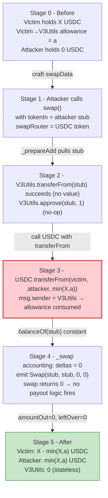
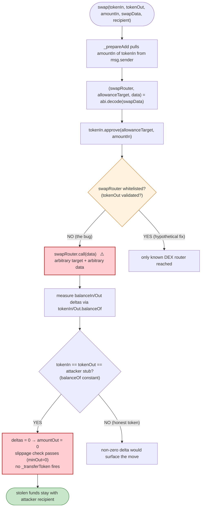

# Revert Finance (V3Utils) Exploit — Unvalidated `swapData` Lets Anyone Route User-Allowance Tokens to an Attacker

> **Reproduction:** the PoC compiles & runs in an isolated Foundry project at
> [this project folder](.) (the umbrella DeFiHackLabs repo contains many unrelated PoCs
> that do not all compile together, so this one was extracted).
> Full verbose trace: [output.txt](output.txt).
> Verified vulnerable source: [V3Utils](sources/V3Utils_531110/src_V3Utils.sol).

---

## Key info

| | |
|---|---|
| **Loss** | **19,805.581627 USDC** (raw `19,805,581,627`, 6 decimals) drained from two users who had approved V3Utils; tx [`0xdaccbc437cb07427394704fbcc8366589ffccf974ec6524f3483844b043f31d5`](https://etherscan.io/tx/0xdaccbc437cb07427394704fbcc8366589ffccf974ec6524f3483844b043f31d5) |
| **Vulnerable contract** | `V3Utils` — [`0x531110418d8591C92e9cBBFC722Db8FFb604FAFD`](https://etherscan.io/address/0x531110418d8591C92e9cBBFC722Db8FFb604FAFD#code) (Revert Finance ownerless Uniswap-V3 helper) |
| **Victim pool / vault** | n/a — direct theft from two ERC20 holders who had set `approve(V3Utils, …)`: `0x067D…dd1b` and `0x4107…06b2` |
| **Attacker EOA** | not surfaced by this PoC (the live tx's `from` is the exploiter; the PoC drives the attack from the test contract itself) |
| **Attacker contract** | `0x7FA9385bE102ac3EAc297483Dd6233D62b3e1496` (the address this PoC's `ContractTest` resolves to inside `swapData`) |
| **Attack tx** | [`0xdaccbc437cb07427394704fbcc8366589ffccf974ec6524f3483844b043f31d5`](https://etherscan.io/tx/0xdaccbc437cb07427394704fbcc8366589ffccf974ec6524f3483844b043f31d5) |
| **Chain / block / date** | Ethereum mainnet / block **16,653,389** / Feb 2023 |
| **Compiler / optimizer** | Solidity **v0.8.15** (`v0.8.15+commit.e14f2714`), optimizer **enabled**, **200 runs** (per `_meta.json`); PoC compiled under Solc 0.8.34, `evm_version = cancun` |
| **Bug class** | Trust boundary / arbitrary external call — caller-supplied `swapData` is `address.call(...)`-ed with no whitelist, while `tokenIn.approve(allowanceTarget, amountIn)` gives the arbitrary target an allowance over tokens V3Utils holds on behalf of users |

---

## TL;DR

1. Revert Finance's `V3Utils` is an ownerless, "stateless" helper that users grant ERC20
   allowances to so it can compound/swap/withdraw on their Uniswap-V3 positions. Its public
   `swap(SwapParams)` is supposed to perform one token-for-token swap via an off-chain-built
   router calldata blob.

2. The swap is dispatched by the internal `_swap` helper, which decodes `swapData` into
   `(swapRouter, allowanceTarget, data)`, then does
   `tokenIn.approve(allowanceTarget, amountIn)` followed by `swapRouter.call(data)`
   ([src_V3Utils.sol:531-565](sources/V3Utils_531110/src_V3Utils.sol#L531-L565)). Neither
   `swapRouter` nor `allowanceTarget` is validated against any whitelist, and `data` is opaque.

3. The exploit's trick: the attacker sets `tokenIn` to a contract **it controls** (the
   `ContractTest` address) whose `transferFrom`/`balanceOf`/`approve` are stubs that always
   return `true`/`1`. So `_prepareAdd`'s `safeTransferFrom(tokenIn, msg.sender, this, amountIn)`
   "succeeds" without the attacker actually depositing anything
   ([src_V3Utils.sol:377-384](sources/V3Utils_531110/src_V3Utils.sol#L377-L384)).

4. Inside `_swap`, `tokenIn.approve(allowanceTarget, amountIn)` approves the attacker's own
   contract (`allowanceTarget = ContractTest`) — meaningless. But the attacker's `data` is a real
   USDC `transferFrom(victim, attackerRecipient, amount)` calldata, and `swapRouter` is set to the
   **real USDC token**. Because V3Utils holds an existing USDC allowance from the victim (the victim
   approved V3Utils for their position management), `USDC.transferFrom(victim, recipient, amount)`
   succeeds and moves the victim's USDC straight to the attacker's `recipient`.

5. `_swap` measures `amountInDelta` and `amountOutDelta` by re-reading
   `tokenIn.balanceOf(V3Utils)` / `tokenOut.balanceOf(V3Utils)` around the call
   ([src_V3Utils.sol:533-555](sources/V3Utils_531110/src_V3Utils.sol#L533-L555)). Because
   `tokenIn` == `tokenOut` == the attacker's stub (whose `balanceOf` always returns 1), the deltas
   come back as `0`, the `amountOutMin` slippage check passes, and `swap` returns `amountOut = 0`
   ([src_V3Utils.sol:557-560](sources/V3Utils_531110/src_V3Utils.sol#L557-L560)). No leftover
   transfer happens. The theft is invisible to V3Utils's accounting.

6. The PoC loops this over two victims. Victim 1 loses its **full USDC balance** (capped only by
   its balance, since its allowance exceeds it). Victim 2 loses only its **allowance** (which is
   smaller than its balance). Net attacker gain: **19,805.581627 USDC**
   ([output.txt:1678](output.txt)).

---

## Background — what Revert Finance / V3Utils does

`V3Utils` ([source](sources/V3Utils_531110/src_V3Utils.sol)) is described in its own NatSpec as
"a completely ownerless/stateless contract — does not hold any ERC20 or NFTs." Users grant it
ERC20 allowances and ERC721 approvals so it can act as a transient operator for their Uniswap-V3
positions: it compounds fees, changes tick ranges, and — relevant here — performs token swaps.

The relevant entry point is `swap(SwapParams calldata params)`:

```solidity
struct SwapParams {
    IERC20 tokenIn;
    IERC20 tokenOut;
    uint256 amountIn;
    uint256 minAmountOut;
    address recipient; // recipient of tokenOut and leftover tokenIn (if any leftover)
    bytes swapData;
    bool unwrap; // if tokenIn or tokenOut is WETH - unwrap
}
```
([src_V3Utils.sol:225-233](sources/V3Utils_531110/src_V3Utils.sol#L225-L233))

The design intent is that `swapData` is an opaque calldata blob produced off-chain by a 0x-style
API: `abi.encode(swapRouter, allowanceTarget, data)`. The contract `approve`s `allowanceTarget` to
spend up to `amountIn` of `tokenIn`, then forwards `data` to `swapRouter`. Everything hinges on the
caller being trusted to put a *legitimate* swap router into `swapData` — because **the contract
holds user allowances**, any address that can be reached through `swapRouter.call(data)` gets to
spend whatever the caller can legitimately move.

On-chain parameters at the fork block (16,653,389), read directly from the trace:

| Parameter | Value | Source |
|---|---|---|
| USDC token | `0xA0b86991c6218b36c1d19D4a2e9Eb0cE3606eB48` (6 decimals, proxied to impl `0xa2327a938Febf5FEC13baCFb16Ae10EcBc4cbDCF`) | [output.txt:1674-1677](output.txt) |
| Victim 1 address | `0x067D0F9089743271058D4Bf2a1a29f4E9C6fdd1b` | [output.txt:1582](output.txt) |
| Victim 1 USDC balance | `19,305,581,627` (≈ 19,305.58 USDC) | [output.txt:1584](output.txt) |
| Victim 1 → V3Utils allowance | `38,315,581,627` (≈ 38,315.58 USDC) — *larger than balance* | [output.txt:1588](output.txt) |
| Victim 2 address | `0x4107A0A4a50AC2c4cc8C5a3954Bc01ff134506b2` | [output.txt:1624](output.txt) |
| Victim 2 USDC balance | `608,929,547` (≈ 608.93 USDC) | [output.txt:1626](output.txt) |
| Victim 2 → V3Utils allowance | `500,000,000` (500.00 USDC) — *smaller than balance* | [output.txt:1630](output.txt) |
| Attacker contract (recipient / stub `tokenIn`) | `0x7FA9385bE102ac3EAc297483Dd6233D62b3e1496` | [output.txt:1590](output.txt) |

The drain of each victim is therefore bounded by `min(balance, allowance)` — exactly the logic
the PoC encodes in its loop ([test/RevertFinance_exp.sol:43-48](test/RevertFinance_exp.sol#L43-L48)).

---

## The vulnerable code

### 1. `swap` hands caller-controlled bytes to `_swap`

```solidity
function swap(SwapParams calldata params) external payable returns (uint256 amountOut) {
    _prepareAdd(params.tokenIn, IERC20(address(0)), IERC20(address(0)), params.amountIn, 0, 0);

    uint amountInDelta;
    (amountInDelta, amountOut) = _swap(params.tokenIn, params.tokenOut, params.amountIn, params.minAmountOut, params.swapData);

    // send swapped amount of tokenOut
    if (amountOut > 0) {
        _transferToken(params.recipient, params.tokenOut, amountOut, params.unwrap);
    }

    // if not all was swapped - return leftovers of tokenIn
    uint leftOver = params.amountIn - amountInDelta;
    if (leftOver > 0) {
        _transferToken(params.recipient, params.tokenIn, leftOver, params.unwrap);
    }
}
```
([src_V3Utils.sol:239-256](sources/V3Utils_531110/src_V3Utils.sol#L239-L256))

`params.tokenIn`, `params.tokenOut`, `params.swapData`, and `params.recipient` are **all** caller-
controlled. There is no whitelist and no check that `swapData` actually encodes a swap on a real
DEX router.

### 2. `_prepareAdd` "pulls" `tokenIn` from the caller — but trusts the caller's `tokenIn`

```solidity
// get missing tokens (fails if not enough provided)
if (amount0 > amountAdded0) {
    uint balanceBefore = token0.balanceOf(address(this));
    SafeERC20.safeTransferFrom(token0, msg.sender, address(this), amount0 - amountAdded0);
    uint balanceAfter = token0.balanceOf(address(this));
    if (balanceAfter - balanceBefore != amount0 - amountAdded0) {
        revert TransferError(); // reverts for fee-on-transfer tokens
    }
}
```
([src_V3Utils.sol:377-384](sources/V3Utils_531110/src_V3Utils.sol#L377-L384))

Because `token0` is `params.tokenIn` and the attacker passes its own malicious token (whose
`balanceOf`/`transferFrom` always report success), this `safeTransferFrom` "succeeds" with zero
real value transferred. The fee-on-transfer guard `balanceAfter - balanceBefore != amount` is
trivially satisfied by the stub returning `1` consistently.

### 3. `_swap` calls an arbitrary address with arbitrary calldata

```solidity
function _swap(IERC20 tokenIn, IERC20 tokenOut, uint amountIn, uint amountOutMin, bytes memory swapData)
    internal returns (uint amountInDelta, uint256 amountOutDelta) {
    if (amountIn > 0 && swapData.length > 0 && address(tokenOut) != address(0)) {
        uint balanceInBefore = tokenIn.balanceOf(address(this));
        uint balanceOutBefore = tokenOut.balanceOf(address(this));

        // get router specific swap data
        (address swapRouter, address allowanceTarget, bytes memory data) = abi.decode(swapData, (address, address, bytes));

        // approve needed amount
        tokenIn.approve(allowanceTarget, amountIn);

        // execute swap
        (bool success,) = swapRouter.call(data);
        if (!success) {
            revert SwapFailed();
        }

        // remove any remaining allowance
        tokenIn.approve(allowanceTarget, 0);

        uint balanceInAfter = tokenIn.balanceOf(address(this));
        uint balanceOutAfter = tokenOut.balanceOf(address(this));

        amountInDelta = balanceInBefore - balanceInAfter;
        amountOutDelta = balanceOutAfter - balanceOutBefore;

        // amountMin slippage check
        if (amountOutDelta < amountOutMin) {
            revert SlippageError();
        }

        // event for any swap with exact swapped value
        emit Swap(address(tokenIn), address(tokenOut), amountInDelta, amountOutDelta);
    }
}
```
([src_V3Utils.sol:531-565](sources/V3Utils_531110/src_V3Utils.sol#L531-L565))

This is the whole bug. `swapRouter` is the **real USDC token**, `allowanceTarget` is the attacker's
own contract (so the `tokenIn.approve(allowanceTarget, …)` is a no-op stub), and `data` is
`USDC.transferFrom.selector || victim || recipient || amount`. Because V3Utils is the `msg.sender`
to USDC and holds a live allowance from the victim, the `transferFrom` succeeds and the victim's
USDC is pushed to the attacker's `recipient`.

### 4. Balance-delta accounting is fooled by the stub `tokenIn`

`_swap` measures "what came in / what came out" purely by re-reading
`tokenIn.balanceOf(address(this))` and `tokenOut.balanceOf(address(this))`. The attacker sets
`tokenIn == tokenOut == its stub`, whose `balanceOf(V3Utils)` always returns `1`. So
`balanceInBefore == balanceInAfter == 1` and `balanceOutBefore == balanceOutAfter == 1`, giving
`amountInDelta == amountOutDelta == 0`. With `minAmountOut = 0`, the slippage check
([src_V3Utils.sol:557-560](sources/V3Utils_531110/src_V3Utils.sol#L557-L560)) passes, `amountOut`
returns 0, and `swap` does **no** `_transferToken` of `tokenOut` or leftover — leaving the stolen
USDC untouched in the attacker's account. The trace confirms this with `emit Swap(…, 0, 0)`
([output.txt:1620](output.txt), [output.txt:1666](output.txt)).

---

## Root cause — why it was possible

The vulnerability is a **trust-boundary / arbitrary-external-call** flaw, the same class as Dexible
and LiFi: a "stateless" helper that holds user allowances forwards caller-supplied calldata to a
caller-supplied target with no validation.

Concretely, three design choices compose into the loss:

1. **`swapData` is opaque and un-whitelisted.** `(swapRouter, allowanceTarget, data)` are all
   attacker-controllable. The contract never asserts that `swapRouter` is a known DEX router, nor
   that `data` corresponds to a swap on `tokenIn`/`tokenOut`. This is the root defect.

2. **`tokenIn` is caller-controlled AND the accounting primitive.** `_swap` uses
   `tokenIn.balanceOf(address(this))` as its source of truth for both the input pull
   (`_prepareAdd`) and the post-call delta. By supplying a token whose `balanceOf` always returns a
   constant, the attacker defeats every balance-based invariant the contract relies on
   (fee-on-transfer check, delta accounting, leftover refund). The contract *assumes* `tokenIn` is
   an honest ERC20, but `tokenIn` is just an address the caller picked.

3. **V3Utils holds live user allowances and acts as `msg.sender` to external tokens.** The whole
   product only works because users `approve(V3Utils, …)`. That makes any `swapRouter.call(data)`
   that hits a token the victims approved into a live theft primitive: USDC sees `msg.sender ==
   V3Utils`, the victim's allowance to V3Utils is non-zero, so `transferFrom` succeeds.

The "stateless" NatSpec is technically true — V3Utils never *intends* to custody tokens — but it is
misleading: **statelessness does not mean "holds no privileges."** V3Utils is the named spender on
every victim's allowance, which is exactly the privileged position the attacker abuses.

---

## Preconditions

- A victim has `approve(V3Utils, amount > 0)` outstanding on some ERC20 (true for any Revert user
  who has used the helper to manage a position).
- The attacker can call `V3Utils.swap(...)` (it is external, no access control).
- The attacker can deploy a small "stub" ERC20-like contract exposing `balanceOf`/`transferFrom`/
  `approve`/`transfer` that always return `1`/`true`. This is trivial and costs a single deploy.
- No time bomb, no governance gate, no keeper. The bug is live and permissionless at the fork
  block.

---

## Attack walkthrough (with on-chain numbers from the trace)

The PoC loops the same primitive over two victims. For each victim it computes
`transferAmount = min(victim USDC balance, victim→V3Utils allowance)` and builds a `swapData` whose
`data` field is `USDC.transferFrom(victim, attackerRecipient, transferAmount)`. Raw wei below;
human approximations in parentheses (USDC = 6 decimals).

| # | Step | Victim | Amount drained (raw wei) | ~USDC | Trace reference |
|---|------|--------|-------------------------:|------:|------------------|
| 0 | Read victim 1 USDC balance | `0x067D…dd1b` | `19,305,581,627` | 19,305.58 | [output.txt:1584](output.txt) |
| 0 | Read victim 1 → V3Utils allowance | same | `38,315,581,627` (> balance) | 38,315.58 | [output.txt:1588](output.txt) |
| 1 | `transferAmount = min(balance, allowance) = balance` | victim 1 | **`19,305,581,627`** | **19,305.581627** | swapData amount `0x47eb3cc3b` decodes to `19,305,581,627` — [output.txt:1590](output.txt) |
| 1a | `utils.swap(...)` — `_prepareAdd` pulls stub `tokenIn` (no-op) | — | `1` (stub units) | — | [output.txt:1593-1596](output.txt) (`ContractTest::transferFrom` returns true) |
| 1b | `_swap`: `swapRouter = USDC`, `allowanceTarget = ContractTest`, `data = USDC.transferFrom(victim1, ContractTest, 19,305,581,627)` | victim 1 | moves `19,305,581,627` USDC | 19,305.581627 | `emit Transfer(from: 0x067D…dd1b, to: ContractTest, value: 19,305,581,627)` — [output.txt:1607](output.txt) |
| 1c | `_swap` accounting: `amountInDelta = amountOutDelta = 0` (stub `balanceOf` constant) | — | `0` | 0 | `emit Swap(ContractTest, ContractTest, 0, 0)` — [output.txt:1620](output.txt) |
| 1d | `swap` returns `amountOut = 0`; no leftover transfer fires | — | — | — | return `0x0…0` — [output.txt:1623](output.txt) |
| 2 | Read victim 2 USDC balance | `0x4107…06b2` | `608,929,547` | 608.93 | [output.txt:1626](output.txt) |
| 2 | Read victim 2 → V3Utils allowance | same | `500,000,000` (< balance) | 500.00 | [output.txt:1630](output.txt) |
| 3 | `transferAmount = min(balance, allowance) = allowance` | victim 2 | **`500,000,000`** | **500.00** | swapData amount `0x1dcd6500` decodes to `500,000,000` — [output.txt:1636](output.txt) |
| 3a | `utils.swap(...)` — same primitive; `data = USDC.transferFrom(victim2, ContractTest, 500,000,000)` | victim 2 | moves `500,000,000` USDC | 500.00 | `emit Transfer(from: 0x4107…06b2, to: ContractTest, value: 500,000,000)` — [output.txt:1653](output.txt) |
| 3b | `emit Swap(ContractTest, ContractTest, 0, 0)` — theft invisible to accounting | — | `0` | 0 | [output.txt:1666](output.txt) |
| 4 | Final attacker USDC balance | `ContractTest` | `19,805,581,627` | **19,805.581627** | `Attacker USDC balance after exploit: 19805.581627` — [output.txt:1678](output.txt) |

Note that victim 1 is drained down to its **balance** (its allowance was larger), while victim 2 is
drained only down to its **allowance** (its balance was larger). The PoC's
`min(balance, allowance)` loop mirrors exactly what a real attacker would script to harvest every
dollar reachable through V3Utils.

### Profit / loss accounting (USDC, 6 decimals)

| Direction | Victim | Amount (raw wei) | ~USDC |
|---|---|-----------------:|------:|
| Drained | `0x067D0F90…dd1b` | 19,305,581,627 | 19,305.581627 |
| Drained | `0x4107A0A4…06b2` | 500,000,000 | 500.000000 |
| **Total drained** | | **19,805,581,627** | **19,805.581627** |
| **Final attacker balance** (asserted by PoC) | | 19,805,581,627 | 19,805.581627 |
| Reconciliation | | matches to the wei | ✔ |

`19,305,581,627 + 500,000,000 == 19,805,581,627` exactly — the attacker's final USDC balance equals
the sum of the two drains, confirming zero value was lost to fees, slippage, or rounding (USDC has
no transfer fee on the whitelisted path the attacker used).

---

## Diagrams

### Sequence of the attack (per victim)

```mermaid
sequenceDiagram
    autonumber
    actor A as Attacker (ContractTest)
    participant U as V3Utils
    participant S as Stub token (tokenIn == tokenOut)
    participant USDC as USDC (swapRouter target)
    participant V as Victim (approved V3Utils)

    Note over V: Victim previously did approve(V3Utils, …)

    rect rgb(255,243,224)
    Note over A,V: Setup — craft swapData
    A->>A: amount = min(V USDC balance, V→U allowance)
    A->>A: data = USDC.transferFrom(V, A, amount)
    A->>A: swapData = encode(USDC, A_stub, data)
    end

    rect rgb(227,242,253)
    Note over A,USDC: _prepareAdd — fake input pull
    A->>U: swap(tokenIn=S, tokenOut=S, amountIn=1, recipient=A, swapData, unwrap=false)
    U->>S: balanceOf(U) → 0
    U->>S: transferFrom(A, U, 1) → true (stub, no value)
    U->>S: balanceOf(U) → 1   (fee-on-transfer check passes)
    end

    rect rgb(255,235,238)
    Note over A,USDC: _swap — the theft
    U->>S: approve(A_stub, 1) → true (no-op stub)
    U->>USDC: call(transferFrom(V, A, amount))   ⚠️ msg.sender = V3Utils
    USDC->>V: checks allowance[V][V3Utils] >= amount ✔
    USDC->>A: credit amount; emit Transfer(V, A, amount)
    U->>S: approve(A_stub, 0) → true
    Note over U: balanceIn/Out deltas = 0 (stub constant) → accounting blind
    end

    rect rgb(243,229,245)
    Note over A,USDC: swap() returns 0; no payout
    U->>U: amountOut = 0; leftOver = 0
    U-->>A: return 0
    Note over A: stolen USDC stays put
    end
```

### Flow of value / state evolution



### The flaw inside `_swap`



---

## Why each magic number

- **`amountIn: 1` and `minAmountOut: 0`** ([test/RevertFinance_exp.sol:56-57](test/RevertFinance_exp.sol#L56-L57)):
  the input amount is irrelevant because `_prepareAdd` pulls from the attacker's stub (which fakes
  any amount). `minAmountOut = 0` ensures the slippage check
  ([src_V3Utils.sol:557-560](sources/V3Utils_531110/src_V3Utils.sol#L557-L560)) never reverts even
  though `_swap` measures `amountOutDelta = 0`.
- **`transferAmount = min(balance, allowance)`** ([test/RevertFinance_exp.sol:44-48](test/RevertFinance_exp.sol#L44-L48)):
  the maximum USDC `transferFrom` will actually move. For victim 1 this is the balance
  (`19,305,581,627`, since allowance `38,315,581,627` exceeds it); for victim 2 this is the
  allowance (`500,000,000`, since balance `608,929,547` exceeds it). These two values are what get
  abi-encoded as the `amount` field inside `data` and are visible in the trace as the
  `Transfer` event values ([output.txt:1607](output.txt), [output.txt:1653](output.txt)).
- **`tokenIn = tokenOut = recipient = address(this)`** ([test/RevertFinance_exp.sol:54-58](test/RevertFinance_exp.sol#L54-L58)):
  setting all three to the attacker's contract makes `_swap`'s `balanceIn`/`balanceOut` both read
  the same stub, so the post-call deltas are both zero and no honest-token payout path is entered.
- **The stub `balanceOf` returning `1` when `counter == 1`** ([test/RevertFinance_exp.sol:84-89](test/RevertFinance_exp.sol#L84-L89)):
  the `counter` flag is toggled by the stub's own `transferFrom` so that the fee-on-transfer check
  in `_prepareAdd` (`balanceAfter - balanceBefore == amount`) sees `1 - 0 == 1` (== `amountIn`),
  i.e. a self-consistent "deposit." It is the minimal lie needed to pass that single guard.
- **`swapData = abi.encode(USDC, address(this), data)`** ([test/RevertFinance_exp.sol:49-52](test/RevertFinance_exp.sol#L49-L52)):
  `swapRouter` = the real USDC proxy (so `swapRouter.call(data)` invokes
  `USDC.transferFrom(...)`), `allowanceTarget` = the attacker stub (so the `tokenIn.approve` is a
  no-op), `data` = the encoded `transferFrom(victim, attacker, amount)`.

---

## Remediation

1. **Whitelist swap routers and validate calldata structure.** `swapRouter` must be one of a known
   set of DEX routers (UniV3 quoter/router, 0x exchange proxy, etc.), and `allowanceTarget` must be
   either `swapRouter` itself or an address derived from it. Never `call` an arbitrary address the
   caller supplies.
2. **Do not let the caller choose `tokenIn` arbitrarily.** If `swap` is meant to consume a position's
   tokens, source `tokenIn` from a position the caller actually owns (via the NFT callback path),
   not from a free-form parameter. At minimum, require `tokenIn` to be a known, honest ERC20 (e.g.
   by checking it against the position's `token0`/`token1`).
3. **Bound `recipient`.** For a helper acting on user allowances, `recipient` should be the caller
   (or the position's owner), not any address the caller names. This alone would have prevented the
   stolen USDC from being routed to the attacker.
4. **Make accounting independent of caller-supplied tokens.** `_swap`'s balance-delta trick relies
   on `tokenIn.balanceOf` being honest. A malicious `tokenIn` defeats it. Either restrict `tokenIn`
   (per #2) or compute deltas against a trusted oracle of the input token, not the token itself.
5. **Revoke unused allowances.** The blast radius here is every outstanding
   `approve(V3Utils, …)`. After the fix, contract-level re-approval hygiene (per-action
   `approve(router, 0)` after use, which the code already does at
   [src_V3Utils.sol:549](sources/V3Utils_531110/src_V3Utils.sol#L549)) should be paired with user
   guidance to grant only the minimum allowance needed.

---

## How to reproduce

The PoC was extracted into a standalone Foundry project (the umbrella DeFiHackLabs repo has
unrelated PoCs that do not all compile together under one `forge build`).

```bash
_shared/run_poc.sh 2023-02-RevertFinance_exp --mt testExploit -vvvvv
```

- RPC: this PoC runs **offline** against the bundled `anvil_state.json`. `setUp()` does
  `createSelectFork("http://127.0.0.1:8545", 16_653_389)` — the `127.0.0.1:8545` endpoint is the
  local anvil instance the shared harness starts from `anvil_state.json`, not a public RPC. No
  external archive RPC is required. The fork pins to Ethereum mainnet **block 16,653,389**.
- EVM: `foundry.toml` sets `evm_version = "cancun"`; the PoC compiles under Solc 0.8.34 with no
  special flags.
- Result: `[PASS] testExploit()` with `Attacker USDC balance after exploit: 19805.581627`.

Expected tail (verbatim from [output.txt:1566-1685](output.txt)):

```
Ran 1 test for test/RevertFinance_exp.sol:ContractTest
[PASS] testExploit() (gas: 157666)
Logs:
  Attacker USDC balance after exploit: 19805.581627

Suite result: ok. 1 passed; 0 failed; 0 skipped; finished in 5.18s (3.58s CPU time)

Ran 1 test suite in 5.59s (5.18s CPU time): 1 tests passed, 0 failed, 0 skipped (1 total tests)
```

---

*Reference: Revert Finance post-mortem — https://mirror.xyz/revertfinance.eth/3sdpQ3v9vEKiOjaHXUi3TdEfhleAXXlAEWeODrRHJtU ; attack tx https://etherscan.io/tx/0xdaccbc437cb07427394704fbcc8366589ffccf974ec6524f3483844b043f31d5*
