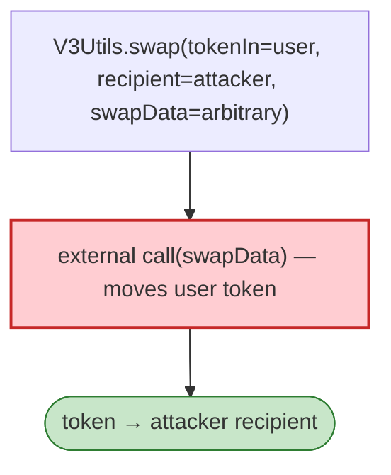

# Revert Finance (V3Utils) Exploit — Unvalidated `swapData` in `V3Utils.swap`

> **Reproduction:** the PoC compiles & runs in an isolated Foundry project at
> [this project folder](.). Full verbose trace: [output.txt](output.txt).
> Verified vulnerable source: [V3Utils](sources/V3Utils_531110).

---

## Key info

| | |
|---|---|
| **Loss** | tokens drained from users who approved V3Utils; tx `0xdaccbc43…` |
| **Vulnerable contract** | `V3Utils` `0x531110…` (Revert Finance Uniswap-V3 helper) |
| **Chain / block / date** | Ethereum mainnet / Feb 2023 |
| **Bug class** | Trust boundary — `V3Utils.swap(SwapParams{tokenIn, tokenOut, amountIn, recipient, swapData, unwrap})` used the caller-supplied `swapData` in an external call without validating the target, draining user-approved tokens. |

---

## TL;DR

Revert's `V3Utils.swap` took arbitrary `swapData` and `recipient`, then called an external target with
that data to perform a "swap". With no whitelist on the call target and `recipient` attacker-chosen,
any user who had approved V3Utils could have their tokens pulled and sent to the attacker.

---

## Root cause

A **caller-trusted external call** (`swapData` → arbitrary target) plus attacker-chosen `recipient` on a
contract holding user allowances. Same class as Dexible/LiFi.

---

## Diagrams



---

## Remediation

1. Whitelist swap targets; validate `recipient` is the caller or a bound address.
2. Verify post-call balances; never route user tokens to arbitrary recipients.

---

## How to reproduce

```bash
_shared/run_poc.sh 2023-02-RevertFinance_exp -vvvvv
```

- RPC: mainnet archive. Result: `[PASS]` — token routed to attacker via crafted swap.

---

*Reference: Revert Finance V3Utils unvalidated swapData, mainnet, Feb 2023.*
