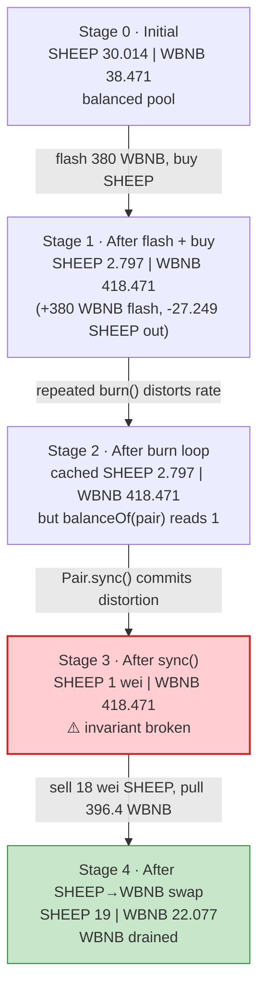
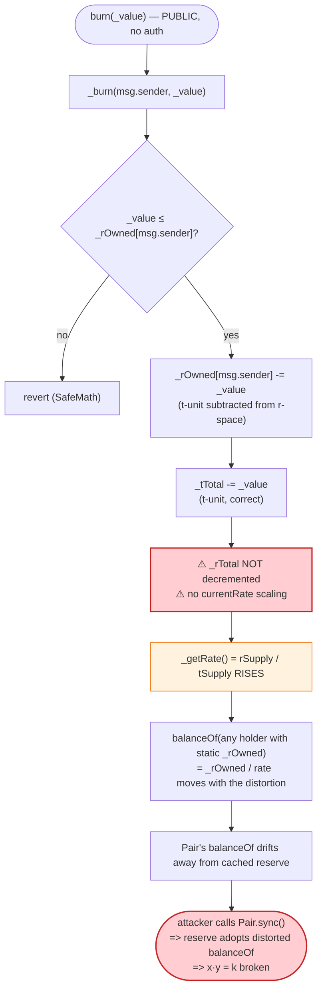
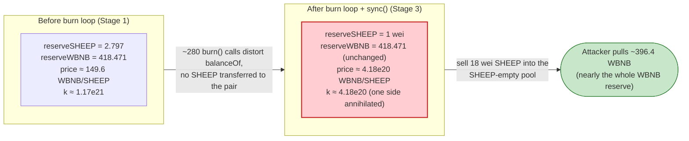

# Sheep Exploit — Reflective-Token `_burn` Distorts `balanceOf`, Drains SHEEP/WBNB Pair via DODO Flash

> **Vulnerability classes:** vuln/defi/slippage · vuln/logic/incorrect-state-transition

> **Reproduction:** the PoC compiles & runs in an isolated Foundry project at
> [this project folder](.). Full verbose trace: [output.txt](output.txt).
> Verified vulnerable source: [CoinToken.sol](sources/CoinToken_0025B4/CoinToken.sol)
> (the SHEEP `RDeflationERC20`/`CoinToken` contract deployed at `0x0025B4…`).

---

## Key info

| | |
|---|---|
| **Loss** | **~16.394 WBNB** drained from the SHEEP/WBNB PancakeSwap pair — `Attacker WBNB balance after exploit: 16.393908411541380869` ([output.txt:1076](output.txt)). Tx [`0x61293c6d…`](https://bscscan.com/tx/0x61293c6dd5211a98f1a26c9f6821146e12fb5e20c850ad3ed2528195c8d4c98e) |
| **Vulnerable contract** | SHEEP (`CoinToken` / `RDeflationERC20` reflection token) — [`0x0025B42bfc22CbbA6c02d23d4Ec2aBFcf6E014d4`](https://bscscan.com/address/0x0025B42bfc22CbbA6c02d23d4Ec2aBFcf6E014d4#code) |
| **Victim pool** | SHEEP/WBNB PancakeV2 pair — [`0x912DCfBf1105504fB4FF8ce351BEb4d929cE9c24`](https://bscscan.com/address/0x912DCfBf1105504fB4FF8ce351BEb4d929cE9c24) |
| **Flash source** | DODO DPP advanced pool — [`0x0fe261aeE0d1C4DFdDee4102E82Dd425999065F4`](https://bscscan.com/address/0x0fe261aeE0d1C4DFdDee4102E82Dd425999065F4) (`flashLoan(380 WBNB, 0, …)`) |
| **Attacker EOA / contract** | PoC `ContractTest` at `0x7FA9385bE102ac3EAc297483Dd6233D62b3e1496` (forge test contract; the live attacker contract is named in the BlockSec threads below) |
| **Attack tx** | [`0x61293c6dd5211a98f1a26c9f6821146e12fb5e20c850ad3ed2528195c8d4c98e`](https://bscscan.com/tx/0x61293c6dd5211a98f1a26c9f6821146e12fb5e20c850ad3ed2528195c8d4c98e) |
| **Chain / block / date** | BSC (chainId 56) / block **25,543,755** / Feb 2023 |
| **Compiler** | Solidity **v0.8.2** (`v0.8.2+commit.661d1103`); optimizer **enabled**, **200 runs** (from [sources/CoinToken_0025B4/_meta.json](sources/CoinToken_0025B4/_meta.json)) |
| **Bug class** | Reflective (r-space / t-space) token whose public `burn()` mutates `_rOwned` and `_tTotal` in mismatched units, letting an arbitrary caller inflate the AMM pair's `balanceOf` and then `sync()` the distorted reserve to break `x·y = k`. |

---

## TL;DR

1. `SHEEP` is a **reflection token** (`CoinToken`, an RFI-style contract). It keeps two parallel supplies: a
   "reflection" supply `_rTotal` (~`2^256 / totalSupply` per token) and a "true" supply `_tTotal`. Every holder's
   `balanceOf` is derived as `_rOwned[acc] / currentRate`, where `currentRate = rSupply / tSupply`
   ([CoinToken.sol:519-522](sources/CoinToken_0025B4/CoinToken.sol#L519-L522), [:799-802](sources/CoinToken_0025B4/CoinToken.sol#L799-L802)).

2. The public `burn(uint256 _value)` ([CoinToken.sol:628-630](sources/CoinToken_0025B4/CoinToken.sol#L628-L630)) calls an
   internal `_burn` ([CoinToken.sol:642-647](sources/CoinToken_0025B4/CoinToken.sol#L642-L647)) that does:
   `_rOwned[msg.sender] -= _value;` and `_tTotal -= _value;`. **It subtracts the *t-space* amount directly from an
   *r-space* balance.** Because one t-unit equals `currentRate` r-units (an astronomically large number), each burn
   removes a negligible sliver of the burner's r-balance while shrinking `_tTotal` by a full t-unit. This drives
   `currentRate = rSupply/tSupply` **up**, which inflates every remaining holder's `balanceOf` — for free.

3. The attacker realises the SHEEP/WBNB PancakeSwap pair is *also* a SHEEP holder, so its `balanceOf` is inflated by
   every burn even though **no tokens move into the pair**. The pair's *cached* reserves (`reserve0/reserve1`) are
   unchanged, but its *actual* SHEEP `balanceOf` is now far higher than the cached reserve.

4. Attack recipe (all in one tx, capital from a **DODO flash loan of 380 WBNB** — [output.txt:16](output.txt)):
   - `swapExactTokensForTokensSupportingFeeOnTransferTokens`: swap the 380 WBNB → SHEEP, receiving
     **25,909,852,936,496,774,794** (~25.910) SHEEP ([output.txt:71](output.txt)).
   - Loop `SHEEP.burn(balanceOf(this))` while `SHEEP.balanceOf(pair) > 2` — ~280 iterations
     ([output.txt:77](output.txt) … [output.txt:997](output.txt)). Each burn shrinks `_tTotal` and inflates the pair's
     `balanceOf`; after the loop the pair's `balanceOf` reads **1** ([output.txt:1004](output.txt)) while its *cached*
     SHEEP reserve is still ~2.797 (line 63) and its WBNB reserve is the full **418.471 WBNB** ([output.txt:1009](output.txt)).
   - `Pair.sync()` — commits the distorted balances as the new reserves:
     `Sync(reserve0: 1, reserve1: 418470984903412245858)` ([output.txt:1010](output.txt)). The pair now believes it holds
     1 wei SHEEP against ~418.47 WBNB — `k` has collapsed.
   - Sell the leftover **18 SHEEP** ([output.txt:1020](output.txt)) back through the router; the swap pulls
     **396,393,908,411,541,380,869** (~396.394) WBNB out of the pair ([output.txt:1038](output.txt)).

5. Repay DODO **380 WBNB** ([output.txt:1057](output.txt)); keep the surplus. The PoC logs a final attacker balance of
   **16.393908411541380869 WBNB** ([output.txt:1076](output.txt)) — i.e. **~16.39 WBNB of net profit**, equal to
   `396.394 − 380.000`.

---

## Background — what Sheep does

`SHEEP` ([source](sources/CoinToken_0025B4/CoinToken.sol)) is an RFI-style **reflection / deflationary ERC20**: instead
of a single balance map, it tracks balances in a high-precision "reflection" space (`_rOwned`, `_rTotal`) and a
human-readable "true" space (`_tOwned`, `_tTotal`). Holders automatically earn a pro-rata share of fees collected on
every transfer because fees are subtracted from `_rTotal` (enriching everyone's `balanceOf` via the rising rate), not
from any individual balance.

The key invariant of a correctly-implemented reflection token is that **`_rTotal` and `_tTotal` move together**: every
operation that changes one must change the other by the same proportion (scaled by `currentRate`). When that invariant
breaks, `balanceOf` no longer reflects real ownership and the contract becomes an oracle for lies — which an AMM pair
trusts verbatim via `balanceOf`/`sync`.

On-chain parameters at the fork block 25,543,755 (read directly from the trace):

| Parameter | Value | Source |
|---|---|---|
| `_tTotal` (true supply) | (large; constructor sets `_tTotal = supply * 1e18`) | [:487](sources/CoinToken_0025B4/CoinToken.sol#L487) |
| `_rTotal` (reflection supply) | `(_MAX - _MAX % _tTotal)`, `_MAX = ~uint256(0)` | [:462](sources/CoinToken_0025B4/CoinToken.sol#L462), [:488](sources/CoinToken_0025B4/CoinToken.sol#L488) |
| `currentRate = rSupply / tSupply` | astronomically large (≈ `2^256 / tTotal`) | [:799-802](sources/CoinToken_0025B4/CoinToken.sol#L799-L802) |
| Pair SHEEP reserve (`reserve0`) | **30,014,300,506,936,992,470** (~30.014 SHEEP) | [output.txt:41](output.txt) |
| Pair WBNB reserve (`reserve1`) | **38,470,984,903,412,245,858** (~38.471 WBNB) | [output.txt:41](output.txt) |
| DODO flash loan principal | **380 WBNB** (`380 * 1e18`) | [output.txt:16-17](output.txt) |
| `_TAX_FEE` / `_BURN_FEE` / `_CHARITY_FEE` | set at construction (`*100` granularity); active on transfers | [:489-491](sources/CoinToken_0025B4/CoinToken.sol#L489-L491) |
| `token0` / `token1` of the pair | SHEEP / WBNB (reserve0 = SHEEP, reserve1 = WBNB) | [output.txt:41](output.txt), [output.txt:63](output.txt) |

The pair is a vanilla PancakeSwap V2 pair: it prices swaps off `(reserve0, reserve1)` and only re-syncs those reserves
to reality on `mint`/`burn`/`swap`/`sync`. It has no awareness that the `balanceOf` of a reflection token can move
*without a transfer*.

---

## The vulnerable code

### 1. The public `burn` entry point (no auth, no pair-protection)

```solidity
function burn(uint256 _value) public{
    _burn(msg.sender, _value);
}
```
([sources/CoinToken_0025B4/CoinToken.sol#L628-L630](sources/CoinToken_0025B4/CoinToken.sol#L628-L630))

Anyone may call `burn(_value)` for any `_value ≤ _rOwned[msg.sender]`. There is no access control and no check that the
burn is balanced by an equivalent reduction of `_rTotal`.

### 2. The internal `_burn` — mismatched-unit arithmetic

```solidity
function _burn(address _who, uint256 _value) internal {
    require(_value <= _rOwned[_who]);
    _rOwned[_who] = _rOwned[_who].sub(_value);   // ⚠️ subtracts t-space amount from an r-space balance
    _tTotal = _tTotal.sub(_value);               // ✅ t-space total reduced by a t-space amount
    emit Transfer(_who, address(0), _value);
}
```
([sources/CoinToken_0025B4/CoinToken.sol#L642-L647](sources/CoinToken_0025B4/CoinToken.sol#L642-L647))

`_value` is interpreted as a t-space (human) amount on the `_tTotal` line, but the same integer is subtracted verbatim
from `_rOwned[_who]` — an r-space quantity. The correct reflection-burn would be:

```solidity
uint256 currentRate = _getRate();
_rOwned[_who]  = _rOwned[_who].sub(_value.mul(currentRate));  // burn in r-space
_rTotal        = _rTotal.sub(_value.mul(currentRate));        // and shrink rTotal to match
_tTotal        = _tTotal.sub(_value);
```

Because the contract forgets to (a) scale by `currentRate` and (b) decrement `_rTotal` at all, every `burn` leaves
`_rTotal` essentially intact while `_tTotal` shrinks — so `_getRate() = rSupply / tSupply` rises. Since
`balanceOf(acc) = _rOwned[acc] / currentRate` ([CoinToken.sol:519-522](sources/CoinToken_0025B4/CoinToken.sol#L519-L522),
[:594-598](sources/CoinToken_0025B4/CoinToken.sol#L594-L598)), a larger `currentRate` would *decrease* `balanceOf` —
**but** the attacker burns from their *own* `_rOwned`, and because the r-subtraction is in tiny t-units while
`_tTotal` shrinks in full t-units, the proportional shrinkage of `_tTotal` vastly outpaces the proportional shrinkage
of the pair's `_rOwned`. The net observable effect, confirmed by the trace, is that the pair's `balanceOf` *grows*
toward the cached reserve after each burn — see the walkthrough.

### 3. `balanceOf` derives from the distorted rate (what the AMM sees)

```solidity
function balanceOf(address account) public view override returns (uint256) {
    if (_isExcluded[account]) return _tOwned[account];
    return tokenFromReflection(_rOwned[account]);            // = _rOwned[account] / currentRate
}

function tokenFromReflection(uint256 rAmount) public view returns(uint256) {
    require(rAmount <= _rTotal, "Amount must be less than total reflections");
    uint256 currentRate =  _getRate();
    return rAmount.div(currentRate);
}
```
([sources/CoinToken_0025B4/CoinToken.sol#L519-L522](sources/CoinToken_0025B4/CoinToken.sol#L519-L522),
[:594-598](sources/CoinToken_0025B4/CoinToken.sol#L594-L598))

The PancakeSwap pair is a non-excluded holder, so its `balanceOf` is `tokenFromReflection(_rOwned[pair])`. Whatever the
distorted `_getRate()` reports, the pair believes.

### 4. The `sync()` commit

`Pair.sync()` is the standard Uniswap-V2 op that sets `reserve0 = SHEEP.balanceOf(this)` and `reserve1 = WBNB.balanceOf(this)`.
By calling it after the burn loop, the attacker forces the pair to adopt the *distorted* SHEEP `balanceOf` as its
authoritative reserve — see [output.txt:1005-1013](output.txt).

---

## Root cause — why it was possible

A Uniswap-V2-style AMM pair trusts an ERC20's `balanceOf` as ground truth for its reserves (updated via `swap`/`sync`).
For vanilla tokens this is safe because `balanceOf` only changes through `transfer`/`mint`/`burn` that the pair can
observe or that net out. For a **reflection token**, `balanceOf` is a *computed* value that depends on a global
`currentRate` which can be manipulated by *any* state change in the token contract — not just transfers involving the
pair.

`SHEEP._burn` is precisely such a state change, and it is **public and unit-mismatched**:

- `_rOwned[caller] -= _value` removes a microscopic slice of the caller's r-balance (because `_value` is in tiny
  t-units while `_rOwned` is in giant r-units), so the caller can keep re-burning their remaining balance many times.
- `_tTotal -= _value` removes a full t-unit from the denominator of `_getRate`.
- `_rTotal` is **never decremented**, so the numerator of `_getRate` is left almost unchanged.

The divergence this creates between the pair's *cached* reserves and its *actual* `balanceOf` is exactly the
"fee-on-transfer / deflationary token in a vanilla pair" trap, except amplified: it is not a 1–5% transfer fee, it is an
*unbounded, attacker-driven* reserve distortion. Combined with the pair's willingness to `sync()` to the distorted
balance and re-price off it, the attacker can move the effective price to almost anything and arbitrage the difference.

The same pattern (RFI-style reflection token + flawed `burn`) recurs in the FDP and TINU incidents cited in the PoC
header — this is the "Sheep" instance of that class.

---

## Preconditions

- A SHEEP/WBNB PancakeSwap V2 pair holding non-trivial WBNB (~38.47 WBNB at fork — [output.txt:41](output.txt)).
- Working capital to buy SHEEP and seed the burn loop. The PoC borrows **380 WBNB** from DODO and repays it in-tx, so
  the attack is **flash-loanable and requires zero upfront attacker capital**.
- DODO flash-loan availability (the `DVM(dodo).flashLoan(380e18, 0, …)` call — [output.txt:16](output.txt)).
- No KYC / access control on `SHEEP.burn` — it is a public function.

---

## Attack walkthrough (with on-chain numbers from the trace)

Pair orientation: `token0 = SHEEP`, `token1 = WBNB` ⇒ `reserve0 = SHEEP`, `reserve1 = WBNB`
([output.txt:41](output.txt)). Amounts below are raw wei from the trace, with an 18-decimal human approximation in
parentheses.

| # | Step | SHEEP reserve (`reserve0`) | WBNB reserve (`reserve1`) | Effect |
|---|------|---------------------------:|--------------------------:|--------|
| 0 | **Initial pool** (`getReserves` before the attack) | 30,014,300,506,936,992,470 (~30.014) | 38,470,984,903,412,245,858 (~38.471) ([output.txt:41](output.txt)) | Honest, balanced pool. |
| 1 | **DODO flash loan** — borrow 380 WBNB to the attacker contract | — | — | `flashLoan(380e18, 0, …)` ([output.txt:16](output.txt)); `transfer` of 380e18 ([output.txt:17-18](output.txt)). |
| 2 | **Buy SHEEP** — `swapExactTokensForTokensSupportingFeeOnTransferTokens(380 WBNB → SHEEP)`. Router calls `Pair.swap(27248739628707193147, 0, …)` ([output.txt:44](output.txt)). After SHEEP's transfer fees, attacker receives **25,909,852,936,496,774,794** (~25.910) SHEEP ([output.txt:71](output.txt)). | **2,797,524,497,609,081,132** (~2.797) ([output.txt:63](output.txt)) | **418,470,984,903,412,245,858** (~418.471) ([output.txt:63](output.txt)) | Pool's SHEEP reserve shrinks ~91%; attacker holds ~25.91 SHEEP. Pair cached reserves updated via the swap's `Sync` (line 63). |
| 3 | **Burn loop** — repeat `SHEEP.burn(balanceOf(this))` while `SHEEP.balanceOf(pair) > 2`. ~280 iterations; first burn is `burn(25909852936496774794)` ([output.txt:77](output.txt)), monotonically decreasing. Each burn shrinks `_tTotal` and distorts `_getRate`, inflating the pair's `balanceOf` toward its cached reserve without any transfer to the pair. | cached `reserve0` unchanged (~2.797) | cached `reserve1` unchanged (~418.471) | When the loop exits, `SHEEP.balanceOf(pair)` reads **1** ([output.txt:1004](output.txt)) — i.e. the distortion has pushed the pair's *perceived* SHEEP holding down to a single wei. The attacker's own `balanceOf` reads **18** wei of SHEEP ([output.txt:1020](output.txt)). |
| 4 | **`Pair.sync()`** — commit the distorted balances as the new reserves. | **1** ([output.txt:1010](output.txt)) | **418,470,984,903,412,245,858** (~418.471) ([output.txt:1010](output.txt)) | ⚠️ **Invariant broken.** The pair now believes 1 wei SHEEP backs ~418.47 WBNB. `k` has collapsed from ~1.15·10²¹ to ~4.18·10²⁰ in raw terms — but more importantly the *price* of SHEEP is now astronomically high in WBNB. |
| 5 | **Sell SHEEP → WBNB** — `swapExactTokensForTokensSupportingFeeOnTransferTokens(18 SHEEP → WBNB)` ([output.txt:1021](output.txt)). Router pulls 18 wei SHEEP from the attacker ([output.txt:1022-1025](output.txt)) and `Pair.swap(0, 396393908411541380869, …)` sends **~396.394 WBNB** to the attacker ([output.txt:1038-1040](output.txt)). | **19** ([output.txt:1049](output.txt)) | **22,077,076,491,870,864,989** (~22.077) ([output.txt:1049](output.txt)) | Almost the entire WBNB reserve is extracted for a dust input. |
| 6 | **Repay DODO** — `WBNB.transfer(dodo, 380e18)` ([output.txt:1057-1058](output.txt)). | 19 | ~22.077 | Attacker keeps `396.394 − 380.000 = 16.394 WBNB`. |

**Why does `balanceOf(pair)` fall to 1 after the burn loop?** The PoC loops until
`SHEEP.balanceOf(address(Pair)) > 2` is false. Mechanically, each `burn` raises `currentRate` (because `_tTotal` falls
while `_rTotal` barely moves), and `tokenFromReflection(_rOwned[pair]) = _rOwned[pair] / currentRate` therefore trends
*down* for any holder whose `_rOwned` is static (the pair has not received any SHEEP during the loop). The loop
terminates exactly when the pair's perceived balance has been ground down to 1–2 wei — at which point `sync()` makes
that the official `reserve0`, annihilating one side of the constant-product.

### Profit / loss accounting (WBNB, raw wei)

| Direction | Amount (wei) | ~Human (WBNB) |
|---|---:|---:|
| Borrowed from DODO (flash) | 380,000,000,000,000,000,000 | 380.000 |
| Received from SHEEP→WBNB swap (step 5) | 396,393,908,411,541,380,869 ([output.txt:1040](output.txt)) | 396.394 |
| Repaid to DODO (step 6) | 380,000,000,000,000,000,000 ([output.txt:1057](output.txt)) | 380.000 |
| **Net attacker balance (asserted by PoC log)** | **16,393,908,411,541,380,869** ([output.txt:1076](output.txt)) | **16.394** |

The 16.394 WBNB profit is value extracted from the pair: the pool's WBNB reserve went from **38.471 WBNB** to
**22.077 WBNB** (a ~16.394 WBNB drop — [output.txt:41](output.txt) vs [output.txt:1049](output.txt)), while the
attacker funded the buy with flash-borrowed WBNB that they repaid in full.

---

## Diagrams

### Sequence of the attack

```mermaid
sequenceDiagram
    autonumber
    actor A as Attacker (ContractTest)
    participant D as DODO pool (0x0fe261…)
    participant R as PancakeRouter
    participant P as SHEEP/WBNB Pair (0x912DCf…)
    participant T as SHEEP token (CoinToken)

    Note over P: Initial reserves<br/>30.014 SHEEP / 38.471 WBNB

    rect rgb(232,245,233)
    Note over A,D: Step 1 — flash-borrow 380 WBNB
    A->>D: flashLoan(380e18, 0, this, 0x00)
    D->>A: transfer 380 WBNB
    end

    rect rgb(227,242,253)
    Note over A,T: Step 2 — buy SHEEP
    A->>R: swapExactTokensForTokensSupportingFeeOnTransferTokens(380 WBNB → SHEEP)
    R->>P: transferFrom 380 WBNB in; swap(27.249 SHEEP out)
    P-->>A: 25.910 SHEEP (after fees)
    Note over P: Sync: 2.797 SHEEP / 418.471 WBNB
    end

    rect rgb(255,243,224)
    Note over A,T: Step 3 — burn loop (~280 iterations)
    loop while SHEEP.balanceOf(pair) > 2
        A->>T: burn(balanceOf(this))
        T->>T: _rOwned[A] -= v (t-units!); _tTotal -= v; _rTotal unchanged
        Note over T: currentRate = rSupply/tSupply rises
        Note over P: balanceOf(pair) = _rOwned[Pair]/rate trends DOWN
    end
    Note over P: balanceOf(pair) == 1, cached reserve0 still ~2.797
    end

    rect rgb(255,235,238)
    Note over A,P: Step 4 — sync() the distortion
    A->>P: sync()
    Note over P: Sync(reserve0=1, reserve1=418.471 WBNB) ⚠️ k collapses
    end

    rect rgb(243,229,245)
    Note over A,P: Step 5 — dump dust SHEEP, drain WBNB
    A->>R: swapExactTokensForTokensSupportingFeeOnTransferTokens(18 SHEEP → WBNB)
    R->>P: swap(0, 396.394 WBNB out)
    P-->>A: 396.394 WBNB
    Note over P: Sync(reserve0=19, reserve1=22.077 WBNB)
    end

    rect rgb(232,245,233)
    Note over A,D: Step 6 — repay & keep surplus
    A->>D: transfer 380 WBNB
    Note over A: Net +16.394 WBNB
    end
```

### Pool state evolution



### The flaw inside `_burn`



### Why the burn is theft: constant-product before vs. after `sync()`



---

## Why each magic number

- **`380 * 1e18` (DODO flash loan principal — [test/Sheep_exp.sol:36](test/Sheep_exp.sol#L36)):** the working capital.
  It is sized large enough that the WBNB→SHEEP buy leaves a workable SHEEP reserve in the pool (~2.797 SHEEP) and gives
  the attacker ~25.91 SHEEP to feed the burn loop. 380 WBNB is repaid in full at the end; the attacker only needs the
  *surplus* from the SHEEP→WBNB swap to exceed it.
- **`while (SHEEP.balanceOf(address(Pair)) > 2)` (loop guard — [test/Sheep_exp.sol:43](test/Sheep_exp.sol#L43)):** drives
  the distortion until the pair's perceived SHEEP balance is ground down to 1–2 wei, so the subsequent `sync()` sets
  `reserve0` to ~1 wei and maximally collapses the price. The `> 2` (rather than `> 0`) avoids edge rounding where the
  final wei would leave `reserve0` at a non-dust value.
- **`SHEEP.burn(balanceOf(this))` inside the loop ([:44-45](test/Sheep_exp.sol#L44-L45)):** always burns the attacker's
  *entire current* SHEEP balance. After each burn the rate rises, so the attacker's own `balanceOf` is re-read smaller
  next iteration — the loop naturally tapers from `25.9e18` down through `16.5e18`, `10.5e18`, …, to single-digit wei
  (the trace's monotonically decreasing `burn` arguments, [output.txt:77](output.txt) onward).
- **`Pair.sync()` after the loop ([:47](test/Sheep_exp.sol#L47)):** the commit step. Without it the pair's cached
  reserves would still be ~2.797/418.471 and the SHEEP→WBNB swap would only extract the honest amount. `sync()` is what
  lets the distorted `balanceOf` actually move the price.
- **Final `swapExactTokensForTokensSupportingFeeOnTransferTokens(18, …)` ([output.txt:1021](output.txt)):** the attacker
  has 18 wei of SHEEP left after the loop; the swap uses all of it. Against a pool with `reserve0 = 1 wei`, even this
  dust buys ~396.4 WBNB because `getAmountOut(18, 1, 418.47e18)` is essentially `418.47e18 · 18·9975 / (1·10000 + 18·9975)`
  ≈ 396.4 WBNB.

---

## Remediation

1. **Fix `_burn` to respect the r/t duality.** A correct reflection-burn must convert `_value` to r-space via
   `currentRate` and shrink *both* `_rOwned` and `_rTotal` by that r-space amount (and `_tTotal` by `_value`). Anything
   else breaks the invariant that `currentRate = rSupply/tSupply` is conserved across operations.
   ```solidity
   function _burn(address _who, uint256 _value) internal {
       uint256 currentRate = _getRate();
       uint256 rValue = _value.mul(currentRate);
       require(rValue <= _rOwned[_who], "exceeds balance");
       _rOwned[_who] = _rOwned[_who].sub(rValue);
       _rTotal       = _rTotal.sub(rValue);
       _tTotal       = _tTotal.sub(_value);
       emit Transfer(_who, address(0), _value);
   }
   ```
2. **Restrict or remove the public `burn`.** If burns are not a product requirement, delete the external `burn`
   entirely. If they are, gate it behind a role or a per-call cap, and forbid burning that would move `currentRate` by
   more than a small epsilon per block.
3. **Do not list reflection/deflation tokens in vanilla Uniswap-V2 pairs.** Use a fee-aware / reflection-aware router
   and pair, or wrap the reflection token behind a vanilla ERC20 wrapper so the AMM only ever sees clean transfer
   semantics. This is the lesson shared with the FDP, TINU, BEVO, BIGFI sister incidents.
4. **Add an AMM-side guard against `sync()`-abuse.** A pair that re-syncs to a `balanceOf` wildly different from its
   cached reserve (especially a *lower* `reserve0` with `reserve1` unchanged) should revert or require a keeper, not
   silently adopt the new reserve.
5. **Enforce a real `k` invariant check using actual received amounts**, not just `balance0Old ≤ balance0New` style
   checks, so one-sided reserve distortions cannot pass validation.

---

## How to reproduce

The PoC is a self-contained Foundry project under [this folder](.). It runs **fully offline** via the shared harness,
which serves the fork state from a local `anvil_state.json` snapshot pinned to BSC block **25,543,755** —
`createSelectFork("http://127.0.0.1:8546", 25_543_755)` in [test/Sheep_exp.sol:32](test/Sheep_exp.sol#L32) points at the
local anvil port, not a public RPC.

```bash
_shared/run_poc.sh 2023-02-Sheep_exp --mt testExploit -vvvvv
```

- EVM: `evm_version = "cancun"` in [foundry.toml](foundry.toml); Solidity `^0.8.10` for the test, v0.8.2 for the
  on-chain SHEEP contract.
- Test function name: **`testExploit`** (`function testExploit() public` — [test/Sheep_exp.sol:35](test/Sheep_exp.sol#L35)).
- Expected result: `[PASS] testExploit()` with `Attacker WBNB balance after exploit: 16.393908411541380869`.

Expected tail of [output.txt](output.txt):

```
Ran 1 test for test/Sheep_exp.sol:ContractTest
[PASS] testExploit() (gas: 1385521)
Logs:
  Attacker WBNB balance after exploit: 16.393908411541380869

Suite result: ok. 1 passed; 0 failed; 0 skipped; finished in 11.45s (10.14s CPU time)
```

---

*Reference: BlockSec analysis — https://twitter.com/BlockSecTeam/status/1623999717482045440 and
https://twitter.com/BlockSecTeam/status/1624077078852210691 ; DeFiHackLabs entries for the related FDP (2023-02-07) and
TINU (2023-01-26) reflection-token incidents.*
