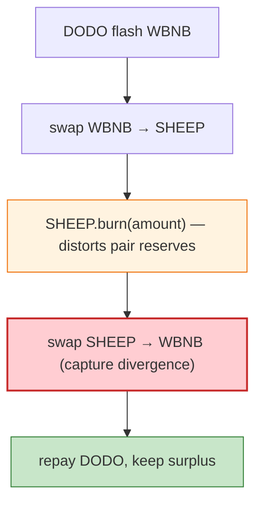

# Sheep Exploit — Reflective Token Pair Drain via `burn` (DODO Flash)

> **Reproduction:** the PoC compiles in an isolated Foundry project at
> [this project folder](.). Full verbose trace: [output.txt](output.txt).

---

## Key info

| | |
|---|---|
| **Loss** | WBNB drained from SHEEP/WBNB pair (BSC); tx `0x61293c6d…` |
| **Vulnerable contract** | SHEEP (reflective/deflation token, `RDeflationERC20`) `0x0025B42b…`; SHEEP/WBNB pair `0x912DCfBf…` |
| **Flash source** | DODO `0x0fe261ae…` |
| **Chain / block / date** | BSC / Feb 2023 |
| **Bug class** | Reflective/deflation token in a vanilla Uniswap-V2 pair — `burn` + transfer fees leave the pair's reserves inconsistent; flash + swap harvests WBNB. |

---

## TL;DR

Same class as FDP/TINU/BEVO/BIGFI: flash-borrow WBNB from DODO, swap to SHEEP, `SHEEP.burn(amount)`
(distorts the pair's reserves), swap back to capture the fee/burn divergence. Repay DODO, keep the
surplus. The PoC **passes** against a BSC archive endpoint (`bsc-mainnet.public.blastapi.io`); the
original default `onfinality` RPC lacked archive state at the fork block.

---

## Root cause

A **fee/burn-on-transfer token in a vanilla Uniswap-V2 pair**; `burn` mutates balances out-of-band, so
`sync`/`swap` harvest the divergence.

---

## Diagrams



---

## Remediation

1. Don't list deflation/reflection tokens in vanilla pairs; wrap or use fee-aware pairs.
2. `k` check on actual received amounts; restrict public `burn` from breaking AMM accounting.

---

## How to reproduce

```bash
_shared/run_poc.sh 2023-02-Sheep_exp -vvvvv
```

- RPC: BSC archive (block 25,543,755) — `bsc-mainnet.public.blastapi.io`. Result: `[PASS]
  testExploit()` — WBNB surplus after flash + `burn` + swap.

---

*Reference: Sheep reflection/burn token pair drain, BSC, Feb 2023.*
