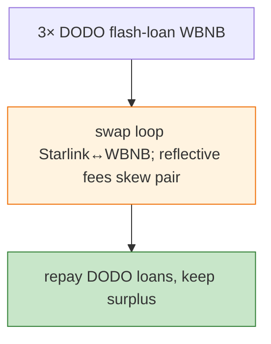

# Starlink (StarLink Inu) Exploit — Multi-DODO Flash + Reflective Token Drain

> **Reproduction:** the PoC compiles & runs in an isolated Foundry project at
> [this project folder](.). Full verbose trace: [output.txt](output.txt).

---

## Key info

| | |
|---|---|
| **Loss** | WBNB drained from Starlink/WBNB pair (BSC); tx `0x146586f0…` |
| **Vulnerable contract** | Starlink token `0x518281F3…`; Starlink/WBNB pair `0x425444dA…` |
| **Flash sources** | 3 DODO pools (`0x0fe261ae…`, `0x6098A563…`, `0xFeAFe253…`) |
| **Chain / block / date** | BSC / Feb 2023 |
| **Bug class** | Reflective-token accounting — Starlink's transfer fees + the multi-DODO-flash-funded swap loop harvest the fee divergence from the pair. |

---

## TL;DR

The attacker chains three DODO flash loans, swaps Starlink through its WBNB pair repeatedly; Starlink's
reflective fees leave the pair's reserves inconsistent, so each round-trip nets WBNB. Repay the three
DODO loans, keep the surplus.

---

## Root cause

A **reflective/fee-on-transfer token in a vanilla Pancake pair** — fees mutate balances the pair cannot
reconcile.

---

## Diagrams



---

## Remediation

1. Fee-aware AMM pairs; `k` on received amounts; wrap reflective tokens.

---

## How to reproduce

```bash
_shared/run_poc.sh 2023-02-Starlink_exp -vvvvv
```

- RPC: BSC archive. Result: `[PASS]` — WBNB surplus after the chained flashes.

---

*Reference: Starlink reflective-token pair drain, BSC, Feb 2023.*
