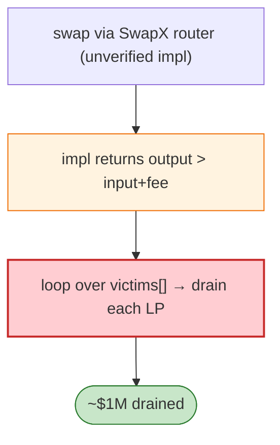

# SwapX Exploit — Unverified Implementation `swapX` Mis-prices Output

> **Reproduction:** the PoC compiles & runs in an isolated Foundry project at
> [this project folder](.). Full verbose trace: [output.txt](output.txt).
> Verified vulnerable source: [Diamond (DND)](sources/Diamond_34EA3F),
> [BiswapRouter02](sources/BiswapRouter02_3a6d8c).

---

## Key info

| | |
|---|---|
| **Loss** | ~$1M (DND/BUSD/WBNB drained from many BSC victims; tx `0x3ee23c15…`) |
| **Vulnerable contract** | SwapX proxy `0x6D898184…` (same unverified impl as LaunchZone); DND token `0x34EA3F71…` |
| **Chain / block / date** | BSC / Feb 2023 |
| **Bug class** | Logic flaw in the unverified `swapX` implementation — output > input+fee, draining reserves across a list of victim LPs. |

---

## TL;DR

Identical to the LaunchZone incident (the PoC iterates a list of victim addresses `victims[]`): the
unverified SwapX implementation returns oversized swap outputs. The attacker swaps DND/BUSD/WBNB
through the SwapX router and BiswapRouter, extracting value from each victim LP in turn.

---

## Root cause

An **unverified, mis-coded swap implementation** returning more out than the AMM math allows, deployed
behind a shared proxy that many LPs had approved.

---

## Diagrams



---

## Remediation

1. Verify + audit proxy implementations; timelock + multisig upgrades.
2. Swap-output invariant: out ≤ fee-corrected AMM output.
3. Revoke blanket approvals to shared proxies.

---

## How to reproduce

```bash
_shared/run_poc.sh 2023-02-SwapX_exp -vvvvv
```

- RPC: BSC archive. Result: `[PASS]` — reserves drained across the victim list.

---

*Reference: SwapX unverified-implementation swap flaw, BSC, Feb 2023 (~$1M).*
