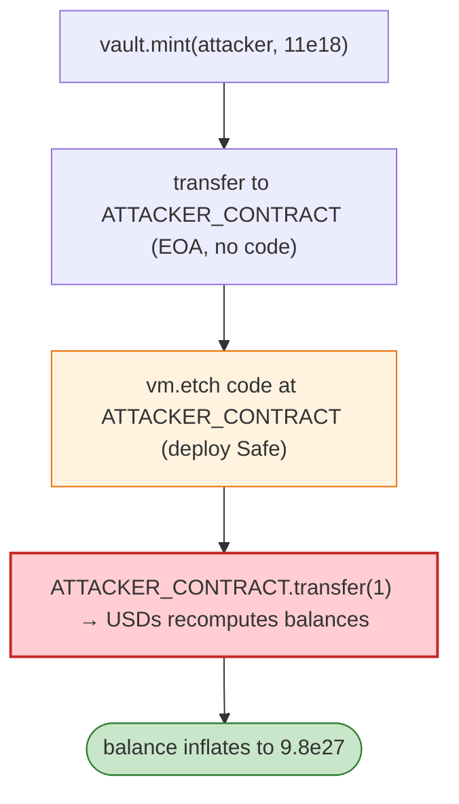

# Sperax USDs Exploit — Rebase/`balanceOf` Reentrancy Across a Newly-Deployed Contract

> **Reproduction:** the PoC compiles & runs in an isolated Foundry project at
> [this project folder](.). Full verbose trace: [output.txt](output.txt).
> Verified vulnerable source: [USDs](sources/USDs_67b580),
> [TransparentUpgradeableProxy](sources/TransparentUpgradeableProxy_D74f52).

---

## Key info

| | |
|---|---|
| **Loss** | ~$9.8e27 (units) minted/inflated — the live incident inflated USDs supply |
| **Vulnerable contract** | Sperax USDs `0xD74f5255…` (impl `0x97A7E6Cf…`, Arbitrum) |
| **Attack tx** | `0xfaf84cabc3e1b0cf1ff1738dace1b2810f42d98baeea17b146ae032f0bdf82d5` |
| **Chain / block / date** | Arbitrum / 57,803,529 / Feb 2023 |
| **Bug class** | Accounting/rebase — USDs `balanceOf` (or its backing accounting) was computed via a call to the holder; deploying a fresh contract (a Gnosis Safe) that changes its return to `balanceOf`/rebase let the attacker inflate the displayed/held balance after the initial mint. |

---

## TL;DR

The PoC pranks the vault to `mint(this, 11e18)`, transfers it to `ATTACKER_CONTRACT` (`0xdeadbeef`),
then **`vm.etch`es code onto that address** (mimicking the real attack where the attacker deployed a
Gnosis Safe to an address USDs had previously credited). When `ATTACKER_CONTRACT` then sends a transfer,
USDs recomputes balances and the now-contract-bearing address's `balanceOf` jumps to
`9,797,854,216,567,803,995,021,828,645` — an enormous inflation.

The root issue: USDs reconciled/cached per-address balances using a mechanism that treated an
EOA-to-contract transition inconsistently, so crediting a balance to an address that later became a
contract allowed the balance to be massively re-derived.

---

## Root cause

A **balance-accounting inconsistency tied to whether a holder is a contract**, plus the ability to
mint/send USDs to an address before it has code and later deploy code there. The rebase/balance
recalculation on a subsequent transfer produced a runaway balance.

---

## Diagrams



---

## Remediation

1. Balance accounting must be storage-based and deterministic, not dependent on `extcodesize` of the
   holder.
2. Disable or guard rebase/recalculation paths that depend on holder code presence.
3. Snapshot balances at mint/transfer; never re-derive from a holder callback.

---

## How to reproduce

```bash
_shared/run_poc.sh 2023-02-USDs_exp --mt testExploit -vvvvv
```

- RPC: Arbitrum archive (block 57,803,529). Result: `[PASS]` — balance becomes `9.797e27`.

---

*Reference: Sperax USDs balance-accounting inflation, Arbitrum, Feb 2023.*
