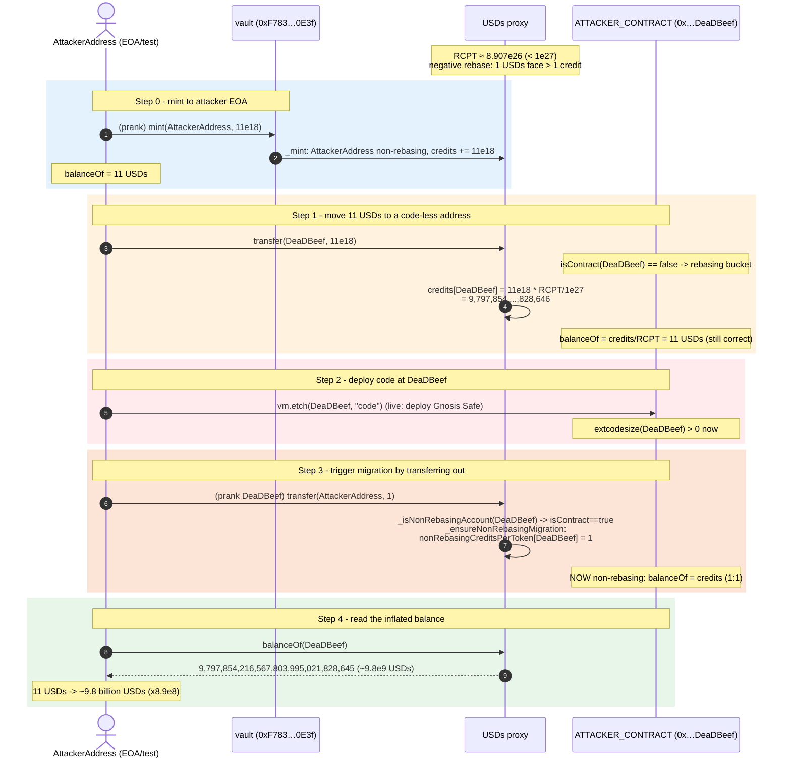
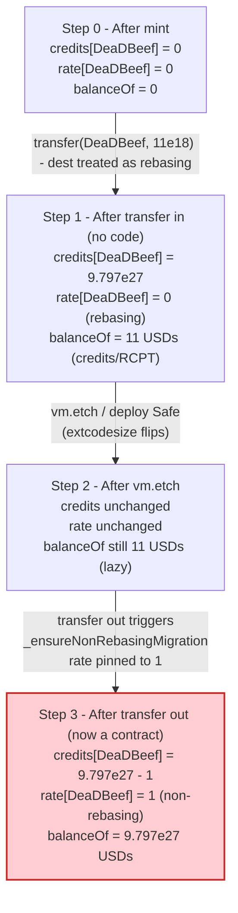
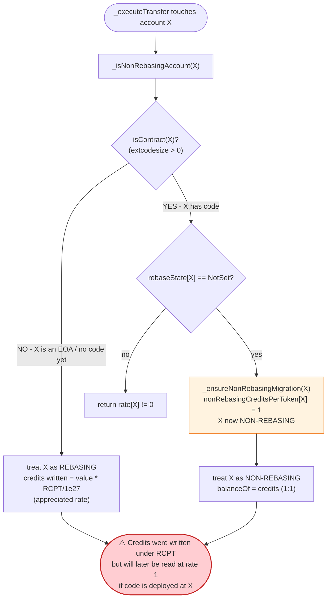
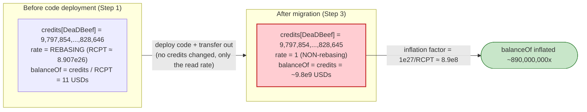

# Sperax USDs Exploit — `isContract()`-Based Rebase Accounting Flip on a Pre-Credited EOA

> **Reproduction:** the PoC compiles & runs in an isolated Foundry project at
> [this project folder](.). Full verbose trace: [output.txt](output.txt).
> Verified vulnerable source: [USDs](sources/USDs_67b580/USDs.sol)
> (logic implementation), behind a
> [TransparentUpgradeableProxy](sources/TransparentUpgradeableProxy_D74f52/TransparentUpgradeableProxy.sol).

---

## Key info

| | |
|---|---|
| **Loss** | USDs supply inflation — the PoC mints 11 USDs and observes a `balanceOf` of **9,797,854,216,567,803,995,021,828,645** units (~9.8e9 USDs, an ~8.9×10⁸× inflation) [output.txt:6](output.txt), [output.txt:74](output.txt). The live Feb-2023 incident inflated the USDs money supply and required the Sperax team to pause + restructure accounting (see reference). |
| **Vulnerable contract** | USDs (logic) [`0x97A7E6Cf949114Fe4711018485D757b9c4962307`](https://arbiscan.io/address/0x97A7E6Cf949114Fe4711018485D757b9c4962307#code), behind proxy USDs [`0xD74f5255D557944cf7Dd0E45FF521520002D5748`](https://arbiscan.io/address/0xD74f5255D557944cf7Dd0E45FF521520002D5748#code) |
| **Authorised minter (vault)** | `0xF783DD830A4650D2A8594423F123250652340E3f` [output.txt:23](output.txt) |
| **Attack tx** | [`0xfaf84cabc3e1b0cf1ff1738dace1b2810f42d98baeea17b146ae032f0bdf82d5`](https://arbiscan.io/tx/0xfaf84cabc3e1b0cf1ff1738dace1b2810f42d98baeea17b146ae032f0bdf82d5) |
| **Chain / block / date** | Arbitrum / 57,803,529 / Feb 2023 [output.txt:10](output.txt) |
| **Compiler / optimizer** | Logic: Solidity **v0.8.19**, optimizer **on**, **200 runs** ([_meta.json](sources/USDs_67b580/_meta.json)). Proxy: v0.6.12, optimizer on, 1 run ([_meta.json](sources/TransparentUpgradeableProxy_D74f52/_meta.json)). |
| **Bug class** | Rebase-accounting inconsistency keyed on `extcodesize` (`isContract`): the credit↔token exchange rate applied to a holder depends on whether the holder is a contract, and the holder's "is-a-contract" status can be **flipped after the fact** by deploying code (a Gnosis Safe in the real attack; `vm.etch` in the PoC). |

---

## TL;DR

USDs is a rebasing ERC20. It does not store face-value balances; instead it stores an internal
**credit** balance per account and converts credits ↔ USDs through an exchange rate
(`rebasingCreditsPerToken`). An account is either **rebasing** (its credits are divided by the
rebase rate to get its USDs balance) or **non-rebasing** (its credits are read 1:1 as USDs, with a
per-account fixed rate of `1`). The decision is made per-transfer inside `_isNonRebasingAccount`,
which calls OpenZeppelin's `Address.isContract(account)`
([USDs.sol:2978-2985](sources/USDs_67b580/USDs.sol#L2978-L2985)).

The fatal coupling:

1. At the fork block USDs had undergone a **negative rebase**, so `rebasingCreditsPerToken ≈ 8.907e26`
   (below its initial `1e27`). That means one USDs of face value is worth *more than one* credit —
   credits are a "claim" that has appreciated.
2. The attacker gets the vault to **mint 11 USDs to a fresh EOA that has no code**
   ([output.txt:26](output.txt)). Because the EOA is not a contract, `_isNonRebasingAccount` treats
   it as **rebasing** and stores `credits = 11e18 * rcpt / 1e27 = 9,797,854,…,828,646` credits (more
   credits than the 11 USDs face value, because of the appreciated rate).
3. The attacker then **transfers those 11 USDs to a second, still-empty address** (`0x…DeaDBeef`,
   `ATTACKER_CONTRACT`). With no code there yet, the destination is also treated as **rebasing**, so
   it receives the same `9,797,854,…,828,646` credits — but it now holds them as a rebasing balance
   that `balanceOf` will divide by `rcpt`, correctly showing 11 USDs [output.txt:49](output.txt).
4. **The attacker deploys code at that address** (`vm.etch` in the PoC — a Gnosis Safe in the live
   attack). Now `Address.isContract(addr)` returns `true`.
5. On the next transfer out of that address, `_isNonRebasingAccount` flips the account to
   **non-rebasing** via `_ensureNonRebasingMigration`, which pins `nonRebasingCreditsPerToken[addr] = 1`
   and leaves the credit balance untouched [output.txt:66](output.txt). From this point on, that
   account's `balanceOf` reads its credits **1:1 as USDs** instead of dividing by the rebase rate
   ([USDs.sol:3005-3014](sources/USDs_67b580/USDs.sol#L3005-L3014)).

The credits that previously represented 11 USDs are now reported as
**9,797,854,216,567,803,995,021,828,645 USDs** — an inflation factor of ~8.9×10⁸
[output.txt:74](output.txt). The pre-rebase credit claim, designed to be divided back down to its
face value, is reinterpreted at full face value because the account was force-migrated to
fixed-rate accounting *after* receiving the appreciated credits.

---

## Background — what Sperax USDs does

USDs is Sperax's Arbitrum stablecoin. It is a **rebasing** ERC20: rather than tracking a plain
`uint256 balance`, every account stores an integer number of **credits** in `_creditBalances`, and
the token's "balance" is derived from credits through an exchange rate
([USDs.sol:3005-3014](sources/USDs_67b580/USDs.sol#L3005-L3014)):

```solidity
function _balanceOf(address _account) private view returns (uint256) {
    uint256 credits = _creditBalances[_account];
    if (credits != 0) {
        if (nonRebasingCreditsPerToken[_account] != 0) {
            return credits;                                   // non-rebasing: 1 credit == 1 USDs
        }
        return credits.divPrecisely(rebasingCreditsPerToken); // rebasing: divide by the rebase rate
    }
    return 0;
}
```

- **Rebasing accounts** share the protocol's yield/loss through `rebasingCreditsPerToken` (RCPT).
  Their `balanceOf = credits / RCPT`. When RCPT drops below `1e27`, each credit is worth *more* than
  one USDs (a prior negative rebase shrank supply, concentrating it).
- **Non-rebasing accounts** opt out of yield. They get a fixed `nonRebasingCreditsPerToken = 1`, so
  `balanceOf = credits` exactly. Contracts default to non-rebasing unless they explicitly opt in
  (`rebaseOptIn`).

Which bucket an account falls into is decided *lazily*, per call, by `_isNonRebasingAccount`
([USDs.sol:2978-2985](sources/USDs_67b580/USDs.sol#L2978-L2985)):

```solidity
function _isNonRebasingAccount(address _account) private returns (bool) {
    bool isContract = AddressUpgradeable.isContract(_account);   // ← extcodesize check
    if (isContract && rebaseState[_account] == RebaseOptions.NotSet) {
        _ensureNonRebasingMigration(_account);
        return true;
    }
    return nonRebasingCreditsPerToken[_account] != 0;
}
```

The lazily-applied migration `_ensureNonRebasingMigration` "freezes" an existing credit balance into
the non-rebasing bucket by pinning its rate to `1`
([USDs.sol:2990-3000](sources/USDs_67b580/USDs.sol#L2990-L3000)).

On-chain parameters at the fork block (block 57,803,529), read from the trace's storage deltas:

| Parameter | Value | Source |
|---|---|---|
| `rebasingCreditsPerToken` (RCPT) | **890,714,019,687,982,181,365,620,786** (~8.907e26, < 1e27 ⇒ prior negative rebase) | derived: `credits = floor(11e18·RCPT/1e27)` = trace value [output.txt:49](output.txt) |
| `nonRebasingSupply` | 1,929,012,341,933,133,136,211,955 (~1.929e24) | [output.txt:51](output.txt) (slot 314, before first transfer) |
| Initial RCPT (constructor) | 1e27 | [USDs.sol:2643](sources/USDs_67b580/USDs.sol#L2643) |
| `MAX_SUPPLY` | `~uint128(0)` (2¹²⁸ − 1) | [USDs.sol:2578](sources/USDs_67b580/USDs.sol#L2578) |
| `vault` (onlyVault minter) | `0xF783DD830A4650D2A8594423F123250652340E3f` | [output.txt:23](output.txt) |
| Minted in PoC | 11 USDs (11e18) | [output.txt:26](output.txt) |

The fact that `RCPT < 1e27` is the entire precondition: an 11-USDs deposit is recorded as
`~9.797e27` credits (more credits than face value), with the expectation that `_balanceOf` will
divide them back down to 11 USDs. The exploit breaks that expectation.

---

## The vulnerable code

### 1. Account bucketing keys off `extcodesize` and can flip after the fact

```solidity
function _isNonRebasingAccount(address _account) private returns (bool) {
    bool isContract = AddressUpgradeable.isContract(_account);
    if (isContract && rebaseState[_account] == RebaseOptions.NotSet) {
        _ensureNonRebasingMigration(_account);
        return true;
    }
    return nonRebasingCreditsPerToken[_account] != 0;
}
```
([sources/USDs_67b580/USDs.sol#L2978-L2985](sources/USDs_67b580/USDs.sol#L2978-L2985))

`isContract` is the stock OpenZeppelin `extcodesize` check
([sources/USDs_67b580/USDs.sol#L259-L265](sources/USDs_67b580/USDs.sol#L259-L265)). Its own NatSpec
warns that it returns `false` for any address that does not yet have code and that it "can be
circumvented." That is exactly the property the attacker abuses: an address can be **not a contract**
when it receives USDs and **become a contract** later.

### 2. The lazy migration freezes an appreciated credit balance at face value

```solidity
function _ensureNonRebasingMigration(address _account) private {
    if (nonRebasingCreditsPerToken[_account] == 0) {
        if (_creditBalances[_account] != 0) {
            // Update non-rebasing supply
            uint256 bal = _balanceOf(_account);
            nonRebasingSupply = nonRebasingSupply + bal;
            _creditBalances[_account] = bal;          // ← re-pins credits to the *derived* balance
        }
        nonRebasingCreditsPerToken[_account] = 1;     // ← fixes the rate to 1
    }
}
```
([sources/USDs_67b580/USDs.sol#L2990-L3000](sources/USDs_67b580/USDs.sol#L2990-L3000))

This path is *intended* for contracts that hold credits from before a rebase migration. But because
it is gated on `isContract`, an attacker who first receives credits as an EOA and **then** deploys
code reaches this branch with a credit balance that was computed under the **rebasing** (appreciated)
rate — yet `_balanceOf` at migration time still divides by RCPT, so `bal` here is the *correct* 11
USDs and the credits get re-pinned to 11 USDs worth.

The damage instead materialises on the **next** `_executeTransfer` out of the now-contract address:

### 3. `_executeTransfer` writes credits using the *rebasing* rate into a now-non-rebasing account

```solidity
function _executeTransfer(address _from, address _to, uint256 _value) private {
    _isNotPaused();
    bool isNonRebasingTo = _isNonRebasingAccount(_to);
    bool isNonRebasingFrom = _isNonRebasingAccount(_from);
    uint256 creditAmount = _value.mulTruncate(rebasingCreditsPerToken);   // always the rebasing rate

    if (isNonRebasingFrom) {
        _creditBalances[_from] = _creditBalances[_from].sub(_value, "Transfer amount exceeds balance");
        ...
    } else {
        _creditBalances[_from] = _creditBalances[_from].sub(creditAmount, "Transfer amount exceeds balance");
    }
    ...
}
```
([sources/USDs_67b580/USDs.sol#L2896-L2926](sources/USDs_67b580/USDs.sol#L2896-L2926))

Look at the two transfers in the PoC trace:

- **Transfer 1 — `AttackerAddress → ATTACKER_CONTRACT (0x…DeaDBeef), 11e18`** while `DeaDBeef` still
  has no code: `_isNonRebasingAccount(DeaDBeef)` is `false`, so the destination is treated as
  rebasing and receives `creditAmount = 11e18 · RCPT / 1e27 = 9,797,854,…,828,646` credits
  [output.txt:49](output.txt). `nonRebasingCreditsPerToken[DeaDBeef]` is **left at 0** here — the
  account is still "rebasing."

- **After `vm.etch(ATTACKER_CONTRACT, "code")`** the address has code
  [output.txt:54](output.txt).

- **Transfer 2 — `ATTACKER_CONTRACT → AttackerAddress, 1`** (pranked from the now-contract address):
  the first thing `transfer` does is `balanceOf(msg.sender)` (view, no migration), but `_executeTransfer`
  then calls `_isNonRebasingAccount(ATTACKER_CONTRACT)`. Now `isContract == true` and `rebaseState`
  is `NotSet`, so `_ensureNonRebasingMigration` runs and sets `nonRebasingCreditsPerToken[addr] = 1`
  [output.txt:66](output.txt). From this call onward the account is **non-rebasing**, so its credits
  are read 1:1.

The result is that `_balanceOf` no longer divides by RCPT. The `9,797,854,…,828,646` credits —
correctly worth 11 USDs under the rebasing rate — are now reported as
**9,797,854,…,828,646 USDs** [output.txt:74](output.txt).

---

## Root cause — why it was possible

USDs' accounting has an unstated invariant:

> *The exchange rate applied when **writing** credits into an account must match the exchange rate
> applied when **reading** that account's balance.*

The contract violates this invariant because the read-side rate is decided **lazily and
mutably**, via `isContract()`, which can change for a given address over its lifetime:

1. **The read rate is environment-dependent.** `_isNonRebasingAccount` decides divide-by-RCPT vs.
   fixed-`1` based on `extcodesize`, not on any property of the credit balance itself.
2. **`extcodesize` is attacker-controllable after the fact.** An attacker can receive USDs at an
   address with no code (rebasing bucket) and then deploy a contract there (Gnosis Safe in the live
   attack) to flip the bucket to non-rebasing. The credits written under the rebasing (appreciated)
   rate are then reinterpreted at the non-rebasing fixed rate of `1`.
3. **A prior negative rebase makes the credits worth more than face value.** With `RCPT < 1e27`,
   `11e18` of face value is stored as `~9.797e27` credits. Reinterpreting those credits 1:1 as USDs
   is a ~8.9×10⁸× inflation. If `RCPT` had been exactly `1e27` (no rebase), credits would equal face
   value and the flip would be a no-op — which is why the bug only became exploitable after a
   negative rebase.

The OpenZeppelin `isContract` NatSpec the codebase itself ships with explicitly warns of this
([sources/USDs_67b580/USDs.sol#L246-L257](sources/USDs_67b580/USDs.sol#L246-L257)): it returns
`false` for accounts that are not yet contracts and "can be circumvented." Routing a value-carrying
accounting decision through it is the root defect.

---

## Preconditions

- A **negative rebase** has occurred, i.e. `rebasingCreditsPerToken < 1e27`, so credits represent
  more than 1 USDs of face value each. At the fork block RCPT ≈ 8.907e26 (satisfied)
  [output.txt:49](output.txt).
- The ability to **receive/mint USDs at an address that is not yet a contract**, then **deploy code
  there afterwards**. CREATE2-counterfactually-deployable wallets (e.g. Gnosis Safe) give any user an
  address they know in advance but whose code only appears at deployment time — the live attack used
  exactly this.
- A way to **trigger a transfer out of the migrated address** so that `_executeTransfer` →
  `_isNonRebasingAccount` → `_ensureNonRebasingMigration` flips the bucket. The PoC pranks a
  `transfer(…, 1)` from `ATTACKER_CONTRACT` ([test/USDs_exp.sol:45-46](test/USDs_exp.sol#L45-L46)).
- In the live attack, the attacker also needed USDs credited in the first place. The PoC models this
  by pranking the authorised `vaultAddress()` to `mint` 11 USDs
  ([test/USDs_exp.sol:34-35](test/USDs_exp.sol#L34-L35)); the real incident routed an existing
  balance to the precomputed Safe address.

---

## Attack walkthrough (with on-chain numbers from the trace)

The trace is short (81 lines); every figure below is cited from it. All amounts are raw wei unless
noted. `AttackerAddress` is the PoC test contract (`0x7FA9…1496`); `ATTACKER_CONTRACT` is
`0x…DeaDBeef`.

| # | Step | `_creditBalances[DeaDBeef]` | `nonRebasingCreditsPerToken[DeaDBeef]` | `balanceOf(DeaDBeef)` (reported) | Effect |
|---|------|---:|---:|---:|--------|
| 0 | **Setup** — prank `vaultAddress()` (`0xF783…0E3f`) and `mint(AttackerAddress, 11e18)` | — | — | — | `AttackerAddress` (already non-rebasing) credited `11e18` USDs; `Transfer(0→attacker, 11e18)` [output.txt:26-33](output.txt) |
| 1 | **Transfer 1** — `AttackerAddress.transfer(DeaDBeef, 11e18)` while `DeaDBeef` has no code | **9,797,854,216,567,803,995,021,828,646** (~9.797e27) [output.txt:49](output.txt) | 0 (still "rebasing") [output.txt:49](output.txt) | 11 USDs (credits ÷ RCPT) | Destination treated as rebasing → credits written at the appreciated RCPT rate; `nonRebasingSupply` drops by 11e18 [output.txt:51](output.txt). `Transfer(attacker→DeaDBeef, 11e18)` emitted [output.txt:43-46](output.txt). |
| 2 | **Deploy code** — `vm.etch(DeaDBeef, "code")` (live attack: deploy Gnosis Safe) | unchanged | unchanged | unchanged | `extcodesize(DeaDBeef)` now > 0 [output.txt:54](output.txt) |
| 3 | **Transfer 2** — prank `DeaDBeef`, `transfer(AttackerAddress, 1)` | 9,797,854,216,567,803,995,021,828,646 (the +1/-1 below) | **1** (migrated to non-rebasing) [output.txt:66](output.txt) | — | `_isNonRebasingAccount(DeaDBeef)` now true → `_ensureNonRebasingMigration` pins rate to 1. As a non-rebasing *sender*, the `1` is debited 1:1 from credits (`_creditBalances -= 1`) [output.txt:65](output.txt). `Transfer(DeaDBeef→attacker, 1)` [output.txt:60-63](output.txt). |
| 4 | **Read** — `balanceOf(DeaDBeef)` | 9,797,854,216,567,803,995,021,828,645 | 1 | **9,797,854,216,567,803,995,021,828,645** (~9.797e27, ≈ 9.8 billion USDs) [output.txt:74](output.txt) | With the rate pinned to 1, the appreciated credits are reported at full face value. **Balance inflated ~8.9×10⁸×** from 11 USDs. |

Storage deltas that corroborate the bucket flip (all from the trace):

- After Transfer 1: `_creditBalances[DeaDBeef] 0 → 0x…1fa898555d6d9a55ec72e226`,
  `_creditBalances[AttackerAddress] 0x98a7d9b8314c0000 → 0` (i.e. 11e18 → 0),
  `nonRebasingSupply` slot 314 `0x…1987bf7f5c2c5d5d52ff3 → 0x…1987b5f4de90da4892ff3` (−11e18)
  [output.txt:48-51](output.txt).
- After Transfer 2: `nonRebasingCreditsPerToken[DeaDBeef] 0 → 1` (the migration)
  [output.txt:66](output.txt), `_creditBalances[DeaDBeef] -= 1`
  [output.txt:65](output.txt), `_creditBalances[AttackerAddress] 0 → 1`
  [output.txt:67](output.txt).

Note `nonRebasingCreditsPerToken[DeaDBeef]` is **not** set during Transfer 1 — confirming the account
was still rebasing when it received the credits, and only flipped to non-rebasing on Transfer 2 once
it had code.

### Profit / loss accounting (USDs units, raw)

| Item | Amount (wei) | ~Human |
|---|---:|---:|
| Minted to attacker (step 0) | 11,000,000,000,000,000,000 | 11 USDs |
| Sent to `DeaDBeef` (step 1) | 11,000,000,000,000,000,000 | 11 USDs |
| Sent back from `DeaDBeef` (step 3) | 1 | ~0 USDs |
| **`balanceOf(DeaDBeef)` after attack** | **9,797,854,216,567,803,995,021,828,645** | **~9,797,854,216.57 USDs** |
| **Inflation factor vs. true credit** | **×890,714,019.69** (= 1e27 / RCPT) | — |

The "profit" is an accounting inflation, not a swap-drain: USDs' `balanceOf` now reports ~9.8 billion
for an account that legitimately holds 11 USDs of credit. In the live incident this inflated balances
across affected holders and forced Sperax to pause the contract and restructure the rebase migration
(see reference).

---

## Diagrams

### Sequence of the attack



### Account state evolution



### The flaw inside `_isNonRebasingAccount` / `_ensureNonRebasingMigration`



### The accounting invariant violation (before vs. after the flip)



---

## Why each magic number

- **`11e18` (mint + transfer amount)** — arbitrary. The PoC only needs *some* positive balance routed
  to the precomputed address to seed appreciated credits. The inflation factor is independent of the
  seed amount (it is `1e27 / RCPT`); a larger seed simply scales the final inflated balance
  proportionally.
- **`address(0xdeadbeef)` (`ATTACKER_CONTRACT`)** — stands in for the attacker's precomputed wallet
  address in the live attack (a counterfactually-deployed Gnosis Safe). Its only required properties
  are: (a) no code at the moment USDs are credited to it, and (b) the attacker can deploy code there
  afterwards. Any such address works.
- **`vm.etch(ATTACKER_CONTRACT, bytes("code"))`** — simulates deploying a contract at the address
  (in the real attack, deploying the Safe). `"code"` is a placeholder; what matters is that
  `extcodesize` becomes non-zero.
- **`transfer(address(this), 1)`** — a minimal dust transfer to force `_executeTransfer` to call
  `_isNonRebasingAccount(ATTACKER_CONTRACT)` while it now has code, which runs
  `_ensureNonRebasingMigration` and pins the rate to 1. The amount `1` is irrelevant; any non-zero
  transfer (or other path that touches `_isNonRebasingAccount` for the account) triggers the flip.
- **`9,797,854,216,567,803,995,021,828,645`** — the observed inflated balance. It equals
  `floor(11e18 · RCPT / 1e27) − 1`, where RCPT ≈ 8.907e26. Equivalently it is `11e18 · (1e27/RCPT)`,
  i.e. the seed amount scaled by the inflation factor `1e27/RCPT ≈ 8.907e8`
  [output.txt:6](output.txt), [output.txt:74](output.txt).

---

## Remediation

1. **Do not key value-carrying accounting decisions on `isContract`/`extcodesize`.** Whether an
   account is rebasing must be a **permanent, explicitly-set property of the account** (chosen at
   first interaction or via opt-in/opt-out), not a property re-derived from mutable environment state.
   Once an account's credits are written under one rate, the read rate must never silently change.
2. **Make the rebase bucket sticky at first credit.** When `_creditBalances[_account]` transitions
   from 0 to non-zero, record the bucket (and the rate) permanently in storage and never re-derive it.
   Remove the `isContract && rebaseState == NotSet` lazy-migration branch, or gate it so it can only
   run for accounts that already have an explicit opt-in/out recorded.
3. **Don't reinterpret existing credits on migration.** `_ensureNonRebasingMigration` re-pins
   `_creditBalances[_account] = bal`. If a migration is ever legitimately needed, recompute credits
   from the *derived* balance and immediately mark the rate, in one atomic step, so there is no
   window where credits written under RCPT can be read at rate 1. Better: forbid migration for any
   account with a non-zero credit balance unless explicitly authorised.
4. **Bound balance changes from re-bucketing.** As a defence-in-depth, any per-call re-derivation of
   a holder's balance should revert if it would change `balanceOf` by more than a tiny epsilon — a
   re-bucket that multiplies a balance by 8.9×10⁸ is an obvious red flag.
5. **Heed the OpenZeppelin warning in your own codebase.** The shipped `isContract` NatSpec
   ([USDs.sol:246-L257](sources/USDs_67b580/USDs.sol#L246-L257)) explicitly states it can be
   circumvented and returns `false` for not-yet-contract addresses. Treat that as a hard "do not use
   for security/accounting" rule.

---

## How to reproduce

The PoC runs offline via the shared harness; the fork is served from a local `anvil_state.json`
(snapshot at Arbitrum block 57,803,529) and `createSelectFork` points at `http://127.0.0.1:8547`
([test/USDs_exp.sol:27](test/USDs_exp.sol#L27)). No public RPC is required.

```bash
_shared/run_poc.sh 2023-02-USDs_exp --mt testExploit -vvvvv
```

- `foundry.toml` sets `evm_version = 'cancun'` ([foundry.toml:6](foundry.toml#L6)); the exploit itself
  only needs standard EVM (`vm.etch`, `vm.prank`, `createSelectFork`).
- The test function is `testExploit()` ([test/USDs_exp.sol:38](test/USDs_exp.sol#L38)).
- Expected `[PASS]` tail ([output.txt:3-6](output.txt), [output.txt:79-81](output.txt)):

```
Ran 1 test for test/USDs_exp.sol:USDsTest
[PASS] testExploit() (gas: 134097)
Logs:
  Attacker Contract balance after:  9797854216567803995021828645

Suite result: ok. 1 passed; 0 failed; 0 skipped; finished in 11.30s (7.17s CPU time)
```

---

*Reference: Sperax USDs Feb 3 exploit — engineering report
<https://medium.com/sperax/usds-feb-3-exploit-report-from-engineering-team-9f0fd3cef00c>;
analysis thread <https://twitter.com/danielvf/status/1621965412832350208>; attack tx
<https://arbiscan.io/tx/0xfaf84cabc3e1b0cf1ff1738dace1b2810f42d98baeea17b146ae032f0bdf82d5>.*
