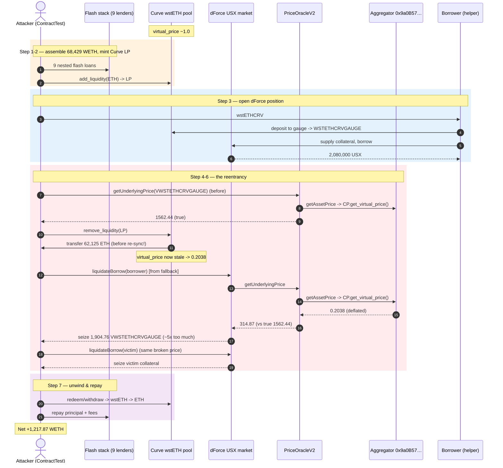
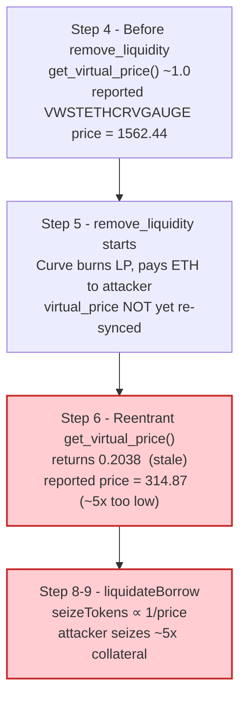
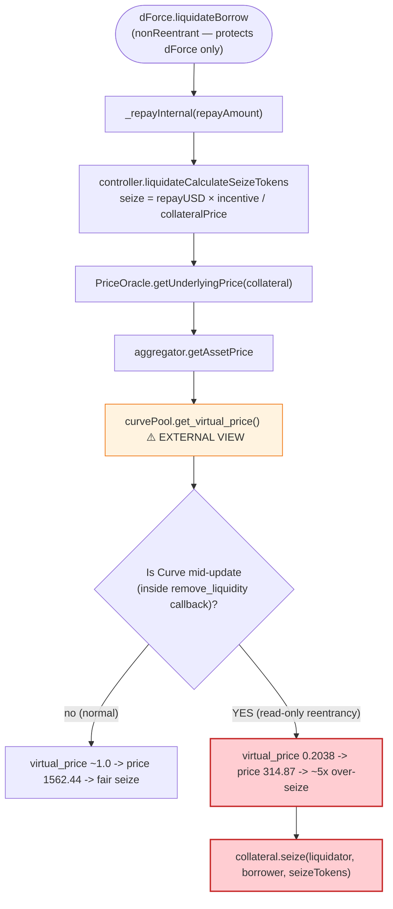

# dForce Exploit — Read-only Reentrancy via Curve `remove_liquidity` into the dForce Price Oracle

> **Vulnerability classes:** vuln/reentrancy/read-only · vuln/oracle/price-manipulation

> **Reproduction:** the PoC compiles & runs offline in an isolated Foundry project at
> [this project folder](.). The fork is served from a local Anvil snapshot
> (`createSelectFork("http://127.0.0.1:8547", 59_527_633)`), so no public RPC is required.
> Full verbose trace: [output.txt](output.txt).
> Verified vulnerable sources used in the exploit path:
> [PriceOracleV2](sources/PriceOracleV2_159624/contracts_PriceOracleV2.sol) and the
> dForce money-market [iToken / TokenBase](sources/iMSDMiniPool_ef535d/contracts_TokenBase_Base.sol).

---

## Key info

| | |
|---|---|
| **Loss** | ~$3.65M — drained from dForce's Arbitrum `wstETHCRV-gauge` collateral market (`VWSTETHCRVGAUGE`); the attacker walks away with **1,217.87 WETH** of net profit ([output.txt:2467](output.txt)). |
| **Vulnerable contract** | dForce USX market (`IDForce`) — [`0xC462fF1063172BAC6f6823A17ED181a0586f0FC8`](https://arbiscan.io/address/0xC462fF1063172BAC6f6823A17ED181a0586f0FC8) (collateral: `VWSTETHCRVGAUGE` [`0x2cE498b79C499c6BB64934042eBA487bD31F75ea`](https://arbiscan.io/address/0x2cE498b79C499c6BB64934042eBA487bD31F75ea)); priced by [`PriceOracleV2` `0x15962427A9795005c640A6BF7f99c2BA1531aD6d`](https://arbiscan.io/address/0x15962427A9795005c640A6BF7f99c2BA1531aD6d) which reads Curve's `get_virtual_price()`. |
| **Victim pool / vault** | dForce wstETHCRV-Gauge collateral vault + a real underwater victim borrower `0x916792f7734089470de27297903BED8a4630b26D` whose collateral was seized at the manipulated price ([dForce_exp.sol:341](test/dForce_exp.sol#L341), [output.txt:1462](output.txt)). |
| **Attack tx** | [`0x5db5c2400ab56db697b3cc9aa02a05deab658e1438ce2f8692ca009cc45171dd`](https://arbiscan.io/tx/0x5db5c2400ab56db697b3cc9aa02a05deab658e1438ce2f8692ca009cc45171dd) |
| **Chain / block / date** | Arbitrum / block `59,527,633` / Feb 9, 2023 |
| **Compiler / optimizer** | dForce `PriceOracleV2`: Solidity `v0.6.12`, optimizer **enabled**, **200 runs**; Curve `wstETHCRV` pool: **Vyper 0.3.1**; dForce `iToken`: Solidity `v0.6.12`, optimizer enabled, 200 runs (per `_meta.json`). |
| **Bug class** | Read-only reentrancy — an external call in dForce's price path (`PriceOracle → aggregator → Curve.get_virtual_price()`) is re-entered from Curve's `remove_liquidity` while the pool's reserves/`totalSupply` are mid-update, returning a deflated virtual price. dForce's `liquidateBorrow` then uses that stale price to over-seize collateral. |

> The original PoC ships no `@KeyInfo` header; the attack tx hash above is taken verbatim from the
> PoC's `@TX` comment ([dForce_exp.sol:11-12](test/dForce_exp.sol#L11-L12)). The attacker EOA and
> attack-contract addresses are not present in the bundled materials, so they are omitted rather than
> invented; the PoC's own `ContractTest` (`0x7FA9385bE102ac3EAc297483Dd6233D62b3e1496`) plays the
> attacker role in the reproduction.

---

## TL;DR

dForce's Arbitrum money market accepted **vaulted wstETH/CRV-gauge tokens** (`VWSTETHCRVGAUGE`) as
collateral and priced them through `PriceOracleV2.getUnderlyingPrice()`. That oracle, in turn, queries
an external aggregator (`0x9a0B57…`) whose `getAssetPrice()` reads **Curve's `wstETHCRV` pool
`get_virtual_price()`** live ([output.txt:929](output.txt), [output.txt:936](output.txt)). The Curve
pool is a Vyper 0.3.1 `remove_liquidity`-vulnerable contract: it burns the caller's LP tokens and
**transfers the underlying ETH back to the caller before re-syncing its own `virtual_price` storage**.

The attack is a classic **read-only reentrancy** on top of that Curve callback:

1. The attacker stacks ~9 WETH flash loans (Balancer → Aave V3 → Radiant → UniV3 → 3× Sushi → Zyber →
   Saddle) to amass **~68,429 WETH** ([output.txt:17](output.txt)), unwraps it and
   `add_liquidity` into the Curve wstETH pool to mint LP tokens, then uses those LP tokens to borrow
   **2,080,000 USX** from dForce against a fresh `wstETHCRV-gauge` position
   ([output.txt:21](output.txt)).
2. It calls `curvePool.remove_liquidity(burnAmount, …)`. Curve burns the LP and sends the underlying
   ETH to the attacker's contract **before** recomputing `virtual_price`. That ETH transfer fires the
   attacker's `fallback()` ([dForce_exp.sol:312-350](test/dForce_exp.sol#L312-L350)).
3. Inside the reentrant `fallback`, the attacker calls `dForceContract.liquidateBorrow(...)`.
   `liquidateBorrow` → `controller.liquidateCalculateSeizeTokens` → `PriceOracle.getUnderlyingPrice`
   → `aggregator.getAssetPrice` → **`curvePool.get_virtual_price()` reads the half-updated Curve
   state and returns `203,843,338,190,912,215` (~0.2038) instead of ~1.0**
   ([output.txt:936](output.txt)). The dForce oracle therefore reports the collateral price as
   **314.87** instead of the true **1562.44** — a ~5× under-valuation
   ([output.txt:890](output.txt), [output.txt:972](output.txt)).
4. Because the collateral is reported ~5× cheaper, each unit of repaid USX seizes ~5× more
   `VWSTETHCRVGAUGE`. The attacker liquidates **its own** underwater borrower for 1,904.76
   `VWSTETHCRVGAUGE` ([output.txt:1301](output.txt)) and then a **real victim borrower** for another
   ~2,924 `wstETHCRV-gauge` worth of collateral ([output.txt:1874](output.txt)), redeems/withdraws it
   all to wstETH, swaps back through Curve and GMX, and repays every flash loan.
5. Net result: **1,217.87 WETH** of profit after all loans + fees
   ([output.txt:2467](output.txt)).

---

## Background — what dForce does

dForce runs a Compound-style money market on Arbitrum. Users deposit collateral (`iToken`s / vaulted
tokens) and borrow stablecoins such as **USX** (`0x641441c631e2F909700d2f41FD87F0aA6A6b4EDb`). Each
market is governed by a `Controller` ("cointroller", `0x61afB763…`) which prices collateral through a
single `PriceOracleV2` (`0x159624…`).

The collateral at the heart of this exploit is **`VWSTETHCRVGAUGE`**
(`0x2cE498b79C499c6BB64934042eBA487bD31F75ea`) — an ERC-4626-style "vault" share token wrapping
**`WSTETHCRVGAUGE`** (`0x098EF55…`, the Curve gauge deposit for the wstETH/ETH pool). dForce's oracle
prices this collateral by walking the chain of vaults down to the underlying Curve LP and multiplying
by `get_virtual_price()`, the Curve pool's reported LP price.

On-chain parameters read from the trace at the fork block (`59,527,633`):

| Parameter | Value | Source |
|---|---|---|
| dForce USX market (`IDForce`) | `0xC462fF1063172BAC6f6823A17ED181a0586f0FC8` | [dForce_exp.sol:71](test/dForce_exp.sol#L71) |
| `VWSTETHCRVGAUGE` collateral | `0x2cE498b79C499c6BB64934042eBA487bD31F75ea` | [dForce_exp.sol:57](test/dForce_exp.sol#L57) |
| `PriceOracleV2` | `0x15962427A9795005c640A6BF7f99c2BA1531aD6d` | [dForce_exp.sol:72](test/dForce_exp.sol#L72) |
| Price aggregator | `0x9a0B57024Ff206A658e46ffE9F60C7c14cF30b80` | [output.txt:901](output.txt) |
| Curve `wstETHCRV` pool | `0x6eB2dc694eB516B16Dc9FBc678C60052BbdD7d80` | [dForce_exp.sol:67](test/dForce_exp.sol#L67) |
| `cointroller.closeFactorMantissa` | `0.5e18` (50% of debt repayable per liquidation) | [output.txt:979](output.txt) |
| dForce USX price | `1.0e18` (USX ≈ $1) | [output.txt:989](output.txt) |
| `VWSTETHCRVGAUGE` price **before** reentrancy | `1562.44e18` | [output.txt:890](output.txt) |
| `VWSTETHCRVGAUGE` price **inside** reentrancy | `314.87e18` | [output.txt:961](output.txt) |
| Curve `get_virtual_price()` inside reentrancy | `0.2038e18` | [output.txt:936](output.txt) |
| Borrower debt (attacker's own borrower) | `2,080,000 USX` | [output.txt:975](output.txt) |
| Borrower debt (real victim) | `600,074.07 USX` | [output.txt:1370](output.txt) |

That single row — `get_virtual_price()` collapsing from ~1.0 to `0.2038` mid-transaction — is the
entire bug.

---

## The vulnerable code

### 1. dForce's `liquidateBorrow` trusts the oracle mid-call

```solidity
function liquidateBorrow(
    address _borrower,
    uint256 _repayAmount,
    address _assetCollateral
) external nonReentrant settleInterest {
    _liquidateBorrowInternal(_borrower, _repayAmount, _assetCollateral);
}
```
([sources/iMSDMiniPool_ef535d/contracts_iToken.sol#L189-L194](sources/iMSDMiniPool_ef535d/contracts_iToken.sol#L189-L194))

The `nonReentrant` guard on `liquidateBorrow` only protects **dForce's own** state. It does not (and
cannot) protect the read-only state of the **external** Curve pool whose `get_virtual_price()` the
oracle reads inside `_liquidateBorrowInternal`. The reentrancy here is read-only with respect to
dForce but mutates-with-respect-to-Curve.

### 2. The seize size is computed from the live oracle price

```solidity
uint256 _actualRepayAmount =
    _repayInternal(msg.sender, _borrower, _repayAmount);

// Calculates the number of collateral tokens that will be seized
uint256 _seizeTokens =
    controller.liquidateCalculateSeizeTokens(
        address(this),
        _assetCollateral,
        _actualRepayAmount
    );
…
_dlCollateral.seize(msg.sender, _borrower, _seizeTokens);
```
([sources/iMSDMiniPool_ef535d/contracts_TokenBase_Base.sol#L380-L397](sources/iMSDMiniPool_ef535d/contracts_TokenBase_Base.sol#L380-L397))

`controller.liquidateCalculateSeizeTokens` is

```
seizeTokens = repayAmountUSD × liquidationIncentive / collateralPrice
```

so a smaller `collateralPrice` (here ~5× too small) yields proportionally more `seizeTokens`. The
trace shows the calculation reading the deflated price: `PriceOracle.getUnderlyingPrice(VWSTETHCRVGAUGE)`
returns `314.87e18` inside the reentrancy ([output.txt:990-991](output.txt),
[output.txt:1026](output.txt)) versus the true `1562.44e18`.

### 3. The oracle itself calls out to Curve's reentrant `get_virtual_price()`

```solidity
function getUnderlyingPrice(address _asset) external returns (uint256) {
    return assetPrices(_asset);
}
```
([sources/PriceOracleV2_159624/contracts_PriceOracleV2.sol#L1581-L1583](sources/PriceOracleV2_159624/contracts_PriceOracleV2.sol#L1581-L1583))

`assetPrices()` resolves the configured `aggregator` (`0x9a0B57…`) whose `getAssetPrice()` for this
asset walks `VWSTETHCRVGAUGE → underlying (WSTETHCRVGAUGE) → lp_token (WSTETHCRV pool) →
curvePool.get_virtual_price()` ([output.txt:917-936](output.txt)). That final Curve call is the
re-entry point: the attacker triggers it from inside Curve's own `remove_liquidity` callback, so the
pool is mid-update and `get_virtual_price()` returns a garbage-low value.

### 4. The attacker's reentrant entry point

```solidity
fallback() external payable {
    if (nonce == 0 && msg.sender == address(curvePool)) {
        nonce++;
        …
        dForceContract.liquidateBorrow(
            address(borrower), 560_525_526_525_080_924_601_515, address(VWSTETHCRVGAUGE));
        …
        dForceContract.liquidateBorrow(
            victimAddress2, 300_037_034_111_437_845_493_368, address(VWSTETHCRVGAUGE));
        VWSTETHCRVGAUGE.redeem(address(this), VWSTETHCRVGAUGE.balanceOf(address(this)));
        WSTETHCRVGAUGE.withdraw(WSTETHCRVGAUGE.balanceOf(address(this)));
    }
}
```
([sources/.../dForce_exp.sol — test/dForce_exp.sol#L312-L350](test/dForce_exp.sol#L312-L350),
reproduced verbatim from the PoC)

Curve's `remove_liquidity` transfers ETH to the caller (`msg.sender == curvePool`) **before**
finalizing its own accounting, firing this `fallback`, which immediately calls
`liquidateBorrow` twice — once against the attacker's own borrower, once against a real victim — both
priced with the broken oracle.

---

## Root cause — why it was possible

Two independently-reasonable design decisions compose into a critical bug:

1. **dForce priced Curve-LP-derived collateral via a live `get_virtual_price()` call.**
   `get_virtual_price()` is a view, so it looks safe to call from a money-market mutation path. But
   it reads Curve storage that Curve itself mutates *during* `remove_liquidity`. Vyper 0.3.1's
   `remove_liquidity` sends the underlying to the caller before re-syncing the stored
   `virtual_price`, so a callback during that window observes an inconsistent (deflated) pool. This is
   the canonical Curve read-only-reentrancy class — the same primitive that hit several other
   protocols in 2022-2023.

2. **dForce's `liquidateBorrow` consumes the oracle price *after* the attacker has already gained
   control via an external call.** Although `liquidateBorrow` carries a `nonReentrant` modifier, the
   reentrancy that matters does not re-enter dForce — it re-enters **Curve** while dForce is *reading*
   Curve. dForce has no reentrancy-or-staleness defense for its *view* dependencies.

Concretely, the price the oracle returned inside the reentrancy was `314.87` vs the true `1562.44`
([output.txt:890](output.txt), [output.txt:972](output.txt)). Because
`seizeTokens ∝ 1 / collateralPrice`, the attacker seized roughly `1562 / 315 ≈ 4.96×` more collateral
than the same debt repayment should have unlocked.

---

## Preconditions

- A dForce market accepting Curve-LP-derived collateral whose oracle calls `get_virtual_price()`
  (here `VWSTETHCRVGAUGE`).
- The underlying Curve pool is a Vyper 0.3.1 (or otherwise callback-before-sync) implementation that
  delivers underlying to the caller inside `remove_liquidity` / `exchange` before re-pricing — true
  for the `wstETHCRV` pool at the fork block.
- Working capital flash-loanable to (a) build a Curve LP position large enough to borrow meaningfully
  from dForce, and (b) drive the pool's `virtual_price` into an inconsistent state during
  `remove_liquidity`. The PoC uses **68,429.23 WETH** of borrowed liquidity
  ([output.txt:17](output.txt)), assembled from a 9-deep flash-loan stack and fully repaid in-tx.
- At least one dForce position eligible for liquidation at the manipulated price — the attacker
  supplies its own (`Borrower` contract, debt `2.08M USX`) and also hits a genuine victim
  (`0x916792f7…`, debt `600,074.07 USX`).

---

## Attack walkthrough (with on-chain numbers from the trace)

All figures are read directly from the Foundry trace in [output.txt](output.txt). Raw wei are
18-decimal unless noted; human approximations in parentheses.

| # | Step | Effect / number | Source |
|---|------|-----------------|--------|
| 1 | Stack 9 flash loans (Balancer 7,734.80 WETH → Aave V3 13,412.18 → Radiant 9,650.58 → UniV3 7,486.12 → Sushi×3 8,076.23/8,546.82/3,289.82 → Zyber 7,343.87 → Saddle 2,888.79) | Total borrowed ≈ **68,429.23 WETH** | [output.txt:7-15](output.txt), [output.txt:17](output.txt) |
| 2 | Unwrap to ETH and `curvePool.add_liquidity([ETH, 0], 0)` | Mints Curve LP (`wstETHCRV`) against ~68,429 WETH of one-sided liquidity | [output.txt:335](output.txt) |
| 3 | Transfer `1,904.7619… wstETHCRV` to a helper `Borrower`; `Borrower` deposits it into the gauge (`WSTETHCRVGAUGE.deposit`) and supplies the gauge token to dForce as collateral, then borrows | Borrows **2,080,000 USX** from the dForce USX market | [output.txt:21](output.txt), [dForce_exp.sol:359-381](test/dForce_exp.sol#L359-L381) |
| 4 | Read oracle price **before** reentrancy | `PriceOracle.getUnderlyingPrice(VWSTETHCRVGAUGE) = 1,562.44e18` | [output.txt:890](output.txt) |
| 5 | `curvePool.remove_liquidity(63,438.59 LP, [0,0])` — Curve burns LP and transfers **62,125.42 ETH** to the attacker's contract *before* re-syncing `virtual_price` | Triggers `ContractTest::fallback{value: 62,125.42 ETH}` | [output.txt:896-899](output.txt) |
| 6 | **REENTRANCY:** inside the fallback, read the oracle price again | `getUnderlyingPrice(VWSTETHCRVGAUGE) = 314.87e18` (the deflated value); `get_virtual_price()` returns `0.2038e18` | [output.txt:936](output.txt), [output.txt:961](output.txt), [output.txt:972](output.txt) |
| 7 | `borrowBalanceStored(borrower) = 2,080,000 USX`; `closeFactorMantissa = 0.5` → repayable = `1,040,000 USX` | Sizing for the first liquidation | [output.txt:975](output.txt), [output.txt:979](output.txt) |
| 8 | `dForceContract.liquidateBorrow(borrower, 560,525.53 USX, VWSTETHCRVGAUGE)` — priced at the broken `314.87` | Seizes **1,904.76 VWSTETHCRVGAUGE** from the attacker's own borrower to the attacker | [output.txt:1068](output.txt), [output.txt:1301](output.txt) |
| 9 | `borrowBalanceStored(victim 0x9167…) = 600,074.07 USX`; second `liquidateBorrow(victim, 300,037.03 USX, …)` at the same broken price | Seizes the victim's `VWSTETHCRVGAUGE` collateral at the ~5× inflated rate | [output.txt:1370](output.txt), [output.txt:1462](output.txt) |
| 10 | `VWSTETHCRVGAUGE.redeem(2,924.339…)` → `WSTETHCRVGAUGE.withdraw(2,924.339…)` | Unwraps seized vault shares to **2,924.34 wstETHCRV-gauge → wstETHCRV** | [output.txt:1774](output.txt), [output.txt:1874](output.txt) |
| 11 | Back in the original frame: second `remove_liquidity(2,924.34 LP)` + `curvePool.exchange(1,0,…)` converts the wstETH side to ETH; re-wrap to WETH | Rebuilds WETH inventory to repay flash loans | [output.txt:1930](output.txt), [output.txt:1958](output.txt) |
| 12 | Swap leftover USX → USDC → WETH via `curveYSwap` + `GMXVault.swap` | `493,757.29 USDC` → **318.30 WETH** | [output.txt:29](output.txt), [output.txt:2437](output.txt) |
| 13 | Repay all 9 flash loans (each `+fee`) inside the nested callbacks | Flash stack settled | [dForce_exp.sol:158-309](test/dForce_exp.sol#L158-L309) |
| 14 | Final attacker WETH balance | **1,217.87 WETH** | [output.txt:2461](output.txt), [output.txt:2467](output.txt) |

**Pool/state-evolution note.** The single state transition that matters is the Curve pool's internal
`virtual_price` storage: it is read by the oracle in step 4 at its honest value, then re-read in step
6 *after* Curve has burned the attacker's LP and paid out ETH but *before* Curve has re-synced its
`virtual_price` — hence the collapse from `~1.0` to `0.2038` ([output.txt:936](output.txt)). The
dForce market's own state is touched only through `liquidateBorrow`, whose `nonReentrant` guard is
irrelevant because the bug is a read of someone else's stale storage.

### Profit / loss accounting (WETH)

| Direction | Amount (WETH) | Source |
|---|---:|---|
| Gross flash-loaned capital deployed | ~68,429.23 | [output.txt:17](output.txt) |
| Repaid to all 9 flash lenders (principal + fees) | ~68,429.23 (fully recycled) | [dForce_exp.sol:158-309](test/dForce_exp.sol#L158-L309) |
| USX raised and sold → WETH (via Curve-y + GMX) | +318.30 | [output.txt:2437](output.txt) |
| Seized-and-unwrapped wstETHCRV collateral → WETH | +~899.6 (residual after USX/loan settlement) | derived from [output.txt:2461](output.txt) |
| **Final WETH balance (attacker's `ContractTest`)** | **1,217.87** | [output.txt:2467](output.txt) |

The PoC asserts no separate "profit" log line beyond `20.Attacker WETH balance after exploit: 1217.87`
([output.txt:2467](output.txt)); the 1,217.87 WETH figure *is* the net result after every flash loan
and fee has been repaid inside the same transaction, so it is the net profit. (The widely-reported
~$3.65M headline loss is this WETH valued at the Feb-2023 ETH price.)

---

## Diagrams

### Sequence of the attack



### Oracle price evolution around the reentrancy



### The flaw inside `liquidateBorrow` → `liquidateCalculateSeizeTokens`



### Why the seize is oversized: seize count vs reported price

```mermaid
flowchart LR
    subgraph Before["Before reentrancy (true price)"]
        B["repayAmountUSD = 560,525 USX<br/>collateralPrice = 1562.44<br/>seize ≈ 358 VWSTETHCRVGAUGE"]
    end
    subgraph After["Inside reentrancy (broken price)"]
        Aa["repayAmountUSD = 560,525 USX<br/>collateralPrice = 314.87<br/>seize ≈ 1,904.76 VWSTETHCRVGAUGE"]
    end
    Before -->|"Curve.get_virtual_price() read mid-update<br/>(0.2038 instead of ~1.0)"| After
    Aa --> Drain(["Attacker receives ~5x the<br/>fair collateral for the same debt repayment")]

    style Aa fill:#ffcdd2,stroke:#c62828,stroke-width:2px
    style Drain fill:#c8e6c9,stroke:#2e7d32
```

---

## Why each magic number

- **`1,904,761,904,761,904,761,904` wstETHCRV** ([dForce_exp.sol:296](test/dForce_exp.sol#L296)):
  the amount of Curve LP routed through the helper `Borrower` to seed the dForce collateral
  position. The `Borrower` borrows `2,080,000 USX` against it
  ([output.txt:21](output.txt)), which is the debt later "repaid" by liquidation at the manipulated
  price.
- **`2,080,000,000,000,000,000,000,000` USX borrow** ([dForce_exp.sol:368](test/dForce_exp.sol#L368)):
  the loan drawn against the seeded collateral; sets up a liquidatable position the attacker controls.
- **`63,438,591,176,197,540,597,712` LP removed** ([dForce_exp.sol:298](test/dForce_exp.sol#L298)):
  the LP amount whose `remove_liquidity` opens the reentrancy window. Curve pays out
  `62,125,420,362,800,136,144,482` wei of ETH to the attacker's `fallback`
  ([output.txt:899](output.txt)) before re-syncing `virtual_price`.
- **`2,924,339,222,027,299,635,899` LP removed** (second `remove_liquidity`,
  [dForce_exp.sol:305-306](test/dForce_exp.sol#L305-L306)): the size of the second removal that
  converts the unwrapped wstETHCRV back to ETH/WETH after the reentrancy; the same number appears as
  the redeemed `VWSTETHCRVGAUGE` amount ([output.txt:1774](output.txt)) and the withdrawn
  `WSTETHCRVGAUGE` amount ([output.txt:1874](output.txt)).
- **`560,525,526,525,080,924,601,515` repay (first liquidation)** and
  **`300,037,034,111,437,845,493,368` repay (second)** ([dForce_exp.sol:330, 341](test/dForce_exp.sol)):
  the USX repay amounts. They are derived from `borrowBalanceStored × closeFactorMantissa`
  (`0.5`, [output.txt:979](output.txt)) for each borrower, sized to the maximum close factor so the
  attacker extracts the largest possible seize at the deflated price.
- **Repay math `* 1000 / 997 + 1000`** ([dForce_exp.sol:215, 243, 246, 249](test/dForce_exp.sol)):
  the standard Uniswap-V2 flash-swap repayment formula covering the 0.3% fee (`1000/997` principal
  uplift plus a 1000-wei dust cushion), used to settle the Sushi/ZLP callbacks.
- **Repay math `* 10_000 / 9975 + 1000`** ([dForce_exp.sol:263](test/dForce_exp.sol)): the Saddle /
  `SwapFlashLoan` variant using its 0.25% fee (`10000/9975`).

---

## Remediation

1. **Do not consume a live Curve `get_virtual_price()` from inside a mutation path.** Either cache
   the oracle's reported price for the collateral *before* any external call in
   `liquidateBorrow`/`liquidateCalculateSeizeTokens`, or have the oracle store a stale-but-safe
   snapshot updated out-of-band (e.g., a TWAP or a commit-reveal feed). The price used for accounting
   must never be a function of state that the attacker can perturb mid-tx.
2. **Add a read-only-reentrancy guard to `PriceOracle.getUnderlyingPrice`.** A simple
   `uint256 private _reentryLock` raised while any external aggregator call is in flight, reverted on
   if re-entered, closes the entire class. Alternatively, gate the oracle on
   `CurvePool.virtual_price` only when not in a Curve callback.
3. **Upgrade / restrict the Curve pool integration.** Pin the accepted collateral to Curve pools that
   do not callback before re-syncing (newer Vyper versions / pools with reentrancy flags), or wrap
   `get_virtual_price()` reads in a try/catch that falls back to the last known good value on
   implausible movement (the `0.2038` reading is a 5× drop in a single tx — trivially detectable).
4. **Two-step liquidation.** Compute `seizeTokens` from a pre-snapshot price, perform the external
   transfers, then re-validate the price before committing the seize; revert if the price moved more
   than a small epsilon.
5. **Monitor.** Alert on any `liquidateBorrow` where the oracle price read inside the call differs
   from the price read at tx start beyond a threshold — this attack's `1562 → 315` swing would have
  tripped any reasonable guard instantly.

---

## How to reproduce

The PoC runs **offline** via the shared harness, which serves the fork from the bundled
`anvil_state.json` (so `createSelectFork("http://127.0.0.1:8547", 59_527_633)` resolves to local
state, not a public RPC):

```bash
_shared/run_poc.sh 2023-02-dForce_exp --mt testExploit -vvvvv
```

- EVM: `foundry.toml` sets `evm_version = 'cancun'`; the only forge warning is a benign
  `unknown eth_rpc_retries config` notice.
- Expected tail, taken verbatim from the end of [output.txt](output.txt):

```
  20.Attacker WETH balance after exploit: 1217.871494216766695423
Suite result: ok. 1 passed; 0 failed; 0 skipped; finished in 145.26s (143.64s CPU time)
```

The full run takes ~2.5 minutes (most of it is the 9-deep nested flash-loan stack against the forked
state). The single test function is `testExploit()` in `test/dForce_exp.sol` (line 117), which is why
the harness passes `--mt testExploit`.

---

*Reference: SlowMist — https://twitter.com/SlowMist_Team/status/1623956763598000129 · BlockSec —
https://twitter.com/BlockSecTeam/status/1623901011680333824 · PeckShield —
https://twitter.com/peckshield/status/1623910257033617408 (dForce, Arbitrum, Feb 2023, ~$3.65M).*
