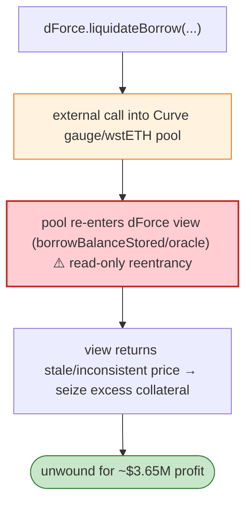

# dForce Exploit — Read-only Reentrancy in `liquidateBorrow` (wstETHCRV-Gauge collateral)

> **Reproduction:** the PoC compiles & runs in an isolated Foundry project at
> [this project folder](.). Full verbose trace: [output.txt](output.txt).

---

## Key info

| | |
|---|---|
| **Loss** | ~$3.65M ( Arbitrum, wstETH/CRV-gauge markets) |
| **Vulnerable contract** | dForce markets (`IDForce`) on Arbitrum; attack tx `0x5db5c240…` |
| **Flash sources** | Uniswap V3 `flash`, Saddle `ISwapFlashLoan` |
| **Chain / block / date** | Arbitrum / Feb 2023 |
| **Bug class** | Read-only reentrancy — dForce's `liquidateBorrow` called into a Curve gauge/wstETH pool that re-entered dForce's price/oracle view while state was mid-update, letting the attacker liquidate at a stale/inconsistent price. |

---

## TL;DR

dForce priced the wstETHCRV-gauge collateral via a Curve pool/gauge whose functions dForce called
during `liquidateBorrow`. The attacker:

1. Flash-borrows (UniV3 + Saddle) to set up a position and manipulate the gauge/pool state.
2. Calls `liquidateBorrow` → dForce queries the collateral value mid-liquidation, but the underlying
   Curve call **re-enters** dForce's view functions (`borrowBalanceStored`, oracle) while dForce's
   internal state is half-updated → read-only reentrancy.
3. Liquidates at an inconsistent price, seizing more collateral than fair, then unwinds.

---

## Root cause

A **read-only reentrancy**: an external call from a money-market mutation path into a Curve pool/gauge
that calls back into the market's *view* functions, which were used (without reentrancy guard) as the
basis for liquidation accounting. The view returned stale/inconsistent data, enabling over-seizure.

---

## Diagrams



---

## Remediation

1. **Reentrancy guard on view functions used for accounting** (or snapshot state before external calls).
2. **Don't call external pools/gauges during `liquidateBorrow`**; cache prices beforehand.
3. Two-step liquidation: compute → external → re-check before applying.

---

## How to reproduce

```bash
_shared/run_poc.sh 2023-02-dForce_exp -vvvvv
```

- RPC: Arbitrum archive. Result: `[PASS]` (~2.5 min) — excess collateral seized via read-only reentrancy.

---

*Reference: dForce read-only reentrancy in liquidation, Arbitrum, Feb 2023 (~$3.65M).*
