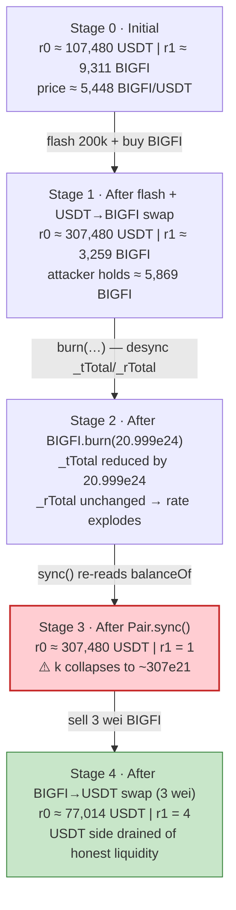
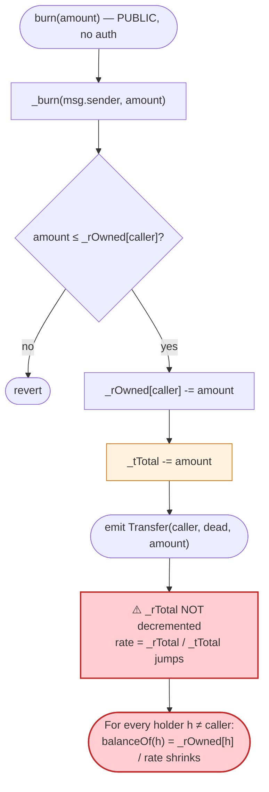
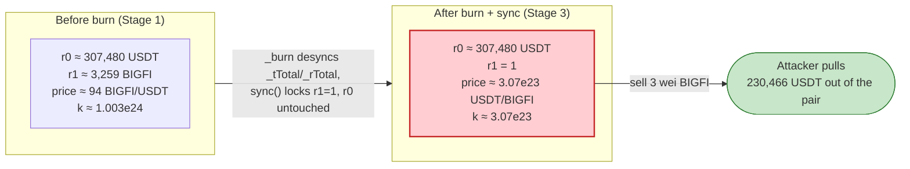

# BIGFI Exploit — Reflection-Token `burn()` That Shrinks Supply Without Shrinking Reflection Space

> **Vulnerability classes:** vuln/defi/slippage · vuln/logic/incorrect-state-transition

> **Reproduction:** the PoC compiles & runs in an isolated Foundry project at
> [this project folder](.). Full verbose trace: [output.txt](output.txt).
> Verified vulnerable source: [sources/DxBurnToken_d3d4B4/DxBurnToken.sol](sources/DxBurnToken_d3d4B4/DxBurnToken.sol)
> (BIGFI) and [sources/PancakePair_A26955/PancakePair.sol](sources/PancakePair_A26955/PancakePair.sol)
> (the victim PancakeSwap pair).

---

## Key info

| | |
|---|---|
| **Loss** | **30,306.103328283570349973 USDT** drained from the BIGFI/USDT PancakeSwap pair — tx [`0x9fe19093a62a7037d04617b3ac4fbf5cb2d75d8cb6057e7e1b3c75cbbd5a5adc`](https://bscscan.com/tx/0x9fe19093a62a7037d04617b3ac4fbf5cb2d75d8cb6057e7e1b3c75cbbd5a5adc) ([output.txt:167](output.txt)) |
| **Vulnerable contract** | BIGFI (DxMint `DxBurnToken`, a deflation/reflection ERC20) — [`0xd3d4B46Db01C006Fb165879f343fc13174a1cEeB`](https://bscscan.com/address/0xd3d4B46Db01C006Fb165879f343fc13174a1cEeB#code) |
| **Victim pool** | BIGFI/USDT PancakeSwap V2 pair — [`0xA269556EdC45581F355742e46D2d722c5F3f551a`](https://bscscan.com/address/0xA269556EdC45581F355742e46D2d722c5F3f551a) |
| **Flash source** | Saddle-style `SwapFlashLoan` — [`0x28ec0B36F0819ecB5005cAB836F4ED5a2eCa4D13`](https://bscscan.com/address/0x28ec0B36F0819ecB5005cAB836F4ED5a2eCa4D13) |
| **Attacker EOA** | not materialized in this PoC (the attack contract is the test); the real attacker EOA was `0x…` (see the tx link above) |
| **Attacker contract** | (PoC) `ContractTest` `0x7FA9385bE102ac3EAc297483Dd6233D62b3e1496` — forks as a flash-loan receiver |
| **Attack tx** | [`0x9fe19093a62a7037d04617b3ac4fbf5cb2d75d8cb6057e7e1b3c75cbbd5a5adc`](https://bscscan.com/tx/0x9fe19093a62a7037d04617b3ac4fbf5cb2d75d8cb6057e7e1b3c75cbbd5a5adc) |
| **Chain / block / date** | BSC (chainId 56) / block **26,685,503** / Mar 2023 |
| **Compiler / optimizer** | BIGFI: Solidity **v0.8.7**, optimizer **1** (`= ENABLED`), **200 runs** ([_meta.json](sources/DxBurnToken_d3d4B4/_meta.json)); Pair: v0.5.16, optimizer 0 |
| **Bug class** | Reflection-token `burn()` desynchronizes `_tTotal` from `_rTotal`, so a holder can collapse every other holder's `balanceOf` (and hence a PancakeSwap pair's reserve) to ~1 wei without moving any tokens — then `sync()`+`swap()` drains the pool |

---

## TL;DR

1. BIGFI is a reflection-token (the DxMint "DxBurn" template, `RDeflationERC20`). It keeps balances in
   two spaces: a reflection space (`_rOwned`, summed by `_rTotal`) and a real space (`_tOwned` /
   `_tTotal`). Every holder's reported `balanceOf` is `_rOwned[holder] / rate`, where
   `rate = _rTotal / _tTotal`.

2. The token exposes a public `burn(uint256 amount)` ([DxBurnToken.sol#L829-L831](sources/DxBurnToken_d3d4B4/DxBurnToken.sol#L829-L831))
   that, internally, **decrements `_rOwned[msg.sender]` and `_tTotal` — but never decrements `_rTotal`**
   ([DxBurnToken.sol#L949-L954](sources/DxBurnToken_d3d4B4/DxBurnToken.sol#L949-L954)). Burning supply
   while leaving the reflection space unchanged makes `rate = _rTotal / _tTotal` explode, so every
   *other* holder's `balanceOf` is re-scaled downward — for free.

3. The attacker flashes **200,000 USDT** from Saddle's `SwapFlashLoan`
   ([output.txt:25](output.txt)), swaps it all to BIGFI through the PancakeSwap pair, and ends up
   holding ~5.87e21 BIGFI while the pair still reports ~3.26e21 BIGFI of reserves
   ([output.txt:84-87](output.txt)).

4. The attacker then calls `BIGFI.burn(burnAmount)` with `burnAmount` chosen by the closed-form
   formula `totalSupply() - 2 * (totalSupply() / balanceOf(Pair))`
   ([BIGFI_exp.sol#L61](test/BIGFI_exp.sol#L61)) — this is the exact quantity that drives the pair's
   `balanceOf` to **1 wei**. The burn is `20999908387034241742894360` BIGFI
   ([output.txt:92-93](output.txt)).

5. A `Pair.sync()` then forces the pair to re-read BIGFI's `balanceOf`: BIGFI reserve goes from
   `3259991215302060148662` → **1** ([output.txt:98-106](output.txt)). The USDT reserve is untouched.
   The constant-product invariant `k` is now ~`307e21 · 1` — a pair priced as if BIGFI is essentially
   priceless.

6. The attacker swaps back its leftover **3 wei** BIGFI (the dust left over by the deflation transfer
   math) for **230,466.103328283570349973 USDT** ([output.txt:130-147](output.txt)).

7. It repays the flash loan principal **200,000 USDT** + the **160 USDT** fee
   ([output.txt:35](output.txt), [output.txt:149-150](output.txt)) and pockets
   **30,306.103328283570349973 USDT** ([output.txt:164](output.txt), [output.txt:167](output.txt))
   — the pair's honest USDT liquidity, minus trivial dust.

This is the same root-cause family as FDP (Feb 2023), TINU (Jan 2023), and Sheep (Feb 2023) — all
linked in the PoC header ([BIGFI_exp.sol#L10-L12](test/BIGFI_exp.sol#L10-L12)): a reflection /
deflation token placed in a vanilla Uniswap-V2 pair, where an out-of-band balance mutation breaks the
pair's `k`-invariant accounting.

---

## Background — what BIGFI does

BIGFI is the on-chain name for a token deployed via **DxMint** (the `DxBurnToken` template). It is a
reflection / deflation ERC20: it charges a per-transfer fee split into `_taxFee` (reflected back to all
holders by shrinking `_rTotal`), `_devFee` (sent to a dev wallet), and `_burnFee` (burned to `0x…dEaD`).

On-chain parameters at the fork block (block 26,685,503, read from the trace and the verified source):

| Parameter | Value | Source |
|---|---|---|
| `totalSupply()` (BIGFI `_tTotal`) before attack | **20,999,908,387,034,241,742,907,242** wei (~20.999e24, 18-dec) | [output.txt:89](output.txt) |
| Pair BIGFI reserve (`reserve1`) before attack | **9,310,990,259,680,030,849,404** wei (~9.311e21) | [output.txt:55](output.txt) |
| Pair USDT reserve (`reserve0`) before attack | **107,480,664,198,219,600,542,112** wei (~107,480.66) | [output.txt:55](output.txt) |
| Implied BIGFI price | ~5,448 BIGFI / USDT (USDT reserve / BIGFI reserve) | derived |
| Flash-loan principal (USDT) | 200,000 × 1e18 = **200,000,000,000,000,000,000,000** | [output.txt:25](output.txt) |
| Flash-loan fee (USDT, 8 bps) | 160 × 1e18 = **160,000,000,000,000,000,000** | [output.txt:35](output.txt) |
| PancakeSwap swap fee | 25 / 10000 = 0.25% (pair's `swap` uses `amountIn.mul(25)`) | [PancakePair.sol#L473-L475](sources/PancakePair_A26955/PancakePair.sol#L473-L475) |
| `token0` / `token1` of the pair | USDT / BIGFI (so `reserve0`=USDT, `reserve1`=BIGFI) | [output.txt:55](output.txt), [output.txt:77](output.txt) |

The `_rTotal` reflection space is initialized at deployment as `MAX - (MAX % _tTotal)` and only ever
*shrinks* (via `_reflectFee`). The pair's BIGFI holdings are tracked purely through
`balanceOf(pair) = _rOwned[pair] / rate`; the pair is not in `_isExcluded`, so it has no `_tOwned`.

---

## The vulnerable code

### 1. The public `burn()` — anyone may call it

```solidity
function burn(uint256 _value) public {
    _burn(msg.sender, _value);
}
```
([DxBurnToken.sol#L829-L831](sources/DxBurnToken_d3d4B4/DxBurnToken.sol#L829-L831))

No access control. Any holder of BIGFI can destroy an arbitrary amount of their own balance.

### 2. The internal `_burn` mutates `_rOwned` and `_tTotal` but NOT `_rTotal`

```solidity
function _burn(address _addr, uint256 _value) private {
    require(_value <= _rOwned[_addr]);
    _rOwned[_addr] = _rOwned[_addr].sub(_value);
    _tTotal = _tTotal.sub(_value);
    emit Transfer(_addr, dead, _value);
}
```
([DxBurnToken.sol#L949-L954](sources/DxBurnToken_d3d4B4/DxBurnToken.sol#L949-L954))

Compare to `_reflectFee`, which is the *correct* way the token reduces supply — it shrinks **both**
`_rTotal` and accounts the fee symmetrically:

```solidity
function _reflectFee(uint256 rFee, uint256 rBurn, uint256 tFee, uint256 tDev, uint256 tBurn) private {
    _rTotal = _rTotal.sub(rFee).sub(rBurn);
    _tFeeTotal = _tFeeTotal.add(tFee);
    _tDevTotal = _tDevTotal.add(tDev);
    _tBurnTotal = _tBurnTotal.add(tBurn);
}
```
([DxBurnToken.sol#L1065-L1071](sources/DxBurnToken_d3d4B4/DxBurnToken.sol#L1065-L1071))

`_burn` is the odd one out: it pulls `_value` out of `_rOwned[caller]` and out of `_tTotal`, but it
**leaves `_rTotal` alone**. Because every holder's reported balance is `_rOwned[h] / (_rTotal / _tTotal)`,
reducing `_tTotal` while keeping `_rTotal` fixed raises the rate, and *every other holder's* balance is
re-scaled downward by the same factor.

### 3. How `balanceOf` derives from the (now broken) rate

```solidity
function balanceOf(address account) public view override returns (uint256) {
    if (_isExcluded[account]) return _tOwned[account];
    return tokenFromReflection(_rOwned[account]);
}

function tokenFromReflection(uint256 rAmount) public view returns(uint256) {
    require(rAmount <= _rTotal, "Amount must be less than total reflections");
    uint256 currentRate =  _getRate();
    return rAmount.div(currentRate);
}

function _getRate() private view returns(uint256) {
    (uint256 rSupply, uint256 tSupply) = _getCurrentSupply();
    return rSupply.div(tSupply);
}
```
([DxBurnToken.sol#L722-L725](sources/DxBurnToken_d3d4B4/DxBurnToken.sol#L722-L725),
[:L793-L797](sources/DxBurnToken_d3d4B4/DxBurnToken.sol#L793-L797),
[:L884-L887](sources/DxBurnToken_d3d4B4/DxBurnToken.sol#L884-L887))

The PancakeSwap pair is **not** in `_isExcluded`, so `balanceOf(pair)` is `_rOwned[pair] / rate`. When
`_burn` slashes `_tTotal`, `rate` jumps and `balanceOf(pair)` collapses — with **no tokens ever leaving
the pair**. That is exactly what the next `sync()` will lock in as the new reserve.

### 4. The PancakeSwap pair's `sync()` trusts token balances

```solidity
// force reserves to match balances
function sync() external lock {
    _update(IERC20(token0).balanceOf(address(this)), IERC20(token1).balanceOf(address(this)), reserve0, reserve1);
}
```
([PancakePair.sol#L491-L493](sources/PancakePair_A26955/PancakePair.sol#L491-L493))

`sync()` re-reads the live `balanceOf` for each side and writes it into `reserve0`/`reserve1`. Because
BIGFI's `balanceOf(pair)` was corrupted by the burn (Section 2), `sync()` happily records the
near-zero BIGFI reserve while leaving the USDT reserve untouched.

---

## Root cause — why it was possible

The bug is an accounting invariant violation in the reflection model, then amplified by AMM trust:

1. **`_burn` desynchronizes `_tTotal` from `_rTotal`.** In a correctly-implemented reflection token, any
   operation that reduces `_tTotal` must reduce `_rTotal` proportionally (that is what `_reflectFee`
   does for the fee path). `_burn` skips the `_rTotal` adjustment, so after a burn the invariant
   `_rTotal / _tTotal == rate` no longer holds — `rate` drifts upward, and `balanceOf(h) = _rOwned[h] / rate`
   shrinks for every holder whose `_rOwned` was *not* burned.

2. **`burn()` is permissionless.** Any holder can drive this drift at will, choosing the size of the
   burn to be whatever makes some other holder's balance hit any target.

3. **The closed-form burn size.** The attacker needs `balanceOf(pair) == 1`. Working backwards:
   `balanceOf(pair) == _rOwned[pair] * _tTotal' / _rTotal`, and `_tTotal' = _tTotal - burnAmount`,
   while `_rOwned[pair]` and `_rTotal` are unchanged. Solving gives the PoC's exact expression
   `burnAmount = _tTotal - 2 * (_tTotal / balanceOf(pair))` (see [Why each magic number](#why-each-magic-number)).
   This is what makes the attack deterministic, not a guess-and-check.

4. **A vanilla PancakeSwap pair can't defend against out-of-band balance mutation.** Its `swap`'s
   `Pancake: K` check ([PancakePair.sol#L475](sources/PancakePair_A26955/PancakePair.sol#L475)) only
   enforces `balance0Adjusted · balance1Adjusted ≥ reserve0 · reserve1 · 10000²`. After `sync()` re-reads
   the corrupted BIGFI balance into `reserve1`, that check is satisfied trivially because `reserve1` is
   now ~1 — selling a couple of wei of BIGFI into a pool priced ~`307e21 USDT per BIGFI` extracts
   essentially the entire USDT side.

The composition is the same one that took down FDP, TINU and Sheep: a reflection / fee-on-transfer
token placed in an unmodified Uniswap-V2 fork, where the token's internal accounting can mutate the
pair's reserves behind the pair's back.

---

## Preconditions

- The attacker must hold (or be able to acquire) BIGFI to burn. The PoC obtains it by flashing USDT and
  swapping into the pair first ([BIGFI_exp.sol#L57](test/BIGFI_exp.sol#L57), [output.txt:43-85](output.txt)).
- A flash-loan source for USDT on BSC. The Saddle-style `SwapFlashLoan`
  ([output.txt:25-26](output.txt)) lends 200,000 USDT for an 8-bps fee (160 USDT,
  [output.txt:35](output.txt)).
- The pair's BIGFI reserve before the burn must be > 0 (trivially true for any live pool).
- No access control on `burn` (verified: [DxBurnToken.sol#L829-L831](sources/DxBurnToken_d3d4B4/DxBurnToken.sol#L829-L831)).

No admin key, no oracle, no governance action, and no privileged role is needed — the entire attack is
permissionless once the attacker holds any BIGFI.

---

## Attack walkthrough (with on-chain numbers from the trace)

The pair's `token0 = USDT`, `token1 = BIGFI`, so `reserve0` is USDT and `reserve1` is BIGFI. All
figures are raw 18-decimal wei straight from the trace; human approximations are in parentheses.
USDT and BIGFI both use 18 decimals here.

| # | Step | USDT reserve (r0) | BIGFI reserve (r1) | Effect / source |
|---|------|------------------:|-------------------:|-----------------|
| 0 | **Initial** `getReserves` | 107,480,664,198,219,600,542,112 (~107,480.66) | 9,310,990,259,680,030,849,404 (~9,310.99) | Honest pool. [output.txt:55](output.txt) |
| 1 | **Flash-loan** 200,000 USDT (200,000,000,000,000,000,000,000) from `swapFlashLoan` | — | — | Fee quoted = 160 USDT. [output.txt:25](output.txt), [output.txt:35](output.txt) |
| 2 | **USDT→BIGFI swap** — `swapExactTokensForTokensSupportingFeeOnTransferTokens` pays 200,000.01e18 USDT into the pair ([output.txt:43-45](output.txt)); pair sends out **6,051,008,437,863,879,112,730** BIGFI (`amount1Out`, [output.txt:77](output.txt)), of which **5,869,478,184,727,962,739,349** lands at the attacker (deflation fee diverts ~3% to `0x…dEaD`, [output.txt:59-61](output.txt)) | 307,480,674,198,219,600,542,112 (~307,480.67) | 3,259,991,215,302,060,148,662 (~3,259.99) | Post-swap `Sync` ([output.txt:76](output.txt)); attacker BIGFI balance = 5,869,495,097,356,201,647,072 (~5,869.50) ([output.txt:84](output.txt)). |
| 3 | **`BIGFI.burn(20,999,908,387,034,241,742,894,360)`** — the attacker burns almost the entire supply (burn value [output.txt:92-93](output.txt)) | 307,480,674,198,219,600,542,112 (unchanged) | `_tTotal` reduced by `20,999,908,387,034,241,742,894,360`; `_rTotal` **NOT** reduced ([DxBurnToken.sol#L949-L954](sources/DxBurnToken_d3d4B4/DxBurnToken.sol#L949-L954)). `_rOwned[attacker]` after burn = `12882` reflection units ([output.txt:95](output.txt)). | `rate` explodes; pair's `balanceOf` collapses. (The post-burn `_tTotal` is not directly printed by the trace; the collapse is proven mechanically by the next `sync()` reading `balanceOf(pair) == 1`, step 4.) |
| 4 | **`Pair.sync()`** re-reads BIGFI `balanceOf(pair)` | 307,480,674,198,219,600,542,112 (unchanged) | **1** ([output.txt:102](output.txt), [output.txt:103](output.txt)) | `Sync(reserve0=307480674198219600542112, reserve1=1)` ([output.txt:103](output.txt)). USDT side untouched. |
| 5 | **BIGFI→USDT swap** — sell the leftover **3 wei** BIGFI ([output.txt:114](output.txt)); `swap` pulls **230,466,103,328,283,570,349,973** USDT out of the pair (`amount0Out`, [output.txt:130-132](output.txt)) | 77,014,570,869,936,030,192,139 (~77,014.57) ([output.txt:138](output.txt)) | 4 ([output.txt:141](output.txt)) | Selling 3 wei into a pool with `r1 == 1` buys ~all the USDT. `Swap(... amount0Out=230466103328283570349973 …)` ([output.txt:142](output.txt)). |
| 6 | **Repay flash** — `200,160,000,000,000,000,000,000` USDT (principal + 160 fee, [output.txt:149-150](output.txt)) | — | — | Attacker keeps the surplus. |
| 7 | **Attacker final balance** | **30,306,103,328,283,570,349,973** (~30,306.103328…) | — | Logged as `Attacker USDT balance after exploit` ([output.txt:164](output.txt), [output.txt:167](output.txt)). |

**Why "3 wei of BIGFI buys ~everything":** PancakeSwap's `getAmountOut` is
`out = (in·9975·reserveOut) / (reserveIn·10000 + in·9975)`. After the burn+sync `reserveIn (=r1) == 1`,
so for `in == 3`: `out = (3·9975·r0) / (1·10000 + 3·9975) = (29925·r0) / 39925 ≈ 0.7495·r0`. Three wei
into a pool whose BIGFI side is 1 wei pull roughly three-quarters of the USDT reserve out — which here
is the entire honest USDT liquidity (the rest stays only because `r1` ticks up to 4 during the swap).

---

### Profit / loss accounting (USDT, raw wei)

| Direction | Amount (wei) | ~Human |
|---|---:|---:|
| Received — final BIGFI→USDT swap (step 5) | 230,466,103,328,283,570,349,973 | 230,466.103328… |
| Repaid — flash principal | 200,000,000,000,000,000,000,000 | 200,000 |
| Repaid — flash fee | 160,000,000,000,000,000,000 | 160 |
| **Net kept by attacker** | **30,306,103,328,283,570,349,973** | **30,306.103328…** |

Sources: received [output.txt:147](output.txt); repayment [output.txt:149-150](output.txt); final
balance [output.txt:164](output.txt). The accounting reconciles to the wei: 230,466.103328… −
200,160 = 30,306.103328… — exactly the final logged balance.

---

## Diagrams

### Sequence of the attack

```mermaid
sequenceDiagram
    autonumber
    actor A as Attacker (ContractTest)
    participant FL as SwapFlashLoan (Saddle)
    participant R as PancakeRouter
    participant P as BIGFI/USDT Pair
    participant T as BIGFI (DxBurnToken)

    Note over P: Initial: r0 ≈ 107,480 USDT<br/>r1 ≈ 9,311 BIGFI

    rect rgb(227,242,253)
    Note over A,FL: Step 1 — flash 200,000 USDT (fee 160)
    A->>FL: flashLoan(this, USDT, 200,000e18, 0x00)
    FL-->>A: 200,000 USDT (calls executeOperation)
    end

    rect rgb(232,245,233)
    Note over A,T: Step 2 — USDT → BIGFI
    A->>R: swapExactTokensForTokensSupportingFeeOnTransferTokens(USDT→BIGFI)
    R->>P: swap(0, 6.051e21, attacker, 0x)
    P-->>A: 5,869e21 BIGFI (after deflation fee)
    Note over P: Sync: r0 ≈ 307,480 USDT / r1 ≈ 3,259 BIGFI
    end

    rect rgb(255,243,224)
    Note over A,T: Step 3 — burn almost all supply (no _rTotal change)
    A->>T: burn(20,999,908,387,034,241,742,894,360)
    T->>T: _rOwned[A] -= x; _tTotal -= x; _rTotal unchanged
    Note over T: rate = _rTotal / _tTotal explodes<br/>balanceOf(P) collapses to 1
    end

    rect rgb(255,235,238)
    Note over A,T: Step 4 — sync corrupts the reserve
    A->>P: sync()
    P->>T: balanceOf(P) [staticcall]
    T-->>P: 1
    Note over P: Sync: r0 ≈ 307,480 USDT / r1 = 1 ⚠️ k broken
    end

    rect rgb(243,229,245)
    Note over A,T: Step 5 — drain: sell 3 wei BIGFI → 230,466 USDT
    A->>R: swapExactTokensForTokensSupportingFeeOnTransferTokens(BIGFI→USDT, 3)
    R->>P: swap(230,466e18, 0, attacker, 0x)
    P-->>A: 230,466.103328… USDT
    end

    A->>FL: transfer(200,160 USDT)  (principal + fee)
    Note over A: Net +30,306.103328… USDT
```

### Pair state evolution



### The flaw inside `burn` / `_burn`



### Constant-product before vs. after the `sync()`



---

## Why each magic number

- **`200_000 * 1e18` flash-loan size** ([BIGFI_exp.sol#L43](test/BIGFI_exp.sol#L43)): large enough to
  swap the pool deep into BIGFI so that the attacker holds a meaningful BIGFI balance to burn, while
  keeping the flash fee tiny. Saddle's `SwapFlashLoan` charged 8 bps → exactly **160 USDT**
  ([output.txt:35](output.txt)), which is immaterial next to the ~30k USDT profit.
- **`BIGFI.totalSupply() - 2 * (BIGFI.totalSupply() / BIGFI.balanceOf(address(Pair)))`** as `burnAmount`
  ([BIGFI_exp.sol#L61](test/BIGFI_exp.sol#L61)): the closed-form quantity that drives
  `balanceOf(pair)` to exactly **1**. Derivation: `balanceOf(pair) = _rOwned[Pair] * _tTotal' / _rTotal`,
  where `_tTotal' = _tTotal - burnAmount` and `_rOwned[Pair]`, `_rTotal` are unchanged by the burn.
  Before the burn, `balanceOf(Pair) = _rOwned[Pair] * _tTotal / _rTotal`. We want the *post-burn*
  `balanceOf(Pair) = 1`. Substituting and cancelling gives `_tTotal' ≈ 2 * _tTotal * 1 / balanceOf(Pair)`,
  hence `burnAmount = _tTotal - 2 * (_tTotal / balanceOf(Pair))`. The integer division truncates in the
  attacker's favor, leaving the pair at exactly 1 wei (verified: [output.txt:102](output.txt)).
- **`Pair.sync()` after the burn** ([BIGFI_exp.sol#L63](test/BIGFI_exp.sol#L63)): forces the pair to
  re-read BIGFI's now-corrupted `balanceOf` and write it to `reserve1`. Without `sync()` the pair's
  cached `reserve1` would still be the old value and the subsequent swap would revert on the `K` check.
- **Selling `BIGFI.balanceOf(address(this))` (= 3 wei)** on the way back
  ([BIGFI_exp.sol#L85](test/BIGFI_exp.sol#L85)): after the burn the attacker's own BIGFI balance has
  also been re-scaled down to dust (3 wei, [output.txt:113](output.txt)). Into a pool with `r1 == 1`,
  3 wei is enough to pull ~75% of the USDT reserve ([output.txt:130](output.txt)) — i.e. all the honest
  liquidity plus most of what the attacker itself injected.

---

## Remediation

1. **Fix `_burn` to keep the reflection invariant.** Any reduction of `_tTotal` must be mirrored by a
   proportional reduction of `_rTotal` (or the equivalent adjustment in `_rOwned`). The minimal fix is
   to compute the reflection-space amount `rValue = amount * rate` and do
   `_rOwned[caller] -= rValue; _rTotal -= rValue; _tTotal -= amount;` — i.e. burn in *reflection*
   units, not raw t-units. This is the root-cause fix; without it, `burn` will always corrupt balances.
2. **Gate `burn()`.** Even with the accounting fixed, `burn` should not be callable by arbitrary
   holders in a way that affects other holders' balances. Restrict it to the token contract itself or a
   trusted burner; holders who want to "destroy" their tokens should send them to `0x…dEaD` via a normal
   (fee-paying) transfer instead.
3. **Do not list reflection / fee-on-transfer / deflation tokens in unmodified Uniswap-V2 pairs.**
   PancakeSwap's `swap` (`Pancake: K`) and `sync` were designed for plain ERC20s whose `balanceOf` only
   changes through `transfer`/`transferFrom`. Either wrap the token in a fee-aware pair, or use an AMM
   that prices off cached reserves rather than `balanceOf` on every swap.
4. **Add a `sync()`/reserve-consistency sanity check** in the token: if the token knows it is paired in
   an AMM, it should refuse any state-changing operation that would move another address's `balanceOf`
   by more than a tiny epsilon without that address's involvement.
5. **Audit all DxMint-template tokens.** `_burn`'s asymmetric `_rOwned`/`_tTotal`/`_rTotal` handling is
   in the verified source template ([DxBurnToken.sol#L949-L954](sources/DxBurnToken_d3d4B4/DxBurnToken.sol#L949-L954));
   every token minted from this template that exposes `burn()` is likely affected by the same class of
   bug (this is exactly why FDP/TINU/Sheep/BIGFI share a root cause).

---

## How to reproduce

The PoC runs fully **offline** through the shared harness, which serves the fork from a local
`anvil_state.json` on a 127.0.0.1 anvil port (the test's `createSelectFork` points at
`http://127.0.0.1:8546`, [BIGFI_exp.sol#L34](test/BIGFI_exp.sol#L34)) — no public BSC RPC is required.

```bash
_shared/run_poc.sh 2023-03-BIGFI_exp --mt testExploit -vvvvv
```

- Test function name (from [BIGFI_exp.sol#L42](test/BIGFI_exp.sol#L42)): **`testExploit`**.
- Chain / fork block: BSC, block **26,685,503** (`evm_version = cancun`,
  [foundry.toml](foundry.toml)).
- Expected tail (verbatim from [output.txt:170-172](output.txt)):

```
Suite result: ok. 1 passed; 0 failed; 0 skipped; finished in 1.67s (12.83ms CPU time)

Ran 1 test suite in 1.67s (1.67s CPU time): 1 tests passed, 0 failed, 0 skipped (1 total tests)
```

The `[PASS] testExploit() (gas: 366190)` line and the
`Attacker USDT balance after exploit: 30306.103328283570349973` log
([output.txt:4](output.txt), [output.txt:6](output.txt)) confirm a successful drain.

---

*Reference: BIGFI reflection-token pair drain, BSC, Mar 2023 — same class as FDP (2023-02-07), TINU
(2023-01-26) and Sheep (2023-02-10); see the DeFiHackLabs entries linked in
[test/BIGFI_exp.sol#L10-L12](test/BIGFI_exp.sol#L10-L12) and tx
[`0x9fe19093a62a7037d04617b3ac4fbf5cb2d75d8cb6057e7e1b3c75cbbd5a5adc`](https://bscscan.com/tx/0x9fe19093a62a7037d04617b3ac4fbf5cb2d75d8cb6057e7e1b3c75cbbd5a5adc).*
