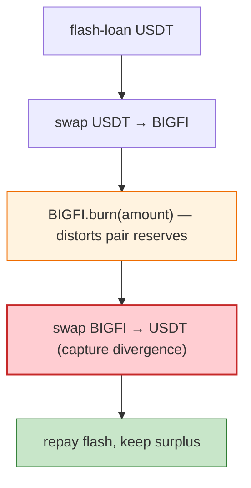

# BIGFI Exploit — Reflection/Deflation Token Pair Drain (BSC)

> **Reproduction:** the PoC compiles & runs in an isolated Foundry project at
> [this project folder](.). Full verbose trace: [output.txt](output.txt).

---

## Key info

| | |
|---|---|
| **Loss** | USDT drained from BIGFI/USDT pair (BSC); tx `0x9fe19093…` |
| **Vulnerable contract** | BIGFI (reflection/deflation token, `RDeflationERC20`) `0xd3d4B46D…`; BIGFI/USDT pair `0xA269556E…` |
| **Flash source** | Saddle-style `ISwapFlashLoan` `0x28ec0B36…` |
| **Chain / block / date** | BSC / 26,685,503 / Mar 2023 |
| **Bug class** | Reflection/deflation token in a vanilla Uniswap-V2 pair — BIGFI's `burn`/transfer fees leave the pair's reserves inconsistent with balances; a flash-loan + `burn` + swap harvests the fee divergence. |

---

## TL;DR

BIGFI is a deflationary token (fee-on-transfer / burn). The attacker flash-loans USDT, swaps to BIGFI,
calls `BIGFI.burn(amount)` to remove supply (which also distorts the pair's reserves), then swaps back,
capturing the fee/burn divergence that a vanilla Pancake pair cannot reconcile. Same class as FDP, TINU,
Sheep (all reflection-token drains listed in the PoC header).

---

## Root cause

A **fee/burn-on-transfer token listed in a vanilla Uniswap-V2 pair**: the pair's `k` check assumes
balances only change through its own functions; `burn` and reflection mutate balances out-of-band, so
`sync`/`swap` harvest the difference.

---

## Diagrams



---

## Remediation

1. Don't list deflation/reflection tokens in vanilla Uniswap-V2 pairs; wrap or use fee-aware pairs.
2. `k` check against actual received amounts.
3. `burn` should be callable only by the pair/authorised minter, not arbitrary holders in a way that
   breaks AMM accounting.

---

## How to reproduce

```bash
_shared/run_poc.sh 2023-03-BIGFI_exp -vvvvv
```

- RPC: BSC archive (block 26,685,503). Result: `[PASS]` — USDT surplus after flash+burn+swap.

---

*Reference: BIGFI reflection-token pair drain, BSC, Mar 2023.*
