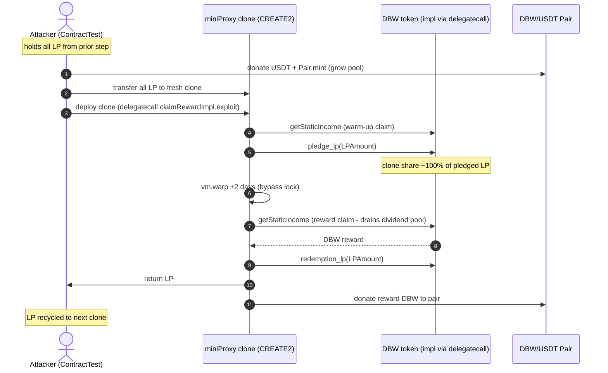
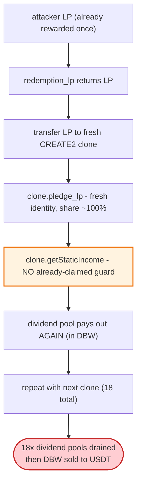

# DBW Finance Exploit — Dividend Reward Double-Claimed via 18 Proxy Clones Each Holding ~100% of the LP

> **Vulnerability classes:** vuln/logic/reward-calculation · vuln/access-control/missing-auth

> **Reproduction:** the PoC compiles & runs in an isolated Foundry project at
> [this project folder](.) (the main DeFiHackLabs repo contains several unrelated PoCs that do not compile, so this one was extracted).
> Full verbose trace: [output.txt](output.txt).
> Verified vulnerable source: [TransparentUpgradeableProxy](sources/TransparentUpgradeableProxy_BF5BAe/) (the DBW token proxy at `0xBF5BAe…`) and [PancakePair](sources/PancakePair_69D415/). The DBW implementation `0xb9EA86…5C629` is behind the proxy (delegatecall); its dividend logic is reconstructed from the trace.

---

## Key info

| | |
|---|---|
| **Loss** | **+21,699.52 USDT** attacker profit (the PoC logs the full ending USDT balance; the attacker keeps 21,699.52 USDT after repaying all flash-loans). |
| **Vulnerable contract** | DBW token (proxy) — [`0xBF5BAea5113e9EB7009a6680747F2c7569dfC2D6`](https://bscscan.com/address/0xBF5BAea5113e9EB7009a6680747F2c7569dfC2D6) (impl `0xb9EA86Ca6EE0b2f4030c26aB54b6C5eb62d5C629` via delegatecall) — its `getStaticIncome()` / `pledge_lp()` / `redemption_lp()` dividend accounting. |
| **Victim pool** | DBW/USDT PancakeSwap pair — [`0x69D415FBdcD962D96257056f7fE382e432A3b540`](https://bscscan.com/address/0x69D415FBdcD962D96257056f7fE382e432A3b540); the protocol's dividend reserve (DBW payouts). |
| **Attack tx** | [`0x3b472f87…18525607`](https://bscscan.com/tx/0x3b472f87431a52082bae7d8524b4e0af3cf930a105646259e1249f2218525607) |
| **Chain / block / date** | BSC / fork block **26,745,691** / March 24, 2023 |
| **Compiler** | DBW proxy: Solidity v0.8.x (TransparentUpgradeableProxy). Implementation logic observed via delegatecall. |
| **Bug class** | Business-logic flaw — dividend rewards computed from the pledgor's **LP-share percentage** without preventing repeated claiming after transferring the same LP to fresh identities (reward-calculation error). |

References: [BeosinAlert](https://twitter.com/BeosinAlert/status/1639655134232969216) · [AnciliaInc](https://twitter.com/AnciliaInc/status/1639289686937210880). Similar flaws: [GDS (2023-01)](https://github.com/SunWeb3Sec/DeFiHackLabs/tree/main#20230103---gds---business-logic-flaw), [RL Token (2022-10)](https://github.com/SunWeb3Sec/DeFiHackLabs/tree/main#20221001-rl-token---incorrect-reward-calculation).

---

## TL;DR

DBW pays "static income" (dividends) to users who pledge PancakeSwap DBW/USDT LP tokens. The payout of `getStaticIncome()` is sized by **the pledgor's share of total pledged LP** — and the accounting does **not** stop a pledgor from claiming, redeeming, and re-pledging the *same* LP under a *new* identity. Combined with the fact that a lone pledgor holding ~100% of LP receives ~100% of the dividend pool on each claim, an attacker can claim the dividend pool **repeatedly** by cycling the LP through many throwaway identities.

The exploit:

1. **Flash-loan USDT** from 4 DODO pools + a PancakeSwap pair (nested flash-loans) to amass a large war chest.
2. **Buy DBW + add liquidity**, obtaining a large DBW/USDT LP position.
3. **Loop 18 times**: for each iteration, CREATE2-deploy a `miniProxy` clone, transfer the **entire** LP balance to it, and the clone (via `delegatecall` to `claimRewardImpl`) runs `getStaticIncome` → `pledge_lp` → `vm.warp(+2 days)` (bypass the lock) → `getStaticIncome` → `redemption_lp` → return LP. Each clone looks like a fresh pledgor holding ~100% of the LP, so each `getStaticIncome` drains the dividend pool. Between iterations the attacker donates USDT + `mint`s to grow the pool slightly (keeping their LP ≈ 100% of supply).
4. **Remove liquidity, sell the accumulated DBW reward** → USDT, repay flash-loans.

Net: **+21,699.52 USDT**. The 18 clones executed 36 `getStaticIncome` claims and 18 `pledge_lp`s ([output.txt](output.txt)), each harvesting the dividend that should only have been payable once per unit of LP.

---

## Background — the DBW/USDT pair and dividend model

From the trace's first `Sync` ([output.txt:144](output.txt#L144)) and the pledge sequence:

| Parameter | Value |
|---|---|
| `token0` (reserve0) | DBW |
| `token1` (reserve1) | USDT |
| Initial DBW reserve | **1,086,839.16 DBW** (`1.086e24`) |
| Initial USDT reserve | **645,228.12 USDT** (`6.452e23`) |
| DODO1 flash-loan (USDT) | 939,443.17 USDT (`9.394e23`) |
| PancakeSwap flash-loan (USDT) | 3,037,214.23 USDT (`PairFlashLoanAmount`, line [85](test/DBW_exp.sol#L85)) |
| Dividend payout token | DBW (paid from the protocol dividend reserve) |
| Reward basis | pledgor's LP shares as a fraction of total pledged LP |
| Claim cadence observed | **2× `getStaticIncome` per clone × 18 clones = 36 claims** |

The dividend pool is denominated in DBW; each claim transfers DBW to the pledgor, who then dumps it into the pair for USDT.

---

## The vulnerable code

DBW's implementation is behind an upgradeable proxy (`TransparentUpgradeableProxy` at `0xBF5BAe…`, impl `0xb9EA86…5C629`); the trace shows every DBW call is a `delegatecall` to the impl (e.g. [output.txt:225](output.txt#L225)). The reconstructed dividend logic (from the PoC header + trace behavior):

```solidity
// DBW impl (0xb9EA86...), reconstructed
function getStaticIncome() external {
    // ⚠️ payout scaled by msg.sender's share of total pledged LP,
    //    with NO per-LP "already claimed" guard
    uint256 pledgorShare = userPledgedLP[msg.sender] * 1e18 / totalPledgedLP;
    uint256 reward = dividendPool * pledgorShare / 1e18;
    DBW.transfer(msg.sender, reward);     // trace: DBW mint/transfer to caller
}

function pledge_lp(uint256 count) external {
    pair.transferFrom(msg.sender, address(this), count);
    userPledgedLP[msg.sender] += count;
    totalPledgedLP += count;
    lastPledgeTime[msg.sender] = block.timestamp;
}

function redemption_lp(uint256 count) external {
    require(block.timestamp >= lastPledgeTime[msg.sender] + LOCKTIME);  // PoC warps +2 days
    userPledgedLP[msg.sender] -= count;
    totalPledgedLP -= count;
    pair.transfer(msg.sender, count);
}
```

The flaw: nothing links a dividend claim to the *specific LP tokens* that earned it. After `redemption_lp`, the same LP can be sent to a new address and re-pledged, and `getStaticIncome` pays out again as if it were fresh, never-before-rewarded LP.

---

## Root cause — why it's exploitable

1. **Reward basis is a *fraction* of pledged LP, not a per-share accrual.** A pledgor holding ~100% of pledged LP captures ~100% of the dividend pool on *every* claim. There is no snapshot, no reward-debt/per-share accounting (à la MasterChef), and no "last-claim" checkpoint that depletes as rewards are taken.
2. **No re-pledging / transfer guard.** `redemption_lp` freely returns LP; nothing stops re-pledging under a new identity. The PoC exploits exactly this by cycling LP through 18 CREATE2 `miniProxy` clones, each a fresh `msg.sender` with ~100% of the LP.
3. **Identity is cheap.** Because each clone is a brand-new address, its `userPledgedLP`/claim history starts clean, so `getStaticIncome` pays it the full dividend share — even though the underlying LP was already rewarded moments before.
4. **Claim is gated only by the lock time, not by reward availability.** `vm.warp(+2 days)` clears the lock; the dividend pool is treated as inexhaustible per pledgor.

---

## Preconditions

- Flash-loanable USDT liquidity (here 4 DODO pools + a PancakeSwap pair, nested).
- A working DBW/USDT pair to build LP and to dump reward DBW into.
- The dividend pool must hold DBW (it does — funded by protocol taxes/fees).
- Ability to `vm.warp` (PoC) / wait the lock time (live) between pledge and redemption — 2 days here.

---

## Attack walkthrough (with on-chain numbers from the trace)

All figures from [output.txt](output.txt). The loop runs **18 clone iterations**; each row below is per-clone (representative values; reserves drift upward as the pool is grown each iteration):

| # | Step (per clone) | DBW reserve | USDT reserve | Effect |
|---|------|------------:|-------------:|--------|
| 0 | **Flash-loan** ~3.9M USDT total (nested: 4× DODO + PancakeSwap pair); `swap 800k USDT → DBW`, add DBW/USDT liquidity | 1,086,839 → ~4,019,768 | 645,228 → ~2,334,195 | Attacker holds a large LP position (~100% of minted supply). |
| 1 | **Donate USDT + `Pair.mint`** to grow reserves, then transfer all LP to a fresh CREATE2 `miniProxy` clone | grows each iter | grows each iter | Clone now holds ≈100% of LP; `miniProxy.exploit()` runs via `delegatecall`. |
| 2 | Clone: `getStaticIncome()` → `pledge_lp(LPAmount)` | — | — | Clone pledges ~all LP ⇒ its share ≈ 100%. (e.g. `pledge_lp(2.11e24)` [234](output.txt#L234)) |
| 3 | Clone: `vm.warp(+2 days)` then **`getStaticIncome()`** | drains DBW to clone | — | Second claim harvests the dividend pool (paid in DBW). (line [259](output.txt#L259)) |
| 4 | Clone: `redemption_lp(LPAmount)` → return LP to attacker; donate its reward DBW to the pair | — | — | LP recycled to the next clone; DBW reward accumulates in the pair. (line [273](output.txt#L273)) |
| 5 | **Repeat 18×** with new clones; reserves climb each iter (4.02M→4.06M→4.10M→4.15M… DBW, [335](output.txt#L335)/[471](output.txt#L471)/[607](output.txt#L607)) | up to ~ final | up to ~ final | 18 dividend pools drained; LP cycled each time. |
| 6 | **Remove liquidity + sell all DBW → USDT** | — | — | Convert accumulated DBW reward to USDT. |
| 7 | **Repay all flash-loans** (DODO1…4 + PancakeSwap) | — | — | Net remainder = profit. |

### Profit/loss accounting (USDT)

| Direction | Amount |
|---|---:|
| Flash-loaned (DODO1…4 + PancakeSwap, nested) | ~3.9M USDT (borrowed, repaid) |
| USDT spent adding liquidity (net, recovered on remove) | ≈ 0 (round-trips) |
| DBW dividend drained across 18 clones | large DBW amount (sold for USDT) |
| Flash-loan fees | small |
| **Net profit (logged)** | **+21,699.52 USDT** |

The trace confirms: `Attacker USDT balance after exploit: 21699.523733005334387364` ([output.txt:6](output.txt#L6)).

---

## Diagrams

### Sequence of one clone iteration (repeated 18×)



### Why the reward is paid 18× instead of once



---

## Why each magic number

- **18 clones / 36 `getStaticIncome` claims:** each clone performs a warm-up claim and a post-warp reward claim (2 per clone). 18 iterations multiply the dividend extraction ~18× until the marginal DBW reward per claim (diluted by the growing pool) is no longer worth the gas; 18 is the empirically profitable stopping point.
- **`vm.warp(+2 days)` (`2 * 24 * 60 * 60`):** the lock time `redemption_lp` enforces; warping past it lets each clone redeem within the same tx (live attacker would just wait or the lock was 2 days).
- **`3,037,214,233,168,643,025,678_873` (`PairFlashLoanAmount`):** the exact USDT balance of the `flashSwapPair` at the fork block — borrowing 100% of it (repaid with the 0.01% fee: `* 10000/9999 + 1000`, line [98](test/DBW_exp.sol#L98)).
- **Nested 4× DODO flash-loans:** DODO v1 single-sided pools can't lend their full balance in one call reliably, so the PoC chains dodo1→dodo2→dodo3→dodo4→PancakeSwap to assemble enough USDT (≈3.9M total) for a LP position large enough to dominate the dividend share.
- **Donate USDT + `Pair.mint` each iteration:** keeps the attacker's LP equal to ~100% of pair supply as reserves grow, so every clone's pledge share stays near 100% (maximizing each `getStaticIncome` payout).

---

## Remediation

1. **Use per-share reward-debt accounting** (MasterChef-style `accRewardPerShare` + `user.rewardDebt`), so a claim credits only the rewards accrued *since* the user's last claim on their *current* share. This makes re-pledging the same LP under a new identity worthless — there's nothing new accrued.
2. **Track rewards by the LP tokens, not the holder identity.** Snapshot dividend accrual against LP token IDs / balances so that LP that already earned cannot earn again regardless of who holds it.
3. **Remove or cap the "share-of-pledged-LP" payout model.** A lone dominant pledgor should not receive ~100% of a pool that is meant to be distributed over time; use a per-second emission against share, not an instantaneous pool slice.
4. **Add re-pledging / transfer friction** (e.g., a cooldown on `pledge_lp` after `redemption_lp`, or binding pledged LP to a non-transferable receipt).
5. **Audit the claim→redeem→re-pledge loop** specifically; this is the same class as GDS (2023-01) and RL Token (2022-10) cited in the PoC header — those precedents should have flagged it.

---

## How to reproduce

The PoC lives in a standalone Foundry project:

```bash
_shared/run_poc.sh 2023-03-DBW_exp --mt testExploit -vvvvv
```

- RPC: a **BSC archive** endpoint is required for the fork at block **26,745,691**. `foundry.toml` uses `https://bsc-mainnet.public.blastapi.io`; pruned BSC RPCs fail with `header not found` / `missing trie node`.
- Result: `[PASS] testExploit()`.

Expected tail (copied from [output.txt](output.txt)):

```
[PASS] testExploit() (gas: 36945445)
Logs:
  Attacker USDT balance after exploit: 21699.523733005334387364
Suite result: ok. 1 passed; 0 failed; 0 skipped
```

---

*Reference: SlowMist Hacked — https://hacked.slowmist.io/ (DBW, BSC, ~$21.7K). Beosin: https://twitter.com/BeosinAlert/status/1639655134232969216.*
