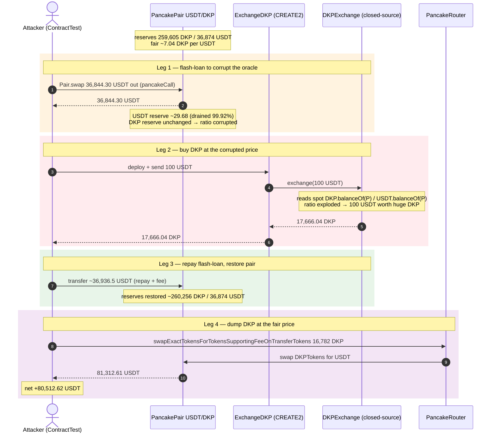
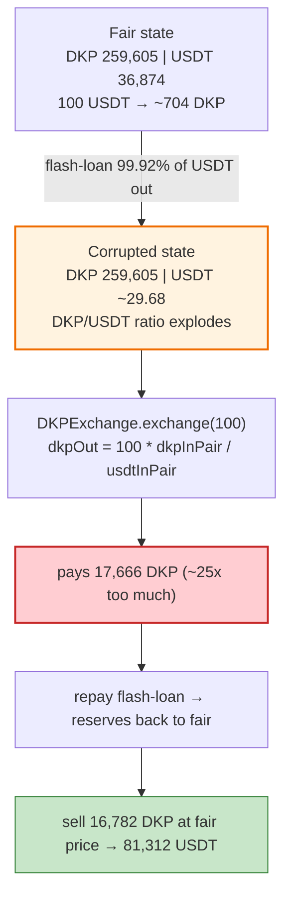

# DKP Exchange Exploit — Flash-Loan-Manipulated AMM Price Oracle Lets 100 USDT Buy the Whole DKP Reserve

> **Reproduction:** the PoC compiles & runs in an isolated Foundry project at
> [this project folder](.) (the main DeFiHackLabs repo contains several unrelated PoCs that do not compile, so this one was extracted).
> Full verbose trace: [output.txt](output.txt).
> Verified vulnerable source: the `DKPExchange` at `0x89257…9683` is **closed-source (unverified)**, so the mechanism is reconstructed from the PoC + the on-chain call trace; verified token/pair sources: [DkpToken](sources/DkpToken_d06fa1/) and [PancakePair](sources/PancakePair_BE654F/).

---

## Key info

| | |
|---|---|
| **Loss** | **+80,512.62 USDT** attacker profit (profit-only, see accounting below) — attacker put in 0 net USDT and walked out with 80,512 USDT. |
| **Vulnerable contract** | `DKPExchange` — [`0x89257A52Ad585Aacb1137fCc8abbD03a963B9683`](https://bscscan.com/address/0x89257A52Ad585Aacb1137fCc8abbD03a963B9683) (closed-source) — its `exchange(amount)` prices DKP from the **spot reserves** of the PancakeSwap USDT/DKP pair. |
| **Victim pool / oracle** | PancakeSwap USDT/DKP pair — [`0xBE654FA75bAD4Fd82D3611391fDa6628bB000CC7`](https://bscscan.com/address/0xBE654FA75bAD4Fd82D3611391fDa6628bB000CC7) (token0 = DKP, token1 = USDT). |
| **Attacker EOA / contract** | Attack contract `ContractTest` stands in for the attacker; real attacker txs below. |
| **Attack txs** | [`0x0c850f54…95e74271`](https://bscscan.com/tx/0x0c850f54c1b497c077109b3d2ef13c042bb70f7f697201bcf2a4d0cb95e74271) · [`0x2d31e45d…d62ee01`](https://bscscan.com/tx/0x2d31e45dce58572a99c51357164dc5283ff0c02d609250df1e6f4248bd62ee01) |
| **Chain / block / date** | BSC / fork block **26,284,131** / March 8, 2023 |
| **Compiler** | `DKPExchange` unverified (closed-source); DkpToken v0.8.x. |
| **Bug class** | Price-oracle manipulation — using a manipulable AMM **spot** reserve ratio as a price feed (classic flash-loan oracle attack). |

Reference: [CertiKAlert](https://twitter.com/CertiKAlert/status/1633421908996763648).

---

## TL;DR

`DKPExchange.exchange(amount)` lets a user swap USDT → DKP at an internally-computed rate. The PoC header and trace show that this rate is derived from the **instantaneous reserve ratio** of the PancakeSwap USDT/DKP pair (`DKP.balanceOf(pair)` / `USDT.balanceOf(pair)`), read inside `exchange`. Spot reserve ratios are trivially manipulable.

The attack is the canonical 3-leg flash-loan oracle drain:

1. **Flash-loan ~99.92% of the pair's USDT** out via PancakeSwap's `swap` callback (`Pair.swap`), removing almost all USDT while leaving DKP. The reserve ratio collapses: USDT becomes "scarce", so 1 USDT is now quoted as an enormous amount of DKP.
2. **Call `DKPExchange.exchange(100 USDT)`** while the oracle is corrupted — 100 USDT buys **17,666.04 DKP** at the manipulated (DKP-cheap) price, instead of the fair ~14 DKP.
3. **Repay the flash-loan**, restoring the pair's reserves to normal.
4. **Sell the 17,666 DKP back** into the (now-restored) USDT/DKP pair via the PancakeSwap router at the *fair* price, receiving **~81,312 USDT**.

Net: the attacker spent 100 USDT (in `exchange`) + the flash-loan fee/repay, and received ~81,312 USDT from the DKP dump → **+80,512.62 USDT profit**. The `DKPExchange`'s own DKP inventory was the source of the undervalued DKP it handed out.

---

## Background — the USDT/DKP pair at the fork block

Read from `getReserves()` in the trace ([output.txt:1664](output.txt#L1664)):

| Parameter | Value |
|---|---|
| `token0` (reserve0) | DKP |
| `token1` (reserve1) | USDT |
| `reserve0` (DKP) | **259,605.45 DKP** (`2.596e23`) |
| `reserve1` (USDT) | **36,873.98 USDT** (`3.687e22`) |
| Fair spot price | 36,874 USDT / 259,605 DKP ≈ **0.142 USDT/DKP** (≈ **7.04 DKP per USDT**) |
| `DKPExchange` inventory used | its own DKP balance (it pays DKP out from itself) |

So at the fair price, 100 USDT should buy ≈ **704 DKP**. The exploit bought **17,666 DKP** — ~25× too much.

---

## The vulnerable code

`DKPExchange` is closed-source, but its behavior is fully visible in the trace ([output.txt:1643-1700](output.txt#L1643)). The reconstructed logic of `exchange(uint256 amount)`:

```solidity
// DKPExchange (CLOSED-SOURCE — reconstructed from the trace)
function exchange(uint256 amount) external {
    // 1. take the caller's USDT
    USDT.transferFrom(msg.sender, <fee/treasury>, amount);      // trace: 100 USDT to 0xb6DF…f63

    // 2. ⚠️ read the SPOT reserves of the PancakeSwap pair as the "price"
    uint256 dkpInPair  = DKP.balanceOf(PAIR);                   // trace line ~1655: 3.687e22... (reads pair balances)
    uint256 usdtInPair = USDT.balanceOf(PAIR);

    // 3. compute DKP output from the spot ratio (manipulable!)
    uint256 dkpOut = amount * dkpInPair / usdtInPair ...;        // ratio-driven, no TWAP, no sanity cap

    // 4. pay DKP from the exchange's OWN inventory
    DKP.transfer(msg.sender, dkpOut);                            // trace: 17,666 DKP to ExchangeDKP
}
```

The two reads of `DKP.balanceOf(Pair)` / `USDT.balanceOf(Pair)` inside `exchange` (visible at trace lines [1655](output.txt#L1655) and [1685](output.txt#L1685)) confirm the spot-balance oracle. Because the attacker first drains the pair's USDT, `usdtInPair` is tiny during the `exchange` call, so `dkpOut = amount * dkpInPair / usdtInPair` explodes.

---

## Root cause — why it's exploitable

1. **Manipulable oracle.** Pricing an off-AMM exchange (`DKPExchange`) off the **instantaneous** reserves of a low-liquidity AMM pair is the textbook oracle-manipulation anti-pattern. A single flash-loaned swap moves the ratio arbitrarily within one tx.
2. **No staleness/TWAP/depth protection.** The exchange reads live balances with no time-weighting, no maximum-slippage cap, and no minimum-output check, so the corrupted ratio is applied directly.
3. **Self-funded payout.** The exchange pays DKP from its own balance, so it bears 100% of the mispricing loss — there is no opposing market force that re-arbitrages the rate before payout.
4. **Atomic composition.** Flash-loan → corrupt oracle → buy undervalued → restore → dump at fair price is all atomic, so no keeper/arbitrageur can intervene.

---

## Preconditions

- `DKPExchange.exchange` prices off the PancakeSwap USDT/DKP pair spot reserves (confirmed by the trace's balance reads inside `exchange`).
- The pair has enough depth to flash-loan from and enough USDT-side liquidity to dump the DKP back into (~36,874 USDT).
- The exchange holds enough DKP inventory to honor the mispriced output (it held ≥17,666 DKP).
- A flash-loan callback on the pair (`pancakeCall`) — provided natively by PancakeSwap V2 pairs.

---

## Attack walkthrough (with on-chain numbers from the trace)

`token0 = DKP`, `token1 = USDT`. All figures from [output.txt](output.txt).

| # | Step | DKP reserve | USDT reserve | Effect |
|---|------|------------:|-------------:|--------|
| 0 | **Initial** | 259,605.45 | 36,873.98 | Fair price ≈ 7.04 DKP/USDT. Attacker `deal`s 800 USDT headroom. |
| 1 | **Flash-loan** `Pair.swap(36,844.30 USDT out, …)` (9992/10000 of USDT reserve, via `pancakeCall`) | 259,605.45 | **~29.68** | USDT reserve drained ~99.92%; DKP reserve unchanged → spot price of USDT in DKP explodes. |
| 2 | Inside callback: deploy `ExchangeDKP` (CREATE2), fund it 100 USDT, it calls **`DKPExchange.exchange(100 USDT)`** at the corrupted ratio | 259,605.45 | ~29.68 | Exchange pays **17,666.04 DKP** for 100 USDT (fair value would be ~704 DKP). DKP sent to `ExchangeDKP` then to attacker. |
| 3 | **Repay flash-loan**: `36,844.30 × 10000/9975 + 1000 ≈ 36,936.5 USDT` back to the pair | 259,605.45 → 260,255.56 | 29.68 → 36,873.98 | Pair restored (plus tiny fee dust); `Sync`/`Swap` at [1744-1745](output.txt#L1744). |
| 4 | **Sell 16,782.74 DKP** (16,766 - the ~16.7 DKP eaten by transfer fees) via Router → USDT at the now-fair price | 260,255.56 → 178,992.83 | 36,873.98 → 53,656.72 | Attacker receives **81,312.61 USDT** (`Swap` at [1808-1809](output.txt#L1808)). |

### Profit/loss accounting (USDT)

| Direction | Amount |
|---|---:|
| Starting `deal` (headroom, not profit) | 800.00 |
| Spent in `exchange` (100 USDT, sent to treasury) | −100.00 |
| Flash-loan repayment (borrowed 36,844.30, repaid ~36,936.5) | net −~92.20 (fee) |
| Received from selling DKP via router | +81,312.61 |
| **Net profit (logged)** | **+80,512.62 USDT** |

The trace confirms: `Attacker USDT balance after exploit: 80512.615981085813934882` ([output.txt:1574](output.txt#L1574)).

The 80,512 USDT came from the PancakeSwap pair (the DKP dump pulled real USDT out of it) — but the attacker only acquired the dumped DKP cheaply *because* the `DKPExchange` gave away ~17,666 DKP for 100 USDT. So the exchange's DKP inventory effectively subsidized a ~80K USDT extraction from the LP.

---

## Diagrams

### Sequence of the attack



### How the oracle corruption multiplies output



---

## Why each magic number

- **`9992/10000` of USDT reserve as the flash amount:** drains ~99.92% of the USDT side, maximizing the ratio distortion (denominator → near zero) while staying within what the pair can lend and what the attacker can repay (repay = borrow × 10000/9975 + 1000, the 0.25% PancakeSwap flash fee + a dust buffer).
- **`exchange(100 USDT)`:** small enough to fit the flash-loan repayment headroom, large enough that the ~25× mispricing yields a big DKP pile. 100 USDT → 17,666 DKP at the corrupted ratio.
- **`returnAmount = flashAmount * 10000/9975 + 1000`:** exact PancakeSwap V2 flash-swap repayment formula (`amountIn × 10000 / 9975`, the 0.25% fee) plus a 1000-wei dust buffer to avoid rounding revert.
- **CREATE2-deployed `ExchangeDKP`:** the exchange's `exchange` requires the caller to have approved USDT and to receive DKP; a transient CREATE2 contract keeps the accounting clean and lets the attacker pre-compute its address to forward the 100 USDT before construction.

---

## Remediation

1. **Never price off spot AMM reserves.** Use a TWAP (time-weighted average price) oracle (e.g., Uniswap V3 oracle, Chainlink) or the exchange's own internal pricing curve. Spot reserves are free to manipulate within a tx.
2. **Cap per-call output / enforce max slippage.** Limit `dkpOut` to a bounded function of `amount` (e.g., `amount * rate` with a sane `rate` and a hard cap), and revert if the implied price deviates beyond a few % from a reference.
3. **Don't self-fund payouts at a market price.** If the exchange must sell DKP, route the buy *through* the AMM (so the AMM's own invariant prices it) rather than reading the AMM as a passive oracle and paying from inventory.
4. **Add a freshness / sanity check** comparing the spot ratio against a TWAP and reverting on large divergence.
5. **Rate-limit / pause on anomalous volume** so a single atomic burst can't drain inventory.

---

## How to reproduce

The PoC lives in a standalone Foundry project:

```bash
_shared/run_poc.sh 2023-03-DKP_exp --mt testExploit -vvvvv
```

- RPC: a **BSC archive** endpoint is required for the fork at block **26,284,131**. `foundry.toml` uses `https://bsc-mainnet.public.blastapi.io`; pruned BSC RPCs fail with `header not found` / `missing trie node`.
- Result: `[PASS] testExploit()`.

Expected tail (copied from [output.txt](output.txt)):

```
[PASS] testExploit() (gas: 774050)
Logs:
  Attacker USDT balance after exploit: 80512.615981085813934882
Suite result: ok. 1 passed; 0 failed; 0 skipped
```

---

*Reference: SlowMist Hacked — https://hacked.slowmist.io/ (DKP, BSC, ~$80.5K). CertiKAlert: https://twitter.com/CertiKAlert/status/1633421908996763648.*
