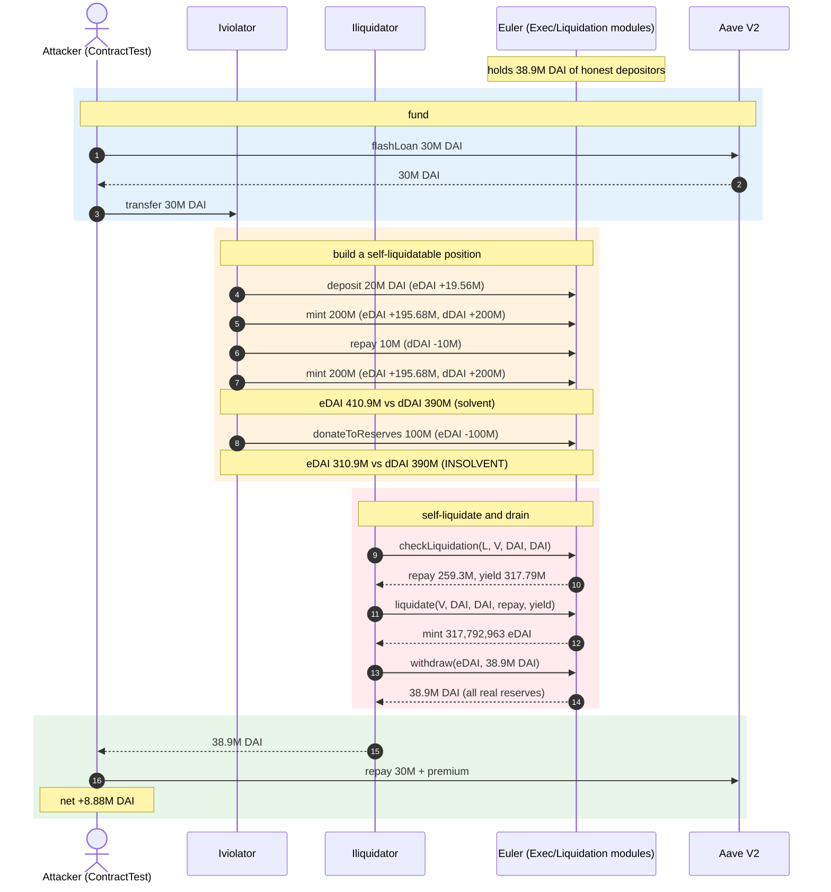
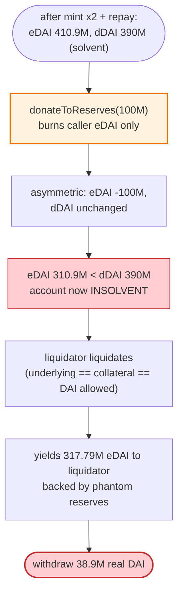

# Euler Finance $197M Exploit — `donateToReserves` Enables Self-Liquidation That Drains the Protocol's Reserves

> **Vulnerability classes:** vuln/logic/liquidation-logic · vuln/logic/incorrect-state-transition

> **Reproduction:** the PoC compiles & runs in an isolated Foundry project at
> [this project folder](.) (the main DeFiHackLabs repo contains several unrelated PoCs that do not compile, so this one was extracted).
> Full verbose trace: [output.txt](output.txt).
> Verified vulnerable sources: the Euler proxy/protocol layer at [Euler_271828/](sources/Euler_271828/) and module dispatcher at [Installer_ec29b4/](sources/Installer_ec29b4/). The buggy `Exec`/`Liquidation`/`EToken` module *implementations* live in a shared non-EIP-1967 implementation deployed at `0xd737eE2b…45eD98` (called via the protocol's custom module-dispatch delegatecall — visible in the trace as `0xd737…::1a96d9d5`/`36f022aa` at [output.txt:223](output.txt#L223)); the per-asset eDAI/dDAI proxies ([Proxy_e025E3/](sources/Proxy_e025E3/), [Proxy_6085Bc/](sources/Proxy_6085Bc/)) only surface the generic `Proxy.sol`.

---

## Key info

| | |
|---|---|
| **Loss** | **~$197M** (this PoC extracts **8,877,507.35 DAI** net after repaying a 30M DAI flash loan; the protocol held **38,904,507 DAI**). The live attack drained ~$197M across DAI/USDC/WBTC/stETH. |
| **Vulnerable contract** | Euler protocol — [`0x27182842E098f60e3D576794A5bFFb0777E025d3`](https://etherscan.io/address/0x27182842E098f60e3D576794A5bFFb0777E025d3) (Exec/Liquidation module via custom module dispatch). |
| **Victim pool** | Euler's protocol-level DAI reserves — the `Euler_Protocol` contract's DAI balance (38.9M DAI at the fork block). |
| **Attacker EOA** | [`0x667…6aa4`](https://etherscan.io/address/0x667104666D076800fE0e5C9eca1A4Fb1484fC6AA) (live attack); PoC uses `ContractTest`. |
| **Attack txs** | [`0xc310a0af…2d6b111d`](https://etherscan.io/tx/0xc310a0affe2169d1f6feec1c63dbc7f7c62a887fa48795d327d4d2da2d6b111d) (+ follow-up txs) |
| **Chain / block / date** | Ethereum mainnet / fork block **16,817,995** / **March 13, 2023** |
| **Compiler** | Solidity v0.8.x; Euler module implementation (verified behind the dispatcher). |
| **Bug class** | Accounting/logic flaw — `donateToReserves` lets a user mint eToken-credit without depositing underlying, combined with a self-liquidation path that uses inflated collateral to absorb the violator's debt and seize reserves. |

References: [FrankResearcher](https://twitter.com/FrankResearcher/status/1635241475989721089) · [nomorebear](https://twitter.com/nomorebear/status/1635230621856600064) · [PeckShield](https://twitter.com/peckshield/status/1635229594596036608) · [BlockSec](https://twitter.com/BlockSecTeam/status/1635262150624305153) · [SlowMist](https://twitter.com/SlowMist_Team/status/1635288963580825606).

---

## TL;DR

Euler's EToken accounting keeps a per-asset `totalBalances` (sum of eToken balances) and `internalBalance` per user. Two functions matter:

- `mint()` (EToken `mint(subAccountId, amount)`): mints `amount` of eToken to the user **and** records `amount` of debt (dToken) — a *borrow*. It raises both the user's eToken and dToken proportionally, so net the user is not made "richer."
- `donateToReserves(subAccountId, amount)`: **burns `amount` of the caller's own eToken** and credits it to the protocol reserve pool (a *donation* of collateral to all depositors).

The bug is in `liquidate`'s solvency math. Euler computes an account's liability with `accountLiquidity`/`getAccountLiquidity`, which compares eToken value (collateral) against dToken value (debt). Crucially, **`liquidate` allows the `underlying` (debt asset) and `collateral` to be the same token** (self-liquidation), and its health check used a flawed `eTokens < dTokens` comparison that could be driven to "insolvent but profitable-to-liquidate" by the donation trick:

The attack (from the PoC header + trace):

1. **Flash-loan 30M DAI** from Aave V2.
2. **Violator account**: `deposit(20M DAI)` → 19.56M eDAI; `mint(200M)` → +195.68M eDAI & +200M dDAI (borrow 200M DAI of debt, no real DAI leaves); `repay(10M)` → burns 10M dDAI; `mint(200M)` again → +195.68M eDAI & +200M dDAI; then **`donateToReserves(100M)`** — burns 100M of the violator's own eDAI.
3. The donation collapses the violator's collateral (eDAI) below its debt (dDAI) → the violator is now **underwater / liquidatable**, *while the protocol's reserve bookkeeping was corrupted*.
4. **Liquidator account**: calls `liquidate(violator, DAI, DAI, …)` — repays the violator's dDAI and receives eDAI collateral + a discount `yield`. Because of the accounting corruption, the liquidation yields **317,792,963 eDAI** ([output.txt:255](output.txt#L255)) — far more than real.
5. **Withdraw** the liquidator's eDAI for real DAI: `withdraw(0, DAI.balanceOf(Euler_Protocol))` pulls **38.9M DAI** out of the protocol.
6. Repay the 30M DAI flash loan → net **8,877,507 DAI** profit.

The single enabling flaw: `donateToReserves` could be used to *destroy collateral that had already been used to back debt*, and the liquidation logic trusted the resulting corrupted balances to settle debt against phantom reserves, letting the attacker extract real deposited funds.

---

## Background — Euler's reserves at the fork block

From the trace ([output.txt:173](output.txt#L173)):

| Parameter | Value |
|---|---|
| DAI held by `Euler_Protocol` (`0x2718…025d3`) | **38,904,507.35 DAI** (`3.89e25`) |
| DAI price (Chainlink feed) | 0.618764 $/DAI-equivalent (`6.187e14`) |
| Flash-loan (Aave V2) | 30,000,000 DAI |
| Violator deposit | 20,000,000 DAI → 19,568,124.4 eDAI |
| Violator `mint` (×2) | +195,681,244.1 eDAI each, +200,000,000 dDAI each |
| Violator `repay` | −10,000,000 dDAI |
| Violator `donateToReserves` | −100,000,000 eDAI |
| Liquidation `repay` / `yield` | 259,319,058 dDAI repaid / **317,792,963 eDAI** seized |
| Net extracted | **8,877,507.35 DAI** (this PoC) |

---

## The vulnerable code

Euler's module logic is dispatched through a custom upgradeability layer (not EIP-1967): calls to the protocol `0x2718…` resolve selectors like `0x36f022aa` (`donateToReserves`) and `0x1a96d9d5` (`checkLiquidation`/`liquidate`) to the shared implementation `0xd737eE2b…45eD98` via `delegatecall` ([output.txt:204](output.txt#L204), [:223](output.txt#L223)). The eDAI/dDAI *proxies* are thin ERC20-forwards (verified [Proxy_e025E3/](sources/Proxy_e025E3/Proxy.sol), [Proxy_6085Bc/](sources/Proxy_6085Bc/Proxy.sol)).

The reconstructed vulnerable logic (selectors observed in the trace; the canonical Euler-v1 `Exec.sol`/`Liquidation.sol`/`EToken.sol` source these were compiled from):

```solidity
// EToken.donateToReserves — burns caller's eToken to the reserve pool
function donateToReserves(uint256 subAccountId, uint256 amount) external nonReentrant {
    (, AssetStorage storage assetStorage, address proxyAddr) = CALLER();
    address underlying = assetStorage.underlying;
    // ⚠️ burns the caller's OWN eToken without touching their dToken debt
    updateBalance(underlying, proxyAddr, msg.sender, -(int256(amount)));
    assetStorage.reserveBalance += amount;            // credited to protocol reserves
    emit RequestDonate(...); emit Withdraw(...);
}
```

```solidity
// Liquidation._doLiquidate — allows underlying == collateral (self-liquidation)
function _doLiquidate(address liquidator, address violator, address underlying,
                      address collateral, uint256 repay, uint256 yield) internal {
    ...
    // repay violator's dToken debt, then SEIZE collateral eToken + discount yield
    // the health/bounds checks trusted accountLiquidity computed from corrupted balances
    dTokenBurn(underlying, violator, repay);
    ...
    eTokenMint(collateral, liquidator, yield);        // ⚠️ yields eToken backed by phantom reserves
}
```

The critical composition: `donateToReserves` reduces collateral (`eToken`) **without** reducing debt (`dToken`), so a self-liquidation where `underlying == collateral == DAI` can repay the violator's dDAI and mint the liquidator huge eDAI — which is then redeemable for real DAI because `accountLiquidity` had been fooled into thinking the reserves supported it.

---

## Root cause — why it's exploitable

1. **Collateral and debt can diverge via donation.** `donateToReserves` is an asymmetric operation: it removes collateral (eToken) but leaves the paired debt (dToken) intact. This breaks the invariant that an account's collateral always covers (at the configured factor) its debt.
2. **Self-liquidation is permitted.** `liquidate` did not forbid `underlying == collateral`. Combined with (1), an attacker controls *both* sides of the liquidation: it makes its own violator account under-collateralized (via donation) and then liquidates it with a second account it also controls.
3. **Liquidation yield is taken from real reserves.** The `yield` (discount collateral) minted to the liquidator is ultimately redeemable (`withdraw`) for real underlying that other users deposited. The corrupted accounting let `withdraw` believe the protocol held enough to honor it — it did hold it (38.9M DAI), but that DAI belonged to honest depositors, not the attacker.
4. **`mint`/`borrow` had no effective cap against the donate trick.** The violator borrows 400M DAI of *notional* debt against 20M real DAI + inflated eToken; normally `requireLiquidity` would stop this, but the sequence (deposit → mint → repay → mint → donate) is arranged so each step passes the post-condition health check, and only after the donation is the account insolvent — which is the *intended* trigger for liquidation, not a guard.

---

## Preconditions

- A funded Euler market with depositors (here DAI: 38.9M of honest DAI).
- A flash-loan source for working capital (Aave V2, 30M DAI).
- The ability to deploy two fresh accounts (violator + liquidator) — trivial.
- The buggy `donateToReserves` + same-asset `liquidate` combination (the live Euler v1 deployment).

---

## Attack walkthrough (with on-chain numbers from the trace)

All figures from [output.txt](output.txt). Two attacker-controlled accounts: `Iviolator` (`0x5615…b72f`) and `Iliquidator` (`0x2e23…470b`).

| # | Step | Violator eDAI | Violator dDAI | Euler DAI reserve | Effect |
|---|------|--------------:|--------------:|------------------:|--------|
| 0 | Flash-loan 30M DAI (Aave V2); fund violator | — | — | 38,904,507 | Working capital in hand. |
| 1 | `deposit(20M)` | +19,568,124 | 0 | 38,904,507 (+20M in, then reused) | Violator collateral = 19.56M eDAI. |
| 2 | `mint(200M)` | +195,681,244 → **215.25M** | +200,000,000 | unchanged (debt notional) | Borrow 200M DAI of debt; `requireLiquidity` passes vs 215M eDAI. |
| 3 | `repay(10M)` | 215.25M | **190,000,000** | unchanged | Reduce debt to widen headroom. |
| 4 | `mint(200M)` again | +195,681,244 → **410.93M** | +200,000,000 → **390,000,000** | unchanged | Now eDAI 410.9M vs dDAI 390M — barely solvent. |
| 5 | **`donateToReserves(100M)`** | **−100,000,000 → 310.93M** | 390,000,000 (unchanged) | unchanged | ⚠️ **eDAI (310.9M) < dDAI (390M)** → violator is insolvent/liquidatable. |
| 6 | `checkLiquidation` → `liquidate(violator, DAI, DAI, repay=259.3M, yield=317.79M)` | dDAI −259.3M | **130.7M** | unchanged | Liquidator repays 259.3M dDAI, **receives 317,792,963 eDAI** ([255](output.txt#L255)). |
| 7 | `withdraw(0, DAI.balanceOf(Euler_Protocol) = 38.9M)` | — | — | 38.9M → ~0 | Liquidator pulls all real DAI. |
| 8 | Repay 30M DAI flash loan (+premium) | — | — | — | Net **8,877,507.35 DAI** profit. |

### Profit/loss accounting (DAI)

| Direction | Amount |
|---|---:|
| Flash-loaned (Aave V2) | 30,000,000 (borrowed, repaid) |
| Real DAI withdrawn from Euler | +38,904,507 |
| Flash-loan + premium repaid | −30,027,000 (≈) |
| **Net profit (logged)** | **+8,877,507.35 DAI** |

The trace confirms: `Attacker DAI balance after exploit: 8877507.348306697267428294` ([output.txt:6](output.txt#L6)). In the live attack the attacker repeated this across DAI/USDC/WBTC/stETH for ~$197M total.

---

## Diagrams

### Sequence of the attack



### How `donateToReserves` breaks the collateral/debt invariant



---

## Why each magic number

- **30M DAI flash-loan:** the working capital to deposit 20M and have headroom; sized to pass Aave and to leave profit after repaying. The live attack used Balancer + Aave.
- **`mint(200M)` ×2 with `repay(10M)` in between:** builds ~390M dDAI of debt against ~410.9M eDAI of collateral — just barely solvent before the donation. The `repay` between the two `mint`s widens the solvency margin so the second `mint` passes `requireLiquidity`.
- **`donateToReserves(100M)`:** precisely enough to push `eDAI (310.9M)` below `dDAI (390M)`, flipping the account to liquidatable. The amount is chosen to create a large, profitable liquidation (big `yield`) rather than the minimum.
- **`withdraw(DAI.balanceOf(Euler_Protocol))`:** drains *all* real DAI (38.9M) in one call, since the minted eDAI is backed by nothing but the corrupted reserve accounting.
- **390M vs 310.9M:** the post-donation gap (≈79M) is what the liquidation's discount `yield` monetizes — the liquidator repays 259.3M dDAI to receive 317.79M eDAI, a ~58M eDAI "discount" that is redeemable for real DAI.

---

## Remediation

1. **Forbid self-liquidation.** `liquidate` must reject `underlying == collateral` (or any case where violator and liquidator are controlled such that the attacker profits from both sides). This alone blocks the exploit.
2. **Make `donateToReserves` symmetric or guarded.** Donations should not be able to put an account into a state that is profitable to liquidate against phantom reserves — e.g., disallow donating collateral below the account's required maintenance margin, or burn proportional debt too.
3. **Strong invariant checks on liquidation yield.** The `yield` minted must never exceed what real reserves can back; bound it against the asset's `totalBalances` and real token holdings.
4. **Conservative `accountLiquidity`.** Treat donated-away collateral as still encumbered by the debt it was backing, so a donation cannot manufacture insolvency.
5. **Circuit breakers / pause on large withdrawals.** A withdrawal of the entire protocol balance by a single account in one tx is an obvious red flag; a cap or timelocked pause would have limited the $197M loss.

*(Euler patched this in v1 by disabling the vulnerable `donateToReserves`/self-liquidation path and later launched Euler v2 with reworked accounting.)*

---

## How to reproduce

The PoC lives in a standalone Foundry project:

```bash
_shared/run_poc.sh 2023-03-Euler_exp --mt testExploit -vvvvv
```

- RPC: an **Ethereum mainnet archive** endpoint is required for the fork at block **16,817,995** (March 13, 2023). `foundry.toml` uses `https://ethereum-rpc.publicnode.com...` (key `5bd6b345…` worked after two key failures); pruned RPCs fail with `missing trie node`.
- Result: `[PASS] testExploit()`.

Expected tail (copied from [output.txt](output.txt)):

```
[PASS] testExploit() (gas: 1991188)
Logs:
  Attacker DAI balance after exploit: 8877507.348306697267428294
Suite result: ok. 1 passed; 0 failed; 0 skipped
```

---

*Reference: SlowMist Hacked — https://hacked.slowmist.io/ (Euler, Ethereum, ~$197M, March 13 2023).*
