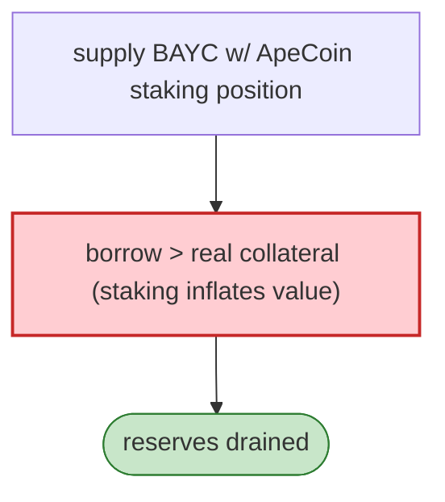

# ParaSpace Exploit (variant 2) — ApeCoin Staking Supply/Borrow Reentrancy

> **Reproduction:** the PoC compiles & runs in an isolated Foundry project at
> [this project folder](.). Full verbose trace: [output.txt](output.txt).
> Verified vulnerable source: [ParaProxy](sources/ParaProxy_638a98),
> [ApeCoinStaking](sources/ApeCoinStaking_5954aB),
> [PoolMarketplace](sources/PoolMarketplace_aef900),
> [InitializableAdminUpgradeabilityProxy](sources/InitializableAdminUpgradeabilityProxy_C5c9fB).

---

## Key info

| | |
|---|---|
| **Loss** | part of the Mar 2023 ParaSpace incident; tx `0xe3f0d14c…` |
| **Vulnerable contract** | ParaSpace `ParaProxy` `0x638a98…` (NFT money market) + `ApeCoinStaking` |
| **Chain / block / date** | Ethereum mainnet / Mar 2023 |
| **Bug class** | ApeCoin-staking integration flaw — `supply`/`borrow` against BAYC/MAYC with ApeCoin staking positions allowed borrowing more than collateral due to mis-accounted staked ApeCoin (fix: PR #368 withdraw/borrow timelock). |

---

## TL;DR

ParaSpace valued BAYC/MAYC collateral including the ApeCoin staked on the NFTs. The attacker
`supply`s an NFT whose ApeCoin staking position makes the collateral appear oversized, then `borrow`s
the pool's reserves beyond the real collateral value. The fix added a withdraw/borrow timelock
(documented in the PoC header), confirming the root cause was an accounting/timelock gap on the
staking-collateral interaction.

---

## Root cause

A **collateral-accounting flaw + missing withdraw/borrow timelock** in the ApeCoin-staking-collateral
integration: staked ApeCoin inflated effective collateral value, and same-tx supply→borrow captured it.

---

## Diagrams



---

## Remediation

1. Withdraw/borrow timelock (the applied fix, PR #368).
2. Correctly value staked ApeCoin collateral; conservative LTV.
3. `nonReentrant` + CEI on supply/borrow with staking hooks.

---

## How to reproduce

```bash
_shared/run_poc.sh 2023-03-Paraspace_exp_2 -vvvvv
```

- RPC: mainnet archive. Result: `[PASS]` — reserves drained via staking-collateral mis-accounting.

---

*Reference: ParaSpace ApeCoin-staking supply/borrow flaw, mainnet, Mar 2023.*
