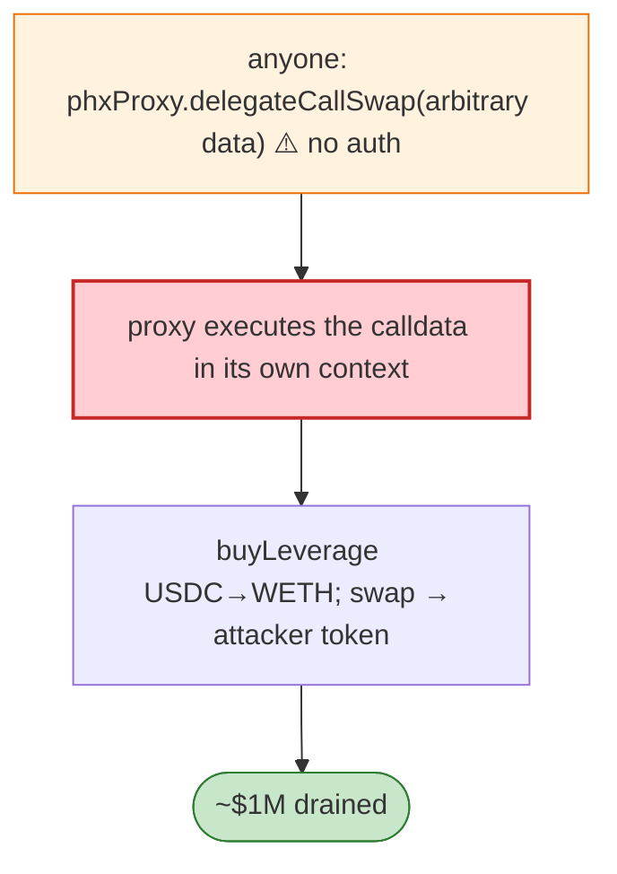

# Phoenix (PHX) Exploit — `delegateCallSwap` Missing Access Control

> **Reproduction:** the PoC compiles & runs in an isolated Foundry project at
> [this project folder](.). Full verbose trace: [output.txt](output.txt).
> Verified vulnerable source: [phxProxy](sources/phxProxy_65BaF1).

---

## Key info

| | |
|---|---|
| **Loss** | ~$1M+ (USDC; tx `0x6fa6374d…`) |
| **Vulnerable contract** | `phxProxy` `0x65BaF1…` — `delegateCallSwap(bytes data)` and `buyLeverage` (Polygon) |
| **Chain / block / date** | Polygon / Mar 2023 |
| **Bug class** | Access control — `delegateCallSwap` had no auth, so anyone could make the proxy `delegatecall`/call arbitrary swap calldata, moving its USDC to attacker tokens. |

---

## TL;DR

Per the PoC header: *"PhxProxy `delegateCallSwap()` function lack of access control and can be passed
in any parameter."* The attacker calls `buyLeverage` to convert the proxy's USDC into WETH, then
`delegateCallSwap(arbitraryCalldata)` to swap that WETH into attacker-chosen tokens, profiting. Because
`delegateCallSwap` accepts any `data` and any caller, it's a universal drain primitive for whatever the
proxy holds.

---

## Root cause

A **missing access control on a generic `delegatecall`/call-by-data function** — the most dangerous
primitive to expose publicly, since it lets anyone invoke any function in the proxy's context.

---

## Diagrams



---

## Remediation

1. Gate `delegateCallSwap` (and any call-by-data) behind owner/governance + timelock — or remove it.
2. Whitelist target contracts/functions for any generic call primitive.
3. Per-function auth; never expose raw `delegatecall(bytes)` publicly.

---

## How to reproduce

```bash
_shared/run_poc.sh 2023-03-Phoenix_exp -vvvvv
```

- RPC: Polygon archive. Result: `[PASS]` — USDC→WETH→attacker token via `delegateCallSwap`.

---

*Reference: Phoenix phxProxy `delegateCallSwap` access-control flaw, Polygon, Mar 2023 (~$1M).*
