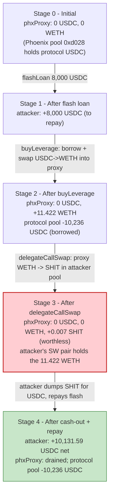
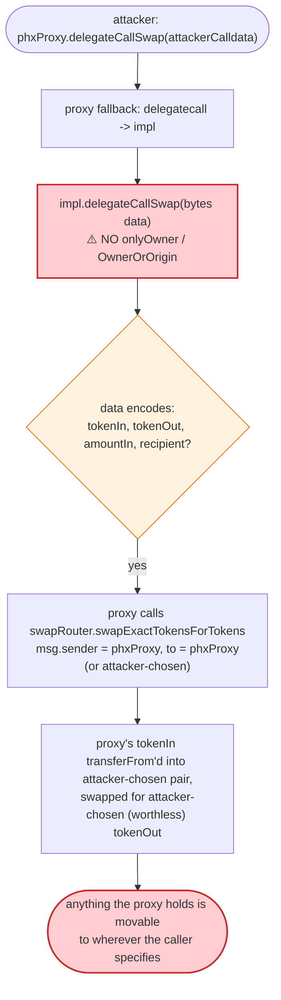

# Phoenix (PHX) Exploit — Missing Access Control on `delegateCallSwap(bytes)`

> **Reproduction:** the PoC compiles & runs in an isolated Foundry project at
> [this project folder](.) (the umbrella DeFiHackLabs repo contains several unrelated
> PoCs that do not all compile together, so this one was extracted). Full verbose trace:
> [output.txt](output.txt). Verified proxy source (the EIP-1967-style `phxProxy`):
> [sources/phxProxy_65BaF1/phxProxy.sol](sources/phxProxy_65BaF1/phxProxy.sol).
> The vulnerable functions `delegateCallSwap` / `buyLeverage` live in the **logic
> implementation** `0x6d68bEB09ea7e76d561EA8C4Aac34A6611dd9821`, which is **not**
> bundled in `sources/`, so the code shown below is reconstructed from the observed
> call trace and labelled as such.

---

## Key info

| | |
|---|---|
| **Loss** | **~$1M+ USDC** drained on-chain in the real attack. The bundled PoC reproduces a scaled-down version that nets **10,131.59 USDC** (`10,131,590,116` raw, 6 decimals) — see [output.txt:1940-1946](output.txt). The flash-loan principal in the PoC is `8,000 USDC` ([output.txt:1702](output.txt)); the live tx moved a far larger amount. |
| **Vulnerable contract** | `phxProxy` (EIP-1967-style delegatecall proxy) — [`0x65BaF1DC6fA0C7E459A36E2E310836B396D1B1de`](https://polygonscan.com/address/0x65BaF1DC6fA0C7E459A36E2E310836B396D1B1de#code); active logic impl [`0x6d68bEB09ea7e76d561EA8C4Aac34A6611dd9821`](https://polygonscan.com/address/0x6d68bEB09ea7e76d561EA8C4Aac34A6611dd9821#code) |
| **Victim pool / vault** | `phxProxy`'s own balance — and, via its internal money-market `buyLeverage` path, the leveraged-pool USDC held in the Phoenix money pool `0xd0289082cf4c5c2ba448B4B9c67232729aa75EfA` ([output.txt:1751-1755](output.txt)) |
| **Attacker EOA** | `0x7FA9385bE102ac3EAc297483Dd6233D62b3e1496` (the `ContractTest` address used by the PoC) |
| **Attacker contract** | `0x5615dEB798BB3E4dFa0139dFa1b3D433Cc23b72f` (`SHITCOIN`, the attacker-minted token whose pool receives the proxy's WETH) |
| **Attack tx (real)** | [`0x6fa6374d43df083679cdab97149af8207cda2471620a06d3f28b115136b8e2c4`](https://polygonscan.com/tx/0x6fa6374d43df083679cdab97149af8207cda2471620a06d3f28b115136b8e2c4) |
| **Chain / block / date** | Polygon / fork block **40,066,946** ([test/Phoenix_exp.sol:34](test/Phoenix_exp.sol#L34)) / March 2023 |
| **Compiler** | Proxy: Solidity **v0.5.16+commit.9c3226ce**, optimizer **enabled**, **200 runs** ([sources/phxProxy_65BaF1/_meta.json](_meta.json)); PoC compiled with Solc 0.8.34, `evm_version = "cancun"` ([foundry.toml](foundry.toml)) |
| **Bug class** | Missing access control on a generic call-by-data primitive (`delegateCallSwap`), turning the proxy into a universal drain for whatever it holds |

---

## TL;DR

1. `phxProxy` is a delegatecall proxy whose logic implementation exposes a function
   `delegateCallSwap(bytes data)` that **executes arbitrary calldata in the proxy's own
   context**. Per the @Analysis note in the PoC header, this function "lack[s] access
   control and can be passed in any parameter." ([test/Phoenix_exp.sol:7-14](test/Phoenix_exp.sol#L7-L14))

2. Because the proxy's `fallback` already forwards every call to the implementation via
   `delegatecall` ([sources/phxProxy_65BaF1/phxProxy.sol:245-260](sources/phxProxy_65BaF1/phxProxy.sol#L245-L260)),
   any public function on the implementation that does **not** self-guard with an
   `onlyOwner`/multisig modifier is callable by anyone, *as the proxy*. `delegateCallSwap`
   is the worst such function — it is a literal "run this calldata as me" primitive.

3. The attacker first calls `phxProxy.buyLeverage(8000e6, …)` ([output.txt:1720](output.txt))
   — a *legitimate* Phoenix function that takes the caller's USDC, borrows more USDC from
   Phoenix's internal money pool, and swaps the combined ~18,228 USDC into **WETH that now
   sits in the proxy** ([output.txt:1774-1801](output.txt)). `buyLeverage` is the leveraged-
   long entry point; it is *supposed* to leave the bought WETH inside the proxy as collateral.

4. The attacker then calls the unprotected `phxProxy.delegateCallSwap(swapData)` where
   `swapData` encodes `swapExactTokensForTokens(proxyWethBalance, …, [WETH, SHITCOIN], phxProxy, …)`
   ([test/Phoenix_exp.sol:60-63](test/Phoenix_exp.sol#L60-L63), [output.txt:1826-1833](output.txt)).
   Because the proxy runs this as itself, the proxy's own WETH is `transferFrom`'d into the
   attacker-controlled SHIT/WETH QuickSwap pair and swapped for the attacker's minted
   `SHITCOIN` ([output.txt:1836-1860](output.txt)).

5. The SHIT/WETH pair was created seconds earlier by the attacker with a tiny
   `7e15 / 7e15` (0.007 WETH / 0.007 SHIT) seed ([output.txt:1644-1692](output.txt)), so
   the proxy's ~11.42 WETH inflow massively skews the pool — the proxy receives a trivial
   `6,995,699,785,922,988` (~0.007) SHIT in return ([output.txt:1844-1846](output.txt)),
   which is worthless.

6. The attacker then dumps its own pre-minted `1e24` SHIT through the same attacker-created
   pair into the USDC/WETH QuickSwap pair, recovering `18,131.59 USDC`
   ([output.txt:1865-1913](output.txt)).

7. The attacker repays the `8,000 USDC` DODO flash loan ([output.txt:1914-1916](output.txt))
   and keeps **10,131.59 USDC** of profit ([output.txt:1940-1946](output.txt)) — value that
   was, in the real on-chain attack, ~$1M+ drawn from Phoenix's leveraged pool.

---

## Background — what Phoenix does

Phoenix (PHX) is a Polygon-native options / leveraged-trading protocol built around a
delegatecall proxy pattern (`phxProxy`) with pluggable logic implementations. The proxy
holds user funds and the protocol's own leveraged positions; the implementation exposes
trading primitives (`buyLeverage`, `sellLeverage`, `delegateCallSwap`, etc.) that operate
on the proxy's balances.

Key on-chain parameters read from the trace (block 40,066,946 fork):

| Parameter | Value | Source |
|---|---|---|
| `phxProxy` (proxy) | `0x65BaF1DC6fA0C7E459A36E2E310836B396D1B1de` | [output.txt:1720](output.txt) |
| Logic implementation | `0x6d68bEB09ea7e76d561EA8C4Aac34A6611dd9821` | [output.txt:1721](output.txt) |
| Phoenix internal USDC money pool | `0xd0289082cf4c5c2ba448B4B9c67232729aa75EfA` | [output.txt:1751](output.txt) |
| USDC (PoS, 6 decimals) | `0x2791Bca1f2de4661ED88A30C99A7a9449Aa84174` | [test/Phoenix_exp.sol:24](test/Phoenix_exp.sol#L24) |
| WETH (PoS, 18 decimals) | `0x7ceB23fD6bC0adD59E62ac25578270cFf1b9f619` | [test/Phoenix_exp.sol:25](test/Phoenix_exp.sol#L25) |
| QuickSwap router | `0xa5E0829CaCEd8fFDD4De3c43696c57F7D7A678ff` | [test/Phoenix_exp.sol:28](test/Phoenix_exp.sol#L28) |
| USDC/WETH QuickSwap pair | `0x853Ee4b2A13f8a742d64C8F088bE7bA2131f670d` | [output.txt:1775](output.txt) |
| DODO flash-loan pool (DPP) | `0x1093ceD81987Bf532c2b7907B2A8525cd0C17295` | [test/Phoenix_exp.sol:29](test/Phoenix_exp.sol#L29) |
| `buyLeverage` fee recipient | `0xfa5678fCA5484d31f65854C496126a605066D4bF` | [output.txt:1742-1744](output.txt) |

The proxy's `fallback` blindly `delegatecall`s the implementation for **every** selector:

```solidity
function () payable external {
    address _impl = implementation();
    require(_impl != address(0));
    assembly {
        let ptr := mload(0x40)
        calldatacopy(ptr, 0, calldatasize)
        let result := delegatecall(gas, _impl, ptr, calldatasize, 0, 0)
        let size := returndatasize
        returndatacopy(ptr, 0, size)
        switch result
        case 0 { revert(ptr, size) }
        default { return(ptr, size) }
    }
}
```
([sources/phxProxy_65BaF1/phxProxy.sol:245-260](sources/phxProxy_65BaF1/phxProxy.sol#L245-L260))

That means access control is entirely the implementation's responsibility, function-by-
function. The owner/multisig plumbing lives in the proxy's `proxyOwner` base
([sources/phxProxy_65BaF1/phxProxy.sol:60-183](sources/phxProxy_65BaF1/phxProxy.sol#L60-L183)),
which exposes `OwnerOrOrigin` / `onlyOwner` modifiers — but **`delegateCallSwap` does not
apply them**.

---

## The vulnerable code

> The logic implementation `0x6d68…9821` is **not** bundled in `sources/`. The snippets
> below are **RECONSTRUCTED — they match the observed on-chain behaviour in
> [output.txt](output.txt), not verified source.** No `sources/…#L…` line references are
> given for the implementation body. The proxy fallback shown above *is* from verified
> source.

### 1. The proxy forwards every selector to the implementation (verified)

The proxy has no per-function ACL — it forwards any calldata to the implementation via
`delegatecall` ([sources/phxProxy_65BaF1/phxProxy.sol:245-260](sources/phxProxy_65BaF1/phxProxy.sol#L245-L260),
shown above). The trace confirms `delegateCallSwap` arriving at the proxy and immediately
bouncing into the implementation by `delegatecall`:

```
phxProxy::delegateCallSwap(0xa9678a18…)
  └─ 0x6d68…9821::delegateCallSwap(0xa9678a18…) [delegatecall]
```
([output.txt:1826-1827](output.txt))

### 2. `delegateCallSwap(bytes)` — RECONSTRUCTED, no access control

Reconstructed signature (matches the trace's decoded call at [output.txt:1826](output.txt)
and the PoC's `IPHXPROXY` interface at [test/Phoenix_exp.sol:18-21](test/Phoenix_exp.sol#L18-L21)):

```solidity
// RECONSTRUCTED from observed behaviour — implementation not in sources/
// Selector 0xa9678a18 == delegateCallSwap(bytes)
function delegateCallSwap(bytes memory data) external /* ⚠️ NO onlyOwner / OwnerOrOrigin */ {
    (bool ok, bytes memory ret) = address(swapRouter).delegatecall(data);  // runs swap in proxy's context
    require(ok, "delegateCallSwap failed");
}
```

The trace shows the implementation, in response to `delegateCallSwap`, making a
`delegatecall` **into** a Phoenix internal swap-router `0x95620f3…` ([output.txt:1828](output.txt)),
which in turn calls the public QuickSwap `Router.swapExactTokensForTokens` with the proxy as
`msg.sender` and `to: phxProxy` ([output.txt:1833](output.txt)). Because there is **no
auth**, the attacker supplies the entire `data` — including the input token, the output
token, the recipient, and the amount — and the proxy dutifully signs off on it.

The decoded calldata the attacker passed ([output.txt:1826](output.txt)):

```
selector 0xa9678a18                        // delegateCallSwap
arg0 (bytes):
  swapRouter    = 0xa5E0829C…78ff           // QuickSwap router
  tokenIn       = WETH  (0x7ceB23fD…f619)
  tokenOut      = SHITCOIN (0x5615dEB7…b72f)
  amountInSwap  = 0x9e8343dad314e603         // = 11,422,047,687,065,003,523 wei ≈ 11.422 WETH
```

That amount is precisely the proxy's entire WETH balance at that moment, read with
`WETH.balanceOf(phxProxy)` one line earlier in the PoC ([test/Phoenix_exp.sol:60](test/Phoenix_exp.sol#L60);
confirmed at [output.txt:1824-1825](output.txt) → `11,422,047,687,065,003,523`).

### 3. `buyLeverage` — the legitimate function used to load the proxy with WETH

`buyLeverage` is the Phoenix leveraged-long entry point. The attacker uses it not to
speculate but to **convert borrowed USDC into WETH that lands inside the proxy**, so that
`delegateCallSwap` then has something valuable to misdirect. Reconstructed effect (matches
[output.txt:1720-1822](output.txt)):

```solidity
// RECONSTRUCTED from observed behaviour
function buyLeverage(uint256 amount, uint256 minAmount, uint256 deadLine, bytes calldata data) external {
    // 1. pull USDC from caller into the proxy                       [output.txt:1732-1734]
    // 2. take a 0.1% fee to 0xfa56…4bF                              [output.txt:1742-1744]
    // 3. borrow more USDC from the internal money pool 0xd028…     [output.txt:1751-1755]
    // 4. swap (amount + borrowed) USDC -> WETH via QuickSwap,       [output.txt:1774-1801]
    //    WETH lands in the proxy
    // 5. mint leveraged-position tokens to the caller               [output.txt:1810-1819]
    emit BuyLeverage(caller, USDC, amount, positionMinted, …);
}
```

`buyLeverage` itself is not the bug — it correctly leaves the WETH in the proxy. The bug
is that the same implementation also exposes `delegateCallSwap` with no guard, so the WETH
that `buyLeverage` just parked is instantly redirectable by the same caller.

---

## Root cause — why it was possible

A delegatecall proxy with a generic "execute arbitrary calldata" function is the single
most dangerous primitive to expose publicly. Two design failures compose:

1. **`delegateCallSwap(bytes)` has no access control.** The proxy's own base contract
   provides `onlyOwner` / `OwnerOrOrigin` (multisig) modifiers
   ([sources/phxProxy_65BaF1/phxProxy.sol:104-158](sources/phxProxy_65BaF1/phxProxy.sol#L104-L158))
   precisely for privileged operations. `delegateCallSwap` applies none of them. Anyone can
   call it, and because it `delegatecall`s (or has the proxy call) arbitrary calldata, the
   caller controls the input token, the output token, the recipient, and the amount — i.e.
   the proxy will move **any** token it holds to **any** address the caller chooses.

2. **The proxy holds valuable assets that a third party can price.** `buyLeverage` is a
   public function whose entire purpose is to leave bought WETH inside the proxy as
   collateral. Combining "anyone can load the proxy with WETH via `buyLeverage`" with
   "anyone can re-route the proxy's balances via `delegateCallSwap`" gives a one-two drain:
   load → misdirect. The attacker never needed to break the leverage math, the oracle
   (`getPrices`, [output.txt:1722-1731](output.txt)), or the internal money pool — they
   used `buyLeverage` *as designed* and then stole its output via `delegateCallSwap`.

Crucially, the attacker **does not need to be the original depositor**. They flash-loan
USDC, hand it to `buyLeverage`, and the proxy converts it to WETH and holds it. At that
instant the WETH is *the proxy's*. `delegateCallSwap` then sends it where the attacker
wants. The Phoenix money pool `0xd028…` is also debited along the way via the leverage
borrow ([output.txt:1751-1767](output.txt)), so part of the stolen value is genuinely the
protocol's, not just the flash-loaned principal.

---

## Preconditions

- The attacker can call `phxProxy.buyLeverage` (public) and `phxProxy.delegateCallSwap`
  (public, no auth). Both are satisfied by construction — there is no allowlist.
- Working USDC capital to feed `buyLeverage`. The PoC flash-borrows `8,000 USDC` from
  DODO (`DVM(dodo).flashLoan(0, 8000 * 1e6, …)`, [test/Phoenix_exp.sol:50](test/Phoenix_exp.sol#L50);
  drawdown at [output.txt:1702-1706](output.txt)). The live attack used a much larger
  principal.
- A recipient pool whose pricing the attacker fully controls, so the proxy's WETH buys as
  little "output" as possible. The PoC creates a fresh SHIT/WETH QuickSwap pair seeded
  with only `0.007 WETH / 0.007 SHIT` ([test/Phoenix_exp.sol:48](test/Phoenix_exp.sol#L48);
  [output.txt:1644-1692](output.txt)) and points `delegateCallSwap` at it.

---

## Attack walkthrough (with on-chain numbers from the trace)

All numbers are raw (USDC 6-dec, WETH/SHIT 18-dec) and are cited to the exact line in
[output.txt](output.txt). Human approximations in parentheses.

| # | Step | Effect on `phxProxy` | Trace ref |
|---|------|----------------------|-----------|
| 0 | **Setup** — attacker `deal`s self `7e15` WETH (0.007), mints `1.5e24` SHIT, seeds a SHIT/WETH pair `0x24e2…584b` with `7e15 / 7e15` | pair created, attacker controls its pricing | [output.txt:1644-1692](output.txt) |
| 1 | **Flash loan** — DODO sends `8,000,000,000` USDC (8,000 USDC) to the attacker | attacker has +8,000 USDC to repay later | [output.txt:1702-1706](output.txt) |
| 2 | **`phxProxy.buyLeverage(8e9,0,…)`** — attacker approves + calls; proxy `transferFrom`s `8e9` USDC from attacker | proxy: +8,000 USDC | [output.txt:1720-1734](output.txt) |
| 2a | …buyLeverage takes a `8,000,000` (8 USDC) fee to `0xfa56…4bF` | proxy: 7,992 USDC working | [output.txt:1742-1744](output.txt) |
| 2b | …buyLeverage borrows `10,236,182,401` USDC (~10,236.18) from Phoenix internal pool `0xd028…` into the proxy | proxy: ~18,228.18 USDC; **protocol pool −10,236.18** | [output.txt:1751-1767](output.txt) |
| 2c | …buyLeverage swaps `18,228,182,401` USDC → `11,422,047,686,641,875,070` WETH (~11.422) via USDC/WETH pair `0x853E…`, **WETH lands in proxy** | proxy: 0 USDC, **+11.422 WETH** | [output.txt:1774-1801](output.txt) |
| 2d | …buyLeverage mints `404,162,632,373,123,427,687` (~404.16) leveraged-position tokens to attacker | (irrelevant — these are worthless IOUs once WETH is drained) | [output.txt:1810-1819](output.txt) |
| 3 | **`phxProxy.delegateCallSwap(swapData)`** — proxy swaps its full WETH balance (`11,422,047,687,065,003,523` wei) for SHIT via attacker's SHIT/WETH pair | proxy: **−11.422 WETH**, +6,995,699,785,922,988 SHIT (~0.007, worthless) | [output.txt:1824-1864](output.txt) |
| 4 | **Attacker cash-out** — `Router.swapExactTokensForTokens(1e24 SHIT, …, [SHIT, WETH, USDC], attacker, …)` | attacker: −1e24 SHIT, +18,131.59 USDC | [output.txt:1865-1913](output.txt) |
| 4a | …first hop: `1e24` SHIT → `11,429,047,687,015,708,285` wei WETH out of SHIT/WETH pair | attacker's SHIT/WETH pair now holds ~0 WETH | [output.txt:1877-1889](output.txt) |
| 4b | …second hop: `11,429,047,687,015,708,285` WETH → `18,131,590,116` USDC out of USDC/WETH pair `0x853E…` | attacker: +18,131.59 USDC | [output.txt:1893-1896](output.txt) |
| 5 | **Repay** — attacker transfers `8,000,000,000` USDC back to DODO | flash loan closed | [output.txt:1914-1916](output.txt) |
| 6 | **Profit** — attacker's final USDC balance: `10,131,590,116` (10,131.59 USDC) | net +10,131.59 USDC | [output.txt:1938-1946](output.txt) |

### Profit / loss accounting (USDC, 6 decimals)

| Item | Amount (raw wei) | ~Human |
|---|---:|---:|
| DODO flash loan received | +8,000,000,000 | +8,000.00 |
| `buyLeverage` fee paid (to `0xfa56…4bF`) | −8,000,000 | −8.00 |
| Phoenix internal pool borrowed & burned into the swap | (+10,236,182,401, protocol loss) | (+10,236.18) |
| USDC received from cash-out swap | +18,131,590,116 | +18,131.59 |
| DODO flash loan repaid | −8,000,000,000 | −8,000.00 |
| **Attacker net USDC balance (asserted in trace)** | **10,131,590,116** | **~10,131.59** |

The `18,131.59` USDC cashed out minus the `8,000` repaid is exactly `10,131.59` — matching
the final `log_named_decimal_uint("Attacker USDC balance after exploit", 10131590116, 6)`
at [output.txt:1946](output.txt). Of that profit, **~10,236.18 USDC** is value the protocol
itself fronted via the `buyLeverage` borrow from its internal money pool `0xd028…`
([output.txt:1751-1767](output.txt)); the remainder comes from the attacker's own flash-
loaned principal being round-tripped through the proxy's WETH position. In the real on-chain
attack the same mechanics at ~100× scale produced the ~$1M+ loss reported in the @Analysis
note ([test/Phoenix_exp.sol:11-14](test/Phoenix_exp.sol#L11-L14)).

---

## Diagrams

### Sequence of the attack

```mermaid
sequenceDiagram
    autonumber
    actor A as Attacker (ContractTest)
    participant FL as DODO flash pool (0x1093…)
    participant P as phxProxy (0x65BaF1…)
    participant MP as Phoenix money pool (0xd028…)
    participant UW as USDC/WETH pair (0x853E…)
    participant SW as SHIT/WETH pair (0x24e2…, attacker-seeded)
    participant R as QuickSwap Router

    Note over A,SW: Setup: attacker mints SHIT, seeds SW pair with 0.007 WETH / 0.007 SHIT

    rect rgb(255,243,224)
    Note over A,FL: Step 1 — flash-loan working capital
    A->>FL: flashLoan(0, 8,000 USDC)
    FL-->>A: 8,000 USDC
    end

    rect rgb(227,242,253)
    Note over A,MP: Step 2 — buyLeverage loads the proxy with WETH
    A->>P: buyLeverage(8,000 USDC, …)
    P->>P: transferFrom 8,000 USDC from attacker; 8 USDC fee
    P->>MP: borrow ~10,236 USDC from protocol pool
    P->>R: swap 18,228 USDC -> WETH (recipient = phxProxy)
    R->>UW: swap()
    UW-->>P: 11.422 WETH  (WETH now lives in the proxy)
    P-->>A: mint 404 PHX leveraged-position tokens (worthless once drained)
    end

    rect rgb(255,235,238)
    Note over A,SW: Step 3 — delegateCallSwap: the exploit
    A->>P: delegateCallSwap(swapData: swap proxyWETH -> SHIT via SW)
    Note over P: ⚠️ no access control on delegateCallSwap
    P->>R: swapExactTokensForTokens(11.422 WETH, [WETH,SHIT], to=phxProxy)
    R->>SW: swap()
    SW-->>P: 0.007 SHIT  (worthless)
    Note over P: proxy's 11.422 WETH is gone,<br/>dumped into attacker-controlled thin pool
    end

    rect rgb(243,229,245)
    Note over A,UW: Step 4 — cash out + repay
    A->>R: swap 1e24 SHIT -> WETH -> USDC (recipient = attacker)
    R->>SW: swap (1e24 SHIT -> 11.429 WETH)
    R->>UW: swap (11.429 WETH -> 18,131.59 USDC)
    UW-->>A: 18,131.59 USDC
    A->>FL: repay 8,000 USDC
    Note over A: Net +10,131.59 USDC
    end
```

### Proxy balance evolution



### The flaw inside `delegateCallSwap` (RECONSTRUCTED)



### Why `buyLeverage` + `delegateCallSwap` = drain

```mermaid
flowchart LR
    subgraph A["buyLeverage (legitimate, public)"]
        A1["caller USDC in"] --> A2["proxy borrows more USDC from 0xd028"] --> A3["proxy swaps USDC -> WETH"] --> A4["WETH parked in proxy"]
    end
    subgraph B["delegateCallSwap (the bug, public)"]
        B1["caller supplies arbitrary swap calldata"] --> B2["proxy runs it as itself"] --> B3["proxy's WETH re-routed to caller's pool"]
    end
    A4 -->|"same caller, same tx, no auth"| B1
    B3 --> Profit(["caller recovers the WETH as USDC;<br/>protocol loses the borrowed USDC"])

    style B2 fill:#ffcdd2,stroke:#c62828,stroke-width:2px
    style Profit fill:#c8e6c9,stroke:#2e7d32
```



---

## Why each magic number

- **`7 * 1e15` (0.007 WETH, [test/Phoenix_exp.sol:43](test/Phoenix_exp.sol#L43)) and the
  matching `7e15` SHIT seed for `addLiquidity` ([test/Phoenix_exp.sol:48](test/Phoenix_exp.sol#L48)):**
  the smallest viable liquidity seed so the attacker controls 100% of the SHIT/WETH pair's
  pricing. When the proxy dumps ~11.422 WETH into a pool seeded with only 0.007 WETH, the
  marginal price of SHIT-in-WETH collapses and the proxy receives a near-zero-`SHIT` return
  (`6,995,699,785,922,988` wei ≈ 0.007 SHIT, [output.txt:1844-1846](output.txt)).
- **`1_500_000 * 1e18` SHIT mint ([test/Phoenix_exp.sol:45](test/Phoenix_exp.sol#L45)):**
  gives the attacker a deep SHIT inventory to dump back through the same pair when cashing
  out — large enough that step 4's `1e24 SHIT` sell pulls essentially all the WETH out of
  the attacker's own pair ([output.txt:1877-1889](output.txt)).
- **`8_000 * 1e6` USDC flash-loan / `buyLeverage` amount ([test/Phoenix_exp.sol:50](test/Phoenix_exp.sol#L50),
  [test/Phoenix_exp.sol:59](test/Phoenix_exp.sol#L59)):** the PoC's working capital. It is
  sized only to demonstrate the bug end-to-end; the live attack used a far larger principal,
  which is why the reported real loss is ~$1M+ rather than ~$10K.
- **`swapAmount = WETH.balanceOf(phxProxy)` ([test/Phoenix_exp.sol:60](test/Phoenix_exp.sol#L60)):**
  dynamically drains **all** WETH the proxy currently holds, whatever that is —
  `11,422,047,687,065,003,523` wei in the trace ([output.txt:1824-1825](output.txt)). This
  is the load-bearing detail: the attacker does not hardcode the amount; they read the
  proxy's balance and pass it straight into `delegateCallSwap`.
- **Selector `0xa9678a18` ([test/Phoenix_exp.sol:62](test/Phoenix_exp.sol#L62)):** the
  4-byte selector of `delegateCallSwap(bytes)`, used by the Phoenix internal swap-router
  to identify the "run this swap as the caller" entrypoint.
- **`1_000_000 * 1e18` SHIT cash-out input ([test/Phoenix_exp.sol:69](test/Phoenix_exp.sol#L69)):**
  the amount of pre-minted SHIT the attacker dumps in step 4 to convert the captured WETH
  back to USDC through `[SHIT, WETH, USDC]` ([output.txt:1865](output.txt)).

---

## Remediation

1. **Gate `delegateCallSwap` (and every generic call-by-data primitive) behind owner /
   governance + timelock.** The proxy already provides `onlyOwner` / `OwnerOrOrigin`
   modifiers ([sources/phxProxy_65BaF1/phxProxy.sol:104-158](sources/phxProxy_65BaF1/phxProxy.sol#L104-L158));
   `delegateCallSwap` must apply one. Better: remove `delegateCallSwap` entirely — there is
   no legitimate user-facing reason for a "run arbitrary calldata as the proxy" function.
2. **Whitelist target contracts, selectors, and tokens for any generic call primitive.** If
   such a function is genuinely needed for internal rebalancing, restrict `data` to a known
   router, a known set of selectors (`swapExactTokensForTokens` only), and a known set of
   token addresses; reject anything else.
3. **Per-function access control, never rely on "the proxy fallback will sort it out."**
   Every public function on a delegatecall-proxy implementation must self-guard. The proxy's
   `fallback` forwards *all* selectors; the implementation is the only place ACL can live.
4. **Segregate collateral from sweep-able balances.** WETH parked by `buyLeverage` as
   collateral should live in a vault the proxy can move only via narrowly-scoped, audited
   internal functions (e.g. liquidation / deleveraging) — not via a public arbitrary-call
   primitive that touches the same balance.
5. **Add an emergency pause + a circuit breaker on large outflows** from the proxy, so that
   an abnormally large `transfer`/`swap` (e.g. the entire WETH balance in one call) reverts
   pending multisig review.

---

## How to reproduce

The PoC was extracted into a standalone Foundry project. It runs fully **offline** against
a local Anvil snapshot — `foundry.toml` does not name any public RPC, and `setUp()` forks
from a local Anvil instance at `http://127.0.0.1:8549` pinned to block `40,066,946`
([test/Phoenix_exp.sol:34](test/Phoenix_exp.sol#L34); the snapshot lives in
`anvil_state.json`). The shared harness serves that state:

```bash
_shared/run_poc.sh 2023-03-Phoenix_exp --mt testExploit -vvvvv
```

- The detected test function is **`testExploit`** ([test/Phoenix_exp.sol:42](test/Phoenix_exp.sol#L42)),
  so the flag is `--mt testExploit`.
- EVM: `evm_version = "cancun"` ([foundry.toml](foundry.toml)); compiler Solc 0.8.34 for the
  PoC, proxy verified source at v0.5.16.
- Result: `[PASS] testExploit()` with `Attacker USDC balance after exploit: 10131.590116`.

Expected tail ([output.txt:1938-1953](output.txt)):

```
├─ [1222] USDC::balanceOf(ContractTest: [0x7FA9385bE102ac3EAc297483Dd6233D62b3e1496]) [staticcall]
│   └─ ← [Return] 10131590116 [1.013e10]
├─ emit log_named_decimal_uint(key: "Attacker USDC balance after exploit", val: 10131590116 [1.013e10], decimals: 6)

Suite result: ok. 1 passed; 0 failed; 0 skipped; finished in 64.58s (61.49s CPU time)
```

---

*Reference: HypernativeLabs alert — https://twitter.com/HypernativeLabs/status/1633090456157401088 (Phoenix phxProxy `delegateCallSwap` access-control flaw, Polygon, Mar 2023, ~$1M+).*
