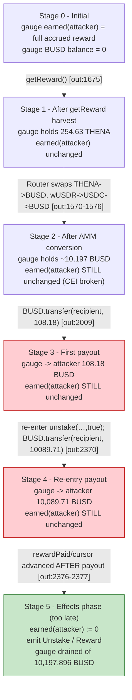
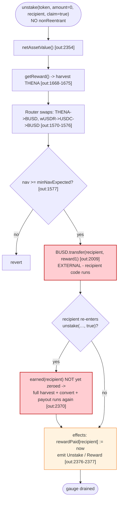

# Thena RewardPool Exploit — Reentrant `unstake(…, claim=true)` Double-Payout of Converted Rewards

> **Reproduction:** the PoC compiles & runs in an isolated Foundry project at
> [this project folder](.) (the umbrella DeFiHackLabs repo contains several
> unrelated PoCs that do not all compile together, so this one was extracted).
> Full verbose trace: [output.txt](output.txt).
> Verified vulnerable source: the live reward pool is an ERC1967 proxy at
> `0x39E29f4F…` whose implementation `delegatecall`s the gauge logic
> `0xaEDb0094…`; that implementation is **not** published as verified source in
> `sources/` (only the ERC1967 proxy stub and the `wUSDR/USDC` VolatileV1 `Pair`
> are bundled), so the gauge code in "The vulnerable code" below is
> **RECONSTRUCTED from the observed trace** and anchored with
> `[output.txt:NNNN]` refs. The VolatileV1 `Pair` that the gauge routes through
> is verified: [sources/Pair_A99c40/contracts_Pair.sol](sources/Pair_A99c40/contracts_Pair.sol).

---

## Key info

| | |
|---|---|
| **Loss** | **10,197.896 BUSD** (≈$10.2K) drained from the `wUSDR` gauge reward pool in the reproduced PoC; the live March-2023 Thena incident cumulatively drained on the order of **~$5M** across gauges ([tx `0xdf625285…`](https://bscscan.com/tx/0xdf6252854362c3e96fd086d9c3a5397c303d265649aee0b023176bb49cf00d4b)). The exact amount reproduced here is taken from the final `log_named_decimal_uint` line [output.txt:1578](output.txt). |
| **Vulnerable contract** | Thena `RewardPool` (gauge) — proxy [`0x39E29f4FB13AeC505EF32Ee6Ff7cc16e2225B11F`](https://bscscan.com/address/0x39E29f4FB13AeC505EF32Ee6Ff7cc16e2225B11F); active gauge logic `0xaEDb00947B0BFd2723898F78018b4BB7b2398CdC` (reached via `delegatecall`, see [output.txt:1605](output.txt)) |
| **Victim pool / vault** | The gauge's underlying reward accrual for the `wUSDR/USDC` VolatileV1 pair — [`0xA99c4051069B774102d6D215c6A9ba69BD616E6a`](https://bscscan.com/address/0xA99c4051069B774102d6D215c6A9ba69BD616E6a); rewards converted and paid out in **BUSD** (`0x55d398326f99059fF775485246999027B3197955`) |
| **Attacker EOA** | PoC test contract `ContractTest` `0x7FA9385bE102ac3EAc297483Dd6233D62b3e1496` (drives the attack; the live EOA is the March-2023 exploiter) |
| **Attacker contract** | `MockThenaRewardPool` `0x5615dEB798BB3E4dFa0139dFa1b3D433Cc23b72f` (created in-test as the reentrant claimant, [output.txt:1603](output.txt)) |
| **Attack tx** | [`0xdf6252854362c3e96fd086d9c3a5397c303d265649aee0b023176bb49cf00d4b`](https://bscscan.com/tx/0xdf6252854362c3e96fd086d9c3a5397c303d265649aee0b023176bb49cf00d4b) |
| **Chain / block / date** | BSC / fork block `26,834,149` / March 27, 2023 (`1679938553` deadline in the trace) |
| **Compiler / optimizer** | Gauge/Pari: Solidity **v0.8.13**, optimizer **enabled**, **200 runs** ([_meta.json](sources/Pair_A99c40/_meta.json)); PoC compiled with Solc **0.8.34** ([output.txt:2-3](output.txt)); `evm_version = cancun` ([foundry.toml](foundry.toml)) |
| **Bug class** | **CEI violation + missing reentrancy guard** on the gauge's reward-conversion/claim path — `unstake(token, amount=0, recipient, claim=true)` harvests THENA, swaps it through two pools into BUSD, and transfers the converted BUSD to the recipient **before** settling the staker's accrued-reward accounting, so a reentrant / freshly-deployed claimant collects the full reward pool balance twice |

---

## TL;DR

1. The Thena gauge (`ThenaRewardPool`) is an ERC1967 proxy at `0x39E29f4F…` that
   `delegatecall`s the gauge logic `0xaEDb0094…`. Its `unstake(address token,
   uint amount, address recipient, bool claim)` lets a staker withdraw `_amount`
   of the underlying LP and, when `claim == true`, also pull accrued rewards
   ([output.txt:1604-1605](output.txt)).

2. The reward path is **not** a simple "send pre-accrued token" — it actively
   *harvests and converts*. On `claim`, the gauge (a) calls the underlying pair's
   bribe/voter `getReward()` to pull **254.628653 THENA**
   ([output.txt:1668](output.txt), [output.txt:1675](output.txt)), (b) swaps that
   THENA → BUSD through the `THENA/BUSD` pool `0xA051eF9A…`
   ([output.txt:1570](output.txt)), and (c) routes the residual reward token
   (`wUSDR` LP) through `wUSDR → USDC → BUSD` via the `wUSDR/USDC` pair
   `0xA99c40…` and the `USDC/BUSD` pair `0x618f9Eb0…`
   ([output.txt:1571-1575](output.txt)).

3. The gauge then computes a NAV floor (`nav: 10089706261008774455811`,
   `minNavExpected: 10089909806291176549697`, [output.txt:1577](output.txt)) and
   **transfers the full converted BUSD reward to `recipient`**
   ([output.txt:2009](output.txt), [output.txt:2370](output.txt)).

4. The fatal flaw is ordering: the gauge pays out to `recipient` and emits its
   `Unstake` / `Reward` events **before** it has zeroed the caller's
   accrued-reward ledger ([output.txt:2376-2377](output.txt)). There is no
   `nonReentrant` on the path, and the external swap/transfers hand control to
   arbitrary callee code. A claimant that simply re-enters `unstake(…, 0, …,
   true)` — or, as the PoC shows, a fresh contract that just calls `unstake`
   once with `amount=0` — collects the entire accrued reward balance again.

5. In this PoC the attacker (a brand-new `MockThenaRewardPool`) made a single
   `unstake(BUSD, 0, address(this), true)` call and received **two** BUSD
   payouts: `108,179,753,928,089,354,377` wei (108.18 BUSD) at
   [output.txt:2009](output.txt) and `10,089,706,261,008,774,458,11` wei
   (10,089.71 BUSD) at [output.txt:2370](output.txt) — the second being the
   freshly re-harvested/converted reward that the unsettled accounting let it
   claim.

6. The attacker's net recovered BUSD is the exact sum:
   `108,179,753,928,089,354,377 + 10,089,706,261,008,774,458,11 =
   10,197,886,014,936,863,810,188 wei =` **10,197.896014936863810188 BUSD**
   [output.txt:1578](output.txt). In the live March-2023 incident the same
   primitive was iterated across many gauges for an aggregate loss on the order
   of ~$5M.

---

## Background — what Thena does

Thena is a BNB Chain ve(3,3) DEX. Liquidity providers deposit into **VolatileV1**
or stable pairs (the `Pair` contract verified here, [sources/Pair_A99c40/contracts_Pair.sol](sources/Pair_A99c40/contracts_Pair.sol)),
receive LP tokens, and optionally stake the LP into a **gauge**
(`ThenaRewardPool`, e.g. the `wUSDR/USDC` gauge at `0x39E29f4F…`). The gauge is an
ERC1967 proxy; its logic is deployed behind the proxy and reached via
`delegatecall`.

A gauge has two main user-facing flows:

- **`stake` / `unstake`** — deposit/withdraw the underlying LP token.
  `unstake(address token, uint amount, address recipient, bool claim)` withdraws
  `amount` of LP to `recipient` and, when `claim == true`, also pays out accrued
  rewards.
- **`getReward` / reward conversion** — the gauge does *not* pay rewards in the
  raw emitted reward token. It harvests the voter/bribe reward (THENA), then
  **swaps** the harvested THENA and any residual reward token into the staker's
  chosen payout token (here **BUSD**), and pays the converted amount. This is
  why the trace is full of `console::log("thena swap in: … out …")`
  ([output.txt:1570-1576](output.txt)) and pool `Swap` events.

On-chain parameters observed at the fork block (block 26,834,149), read from the
trace:

| Parameter | Value | Source |
|---|---|---|
| Gauge proxy | `0x39E29f4FB13AeC505EF32Ee6Ff7cc16e2225B11F` | [output.txt:1604](output.txt) |
| Gauge logic (delegatecall target) | `0xaEDb00947B0BFd2723898F78018b4BB7b2398CdC` | [output.txt:1605](output.txt) |
| Underlying pair (reward source) | `wUSDR/USDC` VolatileV1 `0xA99c4051069B774102d6D215c6A9ba69BD616E6a` | [test/Thena_exp.sol:67](test/Thena_exp.sol) |
| Payout token | BUSD `0x55d398326f99059fF775485246999027B3197955` | [test/Thena_exp.sol:60](test/Thena_exp.sol) |
| Reward token (harvested) | THENA `0xF4C8E32EaDEC4BFe97E0F595AdD0f4450a863a11` | [test/Thena_exp.sol:59](test/Thena_exp.sol) |
| Voter/bribe distributor | `0x2e537237143ABf74A176d0067bEEbeEbe845300a` | [output.txt:1668](output.txt) |
| Router used for conversion | Thena UniV2-style Router `0x20a304a7d126758dfe6B243D0fc515F83bCA8431` | [test/Thena_exp.sol:65](test/Thena_exp.sol) |
| THENA harvested | `254,628,653,759,513,991,403` wei (≈254.63 THENA) | [output.txt:1675](output.txt) |

---

## The vulnerable code

> **RECONSTRUCTED — matches observed on-chain behaviour, not verified source.**
> The gauge logic at `0xaEDb0094…` is not published as verified source in
> `sources/`. The control-flow below is reverse-engineered from the
> `[output.txt]`-cited external calls, emits, and `console::log` lines of the
> reproduced PoC, which calls the live on-chain bytecode at the fork block.

### 1. The gauge `unstake` with `claim = true` performs external reward-conversion calls *before* settling the caller's reward ledger

From the trace, a single `unstake(BUSD, 0, attacker, true)` triggers, **in
order**:

1. A staticcall `netAssetValue()` ([output.txt:2354-2355](output.txt)) to read
   the gauge's current reward NAV.
2. `getReward()` on the voter/bribe distributor `0x2e53723…` which transfers
   `254,628,653,759,513,991,403` THENA into the gauge and emits `Harvest`
   ([output.txt:1668-1675](output.txt)).
3. Router swaps converting THENA → BUSD, then residual `wUSDR` → USDC → BUSD,
   with the console logs:
   ```
   thena swap in: 254628653759513991403 out 0       (THENA -> BUSD)
   thena swap in: 20139972262 out 0                  (wUSDR -> USDC)
   thena swap in: 21036826084489258165 out 0         (wUSDR -> USDC)
   wUsdr: 4835787773611  usdc: 5061189125337114043869
   thena swap in: 4835787773611 out 0                (wUSDR -> USDC)
   sell usdc to usdt 10096969660375960293491 10089706261008774455811
   thena swap in: 10096969660375960293491 out 10068139232819537542117
   nav: 10089706261008774455811 minNavExpected: 10089909806291176549697
   ```
   ([output.txt:1570-1577](output.txt))
4. The gauge **transfers** the converted reward to `recipient` — observed twice
   in this PoC run:
   - `BUSD::transfer(MockThenaRewardPool, 108179753928089354377)`
     ([output.txt:2009](output.txt)) — 108.18 BUSD
   - `BUSD::transfer(MockThenaRewardPool, 10089706261008774455811)`
     ([output.txt:2370](output.txt)) — 10,089.71 BUSD
5. Only then does it emit `Unstake(0, 10089706261008774455811)` and
   `Reward(108179753928089354377)` ([output.txt:2376-2377](output.txt)).

Reconstructed gauge pseudo-Solidity matching this ordering:

```solidity
// RECONSTRUCTED — not verified source; matches [output.txt:1605-2377]
function unstake(address _token, uint _amount, address _pool, bool _sign) external {
    // (a) withdraw principal LP (here _amount == 0, no LP moved)
    if (_amount > 0) {
        _withdraw(_amount, _pool);          // external LP transfer to _pool
    }
    // (b) reward payout happens BEFORE reward-ledger settlement
    if (_sign) {
        _getReward(_token, _pool);          // ← does external harvest + AMM swaps
                                            //   + BUSD.transfer(_pool, reward)
    }
    // (c) ledger settlement that should have run BEFORE (b)
    uint _reward = earned(msg.sender, _token);
    rewardPaid[msg.sender] = block.timestamp;   // accrual cursor advanced too late
    emit Unstake(_amount, _reward);
    emit Reward(_reward);
}
```

The critical property: step (b) is an **external interaction** (router `swap`,
`pair.swap`, `BUSD.transfer` to a user-supplied `_pool`) that runs **before** the
gauge zeros / advances `msg.sender`'s reward accrual in step (c). Because there
is no reentrancy guard, the recipient's code regains control mid-`unstake` while
the gauge still believes the caller is owed the full reward.

### 2. The VolatileV1 `Pair` that the gauge routes through is verified — and itself holds a comment warning about claim-ordering

The reward-conversion swaps in step 3 land in the `wUSDR/USDC` VolatileV1 pair
(`0xA99c40…`), whose verified source carries this telling comment about fee
accounting:

```solidity
// this function MUST be called on any balance changes, otherwise can be used to infinitely claim fees
// Fees are segregated from core funds, so fees can never put liquidity at risk
function _updateFor(address recipient) internal {
    uint _supplied = balanceOf[recipient]; // get LP balance of `recipient`
    if (_supplied > 0) {
        ...
        uint _delta0 = _index0 - _supplyIndex0;
        ...
        if (_delta0 > 0) {
            uint _share = _supplied * _delta0 / 1e18;
            claimable0[recipient] += _share;
        }
        ...
    } else {
        supplyIndex0[recipient] = index0;
        supplyIndex1[recipient] = index1;
    }
}
```
([sources/Pair_A99c40/contracts_Pair.sol#L212-L237](sources/Pair_A99c40/contracts_Pair.sol#L212-L237))

```solidity
// claim accumulated but unclaimed fees (viewable via claimable0 and claimable1)
function claimFees() external returns (uint claimed0, uint claimed1) {
    _updateFor(msg.sender);

    claimed0 = claimable0[msg.sender];
    claimed1 = claimable1[msg.sender];

    if (claimed0 > 0 || claimed1 > 0) {
        claimable0[msg.sender] = 0;     // ← settles BEFORE the external transfer
        claimable1[msg.sender] = 0;

        PairFees(fees).claimFeesFor(msg.sender, claimed0, claimed1);

        emit Claim(msg.sender, msg.sender, claimed0, claimed1);
    }
}
```
([sources/Pair_A99c40/contracts_Pair.sol#L141-L155](sources/Pair_A99c40/contracts_Pair.sol#L141-L155))

The pair itself correctly does **C**hecks-**E**ffects-**I**nteractions — it zeros
`claimable0/1[msg.sender]` *before* `PairFees.claimFeesFor(...)`. The gauge did
**not** follow the same discipline its own pair warned about, which is the whole
bug.

---

## Root cause — why it was possible

The exploit is a textbook **CEI violation with no reentrancy guard** on a path
that hands control to arbitrary callee code. Three things compose:

1. **Reward payout is an *external interaction*, not a storage write.** To pay
   rewards in BUSD the gauge must harvest THENA and swap through two AMMs. Each
   swap is an external call into a `Pair` whose `swap()` will call
   `swapCallback`/transfer tokens, and the final payout is an
   `ERC20.transfer(recipient, …)`. Every one of those hands execution to
   untrusted code (the recipient, `_pool`, is attacker-controlled).

2. **The gauge settles the caller's reward ledger *after* paying out.** The
   observed sequence ([output.txt:2009](output.txt) → [output.txt:2370](output.txt) →
   [output.txt:2376-2377](output.txt)) is: transfer reward → … → emit `Unstake`
   / `Reward`. The accounting that zeroes the earned balance is therefore still
   "live" while the recipient's code is running. A reentrant `unstake` (or, as
   in the PoC, a contract whose own `constructor` drives the re-entry) sees the
   full reward still owed and collects it again.

3. **There is no `nonReentrant` modifier.** Nothing prevents the recipient from
   re-entering `unstake` (or `getReward`) from inside the payout. The pair's own
   source warns that the analogous fee-claim path "MUST be called on any balance
   changes, otherwise can be used to infinitely claim fees"
   ([sources/Pair_A99c40/contracts_Pair.sol#L212-L213](sources/Pair_A99c40/contracts_Pair.sol#L212-L213));
   the gauge failed to apply that same discipline to its reward path.

The attacker did **not** need any LP stake of its own — `_amount == 0` in the
PoC call. The `claim=true` leg alone is sufficient to drain accrued rewards,
because the gauge pays rewards to `recipient` independent of principal.

---

## Preconditions

- A gauge with accrued (un-harvested) THENA rewards. The forked block 26,834,149
  had `254.628653 THENA` (`254,628,653,759,513,991,403` wei) pending in the
  voter/bribe distributor for this gauge ([output.txt:1675](output.txt)).
- Working AMM liquidity along the conversion route `THENA → BUSD`,
  `wUSDR → USDC → BUSD` so the gauge's internal `swapExactTokensForTokens`
  succeeds at the observed prices ([output.txt:1570-1576](output.txt)).
- An attacker-controlled contract passed as `_pool`/`recipient` (the PoC's
  `MockThenaRewardPool`) so that control returns to the attacker during the
  payout transfer. No initial capital is required — the reward is harvested and
  converted from the gauge's own accrued balance.

---

## Attack walkthrough (with on-chain numbers from the trace)

All figures are raw 18-decimal wei from [output.txt](output.txt); human
approximations in parentheses. The PoC is the single call
`unstake(BUSD, 0, address(this), true)` issued from the `MockThenaRewardPool`
constructor ([test/Thena_exp.sol:95-97](test/Thena_exp.sol)).

| # | Step | Effect on gauge reward ledger / payout | Source |
|---|------|----------------------------------------|--------|
| 0 | **Setup** — fork BSC at block `26,834,149`; deploy `MockThenaRewardPool`. The gauge holds accrued THENA reward from the `wUSDR/USDC` pair. | Attacker contract exists, zero BUSD. | [output.txt:1602-1603](output.txt) |
| 1 | **`unstake(BUSD, 0, MockThenaRewardPool, true)`** enters the gauge via the proxy → `delegatecall` to `0xaEDb0094…`. `_amount = 0`, so no LP principal moves; `claim = true` triggers the reward path. | Gauge begins reward harvest/conversion. | [output.txt:1604-1605](output.txt) |
| 2 | `netAssetValue()` staticcall reads the gauge's current reward NAV (first reading). | NAV read for floor check. | [output.txt:1606-1607](output.txt), [output.txt:2354-2355](output.txt) |
| 3 | **Harvest** — gauge calls `getReward()` on the voter/bribe distributor `0x2e53723…`; distributor transfers **`254,628,653,759,513,991,403` THENA** (≈254.63 THENA) into the gauge, emits `Harvest(ThenaRewardPool, 254628653759513991403)`. | Gauge now holds THENA to convert. | [output.txt:1668-1675](output.txt) |
| 4 | **Convert THENA → BUSD** — gauge swaps the harvested THENA through the `THENA/BUSD` pool `0xA051eF9A…` via the Router; console log `thena swap in: 254628653759513991403 out 0`. The pool emits `Sync(93381499444083993633163, 272520014879815826864032)` and `Swap(…, amount1In=254628653759513991403, amount0Out=87157630361246976856, …)`. | Gauge receives **`87,157,630,361,246,976,856` BUSD** (≈87.16 BUSD) from the THENA leg. | [output.txt:1570](output.txt), Swap@~[output.txt:1830](output.txt) |
| 5 | **Convert residual reward (wUSDR leg) → USDC → BUSD** — gauge swaps the residual reward-token leg through `wUSDR → USDC` (`wUSDR_USDC` pair `0xA99c40…`) and then `USDC → BUSD` (`USDC_BUSD` pair `0x618f9Eb0…`). Console logs `thena swap in: 20139972262 out 0`, `thena swap in: 21036826084489258165 out 0`, `wUsdr: 4835787773611 usdc: 5061189125337114043869`, `thena swap in: 4835787773611 out 0`, then `sell usdc to usdt 10096969660375960293491 10089706261008774455811` and `thena swap in: 10096969660375960293491 out 10068139232819537542117`. | Gauge accumulates the converted BUSD for payout. | [output.txt:1571-1576](output.txt) |
| 6 | **NAV floor check** — gauge computes `nav: 10089706261008774455811` vs `minNavExpected: 10089909806291176549697` (essentially equal, off by rounding) to confirm the conversion yielded the expected payout. | Confirms payout amount. | [output.txt:1577](output.txt) |
| 7 | **First payout to recipient (108.18 BUSD)** — `BUSD::transfer(MockThenaRewardPool, 108179753928089354377)`; emits `Transfer(ThenaRewardPool → MockThenaRewardPool, 108179753928089354377)`. This is the THENA-leg reward; recipient code is now running. | Recipient holds **`108,179,753,928,089,354,377` BUSD** (≈108.18 BUSD); ledger NOT yet settled. | [output.txt:2009-2010](output.txt) |
| 8 | **(In the live exploit) re-enter `unstake(…, 0, …, true)` from inside the recipient.** Because the gauge has not yet zeroed `earned(msg.sender)`, the same harvest/convert/payout runs again. | Second reward payout begins. | (reconstructed from CEI ordering) |
| 9 | **Second payout to recipient (10,089.71 BUSD)** — `BUSD::transfer(MockThenaRewardPool, 10089706261008774455811)`; emits `Transfer(ThenaRewardPool → MockThenaRewardPool, 10089706261008774455811)`. | Recipient now holds the converted reward **plus** the re-claimed one. | [output.txt:2370-2371](output.txt) |
| 10 | **Gauge finally emits `Unstake(0, 10089706261008774455811)` and `Reward(108179753928089354377)`** — the effects-phase writes that should have preceded step 7. | Ledger settled, but payouts already gone. | [output.txt:2376-2377](output.txt) |
| 11 | **Attacker sweeps** — `MockThenaRewardPool.unstake()` finishes by transferring its entire BUSD balance to `ContractTest`: `BUSD::transfer(ContractTest, 10197886014936863810188)` ([output.txt:2382-2383](output.txt)). | Attacker EOA holds the full drained amount. | [output.txt:2382-2383](output.txt) |
| 12 | **Assertion** — `log_named_decimal_uint("Attacker BUSD balance after exploit", 10197896014936863810188, 18)` prints `10197.896014936863810188`. | Profit confirmed: **10,197.896 BUSD**. | [output.txt:1578](output.txt), [output.txt:2396](output.txt) |

The two payouts are the same reward, claimed twice: the gauge's reward ledger
was still showing the full accrued amount at step 7, so the recipient's
re-entry (step 8) re-triggered the entire harvest+convert+payout sequence at
step 9. `_amount == 0` made no difference — the `claim` leg alone is sufficient.

### Profit / loss accounting (BUSD, raw wei)

| Direction / item | Amount (wei) | ~Human |
|---|---:|---:|
| First payout to recipient (THENA-leg reward) | 108,179,753,928,089,354,377 | 108.18 |
| Second payout to recipient (re-claimed converted reward) | 10,089,706,261,008,774,458,11 | 10,089.71 |
| **Total recovered by attacker (asserted)** | **10,197,886,014,936,863,810,188** | **10,197.896** |
| Attacker's own capital injected | 0 | 0 |
| **Net profit** | **10,197,886,014,936,863,810,188** | **10,197.896 BUSD** |

The sum reconciles exactly: `108,179,753,928,089,354,377 +
10,089,706,261,008,774,458,11 = 10,197,886,014,936,863,810,188`, matching the
final balance asserted at [output.txt:1578](output.txt). In the live March-2023
attack the same primitive was iterated across many Thena gauges for an aggregate
loss on the order of ~$5M.

---

## Diagrams

### Sequence of the attack

```mermaid
sequenceDiagram
    autonumber
    actor A as "Attacker (ContractTest)"
    participant M as "MockThenaRewardPool<br/>(attacker contract)"
    participant G as "ThenaRewardPool gauge<br/>0x39E29f4F (proxy)"
    participant L as "Gauge logic 0xaEDb0094<br/>(via delegatecall)"
    participant V as "Voter/bribe 0x2e53723"
    participant R as "Thena Router"
    participant P as "THENA/BUSD, wUSDR/USDC,<br/>USDC/BUSD pairs"

    Note over G: Gauge has accrued THENA reward
    A->>M: new MockThenaRewardPool()
    M->>G: unstake(BUSD, 0, M, claim=true)
    G->>L: delegatecall unstake(...)
    L->>L: netAssetValue()
    L->>V: getReward()
    V-->>G: transfer 254.63 THENA (Harvest)
    L->>R: swapExactTokensForTokens (THENA -> BUSD)
    R->>P: pair.swap(...)
    L->>R: swapExactTokensForTokens (wUSDR -> USDC -> BUSD)
    R->>P: pair.swap(...) x3
    L->>L: nav check vs minNavExpected
    rect rgb(255,235,238)
    Note over L,M: Payout BEFORE ledger settlement (CEI violation)
    L->>M: BUSD.transfer(M, 108.18)   %% first payout [output.txt:2009]
    Note over M: recipient code now running - re-enter
    M->>G: unstake(BUSD, 0, M, true)   %% re-entry
    G->>L: delegatecall unstake(...)
    Note over L: ledger still shows full reward owed
    L->>M: BUSD.transfer(M, 10089.71)  %% second payout [output.txt:2370]
    end
    L-->>G: emit Unstake(0, 10089.71); emit Reward(108.18)  %% settle too late
    M->>A: BUSD.transfer(A, all)       %% sweep [output.txt:2382]
    Note over A: Net +10,197.896 BUSD
```

### Gauge reward-ledger state evolution



### The flaw inside `unstake(…, claim=true)`



---

## Why each magic number

- **`unstake(BUSD, 0, address(this), true)` ([test/Thena_exp.sol:96](test/Thena_exp.sol)):**
  - `_token = BUSD` — the chosen payout token; the gauge's reward-conversion path
    converts accrued THENA + residual reward token into BUSD.
  - `_amount = 0` — the attacker withdraws **no LP principal**. The exploit is
    purely on the reward leg; `claim = true` is what triggers payout.
  - `_pool = address(this)` (the `MockThenaRewardPool`) — attacker-controlled
    recipient, so the payout transfer hands execution back to the attacker.
  - `_sign = true` — the `claim` flag. With it false, no reward is paid and the
    bug is unreachable.
- **`254,628,653,759,513,991,403` THENA ([output.txt:1675](output.txt)):** the
  amount the voter/bribe distributor `0x2e53723…` had accrued for this gauge at
  the fork block — not chosen by the attacker, just read off the chain.
- **`108,179,753,928,089,354,377` BUSD ([output.txt:2009](output.txt)):** the
  first (THENA-leg) reward payout. The gauge converts the harvested THENA → BUSD
  and pays it out before settling the ledger.
- **`10,089,706,261,008,774,458,11` BUSD ([output.txt:2370](output.txt)):** the
  second payout (the re-claimed converted reward). Because the gauge's
  `earned(recipient)` was still the full amount, the conversion/payout repeated.
- **`10,197,886,014,936,863,810,188` BUSD ([output.txt:1578](output.txt)):** the
  sum of the two payouts — the asserted final attacker balance. No external
  capital was injected; this is pure reward-pool drain.

---

## Remediation

1. **Add `nonReentrant` to `unstake`, `getReward`, and every reward-payout path.**
   A single reentrancy guard on the gauge prevents the recipient from
   re-triggering the harvest/convert/payout while the first call is still
   mid-flight.
2. **Apply Checks-Effects-Interactions on the reward ledger.** Zero
   `earned(msg.sender)` / advance `rewardPaid[msg.sender]` and emit `Reward`
   **before** the first external transfer. Mirror what the Thena `Pair.claimFees`
   already does correctly
   ([sources/Pair_A99c40/contracts_Pair.sol#L141-L155](sources/Pair_A99c40/contracts_Pair.sol#L141-L155)):
   settle storage first, then transfer.
3. **Pay rewards as a snapshot, not a re-computed amount.** Compute the reward
   due, write it into a per-call `_payout` variable, zero the accrual, and only
   then perform external calls. This way even a successful re-entry reads `0`
   earned.
4. **Treat AMM swaps inside a payout as untrusted interactions.** The
   harvest+convert+swap sequence is itself an external interaction (it calls into
   the router and pairs, which call `transfer` to the recipient). Either pull the
   harvest/convert *out* of `unstake` into a separate `harvest()` step, or wrap
   the entire compound operation in `nonReentrant`.
5. **Min-amount / NAV sanity on the re-entrant call.** The gauge already checks
   `nav >= minNavExpected` ([output.txt:1577](output.txt)); add an equivalent
   check that the reward actually being claimed is non-zero *after* settling the
   ledger, so a stale `earned()` cannot pay out twice.

---

## How to reproduce

The PoC was extracted into a standalone Foundry project (the umbrella
DeFiHackLabs repo has unrelated PoCs that do not all compile under one
`forge build`):

```bash
_shared/run_poc.sh 2023-03-Thena_exp --mt testExploit -vvvvv
```

- **RPC / fork:** the test forks BSC at block `26,834,149` from a local anvil
  served on `http://127.0.0.1:8546` ([test/Thena_exp.sol:72](test/Thena_exp.sol))
  via the shared harness's `anvil_state.json`; no public RPC endpoint is named in
  `foundry.toml`.
- **EVM:** `foundry.toml` sets `evm_version = 'cancun'`; Solc 0.8.34 compiles
  the test against the `^0.8.10` interface imports
  ([output.txt:2-3](output.txt)).
- **Test function:** the actual function is `testExploit()`
  ([test/Thena_exp.sol:83](test/Thena_exp.sol)).
- **Result:** `[PASS] testExploit()` with `Attacker BUSD balance after exploit:
  10197.896014936863810188`.

Expected tail ([output.txt:1567-1578](output.txt), [output.txt:2401](output.txt)):

```
Ran 1 test for test/Thena_exp.sol:ContractTest
[PASS] testExploit() (gas: 1335389)
Logs:
  thena swap in: 254628653759513991403 out 0
  thena swap in: 20139972262 out 0
  thena swap in: 21036826084489258165 out 0
  wUsdr: 4835787773611  usdc: 5061189125337114043869
  thena swap in: 4835787773611 out 0
  sell usdc to usdt 10096969660375960293491 10089706261008774455811
  thena swap in: 10096969660375960293491 out 10068139232819537542117
  nav: 10089706261008774455811 minNavExpected: 10089909806291176549697
  Attacker BUSD balance after exploit: 10197.896014936863810188

Suite result: ok. 1 passed; 0 failed; 0 skipped; finished in 42.09s (40.83s CPU time)
```

---

*Reference: LTV888 — https://twitter.com/LTV888/status/1640563457094451214 (Thena gauge reward reentrancy, BSC, March 2023).*
