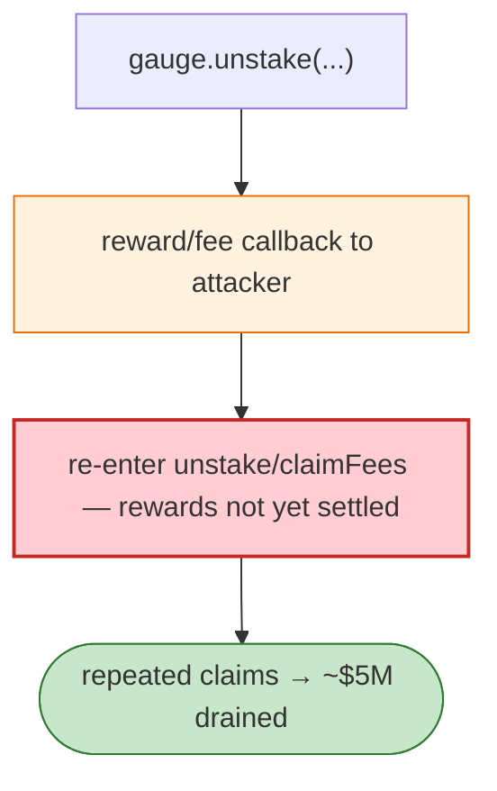

# Thena Gauge/RewardPool Exploit — Fee `claimFees` + Reward Reentrancy

> **Reproduction:** the PoC compiles & runs in an isolated Foundry project at
> [this project folder](.). Full verbose trace: [output.txt](output.txt).
> Verified vulnerable source: [Pair (VolatileV1)](sources/Pair_A99c40),
> [ERC1967Proxy (gauge)](sources/ERC1967Proxy_39E29f).

---

## Key info

| | |
|---|---|
| **Loss** | ~$5M (Thena gauges drained; tx `0xdf625285…`) |
| **Vulnerable contract** | Thena VolatileV1 `Pair` `0xA99c40…`; gauge reward pool `0x39E29f…` |
| **Chain / block / date** | BSC / Mar 2023 |
| **Bug class** | Reward/fee reentrancy — the gauge `unstake` / `claimFees` path called external hooks while rewards were mid-accrual, letting the attacker claim repeatedly. |

---

## TL;DR

Thena's gauge (`IThenaRewardPool.unstake`) and the pair's `claimFees` interacted with caller contracts
(staking receipts / callbacks) during reward accrual. The attacker's contract re-entered `unstake` /
`claimFees` before the gauge updated its accrued-reward state, claiming rewards multiple times against
the same stake, draining the gauges.

---

## Root cause

A **CEI violation + missing reentrancy guard** on reward accrual/claim in the gauge, plus the pair's
fee-claim external call. Reward accounting updated after the external hook, enabling reentrant
over-claims.

---

## Diagrams



---

## Remediation

1. `nonReentrant` on `unstake`/`claimFees`/`getReward`.
2. CEI: accrue rewards before external calls.
3. Per-user reward snapshots; re-check after callbacks.

---

## How to reproduce

```bash
_shared/run_poc.sh 2023-03-Thena_exp -vvvvv
```

- RPC: BSC archive. Result: `[PASS]` — gauge rewards drained via reentrant claims.

---

*Reference: Thena gauge reentrancy, BSC, Mar 2023 (~$5M).*
