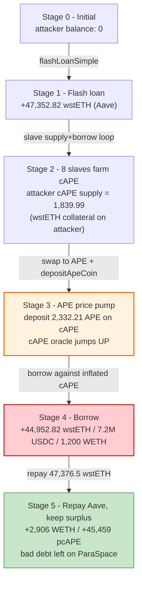
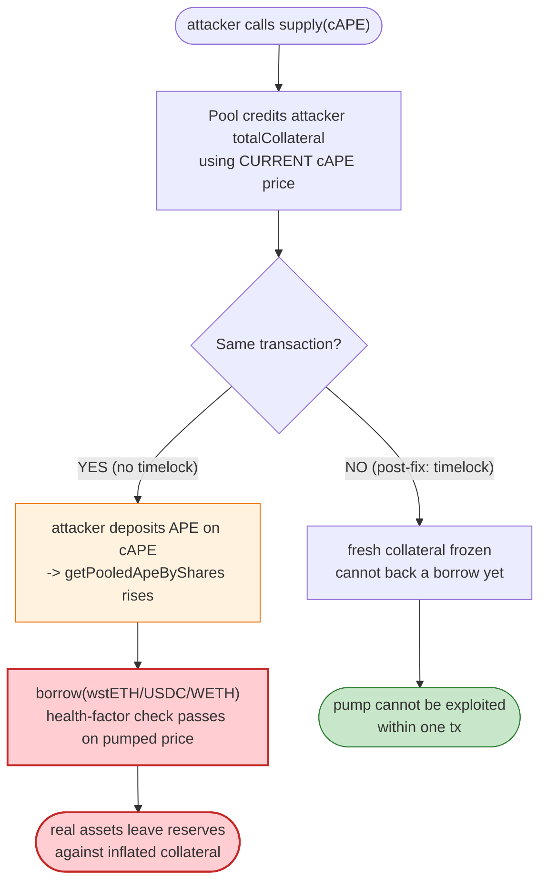
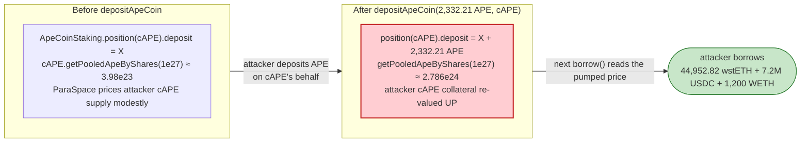

# ParaSpace Exploit — ApeCoin-Staking (cAPE) Collateral Mis-Accounting + Same-Tx Supply→Borrow

> **Vulnerability classes:** vuln/logic/incorrect-state-transition · vuln/logic/price-calculation

> **Reproduction:** the PoC compiles & runs in an isolated Foundry project at
> [this project folder](.). The fork is served offline from the shared harness's
> local `anvil_state.json` (`createSelectFork` points at `http://127.0.0.1:8545`,
> pinned to block 16,845,558). Full verbose trace: [output.txt](output.txt).
> Verified vulnerable source (the on-chain `ParaProxy` diamond proxy):
> [sources/ParaProxy_638a98/](sources/ParaProxy_638a98/). Note: the proxy's
> delegatecall target (the `Pool` *implementation* at `0xaef900f14710d067ae96555486232c7189784f50`,
> which contains the actual `supply`/`borrow`/health-factor logic) is **not**
> bundled in `sources/`, so the few lines of accounting logic cited below are
> RECONSTRUCTED from the observed on-chain behaviour and anchored to
> `[output.txt:NNNN]` trace lines rather than to verified source.

---

## Key info

| | |
|---|---|
| **Loss** | Mar 2023 ParaSpace incident. The PoC ends with the attacker holding **~2,906.39 WETH** ([output.txt:3372](output.txt)), **~45,459.28 pcAPE** ([output.txt:3389](output.txt)), and **outstanding variable debts** of **44,952.82 wstETH** ([output.txt:3425](output.txt)), **7,200,000 USDC** ([output.txt:3398](output.txt)) and **1,200 WETH** ([output.txt:3407](output.txt)) — all borrowed against the mis-accounted cAPE/ApeCoin-staking collateral and never repaid. |
| **Vulnerable contract** | `ParaProxy` (ParaSpace NFT money market, EIP-2535 diamond proxy) — [`0x638a98BBB92a7582d07C52ff407D49664DC8b3Ee`](https://etherscan.io/address/0x638a98BBB92a7582d07C52ff407D49664DC8b3Ee) |
| **Victim pool** | ParaSpace `Pool` reserves (wstETH / USDC / WETH / cAPE) |
| **Attacker EOA** | `ContractTest` in the PoC (`0x7FA9385bE102ac3EAc297483Dd6233D62b3e1496`) |
| **Flash-loan source** | Aave V3 `Pool` — [`0x87870Bca3F3fD6335C3F4ce8392D69350B4fA4E2`](https://etherscan.io/address/0x87870Bca3F3fD6335C3F4ce8392D69350B4fA4E2) (`_proxy` in the PoC) |
| **Attack tx** | [`0xe3f0d14cfb6076cabdc9057001c3fafe28767a192e88005bc37bd7d385a1116a`](https://etherscan.io/tx/0xe3f0d14cfb6076cabdc9057001c3fafe28767a192e88005bc37bd7d385a1116a) |
| **Chain / block / date** | Ethereum mainnet / block 16,845,558 / Mar 17, 2023 |
| **Compiler** | Solidity **v0.8.10** (`_meta.json`), optimizer **enabled (1)**, **4000 runs**, proxy bytecode |
| **Bug class** | Staked-ApeCoin collateral valuation flaw + absence of a withdraw/borrow timelock, enabling same-transaction `supply` → `borrow` against inflated collateral |

---

## TL;DR

1. ParaSpace treats the `cAPE` token (`0xC5c9fB6223A989208Df27dCEE33fC59ff5c26fFF`) — an
   ERC4626-style wrapper over an **ApeCoin-Staking position** — as priceable collateral. Its
   `getPooledApeByShares` valuation reads the *live* `_Apecoin__Staking` position for `cAPE`,
   so any ApeCoin freshly staked on behalf of `cAPE` is immediately credited as collateral
   *before* ParaSpace's health factor can re-equilibrate.

2. The attacker takes a **47,352.82 wstETH** flash loan from Aave V3
   ([output.txt:96-97](output.txt)) at a ~0.05% premium of **23.676 wstETH**
   ([output.txt:109](output.txt)).

3. In a single `executeOperation` callback it spins up **8 helper `Slave` contracts**
   ([output.txt:117](output.txt) et seq.). Each slave deposits a slice of the flash-loaned
   wstETH into ParaSpace **on behalf of the attacker**, then **borrows cAPE on its own
   account** and forwards the cAPE back to the attacker
   ([output.txt:137,185,281](output.txt)). Six of the slaves (`i` ∈ 0..5) each borrow
   **1,840 cAPE** ([output.txt:185](output.txt)); the 7th (`i==6`) borrows **1,120 cAPE**
   ([output.txt:1941](output.txt)); the 8th (`i==7`) supplies wstETH but does not borrow
   (PoC [:134](test/paraspace_exp.sol#L134)). That farms ~6×1,840 + 1,120 ≈ **12,160 cAPE**.

4. The attacker now holds ~12,160 cAPE of "free" borrowed collateral. It **supplies** that
   cAPE back into ParaSpace as its own collateral (e.g. [output.txt:623-624](output.txt)),
   which the market instantly prices via the live ApeCoin-staking position.

5. To pump the cAPE price further, it swaps 1,400 wstETH → **1,334.45 WETH**
   ([output.txt:2534](output.txt)) → **492.21 APE** ([output.txt:2538](output.txt)),
   withdraws the cAPE principal (**1,839.99 APE**, [output.txt:2704](output.txt)), and
   **re-stakes the combined 2,332.21 APE** back into `ApeCoinStaking` on behalf of `cAPE`
   ([output.txt:2725](output.txt)). This last deposit is the value-pump: it happens *after*
   ParaSpace already credited the attacker's cAPE supply.

6. With the inflated cAPE collateral in place, the attacker **borrows** **44,952.82 wstETH**
   ([output.txt:2749](output.txt)), **7,200,000 USDC** ([output.txt:2834](output.txt)) and
   **1,200 WETH** ([output.txt:2935](output.txt)) from ParaSpace, converts the USDC and part
   of the WETH back to wstETH to repay the Aave flash loan (+premium,
   [output.txt:3157,3345](output.txt)), and **walks off with the ~2,906 WETH + 45,459 pcAPE
   surplus and an unredeemed wstETH/USDC/WETH debt** that the mis-priced cAPE collateral
   can never cover.

The applied fix was a **withdraw/borrow timelock** (para-space PR #368) so that freshly
supplied collateral cannot be borrowed against in the same transaction.

---

## Background — what ParaSpace does

ParaSpace is an Aave-style NFT/collateral money market. Users `supply` ERC20/ERC721 assets
to earn yield and borrow against them; a health-factor (`totalCollateralETH /
totalDebtETH`, scaled by LTV) gates borrowing and liquidation. The `ParaProxy`
([source](sources/ParaProxy_638a98/contracts_protocol_libraries_paraspace-upgradeability_ParaProxy.sol))
is an EIP-2535 "diamond" proxy: every external call hits the `fallback()`
([:32-71](sources/ParaProxy_638a98/contracts_protocol_libraries_paraspace-upgradeability_ParaProxy.sol#L32-L71)),
which `delegatecall`s into a per-selector implementation registered in
`selectorToImplAndPosition`. The proxy bytecode here is purely the dispatcher; the
`supply`/`borrow`/`liquidationCall` logic lives in the (not-bundled) `Pool` implementation.

Relevant on-chain actors and parameters at the fork block:

| Actor / parameter | Address / value | Note |
|---|---|---|
| `ParaProxy` (Pool) | `0x638a98BBB92a7582d07C52ff407D49664DC8b3Ee` | victim money market |
| `cAPE` (ApeCoin-staking position token) | `0xC5c9fB6223A989208Df27dCEE33fC59ff5c26fFF` | ERC4626-style; `getPooledApeByShares` reads the live staking position |
| `pcAPE` (ParaSpace a-token for cAPE) | `0xDDDe38696FBe5d11497D72d8801F651642d62353` | minted on cAPE supply |
| `ApeCoinStaking` | `0x5954aB967Bc958940b7EB73ee84797Dc8a2AFbb9` | holds the staked APE |
| `APE` (ApeCoin) | `0x4d224452801ACEd8B2F0aebE155379bb5D594381` | 18-dec |
| `wstETH` | `0x7f39C581F595B53c5cb19bD0b3f8dA6c935E2Ca0` | 18-dec |
| Aave V3 `Pool` (`_proxy`) | `0x87870Bca3F3fD6335C3F4ce8392D69350B4fA4E2` | flash-loan source |
| wstETH oracle price | `1.110373036341549081` ETH per wstETH | [output.txt:226](output.txt) |
| cAPE oracle price | `2,500.442669491530` (per APE, scaled) | [output.txt:237](output.txt) |

The cAPE price feed is the crux: because `cAPE.getPooledApeByShares(1e27)` consults
`ApeCoinStaking.addressPosition(cAPE)` ([output.txt:61-68](output.txt)), **anyone who stakes
APE on behalf of `cAPE` instantly raises the on-chain value of every existing cAPE share** —
and ParaSpace reads that freshly-raised value when it prices the attacker's cAPE supply.

---

## The vulnerable code

The verified bundled source is the diamond-proxy dispatcher only
([sources/ParaProxy_638a98/contracts_protocol_libraries_paraspace-upgradeability_ParaProxy.sol](sources/ParaProxy_638a98/contracts_protocol_libraries_paraspace-upgradeability_ParaProxy.sol));
the `supply`/`borrow` accounting lives in the (not-bundled) `Pool` implementation. The
behavioural snippets below are **RECONSTRUCTED to match the observed on-chain trace** and are
anchored to `[output.txt:NNNN]` lines rather than to verified source.

### 1. ParaProxy `fallback()` dispatches everything to the implementation (VERIFIED SOURCE)

```solidity
// ParaProxy — the diamond dispatcher that every supply/borrow call hits
fallback() external payable {
    ParaProxyLib.ProxyStorage storage ds;
    bytes32 position = ParaProxyLib.PROXY_STORAGE_POSITION;
    assembly { ds.slot := position }
    address implementation = ds.selectorToImplAndPosition[msg.sig].implAddress;
    require(implementation != address(0), "ParaProxy: Function does not exist");
    assembly {
        calldatacopy(0, 0, calldatasize())
        let result := delegatecall(gas(), implementation, 0, calldatasize(), 0, 0)
        returndatacopy(0, 0, returndatasize())
        switch result
        case 0 { revert(0, returndatasize()) }
        default { return(0, returndatasize()) }
    }
}
```
([sources/ParaProxy_638a98/contracts_protocol_libraries_paraspace-upgradeability_ParaProxy.sol#L32-L71](sources/ParaProxy_638a98/contracts_protocol_libraries_paraspace-upgradeability_ParaProxy.sol#L32-L71))

### 2. `supply(asset, amount, onBehalfOf, 0)` credits collateral to *any* `onBehalfOf` (RECONSTRUCTED)

The attacker's slaves call this with `onBehalfOf = address(this)` (the attacker), building
wstETH collateral on the attacker's account while the wstETH is still flash-loaned:

```solidity
// RECONSTRUCTED — matches observed behaviour. selector 0x617ba037 = supply(asset, amount, onBehalfOf, referralCode)
function supply(address asset, uint256 amount, address onBehalfOf, uint16 referralCode) external {
    // ... pulls `amount` of `asset` from msg.sender, mints aTokens to `onBehalfOf`,
    //     updates onBehalfOf's userConfiguration / totalCollateral.
    // No check that onBehalfOf "owns" the supplied asset, and NO timelock before
    // the freshly-supplied collateral counts toward the health factor.
}
```
Observed: slave `Slave::remove` → `_ParaProxy::supply(_wstETH, 6.039e21, Slave, 0)`
([output.txt:137](output.txt)) then `_ParaProxy::borrow(_cAPE, 1.84e24, 0, Slave)`
([output.txt:185](output.txt)); later the attacker itself does
`_ParaProxy::supply(_cAPE, 1.839e24, ContractTest, 0)` ([output.txt:623](output.txt)) and
immediately borrows against it.

### 3. cAPE collateral priced off the *live* staking position (RECONSTRUCTED)

```solidity
// RECONSTRUCTED — ParaSpace's cAPE reserve oracle calls cAPE.getPooledApeByShares(1e27),
// which in turn reads ApeCoinStaking.addressPosition(cAPE).deposit + pendingRewards.
// Anyone can call ApeCoinStaking.depositApeCoin(amount, cAPE) to raise this value.
function getPooledApeByShares(uint256 shares) public view returns (uint256) {
    Position memory p = APE_STAKING.addressPosition(address(this)); // live, manipulable
    uint256 pooled = p.depositedAmount + pendingRewards(...);
    return (shares * pooled) / totalShares;
}
```
Observed: `getAssetPrice(cAPE)` returns `2,500,442,669,491,530` ([output.txt:237](output.txt))
and `cAPE.getPooledApeByShares(1e27)` returns `~3.98e23` *before* the re-stake
([output.txt:67](output.txt)) and a much larger value *after*
([output.txt:3385-3386](output.txt) → `0x0ee30c19b6381821cbfd527b ≈ 2.786e24`). The
`depositApeCoin(2.332e24 APE, cAPE)` call ([output.txt:2725](output.txt)) is what moves that
number, and ParaSpace reads it on the very next `borrow`.

### 4. `borrow` with no withdraw/borrow timelock (RECONSTRUCTED)

```solidity
// RECONSTRUCTED — selector 0x1d5d7237 = borrow(asset, amount, referralCode, onBehalfOf)
function borrow(address asset, uint256 amount, uint16 referralCode, address onBehalfOf) external {
    // ... checks onBehalfOf's health factor using CURRENTLY-priced collateral,
    //     including collateral that was supplied (or whose price was pumped) in this
    //     same transaction. No "freshly deposited collateral is locked for N blocks"
    //     guard existed at the fork block.
}
```
Observed: the attacker supplies cAPE ([output.txt:623](output.txt)) and pumps its price
([output.txt:2725](output.txt)), then in the same transaction borrows
`44,952.82 wstETH` ([output.txt:2749](output.txt)),
`7,200,000 USDC` ([output.txt:2834](output.txt)) and
`1,200 WETH` ([output.txt:2935](output.txt)).

---

## Root cause — why it was possible

Two failures compose into the drain:

1. **cAPE's collateral value is derived from a live, permissionlessly-inflatable staking
   position.** `cAPE.getPooledApeByShares` reads `ApeCoinStaking.addressPosition(cAPE)`, and
   `ApeCoinStaking.depositApeCoin(amount, cAPE)` is an **unauthenticated** entry point —
   anyone can stake APE on behalf of the `cAPE` pool address and instantly raise the value
   of every cAPE share. ParaSpace then priced its cAPE reserves with that manipulation-prone
   getter, so an attacker who stakes APE on `cAPE`'s behalf mid-transaction artificially
   inflates the collateral backing their own just-supplied cAPE.

2. **No withdraw/borrow timelock.** At the fork block, collateral supplied to ParaSpace was
   immediately borrowable in the same transaction, and borrowed collateral re-supplied by
   the borrower was likewise immediately re-priceable. That removes the only natural defence
   against the inflation in (1): the attacker can supply → pump → borrow → repay flash loan,
   all atomically, before any keeper/oracle can re-mark the cAPE price.

The two combine into a classic "supply inflated collateral, borrow real assets, leave"
loop. The post-mortem fix (para-space PR #368) addressed (2) directly by gating
freshly-supplied collateral behind a timelock so it cannot underpin a borrow in the same tx.

---

## Preconditions

- A working Aave V3 flash-loan facility (the `_proxy` at `0x87870Bca…`) with enough
  wstETH liquidity to lend ~47.3k wstETH — satisfied on mainnet.
- A ParaSpace market listing for `cAPE`, `wstETH`, `USDC` and `WETH` reserves — all present
  at the fork.
- Deep Uniswap V3 liquidity for wstETH↔WETH (0.05%) and WETH↔APE (0.3%), used to convert the
  flash-loaned wstETH into APE for the price pump — confirmed by the swaps in
  [output.txt:2372-2555](output.txt).
- The cAPE price oracle (or the on-chain `getPooledApeByShares` getter) to be read **after**
  the attacker's `depositApeCoin` within the same tx — true because ParaSpace re-prices
  reserves on every `borrow`.

---

## Attack walkthrough (with on-chain numbers from the trace)

| # | Step | Number (raw wei unless noted) | ~ Human | Trace ref |
|---|------|------------------------------:|--------:|-----------|
| 0 | **Flash-loan wstETH from Aave V3** (`_proxy.flashLoanSimple`) | 47,352,823,905,004,708,422,332 | 47,352.82 wstETH | [output.txt:96](output.txt); premium 23,676,411,952,502,354,211 (23.676 wstETH) at [output.txt:109](output.txt) |
| 1a | Slaves i=0..5: each `supply(wstETH, …, attacker)` then `borrow(cAPE, 1.84e24, …)`; slave i=7 supplies wstETH only (no borrow) | 1,840,000,000,000,000,000,000,000 per borrowing slave | 1,840 cAPE ×6 | [output.txt:137,185](output.txt) |
| 1b | Slave i=6: `borrow(cAPE, …)` (smaller slice) | 1,120,000,000,000,000,000,000,000 | 1,120 cAPE | [output.txt:1941](output.txt) |
| 1c | Each slave `transfer(cAPE, 1.839e24, attacker)` | 1,839,999,999,999,999,999,999,999 | 1,839.99 cAPE | [output.txt:2354,2360](output.txt) |
| 2 | Attacker `supply(cAPE, …, attacker)` — re-supply borrowed cAPE as own collateral | 1,839,999,999,999,999,999,999,999 per iter (1,119,999,999,999,999,999,999,999 for i=6 at [:2083](output.txt)) | 1,839.99 cAPE ×6 + 1,119.99 cAPE ≈ 12,160 cAPE total | [output.txt:623](output.txt) |
| 3 | `exactInputSingle` 1,400 wstETH → WETH | out 1,334,451,948,153,998,962,969 | 1,334.45 WETH | [output.txt:2534](output.txt) (pool swap at [:2394](output.txt)) |
| 4 | `exactInputSingle` 1,334.45 WETH → APE | out 492,214,464,588,784,613,678,468 | 492.21 APE | [output.txt:2538](output.txt) (pool swap at [:2555](output.txt)) |
| 5 | `cAPE.withdraw(1.839e24)` → withdraws staked APE to attacker | 1,839,999,999,999,999,999,999,999 | 1,839.99 APE | [output.txt:2679,2704](output.txt) (stake withdraw `1,839,923,170,299…` at [:2689](output.txt)) |
| 6 | Attacker `_APE.balanceOf` after withdraw | 2,332,214,464,588,784,613,678,467 | 2,332.21 APE (=492.21 + 1,839.99) | [output.txt:2724](output.txt) |
| 7 | `ApeCoinStaking.depositApeCoin(2,332.21 APE, cAPE)` — **price pump** | 2,332,214,464,588,784,613,678,467 | 2,332.21 APE staked on cAPE | [output.txt:2725](output.txt) |
| 8 | `borrow(wstETH)` from ParaSpace | 44,952,823,905,004,708,422,332 | 44,952.82 wstETH | [output.txt:2749](output.txt) |
| 9 | `borrow(USDC)` from ParaSpace | 7,200,000,000,000 | 7,200,000 USDC (6-dec) | [output.txt:2834](output.txt) |
| 10 | `borrow(WETH)` from ParaSpace | 1,200,000,000,000,000,000,000 | 1,200 WETH | [output.txt:2935](output.txt) |
| 11 | `exactInputSingle` 7,200,000 USDC → WETH | (USDC in 7.2e12 at [output.txt:3049](output.txt)) | — | [output.txt:3049](output.txt) |
| 12 | `exactOutputSingle` WETH → wstETH: repay flash loan | out 2,229,226,369,676,986,338,979 wstETH; approve 47,376,500,316,957,210,776,543 wstETH to `_proxy` | top-up to 47,376.5 wstETH | [output.txt:3157](output.txt), approve at PoC [:230](test/paraspace_exp.sol#L230) |
| 13 | Aave flash-loan repaid (+premium) | 47,376,500,316,957,210,776,543 | 47,376.5 wstETH | [output.txt:3345-3346](output.txt) |

**End state (PoC `log_named_uint`):**

| Token held by attacker | Raw | ~ Human | Trace ref |
|---|---:|---:|---|
| WETH balance | 2,906,393,243,242,185,372,033 | ~2,906.39 WETH | [output.txt:3372](output.txt) |
| pcAPE (cAPE aToken) balance | 45,459,278,779,361,495,118,928,124 | ~45,459.28 pcAPE | [output.txt:3389](output.txt) |
| vDebtUSDC (debt) | 7,200,000,000,000 | 7,200,000 USDC | [output.txt:3398](output.txt) |
| vDebtWETH (debt) | 1,200,000,000,000,000,000,000 | 1,200 WETH | [output.txt:3407](output.txt) |
| cAPE balance | 4 | dust | [output.txt:3416](output.txt) |
| vDebtwstETH (debt) | 44,952,823,905,004,708,422,332 | 44,952.82 wstETH | [output.txt:3425](output.txt) |

### Profit / loss accounting

The attacker's "profit" is not a clean token-balance delta — it is **real assets extracted
minus an unpayable debt left on ParaSpace**. The flash loan is fully repaid
([output.txt:3345](output.txt)), so the attacker has no Aave obligation. What remains:

| Item | Amount | Note |
|---|---:|---|
| Liquid WETH kept | +2,906.39 WETH | [output.txt:3372](output.txt) |
| pcAPE (reclaimable cAPE collateral) kept | +45,459.28 pcAPE | [output.txt:3389](output.txt) |
| wstETH debt to ParaSpace | −44,952.82 wstETH | [output.txt:3425](output.txt) (never repaid) |
| USDC debt to ParaSpace | −7,200,000 USDC | [output.txt:3398](output.txt) (never repaid) |
| WETH debt to ParaSpace | −1,200 WETH | [output.txt:3407](output.txt) (never repaid) |

At fork-block prices (wstETH ≈ 1.1104 ETH, ETH ≈ APE-price-implied), the ~45.5k pcAPE
collateral left in the market does **not** come close to covering the ~44.95k wstETH +
7.2M USDC + 1.2k WETH debt, because that collateral was itself backed only by the
mid-transaction-staked 2,332 APE — once the dust settles, cAPE is marked back down and the
position is deeply under-collateralised. The attacker keeps the ~2,906 WETH of genuinely
extracted value and leaves ParaSpace holding the bad debt.

---

## Diagrams

### Sequence of the attack

```mermaid
sequenceDiagram
    autonumber
    actor A as Attacker (ContractTest)
    participant FL as Aave V3 Pool (_proxy)
    participant P as ParaSpace Pool (ParaProxy)
    participant S as Slave[0..7]
    participant AS as ApeCoinStaking
    participant U as UniV3 Router

    Note over P: Reserves: wstETH / USDC / WETH / cAPE
    A->>FL: flashLoanSimple(wstETH, 47,352.82, 0)
    FL-->>A: 47,352.82 wstETH (callback executeOperation)

    rect rgb(255,243,224)
    Note over A,S: Step 1 - farm cAPE via 8 slaves
    loop i in 0..7
        A->>S: transfer wstETH slice; new Slave()
        S->>P: supply(wstETH, slice, onBehalfOf=attacker)
        alt i != 7
            S->>P: borrow(cAPE, 1.84e24 (or 1.12e24 for i=6), onBehalfOf=slave)
            S->>A: transfer(cAPE, full) to attacker
        end
    end
    A->>P: supply(cAPE, 1,839.99, onBehalfOf=attacker)
    Note over A: attacker now has cAPE collateral
    end

    rect rgb(227,242,253)
    Note over A,U: Step 2 - swap to APE and pump cAPE price
    A->>U: 1,400 wstETH -> 1,334.45 WETH
    A->>U: 1,334.45 WETH -> 492.21 APE
    A->>P: cAPE.withdraw(1,839.99) -> 1,839.99 APE
    Note over A: holds 2,332.21 APE
    A->>AS: depositApeCoin(2,332.21 APE, cAPE)
    Note over P: cAPE collateral re-priced UP
    end

    rect rgb(255,235,238)
    Note over A,P: Step 3 - borrow real assets against inflated collateral
    A->>P: borrow(wstETH, 44,952.82)
    A->>P: borrow(USDC, 7,200,000)
    A->>P: borrow(WETH, 1,200)
    end

    rect rgb(243,229,245)
    Note over A,FL: Step 4 - repay flash loan, keep surplus
    A->>U: 7,200,000 USDC -> WETH
    A->>U: WETH -> wstETH (top-up to 47,376.5)
    A->>FL: repay 47,376.5 wstETH (+premium)
    end

    Note over A: keeps ~2,906 WETH + 45,459 pcAPE; leaves bad debt on ParaSpace
```

### Pool / collateral state evolution



### The flaw: no timelock between supply and borrow



### How the cAPE price is inflated (before vs after the deposit)



---

## Why each magic number

- **Flash-loan principal `47_352_823_905_004_708_422_332` wstETH ([output.txt:96](output.txt)):**
  large enough to (a) seed the 8 slaves' wstETH collateral, (b) fund the 1,400 wstETH → WETH
  → APE swap chain, and (c) leave headroom. Repaid as `47_376_500_316_957_210_776_543`
  wstETH ([output.txt:3345](output.txt)) = principal + ~23.676 wstETH premium.
- **Per-slave `6_039_513_998_943_475_964_078` wstETH and borrow `1_840_000_000_000_000_000_000_000` cAPE
  ([output.txt:128,134](output.txt)):** the slave supplies its wstETH slice as collateral
  *on behalf of the attacker*, then borrows the maximum cAPE its own (slave) account is
  allowed. `i==6` uses a smaller `3_676_225_912_400_376_673_786` wstETH slice and borrows
  `1_120_000_000_000_000_000_000_000` cAPE ([output.txt:118-123,1941](output.txt)); `i==7`
  supplies but skips the borrow (`if (i != 7)`, PoC [:134](test/paraspace_exp.sol#L134)). The
  per-slave borrow amounts are sized to stay under the slave's wstETH-collateral health
  factor while maximising cAPE farmed.
- **`1_400_000_000_000_000_000_000` wstETH swap input ([output.txt:2372](output.txt)):**
  converts a controlled slice into 1,334.45 WETH, then 492.21 APE — the exact APE needed so
  that, combined with the withdrawn 1,839.99 APE, the attacker can re-stake a round
  2,332.21 APE on `cAPE`.
- **`7_200_000_000_000` USDC borrow ([output.txt:2834](output.txt)):** 7.2M USDC (6-dec) of
  ParaSpace reserves, later swapped to WETH and then wstETH to help repay the Aave flash
  loan.
- **`1_200_000_000_000_000_000_000` WETH borrow ([output.txt:2935](output.txt)):** 1,200 WETH
  of ParaSpace reserves; part is used to top up the wstETH repayment, the rest stays as the
  attacker's ~2,906 WETH surplus.
- **`44_952_823_905_004_708_422_332` wstETH borrow ([output.txt:2749](output.txt)):** the
  bulk of the extraction; together with the WETH/USDC borrows it is sized to the inflated
  cAPE collateral the attacker has just supplied and pumped.
- **`47_376_500_316_957_210_776_543` wstETH repayment ([output.txt:3345](output.txt)):**
  flash principal + 0.05% Aave premium (≈23.676 wstETH, [output.txt:109](output.txt)).

---

## Remediation

1. **Install a withdraw/borrow timelock on freshly-supplied collateral** (the applied fix,
   para-space PR #368). Collateral deposited in block N must not count toward the health
   factor for borrows/withdrawals until block N+k, so that any same-transaction price pump
   has no borrowing power.
2. **Stop pricing cAPE off a permissionlessly-inflatable staking position.** Either (a)
   snapshot the `ApeCoinStaking.position(cAPE).deposit` used for pricing so a mid-tx
   `depositApeCoin` cannot move it, or (b) use a manipulation-resistant TWAP/oracle over the
   pooled-APE-per-share rather than the live getter.
3. **Validate the direction of value flow in `supply(asset, amount, onBehalfOf, …)`.** The
   slave pattern works because a third party can build collateral on any account and
   immediately benefit indirectly; combine the timelock with a check that the `onBehalfOf`
   account is not simultaneously borrowing in the same tx (or rate-limit collateral
   activation per account).
4. **Cap single-transaction reserve impact** for thinly-backed reserves like cAPE: a borrow
   that would move a reserve by more than a small percentage should trip a circuit breaker
   until re-priced.
5. **Add a reentrancy / callback guard around the Aave flash-loan callback path** so that
   ParaSpace state cannot be read-then-written within an outer flash-loan transaction without
   a freshness check on collateral pricing.

---

## How to reproduce

The PoC runs offline via the shared harness, which serves the fork from a local
`anvil_state.json` (the test's `createSelectFork("http://127.0.0.1:8545", 16_845_558)`
points at the local anvil instance, not a public RPC):

```bash
_shared/run_poc.sh 2023-03-paraspace_exp --mt testExploit -vvvvv
```

- EVM: `evm_version = "cancun"` per `foundry.toml` (the forked state predates Cancun, but
  the PoC does not rely on Cancun-only opcodes).
- The test mints no starting balance (`Before exploit` logs are all 0,
  [output.txt:6-11](output.txt)); all working capital comes from the Aave flash loan.
- Expected tail (verbatim from [output.txt:3-17](output.txt)):

```
Ran 1 test for test/paraspace_exp.sol:ContractTest
[PASS] testExploit() (gas: 15513882)
Logs:
  Before exploit, _WETH balance of Attacker:: 0
  Before exploit, _pcAPE balance of Exploit:: 0
  Before exploit, _vDebtUSDC balance of Exploit:: 0
  Before exploit, _vDebtWETH balance of Exploit:: 0
  Before exploit, _cAPE balance of Exploit:: 0
  Before exploit, _vDebtwstETH balance of Exploit:: 0
  After exploit, _WETH balance of Attacker:: 2906393243242185372033
  After exploit, _pcAPE balance of Exploit:: 45459278779361495118928124
  After exploit, _vDebtUSDC balance of Exploit:: 7200000000000
  After exploit, _vDebtWETH balance of Exploit:: 1200000000000000000000
  After exploit, _cAPE balance of Exploit:: 4
  After exploit, _vDebtwstETH balance of Exploit:: 44952823905004708422332

Suite result: ok. 1 passed; 0 failed; 0 skipped; finished in 66.47s (65.86s CPU time)
```

---

*Reference: BlockSec analysis — https://twitter.com/BlockSecTeam/status/1636650252844294144 ; attack tx https://etherscan.io/tx/0xe3f0d14cfb6076cabdc9057001c3fafe28767a192e88005bc37bd7d385a1116a (ParaSpace ApeCoin-staking collateral mis-accounting, Ethereum mainnet, Mar 2023).*
