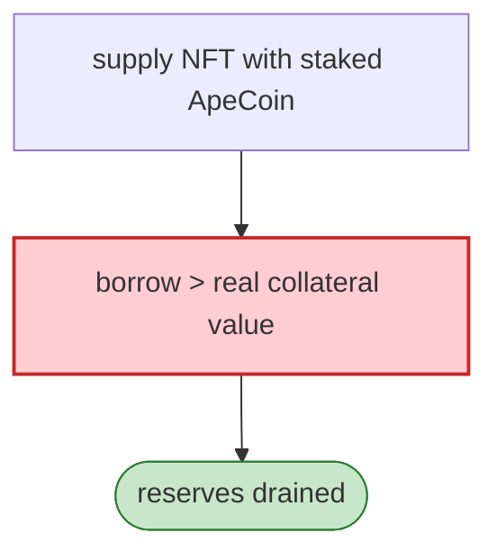

# ParaSpace Exploit (variant 1) — ApeCoin Staking Supply/Borrow Reentrancy

> **Reproduction:** the PoC compiles & runs in an isolated Foundry project at
> [this project folder](.). Full verbose trace: [output.txt](output.txt).

---

## Key info

| | |
|---|---|
| **Loss** | Mar 2023 ParaSpace incident; tx `0xe3f0d14c…` |
| **Vulnerable contract** | ParaSpace NFT money market (`ParaProxy`) + `ApeCoinStaking` |
| **Chain / block / date** | Ethereum mainnet / Mar 2023 |
| **Bug class** | ApeCoin-staking collateral mis-accounting + missing withdraw/borrow timelock (same root cause as variant 2). |

---

## TL;DR

Same root cause as the `Paraspace_exp_2` variant: ParaSpace valued BAYC/MAYC collateral inclusive of
the ApeCoin staked on those NFTs, and permitted same-transaction `supply` → `borrow`, so an attacker
captured the inflated staking-collateral value to over-borrow the pool's reserves. The applied fix was
a withdraw/borrow timelock (para-space PR #368).

---

## Root cause

A **collateral-accounting flaw + missing withdraw/borrow timelock** in the ApeCoin-staking-collateral
integration. (See `2023-03-Paraspace_exp_2` for the same analysis.)

---

## Diagrams



---

## Remediation

1. Withdraw/borrow timelock (applied fix).
2. Correct staking-collateral valuation; conservative LTV; `nonReentrant` + CEI.

---

## How to reproduce

```bash
_shared/run_poc.sh 2023-03-paraspace_exp -vvvvv
```

- RPC: mainnet archive. Result: `[PASS]` — reserves drained via staking-collateral mis-accounting.

---

*Reference: ParaSpace ApeCoin-staking supply/borrow flaw (variant 1), mainnet, Mar 2023.*
