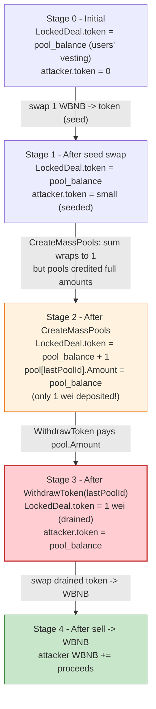
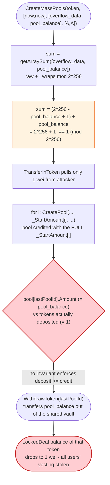
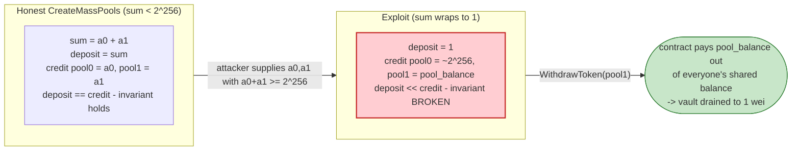

# Poolz LockedDeal Exploit — Integer Overflow in `getArraySum` Crediting Free Vesting Pools

> **Vulnerability classes:** vuln/arithmetic/overflow · vuln/logic/missing-check

> **Reproduction:** the PoC compiles & runs in an isolated Foundry project at
> [this project folder](.). Full verbose trace: [output.txt](output.txt).
> Verified vulnerable source: [LockedDeal.sol](sources/LockedDeal_8BfAA4/LockedDeal.sol).

---

## Key info

| | |
|---|---|
| **Loss** | ~$390K — multiple Poolz vesting tokens (**MNZ, SIP, WOD, ECIO**) drained on BSC. PoC ends with the attack contract holding **51.858 WBNB** ([output.txt:2311](output.txt)) after repaying a 1 WBNB flash loan. |
| **Vulnerable contract** | Poolz `LockedDeal` (vesting) — [`0x8BfAA473a899439d8E07BF86a8C6cE5De42fE54B`](https://bscscan.com/address/0x8BfAA473a899439d8E07BF86a8C6cE5De42fE54B#code) |
| **Victim vault** | `LockedDeal` contract balances of MNZ/WOD/SIP/ECIO deposited by users for token vesting |
| **Attacker EOA / contract** | PoC attack contract `ContractTest` @ [`0x7FA9385bE102ac3EAc297483Dd6233D62b3e1496`](https://bscscan.com/address/0x7FA9385bE102ac3EAc297483Dd6233D62b3e1496) (the DeFiHackLabs reproduction; the live attacker tx is on BSC) |
| **Attack tx** | Poolz exploit, BSC, 15 Mar 2023 — block **26,475,403** (fork block) |
| **Chain / block / date** | BSC (chainId 56) / 26,475,403 / 2023-03-15 |
| **Flash source** | DODO DPPAdvanced pool — [`0x6098A5638d8D7e9Ed2f952d35B2b67c34EC6B476`](https://bscscan.com/address/0x6098A5638d8D7e9Ed2f952d35B2b67c34EC6B476) (1 WBNB, [output.txt:1589](output.txt)) |
| **Compiler / optimizer** | Solidity **v0.6.12** (`+commit.27d51765`), optimizer **enabled**, **200 runs** ([_meta.json](sources/LockedDeal_8BfAA4/_meta.json)) |
| **Bug class** | Integer **overflow** in unchecked arithmetic — `getArraySum` sums pool amounts with raw `+` (no SafeMath), so a crafted two-element amount array wraps to ~1 while each individual pool is still credited at full face value. |

---

## TL;DR

`LockedDeal` is a Poolz token-vesting contract compiled with Solidity **0.6.12**, which does **not** revert on integer overflow. The vesting logic correctly uses `SafeMath.add/sub` almost everywhere — but `CreateMassPools` first computes the total deposit it must pull from the caller via an internal helper, `getArraySum`, that sums the per-pool `_StartAmount[]` array with **plain `+`** ([LockedDeal.sol:1190-1196](sources/LockedDeal_8BfAA4/LockedDeal.sol#L1190-L1196)).

1. The attacker crafts a two-element amount array `[overflow_data, pool_balance]` where `overflow_data = type(uint256).max - pool_balance + 2`. The raw `+` sum wraps modulo 2²⁵⁶ to **1**:
   `overflow_data + pool_balance = (2²⁵⁶ − 1 − pool_balance + 2) + pool_balance = 2²⁵⁶ + 1 ≡ 1`.
2. `CreateMassPools` calls `TransferInToken(token, msg.sender, getArraySum(...))`, so it pulls only **1 wei** of the token from the attacker — yet the per-pool `CreatePool` loop still registers two pools with the **full** amounts `overflow_data` and `pool_balance` ([LockedDeal.sol:1157-1163](sources/LockedDeal_8BfAA4/LockedDeal.sol#L1157-L1163)).
3. The attacker sets `_Owner = address(this)` and `_FinishTime = now`, so the second pool (id = `lastPoolId`) is immediately withdrawable by them. They call `WithdrawToken(lastPoolId)` and the contract transfers its **entire on-chain balance** of that token (the vesting balance of every legitimate user) back to the attacker ([LockedDeal.sol:1247-1263](sources/LockedDeal_8BfAA4/LockedDeal.sol#L1247-L1263)).
4. The attacker repeats the trick for MNZ, SIP, WOD and ECIO, sells each drained token back to WBNB via PancakeSwap, repays the 1 WBNB flash loan, and keeps the surplus — **~51.858 WBNB** in the PoC ([output.txt:2311](output.txt)); the live incident totalled ~$390K.

---

## Background — what Poolz LockedDeal does

`LockedDeal` ([source](sources/LockedDeal_8BfAA4/LockedDeal.sol)) is Poolz' token-vesting / lockup contract. A project (or any user) deposits an ERC20 and creates a "pool" that releases the tokens to a beneficiary (`Owner`) once an `UnlockTime` has passed. The core data structure is:

```solidity
struct Pool {
    uint64 UnlockTime;
    uint256 Amount;
    address Owner;
    address Token;
    mapping(address => uint) Allowance;
}
mapping(uint256 => Pool) AllPoolz;
uint256 internal Index;   // monotonic pool id counter
```

Key entry points used in the exploit:

- **`CreateMassPools(_Token, _FinishTime[], _StartAmount[], _Owner[])`** — bulk-create N vesting pools. It pulls `sum(_StartAmount)` from `msg.sender` up front, then registers each pool. Returns `(firstPoolId, lastPoolId)`.
- **`WithdrawToken(_PoolId)`** — if `UnlockTime <= now` and `Amount > 0`, transfer the pool's `Amount` of `Token` to `pool.Owner` and zero the pool. Notably it has **no** `isPoolOwner` modifier — it pays whoever the pool says the owner is.
- **`TransferInToken` / `TransferToken`** — guarded ERC20 pull/push helpers that do a before/after balance check (a fee-on-transfer defence).

On-chain parameters at the fork block (read from [output.txt](output.txt) balance reads):

| Parameter | Value | Note |
|---|---|---|
| `LockedDeal` MNZ balance (vesting) | `61,856,797,091,635,905,326,850,000` (~61.86M MNZ) | [output.txt:1702](output.txt) — the prize, withdrawable to whoever owns a MNZ pool |
| `LockedDeal` SIP balance | `29,032,275,688,743,400,000,000,000` (~29.03M) | [output.txt:1569/1879](output.txt) |
| `LockedDeal` WOD balance | `35,975,413.1867251` WOD (~35.98M) | [output.txt:1573/2044](output.txt) |
| `LockedDeal` ECIO balance | `252,152,268.7348545` ECIO (~252.15M) | [output.txt:1577](output.txt) |
| Pool `UnlockTime` used | `1678850159` (== `block.timestamp` at fork) | [output.txt:1703](output.txt) — set to `now` so pools are instantly withdrawable |
| Flash-loan amount | 1 WBNB | [output.txt:1589](output.txt) |
| `Index` before attack | 158970 | [output.txt:1719](output.txt) |

The whole vulnerability hinges on the contrast between two facts: `LockedDeal` was compiled with Solidity **0.6.12** (no automatic overflow checks), and `getArraySum` is the one spot in the amount math that forgot to use SafeMath.

---

## The vulnerable code

### 1. `getArraySum` sums with raw `+` (no SafeMath) — the overflow

```solidity
function getArraySum(uint256[] calldata _array) internal pure returns(uint256) {
    uint256 sum = 0;
    for(uint i=0 ; i<_array.length ; i++){
        sum = sum + _array[i];          // ⚠️ plain +, NOT SafeMath — wraps mod 2^256
    }
    return sum;
}
```
([LockedDeal.sol:1190-1196](sources/LockedDeal_8BfAA4/LockedDeal.sol#L1190-L1196))

Every other amount operation in the contract uses the SafeMath library (`using SafeMath for uint256;`, [:359](sources/LockedDeal_8BfAA4/LockedDeal.sol#L359)), e.g. `Index = SafeMath.add(Index, 1)` in `CreatePool` ([:1073](sources/LockedDeal_8BfAA4/LockedDeal.sol#L1073)). `getArraySum` is the lone exception.

### 2. `CreateMassPools` trusts the wrapped sum for the deposit, but credits full per-pool amounts

```solidity
function CreateMassPools(
    address _Token,
    uint64[] calldata _FinishTime,
    uint256[] calldata _StartAmount,
    address[] calldata _Owner
) external isGreaterThanZero(_Owner.length) isBelowLimit(_Owner.length) returns(uint256, uint256) {
    require(_Owner.length == _FinishTime.length, "Date Array Invalid");
    require(_Owner.length == _StartAmount.length, "Amount Array Invalid");
    TransferInToken(_Token, msg.sender, getArraySum(_StartAmount));   // ⚠️ pulls only the wrapped sum
    uint256 firstPoolId = Index;
    for(uint i=0 ; i < _Owner.length; i++){
        CreatePool(_Token, _FinishTime[i], _StartAmount[i], _Owner[i]); // ⚠️ credits full _StartAmount[i]
    }
    uint256 lastPoolId = SafeMath.sub(Index, 1);
    return (firstPoolId, lastPoolId);
}
```
([LockedDeal.sol:1149-1164](sources/LockedDeal_8BfAA4/LockedDeal.sol#L1149-L1164))

`CreatePool` simply writes the supplied `_StartAmount` into `AllPoolz[Index].Amount` with **no** check that the contract actually holds that much ([LockedDeal.sol:1062-1075](sources/LockedDeal_8BfAA4/LockedDeal.sol#L1062-L1075)). The mismatch between "what was deposited" (the wrapped sum) and "what was credited" (the raw array elements) is the entire bug.

### 3. `WithdrawToken` pays out the (inflated) `Amount` to the pool's `Owner`

```solidity
//@dev no use of revert to make sure the loop will work
function WithdrawToken(uint256 _PoolId) public returns (bool) {
    //pool is finished + got left overs + did not took them
    if (
        _PoolId < Index &&
        AllPoolz[_PoolId].UnlockTime <= now &&
        AllPoolz[_PoolId].Amount > 0
    ) {
        TransferToken(
            AllPoolz[_PoolId].Token,
            AllPoolz[_PoolId].Owner,      // ← attacker set _Owner = address(this)
            AllPoolz[_PoolId].Amount       // ← the inflated, full vesting balance
        );
        AllPoolz[_PoolId].Amount = 0;
        return true;
    }
    return false;
}
```
([LockedDeal.sol:1247-1263](sources/LockedDeal_8BfAA4/LockedDeal.sol#L1247-L1263))

Note the comment "no use of revert to make sure the loop will work" and the absence of any `isPoolOwner(_PoolId)` check — `WithdrawToken` is callable by anyone and simply routes the tokens to `pool.Owner`. The attacker made themselves the owner, so the drained tokens come straight back.

---

## Root cause — why it was possible

Three independent defects compose into the loss:

1. **Unchecked arithmetic in `getArraySum`.** Solidity 0.6.x has no built-in overflow protection. `sum = sum + _array[i]` silently wraps modulo 2²⁵⁶. An attacker who controls two array elements whose sum exceeds 2²⁵⁶ − 1 can make the function return any small value they want — here, **1**. The rest of the contract uses SafeMath, which is exactly what makes this single omission dangerous: reviewers assume "the contract is SafeMath-clean," but one helper is not.

2. **Deposit accounting is divorced from credit accounting.** `CreateMassPools` pulls `getArraySum(_StartAmount)` from the caller but then registers each pool with the **raw** `_StartAmount[i]`. There is no invariant "sum of credited pool amounts ≤ tokens actually transferred in." The `TransferInToken` balance-check guard ([LockedDeal.sol:679-693](sources/LockedDeal_8BfAA4/LockedDeal.sol#L679-L693)) only verifies that the contract received the (wrapped) `1 wei`; it cannot detect that two pools were just credited for ~2²⁵⁶ + pool_balance tokens.

3. **`WithdrawToken` pays `pool.Amount` straight out of the contract's shared token balance.** Vesting pools are not isolated buckets — they are accounting entries against one shared ERC20 balance. So a pool credited with `pool_balance` drains the contract's *entire* balance of that token, stealing the vesting allocations of every other user. Combined with `_FinishTime = now` (instantly unlocked) and `_Owner = attacker`, the withdrawal is immediate and self-directed.

The classic SafeMath-vs-plain-`+` mistake plus a missing accounting invariant is a well-known pre-0.8 footgun; here it is weaponised against a vesting vault that holds many users' tokens at once.

---

## Preconditions

- The caller must have **ERC20 allowance** ≥ the (wrapped, ~1 wei) sum on `LockedDeal` for the target token — trivially satisfied; the PoC approves `type(uint256).max` ([poolz_exp.sol:53](test/poolz_exp.sol#L53)).
- The target token must be on the LockedDeal whitelist (`isTokenValid`/`isTokenWhiteListed` modifier). MNZ, SIP, WOD, ECIO all were.
- `_FinishTime[i]` must be `<= now` for the created pool to be withdrawable in the same transaction. The PoC sets it to `block.timestamp` ([poolz_exp.sol:69-70](test/poolz_exp.sol#L69-L70)).
- Working capital to enter the vesting token (so the `transferFrom` of 1 wei succeeds and the `OldBalance+Amount==NewBalance` check passes meaningfully). The PoC flash-borrows 1 WBNB and swaps it into each token before the attack step — this is just to seed a non-zero balance; the drain itself needs essentially zero capital.

---

## Attack walkthrough (with on-chain numbers from the trace)

All amounts are raw wei / 18-decimal human approximations, taken directly from the events in [output.txt](output.txt). The attack runs identically for each of the four tokens; the MNZ leg is shown in full and the others summarised.

| # | Step | LockedDeal token balance | Effect | Trace ref |
|---|------|-------------------------:|--------|-----------|
| 0 | **Flash-loan 1 WBNB** from DPPAdvanced ([output.txt:1589](output.txt)) | — | Attack contract funded with 1 WBNB. | [output.txt:1589](output.txt) |
| 1 | **Swap 1 WBNB → MNZ** via PancakeRouter (WBNB→BUSD→MNZ), receive `869,563,256,508,305,768,528,329` MNZ (~869.6K MNZ) | — | Seeds attacker MNZ balance (only 1 wei is needed). | [output.txt:1610, 1643](output.txt) |
| 2 | **Read `mnz.balanceOf(LockedDeal)`** = `61,856,797,091,635,905,326,850,000` (~61.86M MNZ) — this becomes `pool_balance` | 61,856,797,091,635,905,326,850,000 | The amount that will be drained. | [output.txt:1702](output.txt) |
| 3 | **Build `overflow_data = type(uint256).max − pool_balance + 2`** = `115792089237316195423570985008687907853269984665640502182660492372007802789937` (~1.157e77); `transfer_data = [overflow_data, pool_balance]` | — | Two-element array whose raw `+` sum wraps to 1. | [output.txt:1703](output.txt) |
| 4 | **`CreateMassPools(MNZ, [now, now], [overflow_data, pool_balance], [attacker, attacker])`** | 61,856,797,091,635,905,326,850,000 → 61,856,797,091,635,905,326,850,**001** | `TransferInToken` pulls only **1 wei** MNZ (`TransferIn Amount: 1`); creates pool **158970** with `StartAmount = overflow_data` and pool **158971** with `StartAmount = pool_balance` (61.857M MNZ). | [output.txt:1703-1720](output.txt) |
| 5 | **`WithdrawToken(158971)`** | 61,856,797,091,635,905,326,850,001 → **1** | `TransferOut Amount: 61,856,797,091,635,905,326,850,000` MNZ to attacker; pool amount zeroed. LockedDeal left with 1 wei MNZ. | [output.txt:1735-1740](output.txt) |
| 6 | **`sellmnz()`** — sell all drained MNZ (~62.7M incl. seeded) via PancakeRouter (MNZ→BUSD→WBNB) | — | Attacker WBNB: 1 → **28.373 WBNB** ([output.txt:1811](output.txt)). | [output.txt:1755, 1811](output.txt) |

The SIP, WOD and ECIO legs repeat steps 1–6 identically. Each begins by unwrapping 1 WBNB (the `wbnb.withdraw(1e18)` calls in the PoC, [poolz_exp.sol:95/123/152](test/poolz_exp.sol)), swapping it into the token, and running the same overflow trick:

| Token | Pool balance before (vesting) | Pool id drained | `TransferOut` amount (raw wei) | WBNB after leg | Trace refs |
|-------|------------------------------:|:---------------:|-------------------------------:|---------------:|------------|
| MNZ | 61,856,797,091,635,905,326,850,000 (~61.86M) | 158971 | 61,856,797,091,635,905,326,850,000 | 28.373 WBNB | [1566, 1738](output.txt) |
| SIP | 29,032,275,688,743,400,000,000,000 (~29.03M) | 158973 | 29,032,275,688,743,400,000,000,000 | 46.127 WBNB | [1569, 1917](output.txt) |
| WOD | 35,975,413,186,725,149,349,550,000 (~35.98M) | 158975 | 35,975,413,186,725,149,349,550,000 | 46.177 WBNB | [1573, 2080](output.txt) |
| ECIO | 252,152,268,734,854,541,525,400,000 (~252.15M) | 158977 | 252,152,268,734,854,541,525,400,000 | **51.858 WBNB** | [1577, 2235](output.txt) |

After each `WithdrawToken`, the corresponding `LockedDeal` token balance collapses to **1 wei** — e.g. SIP: `[After sip Exp] pool sip balance: 0.000000000000000001` ([output.txt:1570/1993](output.txt)); WOD and ECIO likewise ([output.txt:1574/1578](output.txt)).

### Profit / loss accounting (WBNB, the realised proceeds asset)

The PoC does not assert a single "profit" constant; it logs the attack contract's WBNB balance before/after each leg and finally transfers 1 WBNB back to the flash-loan pool ([poolz_exp.sol:185](test/poolz_exp.sol#L185)).

| Item | WBNB |
|---|---:|
| Flash-loaned capital (borrowed) | 1.000 |
| Spent buying MNZ (1 WBNB → MNZ) | 1.000 |
| **Received selling drained MNZ** | **28.373** ([output.txt:1811](output.txt)) |
| Net after MNZ leg | 28.373 |
| Re-invest 1 WBNB → SIP, sell SIP → WBNB | +18.754 → 46.127 ([output.txt:1996](output.txt)) |
| Re-invest 1 WBNB → WOD, sell WOD → WBNB | +0.050 → 46.177 ([output.txt:2133](output.txt)) |
| Re-invest 1 WBNB → ECIO, sell ECIO → WBNB | +5.681 → **51.858** ([output.txt:2308/2311](output.txt)) |
| Repay flash loan (1 WBNB to DPPAdvanced, [output.txt:~tail](output.txt)) | −1.000 |
| **Final attacker WBNB balance (log)** | **51.858 WBNB** ([output.txt:2311](output.txt)) |

The 51.858 WBNB is the PoC's reproduction of the drain; the live March-2023 incident (same bug, larger/multiple runs) totalled ~**$390K** across the drained vesting tokens.

---

## Diagrams

### Sequence of the attack (per token leg)

```mermaid
sequenceDiagram
    autonumber
    actor A as Attacker (ContractTest)
    participant FL as DPPAdvanced flash pool
    participant R as PancakeRouter
    participant LD as LockedDeal (0x8BfAA4)
    participant T as Vesting token (MNZ/SIP/WOD/ECIO)

    A->>FL: flashLoan(1 WBNB)
    FL-->>A: 1 WBNB
    A->>R: swapExactETHForTokens(1 WBNB -> token)
    R-->>A: small token amount (seed)
    A->>A: pool_balance = token.balanceOf(LD)
    A->>A: overflow_data = type(uint256).max - pool_balance + 2
    A->>LD: CreateMassPools(token, [now,now], [overflow_data, pool_balance], [A,A])
    Note over LD: getArraySum = overflow_data + pool_balance<br/>wraps mod 2^256 to 1
    LD->>A: transferFrom(A, LD, 1)   // pulls only 1 wei
    LD->>LD: CreatePool(...) x2 (credits full amounts)
    Note over LD: pool lastPoolId.Amount = pool_balance<br/>(the contract's whole vesting balance)
    A->>LD: WithdrawToken(lastPoolId)
    LD->>A: token.transfer(A, pool_balance)   // drains the vault to 1 wei
    A->>R: swapExactTokensForTokens(... -> WBNB)
    R-->>A: WBNB
    A->>FL: transfer(1 WBNB)  // repay
    Note over A: surplus WBNB kept; repeat for next token
```

### Vault state evolution (per token)



### The flaw inside `CreateMassPools` / `getArraySum`



### Why the wrap is theft: deposit vs. credit accounting



---

## Why each magic number

- **`type(uint256).max - mnz_balance + 2`** ([poolz_exp.sol:66](test/poolz_exp.sol#L66)) — chosen so that `overflow_data + pool_balance = 2²⁵⁶ + 1`, which wraps to **1**. Any value that makes the wrap land on a tiny positive number works; `+2` (rather than `+1`) yields a sum of exactly `1` because `(2²⁵⁶−1)−b+2 + b = 2²⁵⁶+1 ≡ 1`. The deposit check `TransferInToken` then sees `Amount = 1 > 0` and pulls exactly 1 wei.
- **`pool_balance` as the second array element and as the drained pool** ([poolz_exp.sol:63, 74](test/poolz_exp.sol#L63)) — set to `token.balanceOf(LockedDeal)` so the credited-and-withdrawn pool equals the contract's entire vesting balance of that token. This maximises the drain to 100% of the vault.
- **`_FinishTime[i] = block.timestamp`** ([poolz_exp.sol:69-70](test/poolz_exp.sol#L69)) — makes `UnlockTime <= now` true in `WithdrawToken`, so the pool is withdrawable in the same transaction.
- **`_Owner[i] = address(this)`** ([poolz_exp.sol:77-78](test/poolz_exp.sol#L77)) — routes the drained tokens back to the attack contract. `WithdrawToken` has no caller-ownership check, so this is all that is needed.
- **1 WBNB flash loan** ([poolz_exp.sol:35](test/poolz_exp.sol#L35)) — only enough to seed a non-zero token balance (so the 1-wei `transferFrom` succeeds) for the first leg; subsequent legs reuse WBNB already earned.
- **Four tokens (MNZ, SIP, WOD, ECIO)** — each was whitelisted on `LockedDeal` and held a large vesting balance, so each is drained independently with the identical trick.

---

## Remediation

1. **Use checked math (Solidity ≥0.8) or SafeMath in `getArraySum`.** Replace `sum = sum + _array[i]` with `sum = sum.add(_array[i])`. This alone makes the wrap revert and blocks the exploit. Better: upgrade the whole contract to Solidity 0.8.x so every arithmetic operation is checked by default.
2. **Enforce the deposit-vs-credit invariant.** After crediting all pools, assert that the sum of newly credited `Amount`s does not exceed the tokens actually transferred in: `require(getArraySum(_StartAmount) == actualReceived)`. `TransferInToken` already measures `actualReceived` via the before/after balance check — return it and compare.
3. **Validate each `_StartAmount[i]` against available balance.** `CreatePool` should require the contract holds at least the cumulative credited amount before writing `AllPoolz[Index].Amount`. Do not credit pools for tokens that were never deposited.
4. **Add `isPoolOwner` to `WithdrawToken`** (or at least route only to `msg.sender`). Paying `pool.Owner` from a public function with no caller check is an unnecessary risk; it worked here only because the attacker set themselves as owner, but it is a latent bug for any pool whose owner is set carelessly.
5. **Isolate per-pool balances or use an internal accounting ledger** rather than letting one pool's `Amount` draw against a shared ERC20 balance that belongs to many users. An invariant test ("total credited ≤ contract balance for every token") would have caught this immediately.

---

## How to reproduce

The PoC is run offline through the shared harness, which serves the fork from a local `anvil_state.json` snapshot (the `createSelectFork` in the test points at `http://127.0.0.1:8546`, block 26,475,403):

```bash
_shared/run_poc.sh 2023-03-poolz_exp --mt testExploit -vvvvv
```

- **Test function:** `testExploit` ([poolz_exp.sol:31](test/poolz_exp.sol#L31)).
- **EVM / compiler:** `foundry.toml` sets `evm_version = 'cancun'`; the *vulnerable* `LockedDeal` was originally compiled with Solidity **0.6.12**, optimizer on, 200 runs ([_meta.json](sources/LockedDeal_8BfAA4/_meta.json)). The PoC itself is `pragma solidity ^0.8.10` and only *calls* the pre-deployed 0.6.12 bytecode — the overflow happens inside that legacy bytecode, exactly as on-chain.
- **No public RPC required:** the fork is served from the local anvil snapshot (`anvil_state.json`), not a live endpoint.

Expected tail (from [output.txt:1561-1580, 2311, 2333-2334](output.txt)):

```
Ran 1 test for test/poolz_exp.sol:ContractTest
[PASS] testExploit() (gas: 2093681)
Logs:
  Flashloan attacks
  [Before mnz Exp] wbnb  balance: 1.000000000000000000
  [mnz Exp] mnz pool balance: 62726360.348144211095378328
  [After mnz Exp] wbnb  balance: 28.373143564821602144
  ...
  [After ecio Exp] wbnb  balance: 51.858408798435871533
  [Total exploit wbnb balance ] wbnb  balance: 51.858408798435871533

Suite result: ok. 1 passed; 0 failed; 0 skipped; finished in 37.89s (36.61s CPU time)

Ran 1 test suite in 38.43s (37.89s CPU time): 1 tests passed, 0 failed, 0 skipped (1 total tests)
```

---

*Reference: Poolz LockedDeal `createMassPools` / `getArraySum` integer-overflow drain, BSC, 15 Mar 2023 (~$390K). DeFiHackLabs reproduction — https://github.com/SunWeb3Sec/DeFiHackLabs .*
