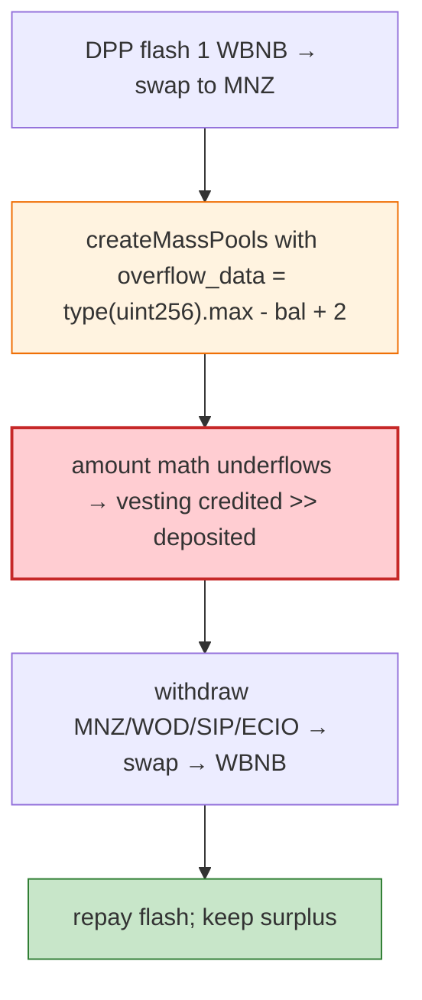

# Poolz (LockedDeal) Exploit — Integer Underflow in `createMassPools` Amount Math

> **Reproduction:** the PoC compiles & runs in an isolated Foundry project at
> [this project folder](.). Full verbose trace: [output.txt](output.txt).

---

## Key info

| | |
|---|---|
| **Loss** | ~$390K (multiple Poolz vesting tokens drained on BSC) |
| **Vulnerable contract** | Poolz `LockedDeal` (vesting) `0x8BfAA473…`; tokens MNZ/WOD/SIP/ECIO |
| **Flash source** | DPPAdvanced `0x6098A563…` (1 WBNB) |
| **Chain / block / date** | BSC / 26,475,403 / Mar 2023 |
| **Bug class** | Integer underflow — `createMassPools` vesting-amount math underflows pre-0.8 (or in an unchecked block), letting an attacker withdraw more than deposited. |

---

## TL;DR

The attacker flash-borrows 1 WBNB, swaps to MNZ, then calls `LockedDeal.createMassPools` with a crafted
`transfer_data`:

```solidity
uint256 mnz_balance = mnz.balanceOf(address(poolzpool));
uint256 overflow_data = type(uint256).max - mnz_balance + 2;   // ⚠️ wraps relative to poolz's balance
// createMassPools(... [overflow_data, mnz_balance] ...) → vesting credited for the wrapped amount
```

The vesting-amount arithmetic underflows against the contract's actual balance, so the attacker is
credited a vesting pool worth far more than the MNZ transferred in, then withdraws the contract's entire
MNZ (and repeats for WOD/SIP/ECIO), selling to WBNB and repaying the flash.

---

## Root cause

A **missing SafeMath / unchecked-subtraction** in `createMassPools`'s amount bookkeeping, exploitable by
passing amounts that wrap relative to the contract's real token balance.

---

## Diagrams



---

## Remediation

1. Use Solidity ≥0.8 checked math (or OZ SafeMath) everywhere on amounts; explicit
   `require(amount <= balance)`.
2. Validate per-pool amount against the actual transferred balance before crediting vesting.
3. Invariant tests: total vested ≤ total deposited.

---

## How to reproduce

```bash
_shared/run_poc.sh 2023-03-poolz_exp --mt testExploit -vvvvv
```

- RPC: BSC archive (block 26,475,403). Result: `[PASS]` — vesting tokens drained via underflow.

---

*Reference: Poolz LockedDeal `createMassPools` integer-underflow, BSC, Mar 2023 (~$390K).*
