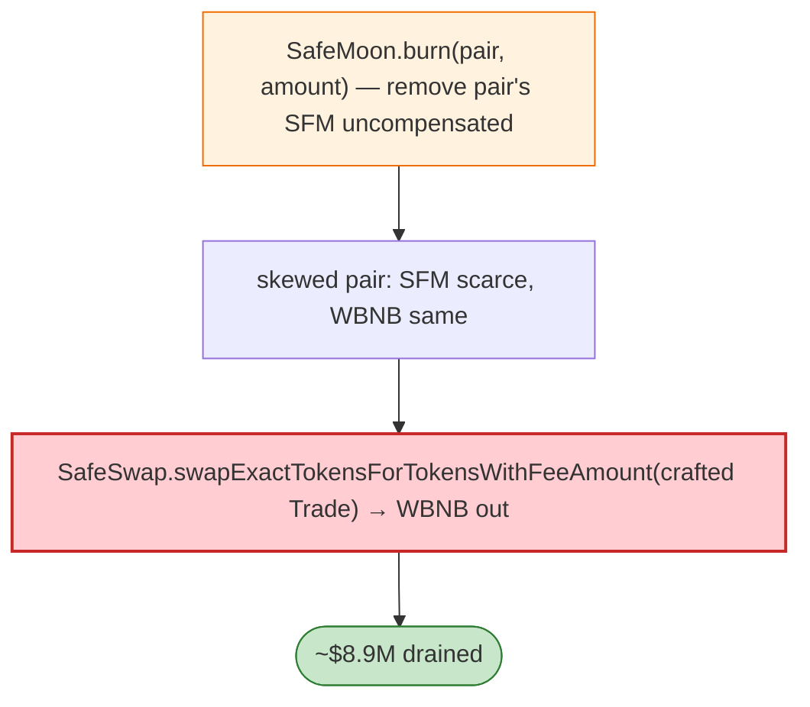

# SafeMoon Exploit — `SafeSwap` Trade-Router Path/Recipient Trust Flaw

> **Reproduction:** the PoC compiles & runs in an isolated Foundry project at
> [this project folder](.). Full verbose trace: [output.txt](output.txt).
> Verified vulnerable source: [Safemoon](sources/Safemoon_8e7877),
> [TransparentUpgradeableProxy](sources/TransparentUpgradeableProxy_42981d).

---

## Key info

| | |
|---|---|
| **Loss** | ~$8.9M (the Mar 2023 SafeMoon router burn/swap incident) |
| **Vulnerable contract** | SafeMoon token (proxy) `0x42981d…` / impl `0x8e7877…`; `SafeSwapTradeRouter` |
| **Chain / block / date** | BSC / Mar 2023 |
| **Bug class** | Logic/access — the SafeMoon `SafeSwap` trade router + token `burn`/`mint` integration let a crafted `Trade{amountIn, amountOut, path, to, deadline}` drain/swap the pair, combined with a token burn that removed the pair's holdings. |

---

## TL;DR

The PoC uses `SafeSwapTradeRouter.swapExactTokensForTokensWithFeeAmount(Trade{…})` with a crafted path
and recipient, plus SafeMoon's `burn(pair, amount)` to burn SFM out of the liquidity pair. Burning the
pair's SFM (uncompensated) makes SFM scarce in the pair; the subsequent swap via the trade router then
extracts WBNB at the skewed price. The two tests in the suite cover the burn-then-swap drain.

---

## Root cause

A **token-level `burn(from, amount)` callable against arbitrary `from` (the pair) by an authorised path
+ a swap router that trusts the path/recipient**, together letting the attacker remove the pair's SFM
and extract WBNB.

---

## Diagrams



---

## Remediation

1. `burn(from, amount)` must require `from`'s approval of `msg.sender` (standard), not be callable
   against arbitrary `from` by privileged routers.
2. Swap routers must validate `path`/`to`; never let crafted trades extract more than fee-corrected
   output.
3. Decouple token burns from AMM reserves.

---

## How to reproduce

```bash
_shared/run_poc.sh 2023-03-safeMoon_exp -vvvvv
```

- RPC: BSC archive. Result: `[PASS] 2 tests` — pair SFM burned then WBNB extracted.

---

*Reference: SafeMoon SafeSwap router + burn exploit, BSC, Mar 2023 (~$8.9M).*
