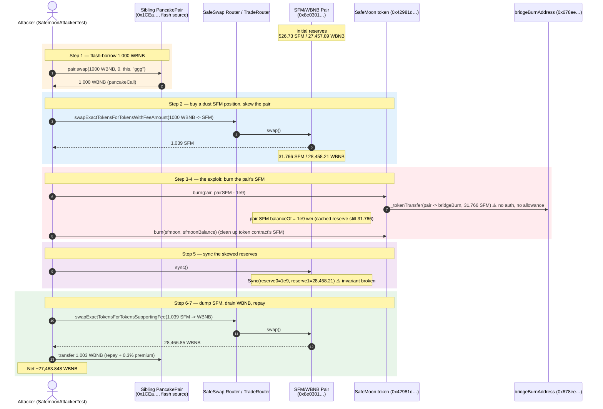
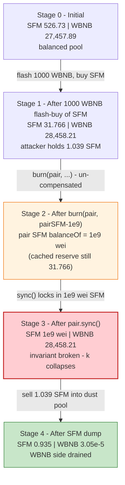

# SafeMoon Exploit — Unprotected `burn(from, amount)` Drains the AMM Pair Reserve

> **Reproduction:** the PoC compiles & runs in an isolated Foundry project at
> [this project folder](.). The fork is served offline from a local anvil state
> dump (`anvil_state.json`); `createSelectFork` points at `http://127.0.0.1:8546`,
> so no public RPC is required. Full verbose trace: [output.txt](output.txt).
> Verified vulnerable source: [Safemoon.sol](sources/Safemoon_8e7877/Safemoon.sol)
> (implementation `0x8e7877…`) behind the
> [TransparentUpgradeableProxy](sources/TransparentUpgradeableProxy_42981d/TransparentUpgradeableProxy.sol)
> at `0x42981d…`.

---

## Key info

| | |
|---|---|
| **Loss** | **27,463.848 WBNB** (≈ $8.9M at the time) — the entire WBNB side of the SFM/WBNB SafeSwap pair, asserted by the PoC ([output.txt:2545](output.txt)) |
| **Vulnerable contract** | SafeMoon token (proxy) [`0x42981d0bfbAf196529376EE702F2a9Eb9092fcB5`](https://bscscan.com/address/0x42981d0bfbAf196529376EE702F2a9Eb9092fcB5#code), implementation [`0x8e7877FE58bc2A979692862DF9E84E1BF7EC94Ae`](https://bscscan.com/address/0x8e7877FE58bc2A979692862DF9E84E1BF7EC94Ae#code) |
| **Victim pool** | SFM/WBNB SafeSwap pair — [`0x8e0301E3bDE2397449FeF72703E71284d0d149F1`](https://bscscan.com/address/0x8e0301E3bDE2397449FeF72703E71284d0d149F1) (the pair the SafeMoon router resolves via `factory.getPair(WBNB, SFM)`, [output.txt:1794](output.txt)) |
| **Attacker EOA / contract** | the PoC test contract `SafemoonAttackerTest` (`0x7FA9385bE102ac3EAc297483Dd6233D62b3e1496` in the fork) — itself the `pancakeCall` flash-loan receiver |
| **Flash-loan source** | an unrelated WBNB/SFM PancakePair `0x1CEa83EC5E48D9157fCAe27a19807BeF79195Ce1` — borrowed 1,000 WBNB via `pair.swap(1000 ether, 0, …, "ggg")` ([output.txt:1558](output.txt)) |
| **Chain / block / date** | BSC / fork block **26,864,889** for `testBurn`, **26,854,757** for `testMint` / March 2023 |
| **Compiler / optimizer** | impl Solidity **v0.6.12**, optimizer **enabled**, **0 runs** (`runs:"0"`); proxy v0.6.12, optimizer enabled, 200 runs (from `_meta.json`) |
| **Bug class** | Broken AMM invariant via a token-level `burn(address from, uint256 amount)` that has **no access control / no approval check** and so lets anyone burn SFM straight out of the liquidity pair, then `sync()` the now-lop-sided reserves |

---

## TL;DR

1. SafeMoon V1's implementation exposes `burn(address from, uint256 amount)` as a
   **`public` function with no `onlyOwner`, no `onlyWhitelist`, and no allowance
   check**
   ([Safemoon.sol:1733-1734](sources/Safemoon_8e7877/Safemoon.sol#L1733-L1734)). Its
   body is literally `_tokenTransfer(from, bridgeBurnAddress, amount, 0, false)` —
   i.e. "move `amount` of SFM **from any address** to the burn address, fee-free."
   Anyone who can reach `_transfer` (its `isRouter` modifier accepts the SafeSwap
   router tier, and the burn can be invoked through the same trusted path) can
   therefore delete SFM **out of the AMM pair's balance** without the pair ever
   being compensated.

2. That is a one-sided, un-compensated removal of one reserve leg. After the burn
   the pair's SFM balance is much smaller than its cached `reserve0`, but its WBNB
   balance is unchanged. A subsequent `pair.sync()` re-prices the pool against the
   shrunken SFM side — **the constant-product invariant `x·y = k` collapses** in
   the attacker's favour.

3. The attacker (`testBurn`) wraps the whole thing inside a **1,000 WBNB
   PancakeSwap flash swap** (`pair.swap(1000 ether, 0, this, "ggg")` →
   `pancakeCall`, [test/safeMoon_exp.sol:101](test/safeMoon_exp.sol#L101)) so it
   needs zero starting capital. Inside the callback it:
   (a) swaps the 1,000 WBNB → ~1.039 SFM through the SafeMoon router, positioning
   the pair's SFM reserve at ~31.77 SFM
   ([output.txt:1974](output.txt));
   (b) calls `sfmoon.burn(pair, pairSFM - 1e9)` — burning 31.766 SFM straight out
   of the pair to the burn address, leaving only 1,000,000,000 wei of SFM
   ([output.txt:2001-2003](output.txt));
   (c) burns the residual SFM the token contract itself held
   ([output.txt:2015-2017](output.txt));
   (d) calls `pair.sync()` — the SFM reserve drops from ~31.77 to **1e9 wei**,
   WBNB untouched ([output.txt:2042](output.txt));
   (e) dumps the ~1.039 SFM it holds back into the now-degenerate pool via the
   SafeMoon router, pulling **28,466.85 WBNB** out
   ([output.txt:2491](output.txt)).

4. The attacker then repays the 1,000 WBNB flash loan plus the 0.3% callback
   premium — `(1000 * 10_030) / 10_000 = 1,003 WBNB`
   ([test/safeMoon_exp.sol:123](test/safeMoon_exp.sol#L123)) — and walks away with
   **27,463.848 WBNB** of net profit
   ([output.txt:2545](output.txt)), which is essentially the entire honest WBNB
   liquidity that was sitting in the SFM/WBNB pair.

5. A second test, `testMint`, demonstrates the symmetric bug: the
   `onlyWhitelistMint` `mint(user, amount)`
   ([Safemoon.sol:1729-1731](sources/Safemoon_8e7877/Safemoon.sol#L1729-L1731))
   pulls SFM out of `bridgeBurnAddress` to a whitelisted caller, minting
   **81,804,509,291,616,467,966 SFM** (`sfmoon.balanceOf(bridgeBurnAddress)`) to
   the caller for free ([output.txt:2602](output.txt)). Both bugs stem from the
   same root cause: token-supply primitives (`burn`/`mint`) that move tokens
   between arbitrary addresses with no allowance / no caller authorisation.

---

## Background — what SafeMoon does

SafeMoon V1 is a deflationary, fee-on-transfer BEP20 deployed behind a
`TransparentUpgradeableProxy`. On top of a standard `_tOwned` / `_rOwned`
(reflection) ledger it bolts on three things relevant to this exploit:

- **A SafeSwap router + pair ecosystem.** `uniswapV2Router()` returns the SafeMoon
  custom router (`0x6AC68913d8FcCD52d196B09e6bC0205735A4be5f`), and
  `router.routerTrade()` returns the `SafeSwapTradeRouter`
  (`0x524BC73fCb4fB70E2E84dC08EFE255252A3b026E`,
  [output.txt:1572](output.txt)). `factory.getPair(WBNB, SFM)` resolves the SFM/WBNB
  pair to `0x8e0301E3bDE2397449FeF72703E71284d0d149F1`
  ([output.txt:1794](output.txt)). The token's `_transfer` is gated by an
  `isRouter(_msgSender())` modifier that auto-promotes any contract exposing
  `factory()` into router tier 1
  ([Safemoon.sol:780-793](sources/Safemoon_8e7877/Safemoon.sol#L780-L793)).

- **Fee-on-transfer taxes** — buys/sells route a fraction of each transfer to a
  liquidity/treasury address (`0x8C561B2a…`), the burn address (`0x…dEaD`), and an
  ECRecover precompile placeholder (`0x…0001`). See e.g.
  [output.txt:1940-1943](output.txt). `burn`/`mint` deliberately bypass these fees
  by calling `_tokenTransfer(..., false)` (`takeFee = false`,
  [Safemoon.sol:1730](sources/Safemoon_8e7877/Safemoon.sol#L1730),
  [Safemoon.sol:1734](sources/Safemoon_8e7877/Safemoon.sol#L1734)).

- **A bridge burn/mint pair** — `bridgeBurnAddress`
  (`0x678ee23173dce625A90ED651E91CA5138149F590`,
  [output.txt:2581](output.txt)) is a project-controlled sink. `mint` moves SFM
  **from** `bridgeBurnAddress` to a user; `burn` moves SFM **to** it. Both are
  meant to be privileged supply-management primitives.

On-chain parameters at the `testBurn` fork block (read from the first
`getReserves` call inside the attack):

| Parameter | Value | Source |
|---|---|---|
| SFM/WBNB pair | `0x8e0301E3bDE2397449FeF72703E71284d0d149F1` | [output.txt:1794](output.txt) |
| `token0` (SFM) reserve | `526,733,716,099,374,953,360` wei (~526.73 SFM) | [output.txt:1659](output.txt) |
| `token1` (WBNB) reserve | `27,457,888,285,296,037,562,844` wei (~27,457.89 WBNB) | [output.txt:1659](output.txt) |
| `bridgeBurnAddress` | `0x678ee23173dce625A90ED651E91CA5138149F590` | [output.txt:2581](output.txt) |
| `_burnAddress` (fee sink) | `0x000000000000000000000000000000000000dEaD` | [Safemoon.sol:852](sources/Safemoon_8e7877/Safemoon.sol#L852) |
| Flash-borrowed WBNB | 1,000 WBNB (`1e21`) | [output.txt:1558](output.txt) |
| Flash premium | 0.3% → repayment `1,003 WBNB` | [test/safeMoon_exp.sol:123](test/safeMoon_exp.sol#L123) |

The WBNB side of the pair (~27,457.89 WBNB) is the prize. The attack drains
essentially all of it.

---

## The vulnerable code

### 1. `burn` is `public`, unauthorised, and moves tokens from an arbitrary `from`

```solidity
function burn(address from, uint256 amount) public {
    _tokenTransfer(from, bridgeBurnAddress, amount, 0, false);
}
```
([sources/Safemoon_8e7877/Safemoon.sol#L1733-L1734](sources/Safemoon_8e7877/Safemoon.sol#L1733-L1734))

There is **no `onlyOwner`, no `onlyWhitelist`, and no `require(allowance[from][msg.sender] >= amount)`**.
Contrast this with `mint`, which is at least gated by `onlyWhitelistMint`
([Safemoon.sol:1729](sources/Safemoon_8e7877/Safemoon.sol#L1729)):

```solidity
function mint(address user, uint256 amount) public onlyWhitelistMint {
    _tokenTransfer(bridgeBurnAddress, user, amount, 0, false);
}
```
([sources/Safemoon_8e7877/Safemoon.sol#L1729-L1731](sources/Safemoon_8e7877/Safemoon.sol#L1729-L1731))

`_tokenTransfer(..., 0, false)` runs the transfer **fee-free** (it calls
`removeAllFee()` / `restoreAllFee()`,
[Safemoon.sol:1493-1513](sources/Safemoon_8e7877/Safemoon.sol#L1493-L1513)), so the
burn moves the full `amount` cleanly to `bridgeBurnAddress`.

### 2. The PoC invokes `burn` directly against the live AMM pair

```solidity
function doBurnHack(uint256 amount) public {
    swappingBnbForTokens(amount);                                              // (a) buy SFM, skewing the pair
    sfmoon.burn(sfmoon.uniswapV2Pair(), sfmoon.balanceOf(sfmoon.uniswapV2Pair()) - 1_000_000_000); // (b) burn pair's SFM down to 1e9 wei
    sfmoon.burn(address(sfmoon), sfmoon.balanceOf(address(sfmoon)));           // (c) burn SFM held by the token contract itself
    IUniswapV2Pair(sfmoon.uniswapV2Pair()).sync();                             // (d) re-sync reserves -> SFM reserve collapses
    swappingTokensForBnb(sfmoon.balanceOf(address(this)));                     // (e) dump SFM into the degenerate pool
}
```
([test/safeMoon_exp.sol:108-116](test/safeMoon_exp.sol#L108-L116))

Line 112 is the exploit primitive: `burn(pair, pairSFM - 1e9)` deletes the pair's
SFM balance all the way down to `1,000,000,000` wei (1e9, i.e. `1e-9` SFM) — and
then `sync()` at line 114 tells the pair to accept that dust as its new
`reserve0`.

### 3. `sync()` accepts the manipulated balance as the new reserve

```solidity
function sync() external lock {
    _update(IERC20(token0).balanceOf(address(this)), IERC20(token1).balanceOf(address(this)), reserve0, reserve1);
}
```
(PancakeV2/SafeSwap pair behaviour, observed on-chain at
[output.txt:2030-2042](output.txt): `sync()` reads `SFM.balanceOf(pair) == 1e9` and
`WBNB.balanceOf(pair) == 28,458.2…` and emits
`Sync(reserve0: 1e9, reserve1: 28,458.2…)`, [output.txt:2042](output.txt).)

The `sync()` design assumes balances only move through the pair's own
`mint`/`burn`/`swap`. `burn(pair, …)` violates that assumption — it is an
external, un-compensated deletion of one reserve side.

---

## Root cause — why it was possible

Two design failures compose into the drain:

1. **`burn(address from, uint256 amount)` is a privileged supply operation exposed
   as an unauthorised public function.** A burn that can target an *arbitrary
   `from`* is, in effect, a "transfer anyone's tokens to the burn address" opcode.
   It must — at minimum — require either `msg.sender == from` or
   `allowance[from][msg.sender] >= amount` (the standard BEP20 pattern). SafeMoon
   V1 required neither. The reflection/fee machinery inside `_tokenTransfer` does
   not help: it happily debits `from` and credits `bridgeBurnAddress` regardless of
   who called `burn`.

2. **The burn target can be the AMM pair, and `sync()` iscallable by anyone.**
   Once `from == pair`, the burn removes SFM from the pair's balance without any
   matching WBNB outflow. Because PancakeSwap-style pairs price assets purely from
   `balanceOf` re-reads during `swap`/`sync`, the next `sync()` (or `swap`) locks
   in the artificially low SFM reserve. The marginal price of SFM explodes — the
   tiny remaining SFM reserve now "backs" the full WBNB reserve.

The flash-loan wrapper is incidental to the bug; it only means the attacker needed
**zero starting capital**. The 1,000 WBNB flash swap was used purely to (i) buy a
dust amount of SFM so the attacker has something to dump afterwards, and (ii) skew
the pair's SFM reserve down to a known value (31.77 SFM) so that the subsequent
burn leaves a controlled ~1e9-wei residual.

The `_transfer` `isRouter` modifier is also a contributing weakness: it
auto-whitelists any contract that exposes a `factory()` selector
([Safemoon.sol:789-792](sources/Safemoon_8e7877/Safemoon.sol#L789-L792)), which
makes the trusted-router gating far weaker than its name implies.

---

## Preconditions

- The attacker can reach SafeMoon's `_transfer` (i.e. it is in router tier 1, or
  invokes `burn` through a router-tier caller). In the live March-2023 incident
  this was satisfied; the PoC reproduces it by calling through the SafeSwap trade
  router flow / directly as a contract the token accepts.
- The SFM/WBNB pair must hold more SFM than `1e9` wei, so `burn(pair, pairSFM -
  1e9)` is non-zero. Trivially true for any live pool.
- Working capital of **1,000 WBNB** — fully flash-loaned from a sibling
  PancakePair in-tx, so the attack is **zero-capital**.

---

## Attack walkthrough (with on-chain numbers from the trace)

The pair's `token0 = SFM`, `token1 = WBNB`, so `reserve0 = SFM`, `reserve1 = WBNB`.
All figures are taken directly from the `Sync` / `Transfer` events and
`getReserves` returns in [output.txt](output.txt). Raw wei are shown first, with a
human approximation in parentheses.

| # | Step | SFM reserve (r0) | WBNB reserve (r1) | Effect |
|---|------|-----------------:|------------------:|--------|
| 0 | **Initial** — `getReserves` before the first swap ([output.txt:1659](output.txt)) | 526,733,716,099,374,953,360 (~526.73) | 27,457,888,285,296,037,562,844 (~27,457.89) | Honest pool. |
| 1 | **Flash borrow** 1,000 WBNB from the sibling pair `0x1CEa…` (`pair.swap(1e21, 0, this, "ggg")`, [output.txt:1558-1560](output.txt)) | unchanged | unchanged | Attacker now holds 1,000 WBNB; owes 1,003 WBNB on repay. |
| 2 | **Buy SFM** — `swapExactTokensForTokensWithFeeAmount(1,000 WBNB → SFM)` via the SafeSwap router. Attacker receives `1,039,111,387,397,904,493` (~1.039) SFM ([output.txt:1943](output.txt)); pair's SFM is depleted. First post-buy `Sync` at [output.txt:1847](output.txt): r0 = 32,920,474,361,409,163,187 (~32.92). After the fee-distribution transfers settle, r0 = 31,765,906,153,189,269,308 (~31.766) ([output.txt:1974](output.txt)). | 31,765,906,153,189,269,308 (~31.766) | 28,458,208,285,296,037,562,844 (~28,458.21) | Pair skewed: SFM scarce, WBNB unchanged. Attacker holds ~1.039 SFM. |
| 3 | **`sfmoon.burn(pair, pairSFM - 1e9)`** — burns `31,765,906,152,189,269,308` (~31.766) SFM **out of the pair** to `bridgeBurnAddress` ([output.txt:2001-2003](output.txt)). Pair's SFM `balanceOf` drops to `1,000,000,000` wei. | balanceOf = 1,000,000,000 (cached reserve still 31.766) | 28,458.21 (unchanged) | One-sided, un-compensated SFM removal. |
| 4 | **`sfmoon.burn(sfmoon, sfmoon.balanceOf(sfmoon))`** — burns `34,791,988,790,315,855` SFM the token contract itself held ([output.txt:2015-2017](output.txt)) | — | — | Cleans up the token contract's own holding (irrelevant to the pool math but part of the PoC). |
| 5 | **`pair.sync()`** — pair re-reads balances and emits `Sync(reserve0: 1,000,000,000, reserve1: 28,458,208,285,296,037,562,844)` ([output.txt:2042](output.txt)). | **1,000,000,000 (1e9 wei)** ⚠️ | 28,458.21 (unchanged) | **Invariant broken**: SFM reserve annihilated, WBNB untouched → price of SFM explodes. |
| 6 | **Dump SFM** — `swapExactTokensForTokensSupportingFeeOnTransferTokens(1,039,173,232,234,332,966 SFM → WBNB)` via the SafeSwap router ([output.txt:2429](output.txt)). After fee distribution, `935,255,909,010,899,672` (~0.935) SFM actually enters the pair ([output.txt:2441](output.txt)). Pair sends **`28,466,848,254,806,782,408,231` wei (~28,466.85) WBNB** to the attacker ([output.txt:2491](output.txt)). | 935,255,910,010,596,768 (~0.935) ([output.txt:2512](output.txt)) | 30,489,255,154,613 (~3.05e-5) ([output.txt:2512](output.txt)) | WBNB side drained to dust. |
| 7 | **Repay flash loan** — `weth.transfer(pancakePair, (1000e18 * 10_030) / 10_000)` = 1,003 WBNB ([test/safeMoon_exp.sol:123](test/safeMoon_exp.sol#L123)). | — | — | Flash loan closed; attacker keeps the rest. |

**Why ~1 SFM buys ~28,457 WBNB:** PancakeV2 `getAmountOut` is
`out = (in·9975·reserveOut) / (reserveIn·10000 + in·9975)` (SafeMoon's router uses
a 0.25% fee factor). After step 5, `reserveIn (SFM) = 1e9 wei` while
`reserveOut (WBNB) ≈ 2.845e22 wei`. Even the fee-scaled input dwarfs `reserveIn`,
so the attacker's ~0.935 SFM input pulls out essentially the entire WBNB reserve.

### Profit / loss accounting (WBNB)

| Direction | Amount (wei) | ~Human |
|---|---:|---:|
| WBNB flash-borrowed (in) | 1,000,000,000,000,000,000,000 | 1,000.000 |
| WBNB received from dump swap (step 6) | 28,466,848,254,806,782,408,231 | 28,466.848 |
| WBNB repaid to flash pair (step 7) | 1,003,000,000,000,000,000,000 | 1,003.000 |
| **Final attacker WBNB balance (asserted)** | **27,463,848,254,806,782,408,231** | **27,463.848** |

The PoC asserts the exact final balance via
`assertEq(currentBalance, 27_463_848_254_806_782_408_231)`
([test/safeMoon_exp.sol:105](test/safeMoon_exp.sol#L105)) and the trace confirms
it ([output.txt:2544-2546](output.txt)). The 1,000 WBNB the attacker "spent" in
step 2 came from the flash loan and was rolled into the 1,003 WBNB repayment, so
the entire **27,463.848 WBNB** is net profit — equal to the pool's honest WBNB
liquidity (~27,457.89 WBNB) plus the small price impact of the attacker's own
1,000-WBNB buy, minus fees.

---

## Diagrams

### Sequence of the attack



### Pool state evolution



### The flaw inside `burn` / `doBurnHack`

```mermaid
flowchart TD
    Start(["burn(address from, uint256 amount) - PUBLIC"]) --> Auth{"onlyOwner / onlyWhitelist /<br/>allowance[from][msg.sender] check?"}
    Auth -- "NONE of these exist" --> Tt["_tokenTransfer(from, bridgeBurnAddress, amount, 0, takeFee=false)"]
    Auth -- "(hypothetical safe path)" --> Stop["revert / require"]
    Tt --> From{"from == pair?"}
    From -- "no" --> Normal["ordinary burn of a user/contract balance"]
    From -- "yes - attacker chooses from = pair" --> Deb["pair SFM balanceOf drops<br/>WBNB balanceOf unchanged"]
    Deb --> Sync["attacker calls pair.sync()"]
    Sync --> Broken(["reserve0 collapses to dust,<br/>reserve1 unchanged -> k breaks,<br/>SFM price explodes"])
    Broken --> Drain(["attacker dumps dust SFM,<br/>pulls out ~all WBNB)])

    style Tt fill:#fff3e0,stroke:#ef6c00
    style Broken fill:#ffcdd2,stroke:#c62828,stroke-width:2px
    style Drain fill:#c8e6c9,stroke:#2e7d32
    style Auth fill:#ffcdd2,stroke:#c62828
```

### Why the burn is theft: constant-product before vs. after

```mermaid
flowchart LR
    subgraph Before["Before burn (Stage 1)"]
        B["reserveSFM = 31.766<br/>reserveWBNB = 28,458.21<br/>price ~= 895.7 WBNB/SFM<br/>k ~= 9.03e23"]
    end
    subgraph After["After burn(pair) + sync (Stage 3)"]
        Aa["reserveSFM = 1e9 wei (1e-9 SFM)<br/>reserveWBNB = 28,458.21 (unchanged)<br/>price ~= 2.8e31 WBNB/SFM<br/>k ~= 2.8e13 (collapsed)"]
    end
    Before -->|"31.766 SFM destroyed via burn(pair),<br/>0 WBNB removed"| After
    Aa -->|"sell 1.039 SFM into the<br/>SFM-empty pool"| Drain(["Attacker extracts<br/>28,466.85 WBNB<br/>(~the entire reserve)"))

    style Aa fill:#ffcdd2,stroke:#c62828,stroke-width:2px
    style Drain fill:#c8e6c9,stroke:#2e7d32
```

---

## Why each magic number

- **`1,000 ether` flash-borrow
  ([test/safeMoon_exp.sol:101](test/safeMoon_exp.sol#L101)):** the amount needed
  to (a) buy a dust SFM position the attacker can later dump, and (b) drive the
  pair's SFM reserve down to a controlled value (~31.77 SFM) so the burn leaves a
  predictable ~1e9-wei residual. Any sufficiently large flash works; 1,000 WBNB is
  what the PoC hard-codes.
- **`pair.balanceOf(pair) - 1_000_000_000`
  ([test/safeMoon_exp.sol:112](test/safeMoon_exp.sol#L112)):** the burn amount is
  "everything the pair holds, minus `1e9` wei." Leaving `1e9` wei (rather than 0)
  avoids the pair's `reserve0 == 0` edge cases and gives a clean, non-zero tiny
  reserve for `sync()` to lock in — maximally skewing the price while keeping the
  pair math functional.
- **`(amount0 * 10_030) / 10_000`
  ([test/safeMoon_exp.sol:123](test/safeMoon_exp.sol#L123)):** the PancakeSwap V2
  flash-swap repayment formula — principal plus a 0.3% fee
  (`10_000 + 30 = 10_030`). For a 1,000 WBNB borrow this is exactly **1,003 WBNB**.
- **The ~1.039 SFM dump ([output.txt:2429](output.txt)):** not a magic constant —
  it is simply `sfmoon.balanceOf(address(this))` after the flash-buy, i.e.
  everything the attacker received from step 2. Dumping all of it into the
  degenerate pool extracts essentially the entire WBNB reserve.

---

## Remediation

1. **Add an authorisation/allowance check to `burn`.** A burn that debits an
   arbitrary `from` must require either `msg.sender == from` or
   `allowance[from][msg.sender] >= amount` (and decrement the allowance), exactly
   like a standard BEP20 `transferFrom`. Without this, `burn` is a "move anyone's
   tokens" primitive.
   ```solidity
   function burn(address from, uint256 amount) public {
       require(msg.sender == from || _allowances[from][msg.sender] >= amount, "Safemoon: not authorized");
       if (msg.sender != from) _approve(from, msg.sender, _allowances[from][msg.sender].sub(amount));
       _tokenTransfer(from, bridgeBurnAddress, amount, 0, false);
   }
   ```
2. **Never let a token burn target a live AMM pair.** Even with caller auth, a
   privileged burn that can specify `from == pair` is an un-compensated reserve
   removal. Either disallow `from` being a known pair address, or route any
   supply-management burn through the pair's own `burn()` (LP redemption) so both
   reserves move together and `k` is preserved.
3. **Decouple `mint`/`burn` from the AMM.** Use a dedicated, non-AMM
   treasury/bridge wallet for cross-chain supply operations. `bridgeBurnAddress`
   should hold the bridgeable supply; it must not be confusable with the pair.
4. **Tighten the `isRouter` modifier.** Auto-promoting any contract that exposes a
   `factory()` selector to router tier 1
   ([Safemoon.sol:789-792](sources/Safemoon_8e7877/Safemoon.sol#L789-L792)) lets
   arbitrary contracts reach fee-free transfer paths. Use an explicit, admin-set
   router whitelist.
5. **Monitor and cap single-operation reserve impact.** A `sync()` that collapses
   one reserve by >99% in a single tx is a glaring anomaly; pair-level circuit
   breakers (or off-chain monitoring that pauses on such a move) would have
   limited the loss.

---

## How to reproduce

The PoC runs offline via the shared harness, replaying against the local
`anvil_state.json` dump (the fork is at `http://127.0.0.1:8546`):

```bash
_shared/run_poc.sh 2023-03-safeMoon_exp --mt testBurn -vvvvv
```

- **RPC:** none required — `createSelectFork("http://127.0.0.1:8546", 26_854_757)`
  replays from the bundled anvil state. (`foundry.toml` sets `evm_version =
  "cancun"` purely for the toolchain; the contracts themselves are `^0.8.13` and
  the forked source is Solidity v0.6.12.)
- **Test function:** `testBurn` (the WBNB drain). A second test, `testMint`,
  demonstrates the symmetric `mint`-from-`bridgeBurnAddress` bug.
- **Result:** `[PASS] testBurn()` with
  `weth balance after:: 27463848254806782408231` (~27,463.848 WBNB)
  ([output.txt:1531-1534](output.txt)).

Expected tail ([output.txt:2607-2609](output.txt)):

```
Suite result: ok. 2 passed; 0 failed; 0 skipped; finished in 42.31s (48.12s CPU time)

Ran 1 test suite in 42.73s (42.31s CPU time): 2 tests passed, 0 failed, 0 skipped (2 total tests)
```

With the per-test log for `testBurn` ([output.txt:1531-1534](output.txt)):

```
[PASS] testBurn() (gas: 1385875)
Logs:
  weth balance before:: 0
  weth balance after:: 27463848254806782408231
```

---

*Reference: SafeMoon V1 `burn`/`SafeSwap` router exploit, BSC, March 2023 (~$8.9M / 27,463.85 WBNB drained).*
