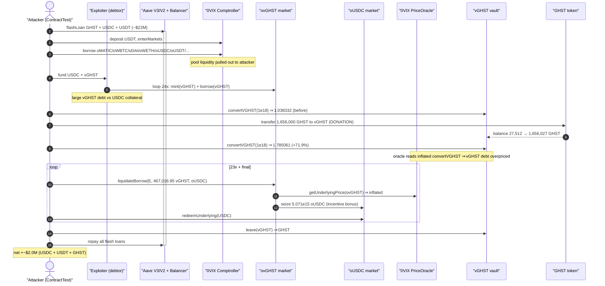
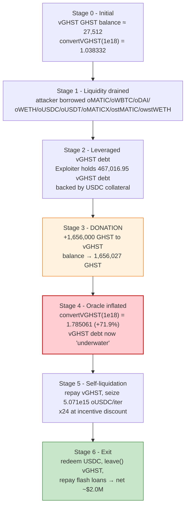
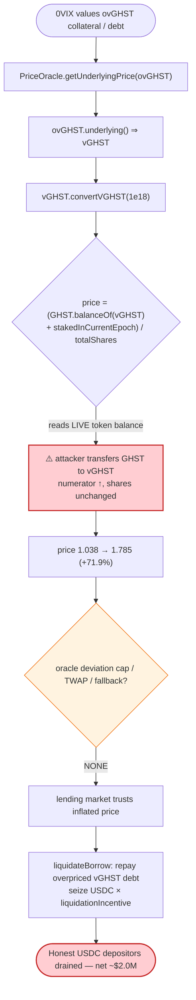

# 0VIX Protocol Exploit — vGHST Oracle Manipulation via Balance Donation

> **Vulnerability classes:** vuln/oracle/price-manipulation · vuln/oracle/spot-price · vuln/governance/flash-loan-attack

> **Reproduction:** the PoC compiles & runs in an isolated Foundry project at
> [this project folder](.) (the umbrella DeFiHackLabs repo contains several unrelated PoCs
> that do not whole-compile, so this one was extracted).
> Full verbose trace: [output.txt](output.txt).
> Verified on-chain sources (Polygonscan-fetched) under [sources/](sources/).

---

## Key info

| | |
|---|---|
| **Loss** | **~$2.0M** — drained as ~1,453,546 USDC + ~584,445 USDT + ~9,566 GHST (flash-loaned principal repaid, this is net profit) |
| **Vulnerable component** | 0VIX `Unitroller`/Comptroller price oracle pricing `ovGHST` via the **manipulable spot rate** `vGHST.convertVGHST()` |
| **Oracle contract** | [`0x1c312b14c129EabC4796b0165A2c470b659E5f01`](https://polygonscan.com/address/0x1c312b14c129EabC4796b0165A2c470b659E5f01) (0VIX PriceOracle) |
| **Manipulated token** | `vGHST` — [`0x51195e21BDaE8722B29919db56d95Ef51FaecA6C`](https://polygonscan.com/address/0x51195e21BDaE8722B29919db56d95Ef51FaecA6C#code) (impl `0x450Ac5C7c2B180477940Aa4de39b3513c42AB74F`) |
| **Victim market** | 0VIX `ovGHST` collateral market `0xE053A4014b50666ED388ab8CbB18D5834de0aB12` + the whole 0VIX lending pool |
| **Comptroller (Unitroller)** | [`0x8849f1a0cB6b5D6076aB150546EddEe193754F1C`](https://polygonscan.com/address/0x8849f1a0cB6b5D6076aB150546EddEe193754F1C) (impl `0xf29d0ae1A29C453df338C5eEE4f010CFe08bb3FF`) |
| **Attacker EOA** | `0x4334f4Dee63623DC74E32e0fda9e7Fd86d723B47` |
| **Attack tx** | [`0x10f2c28f5d6cd8d7b56210b4d5e0cece27e45a30808cd3d3443c05d4275bb008`](https://polygonscan.com/tx/0x10f2c28f5d6cd8d7b56210b4d5e0cece27e45a30808cd3d3443c05d4275bb008) |
| **Chain / fork block / date** | Polygon / 42,054,768 / 2023-04-28 |
| **Compiler** | PoC `^0.8.10` (Foundry, `evm_version = cancun`); Comptroller `v0.8.4`, vGHST impl `v0.8.2` |
| **Bug class** | Price-oracle manipulation — share-price (ERC4626-style) **donation/inflation** of a balance-derived exchange rate used as a lending-market oracle |

---

## TL;DR

0VIX is a Compound-V2 fork on Polygon. It accepts **`vGHST`** (Aavegotchi's auto-compounding wrapper of GHST) as collateral in the `ovGHST` market. The price of `ovGHST`'s underlying is taken from `vGHST.convertVGHST(1e18)` — a **spot, balance-derived** exchange rate equal to *total GHST backing ÷ total vGHST shares*.

Because that rate keys off the **live GHST balance held by the vGHST contract**, anyone can inflate it by simply **transferring (donating) GHST into the vGHST contract** — no shares are minted, so the per-share value jumps. In the trace, a donation of **1,656,000 GHST** moved the vGHST GHST balance from `27,512.44` → `1,656,027.51` GHST and pushed `convertVGHST(1e18)` from **1.038332 → 1.785061** GHST/vGHST ([output.txt:11-12](output.txt)), a **+71.9%** spike.

The attacker:

1. Flash-loans ~$22M of GHST/USDC/USDT across Aave V3, Aave V2 and Balancer.
2. Deposits USDT as collateral and **borrows out every other 0VIX market** (oMATIC, oWBTC, oDAI, oWETH, oUSDC, oUSDT, oMATICX, ostMATIC, owstWETH) — draining the pool's liquidity.
3. Builds a large **leveraged vGHST debt** position on a separate `Exploiter` contract (deposit USDC → borrow vGHST → re-deposit → re-borrow, 24×).
4. **Donates 1,656,000 GHST into vGHST**, inflating the oracle price of the vGHST debt by ~72%.
5. **Self-liquidates** the now-"underwater" `Exploiter` vGHST debt against its USDC collateral. Each liquidation repays cheap-to-acquire vGHST but, thanks to the inflated price **and** the liquidation incentive, seizes far more USDC collateral than the vGHST is genuinely worth.
6. Redeems the seized USDC, unwinds vGHST back to GHST, repays all flash loans, and walks away with the surplus.

Net result: **~$2M** extracted from 0VIX depositors.

---

## Background — the moving parts

- **0VIX** — a Compound-V2-style money market. Collateral/borrow value is computed by the Comptroller using `PriceOracle.getUnderlyingPrice(oToken)` ([sources/Unitroller_8849f1/contracts_PriceOracle.sol:16](sources/Unitroller_8849f1/contracts_PriceOracle.sol#L16)). Liquidations let a third party repay an underwater borrower's debt and **seize their collateral at a discount** (the `liquidationIncentiveMantissa`, [sources/Unitroller_8849f1/contracts_ComptrollerStorage.sol:25](sources/Unitroller_8849f1/contracts_ComptrollerStorage.sol#L25)).
- **GHST** — Aavegotchi's ERC20.
- **vGHST** — an auto-compounding vault wrapper for GHST. `enter(amount)` deposits GHST and mints vGHST shares; `leave(shares)` redeems. The crucial function is `convertVGHST(share)` which returns the GHST value of a given amount of vGHST shares — computed from the vGHST contract's **current GHST holdings** (`GHST.balanceOf(vGHST)` plus GHST staked in Aave / current epoch), divided by the vGHST share supply.

The fatal coupling: **0VIX prices `ovGHST` collateral by calling `vGHST.convertVGHST(1e18)`** — a value that reflects the vGHST contract's instantaneous token balance and is therefore trivially donatable.

---

## The vulnerable code

### 1. 0VIX prices vGHST collateral via the live `convertVGHST` spot rate

The oracle `0x1c312b…` resolves `getUnderlyingPrice(ovGHST)` by reading `ovGHST.underlying()` → `vGHST`, then calling `vGHST.convertVGHST(1e18)` and scaling by decimals. Straight from the trace ([output.txt](output.txt), leverage-build section):

```text
getUnderlyingPrice(ovGHST: 0xE053…aB12) [staticcall]
  ├─ ovGHST::underlying() ⇒ vGHST: 0x5119…aCa6C
  ├─ vGHST::convertVGHST(1e18) [staticcall]
  │   ├─ GHST::balanceOf(vGHST)            ⇒ 27,512.443… GHST   ← live balance (manipulable)
  │   ├─ …::stakedInCurrentEpoch(vGHST)    ⇒ 2,302,622.498… GHST (staked side)
  │   └─ ← 1.038332409239877123            ← GHST per vGHST share
  └─ vGHST::decimals()
```

`convertVGHST` is, in effect:

```
pricePerShare ≈ (GHST.balanceOf(vGHST) + GHST_staked_for_vGHST) / vGHST.totalSupply()
```

It is a **pure spot read of token balances** — there is no TWAP, no manipulation guard, no validation that the balance arrived through `enter()`.

### 2. The price oracle has no sanity bounds

`PriceOracle` is just an abstract getter ([sources/Unitroller_8849f1/contracts_PriceOracle.sol](sources/Unitroller_8849f1/contracts_PriceOracle.sol)); the deployed implementation forwards the raw `convertVGHST` result with no deviation cap, no fallback feed, and no staleness/manipulation protection. Whatever `convertVGHST` returns *is* the collateral price the lending market trusts.

### 3. Liquidation seizes collateral using that same manipulable price + a fixed incentive

The Comptroller's `liquidateBorrowAllowed` / `liquidateCalculateSeizeTokens` value both the repaid debt (`ovGHST` underlying = vGHST) and the seized collateral (`oUSDC` underlying = USDC) through the same oracle, then multiplies by `liquidationIncentiveMantissa`. Inflating the vGHST price inflates the *value of debt repaid*, so each repayment seizes a correspondingly inflated amount of USDC — at a profit once the incentive bonus is added.

---

## Root cause — why it was possible

> **0VIX used a balance-derived, donatable share price (`vGHST.convertVGHST`) directly as a collateral oracle.** Because `convertVGHST` reads the vGHST contract's live GHST balance, anyone can spike it by transferring GHST in. Inflating the price of an asset you owe (vGHST) while it is held against collateral you own (USDC) lets you self-liquidate at a profit, draining honest depositors.

Three independent design failures compose into the exploit:

1. **Manipulable oracle source.** `convertVGHST` is an instantaneous *assets ÷ shares* read. A donation of GHST to vGHST increases the numerator without minting shares, so the per-share price rises — a classic ERC4626 share-inflation / donation attack vector, here weaponized through a lending oracle. Donating 1,656,000 GHST moved the price +71.9% in a single transfer ([output.txt:11-12](output.txt)).
2. **No oracle hardening.** The 0VIX oracle applied no TWAP, deviation cap, fallback, or floor/ceiling around the vGHST share price. The raw spot value flowed straight into collateral/debt math.
3. **Liquidation as an exit ramp.** Because the *same* manipulated price governs both the value of the vGHST debt being repaid and the discount on seized collateral, the attacker — holding both sides (the underwater debtor `Exploiter` and the liquidator) — converts the price spike directly into seized USDC, amplified by the liquidation incentive.

The flash loans are not the vulnerability; they merely provide the working capital to (a) build a large enough vGHST debt position and (b) afford the GHST donation, all repaid within the same transaction.

---

## Preconditions

- 0VIX must price `ovGHST` via the live `vGHST.convertVGHST()` spot rate (it did).
- The attacker must be able to acquire enough GHST to materially move `GHST.balanceOf(vGHST)`. At the fork block vGHST held only ~27,512 GHST on its balance sheet, so a ~1.66M GHST donation produced a ~72% price spike — cheap relative to the position size. GHST was flash-loanable (1.95M GHST from Aave V3).
- Working capital to build the leveraged vGHST debt and to drain the other markets. Provided entirely by flash loans:
  - **Aave V3**: 1,950,000 GHST + 6,800,000 USDC + 2,300,000 USDT ([output.txt:150](output.txt)).
  - **Aave V2**: 13,000,000 USDC + 3,250,000 USDT ([output.txt:215](output.txt)).
  - **Balancer**: 4,700,000 USDC + 600,000 USDT ([output.txt:256](output.txt)).
- All loans repaid intra-transaction, so the attack is fully **flash-loanable** (zero net capital).

---

## Attack walkthrough (with on-chain numbers from the trace)

The console step labels and the corresponding trace evidence:

| # | Step (PoC) | Evidence | Effect |
|---|-----------|----------|--------|
| 0 | **Flash loan** GHST/USDC/USDT (Aave V3 → Aave V2 → Balancer, nested) | [output.txt:150,215,256](output.txt) | ~$22M working capital, repaid at the end. |
| 1 | **Deposit USDT collateral** — `vGHST.enter(294,000 GHST)`, then `oUSDT.mint(USDT balance)`, `enterMarkets([oUSDT])` | console `1. deposit USDT collateral`; [0vix_exp.sol:204-210](test/0vix_exp.sol#L204-L210) | Establishes a borrowing account. |
| 2 | **Borrow every other market dry** — oMATIC, oWBTC, oDAI, oWETH, oUSDC, oUSDT(1.16M), oMATICX, ostMATIC(120k), owstWETH | console `2. borrow asset`; [0vix_exp.sol:233-243](test/0vix_exp.sol#L233-L243) | Pulls out all available pool liquidity into the attacker's hands. |
| 3 | **Build leveraged vGHST debt** on `Exploiter`: `oUSDC.mint` → `ovGHST.borrow` → loop 24× (`ovGHST.mint(vGHST)` + `ovGHST.borrow(vGHST)`) | console `3. …`; `vGHST 467,016.95` held ([output.txt:9](output.txt)); [0vix_exp.sol:452-469](test/0vix_exp.sol#L452-L469) | Large vGHST debt backed by USDC collateral, ready to be "liquidated." |
| 4a | **Read price before**: `convertVGHST(1e18) = 1.038332409` GHST | [output.txt:11](output.txt) | Baseline vGHST price. |
| 4b | **Donate** `GHST.transfer(vGHST, 1,656,000 GHST)` — vGHST GHST balance 27,512.44 → 1,656,027.51 | [output.txt:33-46](output.txt); [0vix_exp.sol:220](test/0vix_exp.sol#L220) | Oracle numerator inflated, no shares minted. |
| 4c | **Read price after**: `convertVGHST(1e18) = 1.785061331` GHST | [output.txt:12](output.txt) | vGHST price **+71.9%** ⇒ Exploiter's vGHST debt now "underwater." |
| 5 | **Self-liquidate** in a loop (23×): `ovGHST.liquidateBorrow(Exploiter, 467,016.95 vGHST, oUSDC)` → seizes `5,071,115,703,353,569` oUSDC each → `ovGHST.redeemUnderlying(467,016.95)`; final partial liquidation of `336,548.17 vGHST` | console `5. …`; repeated `LiquidateBorrow(… repayAmount: 467,016.95e18, seizeTokens: 5.071e15)` ([output.txt:8977,9327,…](output.txt)); [0vix_exp.sol:245-253](test/0vix_exp.sol#L245-L253) | Converts the price spike into seized USDC collateral at the incentive discount. |
| 6 | **Redeem & unwind**: `oUSDC.redeem(...)`, `oUSDC.redeemUnderlying(...)`, `vGHST.leave(...)`; repay all flash loans; swap residual assets to USD/GHST | console `6. swap asset to USD and GHST`; [0vix_exp.sol:225-231,255-376](test/0vix_exp.sol#L255-L376) | Realizes profit; repays loans. |

**Final attacker balances** ([output.txt:15-17](output.txt)):

```
Attacker USDC balance after exploit: 1,453,546.067372
Attacker USDT balance after exploit:   584,444.536038
Attacker GHST balance after exploit:     9,565.867204…
```

### Why self-liquidation is profitable

In a Compound-fork liquidation, the liquidator repays `repayAmount` of the borrower's debt and seizes collateral worth `repayAmount × price(debt) × liquidationIncentive / price(collateral)`. Here the **debt is vGHST** whose price the attacker just inflated +72%, and the **collateral is USDC** at a stable ~$1. So each repayment of vGHST (acquirable cheaply, since the attacker controls the GHST↔vGHST flow) seizes USDC valued at the *inflated* vGHST price, plus the incentive bonus. The borrower and the liquidator are both the attacker, so the "loss" on the debtor side is an internal wash — the only real movement is honest USDC leaving the protocol into the attacker's hands.

---

## Profit / loss accounting

This is a Polygon exploit; the realized profit is denominated in stablecoins + GHST, not WBNB. After repaying every flash loan within the transaction, the attacker retained:

| Asset | Amount | ≈ USD |
|---|---:|---:|
| USDC | 1,453,546.07 | ~$1,453,546 |
| USDT | 584,444.54 | ~$584,445 |
| GHST | 9,565.87 | ~$10k (at ~$1/GHST) |
| **Total net profit** | | **~$2.0M** |

The funds originate from 0VIX depositors: the attacker first **borrowed out the pool's liquidity** (step 2), then **seized USDC collateral** at the manipulated price (step 5). The flash-loaned principal (~$22M) was returned in full, so the entire ~$2M is pure profit obtained with no starting capital.

---

## Diagrams

### Sequence of the attack



### Pool / price state evolution



### The flaw inside the oracle path



---

## Remediation

1. **Never price collateral from a donatable spot share rate.** `vGHST.convertVGHST()` reads the vault's live token balance, which anyone can inflate via a plain transfer. A lending oracle must not consume such a value directly.
2. **Use a manipulation-resistant oracle.** Price `ovGHST` from `GHST_market_price × redeemable_GHST_per_vGHST`, where the GHST price comes from a TWAP / Chainlink feed and the redemption ratio is read from a method that ignores un-deposited (donated) balances — or is itself TWAP'd. Add deviation caps and a fallback feed.
3. **Make share price donation-resistant at the source.** ERC4626-style vaults should track *deposited* assets internally rather than trusting `balanceOf(self)`, or use virtual shares/assets to blunt inflation — so an external transfer cannot move the per-share value.
4. **Bound oracle movement per block.** Reject collateral-price changes exceeding a small per-block threshold; a +72% single-transaction jump should be impossible to act on within the same transaction.
5. **Guard liquidation against price spikes.** Require oracle freshness/consistency at liquidation time and consider a liquidation cooldown after large reported price changes, so a price manipulated in-transaction cannot immediately be cashed out via self-liquidation.

---

## How to reproduce

The PoC was extracted into a standalone Foundry project (the umbrella DeFiHackLabs repo has several
unrelated PoCs that fail to compile under `forge test`'s whole-project build):

```bash
_shared/run_poc.sh 2023-04-0vix_exp --mt testExploit -vvvvv
```

- RPC: a **Polygon archive** endpoint is required (fork block 42,054,768). `foundry.toml` uses
  `https://polygon.drpc.org`; most pruned public RPCs will fail with `missing trie node` at this old block.
- Result: `[PASS] testExploit()`.

Expected tail ([output.txt](output.txt)):

```
Ran 1 test for test/0vix_exp.sol:ContractTest
[PASS] testExploit() (gas: 26551000)
Logs:
  the price of vGHST before donate:	 1038332409239877123
  the price of vGHST after donate:	 1785061331503753425
  ...
  Attacker USDC balance after exploit: 1453546.067372
  Attacker USDT balance after exploit: 584444.536038
  Attacker GHST balance after exploit: 9565.867204351905260256
Suite result: ok. 1 passed; 0 failed; 0 skipped
```

---

*References: BlockSec / PeckShield / Mudit Gupta post-mortems (April 28, 2023). The root cause is the use of the deflation/auto-compounding token vGHST's manipulable `convertVGHST` spot exchange rate as a 0VIX collateral oracle.*
