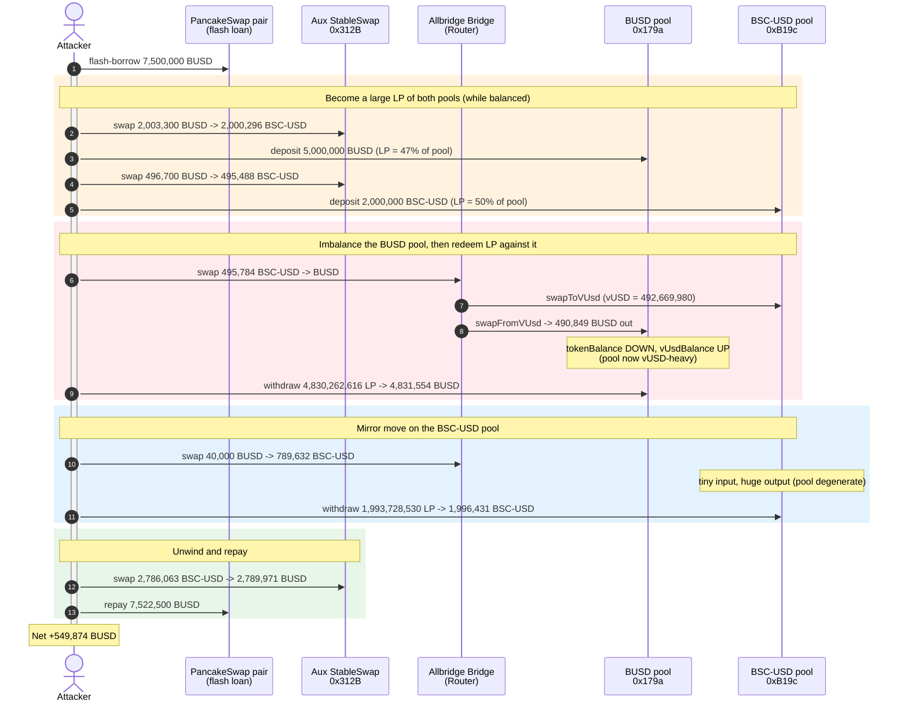
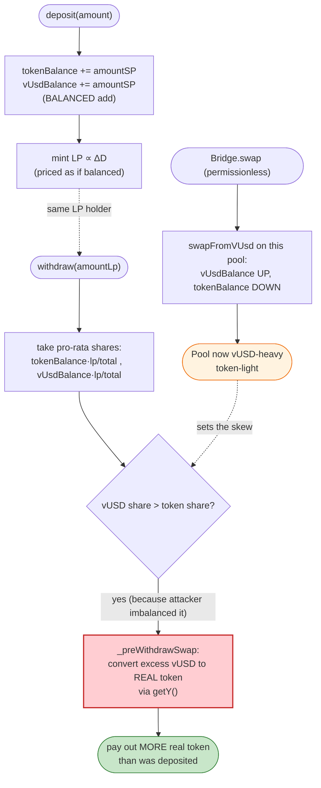
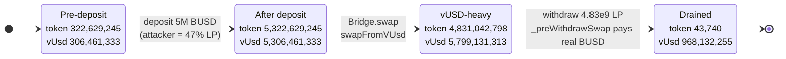

# Allbridge Exploit — StableSwap LP Mispricing via Self-Imbalanced Pools

> **Vulnerability classes:** vuln/logic/price-calculation · vuln/defi/slippage

> **Reproduction:** the PoC compiles & runs in an isolated Foundry project at
> [this project folder](.) (the umbrella DeFiHackLabs repo contains many
> unrelated PoCs that do not whole-compile, so this one was extracted).
> Full verbose trace: [output.txt](output.txt).
> Verified vulnerable source: [Pool.sol](sources/Pool_B19Cd6/Pool.sol),
> [Bridge.sol](sources/Bridge_7E6c25/Bridge.sol).

---

## Key info

| | |
|---|---|
| **Loss** | ~**$549,874** — 549,874.39 BUSD net profit, fully recovered intra-transaction |
| **Vulnerable contract** | Allbridge `Pool` (StableSwap) — BUSD pool [`0x179aaD597399B9ae078acFE2B746C09117799ca0`](https://bscscan.com/address/0x179aaD597399B9ae078acFE2B746C09117799ca0#code) and BSC-USD pool [`0xB19Cd6AB3890f18B662904fd7a40C003703d2554`](https://bscscan.com/address/0xB19Cd6AB3890f18B662904fd7a40C003703d2554#code) |
| **Router / entry** | Allbridge `Bridge` (acts as Router) — [`0x7E6c2522fEE4E74A0182B9C6159048361BC3260A`](https://bscscan.com/address/0x7E6c2522fEE4E74A0182B9C6159048361BC3260A#code) |
| **Victim pools** | The two Allbridge stable pools above (BUSD ↔ vUSD, BSC-USD ↔ vUSD) |
| **Attacker EOA** | `0x1804c8AB1F12E6bbf3894d4083f33e07309d1f38` (`tx.origin` / DefaultSender in PoC) |
| **Attacker contract** | `0x5615dEB798BB3E4dFa0139dFa1b3D433Cc23b72f` (PoC `Exploit`) |
| **Attack tx** | `0x7ff1364c3b3b296b411965339ed956da5d17058f3164425ce800d64f1aef8210` |
| **Chain / block / date** | BSC / 26,982,067 / 2023-04-01 |
| **Compiler** | Pool/Bridge: Solidity v0.8.9, optimizer 200 runs |
| **Bug class** | StableSwap LP-share mispricing: deposit into a balanced pool, withdraw against a self-imbalanced pool |

> Tokens (both 18-decimals BSC stablecoins): **BUSD** = `0xe9e7CEA3DedcA5984780Bafc599bD69ADd087D56`, **BSC-USD (USDT)** = `0x55d398326f99059fF775485246999027B3197955`.
> A second, *non-Allbridge* StableSwap (a Wombat-style pool behind proxy `0x312Bc7eAAF93f1C60Dc5AfC115FcCDE161055fb0`) is used only as a low-slippage venue to round-trip BUSD↔BSC-USD; it is **not** the victim.

---

## TL;DR

Allbridge's stable pools track two internal balances per pool — a real-token balance `tokenBalance` and a *virtual-USD* balance `vUsdBalance` ([Pool.sol:2445-2446](sources/Pool_B19Cd6/Pool.sol#L2445-L2446)). LP shares are minted on `deposit()` from the increase in the StableSwap invariant `D`, but redeemed on `withdraw()` at the pool's **current** `tokenBalance / vUsdBalance` split, re-priced through the bonding curve by `_preWithdrawSwap()` ([Pool.sol:2519-2552](sources/Pool_B19Cd6/Pool.sol#L2519-L2552)).

The Router (`Bridge.swap`) lets *anyone* push virtual-USD between the two pools permissionlessly: `swapToVUsd` on the input pool and `swapFromVUsd` on the output pool ([Bridge.sol:2630-2638](sources/Bridge_7E6c25/Bridge.sol#L2630-L2638)). These two functions move `tokenBalance` and `vUsdBalance` in opposite directions, so an attacker can **deliberately imbalance the very pool they are an LP of**, then withdraw their LP against the distorted reserves and extract more underlying token than they deposited.

The attacker, with a 7.5M BUSD flash loan:

1. **Becomes a ~47% LP** of the BUSD pool (deposit 5M BUSD) and a ~50% LP of the BSC-USD pool (deposit 2M BSC-USD) *while both pools are balanced*.
2. **Imbalances the BUSD pool** by bridge-swapping ~495,784 BSC-USD → BUSD, which pumps `vUsdBalance` up and drains `tokenBalance` down on the BUSD side.
3. **Withdraws their BUSD LP** against the now lop-sided reserves, pulling out **4,831,554 BUSD** for a 5,000,000-BUSD deposit *plus* the 490,849 BUSD already received in step 2 — net positive on the BUSD side.
4. **Repeats in mirror** on the BSC-USD pool: a tiny 40,000-BUSD bridge swap now yields **789,632 BSC-USD** out of the imbalanced BSC-USD pool, then withdraws that pool's LP for another 1,996,431 BSC-USD.
5. **Unwinds** all residual BSC-USD back to BUSD on the unrelated low-slippage pool, repays the 7.5M loan (+0.3% fee), and keeps **549,874 BUSD**.

---

## Background — Allbridge stable pools

Each Allbridge pool is a single-token **StableSwap** AMM whose other side is a synthetic unit, "virtual USD" (`vUsd`). The pool stores:

- `tokenBalance` — real underlying held by the pool, in *system precision* (3 decimals; 18-decimal tokens are scaled down by `10**15`).
- `vUsdBalance` — the synthetic counter-asset.
- `d` — the StableSwap invariant, recomputed by `_updateD()` from `(tokenBalance, vUsdBalance)`.
- LP accounting via `RewardManager` (`totalLpAmount`, per-user `lpAmount`).

Cross-asset transfers are routed through the `Bridge`/`Router`: to swap token A → token B, the Router calls `poolA.swapToVUsd(user, amount)` (adds real A, returns the vUSD produced) and `poolB.swapFromVUsd(recipient, vUsd)` (consumes vUSD, returns real B) ([Bridge.sol:2630-2638](sources/Bridge_7E6c25/Bridge.sol#L2630-L2638)).

The two on-chain victim pools at the fork block:

| Pool | Token | `tokenBalance` (SP) | `vUsdBalance` (SP) | State |
|---|---|---:|---:|---|
| `0x179aaD…` | BUSD | 322,629,245 | 306,461,333 | roughly balanced |
| `0xB19Cd6…` | BSC-USD | — | — | roughly balanced |

(`tokenBalance`/`vUsdBalance` are in 3-decimal "system precision", i.e. `322,629,245 SP ≈ 322,629 BUSD`.)

---

## The vulnerable code

### 1. `deposit()` — mints LP from the rise in `D`, adds *equal* amounts to both balances

```solidity
function deposit(uint256 amount) external {
    uint256 oldD = d;
    uint256 amountSP = toSystemPrecision(amount);
    require(amountSP > 0, "Pool: too little");
    tokenBalance += amountSP;
    vUsdBalance  += amountSP;          // ← deposit assumes a BALANCED add
    require(tokenBalance < MAX_TOKEN_BALANCE, "Pool: too much");
    token.safeTransferFrom(msg.sender, address(this), amount);
    _updateD();
    if (totalLpAmount == 0 || oldD == 0) {
        _depositLp(msg.sender, d >> 1);
    } else {
        _depositLp(msg.sender, totalLpAmount * (d - oldD) / oldD);   // LP ∝ ΔD
    }
}
```
[Pool.sol:2496-2516](sources/Pool_B19Cd6/Pool.sol#L2496-L2516)

A deposit always adds the **same** `amountSP` to `tokenBalance` and `vUsdBalance`, then mints LP proportional to the increase in `D`. So LP is priced as if the pool is balanced at deposit time.

### 2. `withdraw()` — redeems LP at the *current* balance split, swapped back through the curve

```solidity
function withdraw(uint256 amountLp) external {
    uint256 totalLpAmount_ = totalLpAmount;
    _withdrawLp(msg.sender, amountLp);
    uint256 amountSP = _preWithdrawSwap(
        tokenBalance * amountLp / totalLpAmount_,   // pro-rata real token
        vUsdBalance  * amountLp / totalLpAmount_     // pro-rata virtual USD
    );
    tokenBalance -= amountSP;
    vUsdBalance  -= amountSP;
    _updateD();
    token.safeTransfer(msg.sender, fromSystemPrecision(amountSP));
}

function _preWithdrawSwap(uint256 amountToken, uint256 amountVUsd) internal view returns (uint256) { unchecked {
    if (amountToken > amountVUsd) {
        uint256 extraToken = (amountToken - amountVUsd) >> 1;
        uint256 extraVUsd  = vUsdBalance - this.getY(tokenBalance + extraToken);
        return Math.min(amountToken - extraToken, amountVUsd + extraVUsd);
    } else {
        uint256 extraVUsd  = (amountVUsd - amountToken) >> 1;
        uint256 extraToken = tokenBalance - this.getY(vUsdBalance + extraVUsd);  // ← converts vUSD claim to real token
        return Math.min(amountVUsd - extraVUsd, amountToken + extraToken);
    }
}}
```
[Pool.sol:2519-2552](sources/Pool_B19Cd6/Pool.sol#L2519-L2552)

When the LP holder's pro-rata `vUsdBalance` share exceeds their `tokenBalance` share (i.e. the pool is currently **vUSD-heavy / token-light**), `_preWithdrawSwap` "swaps" that excess vUSD into *real token* along the bonding curve and pays it out. The redemption value therefore depends entirely on the pool's **instantaneous imbalance at withdrawal time**, not on the balanced state at deposit time.

### 3. `swapToVUsd` / `swapFromVUsd` — permissionless, opposite-direction balance moves

```solidity
function swapToVUsd(address user, uint256 amount) external onlyRouter returns (uint256) {
    ...
    tokenBalance += amountIn;                 // real token IN
    uint256 vUsdNewAmount = this.getY(tokenBalance);
    if (vUsdBalance > vUsdNewAmount) result = vUsdBalance - vUsdNewAmount;
    vUsdBalance = vUsdNewAmount;              // vUSD OUT
    ...
}

function swapFromVUsd(address user, uint256 amount) external onlyRouter returns (uint256) {
    ...
    vUsdBalance += amount;                    // vUSD IN
    uint256 newAmount = this.getY(vUsdBalance);
    if (tokenBalance > newAmount) result = fromSystemPrecision(tokenBalance - newAmount);
    ...
    tokenBalance = newAmount;                 // real token OUT
    token.safeTransfer(user, result);
}
```
[Pool.sol:2555-2599](sources/Pool_B19Cd6/Pool.sol#L2555-L2599)

`swapToVUsd` raises `tokenBalance` and lowers `vUsdBalance`; `swapFromVUsd` raises `vUsdBalance` and lowers `tokenBalance`. Anyone can drive a pool arbitrarily far out of balance through `Bridge.swap`, which has **no access control** ([Bridge.sol:2630-2638](sources/Bridge_7E6c25/Bridge.sol#L2630-L2638)).

---

## Root cause

The deposit and withdrawal accounting are **asymmetric with respect to pool balance**:

- **Deposit** mints LP assuming a *balanced* add (equal `tokenBalance`/`vUsdBalance` deltas, LP ∝ ΔD).
- **Withdraw** redeems LP at the pool's *current* token/vUSD split, converting any vUSD-heavy imbalance into real token via `_preWithdrawSwap` → `getY`.

Because the same actor can:

1. **Deposit while balanced** (cheap LP, priced fairly), then
2. **Push the pool into a vUSD-heavy state for free** (permissionless `Bridge.swap` → `swapFromVUsd` on that pool), then
3. **Withdraw against the imbalance** (the LP now redeems for *more real token* than was deposited),

the LP-pricing path can be gamed for a risk-free profit. The deposited liquidity acts as a lever: the attacker owns ~half the LP, imbalances the pool with a swap whose *real-token* outflow they also keep, and then redeems their oversized LP share against the distorted reserves.

Crucially, the vUSD that imbalances the BUSD pool comes from the *other* pool (the BSC-USD pool) via the Router — so a single `Bridge.swap` simultaneously (a) hands the attacker BUSD out of the BUSD pool and (b) leaves that pool vUSD-heavy for the subsequent LP withdrawal. The mirror move on the BSC-USD pool then lets a trivial 40,000-BUSD swap drain 789,632 BSC-USD because that pool is now degenerate.

Contributing factors:

1. **Permissionless balance manipulation.** `Bridge.swap` / `swapToVUsd` / `swapFromVUsd` are callable by anyone; there is no oracle, TWAP, or per-block guard on how far reserves may move before an LP redemption.
2. **No re-balancing penalty on withdraw.** `_preWithdrawSwap` rewards withdrawing from an imbalanced pool exactly as much as it should *penalize* it; there is no check that the withdrawing LP did not themselves cause the imbalance in the same transaction.
3. **Shared vUSD across pools.** Imbalancing pool A produces real token *and* leaves A skewed; the attacker monetizes both effects.

---

## Preconditions

- Both Allbridge pools have real liquidity (they did: hundreds of thousands of dollars each).
- Working capital to (a) become a large LP of both pools and (b) seed the imbalancing swaps. Peak outlay is the 5M + 2M deposits, all recovered in the same transaction → **flash-loanable**. The PoC borrows 7.5M BUSD from a PancakeSwap pair (`0x7EFaEf…5A00`) via `pancakeCall` ([test/Allbridge_exp.sol:60-66](test/Allbridge_exp.sol#L60-L66)).
- No timing/admin condition — `Bridge.swap`, `deposit`, and `withdraw` are all permissionless and execute in one block.

---

## Step-by-step attack walkthrough (ground-truth numbers from the trace)

All BUSD/BSC-USD amounts are 18-decimals; pool-internal `tokenBalance`/`vUsdBalance` are 3-decimal "system precision" (SP). The flash loan provides 7,500,000 BUSD and is repaid as 7,522,500 BUSD (principal + 0.3% PancakeSwap fee).

| # | Action (trace) | BUSD held | BSC-USD held | Pool effect |
|---|---|---:|---:|---|
| 0 | **Flash loan** 7,500,000 BUSD ([:31](output.txt#L31)) | 7,500,000 | 0 | — |
| 1 | Swap 2,003,300 BUSD → 2,000,296 BSC-USD on aux pool `0x312B` ([:49](output.txt#L49)) | 5,496,700 | 2,000,296 | source BSC-USD |
| 2 | **Deposit 5,000,000 BUSD** into BUSD pool `0x179a`; LP minted = 4,996,709,485 (≈47% of pool) ([:104](output.txt#L104)) | 496,700 | 2,000,296 | BUSD pool: tokenBalance 322,629,245→5,322,629,245 SP, balanced |
| 3 | Swap 496,700 BUSD → 495,488 BSC-USD on aux pool ([:122](output.txt#L122)) | 0 | 2,495,784 | more BSC-USD |
| 4 | **Deposit 2,000,000 BSC-USD** into BSC-USD pool `0xB19c`; LP minted = 1,996,728,925 (≈50%) ([:177](output.txt#L177)) | 0 | 495,784 | BSC-USD pool: balanced |
| 5 | **`Bridge.swap` 495,784 BSC-USD → BUSD** ([:197](output.txt#L197)): `swapToVUsd` on BSC-USD pool (vUSD=492,669,980), `swapFromVUsd` on BUSD pool → 490,849 BUSD out | 490,849 | ~0 | **BUSD pool imbalanced:** tokenBalance 5,322,629,245→4,831,042,798 SP (↓), vUsdBalance 5,306,461,333→5,799,131,313 SP (↑) |
| 6 | **`withdraw` 4,830,262,616 LP** from BUSD pool ([:233](output.txt#L233)) → 4,831,554 BUSD (incl. 555 reward); `_preWithdrawSwap` converts the vUSD-heavy share to real BUSD | 5,322,403 | ~0 | BUSD pool drained: tokenBalance →43,740 SP |
| 7 | **`Bridge.swap` 40,000 BUSD → 789,632 BSC-USD** ([:258](output.txt#L258)): the BSC-USD pool is now the imbalanced one, so a tiny input yields a huge output | 5,282,403 | 789,632 | BSC-USD pool skewed |
| 8 | **`withdraw` 1,993,728,530 LP** from BSC-USD pool ([:294](output.txt#L294)) → 1,996,431 BSC-USD (incl. 1,238 reward) | 5,282,403 | 2,786,063 | BSC-USD pool drained |
| 9 | Swap 2,786,063 BSC-USD → 2,789,971 BUSD on aux pool `0x312B` ([:321](output.txt#L321)) | 8,072,374 | ~0 | unwind to BUSD |
| 10 | **Repay** 7,522,500 BUSD to PancakeSwap ([:371](output.txt#L371)) | **549,874** | 0 | profit realised |

The two "withdraw" steps each yield *more* underlying than the matching deposit (4,831,554 vs 5,000,000 BUSD looks like a loss in isolation — but step 6 follows step 5 which already extracted 490,849 BUSD from the *same* pool; combined, the BUSD side nets positive), and the BSC-USD side nets strongly positive (789,632 + 1,996,431 BSC-USD out vs 2,000,000 BSC-USD deposited). The aux pool round-trips simply convert between the two stablecoins at ~1:1.

### Profit accounting (BUSD)

| | Amount (BUSD) |
|---|---:|
| Flash loan received | +7,500,000.00 |
| Repaid to PancakeSwap (principal + 0.3%) | −7,522,500.00 |
| **Net retained by attacker** | **+549,874.39** |

Reconstructing the full balance flow step-by-step lands on **549,874.39 BUSD**, matching the trace's `hacker BUSD bal after attack is 549874391584307393758024` to the wei ([output.txt:7](output.txt#L7), [:378](output.txt#L378)).

---

## Diagrams

### Sequence of the attack



### Why the LP redemption over-pays — deposit vs withdraw asymmetry



### BUSD pool reserve evolution (system-precision)



---

## Remediation

1. **Make LP redemption insensitive to same-transaction imbalance.** Redeem LP against a *balance-neutral* valuation (e.g. proportional to `D` at withdrawal vs. the `D`-weighted share), or settle withdrawals at the pool's balanced equivalent rather than honoring an instantaneous skew that the withdrawer can self-create. The deposit (balanced) and withdraw (imbalanced) paths must use the *same* pricing basis.
2. **Charge the imbalance to the actor who created it.** Track the pool's pre-action `D`; if a withdrawal occurs in a pool that was pushed away from balance in the same block/transaction, apply a re-balancing fee or revert. This neutralizes the "imbalance-then-withdraw" lever.
3. **Gate or rate-limit reserve manipulation.** `swapToVUsd`/`swapFromVUsd` allow unbounded, free reserve moves through the permissionless `Bridge.swap`. Add per-block slippage/skew caps or an oracle-anchored price band so a single transaction cannot drive a pool into a degenerate state.
4. **Add reentrancy/flash-loan-aware guards across deposit→swap→withdraw.** The attack composes `deposit`, `Bridge.swap`, and `withdraw` atomically; a guard that forbids withdrawing LP minted earlier in the same transaction (or within N blocks) would break it.
5. **Cross-pool consistency check.** Because vUSD is shared across pools via the Router, validate that a swap which imbalances pool A cannot be combined with an LP redemption in A for net profit (invariant test: total redeemable value of all LP ≤ total real reserves at all times).

> Allbridge's official post-incident response combined a code fix for the pool accounting with a partial negotiated return; the structural fix is item 1 above.

---

## How to reproduce

The PoC was extracted into a standalone Foundry project (the umbrella DeFiHackLabs repo does not whole-compile under `forge test`):

```bash
_shared/run_poc.sh 2023-04-Allbridge_exp -vvvvv
```

- RPC: a **BSC archive** endpoint is required (fork block 26,982,067). `foundry.toml` is configured with a BSC alias that serves historical state at that block; most pruned public RPCs fail with `header not found` / `missing trie node`.
- Result: `[PASS] test_exploit()` with hacker BUSD balance after = `549874391584307393758024` (≈ 549,874 BUSD).

Expected tail:

```
Ran 1 test for test/Allbridge_exp.sol:ContractTest
[PASS] test_exploit() (gas: 2424150)
Logs:
  hacker BUSD bal before attack is        0
  hacker BUSD bal after attack is         549874391584307393758024

Suite result: ok. 1 passed; 0 failed; 0 skipped
```

---

*References: Beosin Alert — https://twitter.com/BeosinAlert/status/1642372700726505473 ; SlowMist Hacked — https://hacked.slowmist.io/ (Allbridge, BSC, ~$550K).*
