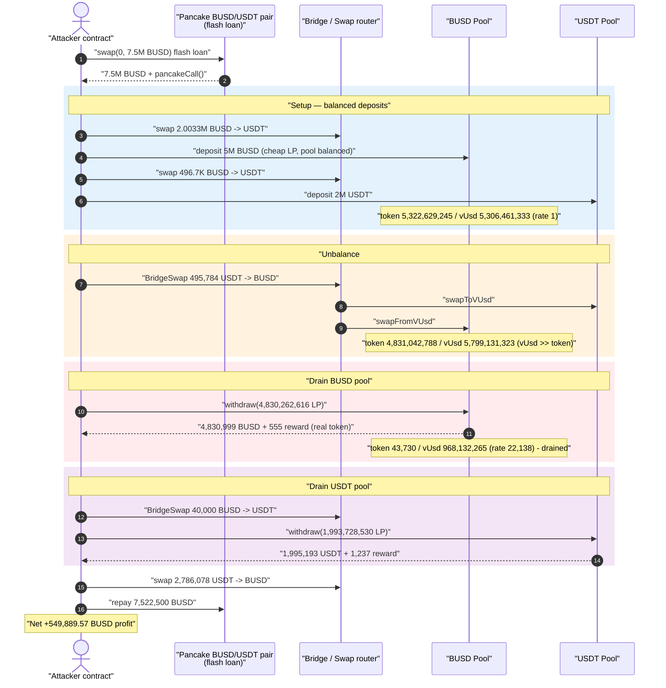
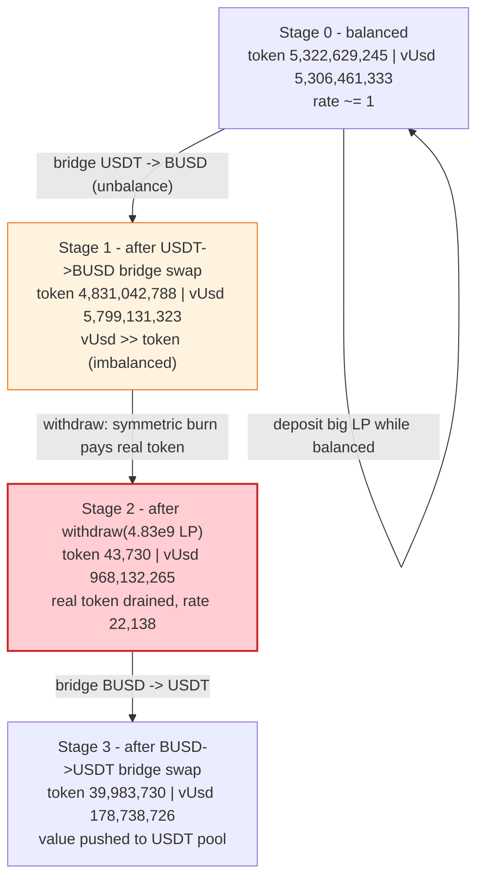
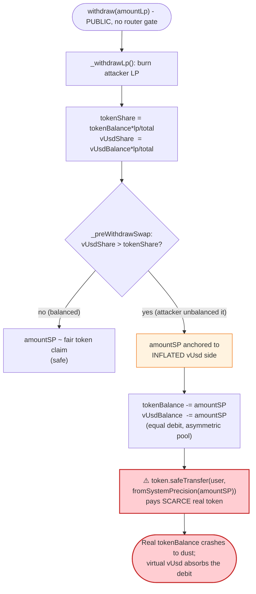
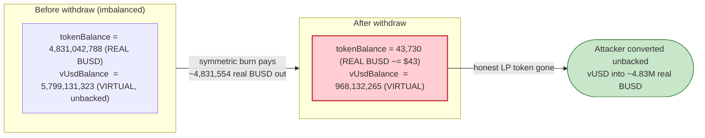

# Allbridge Core Exploit — StableSwap `withdraw()` Symmetric-Burn Drain via Flash-Loan-Induced Imbalance

> **Reproduction:** the PoC compiles & runs in an isolated Foundry project at
> [this project folder](.) (the umbrella DeFiHackLabs repo contains many
> unrelated PoCs that fail the whole-project build, so this one was extracted).
> Full verbose trace: [output.txt](output.txt).
> Verified vulnerable source: [sources/Pool_179aaD/Pool.sol](sources/Pool_179aaD/Pool.sol).

---

## Key info

| | |
|---|---|
| **Loss** | ~$549,890 in this single PoC run (attacker walks away with **549,889.57 BUSD** of profit); the real-world Allbridge incident totaled ~**$573K** across the BUSD and USDT pools |
| **Vulnerable contract** | `Pool` (Allbridge Core StableSwap) — BUSD pool [`0x179aaD597399B9ae078acFE2B746C09117799ca0`](https://bscscan.com/address/0x179aaD597399B9ae078acFE2B746C09117799ca0#code) |
| **Second pool drained** | USDT pool [`0xB19Cd6AB3890f18B662904fd7a40C003703d2554`](https://bscscan.com/address/0xB19Cd6AB3890f18B662904fd7a40C003703d2554#code) |
| **Router / Bridge** | `Bridge` [`0x7E6c2522fEE4E74A0182B9C6159048361BC3260A`](https://bscscan.com/address/0x7E6c2522fEE4E74A0182B9C6159048361BC3260A#code) |
| **Flash-loan source** | PancakeSwap BUSD/USDT pair `0x7EFaEf62fDdCCa950418312c6C91Aef321375A00` |
| **Attacker tx (referenced in PoC)** | `0x7ff1364c3b3b296b411965339ed956da5d17058f3164425ce800d64f1aef8210` |
| **Chain / fork block / date** | BSC / 26,982,067 / April 1, 2023 |
| **Compiler** | Solidity v0.8.9 (`+commit.e5eed63a`), optimizer 200 runs |
| **Bug class** | Broken StableSwap invariant — `withdraw()` removes equal `D`-shares from both reserves while the pool is artificially imbalanced, letting an LP redeem far more real token than its share is worth |

---

## TL;DR

Allbridge Core uses a Curve-style StableSwap pool that tracks two internal reserves: `tokenBalance`
(real stablecoin, in 3-decimal "system precision") and `vUsdBalance` (a virtual USD accounting
balance). Liquidity providers hold LP that represents a fraction of the pool invariant `d`.

The flaw is in [`Pool.withdraw()`](sources/Pool_179aaD/Pool.sol#L2519-L2538): it burns the LP, asks
[`_preWithdrawSwap()`](sources/Pool_179aaD/Pool.sol#L2542-L2564) for a single number `amountSP`, then
subtracts **that same `amountSP` from BOTH `tokenBalance` and `vUsdBalance`** and pays the user
`fromSystemPrecision(amountSP)` of the **real** token:

```solidity
uint256 amountSP = _preWithdrawSwap(
    tokenBalance * amountLp / totalLpAmount_,
    vUsdBalance  * amountLp / totalLpAmount_
);
tokenBalance -= amountSP;          // equal amount...
vUsdBalance  -= amountSP;          // ...removed from both sides
token.safeTransfer(msg.sender, fromSystemPrecision(amountSP));
```

This symmetric removal is only fair when the pool is balanced (`tokenBalance ≈ vUsdBalance`). The
attacker first **deliberately unbalances the pool** so `vUsdBalance ≫ tokenBalance`, then withdraws.
Because `_preWithdrawSwap` keys the payout off the *larger* side (the vUSD share), the attacker is
paid out a `tokenBalance`-denominated amount that vastly exceeds the real token its LP share should
command — draining the pool's actual stablecoin reserve.

The full attack is one atomic flash-loan transaction: borrow 7.5M BUSD from PancakeSwap, use the
bridge's cross-pool swap to push the BUSD pool into extreme imbalance, deposit a large LP position,
unbalance the pool further, withdraw to drain real tokens, repeat the imbalance trick on the USDT
pool, then repay the flash loan and keep the surplus.

---

## Background — what Allbridge Core's Pool does

Each `Pool` (one per stablecoin) is a single-sided StableSwap AMM with two internal balances
([Pool.sol:2445-2447](sources/Pool_179aaD/Pool.sol#L2445-L2447)):

- `tokenBalance` — the real stablecoin held, normalized to **system precision** (3 decimals). The
  pool reduces 18-decimal balances by `1e15` ([toSystemPrecision](sources/Pool_179aaD/Pool.sol#L2477-L2484)).
- `vUsdBalance` — a *virtual* USD balance used purely for accounting and cross-chain settlement.
- `d` — the StableSwap invariant `D` (recomputed by [`_updateD()`](sources/Pool_179aaD/Pool.sol#L2643-L2667)).
- LP tokens are tracked in `RewardManager` and represent a share of `d`.

The pool prices swaps using the StableSwap curve `4AD - D = 4A(x + y) - D³/(4xy)`, solving for the
new `y` (vUSD) given a new `x` (token) via [`getY()`](sources/Pool_179aaD/Pool.sol#L2614-L2624).

Trading happens only through the `Bridge` router. A user never touches a pool directly: the
[`Bridge.swap()`](sources/Bridge_7E6c25/Bridge.sol#L2630-L2638) takes a `(fromToken → vUsd → toToken)`
hop, calling `fromPool.swapToVUsd()` then `toPool.swapFromVUsd()`:

```solidity
function swap(uint256 amount, bytes32 token, bytes32 receiveToken, address recipient) external {
    ...
    uint256 vUsdAmount = tokenPool.swapToVUsd(msg.sender, amount);
    receiveTokenPool.swapFromVUsd(recipient, vUsdAmount);
}
```

The `deposit`/`withdraw` LP functions, by contrast, **are permissionless and directly callable on the
Pool** — that is the entry point the attacker abuses.

On-chain parameters of the BUSD pool at the fork block (read from the trace):

| Parameter | Value |
|---|---|
| `feeShareBP` | small (Allbridge used a low swap fee; fees are not the issue here) |
| System precision | 3 decimals (18-dec balances divided by `1e15`) |
| BUSD pool starting reserves (after attacker's setup deposit) | `tokenBalance = 5,322,629,245`, `vUsdBalance = 5,306,461,333` (≈ balanced, rate ≈ 1) |

---

## The vulnerable code

### 1. `withdraw()` removes equal amounts from both reserves

[Pool.sol:2519-2538](sources/Pool_179aaD/Pool.sol#L2519-L2538):

```solidity
function withdraw(uint256 amountLp) external {
    uint256 totalLpAmount_ = totalLpAmount;
    _withdrawLp(msg.sender, amountLp);                      // burn LP

    // pro-rata token and vUsd shares of the burned LP
    uint256 amountSP = _preWithdrawSwap(
        tokenBalance * amountLp / totalLpAmount_,
        vUsdBalance  * amountLp / totalLpAmount_
    );

    // Always equal amounts removed from actual and virtual tokens
    tokenBalance -= amountSP;        // ⚠️ both decremented by the SAME number
    vUsdBalance  -= amountSP;        // ⚠️

    _updateD();
    token.safeTransfer(msg.sender, fromSystemPrecision(amountSP));  // ⚠️ pays real token == amountSP
}
```

### 2. `_preWithdrawSwap()` keys the payout off the larger side

[Pool.sol:2542-2564](sources/Pool_179aaD/Pool.sol#L2542-L2564):

```solidity
function _preWithdrawSwap(uint256 amountToken, uint256 amountVUsd) internal view returns (uint256) {
    if (amountToken > amountVUsd) {
        ...                                       // balanced/token-heavy branch
    } else {
        uint256 extraVUsd;
        unchecked { extraVUsd = (amountVUsd - amountToken) >> 1; }
        uint256 extraToken = tokenBalance - this.getY(vUsdBalance + extraVUsd);
        unchecked {
            return Math.min(amountVUsd - extraVUsd, amountToken + extraToken);
        }
    }
}
```

When the pool is imbalanced with `vUsdBalance ≫ tokenBalance`, the LP's `amountVUsd` share is much
larger than its `amountToken` share, so the `else` branch runs. The returned `amountSP` is roughly
the **vUSD share minus half the gap** — i.e. it is denominated by the *inflated* virtual side. That
number is then paid out **in real token** at line 2537. The pool's tiny real `tokenBalance` is
emptied while the bookkeeping only debits the same `amountSP` from each side.

### 3. `deposit()` mints LP from the `D` increase

[Pool.sol:2496-2516](sources/Pool_179aaD/Pool.sol#L2496-L2516) adds the deposit equally to both
reserves and mints LP proportional to the rise in `d`. The attacker uses this to acquire a large LP
position **while the pool is still roughly balanced**, so the LP is cheap, and then unbalances the
pool *after* depositing.

---

## Root cause — why it was possible

The StableSwap math is self-consistent only when redemptions are priced on the curve. Allbridge's
`withdraw()` instead applies a **balanced, symmetric burn** (`tokenBalance -= amountSP; vUsdBalance -=
amountSP;`) regardless of the pool's actual `token:vUsd` ratio, and pays the user the *token* leg of a
number derived largely from the *vUsd* leg.

The chain of design decisions that compose into the bug:

1. **Symmetric reserve debit on an asymmetric pool.** Subtracting the same `amountSP` from both
   balances is correct only at balance. When `vUsdBalance ≫ tokenBalance`, the vUSD side can absorb
   the debit while the token side is over-drained relative to the LP's true claim.

2. **Payout denominated in real token, sized by virtual balance.** `_preWithdrawSwap` returns a value
   anchored to the larger (virtual) side, but `withdraw` pays that out in scarce real token at
   [L2537](sources/Pool_179aaD/Pool.sol#L2537). The virtual `vUsdBalance` has no real-asset backing —
   it is just an integer the protocol increments on inbound swaps.

3. **Permissionless, atomic deposit + unbalance + withdraw.** `deposit` and `withdraw` are public and
   callable in the same transaction, and the pool can be unbalanced *between* them using the bridge's
   cross-pool `swap()`. There is no time-lock, no oracle, and no per-block guard, so the entire
   sequence is flash-loan-financed and risk-free.

4. **The imbalance is attacker-controllable for free.** Routing a large `swapToVUsd` into the BUSD
   pool (via a USDT→BUSD bridge hop, [L2549-2563](sources/Pool_179aaD/Pool.sol)) pushes `vUsdBalance`
   far above `tokenBalance`. Because the attacker both supplies and removes the capital in one tx, the
   only realized cost is the swap fee — dwarfed by the drained liquidity.

In short: the pool let an LP redeem against an imbalance it created itself, converting virtual
(unbacked) vUSD into real stablecoin at the expense of honest LPs.

---

## Preconditions

- A large flash loan of stablecoin to (a) acquire a dominant LP position and (b) move the pool's
  internal balances. The PoC borrows **7,500,000 BUSD** from the PancakeSwap BUSD/USDT pair
  ([test/Allbridge_exp2.sol:64](test/Allbridge_exp2.sol#L64)).
- `deposit`/`withdraw` reachable directly on the `Pool` (they are — permissionless, no router gate).
- The bridge `swap()` reachable to unbalance the pool between deposit and withdraw (it is — public).
- All steps execute atomically inside `pancakeCall`, so the only realized cost is swap fees; the
  attack is fully **flash-loanable** and capital-free.

---

## Attack walkthrough (with on-chain numbers from the trace)

All figures are taken directly from the `console.log` lines and `Transfer`/`Withdraw` events in
[output.txt](output.txt). Pool balances are in **system precision** (3 decimals): e.g. `5322629245`
means ≈ 5,322,629 BUSD.

The whole exploit runs inside [`pancakeCall`](test/Allbridge_exp2.sol#L71-L116), invoked by the
PancakeSwap flash-swap of 7.5M BUSD ([L64](test/Allbridge_exp2.sol#L64)).

| # | Step (source) | BUSD pool `tokenBalance` | BUSD pool `vUsdBalance` | Effect |
|---|---|---:|---:|--------|
| 0 | **Flash-borrow 7.5M BUSD** from Pancake BUSD/USDT pair ([L64](test/Allbridge_exp2.sol#L64)) | — | — | Working capital, zero cost if repaid. |
| 1 | **Swap 2,003,300 BUSD → USDT** through the bridge `Swap` router ([L76](test/Allbridge_exp2.sol#L76)) | — | — | Pre-positions USDT for the imbalance step; also seeds the BUSD pool. |
| 2 | **`BUSDPool.deposit(5,000,000 BUSD)`** ([L77](test/Allbridge_exp2.sol#L77)) | builds up | builds up | Attacker mints a dominant LP stake **while the pool is still balanced** (cheap LP). |
| 3 | **Swap 496,700 BUSD → USDT** ([L78](test/Allbridge_exp2.sol#L78)) + **`USDTPool.deposit(2,000,000 USDT)`** ([L79](test/Allbridge_exp2.sol#L79)) | `5,322,629,245` | `5,306,461,333` | Pool balanced, rate ≈ 1 (logged). LP positions established in both pools. |
| 4 | **`BridgeSwap.swap(USDT → BUSD)`** of the attacker's full USDT balance (≈495,784 USDT) ([L89](test/Allbridge_exp2.sol#L89)) | `4,831,042,788` | `5,799,131,323` | **Unbalance #1**: vUsd now ≫ token in the BUSD pool. |
| 5 | **`BUSDPool.withdraw(4,830,262,616 LP)`** ([L97](test/Allbridge_exp2.sol#L97)) | **`43,730`** | `968,132,265` | **The drain**: symmetric burn on the imbalanced pool pays out ≈**4,831,554 BUSD** in real token (4,830,999 + 555 reward), crushing `tokenBalance` to `43,730` (rate **22,138**). |
| 6 | **`BridgeSwap.swap(40,000 BUSD → USDT)`** ([L105](test/Allbridge_exp2.sol#L105)) | `39,983,730` | `178,738,726` | **Unbalance #2 / cross-pool**: pushes value into the USDT pool, setting up its drain (rate ≈ 4). |
| 7 | **`USDTPool.withdraw(1,993,728,530 LP)`** ([L112](test/Allbridge_exp2.sol#L112)) | (USDT pool) | (USDT pool) | Drains the USDT pool: transfers ≈**1,995,193 USDT** + 1,237 reward to attacker. |
| 8 | **Swap entire USDT balance (2,786,078 USDT) → BUSD** via router ([L114](test/Allbridge_exp2.sol#L114)) | — | — | Consolidates the looted USDT back into BUSD (≈2,789,986 BUSD out). |
| 9 | **Repay flash loan**: `BUSD.transfer(Pair, 7,522,500 BUSD)` ([L115](test/Allbridge_exp2.sol#L115)) | — | — | Returns 7.5M + 0.3% fee to Pancake. Surplus is profit. |

After repayment, the attacker holds **549,889.57 BUSD** (trace [L432](output.txt), final
`log_named_decimal_uint`).

### Why step 5 drains the pool

Before the withdraw, the BUSD pool holds `tokenBalance = 4,831,042,788` and `vUsdBalance =
5,799,131,323` (system precision). The attacker owns nearly all the LP. `withdraw` computes the LP's
pro-rata shares — token share ≈ `4,830,262` and vUsd share ≈ `5,798,194` — and routes into the `else`
branch of `_preWithdrawSwap` because `amountVUsd > amountToken`. The returned `amountSP` is anchored to
the larger vUSD side, so `withdraw` subtracts that big number from both balances and pays it out **in
real BUSD**:

- `BUSD.transfer(attacker, 4,830,999,058 ×1e15)` = **4,830,999 BUSD** ([L266-267](output.txt))
- plus a `554,990,139,715,101,532,521` wei = **554.99 BUSD** reward leg ([L256-257](output.txt))

The pool's real `tokenBalance` collapses from `4,831,042,788 → 43,730` ([L277](output.txt), `@ slot 10`),
i.e. from ≈4.83M BUSD down to ≈$43.73, while `vUsdBalance` (the unbacked virtual side) only drops to
`968,132,265`. The attacker has converted virtual accounting units into real BUSD that belonged to
honest LPs.

### Profit accounting (BUSD-equivalent)

| Direction | Amount |
|---|---:|
| Flash-borrowed | 7,500,000.00 BUSD |
| Flash repayment (incl. 0.3% fee) | 7,522,500.00 BUSD |
| BUSD drained from BUSD pool (step 5) | ≈ 4,831,554 BUSD |
| USDT drained from USDT pool (step 7) | ≈ 1,996,430 USDT |
| **Net attacker BUSD after repay** | **+549,889.57 BUSD** |

The drained value (~$549.9K in this run) is bounded by the real stablecoin sitting in the two pools at
the fork block; the historical incident across both pools was ≈$573K.

---

## Diagrams

### Sequence of the attack



### BUSD pool reserve evolution



### The flaw inside `withdraw()`



### Why it is theft: real vs. virtual reserve



---

## Why each magic number

- **`Pair.swap(0, 7.5M BUSD)` ([L64](test/Allbridge_exp2.sol#L64)):** the flash loan. 7.5M BUSD is
  enough working capital to both buy a dominant LP position and move the pool's internal balances; it
  is repaid in full plus the 0.3% Pancake fee (7,522,500 BUSD) at [L115](test/Allbridge_exp2.sol#L115).
- **`deposit(5,000,000 BUSD)` ([L77](test/Allbridge_exp2.sol#L77)):** taken *before* unbalancing, so the
  minted LP is priced against a balanced pool — the LP is cheap relative to the real token it can later
  redeem.
- **`BridgeSwap.swap(USDT → BUSD)` ([L89](test/Allbridge_exp2.sol#L89)):** pushes `vUsdBalance` of the
  BUSD pool above `tokenBalance`, forcing `withdraw` into the over-paying `else` branch of
  `_preWithdrawSwap`.
- **`withdraw(4,830,262,616 LP)` ([L97](test/Allbridge_exp2.sol#L97)):** burns nearly all of the
  attacker's LP at the moment of maximum imbalance, extracting ≈4.83M real BUSD while only $43.73 of
  real token remains in the pool.
- **`withdraw(1,993,728,530 LP)` ([L112](test/Allbridge_exp2.sol#L112)):** the same trick applied to the
  USDT pool after step 6 re-imbalances it.

---

## Remediation

1. **Price withdrawals on the curve, not by symmetric debit.** A withdrawal must return the LP holder's
   true share of *each* reserve at the current `D`, computed from the StableSwap invariant — never
   subtract the same scalar from both `tokenBalance` and `vUsdBalance` regardless of their ratio.
2. **Never pay real token sized by the virtual balance.** The payout at
   [Pool.sol:2537](sources/Pool_179aaD/Pool.sol#L2537) must be bounded by the LP's real-token claim;
   `vUsdBalance` is unbacked accounting and must not directly drive token transfers.
3. **Make deposit + manipulate + withdraw non-atomic / oracle-protected.** Add a withdrawal delay, a
   per-block LP-mint/burn guard, or price the curve from a manipulation-resistant reference so an
   attacker cannot deposit, self-unbalance, and redeem in one transaction.
4. **Reject withdrawals when the pool is far from balance.** If `|tokenBalance - vUsdBalance|` exceeds a
   small tolerance, require rebalancing (or apply a curve-correct slippage) before honoring a withdraw,
   so an artificial imbalance cannot be monetized.
5. **Restrict who can move pool state.** Consider routing all reserve-affecting operations (including LP
   deposit/withdraw) through logic that re-derives `D` and validates conservation of value, rather than
   trusting `_preWithdrawSwap`'s single-number output.

Allbridge's actual post-incident fix added balance-ratio guards and corrected the withdrawal accounting
so that redemptions are priced against the curve rather than via a symmetric debit.

---

## How to reproduce

The PoC was extracted into a standalone Foundry project (the umbrella DeFiHackLabs repo has many
PoCs that fail the whole-project `forge build`):

```bash
_shared/run_poc.sh 2023-04-Allbridge_exp2 -vvvvv
```

- RPC: a **BSC archive** endpoint is required (fork block 26,982,067 is old; most public BSC RPCs prune
  that state and fail with `header not found` / `missing trie node`).
- Result: `[PASS] testExploit()` with the attacker's final BUSD balance logged.

Expected tail:

```
Ran 1 test for test/Allbridge_exp2.sol:ContractTest
[PASS] testExploit() (gas: 912743)
Logs:
  BUSDPool tokenBalance, BUSDPool vUsdBalance, BUSD/vUSD rate: 5322629245 5306461333 1
  BUSDPool tokenBalance, BUSDPool vUsdBalance, vUSD/BUSD rate: 4831042788 5799131323 1
  BUSDPool tokenBalance, BUSDPool vUsdBalance, vUSD/BUSD rate: 43730 968132265 22138
  BUSDPool tokenBalance, BUSDPool vUsdBalance, vUSD/BUSD rate: 39983730 178738726 4
  Attacker BUSD balance after exploit: 549889.574365192879687841

Suite result: ok. 1 passed; 0 failed; 0 skipped
```

---

*References: PeckShield / Beosin / @gbaleeeee threads linked in the PoC header; SlowMist Hacked
database (Allbridge, BSC, April 2023, ~$573K).*
