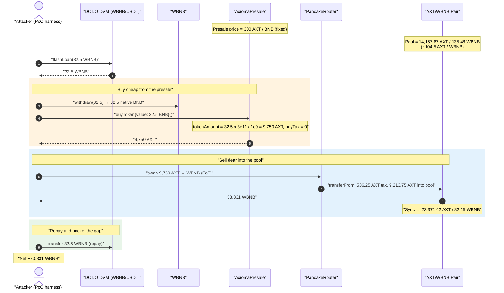
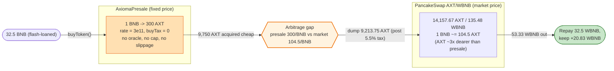
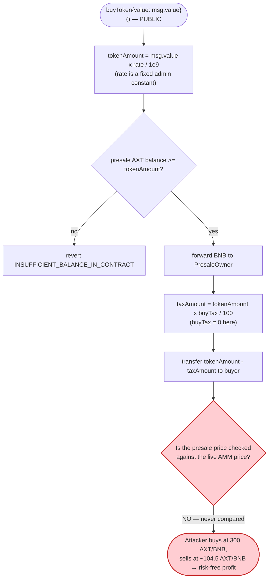

# Axioma (AXT) Exploit — Mispriced Presale Sells Tokens Far Below the AMM Market Price

> **Reproduction:** the PoC compiles & runs in an isolated Foundry project at
> [this project folder](.) (the umbrella DeFiHackLabs repo contains many unrelated
> PoCs that do not compile together, so this one was extracted).
> Full verbose trace: [output.txt](output.txt).
> Verified vulnerable source: [AxiomaPresale.sol](sources/AxiomaPresale_2C25aE/AxiomaPresale.sol).

---

## Key info

| | |
|---|---|
| **Loss (this PoC instance)** | **20.83 WBNB** profit on a single 32.5 WBNB flash-loaned buy (≈ $6.4K @ ~$310/BNB). The vector is repeatable until the presale's AXT inventory is exhausted; the real-world campaign drained ≈ **$640K** in total. |
| **Vulnerable contract** | `AxiomaPresale` — [`0x2C25aEe99ED08A61e7407A5674BC2d1A72B5D8E3`](https://bscscan.com/address/0x2C25aEe99ED08A61e7407A5674BC2d1A72B5D8E3#code) |
| **Asset sold mispriced** | `AXIOMATOKEN` (AXT) — [`0xB6CF5b77B92a722bF34f6f5D6B1Fe4700908935E`](https://bscscan.com/address/0xB6CF5b77B92a722bF34f6f5D6B1Fe4700908935E#code) |
| **Victim pool (where AXT is dumped)** | AXT/WBNB PancakeSwap V2 pair — `0x6a3Fa7D2C71fd7D44BF3a2890aA257F34083c90f` |
| **Flash-loan source** | DODO DVM WBNB/USDT pool — `0xFeAFe253802b77456B4627F8c2306a9CeBb5d681` |
| **Attacker EOA / contract** | EOA `0x047547A4...` (campaign); PoC harness acts as the attacker contract |
| **Attack tx** | `0x05eabbb665a5b99490510d0b3f93565f394914294ab4d609895e525b43ff16f2` |
| **Chain / fork block / date** | BSC / 27,620,320 (forked at `27_620_321 - 1`) / **April 23, 2023** |
| **Compiler** | Presale: Solidity v0.8.17, optimizer 200 runs · Token: v0.8.16, optimizer 200 runs |
| **Bug class** | Stale / mispriced presale (hard-coded `rate`) decoupled from live AMM price → risk-free arbitrage |

---

## TL;DR

`AxiomaPresale.buyToken()` sells AXT at a **fixed, owner-set price** of `rate / 1e9`
tokens per wei of BNB ([AxiomaPresale.sol:402-418](sources/AxiomaPresale_2C25aE/AxiomaPresale.sol#L402-L418)).
At the time of the attack that price was **300 AXT per BNB** (`rate = 3e11`, `buyTax = 0`).

Meanwhile the AXT/WBNB PancakeSwap pool was quoting AXT **far more expensively**:
its reserves were only **14,157.67 AXT / 135.48 WBNB**, i.e. ≈ **104.5 AXT per WBNB**
at the margin. So one BNB paid into the presale bought ~300 AXT, but those same AXT
were worth far more than one BNB when sold into the thin pool.

The attacker simply closed the gap:

1. **Flash-loans 32.5 WBNB** from a DODO DVM pool, unwraps it to native BNB.
2. **Buys AXT at the presale** with all 32.5 BNB → receives **9,750 AXT** at the stale price.
3. **Dumps the 9,750 AXT** into the AXT/WBNB pool (5.5% of it is siphoned by the token's
   own sell-tax, so 9,213.75 AXT actually hits the pool) → pulls out **53.33 WBNB**.
4. **Repays 32.5 WBNB** to DODO and keeps the difference: **20.83 WBNB profit**, all in one
   atomic transaction with zero starting capital.

There is no rounding bug, no reentrancy, no broken AMM invariant. The single root cause is
that the presale price was never tied to (or bounded against) the market price, so anyone
could buy cheap from the presale and instantly resell dear on PancakeSwap.

---

## Background — what the Axioma presale does

[`AxiomaPresale`](sources/AxiomaPresale_2C25aE/AxiomaPresale.sol) is a trivially simple
fixed-price token sale. It holds a large inventory of AXT and lets anyone buy at a price the
owner sets via `rate`:

```solidity
uint256 public rate;     // If rate = 100, then tokensPerBNB is 100
uint256 public buyTax;

function buyToken() public payable {
    uint256 bnbAmountToBuy = msg.value;
    uint256 tokenAmount = bnbAmountToBuy.mul(rate).div(10**9);   // ← fixed price, no oracle
    require(token.balanceOf(address(this)) >= tokenAmount, "INSUFFICIENT_BALANCE_IN_CONTRACT");
    payable(PresaleOwner).transfer(bnbAmountToBuy);
    uint256 taxAmount = tokenAmount.mul(buyTax).div(100);
    token.transfer(PresaleOwner, taxAmount);
    (bool sent) = token.transfer(msg.sender, tokenAmount.sub(taxAmount));
    require(sent, "FAILED_TO_TRANSFER_TOKENS_TO_BUYER");
}
```

`AXIOMATOKEN` ([source](sources/AXIOMATOKEN_B6CF5b/contracts_AXIOMATOKEN.sol)) is an ordinary
reflection/dividend token with a **5.5% sell fee** (`rewardsSellFee 25 + marketingSellFee 10 +
liquiditySellFee 20 = 55`, over `feeDivisor = 1000`,
[contracts_AXIOMATOKEN.sol:1351-1354](sources/AXIOMATOKEN_B6CF5b/contracts_AXIOMATOKEN.sol#L1351-L1354)).
That fee is the *only* friction the attack has to overcome.

On-chain parameters at the fork block (read from the trace):

| Parameter | Value | Source in trace |
|---|---|---|
| Presale `rate` | **3e11** ⇒ 300 AXT per 1 BNB | `buyToken{value: 32.5 BNB}` returns 9,750 AXT |
| Presale `buyTax` | **0** | `transfer(PresaleOwner, taxAmount)` has `value: 0` ([output.txt:1601](output.txt#L1601)) |
| Presale AXT inventory | **9,999,996.16 AXT** | `balanceOf(presale) = 9.99999616e24` ([output.txt:1597](output.txt#L1597)) |
| Pool AXT reserve (token0) | **14,157.67 AXT** | `getReserves()[0] = 1.4157e22` ([output.txt:1659](output.txt#L1659)) |
| Pool WBNB reserve (token1) | **135.48 WBNB** | `getReserves()[1] = 1.3548e20` ([output.txt:1659](output.txt#L1659)) |
| AXT sell fee | **5.5%** | 536.25 AXT taxed of 9,750 ([output.txt:1632](output.txt#L1632)) |

The pair's `token0 = AXT`, `token1 = WBNB`
([PancakePair.sol:312-313](sources/PancakePair_6a3Fa7/PancakePair.sol#L312-L313)), so
`reserve0 = AXT` and `reserve1 = WBNB` throughout.

The whole exploit lives in the relationship between these two prices:

> **Presale price:** 1 BNB → 300 AXT.
> **AMM marginal price:** 135.48 WBNB / 14,157.67 AXT ⇒ 1 AXT ≈ 0.00957 WBNB, i.e. 1 BNB ≈ 104.5 AXT.

The presale is selling AXT at roughly **one-third** of what the market is paying for it. Buying
from the presale and selling into the pool is pure, instant, capital-free arbitrage.

---

## The vulnerable code

### The price is a hard-coded constant, never compared to the market

```solidity
function buyToken() public payable {
    uint256 bnbAmountToBuy = msg.value;
    uint256 tokenAmount = bnbAmountToBuy.mul(rate).div(10**9);   // ⚠️ rate is a fixed admin constant
    require(token.balanceOf(address(this)) >= tokenAmount, "INSUFFICIENT_BALANCE_IN_CONTRACT");
    ...
    (bool sent) = token.transfer(msg.sender, tokenAmount.sub(taxAmount)); // ⚠️ tokens out at that price
    ...
}
```

[AxiomaPresale.sol:402-418](sources/AxiomaPresale_2C25aE/AxiomaPresale.sol#L402-L418)

`rate` is set in the constructor and only ever changed by the owner via `updateRate()`
([AxiomaPresale.sol:384-386](sources/AxiomaPresale_2C25aE/AxiomaPresale.sol#L384-L386)):

```solidity
function updateRate(uint256 newRate) public onlyOwner() { rate = newRate; }
```

There is:

- **No oracle / no AMM quote** — the presale has no idea what AXT is worth on PancakeSwap.
- **No per-buy or per-block purchase cap** — a single call may drain a flash-loan-sized chunk.
- **No upper bound on `msg.value`** and **no slippage**, so the price is identical for the first
  and the millionth token sold.
- **No "presale must be cheaper than market" or "market must be cheaper than presale" guard** —
  the two markets are completely decoupled.

The mirror-image problem (AMM cheaper than presale) would let an arbitrageur run the trade the
other way; either direction of dislocation is freely exploitable.

---

## Root cause — why it was possible

A token has exactly one fair price at any instant. Axioma created **two independent venues
quoting that token at two different prices** and put no mechanism in place to keep them in line:

1. **PancakeSwap** prices AXT dynamically from its reserves — that price had drifted up to
   ~104.5 AXT/BNB because the pool was thin (only ~135 WBNB of liquidity).
2. **The presale** priced AXT at a static `rate` of 300 AXT/BNB that the owner had configured
   and never updated to track the market.

Whenever two venues quote the same asset at different prices and value can flow freely between
them, the cheaper venue is drained into the dearer one. Here the presale was ~3× cheaper, so it
became a free AXT faucet:

> Pay BNB into the presale → get AXT at 300/BNB → sell AXT into the pool at ~104.5/BNB → walk
> away with more BNB than you put in. Flash loans remove even the need for starting capital, and
> the whole loop is atomic so there is zero price risk.

The presale's only `require` — `token.balanceOf(address(this)) >= tokenAmount` — caps a single
purchase at the remaining inventory (≈10M AXT), not at anything economically meaningful. The
5.5% AXT sell tax shaves the margin but does not come close to closing the ~3× gap.

---

## Preconditions

- The presale holds AXT inventory (`balanceOf(presale) >= tokenAmount`). It held ≈10M AXT.
- The presale `rate` is materially cheaper (in BNB terms) than the AXT/WBNB pool's marginal
  price. At the fork block: presale 300 AXT/BNB vs. pool ~104.5 AXT/BNB — a ~3× dislocation.
- A liquid source of BNB. None of the attacker's own capital is needed: a DODO DVM flash loan
  supplies the WBNB, which is unwrapped to native BNB to call `buyToken()` and repaid at the end.
- The pool has enough WBNB to absorb the dumped AXT and pay out the arbitrage profit (135 WBNB,
  of which 53.33 WBNB was extracted on this single ~9.2K-AXT dump).

---

## Attack walkthrough (with on-chain numbers from the trace)

All figures are taken directly from [output.txt](output.txt). The attacker contract is the
Foundry test harness (`ContractTest`, `0x7FA9385b...`).

| # | Step | Call / event | Result |
|---|------|--------------|--------|
| 0 | **Start** | fork BSC @ block 27,620,320 | Presale: 300 AXT/BNB. Pool: 14,157.67 AXT / 135.48 WBNB. |
| 1 | **Flash loan** | `DODO(0xFeAFe2…).flashLoan(32.5e18, 0, this, …)` ([output.txt:1580](output.txt#L1580)) | 32.5 WBNB delivered to attacker. |
| 2 | **Unwrap** | `WBNB.withdraw(32.5e18)` ([output.txt:1588](output.txt#L1588)) | 32.5 native BNB in hand. |
| 3 | **Presale buy** | `AxiomaPresale.buyToken{value: 32.5e18}()` ([output.txt:1595](output.txt#L1595)) | `tokenAmount = 32.5e18 × 3e11 / 1e9 = 9,750e18`; tax 0; attacker receives **9,750 AXT** ([output.txt:1604](output.txt#L1604)). |
| 4 | **Sell on Pancake** | `swapExactTokensForTokensSupportingFeeOnTransferTokens(9,750 AXT, …, [AXT, WBNB])` ([output.txt:1630](output.txt#L1630)) | 5.5% sell fee diverts **536.25 AXT** to the token contract ([output.txt:1632](output.txt#L1632)); **9,213.75 AXT** enters the pool ([output.txt:1633](output.txt#L1633)). |
| 5 | **Swap out** | pair `swap(0, 53.33e18, attacker, …)` ([output.txt:1662](output.txt#L1662)) | attacker receives **53.331130 WBNB** ([output.txt:1664](output.txt#L1664)); pool `Sync(reserve0: 23,371.42 AXT, reserve1: 82.15 WBNB)` ([output.txt:1673](output.txt#L1673)). |
| 6 | **Repay** | `WBNB.transfer(DODO, 32.5e18)` ([output.txt:1684](output.txt#L1684)) | flash loan settled. |
| 7 | **Profit** | `WBNB.balanceOf(attacker)` ([output.txt:1690](output.txt#L1690)) | **20.831130 WBNB** retained. |

### Verifying the swap math

PancakeSwap's `getAmountOut` (0.25% fee, factor 9975/10000) on the AXT→WBNB leg:

```
amountIn (post-FoT)  = 9,213.75 AXT
reserveIn  (AXT)     = 14,157.67
reserveOut (WBNB)    = 135.48

out = (9213.75 · 0.9975 · 135.48) / (14157.67 + 9213.75 · 0.9975)
    = (9189.46 · 135.48) / (14157.67 + 9189.46)
    = 1,244,985 / 23,347.13
    ≈ 53.32 WBNB
```

which matches the trace's **53.331130 WBNB** out. The pre-swap pool balance read in the trace
(`balanceOf(pair) = 23,371.42 AXT`, [output.txt:1660](output.txt#L1660)) is exactly
`14,157.67 + 9,213.75`, confirming the 14,157.67 AXT starting reserve.

### Profit accounting (WBNB)

| Direction | Amount (WBNB) |
|---|---:|
| Borrowed (flash loan) | 32.500000 |
| Spent buying at presale (unwrapped BNB) | 32.500000 |
| Received dumping AXT on Pancake | 53.331130 |
| Repaid to DODO | 32.500000 |
| **Net profit retained** | **+20.831130** |

The profit is purely the price gap: 9,213.75 AXT acquired for 32.5 BNB (≈ 0.003527 BNB/AXT) but
sold for 53.33 WBNB (≈ 0.005789 WBNB/AXT) — a ~64% markup, partially eaten by the pool's
slippage and the 5.5% sell tax, netting +20.83 WBNB.

---

## Diagrams

### Sequence of the attack



### Where the value comes from: two prices for one token



### Decision flow inside `buyToken()` — the missing guard



---

## Why each magic number

- **`rate = 3e11`** ⇒ `32.5e18 × 3e11 / 1e9 = 9,750e18` AXT for 32.5 BNB. This is the static
  presale price the owner set and is the entire source of the dislocation. It implies 300 AXT/BNB.
- **Flash loan = 32.5 WBNB:** sized to the pool's depth. The AXT/WBNB pool only held ~135 WBNB,
  so dumping the AXT from a 32.5-BNB buy already pushed the pool price down hard (53.33 WBNB out
  of 135.48, ~39% of the WBNB side). A much larger buy would suffer steep slippage on the sell
  leg and would also be inventory-bounded; 32.5 BNB roughly maximizes profit for this single pool.
- **5.5% AXT sell tax (536.25 of 9,750 AXT):** the only haircut on the trade; it reduces the AXT
  actually delivered into the pool to 9,213.75 but is far too small to neutralize the ~3× edge.
- **53.331130 WBNB out / 20.831130 WBNB profit:** the pool's constant-product response to the
  9,213.75-AXT dump, minus the 32.5 WBNB repaid to DODO.

---

## Remediation

1. **Price the presale against a trusted reference, not a static constant.** Derive `tokenAmount`
   from an oracle (e.g. a TWAP of the AXT/WBNB pool, or a stablecoin-denominated price feed)
   rather than a hard-coded `rate`. If a fixed sale price is a deliberate product decision, the
   sale must be gated so it cannot be arbitraged — see (2)/(3).
2. **Bound the presale to the market.** Reject (or auto-pause) purchases when the presale price
   deviates beyond a tight band from the live AMM price, so the presale can never be the cheaper
   venue for instant resale.
3. **Add purchase limits and timing controls.** Per-address and per-block caps, a maximum
   `msg.value` per call, and a vesting/lockup on presale-bought tokens prevent buy-and-instantly-
   dump loops and make flash-loan-scale extraction impossible.
4. **Make presale tokens non-immediately-sellable.** If presale buyers cannot sell into the AMM
   within the same transaction/block (lockup, claim delay, or non-transferable receipt), the
   atomic arbitrage is broken even if a price gap exists.
5. **Operationally, keep `rate` current.** Any fixed-price sale running alongside a live AMM must
   have its price actively maintained; a stale `rate` is a standing invitation to arbitrage.

---

## How to reproduce

The PoC was extracted into a standalone Foundry project (the umbrella DeFiHackLabs repo has many
unrelated PoCs that fail to compile under one `forge build`):

```bash
_shared/run_poc.sh 2023-04-Axioma_exp -vvvvv
```

- RPC: a **BSC archive** endpoint is required (the fork block ~27.62M is well in the past). The
  PoC forks via `vm.createSelectFork("bsc", 27_620_321 - 1)` ([test/Axioma_exp.sol:27](test/Axioma_exp.sol#L27));
  most pruned public RPCs will fail with `header not found` / `missing trie node`.
- Result: `[PASS] testExploit()` with the attacker retaining ~20.83 WBNB.

Expected tail:

```
Ran 1 test for test/Axioma_exp.sol:ContractTest
[PASS] testExploit() (gas: 430923)
Logs:
  [After Attacks]  Attacker WBNB balance: 20.831130089952719912

Suite result: ok. 1 passed; 0 failed; 0 skipped
```

---

*References: HypernativeLabs disclosure — https://twitter.com/HypernativeLabs/status/1650382589847302145 ·
SlowMist Hacked — https://hacked.slowmist.io/ (Axioma, BSC, April 2023).*
