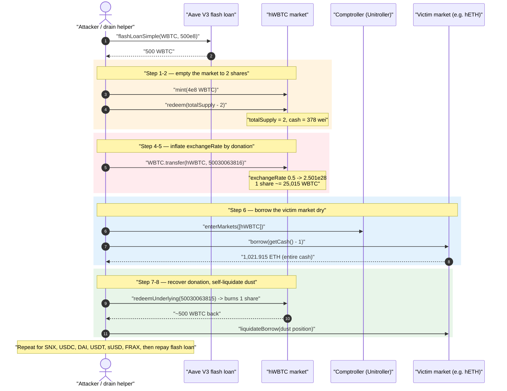
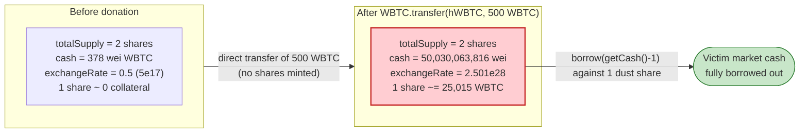
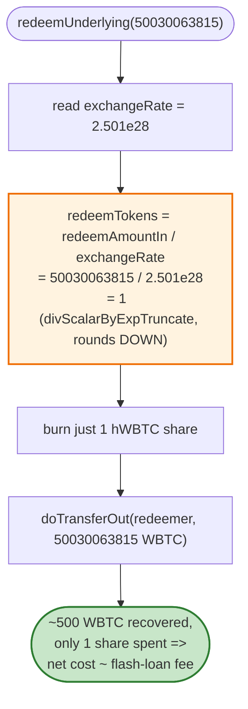

# Hundred Finance #2 Exploit — Empty-Market Exchange-Rate Inflation Drains Every Pool

> **Vulnerability classes:** vuln/oracle/price-manipulation · vuln/arithmetic/rounding · vuln/reentrancy/cross-contract

> **Reproduction:** the PoC compiles & runs in an isolated Foundry project at
> [this project folder](.) (the umbrella DeFiHackLabs repo contains many unrelated
> PoCs that fail to whole-compile, so this one was extracted).
> Full verbose trace: [output.txt](output.txt).
> Verified vulnerable source: [contracts_protocol_token_CToken.sol](sources/CEther_1A61A7/contracts_protocol_token_CToken.sol).

---

## Key info

| | |
|---|---|
| **Loss** | ~$7.4M across all Hundred Finance Optimism markets (ETH, SNX, USDC, DAI, USDT, sUSD, FRAX). In this PoC the attacker walks away with **1,021.9 ETH + 1,233,516 USDC + 20,000 SNX + 865,142 sUSD + 1,113,430 USDT + 842,788 DAI** |
| **Vulnerable contract** | Hundred Finance `CToken` (Compound v2 fork), e.g. hWBTC collateral market — [`0x35594E4992DFefcB0C20EC487d7af22a30bDec60`](https://optimistic.etherscan.io/address/0x35594E4992DFefcB0C20EC487d7af22a30bDec60#code) |
| **Root contract** | `Unitroller` (Comptroller proxy) — [`0x5a5755E1916F547D04eF43176d4cbe0de4503d5d`](https://optimistic.etherscan.io/address/0x5a5755E1916F547D04eF43176d4cbe0de4503d5d) |
| **Victim markets** | hETH `0x1A61A72F…`, hSNX `0x371cb768…`, hUSDC `0x10E08556…`, hDAI `0x0145BE46…`, hUSDT `0xb994B84b…`, hSUSD `0x76E47710…`, hFRAX `0xd97a2591…` |
| **Attacker EOA** | `0x155DA45D374A286d383839b1eF27567A15E67528` (`HundredFinanceExploiter`) |
| **Attack tx** | [`0x6e9ebcde…2604f451`](https://optimistic.etherscan.io/tx/0x6e9ebcdebbabda04fa9f2e3bc21ea8b2e4fb4bf4f4670cb8483e2f0b2604f451) |
| **Chain / block / date** | Optimism / fork @ 90,760,765 / April 15, 2023 |
| **Compiler (victim)** | Solidity **v0.5.16**, optimizer 1 run (200) — Compound v2 fork |
| **Bug class** | ERC4626-style first-depositor / exchange-rate inflation on an **empty market** + donation-manipulable `exchangeRate` |

---

## TL;DR

Hundred Finance is a Compound-v2 fork. Each `CToken` market prices its share token (hToken)
with `exchangeRate = (cash + borrows − reserves) / totalSupply`
([CToken.sol:357-376](sources/CEther_1A61A7/contracts_protocol_token_CToken.sol#L357-L376)).
The hWBTC collateral market had been left **effectively empty** (negligible `totalSupply`), which
is the precondition for the classic donation-inflation attack.

The attacker, funded by a 500-WBTC Aave V3 flash loan, repeats this loop **once per market**:

1. **Mint** a tiny amount of hWBTC and **redeem all but 2 wei of shares**, leaving the market with
   `totalSupply ≈ 2` and `cash ≈ 378` wei of WBTC.
2. **Donate** ~500 WBTC by a *direct* `WBTC.transfer(hWBTC, …)`. Because `exchangeRate` is computed
   from the raw token balance (`getCashPrior()`), the rate explodes from `0.5` to
   **`2.501e28`** — i.e. each of the 2 outstanding hWBTC shares is now "worth" ~25,015 WBTC.
3. With **1 hWBTC share as collateral** (valued by the Comptroller at the inflated rate), `borrow()`
   the **entire cash** of a victim market (`getCash() - 1`) and forward it to the attacker.
4. **`redeemUnderlying`** the ~500 WBTC donation back out. Because of integer-division rounding,
   redeeming 500 WBTC only burns **1 share**, so the attacker recovers the donation while leaving
   1 share behind to be liquidated.
5. **Self-liquidate** the leftover dust position so the attacker's helper contract is closed cleanly
   and the flash loan can be repaid.

Because the donated WBTC is fully recovered every iteration, the only net cost is the flash-loan
premium — and the attacker keeps **100% of every market's borrowable liquidity**.

---

## Background — Compound v2 share accounting

A `CToken` is a yield-bearing receipt for an underlying asset. Depositors `mint` hTokens and later
`redeem` them; the conversion uses a single `exchangeRate`:

```
exchangeRate = (totalCash + totalBorrows − totalReserves) / totalSupply
```

- `totalCash` = the ERC20 balance the market literally holds (`getCashPrior()` → `token.balanceOf(market)`).
- On **mint**: `mintTokens = mintAmount / exchangeRate` (rounded **down**).
- On **redeem**: `redeemAmount = redeemTokens × exchangeRate` (rounded down), and conversely
  `redeemTokens = redeemAmountIn / exchangeRate` (rounded **down**).

When `totalSupply == 0` the rate is the hard-coded `initialExchangeRateMantissa`. The danger zone is
a market with a **tiny but non-zero** `totalSupply`: there the rate is fully controlled by the
attacker, since both numerator (`cash`, via a direct transfer) and denominator (`totalSupply`, via
mint/redeem) are attacker-settable, and every conversion rounds in the protocol's disfavour.

On-chain state of the hWBTC market at the fork block (from the trace):

| Parameter | Value |
|---|---|
| `initialExchangeRateMantissa` | `5e17` (0.5, the Compound default) |
| hWBTC market `totalSupply` before attack | dust (reducible to **2** shares) |
| WBTC `cash` in market after redeem-to-dust | **378 wei** |
| Liquidation incentive | `1.08e18` (8%) |
| Underlying decimals (WBTC) | 8 |

---

## The vulnerable code

### 1. `exchangeRate` is `cash / totalSupply` — both attacker-controllable

```solidity
function exchangeRateStoredInternal() internal view returns (MathError, uint) {
    uint _totalSupply = totalSupply;
    if (_totalSupply == 0) {
        return (MathError.NO_ERROR, initialExchangeRateMantissa);
    } else {
        uint totalCash = getCashPrior();                         // ⚠️ raw token.balanceOf(market)
        ...
        (mathErr, cashPlusBorrowsMinusReserves) = addThenSubUInt(totalCash, totalBorrows, totalReserves);
        ...
        (mathErr, exchangeRate) = getExp(cashPlusBorrowsMinusReserves, _totalSupply);  // ⚠️ cash/supply
        ...
        return (MathError.NO_ERROR, exchangeRate.mantissa);
    }
}
```
[CToken.sol:348-378](sources/CEther_1A61A7/contracts_protocol_token_CToken.sol#L348-L378)

`getCashPrior()` returns the literal ERC20 balance of the market, so a **direct transfer** of WBTC
into the market — never minting any shares — inflates the numerator. With `_totalSupply == 2`, one
500-WBTC donation makes `exchangeRate ≈ 50030063816 / 2 × 1e18 = 2.501e28`.

### 2. Mint rounds shares DOWN

```solidity
(vars.mathErr, vars.mintTokens) =
    divScalarByExpTruncate(vars.actualMintAmount, Exp({mantissa: vars.exchangeRateMantissa}));
```
[CToken.sol:545](sources/CEther_1A61A7/contracts_protocol_token_CToken.sol#L545)

After the rate is inflated, any "honest" deposit smaller than one whole share mints **0 hTokens** —
but that is not even needed here. The attacker exploits the inverse on **redeem**.

### 3. Redeem rounds the burned shares DOWN

```solidity
// redeemAmountIn path:
(vars.mathErr, vars.redeemTokens) =
    divScalarByExpTruncate(redeemAmountIn, Exp({mantissa: vars.exchangeRateMantissa}));
...
vars.redeemAmount = redeemAmountIn;
```
[CToken.sol:648-660](sources/CEther_1A61A7/contracts_protocol_token_CToken.sol#L648-L660)

To pull the 500-WBTC donation back out the attacker calls `redeemUnderlying(50030063815)`. With the
inflated rate, `redeemTokens = 50030063815 / 2.501e28 = 1` (truncated) — **the attacker recovers
500 WBTC while burning only a single share.** The donation is fully reclaimed; the cost of the
attack collapses to the flash-loan fee.

### 4. The Comptroller values collateral at the inflated rate

The borrow/liquidate hypotheticals call `getAccountSnapshot` → `exchangeRateStoredInternal()`
([CToken.sol:204-222](sources/CEther_1A61A7/contracts_protocol_token_CToken.sol#L204-L222)), so the
attacker's **1 remaining hWBTC share is treated as ≈25,015 WBTC of collateral** — more than enough
to borrow out every market's entire `cash`.

---

## Root cause — why it was possible

The vulnerability is the well-known **share-inflation / first-depositor attack** applied to a
Compound-v2 fork whose collateral market was left nearly empty:

1. **`exchangeRate` reads raw balance.** `getCashPrior()` counts donated tokens, so the rate's
   numerator is manipulable by an unsolicited transfer.
2. **`totalSupply` is attacker-minimisable.** Minting then redeeming all-but-2 shares drives the
   denominator to 2, amplifying the donation's effect by ~`donation/2`.
3. **All conversions round in the protocol's favour against the user — but symmetrically benefit a
   donor who controls supply.** Redeeming 500 WBTC burns only 1 share, so the donation is recoverable
   intra-transaction.
4. **No minimum-liquidity / dead-shares guard.** Modern forks burn the first ~1000 shares to a dead
   address or seed the market with protocol-owned liquidity so `totalSupply` can never be driven to a
   handful of wei. Hundred Finance's empty hWBTC market had neither.
5. **Collateral is valued from the same manipulable rate**, so a single dust share unlocks
   borrowing power equal to an entire market's reserves.

This is the second Hundred Finance incident; the underlying Compound-v2 empty-market hazard is the
same class that hit CREAM, Midas, and many other forks.

---

## Preconditions

- A live Compound-v2-fork market (hWBTC) with **negligible `totalSupply`** that the attacker can
  reduce to ~2 shares by mint + redeem-all-but-2.
- The underlying collateral token (WBTC) must be **directly transferable** into the market so
  `getCashPrior()` picks up the donation (true for any standard ERC20 — it is just `transfer`).
- Working capital to (a) seed the market and (b) supply the donation. Both are returned within the
  same transaction, so the attack is **flash-loanable**. The PoC borrows **500 WBTC** from Aave V3
  ([test/HundredFinance_2_exp.sol:70](test/HundredFinance_2_exp.sol#L70)).
- A small "anti-front-run" hWBTC pre-position (`1,503,167,295` hWBTC transferred from the exploiter
  EOA, [:68](test/HundredFinance_2_exp.sol#L68)) so the attack contract owns shares to redeem.

---

## Attack walkthrough (with on-chain numbers from the trace)

The PoC takes a 500-WBTC flash loan and, inside `executeOperation`, runs a per-market drain helper
(`ETHDrain` for hETH, `tokenDrain` for each ERC20 market). All figures are from
[output.txt](output.txt).

| # | Step | Call (trace) | Effect |
|---|------|--------------|--------|
| 0 | **Flash loan** 500 WBTC | `aaveV3.flashLoanSimple(…, 50000000000)` ([L228](output.txt)) | Working capital sourced; repaid + premium at the end. |
| 1 | **Seed** market with WBTC | `hWBTC.mint(4e8)` ([L303](output.txt)) | Mints shares at rate 0.5. |
| 2 | **Redeem to dust** | `hWBTC.redeem(totalSupply − 2) = redeem(19999999998)` ([L337](output.txt)) | Leaves `totalSupply = 2`, `cash = 378` wei. Log: *"share in hWBTC: 2, WBTC amount: 378"*. |
| 3 | **Read pre-rate** | `getAccountSnapshot` ([L384](output.txt)) | `exchangeRate before manipulation: 5e17`. |
| 4 | **Donate** ~500 WBTC | `WBTC.transfer(hWBTC, 50030063816)` ([L394](output.txt)) | `cash` jumps to `50030063816`. |
| 5 | **Read post-rate** | `getAccountSnapshot` ([L404](output.txt)) | `exchangeRate after manipulation: 2.501e28` — **1 share ≈ 25,015 WBTC**. |
| 6 | **Enter market + borrow all cash** | `unitroller.enterMarkets([hWBTC]); CEther.borrow(getCash() − 1)` ([L426](output.txt)) | Borrows **1,021.915 ETH** against the dust share; forwarded to attacker. |
| 7 | **Recover donation** | `hWBTC.redeemUnderlying(50030063815)` ([L496](output.txt)) | Burns only **1 share** (rounding), returns ~500 WBTC. Log: *"redeems all previously donated WBTC with a calculated share of: 1"*. |
| 8 | **Self-liquidate dust** | `CEther.liquidateBorrow{value: 267919888739}(drainer, hWBTC)` ([L598](output.txt)) | Closes the leftover position; seizes back collateral; helper exits clean. |
| 9 | **Repeat steps 1–8 for SNX, USDC, DAI, USDT, sUSD, FRAX** | `hSNX.borrow(2e22)`, `hUSDC.borrow(1.233e12)`, `hDAI.borrow(8.427e23)` … | Each market's full `cash` is borrowed out. |
| 10 | **Repay flash loan** | `WBTC.approve(aaveV3, max)` ([test:110](test/HundredFinance_2_exp.sol#L110)) | 500 WBTC + premium returned from recovered donations. |

The same constant `exchangeRate before = 5e17` / `after = 2.501e28` and `share = 2 → 1` appears in
**every** market iteration in the trace (lines 11/12, 31/32, 51/52, 71/72, 91/92, 111/112,
131/132), confirming the loop is deterministic and identical per market.

### Why one dust share borrows an entire market

After step 5 the Comptroller values the attacker's collateral as
`shares × exchangeRate = 1 × 2.501e28 / 1e18 ≈ 25,015 WBTC`. At a WBTC price on the order of
~$30k that is ~$750M of *phantom* collateral — vastly larger than any single market's cash, so the
`borrow(getCash() − 1)` always succeeds and drains the market to ~1 wei.

---

## Profit / loss accounting

Final attacker balances after the full multi-market loop (from the closing `log_named_decimal_uint`
events, [output.txt](output.txt) tail):

| Asset | Raw value | Human |
|---|---:|---:|
| ETH | `1021915074224867122534` | **1,021.915 ETH** |
| USDC | `1233516758493` | **1,233,516.76 USDC** |
| SNX | `20000006040813679379832` | **20,000.006 SNX** |
| sUSD | `865142911064170347497066` | **865,142.91 sUSD** |
| USDT | `1113430652678` | **1,113,430.65 USDT** |
| DAI | `842788494009886029179569` | **842,788.49 DAI** |

The flash-loaned 500 WBTC is repaid in full (the donation is recovered each iteration via
`redeemUnderlying`), so the figures above are **net theft**. The public post-mortem put the total
loss at roughly **$7.4M** across all affected markets.

---

## Diagrams

### Sequence of one market drain



### Exchange-rate inflation: before vs. after the donation



### Where the rounding lets the donation be recovered for free



---

## Remediation

1. **Never let `totalSupply` reach a manipulable minimum.** Seed each market with protocol-owned
   liquidity, or burn the first ~1,000 shares to a dead address on market creation, so the
   first-depositor / donation-inflation pattern is impossible. Empty markets must not be borrowable.
2. **Decouple `exchangeRate` from raw balance.** Track deposited cash in an internal accounting
   variable that only changes on `mint`/`redeem`/`borrow`/`repay`, so unsolicited `transfer`s cannot
   move the rate (Compound's later versions and Aave use internal accounting / virtual shares).
3. **Use virtual shares / virtual assets** (OpenZeppelin ERC4626 `_decimalsOffset`) to make donation
   attacks economically irrational by orders of magnitude.
4. **Bound rate movement per block.** Reject an `exchangeRate` that jumps by more than a sane
   multiple in a single transaction; a 0.5 → 2.5e28 jump should be impossible.
5. **Validate collateral pricing against an oracle**, not the internal exchange rate alone, so a
   manipulated share value cannot mint phantom borrowing power.
6. **Operationally:** decommission / pause markets that have been drained to dust rather than leaving
   them live and borrowable.

---

## How to reproduce

The PoC was extracted into a standalone Foundry project (the umbrella DeFiHackLabs repo fails to
whole-compile):

```bash
_shared/run_poc.sh 2023-04-HundredFinance_2_exp --mt testExploit -vvvvv
```

- RPC: an **Optimism archive** endpoint is required (fork block 90,760,765). `foundry.toml` uses
  `https://mainnet.optimism.io`.
- Result: `[PASS] testExploit()` with the six closing balance logs.

Expected tail:

```
  Attacker ETH balance after exploit: 1021.915074224867122534
  Attacker USDC balance after exploit: 1233516.758493
  Attacker SNX balance after exploit: 20000.006040813679379832
  Attacker sUSD balance after exploit: 865142.911064170347497066
  Attacker USDT balance after exploit: 1113430.652678
  Attacker DAI balance after exploit: 842788.494009886029179569

Suite result: ok. 1 passed; 0 failed; 0 skipped
```

---

*References:*
- *PeckShield — https://twitter.com/peckshield/status/1647307128267476992*
- *Hundred Finance post-mortem — https://blog.hundred.finance/15-04-23-hundred-finance-hack-post-mortem-d895b618cf33*
