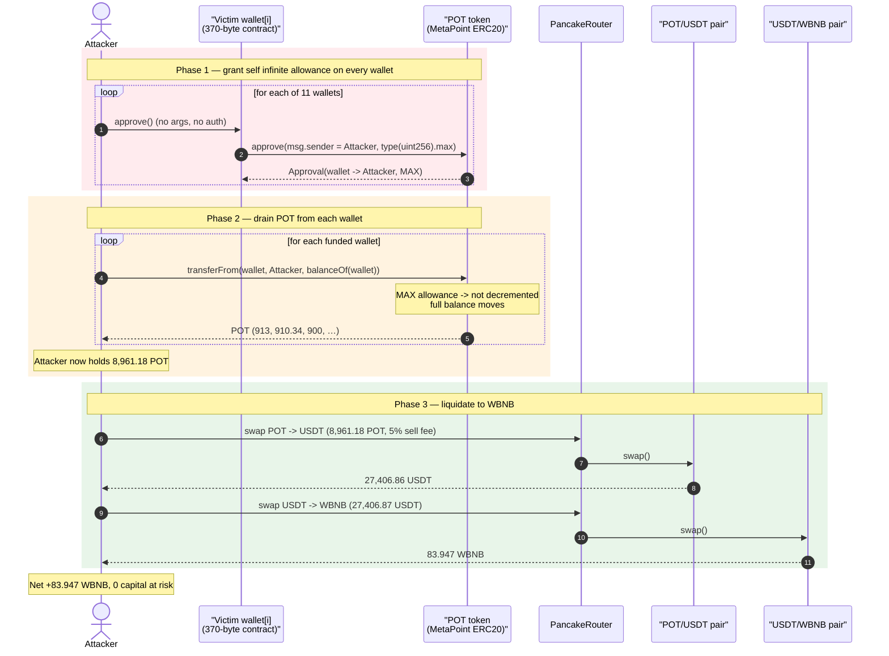
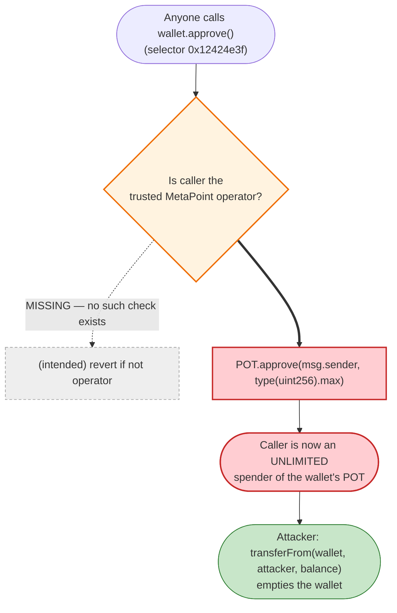
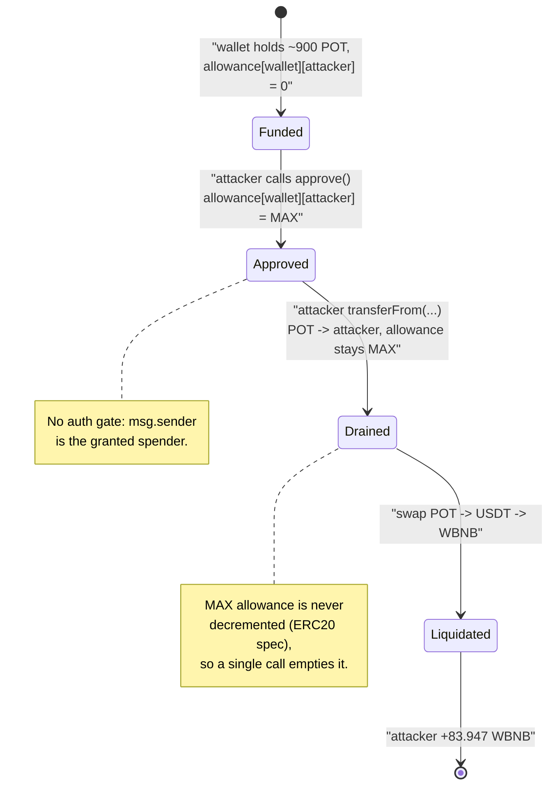

# MetaPoint (POT) Exploit — Permissionless `approve()` on User-Wallet Contracts Drains Holder Balances

> **Reproduction:** the PoC compiles & runs in an isolated Foundry project at
> [this project folder](.) (the umbrella DeFiHackLabs repo contains many unrelated
> PoCs that do not whole-compile under `forge test`, so this one was extracted).
> Full verbose trace: [output.txt](output.txt).
> Verified vulnerable token source: [MetaPoint.sol](sources/MetaPoint_3B5E38/MetaPoint.sol).
> The *actual* vulnerable contracts (the per-user "wallet" contracts) are unverified on BscScan;
> their decompiled `approve()` body is reconstructed from on-chain bytecode below.

---

## Key info

| | |
|---|---|
| **Loss** | ~**8,961.18 POT** stolen from 10 holder wallets, liquidated to **83.95 WBNB** (~$24K at the time; SlowMist reports the wider MetaPoint incident at ~$166K total) |
| **Vulnerable contract** | Per-user **MetaPoint wallet contracts** with a public no-arg `approve()`, e.g. [`0x724DbEA8…0460BAD`'s deployment family](https://bscscan.com/address/0x724DbEA8A0ec7070de448ef4AF3b95210BDC8DF6) — they auto-`approve(msg.sender, MAX)` over their **POT** holdings |
| **Stolen token** | `MetaPoint` (**POT**) — [`0x3B5E381130673F794a5CF67FBbA48688386BEa86`](https://bscscan.com/address/0x3B5E381130673F794a5CF67FBbA48688386BEa86#code) (a *standard* OZ ERC20; not itself the bug) |
| **Liquidation pool** | POT/USDT PancakePair — [`0x9117df9aA33B23c0A9C2C913aD0739273c3930b3`](https://bscscan.com/address/0x9117df9aA33B23c0A9C2C913aD0739273c3930b3) |
| **Routing** | PancakeRouter v2 `0x10ED43C718714eb63d5aA57B78B54704E256024E`; POT→USDT→WBNB |
| **Attacker contract (PoC `ContractTest`)** | runs as `0x7FA9385bE102ac3EAc297483Dd6233D62b3e1496` (Foundry default test addr) |
| **Reference txs** | invest [`0xdb01fa…e7995`](https://bscscan.com/tx/0xdb01fa33bf5b79a3976ed149913ba0a18ddd444a072a2f34a0042bf32e4e7995) · withdraw [`0x418537…6cc67`](https://bscscan.com/tx/0x41853747231dcf01017cf419e6e4aa86757e59479964bafdce0921d3e616cc67) |
| **Chain / block / date** | BSC / fork at **27,264,383** (`27_264_384 - 1`) / **2023-04-11** |
| **Compiler (POT token)** | Solidity v0.8.10, optimizer 1 run, 200 runs |
| **Bug class** | Missing access control — **arbitrary/public approval** (CWE-862) on user-wallet contracts |

---

## TL;DR

MetaPoint deployed a per-user **"wallet" contract** for each participant in its mining/pre-sale
program. Each wallet holds the user's **POT** tokens. To let the MetaPoint backend move those tokens,
every wallet exposes a single external function — `approve()` (selector `0x12424e3f`) — whose entire
body is:

```solidity
POT.approve(msg.sender, type(uint256).max);
```

There is **no access control**: the wallet sets the *caller* (`msg.sender`) as an **unlimited
spender** of its own POT balance. Anyone can call `approve()` on any of these wallets and immediately
become authorized to drain its POT.

The attacker simply:

1. **Calls `approve()` on each victim wallet** → each grants the attacker `type(uint256).max` POT
   allowance over itself.
2. **`transferFrom(victim, attacker, balance)`** for each → pulls every wallet's POT out.
3. **Dumps the looted POT** into the POT/USDT PancakeSwap pool, then **USDT→WBNB**, converting the
   stolen tokens into **83.95 WBNB**.

The PoC reproduces 10 funded wallets (one held 0 and was skipped) for a total of **8,961.18 POT**,
liquidated to **83.947 WBNB**. The bug is in the *wallet* contracts, not the POT ERC20 — the POT token
itself is a perfectly ordinary OpenZeppelin ERC20 whose `approve`/`transferFrom` behave exactly as
specified ([MetaPoint.sol:274-305](sources/MetaPoint_3B5E38/MetaPoint.sol#L274-L305)).

---

## Background — what MetaPoint deployed

`MetaPoint` ([source](sources/MetaPoint_3B5E38/MetaPoint.sol)) is an ERC20 named **"MetaPoint" / "POT"**
with a 21,000,000-token supply, a buy/sell-fee mechanism, and a one-block "blacklist" anti-bot trap
([MetaPoint.sol:850-1049](sources/MetaPoint_3B5E38/MetaPoint.sol#L850-L1049)). None of that is the
vulnerability — its `approve`, `transferFrom`, and `_spendAllowance` are inherited verbatim from
OpenZeppelin v4.6 ERC20 and are correct:

```solidity
// MetaPoint.sol:274-278  — standard, msg.sender-scoped approval
function approve(address spender, uint256 amount) public virtual override returns (bool) {
    address owner = _msgSender();
    _approve(owner, spender, amount);   // sets _allowances[owner][spender]
    return true;
}
```

The MetaPoint *product*, however, gave each participant a small **wallet contract** to custody their
POT. On-chain, every one of these wallets is a ~370-byte contract exposing exactly one selector. Read
directly from BSC (`cast code` at the fork block), the runtime bytecode of victim
`0x724DbEA8…0460BAD` is:

```
6080604052…3560e01c806312424e3f14610030…       // dispatch: only selector 0x12424e3f -> approve()
6040517f095ea7b3…81523360048201…                // build calldata: selector approve(address,uint256), arg0 = CALLER (msg.sender)
7fffffffffffffffffffffffffffffffffffffffffffffffffffffffffffffffff60248201…   // arg1 = type(uint256).max
7f0000…3b5e381130673f794a5cf67fbba48688386bea86…73…169063095ea7b3…01…  // target = POT token, call approve(...)
```

Decompiled, that is unambiguously:

```solidity
// reconstructed wallet contract (the real vulnerable code)
function approve() external {                       // selector 0x12424e3f, NO access control
    POT.approve(msg.sender, type(uint256).max);     // POT = 0x3B5E381130673F794a5CF67FBbA48688386BEa86
}
```

On-chain facts at the fork block (read via `cast`):

| Fact | Value |
|---|---|
| POT `symbol()` / `decimals()` | `"POT"` / `18` |
| Pair `token0` / `token1` | POT / USDT (`0x55d398…7955`) |
| Victim `0x724DbEA8…` is a contract | yes — `codesize = 370` |
| Victim `0x724DbEA8…` POT balance | **0** (skipped by the PoC) |
| Other 10 wallets' POT balances | ~873.84 – 913 POT each (see table) |

---

## The vulnerable code

### 1. The wallet's unprotected `approve()` (the actual bug)

```solidity
// On-chain bytecode of every victim wallet, decompiled:
function approve() external {                       // ⚠️ anyone may call
    POT.approve(msg.sender, type(uint256).max);     // ⚠️ caller becomes unlimited spender
}
```

There is **no `onlyOwner`, no `msg.sender == backend` check, no parameter**. The function blindly
trusts `msg.sender` and hands it infinite allowance over the wallet's POT. Because the spender is
`msg.sender` rather than a fixed trusted operator, **the access-control check is not just weak — it is
absent**.

### 2. The POT token behaves correctly (NOT the bug)

`transferFrom` consumes the allowance exactly as ERC20 specifies — and with an infinite (`MAX`)
allowance it never decrements, so the attacker can pull the entire balance in one call:

```solidity
// MetaPoint.sol:296-305
function transferFrom(address from, address to, uint256 amount) public virtual override returns (bool) {
    address spender = _msgSender();
    _spendAllowance(from, spender, amount);   // MAX allowance ⇒ no decrement (see _spendAllowance)
    _transfer(from, to, amount);
    return true;
}

// MetaPoint.sol:468-480
function _spendAllowance(address owner, address spender, uint256 amount) internal virtual {
    uint256 currentAllowance = allowance(owner, spender);
    if (currentAllowance != type(uint256).max) {    // MAX ⇒ branch skipped, allowance untouched
        require(currentAllowance >= amount, "ERC20: insufficient allowance");
        unchecked { _approve(owner, spender, currentAllowance - amount); }
    }
}
```

The wallet's `approve()` set `currentAllowance = type(uint256).max`, so the `if` is skipped and the
attacker's `transferFrom` succeeds for the full balance with no allowance accounting to worry about.

---

## Root cause — why it was possible

The wallet contracts were designed so the MetaPoint backend could custody and move users' POT. The
intended flow was presumably: *"the wallet pre-approves our operator so we can sweep deposits."*
But the implementation made two fatal choices:

1. **The spender is `msg.sender`, not a hard-coded trusted operator.** Whoever calls `approve()` is the
   one who gets approved. There is no notion of "the backend" baked in — the bytecode contains the POT
   address as an immutable, but the *spender* is taken live from `CALLER`. So an attacker calling
   `approve()` directly authorizes **themselves**.
2. **No caller restriction at all.** Even if the spender had been a fixed address, an attacker could
   not have abused it — but the function would still be callable by anyone. Combined with (1), the two
   gaps compose into a trivially exploitable, permissionless infinite-approval primitive.

The result: every wallet is a self-service "drain me" button. The attacker doesn't need to compromise
keys, manipulate prices, or break any invariant — they just press the button on each wallet, then
`transferFrom` the POT out. The PancakeSwap swaps at the end are mere **liquidation** of the loot; they
play no role in the exploit itself (the pool's `k` is fully preserved throughout).

---

## Preconditions

- Victim wallets must hold a POT balance > 0 (the PoC's first wallet held 0 and is skipped at
  [MetaPoint_exp.sol:53-55](test/MetaPoint_exp.sol#L53-L55)).
- The attacker must call each wallet's `approve()` **before** `transferFrom` so the allowance exists
  ([MetaPoint_exp.sol:47-49](test/MetaPoint_exp.sol#L47-L49)) — this is permissionless and costs only
  gas. No capital, no flash loan, no special role.
- A POT/USDT pool with liquidity to absorb the stolen POT for liquidation (not required to *steal*,
  only to *cash out*).

---

## Attack walkthrough (with on-chain numbers from the trace)

All figures are read directly from [output.txt](output.txt).

| # | Step | Detail | POT moved |
|---|------|--------|----------:|
| 0 | **Approve loop** | call `approve()` on all 11 wallets → each emits `Approval(wallet → attacker, MAX)` ([output.txt:15-91](output.txt)) | — |
| 1 | wallet `0x724DbEA8…` | `balanceOf = 0` → **skipped** ([:92-93](output.txt)) | 0 |
| 2 | wallet `0xE5cBd18D…` | `transferFrom(…, 913e18)` ([:96-101](output.txt)) | 913.00 |
| 3 | wallet `0xC254741…` | `transferFrom(…, 910.34e18)` ([:104-109](output.txt)) | 910.34 |
| 4 | wallet `0x5923375…` | `transferFrom(…, 900.0005…e18)` ([:112-117](output.txt)) | 900.0005 |
| 5 | wallet `0x68531F3…` | `transferFrom(…, 900e18)` ([:120-125](output.txt)) | 900.00 |
| 6 | wallet `0x807d99b…` | `transferFrom(…, 900e18)` ([:128-133](output.txt)) | 900.00 |
| 7 | wallet `0xA56622B…` | `transferFrom(…, 900e18)` ([:136-141](output.txt)) | 900.00 |
| 8 | wallet `0x8acb88F…` | `transferFrom(…, 888e18)` ([:144-149](output.txt)) | 888.00 |
| 9 | wallet `0xe8d6502…` | `transferFrom(…, 888e18)` ([:152-157](output.txt)) | 888.00 |
| 10 | wallet `0x435444d…` | `transferFrom(…, 888e18)` ([:160-165](output.txt)) | 888.00 |
| 11 | wallet `0x52AeD74…` | `transferFrom(…, 873.84e18)` ([:168-173](output.txt)) | 873.84 |
| 12 | **Attacker POT balance** | `balanceOf(attacker) = 8961.180541666e18` ([:174-175](output.txt)) | **8,961.18** |
| 13 | **Sell POT→USDT** | `swapExactTokensForTokensSupportingFeeOnTransferTokens(8961.18 POT)`; 5% sell fee → 8,513.12 POT to pool; pool reserves before: 336,290 POT / 1,112,761 USDT ([:181-216](output.txt)) | out: **27,406.86 USDT** |
| 14 | **Sell USDT→WBNB** | `swap(27,406.87 USDT)` via the USDT/WBNB pair `0x16b9a8…0daE` ([:224-257](output.txt)) | out: **83.947 WBNB** |
| 15 | **Final** | `log("[After Attacks] Attacker WBNB balance", 83.947066726…)` ([:260](output.txt)) | **+83.947 WBNB** |

The sum of the 10 non-zero wallet contributions is **8,961.1805416666 POT**, exactly matching the
attacker's POT balance reported at trace line 175 — confirming the entire reconstruction.

### Note on the sell-fee step

POT's `_transfer` charges a `sellFee` when the destination is the pair
([MetaPoint.sol:1008-1019](sources/MetaPoint_3B5E38/MetaPoint.sol#L1008-L1019)). In the trace the
8,961.18 POT sale splits into `448.06 POT` to the `sellPreAddress`
(`0x9594168728483A0bCA264d42e7DB3F97f4510577`) and `8,513.12 POT` into the pair
([output.txt:183-184](output.txt)) — i.e. ~5% fee — before the swap returns 27,406.86 USDT. This fee
only slightly reduces the attacker's take; it is irrelevant to the theft, which already completed at
step 12.

### Profit accounting

| Item | Amount |
|---|---:|
| POT stolen (10 wallets) | 8,961.18 POT |
| POT reaching the pool after 5% sell fee | 8,513.12 POT |
| USDT received | 27,406.86 USDT |
| **WBNB received (final)** | **83.947 WBNB** |
| Attacker capital at risk | **0** (gas only) |

---

## Diagrams

### Sequence of the attack



### Wallet `approve()` control-flow — where the auth check should have been



### Allowance / balance state across the attack



---

## Remediation

1. **Add access control to the wallet's `approve()`.** It must be callable only by the legitimate
   owner/operator, e.g. `require(msg.sender == operator)` or an `onlyOwner` modifier. A function that
   grants allowances must never derive the spender from an unauthenticated `msg.sender`.
2. **Never approve `type(uint256).max` to an arbitrary caller.** If a backend operator genuinely needs
   to move tokens, hard-code that operator as the spender (`POT.approve(OPERATOR, amount)`), approve a
   bounded amount, and re-approve per operation — never infinite to "whoever called."
3. **Prefer pull-with-signature over standing approvals.** Use EIP-2612 `permit` (a signed, scoped,
   expiring approval) or a custodial design where the user explicitly authorizes each withdrawal,
   rather than a perpetual blanket allowance held by a contract.
4. **Minimize wallet-contract surface.** A per-user custody contract should expose only authenticated
   entry points; an `external` function with no arguments and no caller check is a red flag in any
   review/automated lint (e.g. Slither's `arbitrary-send` / missing-access-control detectors).
5. **Audit the off-chain deployment factory.** Because this pattern was replicated across hundreds of
   identical wallet contracts, a single review of the factory template would have caught it before
   mass deployment.

---

## How to reproduce

The PoC was extracted into a standalone Foundry project (the umbrella DeFiHackLabs repo has many
unrelated PoCs that fail to whole-compile under `forge test`):

```bash
_shared/run_poc.sh 2023-04-MetaPoint_exp --mt testExploit -vvvvv
```

- RPC: a **BSC archive** endpoint is required (fork block 27,264,383). `foundry.toml` uses
  `https://bsc-mainnet.public.blastapi.io`, which serves historical state at that block.
- Result: `[PASS] testExploit()` with the attacker ending on **83.947 WBNB**, all stolen from the
  10 funded MetaPoint wallets at zero capital cost.

Expected tail:

```
Ran 1 test for test/MetaPoint_exp.sol:ContractTest
[PASS] testExploit() (gas: 644942)
Logs:
  [After Attacks]  Attacker WBNB balance: 83.947066726087509633

Suite result: ok. 1 passed; 0 failed; 0 skipped
```

---

*References: PeckShieldAlert — https://twitter.com/PeckShieldAlert/status/1645980197987192833 ·
Phalcon — https://twitter.com/Phalcon_xyz/status/1645963327502204929 · SlowMist Hacked —
https://hacked.slowmist.io/ (MetaPoint, BSC, April 2023).*
