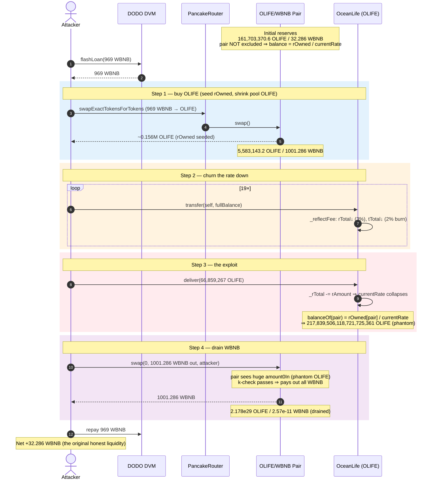
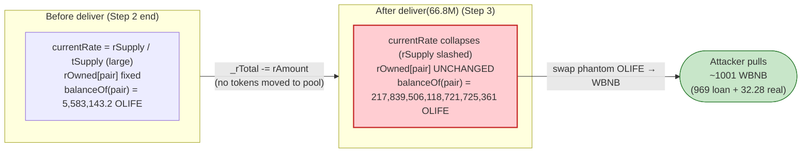
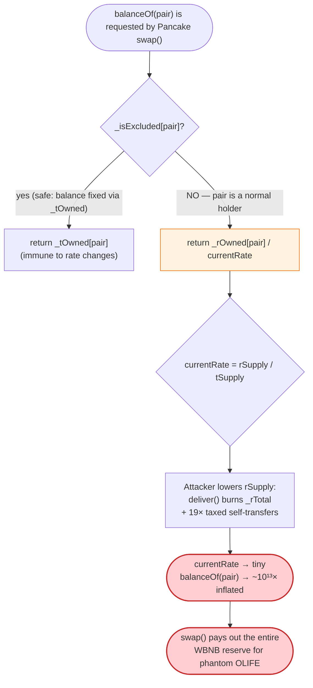

# OceanLife (OLIFE) Exploit — Reflection-Rate Collapse Inflates the Pool's Token Balance

> **Vulnerability classes:** vuln/logic/incorrect-state-transition · vuln/logic/state-update · vuln/defi/slippage

> **Reproduction:** the PoC compiles & runs in an isolated Foundry project at
> [this project folder](.) (the umbrella DeFiHackLabs repo contains many unrelated PoCs
> that do not whole-compile, so this one was extracted).
> Full verbose trace: [output.txt](output.txt).
> Verified vulnerable source: [OceanLife.sol](sources/OceanLife_b5a0Ce/OceanLife.sol).

---

## Key info

| | |
|---|---|
| **Loss** | **32.286 WBNB** (≈ $9.7K at the time) — the entire WBNB side of the OLIFE/WBNB pair |
| **Vulnerable contract** | `OceanLife` (OLIFE) — [`0xb5a0Ce3Acd6eC557d39aFDcbC93B07a1e1a9e3fa`](https://bscscan.com/address/0xb5a0Ce3Acd6eC557d39aFDcbC93B07a1e1a9e3fa#code) |
| **Victim pool** | OLIFE/WBNB PancakePair — [`0x915C2DFc34e773DC3415Fe7045bB1540F8BDAE84`](https://bscscan.com/address/0x915C2DFc34e773DC3415Fe7045bB1540F8BDAE84) |
| **Flash-loan source** | DODO DVM — `0xFeAFe253802b77456B4627F8c2306a9CeBb5d681` (969 WBNB, returned in-tx) |
| **Attack tx** | [`0xa21692ffb561767a74a4cbd1b78ad48151d710efab723b1efa5f1e0147caab0a`](https://bscscan.com/tx/0xa21692ffb561767a74a4cbd1b78ad48151d710efab723b1efa5f1e0147caab0a) |
| **Chain / block / date** | BSC / 27,470,678 / ~April 19, 2023 |
| **Compiler** | Solidity v0.8.2, optimizer **200 runs** (pair: Solidity v0.5.16) |
| **Bug class** | Reflection-token accounting flaw — caller-driven `currentRate` collapse inflates an un-excluded holder's (the pool's) balance |

---

## TL;DR

`OceanLife` is a Reflect.Finance-style ("RFI") reflection token. A holder's balance is **derived**, not
stored: `balanceOf(account) = _rOwned[account] / currentRate`, where
`currentRate = rSupply / tSupply` ([OceanLife.sol:255-258](sources/OceanLife_b5a0Ce/OceanLife.sol#L255-L258),
[:326-330](sources/OceanLife_b5a0Ce/OceanLife.sol#L326-L330),
[:512-515](sources/OceanLife_b5a0Ce/OceanLife.sol#L512-L515)).

The token exposes a **permissionless `deliver()`** function ([:306-313](sources/OceanLife_b5a0Ce/OceanLife.sol#L306-L313))
that lets *anyone* burn their own reflected balance "back to all holders." `deliver()` subtracts the caller's
`rAmount` from the **global** `_rTotal` — i.e. it shrinks `rSupply`, which shrinks `currentRate` for **everyone**.
Because the AMM pair is an ordinary, **non-excluded** holder, lowering `currentRate` makes
`_rOwned[pair] / currentRate` go **up** — the pool's OLIFE balance inflates for free, with no tokens ever sent to it.

The attacker amplifies this dramatically:

1. **Flash-loan 969 WBNB** from DODO and buy OLIFE on Pancake — this loads the attacker with a large `_rOwned`
   and shrinks the pool's OLIFE reserve.
2. **`loopTransfer(19)`** — self-transfer the whole balance 19 times. Each transfer burns 2% of supply
   (reducing `tSupply`) and reflects 3% (reducing `rSupply`), driving `currentRate` down repeatedly and
   concentrating reflected supply into the attacker's `_rOwned`.
3. **`deliver(66,859,267 OLIFE)`** — burns a large slice of the now-tiny `_rTotal`, collapsing `currentRate`
   so far that the pair's reported OLIFE balance explodes from **5,583,143 OLIFE → 217,839,506,118,721,725,361 OLIFE**
   (a ~3.9 × 10¹³× inflation), while `getReserves()` still reports the old, tiny reserve.
4. **Sell the phantom OLIFE** straight into the pair via a raw `swap()` for the formula-derived amount,
   draining **1001.28 WBNB out** (969 flash-loaned + 32.28 of real liquidity), repay the 969, and keep the rest.

Net profit = **32.286 WBNB**, exactly the pool's original WBNB reserve — the attacker walked off with 100% of the
honest liquidity.

---

## Background — what OceanLife does

`OceanLife` ([source](sources/OceanLife_b5a0Ce/OceanLife.sol)) is a BEP-20 reflection token with an 11%
transaction tax, split per the banner at the top of the file:

- **3% reflection** to holders (`_TAX_FEE = 300`, [:224](sources/OceanLife_b5a0Ce/OceanLife.sol#L224)),
- **2% burn** straight from supply (`_BURN_FEE = 200`, [:225](sources/OceanLife_b5a0Ce/OceanLife.sol#L225)),
- **6% charity** to a charity wallet (`_CHARITY_FEE = 600`, [:226](sources/OceanLife_b5a0Ce/OceanLife.sol#L226)).

It uses the canonical RFI dual-ledger design:

| Ledger | Meaning |
|---|---|
| `_tOwned` | "true" token balance, used **only for excluded accounts** |
| `_rOwned` | reflected balance, used for **everyone else** (incl. the AMM pair) |
| `_tTotal` | true total supply (260,000,000 × 10⁹ at genesis) |
| `_rTotal` | reflected total supply = `(MAX − MAX % _tTotal)` at genesis |

For a non-excluded account, `balanceOf` returns `tokenFromReflection(_rOwned[account])`
([:255-258](sources/OceanLife_b5a0Ce/OceanLife.sol#L255-L258)), which divides by `currentRate`:

```solidity
function tokenFromReflection(uint256 rAmount) public view returns(uint256) {
    require(rAmount <= _rTotal, "Amount must be less than total reflections");
    uint256 currentRate =  _getRate();
    return rAmount.div(currentRate);
}
```

and `_getRate` is simply `rSupply / tSupply` over the **non-excluded** part of supply
([:512-527](sources/OceanLife_b5a0Ce/OceanLife.sol#L512-L527)):

```solidity
function _getRate() private view returns(uint256) {
    (uint256 rSupply, uint256 tSupply) = _getCurrentSupply();
    return rSupply.div(tSupply);
}
```

The on-chain state at fork block 27,470,678 (read from the trace):

| Parameter | Value |
|---|---|
| OLIFE pool reserve (`reserve0`) | **161,703,370.6 OLIFE** |
| WBNB pool reserve (`reserve1`) | **32.286 WBNB** ← the prize |
| Pair excluded from reflection? | **No** — balance is rate-derived |
| `deliver()` access control | **None** (any non-excluded caller) |

The pair holding OLIFE via the rate-derived path is the whole game: anything that lowers `currentRate` silently
inflates the pool's OLIFE balance, and the attacker can then sell that phantom OLIFE for real WBNB.

---

## The vulnerable code

### 1. Balance is *derived* from a global, manipulable rate

```solidity
function balanceOf(address account) public view override returns (uint256) {
    if (_isExcluded[account]) return _tOwned[account];
    return tokenFromReflection(_rOwned[account]);   // ⚠️ pair is NOT excluded ⇒ this path
}
```

`balanceOf(pair) = _rOwned[pair] / currentRate`. The numerator (`_rOwned[pair]`) never changes during the
attack, but the denominator (`currentRate`) does — and *anyone* can push it down.

### 2. `deliver()` shrinks the global reflected supply, with no access control

```solidity
function deliver(uint256 tAmount) public {
    address sender = _msgSender();
    require(!_isExcluded[sender], "Excluded addresses cannot call this function");
    (uint256 rAmount,,,,,,) = _getValues(tAmount);
    _rOwned[sender] = _rOwned[sender].sub(rAmount);
    _rTotal = _rTotal.sub(rAmount);   // ⚠️ lowers rSupply ⇒ lowers currentRate for EVERYONE
    _tFeeTotal = _tFeeTotal.add(tAmount);
}
```

([OceanLife.sol:306-313](sources/OceanLife_b5a0Ce/OceanLife.sol#L306-L313))

`deliver()` is the canonical RFI "donate to all holders" primitive, but it lets the caller unilaterally burn an
arbitrary chunk of `_rTotal`. Critically `_tTotal` is **not** reduced here, so `currentRate = rSupply / tSupply`
falls — and `balanceOf` of every non-excluded holder rises proportionally.

### 3. The transfer fee mechanics compound the collapse

Every taxed transfer reduces both ledgers ([`_reflectFee`, :470-476](sources/OceanLife_b5a0Ce/OceanLife.sol#L470-L476)):

```solidity
function _reflectFee(uint256 rFee, uint256 rBurn, uint256 rCharity, uint256 tFee, uint256 tBurn, uint256 tCharity) private {
    _rTotal = _rTotal.sub(rFee).sub(rBurn).sub(rCharity);   // rSupply ↓
    _tFeeTotal = _tFeeTotal.add(tFee);
    _tBurnTotal = _tBurnTotal.add(tBurn);
    _tCharityTotal = _tCharityTotal.add(tCharity);
    _tTotal = _tTotal.sub(tBurn);                            // tSupply ↓ (only the 2% burn)
}
```

By self-transferring repeatedly (`loopTransfer`), the attacker repeatedly applies these reductions, shrinking
`tSupply` and `rSupply` until the system is so thin that a single `deliver()` can drive `currentRate` to a tiny
value — magnifying `_rOwned[pair] / currentRate` to an absurd size.

---

## Root cause — why it was possible

A Uniswap-V2/PancakeSwap pair reads its token balances via `IERC20.balanceOf(pair)` whenever it `sync`s or
performs a fee-on-transfer swap. It trusts that a token's `balanceOf` only changes when tokens are actually
moved in or out. OceanLife violates that assumption:

> `balanceOf(pair)` is **`_rOwned[pair] / currentRate`** — a function of a **global** variable (`currentRate`)
> that *any* unprivileged account can shrink by calling `deliver()` or by churning taxed transfers. No OLIFE is
> ever sent to the pair, yet its reported balance balloons by ~10¹³×.

Four design decisions compose into a critical bug:

1. **Derived balances + a non-excluded pool.** The AMM pair's balance tracks `currentRate`. Most RFI tokens
   *exclude* the pair precisely to keep its balance fixed; OceanLife does not, so the pair's balance is
   externally manipulable.
2. **Permissionless `deliver()`.** Anyone can subtract their `rAmount` from `_rTotal`, unilaterally lowering the
   global rate. There is no rate floor, no rate-change cap, and no caller restriction.
3. **Rate has no anchor.** `currentRate = rSupply / tSupply` is recomputed live on every read. Nothing pins it to
   the actual token balances of the pool, so the pool over-reports by exactly the rate-collapse factor.
4. **A raw `swap()` lets the attacker monetize the phantom balance.** Once `balanceOf(pair)` reports a giant
   OLIFE balance while `getReserves()` still shows the old, tiny `reserve0`, the difference is treated as a huge
   `amountIn`, and Pancake's constant-product formula pays out almost the entire WBNB reserve.

The attacker computes the exact extractable WBNB with the standard PancakeSwap formula
([test/OLIFE_exp.sol:89-95](test/OLIFE_exp.sol#L89-L95)):

```solidity
uint256 amountin = newolifeReserve - oldOlifeReserve;   // phantom OLIFE the pool "gained"
uint256 swapAmount = amountin * 9975 * bnbReserve
                   / (oldOlifeReserve * 10_000 + amountin * 9975);
OLIFE_WBNB_LPPool.swap(0, swapAmount, address(this), "");
```

Because `amountin` (≈ 2.18 × 10²⁹) is astronomically larger than `oldOlifeReserve` (≈ 1.6 × 10⁸ × 10⁹), the
`9975·amountin` term dominates and `swapAmount → bnbReserve` — i.e. the formula resolves to **essentially the
whole WBNB reserve**.

---

## Preconditions

- The AMM pair is a **non-excluded** OLIFE holder (its balance is rate-derived). ✓ on-chain.
- `deliver()` is callable by the attacker (caller not in `_isExcluded`). ✓ — the attacker's freshly-bought
  address is not excluded.
- Enough working capital to (a) buy OLIFE to seed a large `_rOwned`, and (b) provide the OLIFE/WBNB price impact.
  The 969 WBNB is **flash-loaned from DODO** ([test/OLIFE_exp.sol:44](test/OLIFE_exp.sol#L44)) and fully repaid
  in-transaction, so the attack is essentially capital-free.
- No timing/governance gate exists; the entire exploit fits in **one transaction**.

---

## Attack walkthrough (with on-chain numbers from the trace)

The pair's `token0 = OLIFE` (9 decimals), `token1 = WBNB` (18 decimals), so `reserve0 = OLIFE`,
`reserve1 = WBNB`. All figures are taken directly from the `Sync`/`Swap`/`getReserves` lines in
[output.txt](output.txt).

| # | Step | Pool OLIFE balance | Pool WBNB | Effect |
|---|------|-------------------:|----------:|--------|
| 0 | **Initial reserves** ([:1603](output.txt)) | 161,703,370.6 | 32.286 | Honest pool. |
| 1 | **Flash-loan 969 WBNB** from DODO ([:1580](output.txt)) | — | — | Capital sourced; repaid at the end. |
| 2 | **Buy OLIFE**: `swapExactTokensForTokensSupportingFeeOnTransferTokens(969 WBNB → OLIFE)` ([:1593](output.txt), Swap [:1626](output.txt)) | 5,583,143.2 | 1001.286 | Pool OLIFE crushed ~97% (fee-on-transfer burns some), attacker now holds ~0.156M OLIFE worth of `_rOwned`; pool WBNB = 32.28 + 969. |
| 3 | **`loopTransfer(19)`** — self-transfer full balance 19× ([:1640](output.txt) onward) | 5,583,143.2 | 1001.286 | Each transfer burns 2% (`_tTotal↓`) and reflects 3% (`_rTotal↓`); `currentRate` driven steadily down, concentrating reflected supply. |
| 4 | **`deliver(66,859,267.69 OLIFE)`** ([:1923](output.txt)) | **217,839,506,118,721,725,361.7** | 1001.286 | `_rTotal` slashed → `currentRate` collapses → **pool OLIFE balance inflates ~3.9 × 10¹³×** while `getReserves()` still returns 5,583,143.2 ([:1933](output.txt)). |
| 5 | **Raw `swap(0, 1001.286 WBNB out)`** ([:1936](output.txt), Swap [:1948](output.txt)) | 217,839,506,118,721,725,361.7 | **2.57e-11** (25,726,903 wei) | Attacker "sells" the phantom OLIFE (`amount0In ≈ 2.178e29`) and pulls **1001.286 WBNB** out — the WBNB reserve is emptied to dust. |
| 6 | **Repay 969 WBNB** to DODO ([:1952](output.txt)) | — | — | Flash loan closed. |

After repaying the 969 WBNB flash loan, the attacker's WBNB balance is **32.286 WBNB** ([:1970-1971](output.txt)).

### Why "selling phantom OLIFE" empties the WBNB side

The pair's `swap()` (Pancake v2) recomputes `amount0In = balanceOf(pair) - (reserve0 - amount0Out)`. Because
`balanceOf(pair)` now reports ~2.18 × 10²⁹ OLIFE while `reserve0` is still ~5.58 × 10¹⁵, the pair believes the
attacker deposited ~2.18 × 10²⁹ OLIFE as input. The constant-product check
`balance0Adj · balance1Adj ≥ reserve0 · reserve1` is trivially satisfied even when the requested
`amount1Out = 1001.286 WBNB` (the entire WBNB balance) is paid out. No real OLIFE changed hands — the inflated
`balanceOf` did all the work.

### Profit accounting (WBNB)

| Direction | Amount |
|---|---:|
| Flash-loaned from DODO | 969.000 |
| WBNB pulled out of the pair (step 5) | 1001.286 |
| Flash loan repaid to DODO | −969.000 |
| **Net profit** | **+32.286** |

The 32.286 WBNB profit matches the pool's **original 32.286 WBNB reserve** to the wei — confirming the attacker
extracted 100% of the honest liquidity and recovered all flash-loan capital.

---

## Diagrams

### Sequence of the attack



### Reflection-rate collapse: balance before vs. after `deliver()`



### The flaw inside `balanceOf` / `deliver`



---

## Why each magic number

- **`FLASHLOAN_WBNB_AMOUNT = 969 WBNB`:** sized to dominate the 32.286-WBNB pool — buying OLIFE with 969 WBNB
  both (a) seeds the attacker with a large `_rOwned` and (b) shrinks the pool OLIFE reserve so the later
  rate-collapse pushes the *derived* balance enormously high. The 969 is fully repaid, so the real cost is gas.
- **`loopTransfer(19)`:** 19 self-transfers repeatedly trigger `_reflectFee` (3% reflection + 2% burn), grinding
  `tSupply`/`rSupply` down so the final `deliver()` has maximum leverage on `currentRate`. (Self-transfers leave
  the attacker's net balance roughly intact while still paying the supply-shrinking fees.)
- **`deliver(66,859,267,695,870,000)` = 66,859,267.69 OLIFE (9 dp):** burns a large slice of the remaining
  `_rTotal`, collapsing `currentRate` enough that the pair's reported OLIFE balance jumps from 5,583,143.2 →
  2.178 × 10²⁰ OLIFE (the value logged at [output.txt:1570](output.txt)).
- **`swapAmount`:** computed exactly from the post-inflation `balanceOf(pair)` minus the stale `getReserves()`
  OLIFE reserve, fed through Pancake's `getAmountOut`. With `amountin ≫ oldOlifeReserve`, it resolves to
  ≈ the full 1001.286 WBNB pool balance.

---

## Remediation

1. **Exclude the AMM pair (and any contract whose balance must be stable) from reflection.** If the pair is in
   `_isExcluded`, `balanceOf(pair)` returns the fixed `_tOwned[pair]` and cannot be inflated by rate changes.
   This is the single most important fix and is exactly what robust RFI forks do.
2. **Do not expose a permissionless global-rate sink.** `deliver()` lets any caller shrink `_rTotal` and thus
   `currentRate` for everyone. Remove it, gate it to a trusted role, or — at minimum — make it impossible to move
   the rate by more than a tiny bounded amount per call/block.
3. **Anchor or floor the rate.** `currentRate = rSupply / tSupply` is recomputed live with no lower bound. Cap the
   per-transaction rate delta, or compute pool-facing balances from a source that cannot be moved by unprivileged
   actors.
4. **Prefer a stored-balance ERC-20.** Reflection accounting (derived balances over a shared rate) is inherently
   fragile around AMMs; if deflation is a product goal, implement it as explicit transfers/burns from the
   protocol's own funds rather than a global rate that every holder's balance depends on.
5. **Reject the "balance grew with no transfer" class outright.** Any token whose `balanceOf(pool)` can increase
   without a corresponding inbound transfer will break every constant-product AMM it is paired with.

---

## How to reproduce

The PoC was extracted into a standalone Foundry project (the umbrella DeFiHackLabs repo has many unrelated PoCs
that fail to compile under `forge test`'s whole-project build):

```bash
_shared/run_poc.sh 2023-04-OLIFE_exp --mt testExploit -vvvvv
```

- RPC: a **BSC archive** endpoint is required (fork block 27,470,678). Most public BSC RPCs prune that far back
  and fail with `header not found` / `missing trie node`.
- Result: `[PASS] testExploit()`.

Expected tail:

```
Ran 1 test for test/OLIFE_exp.sol:ContractTest
[PASS] testExploit() (gas: 2024966)
Logs:
  [INFO] OLIFE amount in pair before the currentRate reduction: 5583143.203784247
  [INFO] OLIFE amount in pair after the currentRate reduction: 217839506118721725361.721643770
  [End] Attacker WBNB balance after exploit: 32.286315327663894139

Suite result: ok. 1 passed; 0 failed; 0 skipped
```

The `[End] Attacker WBNB balance` of **32.286 WBNB** equals the pool's original WBNB reserve, confirming a full
drain of the honest liquidity.

---

*Reference: Beosin Alert — https://twitter.com/BeosinAlert/status/1648520494516420608 (OceanLife / OLIFE, BSC, April 2023).*
