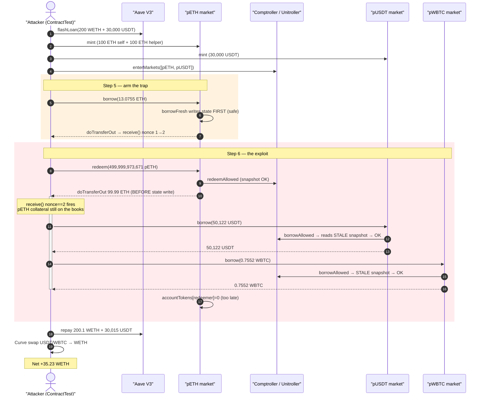
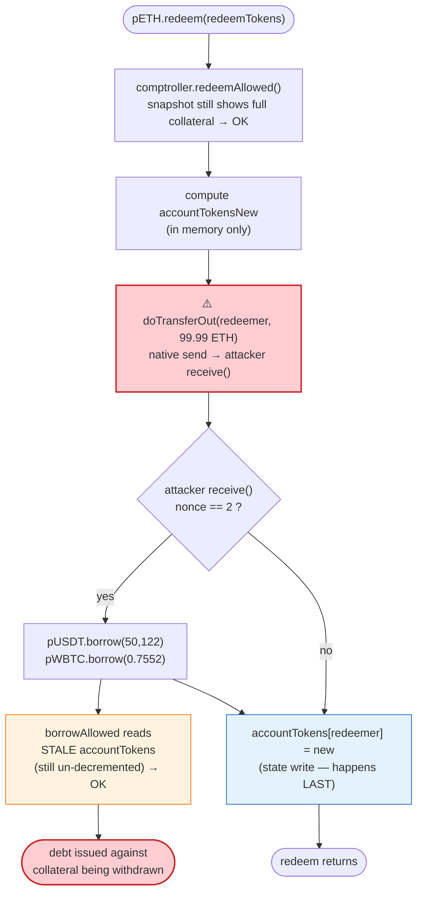
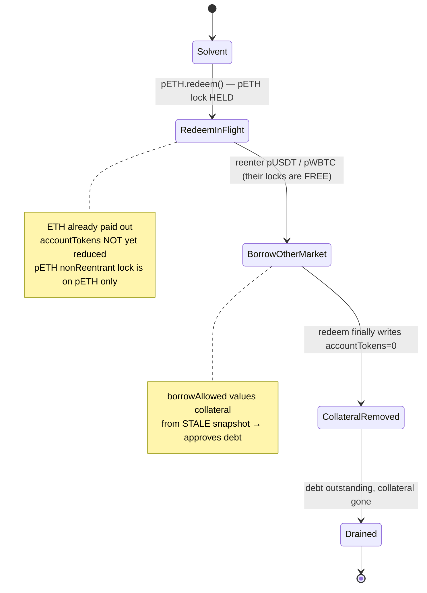

# Paribus Finance Exploit — Compound V2 Fork `redeemFresh` Cross-Market Reentrancy

> **Vulnerability classes:** vuln/reentrancy/cross-contract · vuln/logic/incorrect-order-of-operations

> **Reproduction:** the PoC compiles & runs in an isolated Foundry project at
> [this project folder](.) (the umbrella DeFiHackLabs repo contains many
> unrelated PoCs that do not whole-compile, so this one was extracted).
> Full verbose trace: [output.txt](output.txt).
> PoC source: [test/Paribus_exp.sol](test/Paribus_exp.sol).
> Verified vulnerable source: [sources/PErc20Delegator_D3e323/contracts_PToken_PToken.sol](sources/PErc20Delegator_D3e323/contracts_PToken_PToken.sol).

---

## Key info

| | |
|---|---|
| **Loss** | ~$0.79M reported by analysts (this fork-PoC nets **35.23 WETH** ≈ ~$66K residual after repaying the flash loan) |
| **Vulnerable contract** | `PToken` / `PEtherDelegate` (Compound V2 fork). pETH market: [`0x375Ae76F0450293e50876D0e5bDC3022CAb23198`](https://arbiscan.io/address/0x375Ae76F0450293e50876D0e5bDC3022CAb23198#code) |
| **Root vulnerable code** | `redeemFresh()` — [`PToken.sol:611-615`](sources/PErc20Delegator_D3e323/contracts_PToken_PToken.sol#L611-L615) |
| **Victim markets** | pETH, pUSDT (`0xD3e323…41f41`), pWBTC (`0x367351…1863`) under Unitroller (`0x2130C8…A545`) |
| **Attacker EOA / entry** | PoC `ContractTest` `0x7FA9385bE102ac3EAc297483Dd6233D62b3e1496` (+ helper `Exploiter`) |
| **Attack tx** | [`0x0e29dcf4e9b211a811caf00fc8294024867bffe4ab2819cc1625d2e9d62390af`](https://arbiscan.io/tx/0x0e29dcf4e9b211a811caf00fc8294024867bffe4ab2819cc1625d2e9d62390af) |
| **Chain / fork block / date** | Arbitrum / 79,308,097 / 2023-04-11 |
| **Compiler (on-chain)** | Solidity v0.5.17, optimizer 200 runs (Compound V2 fork) |
| **Bug class** | Reentrancy — CEI violation (external transfer before state write) crossing per-market `nonReentrant` guards |

---

## TL;DR

Paribus is a Compound V2 fork. Its `PToken.redeemFresh()` sends the underlying out to the
redeemer **before** it decrements the redeemer's pToken collateral balance
([PToken.sol:611-615](sources/PErc20Delegator_D3e323/contracts_PToken_PToken.sol#L611-L615)).
Because the pETH market pays out **native ETH**, that `doTransferOut` hands control to the
redeemer's `receive()` while its collateral is still fully on the books. The per-market
`nonReentrant` modifier does **not** help: it locks each market individually, but `redeem` on
pETH and `borrow` on pUSDT/pWBTC are *different* PToken contracts, so the attacker simply
reenters a **different** market.

The attacker:

1. Flash-loans **200 WETH + 30,000 USDT** from Aave V3.
2. Mints pETH (100 ETH via a helper contract + 100 ETH directly) and pUSDT (30,000 USDT) as collateral, enters all markets.
3. Calls `pETH.borrow(13.075 ETH)` to drain pETH cash to a useful level.
4. Calls `pETH.redeem(~100 ETH worth of pETH)`. Inside `redeemFresh`, the 99.99 ETH `doTransferOut` lands in the attacker's `receive()` **before** `accountTokens[redeemer]` is zeroed.
5. From that reentrant `receive()`, the attacker calls `pUSDT.borrow(50,122 USDT)` and `pWBTC.borrow(0.755 WBTC)`. The comptroller's `borrowAllowed` checks liquidity from the **stale** `getAccountSnapshot` (collateral not yet removed), so the borrows pass.
6. Redeem completes (collateral finally removed), the helper redeems its 100 ETH back, the flash loan is repaid (200.1 WETH + 30,015 USDT), and the attacker walks off with the borrowed USDT/WBTC converted to WETH via Curve.

Net in this fork PoC: **35.23 WETH** of free assets that were never collateralized.

---

## Background — Paribus = Compound V2 fork

Paribus deploys the standard Compound V2 money-market architecture (verified bytecode under
[`sources/`](sources/)): a `Unitroller` proxy in front of a `Comptroller`, and per-asset
`PToken` markets (`PErc20Delegator` → `PErc20Delegate`, `PEtherDelegator` → `PEtherDelegate`).
Users `mint` collateral, `enterMarkets`, then may `borrow` up to a collateral-factor-scaled
fraction of their supplied value. `redeem` returns underlying in exchange for burning pTokens.

The on-chain contracts compile under **Solidity v0.5.17** ([PToken.sol header](sources/PErc20Delegator_D3e323/contracts_PToken_PToken.sol#L1-L2)).
Account solvency is enforced lazily by the comptroller at the entry to each risky action
(`borrowAllowed`, `redeemAllowed`), which reads each market's `getAccountSnapshot` — i.e. the
**stored** `accountTokens` and `accountBorrows`. There is no global cross-market reentrancy lock;
each PToken function only carries its own per-contract `nonReentrant` modifier.

---

## The vulnerable code

### 1. `redeemFresh` — interaction before the effect (CEI violation)

```solidity
// PToken.sol:598-615
vars.totalSupplyNew   = sub_(totalSupply, vars.redeemTokens, 'REDEEM_TOO_MUCH');
vars.accountTokensNew = sub_(accountTokens[redeemer], vars.redeemTokens, 'REDEEM_TOO_MUCH');

/////////////////////////
// EFFECTS & INTERACTIONS
// (No safe failures beyond this point)

doTransferOut(redeemer, vars.redeemAmount);   // ⚠️ INTERACTION first — for pETH this sends raw ETH

// We write previously calculated values into storage
totalSupply              = vars.totalSupplyNew;
accountTokens[redeemer]  = vars.accountTokensNew;   // ⚠️ EFFECT happens AFTER the external call
```

The collateral burn (`accountTokens[redeemer] = …`, [L615](sources/PErc20Delegator_D3e323/contracts_PToken_PToken.sol#L615))
is written **after** `doTransferOut` ([L611](sources/PErc20Delegator_D3e323/contracts_PToken_PToken.sol#L611)).
For the pETH market `doTransferOut` performs a native-value send, which calls the redeemer's
`receive()`/`fallback()`. During that window the redeemer's collateral is still fully recorded.

### 2. `borrowFresh` — the *correct* pattern, for contrast

```solidity
// PToken.sol:684-696
/* Note: Avoid token reentrancy attacks by writing increased borrow before external transfer. */
accountBorrows[borrower].principal    = vars.accountBorrowsNew;
accountBorrows[borrower].interestIndex = borrowIndex;
totalBorrows                          = vars.totalBorrowsNew;

doTransferOut(borrower, borrowAmount);   // state already updated → safe within this market
```

`borrowFresh` writes its state **before** the transfer (and even documents the reasoning at
[L684](sources/PErc20Delegator_D3e323/contracts_PToken_PToken.sol#L684)). The author understood
the reentrancy risk for borrow but left the **symmetric** flaw in `redeemFresh` — the same fix
(move the storage write above `doTransferOut`) was simply never applied there. This is the exact
bug that hit Hundred Finance, CREAM, and other Compound forks with native/callback-capable
underlyings.

### 3. The `nonReentrant` guard is per-market, not global

Each user-facing function (`mintInternal`, `redeemInternal`, `borrowInternal`, …) carries
`nonReentrant` ([e.g. L512, L632](sources/PErc20Delegator_D3e323/contracts_PToken_PToken.sol#L512)),
but the lock lives in **each PToken's own storage**. Reentering `pETH.redeem` would be blocked —
but the attacker reenters `pUSDT.borrow` and `pWBTC.borrow`, which are *separate contracts* with
*separate* locks that are not held. The guard therefore provides no protection against the
cross-market path.

---

## Root cause

A single invariant must hold whenever the comptroller evaluates solvency: **an account's recorded
collateral (`accountTokens`) must reflect every withdrawal already in flight.** `redeemFresh`
breaks it by paying out underlying before reducing `accountTokens`. The pETH market pays native
ETH, so the redeemer gets a re-entry hook mid-redemption while still appearing fully
collateralized.

Composed failures:

1. **CEI violation** in `redeemFresh`: external call (`doTransferOut`) precedes the collateral state write.
2. **Native-ETH underlying** in the pETH market makes the external call an attacker-controlled callback (`receive()`), not an inert ERC-20 transfer.
3. **Per-market reentrancy lock, not global**: reentering a *different* market (pUSDT/pWBTC) sidesteps the pETH lock entirely.
4. **Lazy, snapshot-based solvency**: `borrowAllowed` trusts `getAccountSnapshot`'s stored `accountTokens`, which is still un-decremented during the reentrant borrow.

The result: the attacker borrows USDT and WBTC against ETH collateral that is simultaneously being
withdrawn — double-counting the same collateral.

---

## Preconditions

- The market with the reentrancy must have a **callback-capable underlying** — here pETH (native ETH). An ERC-20-only market would not hand control to the attacker mid-`redeemFresh`.
- Attacker must hold (or be able to mint) enough collateral to make the reentrant borrow look solvent under the stale snapshot. The PoC funds this with an Aave V3 flash loan of **200 WETH + 30,000 USDT** ([Paribus_exp.sol:49-58](test/Paribus_exp.sol#L49-L58)).
- Attacker controls the redeemer address (a contract with a malicious `receive()` that fires the reentrant borrows). Implemented via `ContractTest.receive()` gated on `nonce == 2` ([Paribus_exp.sol:98-104](test/Paribus_exp.sol#L98-L104)).
- All capital is recovered intra-transaction → fully **flash-loanable**, no attacker principal at risk.

---

## Attack walkthrough (with on-chain numbers from the trace)

All numbers are read directly from [output.txt](output.txt). The malicious `receive()` is a
nonce-gated state machine ([Paribus_exp.sol:98-104](test/Paribus_exp.sol#L98-L104)): only the
**3rd** native-ETH inbound (`nonce == 2`) fires the reentrant borrows.

| # | Step | Call (trace line) | Key values | Effect |
|---|------|-------------------|-----------|--------|
| 0 | **Flash loan** | `aaveV3.flashLoan(...)` ([L33](output.txt)) | 200 WETH + 30,000 USDT | Working capital. Premiums: 0.1 WETH, 15 USDT. |
| 1 | **Mint pETH (helper)** | `exploiter.mint()` → `pETH.mint{100 ETH}` ([L111-L164](output.txt)) | 100 ETH → 499,999,973,671 pETH | Helper collateral; `receive` nonce stays 0 (helper has its own). |
| 2 | **Mint pETH (self)** | `WETH.withdraw(100)` → `receive`(nonce 0→1) → `pETH.mint{100 ETH}` ([L165-L210](output.txt)) | 100 ETH → 499,999,973,671 pETH | Attacker collateral; 1st native inbound. |
| 3 | **Mint pUSDT** | `pUSDT.mint(30,000 USDT)` ([L215-L278](output.txt)) | 30,000 USDT → 149,998,977,341,652 pUSDT | More collateral. |
| 4 | **Enter markets** | `unitroller.enterMarkets([pETH,pUSDT])` ([L279](output.txt)) | — | Collateral counted toward liquidity. |
| 5 | **Borrow pETH** | `pETH.borrow(13.0755 ETH)` ([L301](output.txt)) | doTransferOut → `receive`(nonce 1→2) | 2nd native inbound; arms the trap. `borrowFresh` is safe (state written first). |
| 6 | **Redeem pETH (the trigger)** | `pETH.redeem(499,999,973,671)` ([L408](output.txt)) | redeemAmount = 99.99999999999484 ETH | `redeemFresh` calls `doTransferOut` **before** updating `accountTokens`. |
| 6a | **↳ reentrant `receive`** | `ContractTest.receive{99.99 ETH}` (nonce 2) ([L481](output.txt)) | — | Fires while pETH collateral is still on the books. |
| 6b | **↳↳ reentrant borrow USDT** | `pUSDT.borrow(50,122.071155 USDT)` ([L486](output.txt)) | `borrowAllowed` sees stale snapshot → passes | Borrows against collateral being withdrawn. |
| 6c | **↳↳ reentrant borrow WBTC** | `pWBTC.borrow(0.75523112 WBTC)` ([L615](output.txt)) | passes | Same double-count. |
| 6d | **Redeem completes** | `accountTokens[redeemer]` finally zeroed; `emit Redeem` ([L803-L811](output.txt)) | pETH collateral removed *after* the borrows | Invariant restored — too late. |
| 7 | **Helper redeems** | `exploiter.redeem()` → `pETH.redeem` → returns 99.99 ETH ([L814-L867](output.txt)) | back to attacker as WETH | Recovers helper's 100 ETH. |
| 8 | **Repay flash loan** | WETH 200.1 + USDT 30,015 to Aave ([L908, L950](output.txt)) | principal + premium | Loan closed. |
| 9 | **Liquidate gains on Curve** | `curve.exchange(USDT→WETH)` 20,107 USDT → 10.4590 WETH ([L1001-L1042](output.txt)); `curve.exchange(WBTC→WETH)` 0.75523112 WBTC → 11.7945 WETH ([L1049-L1088](output.txt)) | — | Convert stolen USDT/WBTC to WETH. |
| 10 | **Final balance** | `WETH.balanceOf(attacker)` ([L1089-L1097](output.txt)) | **35.228921031652377951 WETH** | Profit. |

### Why the borrow passes — the stale snapshot

At step 5 (`pETH.borrow`) and step 6b (reentrant `pUSDT.borrow`), `borrowAllowed` reads
`pETH.getAccountSnapshot(attacker)` and gets pToken balance `0x…746a522127` =
**499,999,973,671 pETH** ([L324-L327](output.txt), again at [L473-L476](output.txt) *inside* the
redeem). At the moment of the reentrant borrows the redeem's `doTransferOut` has already paid out
99.99 ETH, but `accountTokens[redeemer]` is **not yet zeroed** (that write is line 615, which runs
after `receive` returns). So the comptroller values the attacker as still holding ~100 ETH of pETH
collateral *plus* the pUSDT collateral — enough to authorize 50,122 USDT + 0.755 WBTC of new debt.

---

## Profit / loss accounting (WETH)

| Item | WETH |
|---|---:|
| Stolen USDT (50,122) — 20,107 swapped on Curve → WETH | +10.4590 |
| Stolen WBTC (0.75523112) → WETH on Curve | +11.7945 |
| Net ETH retained from the pETH borrow/redeem juggling (kept after flash-loan repay) | ≈ +12.975 |
| **Final attacker WETH balance** ([L1091](output.txt)) | **35.228921** |

- Aave flash-loan repaid in full: **200.1 WETH** ([L908](output.txt)) and **30,015 USDT** ([L950](output.txt)) — principal + 0.05% premium.
- The 35.23 WETH residual is pure profit: assets borrowed against collateral that was simultaneously withdrawn, i.e. never actually backed.
- Public reporting (PeckShield/BlockSec/Phalcon) put the live incident at roughly **$0.79M**; this isolated fork-PoC reproduces the mechanism at the fork block, netting ~35 WETH after loan repayment.

---

## Diagrams

### Sequence of the attack



### Where the invariant breaks inside `redeemFresh`



### Why the per-market lock fails (collateral double-count)



---

## Remediation

1. **Fix the CEI ordering in `redeemFresh`.** Move the storage writes above the external call, exactly as `borrowFresh` already does:
   ```diff
   - doTransferOut(redeemer, vars.redeemAmount);
   - totalSupply = vars.totalSupplyNew;
   - accountTokens[redeemer] = vars.accountTokensNew;
   + totalSupply = vars.totalSupplyNew;
   + accountTokens[redeemer] = vars.accountTokensNew;
   + doTransferOut(redeemer, vars.redeemAmount);
   ```
   This is the canonical Compound-fork fix (a.k.a. the Hundred/CREAM patch).
2. **Add a global (cross-market) reentrancy guard** in the comptroller, or have every PToken share a single reentrancy lock, so reentering a *different* market is also blocked. Per-market `nonReentrant` is insufficient when markets call out to attacker-controlled receivers.
3. **Treat native-ETH and callback-capable markets as hostile.** Any market whose `doTransferOut` can hand control to the recipient must complete all accounting before transferring.
4. **Re-check liquidity after the transfer** (defense in depth): re-evaluate the account's shortfall once the redeem's effects are committed, and revert if the account became insolvent.
5. **Pull the upstream Compound V2 reentrancy fixes** before forking — this exact `redeemFresh` ordering bug was patched upstream and is a known class for Compound forks with ETH/ERC-777-style underlyings.

---

## How to reproduce

The PoC was extracted into a standalone Foundry project (the umbrella DeFiHackLabs repo does not
whole-compile under `forge test`):

```bash
_shared/run_poc.sh 2023-04-Paribus_exp --mt testExploit -vvvvv
```

- RPC: an **Arbitrum archive** endpoint is required (fork block 79,308,097). `foundry.toml`'s `arbitrum` endpoint serves the historical state at that block.
- Result: `[PASS] testExploit()` with `Attacker WETH balance after exploit: 35.228921031652377951`.

Expected tail:

```
Ran 1 test for test/Paribus_exp.sol:ContractTest
[PASS] testExploit() (gas: 3909058)
Logs:
  Attacker WETH balance after exploit: 35.228921031652377951

Suite result: ok. 1 passed; 0 failed; 0 skipped
```

---

*References: PeckShield ([tweet](https://twitter.com/peckshield/status/1645742296904929280)),
BlockSec ([tweet](https://twitter.com/BlockSecTeam/status/1645744655357575170)),
Phalcon ([tweet](https://twitter.com/Phalcon_xyz/status/1645742620897955842)). Classic Compound V2
fork `redeemFresh` reentrancy, Arbitrum, April 2023.*
