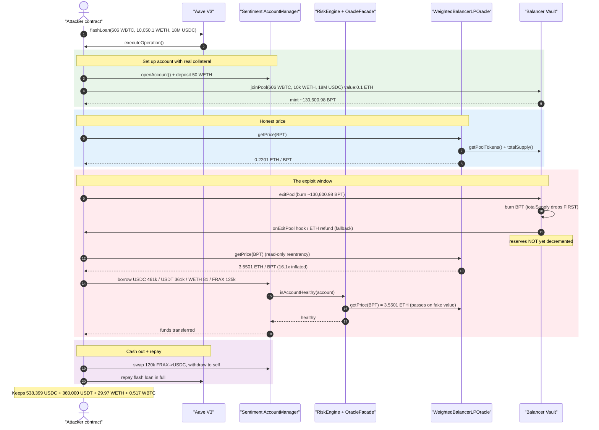
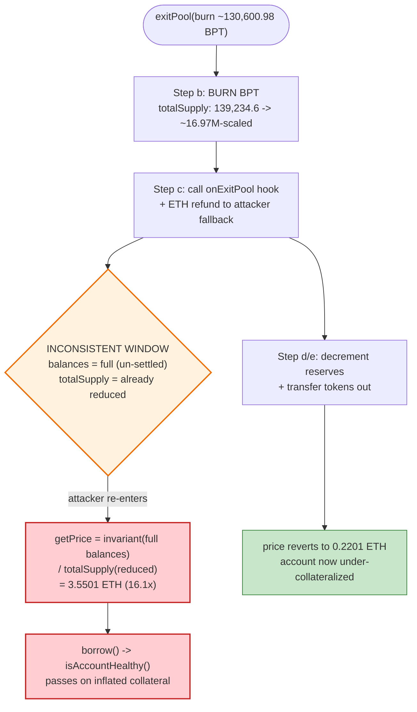
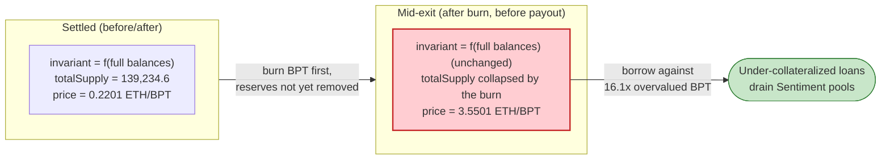

# Sentiment Protocol Exploit — Balancer Read-Only Reentrancy Inflates LP-Collateral Price

> **Vulnerability classes:** vuln/reentrancy/read-only · vuln/oracle/price-manipulation

> **Reproduction:** the PoC compiles & runs in an isolated Foundry project at
> [this project folder](.) (the umbrella DeFiHackLabs repo
> contains many unrelated PoCs that do not whole-compile, so this one was extracted).
> Full verbose trace: [output.txt](output.txt).
> Verified vulnerable source: [src_balancer_WeightedBalancerLPOracle.sol](sources/WeightedBalancerLPOracle_16F3ae/src_balancer_WeightedBalancerLPOracle.sol).

---

## Key info

| | |
|---|---|
| **Loss** | ~$1.0M total. In this fork run the attacker walked off with **538,399.33 USDC + 360,000 USDT + 29.97 WETH + 0.517 WBTC** against a debt backed by worthless residual collateral |
| **Bug class** | Read-only reentrancy → manipulated LP-token oracle → under-collateralized borrow |
| **Vulnerable contract** | `WeightedBalancerLPOracle` — [`0x16F3ae9C1727ee38c98417cA08BA785BB7641b5B`](https://arbiscan.io/address/0x16F3ae9C1727ee38c98417cA08BA785BB7641b5B#code) |
| **Vulnerable design** | Sentiment `OracleFacade` → `WeightedBalancerLPOracle`, consumed by `RiskEngine.isAccountHealthy` |
| **Victim** | Sentiment Protocol lending pools (USDC/USDT/WETH/WBTC/FRAX LToken vaults) on Arbitrum |
| **External primitive abused** | Balancer V2 Vault `0xBA12222222228d8Ba445958a75a0704d566BF2C8` — the WBTC/WETH/USDC 3-token weighted pool (`balancerToken 0x64541216bAFFFEec8ea535BB71Fbc927831d0595`, PoolId `0x6454…0002`) |
| **Attacker EOA** | `0x14920f9bF33B45dD6E1d7252fa78a3d4c1b3859a` (per PeckShield/SlowMist) |
| **Attack tx** | `0xa9ff2b587e2741575daf893864710a5cbb44bb64ccdc487a100fa20741e0f74d` |
| **Chain / block / date** | Arbitrum / fork at **77,026,912** / **April 4, 2023** |
| **Compiler (oracle)** | Solidity v0.8.17, optimizer 200 runs |
| **Flash-loan provider** | Aave V3 (`0x794a61358D6845594F94dc1DB02A252b5b4814aD`) |

---

## TL;DR

Sentiment is an over-collateralized lending protocol that lets users deposit Balancer LP
tokens (BPT) as collateral. The price of a Balancer weighted-pool LP token is computed by
`WeightedBalancerLPOracle.getPrice()`
([src_balancer_WeightedBalancerLPOracle.sol:43-67](sources/WeightedBalancerLPOracle_16F3ae/src_balancer_WeightedBalancerLPOracle.sol#L43-L67)):

```
price = invariant(balances) · temp(prices, weights) / totalSupply()
```

It reads `balances` via `vault.getPoolTokens(...)` and the BPT's `totalSupply()`. The
flaw is that **both reads are taken at the moment `getPrice` runs, with no reentrancy
guard.** During a Balancer V2 `exitPool`, the Vault **burns the user's BPT first**
(reducing `totalSupply`) and only transfers the underlying reserves out **after** invoking
the pool's `onExitPool` hook. There is a window — inside that callback / the `value` ETH
refund — where the pool's token balances are still the *full pre-exit* amounts while
`totalSupply` has *already shrunk*. In that window:

```
inflated price = (still-large invariant) / (already-small totalSupply)  →  price explodes
```

The attacker re-enters `getPrice` during that window (a *read-only* reentrancy — they only
call a `view` function), measured the LP price jump from **0.2201 → 3.5501 ETH per BPT
(≈16.1×)**, and used the temporarily over-valued LP collateral to borrow far more than the
collateral was really worth. They drained USDC/USDT/WETH/WBTC/FRAX from Sentiment's lending
pools and left behind a position whose collateral, once the exit completed and the price
reverted to 0.2201, was nowhere near enough to cover the debt.

---

## Background — Sentiment, Balancer LP collateral, and the price formula

**Sentiment** is an account-based, under-collateralization-checked margin protocol. A user
`openAccount()`s a smart-contract account, `deposit()`s collateral, and `borrow()`s assets
from per-asset LToken vaults. After every borrow, `RiskEngine.isAccountHealthy(account)`
re-prices all of the account's assets (including any Balancer BPT it holds) and reverts if
the account's debt exceeds the allowed loan-to-value of its collateral.

The LP-token valuation lives in `WeightedBalancerLPOracle.getPrice()`. The "fair LP price"
approach it implements is the standard Balancer weighted-pool formula
([source](sources/WeightedBalancerLPOracle_16F3ae/src_balancer_WeightedBalancerLPOracle.sol#L43-L67)):

```solidity
function getPrice(address token) external view returns (uint) {
    ( address[] memory poolTokens,
      uint256[] memory balances, ) = vault.getPoolTokens(IPool(token).getPoolId());

    uint256[] memory weights = IPool(token).getNormalizedWeights();

    uint length = weights.length;
    uint temp = 1e18;
    uint invariant = 1e18;
    for (uint i; i < length; i++) {
        temp = temp.mulDown(
            (oracleFacade.getPrice(poolTokens[i]).divDown(weights[i])).powDown(weights[i])
        );
        invariant = invariant.mulDown(
            (balances[i] * 10 ** (18 - IERC20(poolTokens[i]).decimals())).powDown(weights[i])
        );
    }
    return invariant.mulDown(temp).divDown(IPool(token).totalSupply());   // ⚠️ live balances / live totalSupply
}
```

The formula is mathematically correct **only if `balances` and `totalSupply` are observed
at a consistent point** (i.e., when the pool is in a settled state, `balances/totalSupply`
ratio is stable). The Balancer Vault is *not* in a settled state in the middle of an
`exitPool` — and `getPoolTokens` happily returns the un-settled balances to any caller,
including a re-entrant `view` call.

The 3-token weighted pool here is **WBTC / WETH / USDC**. On the fork, before the attack,
`getPrice(balancerToken)` returned **0.2201 ETH / BPT** and the pool BPT `totalSupply` was
**≈139,234.6 BPT** (`getPoolTokens`-era supply read in the trace).

---

## The vulnerable code

### 1. No reentrancy / settlement check before reading pool state

```solidity
// WeightedBalancerLPOracle.getPrice
( , uint256[] memory balances, ) = vault.getPoolTokens(IPool(token).getPoolId());
...
return invariant.mulDown(temp).divDown(IPool(token).totalSupply());
```

[src_balancer_WeightedBalancerLPOracle.sol:43-67](sources/WeightedBalancerLPOracle_16F3ae/src_balancer_WeightedBalancerLPOracle.sol#L43-L67)

The oracle does **not** call the Balancer-recommended reentrancy check
(`VaultReentrancyLib.ensureNotInVaultContext` / a `manageUserBalance([])` no-op). It reads
`getPoolTokens` (raw, un-settled balances) and `totalSupply` (already decremented by the
in-progress burn) and divides one by the other.

### 2. The Balancer exit burns BPT before paying out reserves

From the trace, inside `Balancer::exitPool`:

```
balancerToken::onExitPool(...)
  emit Transfer(from: attacker, to: address(0), value: 130,600.98 BPT)   // ← BPT burned FIRST
  storage @ ...bb03 : 0x...1ba7e4b133d4146f8ec4 → 0                       // ← totalSupply slot drops
  console.log("In Read-Only-Reentrancy Collateral Price", 3.5501e18)     // ← oracle now mis-prices
  AccountManager::borrow(... USDC 461,000e6 ...)                          // ← borrow at inflated price
```

[output.txt — `onExitPool` / burn / "In Read-Only-Reentrancy" block](output.txt)

The underlying WBTC/WETH/USDC are only sent out *after* the hook returns. So during the
hook (and the subsequent ETH-refund `fallback`), `getPoolTokens` still reports the full
pre-exit reserves while `totalSupply` is already ~16.97M-scaled (post-burn). The ratio — and
therefore the per-BPT price — is inflated.

---

## Root cause — why it was possible

Balancer V2 settles `exitPool` in this order: (a) compute amounts out, (b) **burn the
user's BPT** (lowering `totalSupply`), (c) call the pool's `onExitPool` hook, (d) decrement
the Vault's internal reserve accounting and (e) transfer the underlying tokens to the user.
Between (b) and (d) the Vault is in an *inconsistent* state: `totalSupply` is reduced but
the queryable `getPoolTokens` balances are not.

`WeightedBalancerLPOracle.getPrice` trusts that state to be consistent. It is a pure read of
mutable Vault state with **no protection against being called mid-mutation**. The attacker
arranges for the price to be read *during* their own exit by simply calling the lending
protocol's `borrow()` from within a callback that fires during `exitPool` — and `borrow()`
internally calls `isAccountHealthy → OracleFacade.getPrice → WeightedBalancerLPOracle.getPrice`.

Because Sentiment trusts that oracle to gate borrows, the inflated price let the attacker
borrow against collateral worth ~16× less than the protocol believed.

Three design facts compose into the exploit:

1. **The oracle reads un-settled Vault state.** No `ensureNotInVaultContext`/reentrancy
   latch, so `getPrice` returns a manipulated value whenever it is called inside an
   `exitPool`.
2. **`totalSupply` is in the denominator and shrinks first.** The exit burns BPT before
   reserves leave, so `invariant/totalSupply` spikes. The bigger the exit, the bigger the
   spike — the attacker controls the size by minting/holding a huge BPT position with the
   flash-loaned funds.
3. **The borrow path re-prices collateral synchronously inside the attacker-controlled
   callback.** `borrow → isAccountHealthy → getPrice` runs at the worst possible moment,
   and the health check passes on a fictitious valuation.

---

## Preconditions

- A Sentiment-listed Balancer weighted pool whose LP token is accepted as collateral and
  priced by `WeightedBalancerLPOracle` (here the WBTC/WETH/USDC pool).
- The ability to perform a large `joinPool`/`exitPool` so the burn-before-payout window
  moves the price meaningfully. The attacker sources this capital with an **Aave V3 flash
  loan** of 606 WBTC + 10,050.1 WETH + 18,000,000 USDC
  ([output.txt:50](output.txt)), all repaid in the same transaction → effectively
  zero-capital.
- A Sentiment account holding a sliver of *real* collateral (here 50 WETH deposited via
  `depositCollateral`) so the account exists and is "healthy" before the manipulation.
- A re-entrancy entry point: the attacker's contract receives an ETH refund (`joinPool` is
  called with `value: 0.1 ether`, the surplus is refunded) which lands in their `fallback`,
  from which they call `borrow` during the exit window
  ([test/Sentiment_exp.sol:194-202](test/Sentiment_exp.sol#L194-L202)).

---

## Attack walkthrough (with on-chain numbers from the trace)

The pool is `[WBTC, WETH, USDC]`. All oracle prices below are the
`getPrice(balancerToken)` console logs in [output.txt](output.txt).

| # | Step | Source | Effect / on-chain number |
|---|------|--------|--------------------------|
| 0 | **Flash loan** 606 WBTC + 10,050.1 WETH + 18,000,000 USDC from Aave V3 | [output.txt:50](output.txt) | Working capital, repaid same-tx |
| 1 | **`openAccount()`** + deposit 50 WETH as real collateral | [test:121-143](test/Sentiment_exp.sol#L121-L143) | Account `0xdf34…3b8c` created & funded ([output.txt:146](output.txt)) |
| 2 | **`joinPool`** 606 WBTC + 10,000 WETH + 18,000,000 USDC (value: 0.1 ETH) → mint ~130,600.98 BPT to attacker | [test:146-167](test/Sentiment_exp.sol#L146-L167) | Attacker now holds a huge BPT position |
| 3 | Read price **before** reentrancy | [output.txt — "Before…"] | **0.2201 ETH / BPT** (220132731298820699) |
| 4 | **`exitPool`** burning all ~130,600.98 BPT | [test:169-192](test/Sentiment_exp.sol#L169-L192) | Vault burns BPT first → `totalSupply` drops to ~16.97M-scaled **before** reserves leave |
| 5 | **Inside the exit callback** (`fallback`, `nonce==2`) read price **during** reentrancy | [test:194-202](test/Sentiment_exp.sol#L194-L202) | **3.5501 ETH / BPT** (3550073070005057760) — **≈16.1× inflated** |
| 6 | Still inside the callback, **`borrow` everything** against the now-overvalued account | [test:204-237](test/Sentiment_exp.sol#L204-L237) | 461,000 USDC + 361,000 USDT + 81 WETH + 125,000 FRAX — each `isAccountHealthy` check passes on the fake price |
| 7 | Convert/repay: swap 120,000 FRAX→USDC via FRAXBP, supply part back to Aave, withdraw to self, repay flash loan | [test:209-236](test/Sentiment_exp.sol#L209-L236) | Loan repaid; stolen funds retained |
| 8 | Exit completes → price reverts | [output.txt — "After…"] | **0.2201 ETH / BPT** (220132731306501952) — back to honest value; account now deeply under-water |

### The price manipulation, exactly

| State | Pool balances source | BPT `totalSupply` | `getPrice` |
|-------|----------------------|-------------------|-----------|
| Before exit | full reserves (`getPoolTokens`) | ~139,234.6 BPT | **0.2201 ETH** |
| **During exit (after burn, before payout)** | **still full reserves** | **~16.97M-scaled (post-burn)** | **3.5501 ETH** ⚠️ |
| After exit | reserves reduced | reduced | **0.2201 ETH** |

The numerator (`invariant`, built from `getPoolTokens` balances) barely changed while the
denominator (`totalSupply`) collapsed → the per-BPT price ballooned 16×. The borrows in step
6 were sized to sit just under the *inflated* LTV limit, i.e. far above the *real* one.

### Profit accounting (final attacker balances after exploit)

| Asset | Final balance | Source |
|-------|--------------:|--------|
| USDC | 538,399.328226 | [output.txt — log_named_decimal_uint USDC] |
| USDT | 360,000.000000 | [output.txt — log_named_decimal_uint USDT] |
| WETH | 29.973117 | [output.txt — log_named_decimal_uint WETH] |
| WBTC | 0.51695721 | [output.txt — log_named_decimal_uint WBTC] |

These are the residuals the attacker keeps after repaying the Aave flash loan in full;
the corresponding ~$1M of debt is stranded on the Sentiment account against collateral
worth a fraction of it once the price reverted to 0.2201 ETH/BPT.

---

## Diagrams

### Sequence of the attack



### Where the inconsistent state comes from (exitPool ordering)



### The arithmetic of the mispricing



---

## Remediation

1. **Add the Balancer reentrancy guard to the oracle (the canonical fix).** Before reading
   pool state, call `vault.manageUserBalance(new UserBalanceOp )` (a no-op that reverts if
   the Vault is in a reentrant/un-settled context), or use Balancer's
   `VaultReentrancyLib.ensureNotInVaultContext(vault)`. This makes `getPrice` revert when
   called mid-`join`/`exit`, so the manipulated value can never be observed. This is exactly
   the mitigation Balancer published after the read-only-reentrancy class was disclosed.
2. **Do not price LP tokens from instantaneous, mutable Vault state.** Where possible, derive
   the fair price from external asset prices and the pool *invariant* using a method that is
   immune to single-block reserve/supply skew, and/or sanity-bound the result against a TWAP.
3. **Sanity-bound oracle outputs.** A 16× jump in an LP price within one transaction should
   trip a circuit breaker (max deviation vs. last value / vs. a TWAP) and revert the borrow.
4. **Re-price collateral outside of attacker-controlled callbacks.** Any health check that
   can be triggered re-entrantly during an AMM operation is exposed; gating borrows behind a
   non-reentrant boundary that cannot be entered from a Balancer hook removes the timing
   advantage.
5. **General principle.** Treat *any* `view` function that reads another protocol's live
   accounting as potentially manipulable mid-callback. "Read-only" does not mean
   "manipulation-proof."

---

## How to reproduce

The PoC runs in this standalone Foundry project (extracted because the umbrella DeFiHackLabs
repo does not whole-compile under `forge test`):

```bash
_shared/run_poc.sh 2023-04-Sentiment_exp --mt testExploit -vvvvv
```

- RPC: an **Arbitrum archive** endpoint is required (fork block 77,026,912, April 2023).
  `foundry.toml` uses `https://arbitrum-one.public.blastapi.io` for the `arbitrum` alias.
- The three console logs prove the manipulation: **Before 0.2201 → In 3.5501 → After 0.2201
  ETH/BPT**.

Expected tail:

```
  Attacker USDC balance after exploit: 538399.328226
  Attacker USDT balance after exploit: 360000.000000
  Attacker WETH balance after exploit: 29.973117081932212940
  Attacker WBTC balance after exploit: 0.51695721

Suite result: ok. 1 passed; 0 failed; 0 skipped; finished in 93.98s
```

---

*References: PeckShield — https://twitter.com/peckshield/status/1643417467879059456 ·
spreekaway — https://twitter.com/spreekaway/status/1643313471180644360 ·
"Theoretical & Practical Balancer and Read-Only Reentrancy" —
https://medium.com/coinmonks/theoretical-practical-balancer-and-read-only-reentrancy-part-1-d6a21792066c*
