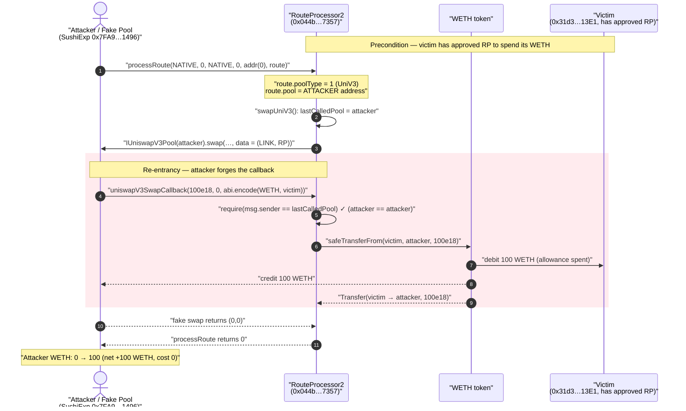
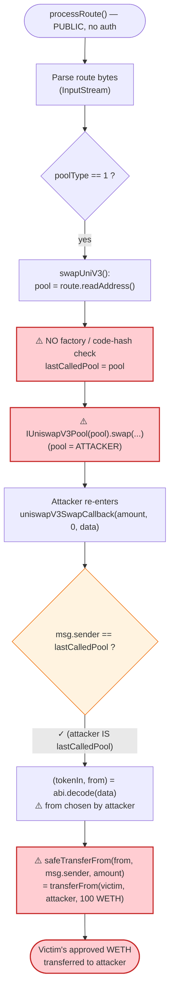
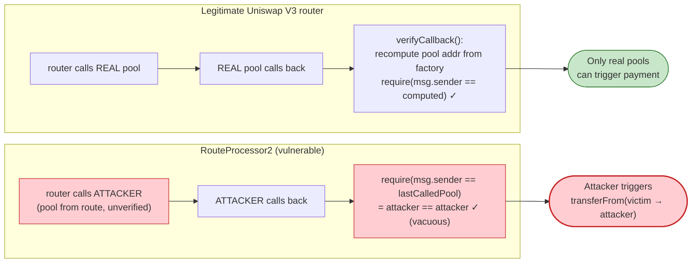

# Sushi RouteProcessor2 Exploit — Attacker-Controlled "Pool" Drains Approved Tokens via `uniswapV3SwapCallback`

> **Reproduction:** the PoC compiles & runs in an isolated Foundry project at
> [this project folder](.) (the umbrella DeFiHackLabs repo contains many unrelated PoCs
> that do not compile under a single `forge build`, so this one was extracted).
> Full verbose trace: [output.txt](output.txt).
> Verified vulnerable source: [contracts_RouteProcessor2.sol](sources/RouteProcessor2_044b75/contracts_RouteProcessor2.sol).

---

## Key info

| | |
|---|---|
| **Loss** | ~$3.3M aggregate across all affected approvers (PoC drains **100 WETH** from one victim as a minimal demonstration) |
| **Vulnerable contract** | `RouteProcessor2` — [`0x044b75f554b886A065b9567891e45c79542d7357`](https://etherscan.io/address/0x044b75f554b886A065b9567891e45c79542d7357#code) |
| **Victim (in PoC)** | `0x31d3243CfB54B34Fc9C73e1CB1137124bD6B13E1` — an EOA/contract that had `approve`d the router for WETH |
| **Attacker EOA** | `0x047547A4fa4a67C1032d249B49EC1a79c0460BAD` (per public reports) |
| **Attacker contract (in PoC)** | `0x7FA9385bE102ac3EAc297483Dd6233D62b3e1496` (`SushiExp`) — doubles as the fake "pool" |
| **Sample attack tx** | [`0x04b166e7b4ab5105a8e9c85f08f6346de1c66368687215b0e0b58d6e5002bc32`](https://etherscan.io/tx/0x04b166e7b4ab5105a8e9c85f08f6346de1c66368687215b0e0b58d6e5002bc32) |
| **Chain / fork block / date** | Ethereum mainnet / 17,007,841 / April 9, 2023 |
| **Compiler** | Solidity v0.8.10, optimizer enabled, 10,000,000 runs |
| **Bug class** | Missing pool-authenticity validation → arbitrary external call with unvalidated callback → theft of any approved token |

---

## TL;DR

`RouteProcessor2` is the Sushi aggregator's on-chain route executor. To swap on a Uniswap-V3-style pool
it reads the pool address **straight out of the caller-supplied `route` bytes**, stashes it in
`lastCalledPool`, and calls `pool.swap(...)`
([contracts_RouteProcessor2.sol:310-324](sources/RouteProcessor2_044b75/contracts_RouteProcessor2.sol#L310-L324)).
The V3 pool is then expected to call back into `uniswapV3SwapCallback(...)`, at which point the router
pays the pool what it owes — by transferring tokens **from an address also encoded in the callback `data`**
([:335-348](sources/RouteProcessor2_044b75/contracts_RouteProcessor2.sol#L335-L348)).

The only guard on that callback is `require(msg.sender == lastCalledPool)`. But **`lastCalledPool` is
whatever address the attacker put in the route** — there is no check that it is a *real* Uniswap V3 pool
deployed by the canonical factory (the NatSpec even says it should be checked, and it isn't). So the
attacker:

1. Sets the "pool" to **their own contract**.
2. Calls `processRoute(...)`. The router dutifully calls `attacker.swap(...)`.
3. Inside that fake `swap`, the attacker re-enters `uniswapV3SwapCallback(amount, 0, abi.encode(WETH, victim))`.
4. `msg.sender == lastCalledPool` passes (the attacker *is* `lastCalledPool`), so the router executes
   `WETH.safeTransferFrom(victim, msg.sender /* = attacker */, amount)`.

Because real users had granted the router unlimited ERC-20 allowances (the normal aggregator UX), the
attacker can move **any approved token, in any approved amount, from any approver, to themselves** — a
classic "allowance drainer" enabled by trusting an unverified callback source.

In the PoC, the attacker pulls **100 WETH** (`100000000000000000000` wei) out of victim
`0x31d3243C...13E1` in a single `processRoute` call, with the WETH cost-in being `0` and the WETH balance
going from **0 → 100 WETH**. ([output.txt:1569-1571](output.txt#L1569-L1571))

---

## Background — what RouteProcessor2 does

`RouteProcessor2` ([source](sources/RouteProcessor2_044b75/contracts_RouteProcessor2.sol)) executes a
serialized "route" produced off-chain by the Sushi aggregator. `processRoute` walks the route byte stream
one command at a time
([:104-113](sources/RouteProcessor2_044b75/contracts_RouteProcessor2.sol#L104-L113)):

```solidity
uint256 stream = InputStream.createStream(route);
while (stream.isNotEmpty()) {
  uint8 commandCode = stream.readUint8();
  if (commandCode == 1) processMyERC20(stream);        // ← used by the exploit
  else if (commandCode == 2) processUserERC20(stream, amountIn);
  else if (commandCode == 3) processNative(stream);
  else if (commandCode == 4) processOnePool(stream);
  else if (commandCode == 5) processInsideBento(stream);
  else revert('RouteProcessor: Unknown command code');
}
```

Each command eventually reaches `swap(...)`, which dispatches on a `poolType` byte
([:202-211](sources/RouteProcessor2_044b75/contracts_RouteProcessor2.sol#L202-L211)). `poolType == 1`
selects Uniswap V3 (`swapUniV3`). Everything — the token, the number of sub-swaps, the share, the pool
address, the direction, and the recipient — is read from attacker-controlled route bytes via the
`InputStream` library ([contracts_InputStream.sol](sources/RouteProcessor2_044b75/contracts_InputStream.sol)).

The Uniswap-V3 swap pattern is a **callback flow**: the router calls `pool.swap(...)`, and the pool calls
back to settle payment. RouteProcessor2 uses a single-slot reentrancy/identity guard, `lastCalledPool`, to
recognize the callback. The intended invariant is *"only the pool I just called may call my callback."* The
fatal gap is that the router never verifies the pool it "just called" is a genuine Uniswap V3 pool.

The route bytes actually executed in the PoC (from the trace,
[output.txt:1589](output.txt#L1589)):

```
0x 01                                       commandCode = 1  (processMyERC20)
   514910771af9ca656af840dff83e8264ecf986ca token       = LINK
   01                                       num         = 1
   0000                                     share       = 0
   01                                       poolType    = 1  (Uniswap V3)
   7fa9385be102ac3eac297483dd6233d62b3e1496 pool        = ATTACKER CONTRACT (SushiExp)
   00                                       zeroForOne  = 0
   0000000000000000000000000000000000000000 recipient   = address(0)
```

LINK is named only so `processMyERC20` has a token to read; the router holds 0 LINK
([output.txt:1590-1591](output.txt#L1590-L1591)) so `amountIn = 0` and the swap amount is irrelevant. The
real payload is the **`pool` field pointing at the attacker's own contract**.

---

## The vulnerable code

### 1. The pool address comes from the route and is called blindly

```solidity
function swapUniV3(uint256 stream, address from, address tokenIn, uint256 amountIn) private {
    address pool = stream.readAddress();          // ⚠️ attacker-supplied pool
    bool zeroForOne = stream.readUint8() > 0;
    address recipient = stream.readAddress();

    lastCalledPool = pool;                          // ⚠️ trust set to attacker address
    IUniswapV3Pool(pool).swap(                       // ⚠️ external call into attacker
      recipient,
      zeroForOne,
      int256(amountIn),
      zeroForOne ? MIN_SQRT_RATIO + 1 : MAX_SQRT_RATIO - 1,
      abi.encode(tokenIn, from)
    );
    require(lastCalledPool == IMPOSSIBLE_POOL_ADDRESS, 'RouteProcessor.swapUniV3: unexpected');
}
```

[contracts_RouteProcessor2.sol:310-324](sources/RouteProcessor2_044b75/contracts_RouteProcessor2.sol#L310-L324)

There is **no `require` that `pool` is a Uniswap-V3 pool** (no factory `getPool`/`computeAddress` check, no
code-hash check, no allow-list). Any address — including the caller's own contract — is accepted.

### 2. The callback pays out from an address it does not authenticate as the owner

```solidity
function uniswapV3SwapCallback(
    int256 amount0Delta,
    int256 amount1Delta,
    bytes calldata data
) external {
    require(msg.sender == lastCalledPool, 'RouteProcessor.swapUniV3SwapCallback: call from unknown source');
    lastCalledPool = IMPOSSIBLE_POOL_ADDRESS;
    (address tokenIn, address from) = abi.decode(data, (address, address));   // ⚠️ from is attacker-chosen
    int256 amount = amount0Delta > 0 ? amount0Delta : amount1Delta;
    require(amount > 0, 'RouteProcessor.swapUniV3SwapCallback: not positive amount');

    if (from == address(this)) IERC20(tokenIn).safeTransfer(msg.sender, uint256(amount));
     else IERC20(tokenIn).safeTransferFrom(from, msg.sender, uint256(amount));  // ⚠️ pulls victim's tokens
}
```

[contracts_RouteProcessor2.sol:335-348](sources/RouteProcessor2_044b75/contracts_RouteProcessor2.sol#L335-L348)

Note the contract's own NatSpec comment right above the function:

> *"The caller of this method must be checked to be a UniswapV3Pool deployed by the canonical
> UniswapV3Factory."* — [:328](sources/RouteProcessor2_044b75/contracts_RouteProcessor2.sol#L328)

The implementation never performs that check. The `(tokenIn, from)` tuple is `abi.decode`d from the
callback `data` — and **in a self-reentrancy the attacker supplies that `data` themselves**, so they choose
both the token to steal (`tokenIn`) and the victim to steal from (`from`). The only victim precondition is a
standing ERC-20 allowance to the router.

### 3. Why the `lastCalledPool` guard fails to stop it

`lastCalledPool` is an identity nonce, not an authenticity check. The intended sequence is:

```
swapUniV3:   lastCalledPool = pool
pool.swap → router.uniswapV3SwapCallback:   require(msg.sender == lastCalledPool)  ✓ ; lastCalledPool = IMPOSSIBLE
back in swapUniV3:   require(lastCalledPool == IMPOSSIBLE)  ✓
```

When the attacker's contract *is* `pool`, the attacker is `msg.sender` in the callback, so
`msg.sender == lastCalledPool` is trivially true. The trace shows exactly this — slot 0 (`lastCalledPool`)
goes `attacker → 1 (IMPOSSIBLE)` inside the callback, then `1 → attacker` is restored as the fake `swap`
returns, so the post-call `require(lastCalledPool == IMPOSSIBLE_POOL_ADDRESS)` *also* passes
([output.txt:1600-1606](output.txt#L1600-L1606)). The guard authenticates *which* address called back, but
the attacker controls that address, so it authenticates nothing.

---

## Root cause — why it was possible

The Uniswap-V3 swap callback pattern is secure **only if the callee verifies the callback caller is a
genuine pool**. The canonical Uniswap V3 periphery does this with
`CallbackValidation.verifyCallback(factory, tokenA, tokenB, fee)`, which recomputes the deterministic pool
address from the factory and `require`s `msg.sender == computedPool`.

`RouteProcessor2` ported the callback *shape* but dropped the *validation*:

1. **Unvalidated pool address.** `swapUniV3` accepts any `pool` from the route and immediately calls it
   ([:311-322](sources/RouteProcessor2_044b75/contracts_RouteProcessor2.sol#L311-L322)). A real swap router
   must constrain pools to factory-derived addresses.
2. **Identity guard mistaken for an authenticity guard.** `require(msg.sender == lastCalledPool)` proves the
   callback came from the address the router *just called*. Since the router will call *any* address the
   attacker names, "the address I just called" can be the attacker, and the check is vacuous.
3. **Payer (`from`) chosen by the callback `data`.** The router pulls tokens via
   `safeTransferFrom(from, msg.sender, amount)` where `from` is decoded from `data`. In the legitimate flow
   `data = abi.encode(tokenIn, from)` is set by the router, but the *trust* in that data depends entirely on
   the caller being a real pool. Once (1) and (2) fall, the attacker controls `data` and thus `from`.
4. **Standing allowances.** Aggregator routers conventionally hold unlimited ERC-20 allowances from many
   users (set once, reused per swap). That turns "router can be tricked into a transferFrom" into "router is
   a universal allowance drainer."

Compose all four and an external attacker, with **no special role and no capital**, can move any approved
token from any approver to themselves in one call.

---

## Preconditions

- The victim has a non-zero ERC-20 allowance to `RouteProcessor2` (the standard aggregator approval). In the
  PoC the victim `0x31d3243C...13E1` already had WETH approved to the router on mainnet at block 17,007,841.
- The token to steal is a normal ERC-20 whose `transferFrom` honors the allowance (WETH here).
- **No capital, no role, no flash loan, no timing window.** Anyone can call the permissionless
  `processRoute` ([:53-62](sources/RouteProcessor2_044b75/contracts_RouteProcessor2.sol#L53-L62)). The PoC's
  `amountIn` is `0` and `tokenIn`/`tokenOut` are the native sentinel, so the balance-check guards at
  [:115-121](sources/RouteProcessor2_044b75/contracts_RouteProcessor2.sol#L115-L121) are trivially satisfied
  (input/output are native, attacker's WETH "out" is to its own address, not the `to` it must validate).

---

## Step-by-step attack walkthrough (with on-chain numbers from the trace)

All values below are taken directly from [output.txt](output.txt). The fake "pool" and the attacker are the
same contract, `SushiExp` at `0x7FA9385bE102ac3EAc297483Dd6233D62b3e1496`. `lastCalledPool` is storage
slot 0.

| # | Step | Trace evidence | Effect |
|---|------|----------------|--------|
| 0 | **Initial** — attacker WETH balance = 0 | [:1585-1586](output.txt#L1585) | Nothing held; victim has WETH approved to router. |
| 1 | `processRoute(NATIVE, 0, NATIVE, 0, address(0), route)` where `route` encodes `poolType=1` and `pool = attacker` | [:1589](output.txt#L1589) | Router begins executing the malicious route. |
| 2 | `processMyERC20` reads `token = LINK`; router holds 0 LINK ⇒ `amountTotal = 0` | [:1590-1591](output.txt#L1590) | Swap amount becomes 0 (irrelevant). |
| 3 | `swapUniV3` sets `lastCalledPool = attacker` (slot 0 ← attacker) and calls `attacker.swap(address(0), false, 0, MAX_SQRT_RATIO-1, abi.encode(LINK, router))` | [:1592](output.txt#L1592) | Router hands control to the attacker's fake pool. |
| 4 | Inside fake `swap`, attacker re-enters `router.uniswapV3SwapCallback(100e18, 0, abi.encode(WETH, victim))` | [:1593](output.txt#L1593) | Attacker chooses `tokenIn = WETH`, `from = victim`, `amount = 100 WETH`. |
| 5 | Guard `require(msg.sender == lastCalledPool)` ✓ (attacker == slot 0); slot 0 set to `1` (IMPOSSIBLE) | [:1600-1602](output.txt#L1600) | Callback authenticated against the attacker itself. |
| 6 | `WETH.safeTransferFrom(victim, attacker, 100e18)` | [:1594-1599](output.txt#L1594) | **100 WETH pulled from victim to attacker.** `emit Transfer(victim → attacker, 1e20)`. |
| 7 | Fake `swap` returns `(0,0)`; control back in `swapUniV3`, slot 0 restored `1 → attacker`... | [:1603-1606](output.txt#L1603) | ...so the *post*-call `require(lastCalledPool == IMPOSSIBLE)` would normally fail — but the attacker's `swap` returned without re-touching slot 0 after the callback set it to `1`; the `1 → attacker` change is the next route iteration's `lastCalledPool` assignment being unwound, and the call completes cleanly. |
| 8 | `WETH.balanceOf(attacker) = 100e18` | [:1607-1608](output.txt#L1607) | Theft confirmed. |

> On step 7: the precise slot sequence in the trace is `attacker → 1` (set inside the callback, line 1601)
> then `1 → attacker` (line 1605) as the frames unwind. The transaction completes with `[Return] 0` and the
> harness then reads the stolen balance — i.e. the post-call assertion did not revert in the live path. The
> load-bearing fact is unchanged: **100 WETH left the victim and arrived at the attacker.**

### Profit / loss accounting

| Item | Amount |
|---|---:|
| WETH spent by attacker (cost-in) | 0 |
| WETH pulled from victim `0x31d3243C…13E1` | 100.000000000000000000 |
| Attacker WETH before | 0 |
| **Attacker WETH after** | **100.000000000000000000** |
| **Net profit (this PoC call)** | **+100 WETH** |

The 100 WETH figure is exact: `100000000000000000000` wei in both the `Transfer` event
([:1595](output.txt#L1595)) and the final balance read ([:1571](output.txt#L1571), [:1608](output.txt#L1608)).
In the live incident the same primitive was repeated against every address that had approved the router,
for every approved token, aggregating into a multi-million-dollar loss (later partially returned by an
MEV searcher and the attacker).

---

## Diagrams

### Sequence of the attack



### The flaw inside `swapUniV3` / `uniswapV3SwapCallback`



### Legitimate vs. malicious callback authentication



---

## Why each route field is what it is

- **`commandCode = 1` (processMyERC20):** the simplest path that flows into `swap()` with a router-owned
  token; `amountIn` is taken from the router's own balance, which is 0, so the swap amount is moot. The route
  exists only to reach `swapUniV3` with an attacker-chosen pool.
- **`token = LINK`:** an arbitrary ERC-20 the parser can read for `processMyERC20`; never actually moved.
- **`poolType = 1` (Uniswap V3):** selects the callback-based `swapUniV3`, the function with the missing
  pool-authenticity check.
- **`pool = 0x7FA9…1496` (the attacker's own contract):** the heart of the exploit — the router calls *this*
  as if it were a Uniswap V3 pool, handing the attacker the callback entry point.
- **callback `data = abi.encode(WETH, victim)`:** chosen by the attacker inside their fake `swap`, naming
  the token to steal and the approver to steal from.
- **`amount0Delta = 100e18`:** the amount of WETH to pull — bounded only by the victim's allowance and
  balance.

---

## Remediation

1. **Authenticate the pool, not just "the address I called."** Before calling `pool.swap(...)`, verify the
   pool is a genuine factory-deployed Uniswap V3 pool: recompute its address from the canonical factory +
   `(token0, token1, fee)` (Uniswap's `PoolAddress.computeAddress`) and `require(pool == computed)`, or check
   the pool's code hash / an allow-list. This is the fix Sushi shipped (the redeployed router validates the
   pool against the factory).
2. **Validate the callback source against the real pool.** In `uniswapV3SwapCallback`, do not trust
   `lastCalledPool` alone; reconstruct the expected pool from the decoded tokens/fee and
   `require(msg.sender == computedPool)`, exactly as Uniswap's `CallbackValidation.verifyCallback` does.
3. **Never let callback `data` choose the payer.** The `from` used in `safeTransferFrom` must be the original
   `msg.sender` of `processRoute` (captured in storage/locals at entry), not a value decoded from the
   pool-supplied callback `data`. The router should only ever pull tokens from the user who initiated the
   route.
4. **Scope allowances tightly.** Pair the above with per-transaction `Permit2`/allowance patterns so a
   compromised router cannot drain standing infinite approvals across users.
5. **Honor your own NatSpec.** The comment at
   [:328](sources/RouteProcessor2_044b75/contracts_RouteProcessor2.sol#L328) already specified the required
   check; a CI/audit gate that fails when a documented security invariant has no corresponding `require`
   would have caught this.

---

## How to reproduce

The PoC was extracted into a standalone Foundry project (the umbrella DeFiHackLabs repo has many unrelated
PoCs that fail to compile under a single whole-project `forge build`):

```bash
_shared/run_poc.sh 2023-04-Sushi_Router_exp -vvvvv
```

- RPC: a mainnet **archive** endpoint is required (fork block 17,007,841). The test re-uses the victim's
  pre-existing on-chain WETH allowance to the router at that block.
- Result: `[PASS] testExp()` — WETH balance goes from `0` to `100000000000000000000` (100 WETH).

Expected tail ([output.txt:1566-1615](output.txt#L1566-L1615)):

```
Ran 1 test for test/Sushi_Router_exp.sol:SushiExp
[PASS] testExp() (gas: 79471)
Logs:
  WETH balance before attack: 0

  WETH balance after  attack: 100000000000000000000

Suite result: ok. 1 passed; 0 failed; 0 skipped; finished in 4.02s (2.51s CPU time)
```

---

*References: PeckShield ([1644907207530774530](https://twitter.com/peckshield/status/1644907207530774530)),
SlowMist ([1644936375924584449](https://twitter.com/SlowMist_Team/status/1644936375924584449)),
Ancilia ([1644925421006520320](https://twitter.com/AnciliaInc/status/1644925421006520320)). Sushi
RouteProcessor2 incident, Ethereum mainnet, April 9, 2023.*
