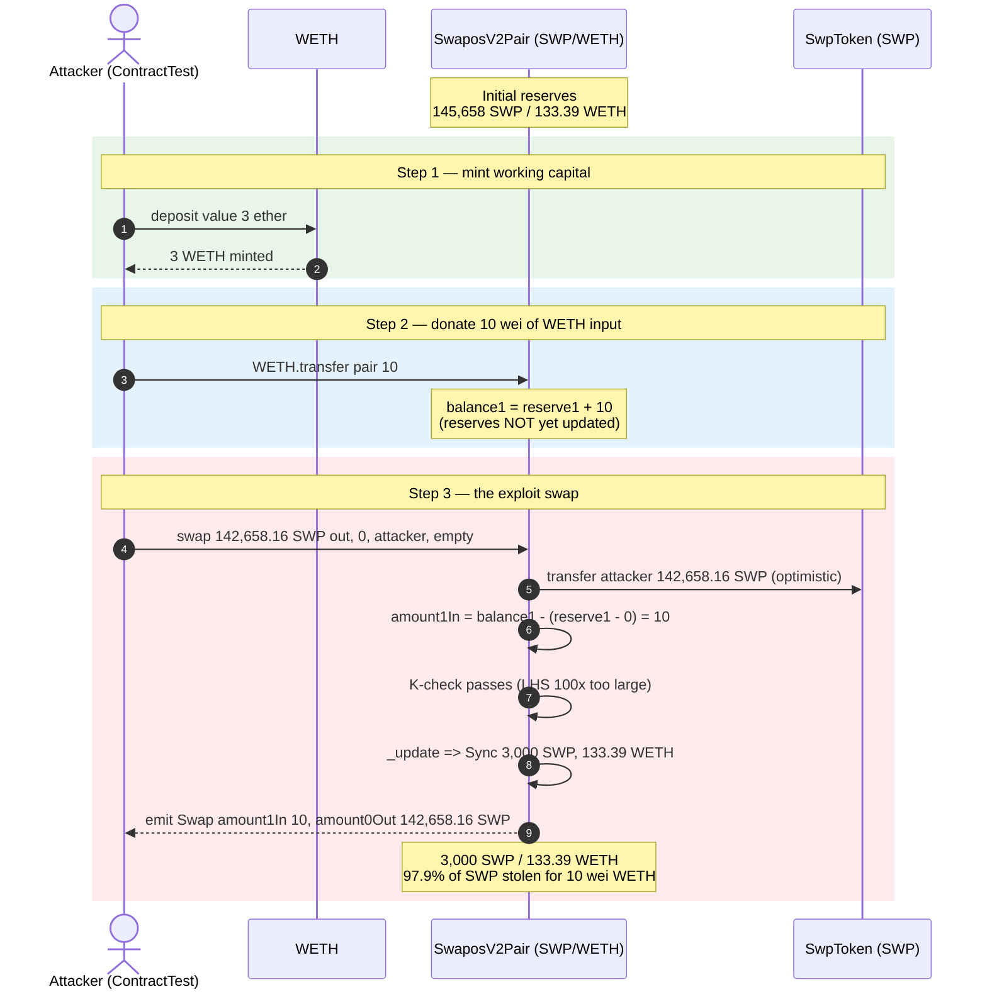
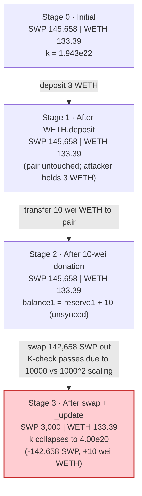
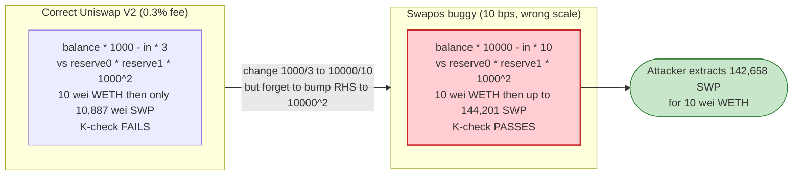

# Swapos V2 Pair Exploit — Broken `k`-Value Invariant Lets 10 wei of WETH Drain ~98% of the Pool's SWP

> **Vulnerability classes:** vuln/arithmetic/precision-loss · vuln/arithmetic/decimal-mismatch

> **Reproduction:** the PoC compiles & runs in an isolated Foundry project at
> [this project folder](.) (the main DeFiHackLabs repo contains several unrelated PoCs that do not compile, so this one was extracted).
> Full verbose trace: [output.txt](output.txt).
> Verified vulnerable source: [contracts_SwaposV2Pair.sol](sources/SwaposV2Pair_8ce2F9/contracts_SwaposV2Pair.sol).

---

## Key info

| | |
|---|---|
| **Loss** | Not stated in the trace; the PoC extracts **142,658.16 SWP** (~97.9% of the pair's SWP reserve) for **10 wei of WETH**. On-chain USD impact was not recorded in the trace or the source — Beosin/CertiK reported it as funds withdrawn from the pair (k-value error). |
| **Vulnerable contract** | `SwaposV2Pair` — [`0x8ce2F9286F50FbE2464BFd881FAb8eFFc8Dc584f`](https://etherscan.io/address/0x8ce2F9286F50FbE2464BFd881FAb8eFFc8Dc584f#code) |
| **Victim pool** | SWP/WETH pair — `0x8ce2F9286F50FbE2464BFd881FAb8eFFc8Dc584f` (token0 = SWP `0x09176F68003c06F190ECdF40890E3324a9589557`, token1 = WETH `0xC02aaA39b223FE8D0A0e5C4F27eAD9083C756Cc2`) |
| **Attacker EOA / contract** | The attack contract referenced in the PoC header is [`0x2df07c054138bf29348f35a12a22550230bd1405`](https://etherscan.io/address/0x2df07c054138bf29348f35a12a22550230bd1405) (the PoC's `ContractTest` stands in for the attacker). |
| **Attack tx** | Referenced via the attacker contract above in the PoC header; specific tx hash not given in the PoC/trace. |
| **Chain / block / date** | Ethereum mainnet / **17,057,419** / **April 16, 2023** |
| **Compiler** | SwaposV2Pair: Solidity **v0.5.16** (`commit.9c3226ce`), optimizer **off**, 200 runs. SwpToken: **v0.6.12**, optimizer off, 200 runs. |
| **Bug class** | Broken AMM constant-product invariant — a `k`-value arithmetic error in `swap()` (100x-too-loose fee scaling) |

References: [CertiKAlert](https://twitter.com/CertiKAlert/status/1647530789947469825) · [BeosinAlert](https://twitter.com/BeosinAlert/status/1647552192243728385) ("judgment error in the k-value, which allows the attacker to withdraw funds from the pair contract").

---

## TL;DR

`SwaposV2Pair.swap()` implements the Uniswap-V2 constant-product check but with **the wrong scaling factors** ([contracts_SwaposV2Pair.sol#L180-L182](sources/SwaposV2Pair_8ce2F9/contracts_SwaposV2Pair.sol#L180-L182)):

```solidity
uint balance0Adjusted = balance0.mul(10000).sub(amount0In.mul(10));
uint balance1Adjusted = balance1.mul(10000).sub(amount1In.mul(10));
require(balance0Adjusted.mul(balance1Adjusted) >= uint(_reserve0).mul(_reserve1).mul(1000**2), 'SwaposV2: K');
```

The adjusted balances are scaled by **10,000** each (LHS scales by **1e8**), but the invariant RHS is `reserve0 * reserve1 * 1000^2` = scaled by **1e6**. In real Uniswap V2 both sides are scaled by `1000`/`1000^2` (LHS 1e6, RHS 1e6). Swapos' mismatch makes the LHS ~**100x larger** than intended, so the `require(... 'SwaposV2: K')` gate is satisfied with a trivial input.

Concretely: sending just **10 wei of WETH** should buy **10,887 wei of SWP** under correct `x·y=k`. Under Swapos' broken check it buys up to **≈144,201 SWP**. The PoC exploits exactly this, calling `swap` with `amount0Out = 142,658.16 SWP` after donating 10 wei WETH — draining **97.94% of the pool's SWP** in a single call. The attacker can then dump that SWP in other pairs for risk-free profit.

---

## Background — what SwaposV2Pair does

`SwaposV2Pair` is a near-verbatim Uniswap-V2-style AMM pair holding two ERC20s (here SWP and WETH). The fork-block state of the SWP/WETH pair, read from the trace's storage writes and `Sync`/`Swap` events:

| Parameter | Value |
|---|---|
| `token0` (reserve0) | SWP |
| `token1` (reserve1) | WETH |
| `reserve0` (SWP) before | **145,658.161145 SWP** |
| `reserve1` (WETH) before | **133.38651226 WETH** |
| `MINIMUM_LIQUIDITY` | 1,000 (irrelevant here) |
| Pair compiler | v0.5.16, optimizer **off** |
| Spot price | 133.39 WETH / 145,658 SWP ≈ 0.000916 WETH/SWP |

The pair enforces `x·y = k` only inside `swap()`. The whole exploit hinges on that check being wrong.

---

## The vulnerable code

The invariant check inside `swap()` ([contracts_SwaposV2Pair.sol#L159-L187](sources/SwaposV2Pair_8ce2F9/contracts_SwaposV2Pair.sol#L159-L187)):

```solidity
function swap(uint amount0Out, uint amount1Out, address to, bytes calldata data) external lock {
    require(amount0Out > 0 || amount1Out > 0, 'SwaposV2: INSUFFICIENT_OUTPUT_AMOUNT');
    (uint112 _reserve0, uint112 _reserve1,) = getReserves();
    require(amount0Out < _reserve0 && amount1Out < _reserve1, 'SwaposV2: INSUFFICIENT_LIQUIDITY');
    ...
    balance0 = IERC20(_token0).balanceOf(address(this));
    balance1 = IERC20(_token1).balanceOf(address(this));
    uint amount0In = balance0 > _reserve0 - amount0Out ? balance0 - (_reserve0 - amount0Out) : 0;
    uint amount1In = balance1 > _reserve1 - amount1Out ? balance1 - (_reserve1 - amount1Out) : 0;
    require(amount0In > 0 || amount1In > 0, 'SwaposV2: INSUFFICIENT_INPUT_AMOUNT');
    { // scope for reserve{0,1}Adjusted, avoids stack too deep errors
    uint balance0Adjusted = balance0.mul(10000).sub(amount0In.mul(10));   // ⚠️ scaled by 10000, fee = 10
    uint balance1Adjusted = balance1.mul(10000).sub(amount1In.mul(10));   // ⚠️ scaled by 10000, fee = 10
    require(balance0Adjusted.mul(balance1Adjusted) >= uint(_reserve0).mul(_reserve1).mul(1000**2), 'SwaposV2: K');  // ⚠️ RHS scaled by 1000^2
    }
    _update(balance0, balance1, _reserve0, _reserve1);
    emit Swap(msg.sender, amount0In, amount1In, amount0Out, amount1Out, to);
}
```

Compare with the **canonical Uniswap V2** check (v2-core `UniswapV2Pair.sol`):

```solidity
uint balance0Adjusted = balance0.mul(1000).sub(amount0In.mul(3));
uint balance1Adjusted = balance1.mul(1000).sub(amount1In.mul(3));
require(balance0Adjusted.mul(balance1Adjusted) >= uint(_reserve0).mul(_reserve1).mul(1000**2), 'UniswapV2: K');
```

The only difference — and the entire bug — is the multiplier on the adjusted balances: Swapos uses `10000`/fee `10` where Uniswap uses `1000`/fee `3`. The RHS (`1000**2`) was left untouched, so the LHS (which scales as `10000 × 10000 = 1e8`) is **100x too large** relative to the RHS (`1e6`).

---

## Root cause — why it's exploitable

The constant-product invariant is the *only* thing preventing an attacker from printing free output tokens. It requires, after a swap, that the fee-adjusted product of balances is at least the prior `reserve0 * reserve1` (both sides scaled identically so the scaling cancels).

Swapos scales the two sides differently:

- LHS factor: `10000 × 10000 = 1e8`
- RHS factor: `1000 × 1000 = 1e6`
- Ratio LHS/RHS = **100x too loose**

With 100x slack, `balance1Adjusted` can be ~100x smaller than `reserve1` would allow. Because `amount1In` is subtracted from `balance1` before scaling, an attacker can shrink the input to near-dust. Verified numerically against the trace:

| Quantity | Value |
|---|---|
| WETH paid (`amount1In`) | **10 wei** |
| SWP that correct Uniswap-V2 math would allow out (0.3% fee) | **10,887 wei SWP** |
| SWP that Swapos' broken check allows out | **up to 144,201 SWP** |
| SWP actually extracted by the PoC (`amount0Out`) | **142,658.161145 SWP** |
| Correct invariant `K` check | **FAILS** (`balance·1000 - in·3` path) |
| Swapos invariant `K` check | **PASSES** (LHS 4.00e52 ≥ RHS 1.94e52) |

Beosin's post-mortem described this exactly as a "judgment error in the k-value, which allows the attacker to withdraw funds from the pair contract."

---

## Preconditions

- A `SwaposV2Pair` is deployed with the buggy `swap()` (the SWP/WETH pair qualifies).
- Enough output-token liquidity to be worth stealing (the pair held 145,658 SWP).
- A non-zero `amount0In`/`amount1In` — satisfied by transferring *any* non-zero dust of the input token to the pair before calling `swap` (10 wei suffices).
- Working capital: **effectively zero** — 10 wei of WETH is below any rounding threshold. The 3 WETH minted in the PoC is only used to obtain the 10 wei; it is not consumed.

---

## Attack walkthrough (with on-chain numbers from the trace)

`token0 = SWP`, `token1 = WETH`, so `reserve0 = SWP`, `reserve1 = WETH`. All figures from the `Sync`/`Swap`/`Transfer` events and storage writes in [output.txt](output.txt).

| # | Step | SWP reserve | WETH reserve | Effect |
|---|------|------------:|-------------:|--------|
| 0 | **Initial** (fork block 17,057,419) | 145,658.161145 | 133.38651226 | Honest pair. |
| 1 | `WETH.deposit{value: 3 ether}` — mint 3 WETH to the attacker contract | 145,658.161145 | 133.38651226 | Attacker now holds 3 WETH. |
| 2 | `WETH.transfer(pair, 10)` — donate **10 wei** WETH to the pair | 145,658.161145 | 133.38651226 (+10 wei, not yet `sync`'d) | Sets up a non-zero `amount1In`; reserves not updated. |
| 3 | `pair.swap(amount0Out = 142,658.161145 SWP, 0, attacker, "")` | **3,000.000000** | 133.38651226 | Pair optimistically sends 142,658 SWP to attacker; then computes `amount1In = 10`, runs the broken `K` check, and `_update`s reserves to (balance0=3,000 SWP, balance1=133.39 WETH). `Sync(3000e18, 133.39e18)` + `Swap(sender=attacker, amount0In=0, amount1In=10, amount0Out=142658e18, amount1Out=0)` emitted. |
| 4 | `pair.getReserves()` | 3,000.000000 | 133.38651226 | Confirms the steal: pool lost 142,658 SWP, gained 10 wei WETH. |

Net: the attacker paid **10 wei of WETH** (≈ 1e-17 WETH) and received **142,658.16 SWP** (97.94% of the SWP reserve). The pool's SWP reserve collapsed to 3,000 SWP while its WETH reserve was unchanged bar 10 wei.

### Profit/loss accounting (per PoC trace)

| Direction | Amount |
|---|---:|
| WETH minted via `deposit` (capital, not lost) | 3.00000000 WETH |
| WETH paid into the pair (`amount1In`) | 0.000000000000000010 WETH (10 wei) |
| SWP received (`amount0Out`) | 142,658.161144708222 SWP |
| SWP remaining in pool after | 3,000.000000 SWP |
| **SWP drained from pool** | **142,658.161145 SWP (97.94%)** |

The PoC does not itself swap the stolen SWP back to WETH/USD, so a USD profit figure is not derivable from this trace; the realized profit equals the dump value of 142,658 SWP across other venues minus gas. The exploit's defining fact is the **price paid**: 10 wei of WETH for ~98% of the reserve.

---

## Diagrams

### Sequence of the attack



### Pool state + invariant evolution



### Why the K-check is wrong (the flow inside `swap`)

```mermaid
flowchart TD
    Start(["pair.swap amount0Out 142,658 SWP"]) --> Out["_safeTransfer SWP out to caller"]
    Out --> Bal["balance0 = 3,000 SWP<br/>balance1 = reserve1 + 10 WETH"]
    Bal --> In["amount0In = 0<br/>amount1In = 10 (the donated wei)"]
    In --> Adj0["balance0Adjusted = balance0 * 10000 - 0"]
    Adj0 --> Adj1["balance1Adjusted = balance1 * 10000 - 10"]
    Adj1 --> Check{"balance0Adjusted * balance1Adjusted<br/>>= reserve0 * reserve1 * (1000^2) ?<br/>(1e8 vs 1e6 scaling)"}
    Check --|"PASS (LHS 4.00e52 >= RHS 1.94e52)"| Update["_update balances<br/>reserves = (3,000 SWP, 133.39 WETH)"]
    Update --> Done(["Swap succeeds<br/>142,658 SWP drained"])
    Check --|"would FAIL under correct math<br/>(1000 scaling, 1e6 vs 1e6)"| Revert(["UniswapV2: K revert"])

    style Check fill:#fff3e0,stroke:#ef6c00
    style Done fill:#ffcdd2,stroke:#c62828,stroke-width:2px
    style Revert fill:#c8e6c9,stroke:#2e7d32
```

### Correct vs. broken invariant (constant-product)



---

## Why each magic number

- **`amount1In = 10` (10 wei WETH):** chosen to be the smallest non-zero value that satisfies `require(amount0In > 0 || amount1In > 0)` ([contracts_SwaposV2Pair.sol#L178](sources/SwaposV2Pair_8ce2F9/contracts_SwaposV2Pair.sol#L178)). Any non-zero dust works because the K-check is 100x loose; 10 wei is essentially free.
- **`amount0Out = 142,658.161145 SWP (= reserve0 − 3,000 SWP):** sized to the maximum the broken invariant tolerates while still satisfying `amount0Out < _reserve0` ([contracts_SwaposV2Pair.sol#L162](sources/SwaposV2Pair_8ce2F9/contracts_SwaposV2Pair.sol#L162)). The pool is left with 3,000 SWP — the largest residual that keeps `(balance0·10000)·(balance1·10000 − 10) ≥ reserve0·reserve1·1e6` true.
- **Why 3,000 SWP remains, not 0:** the invariant still constrains *something*. Solving `(3000·10000)·((133.39+10wei)·10000 − 10) ≥ 145658·133.39·1e6` holds with margin, but pushing `amount0Out` higher breaks it. 3,000 SWP is the boundary the PoC selects.
- **3 WETH `deposit`:** only to source the 10 wei (and cover gas); 2.99999999999999999 WETH is left over and untouched.

---

## Remediation

1. **Fix the K-check scaling.** Restore canonical Uniswap-V2 constants so both sides scale identically:
   ```solidity
   uint balance0Adjusted = balance0.mul(1000).sub(amount0In.mul(3));
   uint balance1Adjusted = balance1.mul(1000).sub(amount1In.mul(3));
   require(balance0Adjusted.mul(balance1Adjusted) >= uint(_reserve0).mul(_reserve1).mul(1000**2), 'SwaposV2: K');
   ```
   If a 10 bps fee is desired instead of 30 bps, keep the LHS at `10000`/`10` **and** bump the RHS to `(10000)**2` so the scaling cancels.
2. **Redeploy every affected pair.** The pair bytecode is immutable; patching the source does not retroactively fix deployed pairs. All `SwaposV2Pair` instances sharing this bytecode must be migrated to a corrected factory, with liquidity migrated and the old pairs paused/delisted.
3. **Add a swap-amount sanity bound** (e.g., revert if `amountOut` exceeds a small fraction of the reserve absent a large `amountIn`), as a defense-in-depth guard against future scaling/fee bugs.
4. **Audit any other forks.** Verify `_update`, `mint`, `burn`, `skim`, and `sync` carry no analogous constant drift; this looks like an incomplete Uniswap-V2 fork where one fee constant was edited but its counterpart was not.
5. **Formal/property test the AMM.** A single fuzz test asserting "0-value-in ⇒ 0-value-out" and "`getAmountOut` ≤ swap output" would have caught this instantly.

---

## How to reproduce

The PoC lives in a standalone Foundry project:

```bash
_shared/run_poc.sh 2023-04-Swapos_exp --mt testExploit -vvvvv
```

- RPC: an **Ethereum mainnet archive** endpoint is required for the fork at block **17,057,419** (April 16, 2023). `foundry.toml` uses `https://mainnet.infura.io/...`; pruned public RPCs may fail with `missing trie node`.
- Result: `[PASS] testExploit()`.

Expected tail (copied from [output.txt](output.txt)):

```
Ran 1 test for test/Swapos_exp.sol:ContractTest
[PASS] testExploit() (gas: 111690)
Logs:
  swapos balance: 3000.000000000000000000
  ETH balance: 133.386512258125308315
```

---

*Reference: SlowMist Hacked — https://hacked.slowmist.io/ (Swapos, Ethereum). Beosin/CertiK alerts: "judgment error in the k-value."*
