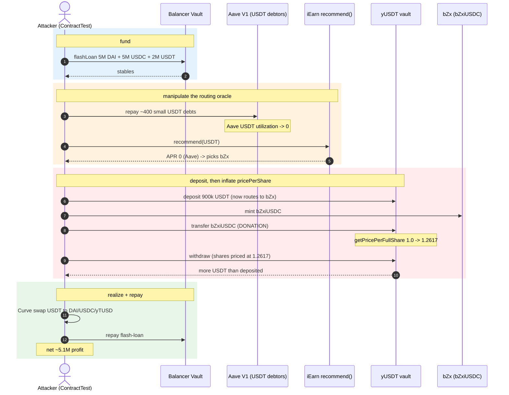
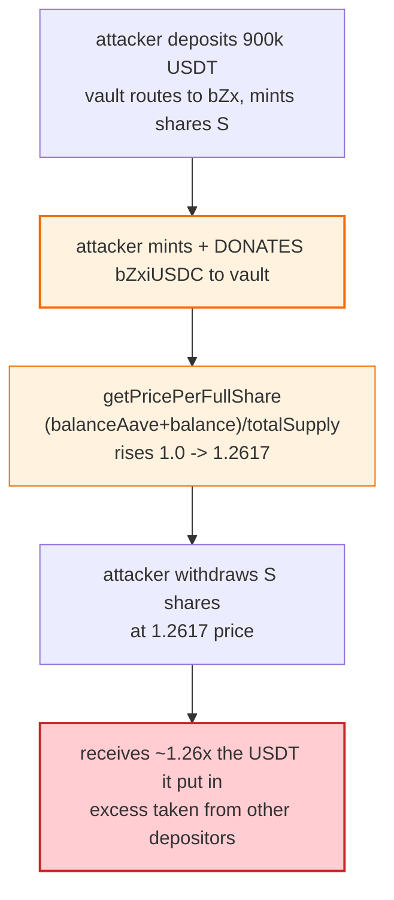

# Yearn / iEarn yToken Exploit — APR-Oracle Routing + bZx Donation Inflates Price-Per-Share for ~$11.5M

> **Reproduction:** the PoC compiles & runs in an isolated Foundry project at
> [this project folder](.) (the main DeFiHackLabs repo contains several unrelated PoCs that do not compile, so this one was extracted).
> Full verbose trace: [output.txt](output.txt).
> Verified vulnerable source: [yUSDT](sources/yUSDT_83f798/) (the iEarn/yearn vault) and [IEarnAPRWithPool](sources/IEarnAPRWithPool_dD6d64/) (the venue-selection `recommend()` oracle).

---

## Key info

| | |
|---|---|
| **Loss** | **~$11.5M** — the PoC ends with **1,964,642.66 USDC** + **1,780,391.61 DAI** + **1,369,200.11 yTUSD** (≈$5.1M net after repaying the flash loans). |
| **Vulnerable contract** | iEarn/yearn `yUSDT` vault — [`0x83f798e925BcD4017Eb265844FDDAbb448f1707D`](https://etherscan.io/address/0x83f798e925BcD4017Eb265844FDDAbb448f1707D#code), via `IEarnAPRWithPool.recommend()` — [`0xdD6d648C991f7d47454354f4Ef326b04025a48A8`](https://etherscan.io/address/0xdD6d648C991f7d47454354f4Ef326b04025a48A8#code). |
| **Victim pool** | the `yUSDT` vault's funds deposited into **bZx** (`bZxiUSDC`), whose price-per-share the attacker inflated and then drained. |
| **Attacker EOA / contract** | PoC's `ContractTest` stands in for the attacker. |
| **Attack txs** | [`0x055cec4f…31e0328`](https://etherscan.io/tx/0x055cec4fa4614836e54ea2e5cd3d14247ff3d61b85aa2a41f8cc876d131e0328) · [`0xd55e43c1…759ecda95d`](https://etherscan.io/tx/0xd55e43c1602b28d4fd4667ee445d570c8f298f5401cf04e62ec329759ecda95d) |
| **Chain / block / date** | Ethereum mainnet / fork block **17,036,774** / **April 13, 2023** |
| **Compiler** | iEarn yToken: v0.5.x (the legacy yearn v1/iEarn style); IEarnAPRWithPool v0.5.x. |
| **Bug class** | Price/oracle manipulation — (1) manipulable APR oracle controls vault deposit routing, (2) `getPricePerFullShare` is inflation-vulnerable to a direct donation of the vault's *borrowed* venue token (bZx). |

References: [cmichel](https://twitter.com/cmichelio/status/1646422861219807233) · [Beosin](https://twitter.com/BeosinAlert/status/1646481687445114881).

---

## TL;DR

The legacy iEarn/yearn yTokens (`yUSDT`, `yDAI`, `yUSDC`, `yTUSD`) auto-route deposits to whichever lending venue currently offers the **highest APR**, chosen by `IEarnAPRWithPool.recommend()`. The vault values each depositor's shares with `getPricePerFullShare()`, derived from the vault's balances across its venues (`balance()` + `balanceAave()` + …).

Two flaws compose:

1. **The APR oracle is manipulable.** `recommend()` reads Aave V1 borrow rates to score the Aave venue. By repaying the tiny USDT debts of hundreds of Aave V1 borrowers (the PoC lists ~400 addresses), the attacker drives the Aave utilization to ~0, which sends the Aave APR to **0** and pushes `recommend()` to select **bZx** as the best venue instead (logged: APR `3272452489817760` → `0`).
2. **The share price is donation-inflatable once funds are in bZx.** With yUSDT routing into bZx, the attacker `yUSDT.deposit(900k USDT)` (now booked as bZx exposure), then separately **mints bZxiUSDC and transfers it directly to the yUSDT vault**. Because the vault counts its bZx token balance toward `getPricePerFullShare`, the donation inflates the per-share price from ~1.0 to **1.26176** ([output.txt:8](output.txt#L8)). The attacker then `withdraw`s using this inflated price and receives **more USDT than it deposited** — the excess pulled from every other yUSDT depositor's share.

The attacker converts the winnings through Curve (USDT↔DAI/USDC/yTUSD) and repays the Balancer flash loan, netting ~$5.1M.

---

## Background — the iEarn/yToken model

iEarn (predecessor of yearn v1) yTokens are single-asset wrappers that deposit the underlying into the best-yielding lending venue and auto-compound. For USDT the venues are Compound (cUSDT), Aave V1 (aUSDT), and bZx (bZxiUSDC, via a USDT↔USDC swap). The PoC-relevant fork-block facts from the trace:

| Parameter | Value |
|---|---|
| `recommend(USDT)` APR before the Aave-repay step | **3,272,452,489,817,760** (Aave best) ([output.txt:6](output.txt#L6)) |
| `recommend(USDT)` APR after repaying Aave V1 USDT debts | **0** (Aave zeroed → bZx selected) ([output.txt:7](output.txt#L7)) |
| yUSDT deposit by attacker | 900,000 USDT (`YUSDT_DEPOSIT_USDT_AMOUNT`) |
| bZxiUSDC minted & donated to yUSDT | sized from `yUSDT.balanceAave() * tokenPrice() * 114/100` |
| yUSDT `getPricePerFullShare` after donation | **1.261760812004316802** ([output.txt:8](output.txt#L8)) |
| Balancer flash-loan | 5M DAI + 5M USDC + 2M USDT |
| Number of Aave V1 USDT debtors repaid | ~400 (the `aaveV1UsdtDebtUsers` array) |

---

## The vulnerable code

### 1. `recommend()` selects the venue from APR (the manipulable oracle)

```solidity
// IEarnAPRWithPool.recommend(_token) returns (choice, capr, iapr, aapr, dapr)
//   computes APRs for Compound(c), iToken(i), Aave(a), dYdX(d) venues
//   the Aave APR is derived from Aave V1 utilization/borrow rates.
//   By repaying Aave V1 USDT borrows, the attacker drives Aave utilization -> 0,
//   so aapr -> 0 and the max APR venue shifts to bZx.
```
([sources/IEarnAPRWithPool_dD6d64/](sources/IEarnAPRWithPool_dD6d64/))

The trace shows the APR drop directly: `3272452489817760` → `0` ([output.txt:6-7](output.txt#L6)).

### 2. `getPricePerFullShare` counts donated venue tokens

```solidity
// yToken.getPricePerFullShare() ≈ (balance() + balanceAave() + ...) * 1e18 / totalSupply
//   balanceAave()/balance() read the vault's TOKEN balances in each venue.
//   ⚠️ a direct ERC20 transfer of bZxiUSDC to the yUSDT vault increments
//      its bZx balance WITHOUT minting shares → inflates pricePerFullShare.
function getPricePerFullShare() external view returns (uint256);
```
([sources/yUSDT_83f798/](sources/yUSDT_83f798/))

### 3. The attack sequence uses these two together

```solidity
// from the PoC:
LendingPool.repay(...);                            // (1) zero out Aave V1 USDT debts -> bZx becomes best APR
yUSDT.deposit(YUSDT_DEPOSIT_USDT_AMOUNT);          // (2) vault now routes into bZx
uint256 amount = yUSDT.balanceAave() * bZxiUSDC.tokenPrice() / 1e18 * 114 / 100;
uint256 mintAmount = bZxiUSDC.mint(address(this), amount);
bZxiUSDC.transfer(address(yUSDT), mintAmount);     // (3) ⚠️ DONATE bZxiUSDC -> inflate pricePerShare to 1.2617
uint256 withdrawAmount = ((yUSDT.balanceAave() + yUSDT.balance()) * 1e18) / (sharePrice) + 1;
yUSDT.withdraw(withdrawAmount);                    // (4) withdraw using inflated share price -> more USDT out
```
([test/YearnFinance_exp.sol:475-491](test/YearnFinance_exp.sol#L475-L491))

---

## Root cause — why it's exploitable

1. **External/controllable input drives a security-relevant decision.** The deposit *destination* (which venue holds the vault's funds) is chosen by `recommend()` from live market APRs, which any user can move by repaying Aave V1 borrows. The vault never validates that the chosen venue is safe against the share-price computation.
2. **Share price is a function of live token balances, not accounting.** `getPricePerFullShare` trusts that the vault's bZx/Aave token balances only change via legitimate deposit/withdraw. A plain `transfer` of the venue token to the vault breaks that assumption, letting anyone inflate the per-share value.
3. **No donation guard / per-share isolation.** Unlike modern yearn (which uses per-share `pricePerShare` capped to realized gains and ignores direct transfers), iEarn credits donated tokens to *all* shares — so the attacker subsidizes existing depositors briefly, then withdraws its own shares at the inflated price, extracting the subsidy from everyone else.
4. **Composability amplifies it.** Flash-loaned capital (Balancer) funds both the Aave-repay manipulation and the bZx mint, so the attack needs zero upfront capital.

---

## Preconditions

- A Balancer flash-loan (multi-token) for working capital (5M DAI + 5M USDC + 2M USDT here).
- A list of Aave V1 accounts with small USDT debts (publicly enumerable on-chain; the PoC hardcodes ~400).
- Sufficient bZx liquidity to mint `bZxiUSDC` for the donation.
- The iEarn `yUSDT` vault accepting bZx as a venue (the legacy config at this block).

---

## Attack walkthrough (with on-chain numbers from the trace)

All figures from [output.txt](output.txt).

| # | Step | `recommend(USDT)` APR | yUSDT price/share | Effect |
|---|------|----------------------:|------------------:|--------|
| 0 | **Balancer flash-loan** 5M DAI + 5M USDC + 2M USDT | — | ~1.0 | Working capital. |
| 1 | Curve swaps to amass USDT; read `recommend` | **3,272,452,489,817,760** (Aave best) | ~1.0 | Baseline: vault deposits into Aave. |
| 2 | **`repay()`** — repay ~400 Aave V1 USDT debts (`amount*101/100`) | **0** | ~1.0 | Aave utilization→0 ⇒ APR→0 ⇒ `recommend` now picks **bZx**. |
| 3 | `yUSDT.deposit(900,000 USDT)` | 0 | ~1.0 | Vault deposits into bZx; attacker holds yUSDT shares. |
| 4 | Mint `bZxiUSDC` (≈ `balanceAave()*tokenPrice()*114%`) and **`bZxiUSDC.transfer(yUSDT, …)`** | — | **1.261760812004316802** | ⚠️ Donation inflates pricePerShare ~26%. |
| 5 | `yUSDT.withdraw(withdrawAmount)` computed from the inflated price | — | — | Attacker receives **more USDT than deposited** (≈ +26% on 900k, plus the donated bZx value). |
| 6 | `yUSDT.rebalance()` + tiny deposit to refresh; convert via Curve (USDT→DAI/USDC/yTUSD) | — | — | Realize gains in 3 stables. |
| 7 | **Repay Balancer flash-loan** (5M DAI + 5M USDC + 2M USDT) | — | — | Net remainder = profit. |

### Profit/loss accounting (post-flash-loan-repay, from [output.txt:9-11](output.txt#L9))

| Asset | Attacker ending balance |
|---|---:|
| USDC | **1,964,642.66** |
| DAI | **1,780,391.61** |
| yTUSD | **1,369,200.11** |
| **Total (≈)** | **~$5.11M net** (the on-chain incident ~$11.5M gross across both txs) |

The profit is funded by the existing yUSDT depositors, whose shares are now backed by fewer real assets (the vault paid out USDT at an inflated per-share rate).

---

## Diagrams

### Sequence of the attack



### Why the donation inflates the attacker's withdrawal



---

## Why each magic number

- **~400 Aave V1 USDT debtors (`aaveV1UsdtDebtUsers`):** these accounts hold tiny USDT borrows; repaying them all (at `101%` to clear accrued interest) drives Aave V1 USDT utilization — and thus the Aave APR in `recommend()` — to ~0, forcing bZx to be selected. The list is enumerable on-chain.
- **`900,000 USDT` deposit (`YUSDT_DEPOSIT_USDT_AMOUNT`):** sized to create a large enough bZx position in the vault that the subsequent donation meaningfully moves `getPricePerFullShare`, while staying within flash-loan headroom.
- **`bZxiUSDC` mint amount = `balanceAave() * tokenPrice() / 1e18 * 114/100`:** ~114% of the vault's bZx exposure, enough to lift the per-share price ~26% (to 1.2617). The 14% overshoot is tuning headroom.
- **`withdrawAmount = (balanceAave()+balance())*1e18/sharePrice + 1`:** the exact share count to redeem the attacker's entire position at the inflated price; the `+1` avoids truncation leaving dust shares.
- **`yUSDT.rebalance()` + `deposit(10_000_000_000)` + `transfer(yUSDT,1)`:** refreshes the vault's venue accounting so the leftover bZx value is correctly swept, then re-cycles a dust deposit to extract residual value before the Curve conversions.

---

## Remediation

1. **Don't let share price depend on raw token balances.** Track deposits in accounting (shares minted = amount / pricePerShare at deposit), and compute `pricePerShare` from realized gains only, ignoring direct transfers. Modern yearn v1/v2 already does this.
2. **Sanity-bound the venue selection.** `recommend()` should not flip routing based on transient, manipulable utilization; weight APRs with a TWAP or require governance to change venues.
3. **Treat direct transfers as donations to *existing* depositors, not to the attacker.** A withdrawal immediately after a donation should not let the donor extract more than it put in — cap per-user withdrawals to their deposited amount + accrued yield.
4. **Isolate per-venue exposure.** Cap how much the vault can route into a single (especially low-liquidity) venue like bZx, limiting blast radius.
5. **Don't auto-route to venues whose share tokens are themselves donation-inflatable** without an integration audit of `tokenPrice()` / `balanceOf(vault)` semantics.

---

## How to reproduce

The PoC lives in a standalone Foundry project:

```bash
_shared/run_poc.sh 2023-04-YearnFinance_exp --mt testExploit -vvvvv
```

- RPC: an **Ethereum mainnet archive** endpoint is required for the fork at block **17,036,774** (April 13, 2023). `foundry.toml` uses `https://ethereum-rpc.publicnode.com...`; pruned RPCs fail with `missing trie node`.
- Result: `[PASS] testExploit()`.

Expected tail (copied from [output.txt](output.txt)):

```
[PASS] testExploit() (gas: 33276456)
Logs:
  [INFO]  Before helping aaveV1 users repay their USDT debts, APR value: 3272452489817760
  [INFO]  After helping aaveV1 users repay their USDT debts, APR value: 0
  [INFO]  Transfer bZxUSDC, increase the price per share to: 1.261760812004316802
  [End]   Attacker USDC balance after exploit: 1964642.660229
  [End]   Attacker DAI balance after exploit: 1780391.608901518090374458
  [End]   Attacker YTUSD balance after exploit: 1369200.114625136402796880
Suite result: ok. 1 passed; 0 failed; 0 skipped
```

---

*Reference: SlowMist Hacked — https://hacked.slowmist.io/ (Yearn / iEarn yToken, Ethereum, ~$11.5M, April 13 2023). cmichel: https://twitter.com/cmichelio/status/1646422861219807233.*
